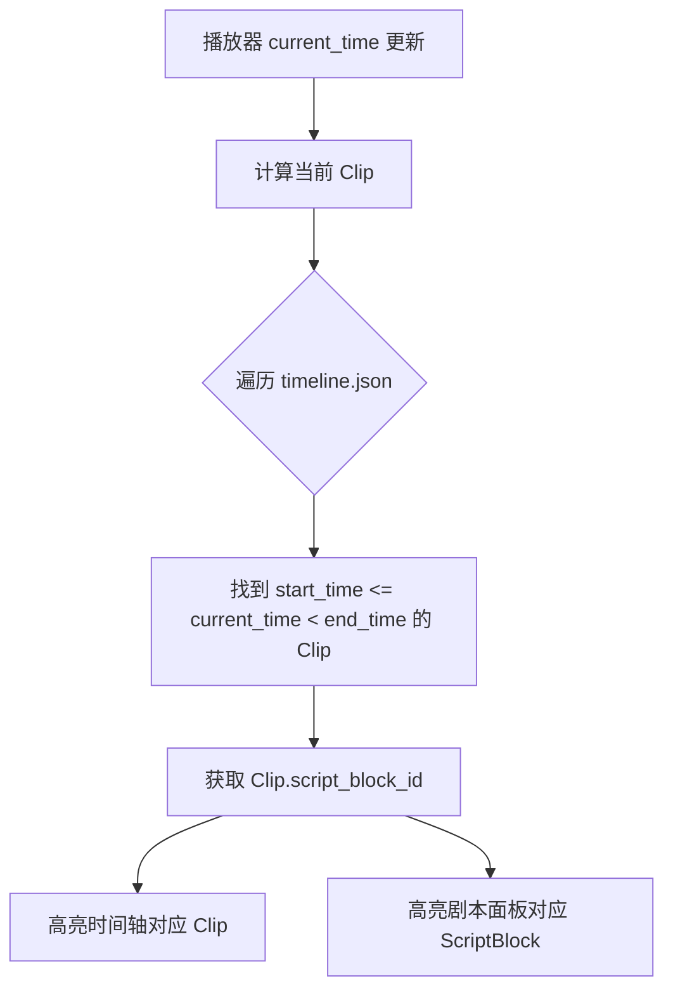
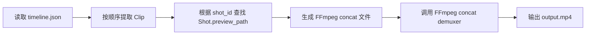
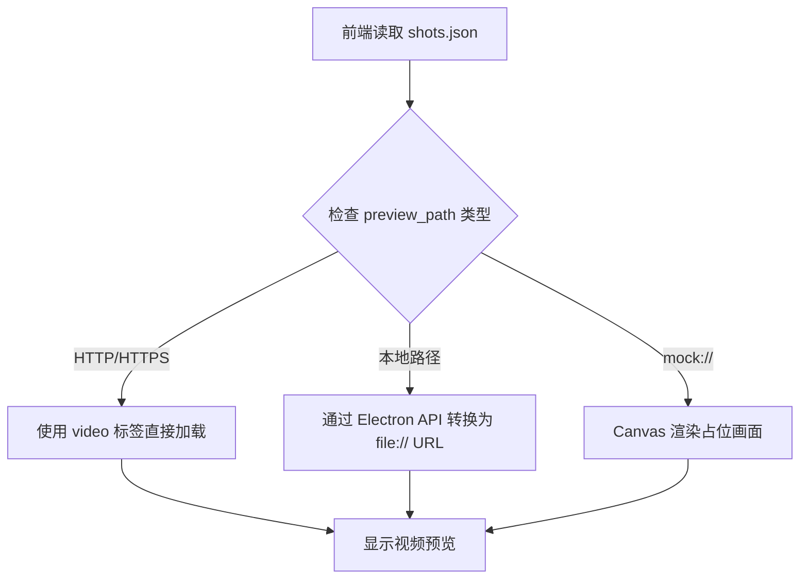
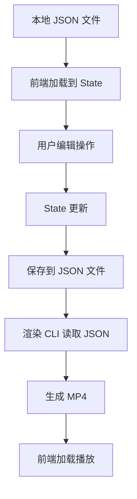

# cgcut - 导演分镜验证 MVP 设计文档

## 一、产品定位与核心原则

### 1.1 产品定义

cgcut 是一个**导演分镜验证工具**，而非完整的非线性编辑器（NLE）。

**核心目标**：在分镜阶段快速验证"剧本段落 × 镜头组合 × 实际节奏"是否成立。

**成功标准**：导演在 30 分钟内从剧本到可播放时间轴，快速发现节奏问题。

### 1.2 硬性约束（禁止实现）

以下功能**严格禁止**实现：

- 完整的 NLE 剪辑软件能力
- 资产管理平台或素材数据库
- 多轨时间轴
- 音频轨编辑
- 特效/转场/调色
- 复杂渲染参数 UI（支持基础裁剪的 in/out 点调整）
- 语义搜索/向量数据库/多模态模型
- 微服务架构或复杂后端服务

### 1.3 能力边界

| 类型 | 允许 | 禁止 |
|------|------|------|
| 时间轴 | 单轨、顺序拖拽、删除、基础裁剪（in/out 点） | 多轨、复杂特效、逐帧编辑 |
| 素材 | 占位替换、预览 | 资产管理、版本控制、元数据编辑 |
| 播放 | 预渲染视频顺序播放、同步高亮 | 实时合成、音频混音 |
| 数据 | 本地 JSON 文件 + 服务器素材接入 | ORM、关系型数据库 |

---

## 二、核心数据模型

系统只包含 **3 个核心数据对象**，通过 JSON 文件流转。

### 2.1 ScriptBlock（剧本段落）

表示剧本中的一个叙事单元（场景/节拍）。

| 字段 | 类型 | 说明 |
|------|------|------|
| id | string | 唯一标识符 |
| scene | string | 场景标识（如 "INT. 卧室 - 夜晚"） |
| text | string | 段落台词或描述 |
| emotion | string | 情绪标签（如 "紧张", "平静"） |
| expected_duration | number | 导演预期时长（秒） |

**计算属性**：
- `actual_duration`：该段落在时间轴中所有 Clip 的实际总时长（前端动态计算）

### 2.2 Shot（素材占位镜头）

表示可用的素材镜头（占位符或真实视频）。

| 字段 | 类型 | 说明 |
|------|------|------|
| id | string | 唯一标识符 |
| label | string | 镜头描述（如 "特写-手部"） |
| emotion | string | 情绪标签（用于筛选） |
| duration | number | 镜头时长（秒） |
| preview_path | string | 视频文件路径（服务器路径或 mock） |

**服务器接入规则**：
- `preview_path` 支持完整服务器路径（如 `http://server.com/shots/shot_001.mp4`）
- 支持本地文件路径（如 `/local/mock/shot_placeholder.mp4`）
- 前端通过 HTTP 请求或文件协议加载

### 2.3 Clip（时间轴镜头实例）

表示时间轴上的一个镜头实例。

| 字段 | 类型 | 说明 |
|------|------|------|
| id | string | 唯一标识符 |
| script_block_id | string | 所属剧本段落 ID |
| shot_id | string | 绑定的 Shot ID |
| trim_in | number | 裁剪起始点（秒，相对于 Shot 原始时长） |
| trim_out | number | 裁剪结束点（秒，相对于 Shot 原始时长） |
| duration | number | 裁剪后的实际时长（trim_out - trim_in） |

**约束**：
- 一个 Clip 必须关联一个 ScriptBlock 和一个 Shot
- `trim_in` 默认为 0，`trim_out` 默认为 Shot.duration
- 裁剪范围必须满足：`0 <= trim_in < trim_out <= Shot.duration`
- `duration` 由前端自动计算：`duration = trim_out - trim_in`

### 2.4 数据文件结构

```
project/
├── script_blocks.json    # ScriptBlock 数组
├── shots.json            # Shot 数组
└── timeline.json         # Clip 数组（时间轴状态）
```

---

## 三、核心功能模块

### 3.1 剧本段落面板（ScriptBlock Panel）

**功能描述**：
以卡片形式展示剧本段落列表，辅助导演理解当前时间轴与剧本的对应关系。

**显示内容**：
| 元素 | 说明 |
|------|------|
| 场景标识 | ScriptBlock.scene |
| 段落文本 | ScriptBlock.text（可截断） |
| 情绪标签 | ScriptBlock.emotion |
| 期望时长 | ScriptBlock.expected_duration |
| 实际时长 | 该段落在时间轴中所有 Clip 的总时长 |
| 差异提示 | 实际时长 vs 期望时长的差异（视觉高亮） |

**交互规则**：
1. 播放时自动高亮当前播放位置对应的 ScriptBlock
2. 点击卡片时，时间轴跳转到该段落第一个 Clip
3. 差异提示规则：
   - 实际时长 > 期望时长 ×1.2：显示橙色警告
   - 实际时长 < 期望时长 ×0.8：显示蓝色提示
   - 否则：显示绿色正常状态

**数据计算**：
- 遍历 timeline.json 中所有 Clip
- 按 script_block_id 分组
- 累加每组的 duration

### 3.2 受限线性时间轴（Timeline Editor）

**功能描述**：
单轨时间轴，用于排列镜头顺序和判断节奏，**不支持精细剪辑**。

**允许的操作**：
| 操作 | 说明 |
|------|------|
| 拖拽 Clip | 改变 Clip 在时间轴中的顺序 |
| 删除 Clip | 从时间轴移除 Clip（不影响 Shot 库） |
| 裁剪 Clip | 拖拽 Clip 两端手柄调整 in/out 点 |
| 播放控制 | 播放/暂停/跳转 |
| 播放头同步 | 播放时高亮当前 Clip |

**明确禁止的操作**：
- 多轨编辑
- 特效/转场添加
- 音频轨编辑
- 逐帧精确编辑
- 波形图显示

**视觉结构**：
- 横向单轨布局
- 每个 Clip 显示：Shot.label、duration、ScriptBlock 标识（颜色块）
- Clip 两端显示裁剪手柄（可拖拽的三角形或竖线）
- 播放头显示当前时间位置
- 时间刻度标尺显示：
  - 主刻度：每秒一个刻度线
  - 次刻度：每 0.5 秒一个短刻度线
  - 时间标签：每 5 秒显示一次时间文本（如 "0:00", "0:05", "0:10"）
  - 支持缩放级别切换（1x, 2x, 5x）

**时间轴计算逻辑**：
```
Clip[0].start_time = 0
Clip[i].start_time = Clip[i-1].start_time + Clip[i-1].duration
总时长 = Σ Clip.duration
```

**裁剪交互规则**：
1. **进入裁剪模式**：
   - 鼠标悬停在 Clip 边缘（左右 10px 区域）时，光标变为双向箭头
   - 点击并拖拽边缘手柄进入裁剪模式

2. **裁剪约束**：
   - 左手柄拖拽：调整 `trim_in`，范围 [0, trim_out - 0.1]
   - 右手柄拖拽：调整 `trim_out`，范围 [trim_in + 0.1, Shot.duration]
   - 最小裁剪时长：0.1 秒（防止 Clip 过短）

3. **实时反馈**：
   - 拖拽时显示当前 trim_in/trim_out 数值
   - Clip 宽度实时变化（按比例缩放）
   - 裁剪后自动重新计算 ScriptBlock.actual_duration

4. **视觉提示**：
   - 被裁剪的部分显示半透明蒙层
   - 保留的部分显示正常亮度

**拖拽实现策略**：
- 使用现有 TimelineEditor 组件（如存在）
- 启用基础裁剪功能
- 禁用高级功能（多轨、特效、逐帧编辑）
- 拖拽后重新计算所有 Clip 的 start_time

### 3.3 素材替换功能（Shot Library）

**功能描述**：
素材库作为"占位替换池"，用于快速更换时间轴中的镜头。

**使用流程**：


**替换规则**：
1. **前置条件**：必须先在时间轴选中一个 Clip
2. **执行替换**：
   - 更新 `Clip.shot_id` 为新 Shot 的 id
   - 重置 `Clip.trim_in = 0`
   - 重置 `Clip.trim_out = 新 Shot.duration`
   - 更新 `Clip.duration = trim_out - trim_in`
   - 保持 `Clip.script_block_id` 不变
3. **级联更新**：
   - 重新计算该 ScriptBlock 的 actual_duration
   - 重新计算时间轴总时长
   - 重新渲染时间轴和剧本面板

**素材库 UI 组件**：
| 元素 | 说明 |
|------|------|
| 素材卡片 | 显示 Shot.label、emotion、duration、缩略图 |
| 情绪筛选 | 按 emotion 标签筛选 Shot |
| 预览功能 | 点击 Shot 卡片播放 preview_path 视频 |
| 替换按钮 | 仅在选中 Clip 时可用 |

**服务器素材接入**：
- 素材库从 `shots.json` 读取 Shot 列表
- `Shot.preview_path` 支持服务器 URL（如 `http://media-server.com/shots/001.mp4`）
- 前端使用 HTML5 `<video>` 标签加载：
  - 对于 HTTP(S) 路径：直接作为 src 属性
  - 对于本地路径：通过文件协议或 Electron API 访问
- 加载失败时显示占位图像（彩色方块 + Shot.label）

---

## 四、播放与验证逻辑

### 4.1 播放器设计

**播放源**：
- MVP 阶段：播放预渲染的完整 MP4 文件（通过 CLI 渲染生成）
- 备选方案：按 Clip 顺序依次播放 Shot.preview_path 视频（无缝切换）

**播放状态管理**：
| 状态 | 说明 |
|------|------|
| current_time | 当前播放时间（秒，相对于时间轴起点） |
| is_playing | 播放/暂停状态 |
| current_clip_index | 当前播放的 Clip 索引 |
| current_clip_internal_time | 当前 Clip 内部播放时间（考虑 trim_in） |
| current_script_block_id | 当前对应的 ScriptBlock ID |

**同步高亮逻辑**：


**时间到 Clip 的映射算法**（考虑裁剪）：
```
对于每个 Clip[i]：
  start_time = Σ(j=0 to i-1) Clip[j].duration
  end_time = start_time + Clip[i].duration
  
  if start_time <= current_time < end_time:
    // 计算 Clip 内部播放时间
    clip_internal_time = (current_time - start_time) + Clip[i].trim_in
    return { clip: Clip[i], internal_time: clip_internal_time }
```

**播放器 Seek 逻辑**：
- 播放 Clip 时，视频从 `trim_in` 秒开始播放
- 播放到 `trim_out` 秒时停止，切换到下一个 Clip
- 使用 HTML5 video 的 `currentTime` 属性实现精确 seek

### 4.2 确定性映射原则

- **不使用 AI 或推测逻辑**
- 时间 → Clip → ScriptBlock 的映射完全由数据结构决定
- 所有计算在前端同步完成，无需后端推理

---

## 五、渲染策略

### 5.1 渲染职责划分

| 组件 | 职责 |
|------|------|
| 前端 | 编辑 timeline.json，不直接控制 FFmpeg |
| 渲染 CLI | 读取 timeline.json，输出最终 MP4 |

### 5.2 渲染 CLI 设计（Python + FFmpeg）

**输入**：
- `timeline.json`：Clip 数组
- `shots.json`：Shot 元数据（获取 preview_path）

**输出**：
- `output.mp4`：可播放的预览视频

**执行流程**：


**FFmpeg 裁剪拼接命令**（概念描述）：
```
对于每个 Clip：
  1. 提取裁剪片段：
     ffmpeg -i shot_001.mp4 -ss {trim_in} -to {trim_out} -c copy temp_001.mp4
  
  2. 生成 concat_list.txt：
     file 'temp_001.mp4'
     file 'temp_002.mp4'
     file 'temp_003.mp4'
  
  3. 拼接所有片段：
     ffmpeg -f concat -safe 0 -i concat_list.txt -c copy output.mp4
```

**性能优化**：
- 使用 `-c copy` 避免重新编码（要求素材格式统一）
- 如果格式不一致，使用 `-c:v libx264 -preset ultrafast` 快速编码

**MVP 约束**：
- 不支持复杂参数（编码器、分辨率、帧率统一）
- 不支持转场或特效
- 一次性全量渲染，不支持增量更新

### 5.3 前端渲染触发

**用户交互**：
- 导演点击"生成预览"按钮
- 前端保存 timeline.json
- 调用渲染 CLI（通过 Electron IPC 或命令行）
- 等待渲染完成后加载 output.mp4

**渲染进度反馈**：
- CLI 输出进度日志
- 前端显示进度条或状态文字

---

## 六、服务器素材接入方案

### 6.1 素材路径设计

**Shot.preview_path 支持的路径类型**：

| 类型 | 示例 | 说明 |
|------|------|------|
| HTTP/HTTPS URL | `http://media-server.com/shots/001.mp4` | 直接从服务器流式加载 |
| 本地绝对路径 | `/mnt/storage/shots/001.mp4` | 通过文件协议访问 |
| 本地相对路径 | `./assets/shots/001.mp4` | 相对于项目目录 |
| Mock 占位符 | `mock://placeholder` | 使用前端生成的彩色方块 |

### 6.2 素材加载流程



### 6.3 服务器配置要求

**服务器端**：
- 支持 HTTP Range 请求（用于视频 seek）
- 配置 CORS 头部（如果前端为 Web 应用）
- 推荐使用 Nginx 或静态文件服务器

**前端配置**：
- 在 `shots.json` 中配置服务器基础 URL
- 支持环境变量或配置文件切换服务器地址

**示例配置文件**（`config.json`）：
| 字段 | 说明 |
|------|------|
| media_server_base_url | 服务器素材根路径 |
| local_cache_path | 本地缓存目录（可选） |
| preview_quality | 预览视频质量（low/medium/high） |

### 6.4 Mock 占位符方案

当 `preview_path` 为 `mock://placeholder` 或加载失败时：

**Canvas 渲染逻辑**：
1. 生成随机背景色（基于 Shot.emotion 映射）
2. 居中显示 Shot.label 文字
3. 显示 Shot.duration 倒计时

**情绪到颜色的映射**：
| emotion | 颜色 |
|---------|------|
| 紧张 | 深红色 (#8B0000) |
| 平静 | 浅蓝色 (#87CEEB) |
| 欢快 | 黄色 (#FFD700) |
| 悲伤 | 灰色 (#696969) |
| 默认 | 中性灰 (#A9A9A9) |

---

## 七、验收标准

MVP 必须满足以下所有条件：

### 7.1 功能验收

| 编号 | 验收标准 | 验证方式 |
|------|----------|----------|
| AC-1 | 能加载示例剧本，生成 ScriptBlock 列表 | 导入 script_blocks.json，显示所有段落 |
| AC-2 | 能为每个 ScriptBlock 放置占位 Clip | 从素材库拖拽 Shot 到时间轴 |
| AC-3 | 时间轴支持拖拽顺序、删除和裁剪 | 拖拽 Clip 改变顺序，裁剪 in/out 点后时长更新 |
| AC-4 | 替换 Shot 后，时间轴和段落时长立即更新 | 替换 Clip 的 Shot，检查 actual_duration 变化 |
| AC-7 | 时间轴显示时间刻度标尺 | 显示秒级刻度和时间标签，支持缩放 |
| AC-5 | 播放时，剧本段落与时间轴同步高亮 | 播放视频，观察卡片和 Clip 高亮是否同步 |
| AC-6 | 支持从服务器加载素材 | 配置服务器 URL，加载远程视频并预览 |

### 7.2 用户体验验收

**30 分钟验证测试**：
1. 导演加载一个 10 段剧本
2. 为每段放置 2-3 个镜头（共 20-30 个 Clip）
3. 调整 Clip 顺序
4. 裁剪 3 个 Clip 的 in/out 点，调整节奏
5. 替换 5 个 Clip 的 Shot
6. 通过时间刻度标尺精确定位问题点
7. 播放完整时间轴
8. 识别出至少 2 个节奏问题（时长过长/过短）

**判断标准**：
- 整个流程在 30 分钟内完成
- 导演能明确指出"哪一段太拖"或"情绪堆叠过多"

### 7.3 性能验收

| 指标 | 目标 |
|------|------|
| 时间轴加载 30 个 Clip | < 1 秒 |
| 替换 Shot 后 UI 更新 | < 200ms |
| 播放流畅度 | 30fps，无明显卡顿 |
| 服务器素材首次加载 | < 3 秒（取决于网络） |

---

## 八、技术实现策略

### 8.1 技术栈

| 层级 | 技术选型 | 说明 |
|------|----------|------|
| 前端框架 | React + TypeScript | 复用现有组件库 |
| 状态管理 | React Context / Zustand | 轻量级状态管理 |
| 数据持久化 | 本地 JSON 文件 | 通过 Electron fs API 读写 |
| 时间轴组件 | 现有 TimelineEditor（精简版） | 禁用高级功能 |
| 拖拽库 | react-beautiful-dnd / dnd-kit | 仅用于顺序拖拽 |
| 视频播放 | HTML5 video + Canvas | 支持 HTTP 和本地文件 |
| 渲染工具 | Python + FFmpeg | 独立 CLI 脚本 |

### 8.2 组件复用策略

**如果存在现有 TimelineEditor 组件**：
- 保留核心布局和拖拽逻辑
- 禁用功能：
  - 裁剪工具（in/out 点）
  - 多轨切换
  - 特效/转场面板
  - 音频轨控件
- 简化数据结构：只保留单轨 Clip 数组

**组件降级适配原则**：
1. 优先通过配置项禁用功能（如 `enableTrimming: false`）
2. 如无配置项，隐藏相关 UI 元素
3. 如逻辑耦合严重，创建简化版新组件

### 8.3 数据流设计



**数据一致性保证**：
- 所有编辑操作只修改前端 State
- 用户手动触发保存时写入 JSON 文件
- 渲染前强制保存所有更改

### 8.4 开发优先级

| 阶段 | 任务 | 预计时间 |
|------|------|----------|
| 第 1 阶段 | 数据模型 + JSON 读写 | 15 分钟 |
| 第 2 阶段 | 剧本面板 UI | 15 分钟 |
| 第 3 阶段 | 简化时间轴（拖拽 + 删除 + 裁剪 + 时间刻度） | 35 分钟 |
| 第 4 阶段 | 素材库 + 替换逻辑 | 10 分钟 |
| 第 5 阶段 | 播放器 + 同步高亮 | 15 分钟 |
| 第 6 阶段 | 服务器素材接入 | 10 分钟 |
| 第 7 阶段 | 渲染 CLI（Python） | 20 分钟 |
| 第 8 阶段 | 示例数据 + 测试 | 15 分钟 |
| **总计** | | **2 小时 15 分钟** |

---

## 九、最小数据示例

### 9.1 script_blocks.json

| 字段 | ScriptBlock 1 | ScriptBlock 2 |
|------|---------------|---------------|
| id | `sb_001` | `sb_002` |
| scene | `INT. 卧室 - 夜晚` | `INT. 卧室 - 夜晚` |
| text | `主角躺在床上，辗转反侧。` | `突然，门外传来脚步声。` |
| emotion | `焦虑` | `紧张` |
| expected_duration | 8.0 | 5.0 |

### 9.2 shots.json

| 字段 | Shot 1 | Shot 2 | Shot 3 |
|------|--------|--------|--------|
| id | `shot_001` | `shot_002` | `shot_003` |
| label | `特写-眼睛` | `全景-卧室` | `特写-门把手` |
| emotion | `焦虑` | `平静` | `紧张` |
| duration | 3.0 | 5.0 | 2.0 |
| preview_path | `http://server.com/shots/001.mp4` | `mock://placeholder` | `http://server.com/shots/003.mp4` |

### 9.3 timeline.json

| 字段 | Clip 1 | Clip 2 | Clip 3 |
|------|--------|--------|--------|
| id | `clip_001` | `clip_002` | `clip_003` |
| script_block_id | `sb_001` | `sb_001` | `sb_002` |
| shot_id | `shot_001` | `shot_002` | `shot_003` |
| trim_in | 0.0 | 0.5 | 0.0 |
| trim_out | 3.0 | 4.5 | 2.0 |
| duration | 3.0 | 4.0 | 2.0 |

**计算结果**：
- Clip 2 被裁剪：原始 5.0 秒，裁剪为 0.5s - 4.5s，实际 4.0 秒
- ScriptBlock `sb_001` 实际时长：3.0 + 4.0 = 7.0 秒（低于预期 8.0 秒）
- ScriptBlock `sb_002` 实际时长：2.0 秒（低于预期 5.0 秒，显示蓝色提示）
- 总时长：9.0 秒

### 9.4 config.json（服务器配置）

| 字段 | 值 |
|------|-----|
| media_server_base_url | `http://192.168.1.100:8080/media` |
| local_cache_path | `./cache` |
| preview_quality | `medium` |

---

## 十、风险与约束

### 10.1 技术风险

| 风险 | 影响 | 缓解措施 |
|------|------|----------|
| 服务器素材网络延迟 | 预览加载慢 | 显示加载状态，支持本地缓存 |
| FFmpeg 渲染性能 | 长时间轴渲染慢 | MVP 限制时间轴长度（< 5 分钟） |
| 视频格式不统一 | 拼接失败 | CLI 预处理转换为统一格式 |

### 10.2 功能约束

| 约束 | 说明 |
|------|------|
| 最大 Clip 数量 | 建议 < 50 个（性能考虑） |
| 支持的视频格式 | MP4 (H.264) |
| 音频支持 | MVP 不处理音频轨 |

### 10.3 用户体验风险

| 风险 | 缓解措施 |
|------|----------|
| 导演期望完整剪辑功能 | 明确产品定位文档，强调"验证"而非"制作" |
| 替换 Shot 后节奏判断困难 | 提供明显的时长差异视觉提示 |

---

## 十一、后续扩展方向（非 MVP）

以下功能**不在 MVP 范围**内，可作为后续迭代参考：

| 功能 | 优先级 | 说明 |
|------|--------|------|
| Clip 时长微调 | 已实现 | 通过 in/out 点裁剪实现 |
| 音频轨支持 | 低 | 单独的背景音乐轨 |
| 导出分镜脚本 | 高 | 输出 PDF 格式的分镜表 |
| 协作功能 | 低 | 多导演同时编辑同一项目 |
| 情绪自动匹配 | 中 | 根据 ScriptBlock.emotion 推荐 Shot |

---

## 十二、交付清单

### 12.1 代码文件

| 文件 | 说明 |
|------|------|
| `src/types/DataModel.ts` | 数据模型类型定义 |
| `src/components/ScriptBlockPanel.tsx` | 剧本段落面板 |
| `src/components/SimpleTimeline.tsx` | 简化时间轴 |
| `src/components/ShotLibrary.tsx` | 素材库 |
| `src/components/VideoPlayer.tsx` | 播放器 |
| `src/utils/timelineCalculator.ts` | 时间轴计算逻辑 |
| `src/utils/fileIO.ts` | JSON 文件读写 |

### 12.2 数据文件

| 文件 | 说明 |
|------|------|
| `data/script_blocks.json` | 示例剧本 |
| `data/shots.json` | 示例素材 |
| `data/timeline.json` | 示例时间轴 |
| `data/config.json` | 服务器配置 |

### 12.3 渲染工具

| 文件 | 说明 |
|------|------|
| `tools/render.py` | 渲染 CLI 主脚本 |
| `tools/requirements.txt` | Python 依赖 |

### 12.4 文档

| 文件 | 说明 |
|------|------|
| `docs/USER_GUIDE.md` | 用户使用指南 |
| `docs/SERVER_SETUP.md` | 服务器素材配置说明 || `docs/USER_GUIDE.md` | 用户使用指南 |
| `docs/SERVER_SETUP.md` | 服务器素材配置说明 |

---

## 十三、实施任务清单

### 阶段 1：项目初始化（15 分钟）

#### 任务 1.1：创建项目脚手架
**目标**：初始化 Vite + React + TypeScript 项目

**步骤**：
1. 创建项目：`npm create vite@latest cgcut -- --template react-ts`
2. 进入目录：`cd cgcut`
3. 安装依赖：`npm install`
4. 安装核心库：
   - 状态管理：`npm install zustand`
   - 拖拽库：`npm install @dnd-kit/core @dnd-kit/sortable`
   - 样式：`npm install -D tailwindcss postcss autoprefixer`
   - 工具库：`npm install clsx`

**验收标准**：
- 项目可以通过 `npm run dev` 启动
- 浏览器打开 `http://localhost:5173` 显示默认页面

#### 任务 1.2：配置 Tailwind CSS
**目标**：配置快速样式开发环境

**步骤**：
1. 初始化 Tailwind：`npx tailwindcss init -p`
2. 配置 `tailwind.config.js`：
   ```
   content: ['./index.html', './src/**/*.{js,ts,jsx,tsx}']
   ```
3. 在 `src/index.css` 中添加 Tailwind 指令
4. 清理 `App.tsx` 和 `App.css` 默认内容

**验收标准**：
- Tailwind 样式类可正常使用
- 控制台无错误

#### 任务 1.3：创建项目目录结构
**目标**：建立标准化的文件组织结构

**步骤**：
创建以下目录和文件：
```
src/
├── types/
│   └── index.ts           # 空文件，待填充
├── components/
│   ├── ScriptBlockPanel.tsx
│   ├── SimpleTimeline.tsx
│   ├── ShotLibrary.tsx
│   └── VideoPlayer.tsx
├── utils/
│   ├── timelineCalculator.ts
│   └── fileIO.ts
├── store/
│   └── useProjectStore.ts # Zustand store
└── App.tsx

data/
├── script_blocks.json
├── shots.json
├── timeline.json
└── config.json

tools/
├── render.py
└── requirements.txt
```

**验收标准**：
- 所有目录和文件创建成功
- 组件文件包含基础 React 函数组件模板

---

### 阶段 2：数据层实现（20 分钟）

#### 任务 2.1：定义 TypeScript 数据模型
**目标**：创建类型安全的数据结构

**文件**：`src/types/index.ts`

**内容要点**：
- 定义 `ScriptBlock` 接口（id, scene, text, emotion, expected_duration）
- 定义 `Shot` 接口（id, label, emotion, duration, preview_path）
- 定义 `Clip` 接口（id, script_block_id, shot_id, trim_in, trim_out, duration）
- 定义 `Config` 接口（media_server_base_url, local_cache_path, preview_quality）
- 定义 `ProjectData` 接口（整合所有数据）

**验收标准**：
- 所有接口字段类型明确
- 导出的类型可在其他文件中导入使用
- 无 TypeScript 编译错误

#### 任务 2.2：实现时间轴计算工具
**目标**：提供核心计算逻辑

**文件**：`src/utils/timelineCalculator.ts`

**函数清单**：

| 函数名 | 功能 | 输入 | 输出 |
|--------|------|------|------|
| `calculateClipDuration` | 计算裁剪后时长 | trim_in, trim_out | duration |
| `calculateTotalDuration` | 计算时间轴总时长 | Clip[] | number |
| `calculateScriptBlockDuration` | 计算段落实际时长 | script_block_id, Clip[] | number |
| `getCurrentClip` | 根据播放时间查找 Clip | current_time, Clip[] | Clip 或 null |
| `getClipInternalTime` | 计算 Clip 内部播放时间 | current_time, Clip[] | { clip, internal_time } |
| `validateTrimRange` | 验证裁剪范围合法性 | trim_in, trim_out, shot_duration | boolean |

**验收标准**：
- 所有函数通过单元测试（手动测试数据）
- 边界条件处理正确（空数组、负数、超出范围）

#### 任务 2.3：实现文件读写工具
**目标**：提供 JSON 数据持久化能力

**文件**：`src/utils/fileIO.ts`

**函数清单**：

| 函数名 | 功能 |
|--------|------|
| `loadJSON` | 从本地加载 JSON 文件（模拟异步） |
| `saveJSON` | 保存 JSON 文件到本地（模拟异步） |
| `loadProjectData` | 加载所有项目数据 |
| `saveTimeline` | 保存时间轴状态 |

**MVP 简化策略**：
- 初期使用 `fetch('/data/xxx.json')` 从 public 目录加载
- 保存功能暂时使用 `localStorage` 或 `console.log` 模拟
- 后期集成 Electron 时替换为真实文件 API

**验收标准**：
- 可以加载 data 目录中的示例 JSON 文件
- 数据结构与 TypeScript 类型匹配

#### 任务 2.4：创建 Zustand 状态管理
**目标**：集中管理应用状态

**文件**：`src/store/useProjectStore.ts`

**状态字段**：

| 字段 | 类型 | 说明 |
|------|------|------|
| scriptBlocks | ScriptBlock[] | 剧本段落列表 |
| shots | Shot[] | 素材库数据 |
| timeline | Clip[] | 时间轴 Clip 列表 |
| config | Config | 配置信息 |
| selectedClipId | string 或 null | 当前选中的 Clip |
| currentTime | number | 播放器当前时间 |
| isPlaying | boolean | 播放状态 |

**核心 Actions**：

| Action | 功能 |
|--------|------|
| `loadProjectData` | 加载所有数据 |
| `addClipToTimeline` | 添加 Clip 到时间轴 |
| `removeClip` | 删除 Clip |
| `reorderClips` | 重新排序 Clip |
| `updateClipTrim` | 更新 Clip 裁剪点 |
| `replaceClipShot` | 替换 Clip 的 Shot |
| `setSelectedClip` | 设置选中 Clip |
| `updatePlaybackState` | 更新播放状态 |

**验收标准**：
- Store 可在组件中正常使用
- Actions 正确更新状态
- 状态变化触发组件重新渲染

#### 任务 2.5：创建示例数据文件
**目标**：提供可运行的测试数据

**文件清单**：

**data/script_blocks.json**：
- 创建 3 个 ScriptBlock
- 覆盖不同情绪（焦虑、紧张、平静）
- 期望时长分别为 8s, 5s, 10s

**data/shots.json**：
- 创建 6-8 个 Shot
- 包含不同情绪标签
- preview_path 使用服务器占位路径（如 `http://localhost:8080/shots/001.mp4`）
- 部分使用 `mock://placeholder` 作为降级方案

**data/timeline.json**：
- 初始包含 3-5 个 Clip
- 覆盖所有 ScriptBlock
- 至少一个 Clip 有裁剪（trim_in/trim_out 非默认值）

**data/config.json**：
- 设置 media_server_base_url（如 `http://localhost:8080`）
- 设置其他配置项

**验收标准**：
- 所有 JSON 文件格式正确
- 数据之间的 ID 引用关系正确
- 可通过 fileIO 工具成功加载

---

### 阶段 3：UI 组件实现（60 分钟）

#### 任务 3.1：实现剧本段落面板
**目标**：显示剧本段落列表和实际时长对比

**文件**：`src/components/ScriptBlockPanel.tsx`

**UI 结构**：
```
垂直卡片列表
├── 场景标识（scene）
├── 段落文本（text，最多显示 50 字）
├── 情绪标签（emotion，彩色徽章）
├── 期望时长 vs 实际时长
│   ├── 期望：8.0s
│   ├── 实际：7.5s
│   └── 差异：-0.5s（蓝色提示）
└── 高亮状态（播放时当前段落黄色背景）
```

**核心功能**：
1. 遍历 `scriptBlocks` 渲染卡片
2. 调用 `calculateScriptBlockDuration` 计算实际时长
3. 根据差异比例显示不同颜色：
   - 超过 120%：橙色警告
   - 低于 80%：蓝色提示
   - 正常：绿色
4. 监听 `currentTime` 和 `timeline`，高亮当前段落
5. 点击卡片时，触发时间轴跳转

**验收标准**：
- 显示所有剧本段落
- 实际时长计算正确
- 差异颜色提示正确
- 播放时高亮同步
- 点击卡片可跳转

#### 任务 3.2：实现时间刻度标尺组件
**目标**：提供时间参考和缩放能力

**文件**：`src/components/TimeRuler.tsx`

**UI 结构**：
```
横向标尺
├── 主刻度线（每秒，高度 12px）
├── 次刻度线（每 0.5s，高度 6px）
├── 时间标签（每 5s，"0:00", "0:05", "0:10"）
└── 缩放控制（1x, 2x, 5x 按钮）
```

**核心功能**：
1. 根据总时长和缩放级别计算刻度位置
2. 使用 SVG 或 Canvas 绘制刻度线
3. 动态调整刻度密度（缩放时）
4. 提供缩放级别切换按钮

**缩放逻辑**：
- 1x：1 秒 = 50px
- 2x：1 秒 = 100px
- 5x：1 秒 = 250px

**验收标准**：
- 刻度线准确对齐时间
- 时间标签格式正确（mm:ss）
- 缩放切换流畅
- 长时间轴自动滚动

#### 任务 3.3：实现简化时间轴组件
**目标**：单轨时间轴，支持拖拽、删除、裁剪

**文件**：`src/components/SimpleTimeline.tsx`

**UI 结构**：
```
时间轴容器
├── TimeRuler（时间标尺）
├── 单轨 Clip 列表
│   ├── Clip 卡片
│   │   ├── Shot.label
│   │   ├── duration
│   │   ├── ScriptBlock 颜色条
│   │   ├── 左侧裁剪手柄
│   │   ├── 右侧裁剪手柄
│   │   └── 裁剪蒙层（半透明）
│   └── ...
└── 播放头（红色竖线）
```

**拖拽实现（使用 @dnd-kit）**：
1. 配置 `DndContext`
2. 每个 Clip 包裹 `useSortable` hook
3. 监听 `onDragEnd` 事件，调用 `reorderClips` action
4. 禁用垂直拖拽（仅横向排序）

**裁剪实现**：
1. 监听 Clip 边缘鼠标事件（onMouseDown）
2. 判断点击位置（左侧 10px 或右侧 10px）
3. 进入裁剪模式：
   - 记录初始 trim 值
   - 监听 mousemove 计算新 trim 值
   - 调用 `validateTrimRange` 验证
   - 调用 `updateClipTrim` 更新状态
4. mouseup 时退出裁剪模式

**视觉反馈**：
- Clip 宽度 = duration × 缩放系数
- 裁剪部分显示 50% 透明度蒙层
- 拖拽时显示拖拽占位符
- 播放头位置 = currentTime × 缩放系数

**验收标准**：
- 可以拖拽 Clip 改变顺序
- 可以点击删除按钮删除 Clip
- 可以拖拽边缘手柄裁剪
- 裁剪范围验证正确
- 播放头同步移动
- 选中状态高亮显示

#### 任务 3.4：实现素材库组件
**目标**：显示素材列表，支持预览和替换

**文件**：`src/components/ShotLibrary.tsx`

**UI 结构**：
```
素材库面板（侧边栏）
├── 情绪筛选器（下拉或标签组）
├── 素材卡片网格
│   ├── 素材卡片
│   │   ├── 缩略图（video 或占位图）
│   │   ├── Shot.label
│   │   ├── 情绪徽章
│   │   ├── 时长标签
│   │   ├── 预览按钮
│   │   └── 替换按钮（仅当 selectedClipId 存在时显示）
│   └── ...
└── 当前选中提示（"选中 Clip 后可替换素材"）
```

**核心功能**：
1. 根据情绪筛选显示 shots
2. 点击预览按钮：
   - 打开模态框
   - 播放 Shot.preview_path 视频
   - 失败时显示 Canvas 占位符
3. 点击替换按钮：
   - 检查 selectedClipId 是否存在
   - 调用 `replaceClipShot` action
   - 显示成功提示

**服务器素材加载**：
- 使用 `<video>` 标签的 `src` 属性
- 处理加载错误（onError 事件）
- 降级为 Canvas 占位符

**Canvas 占位符绘制**：
```
根据 Shot.emotion 映射背景色
绘制居中文本：Shot.label
绘制右下角时长：Shot.duration + "s"
```

**验收标准**：
- 显示所有素材
- 情绪筛选工作正常
- 预览视频可播放
- 替换功能正确更新 Clip
- 服务器素材加载成功
- 加载失败显示占位符

#### 任务 3.5：实现播放器组件
**目标**：按序播放 Clip，支持同步高亮

**文件**：`src/components/VideoPlayer.tsx`

**UI 结构**：
```
播放器容器
├── 视频显示区域
│   ├── <video> 元素（隐藏控制条）
│   └── Canvas 占位符（备用）
├── 自定义控制栏
│   ├── 播放/暂停按钮
│   ├── 当前时间 / 总时长
│   ├── 进度条（可拖拽）
│   └── 音量控制
└── 当前 Clip 信息（Shot.label）
```

**播放逻辑（核心）**：

**方案 A：单视频顺序播放**（推荐 MVP）
1. 监听 timeline 变化，按序播放 Clips
2. 当前 Clip 播放流程：
   - 设置 `video.src = Shot.preview_path`
   - 设置 `video.currentTime = trim_in`
   - 播放 video
   - 监听 `timeupdate` 事件：
     - 如果 `video.currentTime >= trim_out`，切换到下一个 Clip
     - 更新全局 `currentTime`
3. 播放结束后停止

**方案 B：预渲染视频播放**（后期优化）
- 直接播放渲染 CLI 输出的 output.mp4
- 简化逻辑，但需要每次编辑后重新渲染

**同步高亮实现**：
1. 在 `timeupdate` 回调中：
   - 调用 `getCurrentClip(currentTime, timeline)`
   - 获取当前 Clip 和对应 ScriptBlock
   - 更新 store 中的 `currentTime`
2. 其他组件监听 `currentTime` 变化，触发高亮

**验收标准**：
- 可以播放/暂停
- Clip 按序播放，裁剪点生效
- 播放时 ScriptBlockPanel 和 Timeline 同步高亮
- 进度条可拖拽跳转
- 播放结束自动停止

---

### 阶段 4：主应用集成（15 分钟）

#### 任务 4.1：组装主界面
**目标**：集成所有组件，构建完整 UI

**文件**：`src/App.tsx`

**布局结构**：
```
应用容器（flex 布局）
├── 左侧：ScriptBlockPanel（宽度 300px）
├── 中间：主工作区（flex-1）
│   ├── 顶部：VideoPlayer（高度 400px）
│   └── 底部：SimpleTimeline（flex-1）
└── 右侧：ShotLibrary（宽度 320px，可折叠）
```

**初始化逻辑**：
```
useEffect(() => {
  // 加载项目数据
  loadProjectData();
}, []);
```

**验收标准**：
- 所有组件正确显示
- 布局响应式适配
- 数据加载成功显示内容

#### 任务 4.2：实现组件间交互
**目标**：确保组件间状态同步

**关键交互流程**：

**流程 1：点击剧本段落跳转**
- ScriptBlockPanel 点击卡片 → 计算该段落第一个 Clip 的 start_time → 更新 VideoPlayer 的 currentTime

**流程 2：替换素材**
- Timeline 选中 Clip → 更新 selectedClipId → ShotLibrary 显示替换按钮 → 点击替换 → Timeline 重新渲染

**流程 3：播放同步**
- VideoPlayer 更新 currentTime → ScriptBlockPanel 高亮当前段落 → Timeline 高亮当前 Clip

**流程 4：裁剪更新**
- Timeline 拖拽裁剪手柄 → 更新 Clip.trim_in/trim_out → ScriptBlockPanel 重新计算实际时长

**验收标准**：
- 所有交互流程测试通过
- 状态更新无延迟
- 无控制台错误

---

### 阶段 5：渲染 CLI 实现（25 分钟）

#### 任务 5.1：创建 Python 渲染脚本
**目标**：读取 timeline.json，输出 MP4

**文件**：`tools/render.py`

**核心逻辑**：

**步骤 1：解析输入数据**
```
读取 timeline.json
读取 shots.json
遍历 timeline，构建渲染任务列表：
  [
    { shot_path, trim_in, trim_out, output_name },
    ...
  ]
```

**步骤 2：提取裁剪片段**
```
对于每个 Clip：
  ffmpeg -i {shot_path} -ss {trim_in} -to {trim_out} -c copy temp_{i}.mp4
  （如果格式不一致，使用 -c:v libx264 -preset ultrafast）
```

**步骤 3：生成 concat 列表**
```
创建 concat_list.txt：
file 'temp_0.mp4'
file 'temp_1.mp4'
file 'temp_2.mp4'
...
```

**步骤 4：拼接输出**
```
ffmpeg -f concat -safe 0 -i concat_list.txt -c copy output.mp4
```

**步骤 5：清理临时文件**
```
删除所有 temp_*.mp4 和 concat_list.txt
```

**错误处理**：
- Shot 文件不存在：跳过并警告
- FFmpeg 命令失败：打印错误日志
- 格式不统一：自动转换为 H.264

**验收标准**：
- 命令行执行：`python tools/render.py`
- 成功生成 output.mp4
- 视频可播放，顺序和时长正确
- 裁剪点生效

#### 任务 5.2：配置 Python 依赖
**目标**：确保渲染环境可复现

**文件**：`tools/requirements.txt`

**内容**：
```
ffmpeg-python==0.2.0
```

**安装命令**：
```
pip install -r tools/requirements.txt
```

**系统依赖**：
- 需要预装 FFmpeg（通过系统包管理器）

**验收标准**：
- 依赖安装成功
- FFmpeg 可通过命令行调用（`ffmpeg -version`）

#### 任务 5.3：集成前端渲染触发
**目标**：从前端调用渲染 CLI

**实现方式（MVP 简化）**：

**方案 A：手动命令行**（最简单）
- 用户点击"保存时间轴"按钮
- 前端保存 timeline.json 到 data 目录
- 用户手动执行 `python tools/render.py`
- 手动刷新页面加载 output.mp4

**方案 B：Electron IPC**（后期优化）
- 集成 Electron
- 前端通过 IPC 调用 Python 脚本
- 监听渲染进度，显示进度条

**MVP 选择**：方案 A

**验收标准**：
- 前端可保存 timeline.json
- 手动执行渲染脚本成功
- 可在 VideoPlayer 中加载 output.mp4

---

### 阶段 6：测试与优化（20 分钟）

#### 任务 6.1：功能验收测试
**目标**：验证所有验收标准（AC-1 到 AC-7）

**测试清单**：

| 编号 | 测试项 | 操作步骤 | 预期结果 |
|------|--------|----------|----------|
| AC-1 | 加载剧本 | 启动应用 | 显示 3 个 ScriptBlock |
| AC-2 | 放置 Clip | 从素材库添加 Shot 到时间轴 | Clip 显示在时间轴 |
| AC-3 | 拖拽顺序 | 拖拽 Clip 改变位置 | 顺序更新 |
| AC-3 | 删除 Clip | 点击删除按钮 | Clip 消失，时长更新 |
| AC-3 | 裁剪 Clip | 拖拽 Clip 左右边缘 | trim_in/out 更新，时长变化 |
| AC-4 | 替换 Shot | 选中 Clip，点击素材库替换 | Shot 更换，时长更新 |
| AC-5 | 播放同步 | 播放视频 | 段落和 Clip 同步高亮 |
| AC-6 | 服务器素材 | 配置服务器 URL，加载素材 | 视频正常播放 |
| AC-7 | 时间刻度 | 查看时间轴 | 显示秒级刻度和时间标签 |

**验收标准**：
- 所有测试项通过
- 无控制台错误
- 无明显性能问题

#### 任务 6.2：30 分钟完整流程测试
**目标**：模拟真实导演使用场景

**测试流程**：
1. 启动计时器
2. 加载示例剧本（10 段）
3. 为每段添加 2-3 个镜头（共 20-30 个 Clip）
4. 调整 5 个 Clip 的顺序
5. 裁剪 3 个 Clip 的 in/out 点
6. 替换 5 个 Clip 的 Shot
7. 通过时间刻度定位问题点
8. 播放完整时间轴
9. 识别 2 个节奏问题
10. 保存并渲染
11. 停止计时

**验收标准**：
- 总耗时 < 30 分钟
- 成功识别节奏问题
- 生成可播放的预览视频

#### 任务 6.3：性能优化
**目标**：确保流畅体验

**优化点**：

| 问题 | 优化方案 |
|------|----------|
| 时间轴渲染慢（>30 Clips） | 使用虚拟滚动 |
| 拖拽卡顿 | 使用 `requestAnimationFrame` |
| 裁剪更新延迟 | 防抖处理（100ms） |
| 素材缩略图加载慢 | 懒加载 + loading 占位符 |
| 播放卡顿 | 预加载下一个 Clip 的视频 |

**验收标准**：
- 时间轴加载 < 1 秒
- 拖拽流畅（60fps）
- 裁剪响应 < 200ms

#### 任务 6.4：错误处理与边界条件
**目标**：提升稳定性

**处理清单**：

| 场景 | 处理方式 |
|------|----------|
| timeline.json 不存在 | 初始化为空数组 |
| Shot 文件 404 | 显示占位符，不阻塞加载 |
| 裁剪范围非法 | 自动修正到合法范围 |
| 空时间轴播放 | 显示提示："请添加镜头" |
| 渲染失败 | 显示错误信息和解决建议 |

**验收标准**：
- 所有错误场景有友好提示
- 应用不崩溃

---

### 阶段 7：文档编写（10 分钟）

#### 任务 7.1：编写用户使用指南
**目标**：帮助导演快速上手

**文件**：`docs/USER_GUIDE.md`

**内容大纲**：
1. 快速开始
   - 启动应用
   - 加载示例项目
2. 基础操作
   - 浏览剧本段落
   - 添加镜头到时间轴
   - 拖拽排序
   - 裁剪镜头
   - 替换素材
3. 播放与验证
   - 播放控制
   - 查看时长差异
   - 定位问题点
4. 导出预览
   - 保存时间轴
   - 运行渲染脚本
   - 查看输出视频
5. 常见问题
   - 素材加载失败
   - 渲染错误

**验收标准**：
- 文档清晰易懂
- 包含截图示例
- 覆盖所有核心功能

#### 任务 7.2：编写服务器配置说明
**目标**：指导用户配置素材服务器

**文件**：`docs/SERVER_SETUP.md`

**内容大纲**：
1. 服务器要求
   - 支持 HTTP/HTTPS
   - 支持 Range 请求
   - CORS 配置（如需要）
2. 推荐方案
   - 方案 1：Nginx 静态文件服务
   - 方案 2：Python HTTP Server
   - 方案 3：Node.js Express
3. 配置步骤
   - 修改 config.json
   - 测试连接
4. 故障排查
   - 404 错误
   - CORS 错误
   - 视频无法播放

**验收标准**：
- 文档包含可执行的命令
- 覆盖常见服务器方案
- 故障排查有效

---

## 十四、总时间估算

| 阶段 | 预计时间 | 累计时间 |
|------|----------|----------|
| 阶段 1：项目初始化 | 15 分钟 | 15 分钟 |
| 阶段 2：数据层实现 | 20 分钟 | 35 分钟 |
| 阶段 3：UI 组件实现 | 60 分钟 | 95 分钟 |
| 阶段 4：主应用集成 | 15 分钟 | 110 分钟 |
| 阶段 5：渲染 CLI 实现 | 25 分钟 | 135 分钟 |
| 阶段 6：测试与优化 | 20 分钟 | 155 分钟 |
| 阶段 7：文档编写 | 10 分钟 | 165 分钟 |
| **总计** | **2 小时 45 分钟** | |

**缓冲时间**：预留 15 分钟应对意外问题

**最终交付时间**：**3 小时内**

---

## 十五、优先级建议

### P0（核心功能，必须完成）
- 数据模型和状态管理
- 剧本段落面板（基础显示）
- 时间轴（拖拽 + 删除 + 裁剪）
- 播放器（基础播放）
- 示例数据

### P1（重要功能，建议完成）
- 素材库（预览 + 替换）
- 时间刻度标尺
- 播放同步高亮
- 渲染 CLI

### P2（优化功能，时间允许时完成）
- 情绪筛选
- 缩放级别切换
- 性能优化
- 错误处理

### P3（后续迭代）
- Electron 集成
- 实时渲染预览
- 协作功能
- 导出分镜脚本
---

## 十一、后续扩展方向（非 MVP）

以下功能**不在 MVP 范围**内，可作为后续迭代参考：

| 功能 | 优先级 | 说明 |
|------|--------|------|
| Clip 时长微调 | 已实现 | 通过 in/out 点裁剪实现 |
| 音频轨支持 | 低 | 单独的背景音乐轨 |
| 导出分镜脚本 | 高 | 输出 PDF 格式的分镜表 |
| 协作功能 | 低 | 多导演同时编辑同一项目 |
| 情绪自动匹配 | 中 | 根据 ScriptBlock.emotion 推荐 Shot |

---

## 十二、交付清单

### 12.1 代码文件

| 文件 | 说明 |
|------|------|
| `src/types/DataModel.ts` | 数据模型类型定义 |
| `src/components/ScriptBlockPanel.tsx` | 剧本段落面板 |
| `src/components/SimpleTimeline.tsx` | 简化时间轴 |
| `src/components/ShotLibrary.tsx` | 素材库 |
| `src/components/VideoPlayer.tsx` | 播放器 |
| `src/utils/timelineCalculator.ts` | 时间轴计算逻辑 |
| `src/utils/fileIO.ts` | JSON 文件读写 |

### 12.2 数据文件

| 文件 | 说明 |
|------|------|
| `data/script_blocks.json` | 示例剧本 |
| `data/shots.json` | 示例素材 |
| `data/timeline.json` | 示例时间轴 |
| `data/config.json` | 服务器配置 |

### 12.3 渲染工具

| 文件 | 说明 |
|------|------|
| `tools/render.py` | 渲染 CLI 主脚本 |
| `tools/requirements.txt` | Python 依赖 |

### 12.4 文档

| 文件 | 说明 |
|------|------|
| `docs/USER_GUIDE.md` | 用户使用指南 |
| `docs/SERVER_SETUP.md` | 服务器素材配置说明 || `docs/USER_GUIDE.md` | 用户使用指南 |
| `docs/SERVER_SETUP.md` | 服务器素材配置说明 |