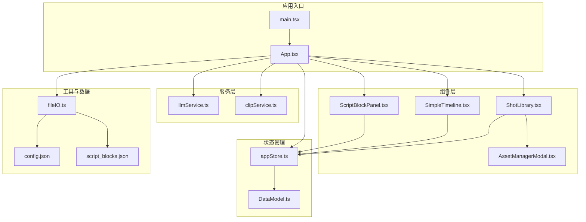
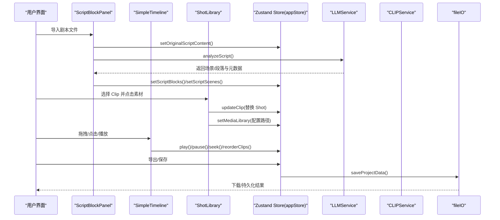
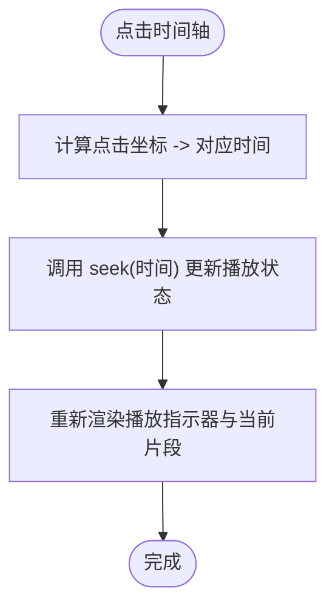
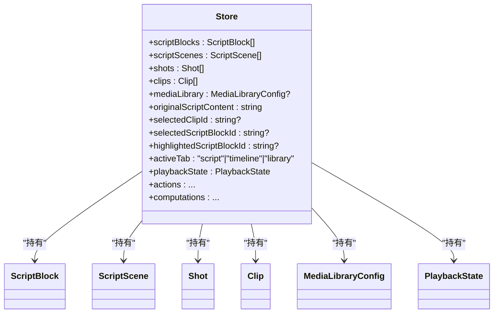
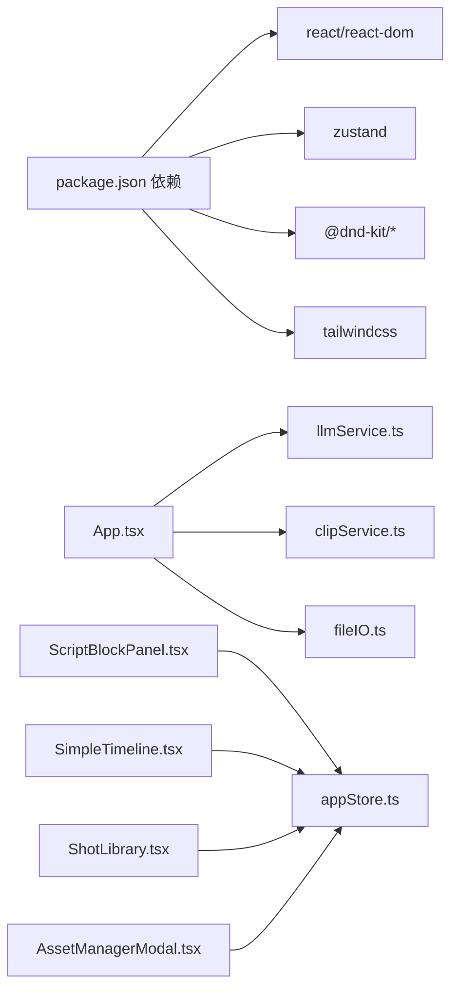

# API参考

<cite>
**本文档引用的文件**
- [README.md](file://README.md)
- [package.json](file://package.json)
- [src/App.tsx](file://src/App.tsx)
- [src/main.tsx](file://src/main.tsx)
- [src/types/DataModel.ts](file://src/types/DataModel.ts)
- [src/store/appStore.ts](file://src/store/appStore.ts)
- [src/services/llmService.ts](file://src/services/llmService.ts)
- [src/services/clipService.ts](file://src/services/clipService.ts)
- [src/utils/fileIO.ts](file://src/utils/fileIO.ts)
- [src/components/ScriptBlockPanel.tsx](file://src/components/ScriptBlockPanel.tsx)
- [src/components/SimpleTimeline.tsx](file://src/components/SimpleTimeline.tsx)
- [src/components/ShotLibrary.tsx](file://src/components/ShotLibrary.tsx)
- [src/components/AssetManagerModal.tsx](file://src/components/AssetManagerModal.tsx)
- [knowledge/cinematography-basics.md](file://knowledge/cinematography-basics.md)
- [public/data/config.json](file://public/data/config.json)
- [public/data/script_blocks.json](file://public/data/script_blocks.json)
</cite>

## 目录
1. [简介](#简介)
2. [项目结构](#项目结构)
3. [核心组件](#核心组件)
4. [架构总览](#架构总览)
5. [详细组件分析](#详细组件分析)
6. [依赖分析](#依赖分析)
7. [性能考虑](#性能考虑)
8. [故障排查指南](#故障排查指南)
9. [结论](#结论)
10. [附录](#附录)

## 简介
本文件为 CGCUT 的完整 API 参考文档，覆盖组件 API、状态管理 API 与服务接口文档。内容包括：
- 组件属性、事件与方法
- 状态管理 Store 的公开接口
- 服务接口（LLM 剧本分析、CLIP 素材分析）的调用方式、请求/响应结构
- 数据模型字段定义与类型说明
- 错误处理与异常情况说明
- 最佳实践与性能建议

## 项目结构
CGCUT 采用 React + TypeScript + Zustand + Vite 构建，核心模块如下：
- 类型与数据模型：定义领域对象与状态结构
- 状态管理：Zustand Store，集中管理全局状态与派生活动
- 服务层：LLMService（剧本智能拆解）、CLIPService（素材内容分析）
- 组件层：剧本面板、时间轴、素材库、资产管理系统
- 工具层：文件 IO（本地 JSON 读取与 localStorage 持久化）

图表来源
- [src/main.tsx](file://src/main.tsx#L1-L11)
- [src/App.tsx](file://src/App.tsx#L1-L497)
- [src/store/appStore.ts](file://src/store/appStore.ts#L1-L195)
- [src/types/DataModel.ts](file://src/types/DataModel.ts#L1-L291)
- [src/services/llmService.ts](file://src/services/llmService.ts#L1-L476)
- [src/services/clipService.ts](file://src/services/clipService.ts#L1-L394)
- [src/utils/fileIO.ts](file://src/utils/fileIO.ts#L1-L95)
- [public/data/config.json](file://public/data/config.json#L1-L6)
- [public/data/script_blocks.json](file://public/data/script_blocks.json#L1-L38)

章节来源
- [README.md](file://README.md#L1-L181)
- [package.json](file://package.json#L1-L36)

## 核心组件
本节概述三大类公共 API：组件 API、状态管理 API、服务接口。

- 组件 API
  - ScriptBlockPanel：展示与交互剧本段落，支持“占位”创建、时长对比、播放高亮联动
  - SimpleTimeline：单轨时间轴，支持拖拽重排、点击跳转、播放预览、裁剪手柄（预留）
  - ShotLibrary：素材库浏览与筛选，支持替换 Clip、标记状态、编辑信息、路径配置
  - AssetManagerModal：专业素材管理弹窗，支持批量处理、搜索、排序、导入与删除

- 状态管理 API（Zustand Store）
  - 数据状态：scriptBlocks、scriptScenes、shots、clips、mediaLibrary、originalScriptContent
  - UI 状态：selectedClipId、selectedScriptBlockId、highlightedScriptBlockId、activeTab
  - 播放状态：playbackState（current_time、is_playing、current_clip_index、current_clip_internal_time、current_script_block_id）
  - 动作接口：addClip、updateClip、deleteClip、reorderClips、selectClip、selectScriptBlock、setHighlightedScriptBlock、setActiveTab、setPlaybackState、play、pause、seek、checkProjectStatus、updateShotStatus、addShot、deleteShot
  - 计算接口：getScriptBlockActualDuration、getShotById、getClipById

- 服务接口
  - LLMService.analyzeScript：调用 LLM 进行剧本拆解，返回场景与段落结构
  - CLIPService.scanAndProcess/processSingleFile：扫描并处理素材，生成 CLIP 元数据
  - fileIO.loadProjectData/saveProjectData：加载/保存项目数据（timeline.json），读取配置与静态数据

章节来源
- [src/components/ScriptBlockPanel.tsx](file://src/components/ScriptBlockPanel.tsx#L1-L285)
- [src/components/SimpleTimeline.tsx](file://src/components/SimpleTimeline.tsx#L1-L414)
- [src/components/ShotLibrary.tsx](file://src/components/ShotLibrary.tsx#L1-L359)
- [src/components/AssetManagerModal.tsx](file://src/components/AssetManagerModal.tsx#L1-L511)
- [src/store/appStore.ts](file://src/store/appStore.ts#L1-L195)
- [src/services/llmService.ts](file://src/services/llmService.ts#L1-L476)
- [src/services/clipService.ts](file://src/services/clipService.ts#L1-L394)
- [src/utils/fileIO.ts](file://src/utils/fileIO.ts#L1-L95)

## 架构总览
CGCUT 采用“组件驱动 + 状态中心 + 服务调用”的架构：
- 组件通过 useAppStore 订阅与更新全局状态
- App.tsx 作为协调者，负责文件加载、LLM/CLIP 服务调用、导出与检查
- 服务层通过外部 API（LLM/CLIP）或本地模拟实现业务能力
- 工具层封装数据持久化与静态资源读取

图表来源
- [src/App.tsx](file://src/App.tsx#L1-L497)
- [src/components/ScriptBlockPanel.tsx](file://src/components/ScriptBlockPanel.tsx#L1-L285)
- [src/components/SimpleTimeline.tsx](file://src/components/SimpleTimeline.tsx#L1-L414)
- [src/components/ShotLibrary.tsx](file://src/components/ShotLibrary.tsx#L1-L359)
- [src/store/appStore.ts](file://src/store/appStore.ts#L1-L195)
- [src/services/llmService.ts](file://src/services/llmService.ts#L1-L476)
- [src/services/clipService.ts](file://src/services/clipService.ts#L1-L394)
- [src/utils/fileIO.ts](file://src/utils/fileIO.ts#L1-L95)

## 详细组件分析

### 组件 API：ScriptBlockPanel
- 属性
  - className?: string
- 事件与行为
  - 折叠/展开场景（toggleSceneCollapse）
  - 为段落创建占位 Clip（createPlaceholderClip）
  - 根据播放状态高亮当前段落（getCurrentBlockId）
  - 时长对比与状态颜色（getDurationStatus）
- 方法（内部）
  - renderBlock：渲染单个段落，包含期望/实际时长、情绪标签、占位按钮
  - 支持 Tab 在“原文/LLM拆解”之间切换

章节来源
- [src/components/ScriptBlockPanel.tsx](file://src/components/ScriptBlockPanel.tsx#L1-L285)

### 组件 API：SimpleTimeline
- 属性
  - className?: string
- 事件与行为
  - 拖拽重排 Clip（DndKit）
  - 点击时间轴跳转（handleTimelineClick）
  - 播放控制：播放/暂停/停止、进度条点击跳转
  - 播放预览：VideoPreview 同步当前 Clip 与内部时间
- 方法（内部）
  - PlayheadIndicator：播放指示器
  - TimeRuler：时间刻度标尺（秒/半秒）
  - TimelineClip：Clip 渲染与删除按钮
  - formatTime：时间格式化

图表来源
- [src/components/SimpleTimeline.tsx](file://src/components/SimpleTimeline.tsx#L359-L367)

章节来源
- [src/components/SimpleTimeline.tsx](file://src/components/SimpleTimeline.tsx#L1-L414)

### 组件 API：ShotLibrary
- 属性
  - className?: string
- 事件与行为
  - 情绪/状态筛选（emotionFilter/statusFilter）
  - 替换选中 Clip 的 Shot（handleReplaceShot）
  - 设置素材库路径（handleSetLibraryPath）
  - 标记素材状态（handleMarkAsReady）
  - 编辑标签/情绪/删除（handleEditShot/handleChangeEmotion/handleDeleteShot）
- 方法（内部）
  - getStatusDisplay：状态可视化
  - filteredShots：按情绪/状态过滤

章节来源
- [src/components/ShotLibrary.tsx](file://src/components/ShotLibrary.tsx#L1-L359)

### 组件 API：AssetManagerModal
- 属性
  - isOpen: boolean
  - onClose: () => void
- 事件与行为
  - 批量处理待处理素材（handleBatchProcess）
  - 批量删除（handleBatchDelete）
  - 添加/批量导入路径引用（handleAddPathReference/handleBatchImport）
  - 批量修改情绪（handleBatchChangeEmotion）
  - 全选/取消全选（handleToggleSelectAll）
  - 搜索与排序（searchQuery/sortBy）
- 方法（内部）
  - filteredShots：过滤与排序
  - getStatusDisplay：状态可视化

章节来源
- [src/components/AssetManagerModal.tsx](file://src/components/AssetManagerModal.tsx#L1-L511)

### 状态管理 API（Zustand Store）
- 数据状态
  - scriptBlocks: ScriptBlock[]
  - scriptScenes: ScriptScene[]
  - shots: Shot[]
  - clips: Clip[]
  - mediaLibrary: MediaLibraryConfig | null
  - originalScriptContent: string
- UI 状态
  - selectedClipId: string | null
  - selectedScriptBlockId: string | null
  - highlightedScriptBlockId: string | null
  - activeTab: 'script' | 'timeline' | 'library'
- 播放状态
  - playbackState: PlaybackState
- 动作接口
  - setScriptBlocks/setScriptScenes/setShots/setClips/setMediaLibrary/setOriginalScriptContent
  - addClip/updateClip/deleteClip/reorderClips
  - selectClip/selectScriptBlock/setHighlightedScriptBlock/setActiveTab
  - setPlaybackState/play/pause/seek
  - updateShotStatus/addShot/deleteShot
- 计算接口
  - getScriptBlockActualDuration(blockId)
  - getShotById(shotId)
  - getClipById(clipId)
  - checkProjectStatus()

图表来源
- [src/store/appStore.ts](file://src/store/appStore.ts#L1-L195)
- [src/types/DataModel.ts](file://src/types/DataModel.ts#L1-L291)

章节来源
- [src/store/appStore.ts](file://src/store/appStore.ts#L1-L195)

### 服务接口 API

#### LLMService.analyzeScript
- 请求
  - 参数：LLMScriptAnalysisRequest
    - scriptContent: string
    - fileName: string
    - options?: {
        language?: string
        includeEmotions?: boolean
        estimateDuration?: boolean
      }
- 响应
  - LLMScriptAnalysisResponse
    - status: 'success' | 'error'
    - scenes: ScriptScene[]
    - blocks: ScriptBlock[]
    - summary?: string
    - metadata?: {
        totalScenes: number
        totalBlocks: number
        estimatedDuration: number
        analysisTime: number
      }
    - error?: string
- 调用流程
  - 优先调用 NVIDIA API；失败时回退至本地模拟分析
  - 使用知识库（cinematography-basics.md）增强拆解质量
- 错误处理
  - 网络错误/超时：抛出错误并回退
  - JSON 解析失败：抛出错误并回退

章节来源
- [src/services/llmService.ts](file://src/services/llmService.ts#L1-L476)
- [knowledge/cinematography-basics.md](file://knowledge/cinematography-basics.md#L1-L366)

#### CLIPService.scanAndProcess / processSingleFile
- 请求
  - scanAndProcess: CLIPScanRequest
    - directoryPath: string
    - filePatterns?: string[]
    - skipProcessed?: boolean
    - extractKeyframes?: boolean
  - processSingleFile: filePath: string
- 响应
  - scanAndProcess: CLIPProcessResponse
    - status: 'success' | 'error'
    - processedFiles: {
        filePath: string
        shotId: string
        clipMetadata: CLIPMetadata
        status: 'success' | 'error'
        error?: string
      }[]
    - summary: {
        totalFiles: number
        processed: number
        skipped: number
        failed: number
        processingTime: number
      }
    - error?: string
  - processSingleFile: CLIPMetadata
- 调用流程
  - MVP 阶段使用本地模拟处理；生产环境可对接真实 CLIP API
- 错误处理
  - 文件系统/元数据读取失败：返回 error 或 null

章节来源
- [src/services/clipService.ts](file://src/services/clipService.ts#L1-L394)

#### fileIO.loadProjectData / saveProjectData
- loadProjectData
  - 读取：script_blocks.json、shots.json、timeline.json（localStorage回退）、config.json
  - 返回：{ scriptBlocks, shots, clips, config }
- saveProjectData
  - 保存：timeline.json 至 localStorage
- 导出
  - exportProjectData：下载 timeline.json

章节来源
- [src/utils/fileIO.ts](file://src/utils/fileIO.ts#L1-L95)
- [public/data/config.json](file://public/data/config.json#L1-L6)
- [public/data/script_blocks.json](file://public/data/script_blocks.json#L1-L38)

## 依赖分析
- 外部依赖
  - react、react-dom、zustand、@dnd-kit/*、tailwindcss
- 内部依赖
  - 组件依赖 store 与服务
  - App.tsx 协调服务与 IO
  - 知识库文件被 LLMService 使用

图表来源
- [package.json](file://package.json#L1-L36)
- [src/App.tsx](file://src/App.tsx#L1-L497)
- [src/services/llmService.ts](file://src/services/llmService.ts#L1-L476)
- [src/services/clipService.ts](file://src/services/clipService.ts#L1-L394)
- [src/utils/fileIO.ts](file://src/utils/fileIO.ts#L1-L95)
- [src/store/appStore.ts](file://src/store/appStore.ts#L1-L195)

章节来源
- [package.json](file://package.json#L1-L36)

## 性能考虑
- 时间轴渲染
  - 使用固定像素/秒比例（PIXELS_PER_SECOND）控制缩放，避免频繁重排
  - 播放循环使用 requestAnimationFrame，注意取消动画帧防止内存泄漏
- LLM/CLIP 调用
  - 提供超时控制与回退机制，避免阻塞 UI
  - CLIP 批量处理建议分批进行，并在 UI 上显示进度
- 数据加载
  - 使用 Promise.all 并行加载静态数据，减少首屏等待
  - localStorage 作为回退，避免网络失败导致崩溃

[本节为通用建议，无需特定文件引用]

## 故障排查指南
- LLM 分析失败
  - 现象：返回 error 或触发回退
  - 排查：检查网络连接、API Key、超时设置
  - 参考：[src/services/llmService.ts](file://src/services/llmService.ts#L1-L476)
- CLIP 处理失败
  - 现象：返回 error 或部分文件失败
  - 排查：确认文件格式、路径权限、元数据文件是否存在
  - 参考：[src/services/clipService.ts](file://src/services/clipService.ts#L1-L394)
- 项目保存失败
  - 现象：alert 提示保存失败
  - 排查：浏览器隐私模式/存储配额限制
  - 参考：[src/utils/fileIO.ts](file://src/utils/fileIO.ts#L1-L95)
- 时间轴播放异常
  - 现象：视频不播放或不同步
  - 排查：检查当前 Clip 的 Shot 是否有有效 file_path
  - 参考：[src/components/SimpleTimeline.tsx](file://src/components/SimpleTimeline.tsx#L1-L414)

章节来源
- [src/services/llmService.ts](file://src/services/llmService.ts#L1-L476)
- [src/services/clipService.ts](file://src/services/clipService.ts#L1-L394)
- [src/utils/fileIO.ts](file://src/utils/fileIO.ts#L1-L95)
- [src/components/SimpleTimeline.tsx](file://src/components/SimpleTimeline.tsx#L1-L414)

## 结论
本参考文档梳理了 CGCUT 的组件、状态与服务三层 API，明确了数据模型、调用方式与错误处理策略。建议在生产环境中：
- 替换 LLM/CLIP 为真实服务端实现
- 优化时间轴渲染与播放循环
- 增强错误提示与重试机制
- 使用 Electron 实现真实文件写入

[本节为总结性内容，无需特定文件引用]

## 附录

### 数据模型与类型定义
- CLIPProcessStatus: 'idle' | 'scanning' | 'processing' | 'success' | 'error'
- LLMProcessStatus: 'idle' | 'analyzing' | 'success' | 'error'
- ScriptScene: id, name, blocks[], collapsed?
- ScriptBlock: id, scene_id, scene, text, emotion, expected_duration, has_clip?
- Shot: id, label, emotion, duration, file_path, status, tags?, metadata?, clip_metadata?
- Clip: id, script_block_id, shot_id, trim_in, trim_out, duration
- MediaLibraryConfig: base_path, total_files, processed_files, pending_files, last_scan_time?
- Config: media_server_base_url, local_cache_path?, preview_quality?, media_library?
- ProjectCheckStatus: hasScript, scriptSegmented, allBlocksHaveClips, allClipsHaveShots, missingBlocks[], missingShots[], readyToPlay
- PlaybackState: current_time, is_playing, current_clip_index, current_clip_internal_time, current_script_block_id

章节来源
- [src/types/DataModel.ts](file://src/types/DataModel.ts#L1-L291)

### 组件属性、事件与方法清单
- ScriptBlockPanel
  - 属性：className?
  - 事件：toggleSceneCollapse, createPlaceholderClip, getCurrentBlockId, getDurationStatus
- SimpleTimeline
  - 属性：className?
  - 事件：handleDragEnd, handleTimelineClick, play/pause/seek
  - 内部：PlayheadIndicator, TimeRuler, TimelineClip, formatTime
- ShotLibrary
  - 属性：className?
  - 事件：handleReplaceShot, handleSetLibraryPath, handleMarkAsReady, handleEditShot, handleChangeEmotion, handleDeleteShot
- AssetManagerModal
  - 属性：isOpen, onClose
  - 事件：handleBatchProcess, handleBatchDelete, handleAddPathReference, handleBatchImport, handleBatchChangeEmotion, handleToggleSelectAll

章节来源
- [src/components/ScriptBlockPanel.tsx](file://src/components/ScriptBlockPanel.tsx#L1-L285)
- [src/components/SimpleTimeline.tsx](file://src/components/SimpleTimeline.tsx#L1-L414)
- [src/components/ShotLibrary.tsx](file://src/components/ShotLibrary.tsx#L1-L359)
- [src/components/AssetManagerModal.tsx](file://src/components/AssetManagerModal.tsx#L1-L511)

### 服务接口调用方式与响应结构
- LLMService.analyzeScript
  - 请求：LLMScriptAnalysisRequest
  - 响应：LLMScriptAnalysisResponse（含 scenes/blocks/metadata）
- CLIPService.scanAndProcess/processSingleFile
  - 请求：CLIPScanRequest / filePath
  - 响应：CLIPProcessResponse / CLIPMetadata
- fileIO.loadProjectData/saveProjectData
  - 输入：无/clip数组
  - 输出：项目对象/无

章节来源
- [src/services/llmService.ts](file://src/services/llmService.ts#L1-L476)
- [src/services/clipService.ts](file://src/services/clipService.ts#L1-L394)
- [src/utils/fileIO.ts](file://src/utils/fileIO.ts#L1-L95)