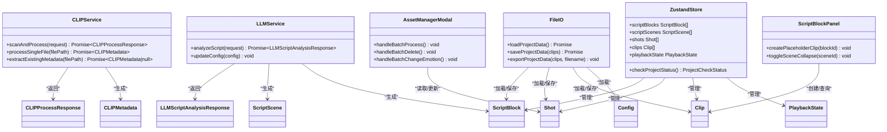

# 数据模型API

<cite>
**本文档引用的文件**
- [DataModel.ts](file://src/types/DataModel.ts)
- [clipService.ts](file://src/services/clipService.ts)
- [llmService.ts](file://src/services/llmService.ts)
- [appStore.ts](file://src/store/appStore.ts)
- [AssetManagerModal.tsx](file://src/components/AssetManagerModal.tsx)
- [ScriptBlockPanel.tsx](file://src/components/ScriptBlockPanel.tsx)
- [fileIO.ts](file://src/utils/fileIO.ts)
- [config.json](file://public/data/config.json)
- [script_blocks.json](file://public/data/script_blocks.json)
- [shots.json](file://public/data/shots.json)
- [timeline.json](file://public/data/timeline.json)
- [cinematography-basics.md](file://knowledge/cinematography-basics.md)
</cite>

## 目录
1. [简介](#简介)
2. [项目结构](#项目结构)
3. [核心数据模型](#核心数据模型)
4. [架构概览](#架构概览)
5. [详细组件分析](#详细组件分析)
6. [依赖关系分析](#依赖关系分析)
7. [性能考量](#性能考量)
8. [故障排除指南](#故障排除指南)
9. [结论](#结论)
10. [附录](#附录)

## 简介
本文件为 CGCUT 项目的完整数据模型API文档，涵盖TypeScript接口与类型定义、实体模型、请求响应格式、枚举类型、数据关系与约束、数据验证规则、业务逻辑、序列化与反序列化处理、以及版本兼容性与迁移策略。文档旨在帮助开发者与非技术用户全面理解系统的数据结构与交互方式。

## 项目结构
CGCUT采用前端React + Zustand状态管理 + TypeScript类型定义的架构，数据模型集中于类型定义文件，并通过服务层与UI组件进行消费与展示。

**图表来源**
- [DataModel.ts](file://src/types/DataModel.ts#L1-L291)
- [clipService.ts](file://src/services/clipService.ts#L1-L394)
- [llmService.ts](file://src/services/llmService.ts#L1-L476)
- [appStore.ts](file://src/store/appStore.ts#L1-L195)
- [AssetManagerModal.tsx](file://src/components/AssetManagerModal.tsx#L1-L511)
- [ScriptBlockPanel.tsx](file://src/components/ScriptBlockPanel.tsx#L1-L285)
- [fileIO.ts](file://src/utils/fileIO.ts#L1-L95)
- [config.json](file://public/data/config.json#L1-L6)
- [script_blocks.json](file://public/data/script_blocks.json#L1-L38)
- [shots.json](file://public/data/shots.json#L1-L83)
- [timeline.json](file://public/data/timeline.json#L1-L59)

**章节来源**
- [DataModel.ts](file://src/types/DataModel.ts#L1-L291)
- [clipService.ts](file://src/services/clipService.ts#L1-L394)
- [llmService.ts](file://src/services/llmService.ts#L1-L476)
- [appStore.ts](file://src/store/appStore.ts#L1-L195)
- [AssetManagerModal.tsx](file://src/components/AssetManagerModal.tsx#L1-L511)
- [ScriptBlockPanel.tsx](file://src/components/ScriptBlockPanel.tsx#L1-L285)
- [fileIO.ts](file://src/utils/fileIO.ts#L1-L95)

## 核心数据模型
本节详细列出所有TypeScript接口、类型别名、枚举与辅助函数，说明字段含义、可选性、默认值与约束。

### 类型别名与枚举
- CLIPProcessStatus: 'idle' | 'scanning' | 'processing' | 'success' | 'error'
- LLMProcessStatus: 'idle' | 'analyzing' | 'success' | 'error'
- ShotStatus: 'pending' | 'processing' | 'ready' | 'error'

**章节来源**
- [DataModel.ts](file://src/types/DataModel.ts#L4-L54)

### CLIP相关模型
- CLIPMetadata
  - embeddings: number[]; // CLIP特征向量
  - tags: string[]; // 自动生成的标签
  - description: string; // 场景描述
  - emotions: string[]; // 识别到的情绪
  - keyframes?: string[]; // 关键帧截图路径
  - processed_at: string; // 处理时间
  - model_version: string; // CLIP模型版本

- CLIPScanRequest
  - directoryPath: string; // 扫描目录
  - filePatterns?: string[]; // 文件匹配模式，默认['*.mp4','*.mov','*.avi']
  - skipProcessed?: boolean; // 跳过已处理的文件
  - extractKeyframes?: boolean; // 是否提取关键帧

- CLIPProcessResponse
  - status: 'success' | 'error';
  - processedFiles: Array<{
      filePath: string;
      shotId: string;
      clipMetadata: CLIPMetadata;
      status: 'success' | 'error';
      error?: string;
    }>;
  - summary: {
      totalFiles: number;
      processed: number;
      skipped: number;
      failed: number;
      processingTime: number; // 毫秒
    };
  - error?: string;

**章节来源**
- [DataModel.ts](file://src/types/DataModel.ts#L9-L49)

### LLM相关模型
- LLMScriptAnalysisRequest
  - scriptContent: string; // 原始剧本内容
  - fileName: string; // 文件名
  - options?: {
      language?: string; // 语言(zh/en)
      includeEmotions?: boolean; // 是否分析情绪
      estimateDuration?: boolean; // 是否估算时长
    };

- LLMScriptAnalysisResponse
  - status: 'success' | 'error';
  - scenes: ScriptScene[]; // 拆解后的场景列表
  - blocks: ScriptBlock[]; // 拆解后的段落列表
  - summary?: string; // 剧本摘要
  - metadata?: {
      totalScenes: number;
      totalBlocks: number;
      estimatedDuration: number;
      analysisTime: number; // 分析耗时(毫秒)
    };
  - error?: string;

**章节来源**
- [DataModel.ts](file://src/types/DataModel.ts#L59-L84)

### 剧本与时间轴模型
- ScriptScene
  - id: string;
  - name: string; // 场景名称（如"INT. 卧室 - 夜晚"）
  - blocks: ScriptBlock[]; // 场景下的段落列表
  - collapsed?: boolean; // 是否折叠

- ScriptBlock
  - id: string;
  - scene_id: string; // 所属场景 ID
  - scene: string; // 场景标识（如"INT. 卧室 - 夜晚"）
  - text: string; // 段落台词或描述
  - emotion: string; // 情绪标签（如"紧张","平静"）
  - expected_duration: number; // 导演预期时长（秒）
  - has_clip?: boolean; // 是否已有对应的clip

- Shot
  - id: string;
  - label: string; // 镜头描述（如"特写-手部"）
  - emotion: string; // 情绪标签（用于筛选）
  - duration: number; // 镜头时长（秒）
  - file_path: string; // 视频文件路径（后端引用路径）
  - status: ShotStatus; // 处理状态
  - tags?: string[]; // 标签列表
  - metadata?: {
      resolution?: string; // 分辨率
      fps?: number; // 帧率
      codec?: string; // 编码格式
      fileSize?: number; // 文件大小
    };
  - clip_metadata?: CLIPMetadata; // CLIP提取的元数据

- Clip
  - id: string;
  - script_block_id: string; // 所属剧本段落 ID
  - shot_id: string; // 绑定的 Shot ID
  - trim_in: number; // 裁剪起始点（秒，相对于 Shot 原始时长）
  - trim_out: number; // 裁剪结束点（秒，相对于 Shot 原始时长）
  - duration: number; // 裁剪后的实际时长（trim_out - trim_in）

**章节来源**
- [DataModel.ts](file://src/types/DataModel.ts#L90-L148)

### 配置与状态模型
- MediaLibraryConfig
  - base_path: string; // 素材库根路径
  - total_files: number; // 总文件数
  - processed_files: number; // 已处理文件数
  - pending_files: number; // 待处理文件数
  - last_scan_time?: string; // 最后扫描时间

- Config
  - media_server_base_url: string; // 服务器素材根路径
  - local_cache_path?: string; // 本地缓存目录（可选）
  - preview_quality?: 'low' | 'medium' | 'high'; // 预览视频质量
  - media_library?: MediaLibraryConfig; // 素材库配置

- ProjectCheckStatus
  - hasScript: boolean; // 是否有剧本
  - scriptSegmented: boolean; // 剧本是否已分段
  - allBlocksHaveClips: boolean; // 所有段落是否都有clip
  - allClipsHaveShots: boolean; // 所有clip是否都有对应素材
  - missingBlocks: string[]; // 缺少clip的段落ID
  - missingShots: string[]; // 缺少素材的clipID
  - readyToPlay: boolean; // 是否可以播放

- PlaybackState
  - current_time: number; // 当前播放时间（秒，相对于时间轴起点）
  - is_playing: boolean; // 播放/暂停状态
  - current_clip_index: number; // 当前播放的 Clip 索引
  - current_clip_internal_time: number; // 当前 Clip 内部播放时间（考虑 trim_in）
  - current_script_block_id: string | null; // 当前对应的 ScriptBlock ID

**章节来源**
- [DataModel.ts](file://src/types/DataModel.ts#L153-L193)

### 辅助函数与计算
- calculateScriptBlockDuration(scriptBlockId: string, clips: Clip[]): number
- calculateTotalDuration(clips: Clip[]): number
- findClipAtTime(currentTime: number, clips: Clip[]): { clip, index, internalTime } | null
- createClip(scriptBlockId: string, shot: Shot): Clip
- updateClipTrim(clip: Clip, trimIn: number, trimOut: number): Clip
- replaceClipShot(clip: Clip, newShot: Shot): Clip

**章节来源**
- [DataModel.ts](file://src/types/DataModel.ts#L198-L291)

## 架构概览
数据模型在系统中的流转路径如下：
- 静态数据通过 fileIO.ts 加载至内存，初始化 Zustand 状态
- LLM 服务负责剧本分析，产出 ScriptScene 与 ScriptBlock
- CLIP 服务负责视频内容分析，产出 CLIPMetadata
- UI 组件通过 Zustand 状态访问与更新数据，实现播放与编辑

**图表来源**
- [fileIO.ts](file://src/utils/fileIO.ts#L54-L80)
- [llmService.ts](file://src/services/llmService.ts#L72-L101)
- [clipService.ts](file://src/services/clipService.ts#L36-L60)
- [appStore.ts](file://src/store/appStore.ts#L60-L195)

## 详细组件分析

### CLIP服务（clipService.ts）
职责：扫描并处理视频文件，提取CLIP元数据；支持模拟处理与生产环境API集成。

- 关键方法
  - scanAndProcess(request: CLIPScanRequest): Promise<CLIPProcessResponse>
  - processSingleFile(filePath: string): Promise<CLIPMetadata>
  - extractExistingMetadata(filePath: string): Promise<CLIPMetadata | null>
  - mockCLIPProcessing(request): Promise<CLIPProcessResponse>
  - mockSingleFileProcessing(filePath, extractKeyframes): Promise<CLIPMetadata>

- 数据验证与约束
  - 输入校验：directoryPath 必填；filePatterns 默认值；skipProcessed/extractKeyframes 可选
  - 输出校验：processedFiles 中每个元素包含 filePath、shotId、clipMetadata、status；summary 包含计数与processingTime
  - 错误处理：捕获异常并返回 error 字段

- 业务逻辑
  - 模拟扫描：生成 mockFiles，按 skipProcessed 与失败概率构造 processedFiles
  - 元数据生成：智能标签、场景描述、情绪识别、嵌入向量生成
  - 已有元数据提取：通过文件扩展名判断 .clip.json 存在性

- 序列化与反序列化
  - 请求：JSON序列化 CLIPScanRequest
  - 响应：JSON反序列化 CLIPProcessResponse

- 版本兼容性
  - model_version 字段用于标识模型版本，便于后续迁移

**章节来源**
- [clipService.ts](file://src/services/clipService.ts#L22-L394)

### LLM服务（llmService.ts）
职责：调用外部LLM API进行剧本分镜拆解，产出 ScriptScene 与 ScriptBlock；具备回退机制。

- 关键方法
  - analyzeScript(request: LLMScriptAnalysisRequest): Promise<LLMScriptAnalysisResponse>
  - callNvidiaAPI(request): Promise<LLMScriptAnalysisResponse>
  - mockLLMAnalysis(request): Promise<LLMScriptAnalysisResponse>

- 数据验证与约束
  - 输入校验：scriptContent 必填；fileName 必填；options 可选
  - 输出校验：scenes/blocks 数组长度与结构；metadata 包含统计信息
  - JSON解析：支持去除Markdown代码块标记与提取JSON对象

- 业务逻辑
  - Prompt工程：引用 cinamatography-basics.md 专业知识库
  - 强制拆解规则：每个场景至少3个镜头，禁止整段作为单一镜头
  - 情绪与时长：限定情绪集合与参考时长范围
  - 回退策略：API失败时使用 mockLLMAnalysis

- 序列化与反序列化
  - 请求：JSON序列化 LLMScriptAnalysisRequest
  - 响应：JSON反序列化为 LLMScriptAnalysisResponse

- 版本兼容性
  - metadata 中的 analysisTime 用于性能监控与版本对比

**章节来源**
- [llmService.ts](file://src/services/llmService.ts#L62-L476)
- [cinematography-basics.md](file://knowledge/cinematography-basics.md#L1-L366)

### 状态管理（appStore.ts）
职责：集中管理应用状态，提供数据查询与更新能力。

- 关键状态
  - scriptBlocks: ScriptBlock[]
  - scriptScenes: ScriptScene[]
  - shots: Shot[]
  - clips: Clip[]
  - mediaLibrary: MediaLibraryConfig | null
  - originalScriptContent: string
  - selectedClipId, selectedScriptBlockId, highlightedScriptBlockId
  - activeTab: 'script' | 'timeline' | 'library'
  - playbackState: PlaybackState

- 关键动作
  - setScriptBlocks/setScriptScenes/setShots/setClips/setMediaLibrary/setOriginalScriptContent
  - addClip/updateClip/deleteClip/reorderClips
  - selectClip/selectScriptBlock/setHighlightedScriptBlock/setActiveTab
  - setPlaybackState/play/pause/seek
  - getScriptBlockActualDuration/getShotById/getClipById/checkProjectStatus
  - updateShotStatus/addShot/deleteShot

- 业务逻辑
  - checkProjectStatus：综合判断项目是否可播放
  - getScriptBlockActualDuration：基于 clips 计算实际时长

**章节来源**
- [appStore.ts](file://src/store/appStore.ts#L4-L195)

### UI组件（AssetManagerModal.tsx 与 ScriptBlockPanel.tsx）
职责：展示与操作素材与剧本段落，驱动状态变更。

- AssetManagerModal
  - 过滤与排序：按状态、搜索词、排序字段
  - 批量操作：批量处理、批量删除、批量修改情绪
  - 状态显示：统计卡片与进度条
  - 交互：添加路径、批量导入、全选/取消全选

- ScriptBlockPanel
  - 场景折叠/展开
  - 占位clip创建：根据情绪匹配或创建占位符素材
  - 播放高亮：根据播放时间定位当前段落
  - 时长对比：期望vs实际时长，颜色标识

**章节来源**
- [AssetManagerModal.tsx](file://src/components/AssetManagerModal.tsx#L14-L511)
- [ScriptBlockPanel.tsx](file://src/components/ScriptBlockPanel.tsx#L9-L285)

### 文件I/O（fileIO.ts）
职责：加载与保存项目数据，支持本地存储与导出。

- 关键方法
  - loadJSON<T>(filename): Promise<T>
  - saveJSON<T>(filename, data): Promise<void>
  - loadFromLocalStorage<T>(filename, fallback): Promise<T>
  - loadProjectData(): Promise<{scriptBlocks, shots, clips, config}>
  - saveProjectData(clips): Promise<void>
  - exportProjectData(clips, filename): void

- 数据验证与约束
  - 加载失败时抛出错误
  - 保存成功后记录日志
  - 导出为Blob并触发下载

**章节来源**
- [fileIO.ts](file://src/utils/fileIO.ts#L7-L95)

## 依赖关系分析

**图表来源**
- [clipService.ts](file://src/services/clipService.ts#L22-L394)
- [llmService.ts](file://src/services/llmService.ts#L62-L476)
- [appStore.ts](file://src/store/appStore.ts#L60-L195)
- [AssetManagerModal.tsx](file://src/components/AssetManagerModal.tsx#L14-L511)
- [ScriptBlockPanel.tsx](file://src/components/ScriptBlockPanel.tsx#L9-L285)
- [fileIO.ts](file://src/utils/fileIO.ts#L54-L95)

**章节来源**
- [clipService.ts](file://src/services/clipService.ts#L22-L394)
- [llmService.ts](file://src/services/llmService.ts#L62-L476)
- [appStore.ts](file://src/store/appStore.ts#L60-L195)
- [AssetManagerModal.tsx](file://src/components/AssetManagerModal.tsx#L14-L511)
- [ScriptBlockPanel.tsx](file://src/components/ScriptBlockPanel.tsx#L9-L285)
- [fileIO.ts](file://src/utils/fileIO.ts#L54-L95)

## 性能考量
- 批处理与并发
  - CLIPService 支持批量处理，通过配置 batchSize 控制吞吐量
  - LLMService 使用 AbortController 控制超时，避免长时间阻塞
- 内存优化
  - Zustand 状态集中管理，避免重复渲染
  - UI组件使用 useMemo 优化过滤与排序
- I/O效率
  - fileIO.ts 使用 Promise.all 并行加载多份数据
  - 本地存储替代真实文件写入，减少磁盘I/O

[本节提供一般性指导，无需特定文件分析]

## 故障排除指南
- CLIP处理失败
  - 检查 skipProcessed 与 extractKeyframes 参数
  - 查看 processedFiles 中的 error 字段
  - 确认模型版本与批处理大小配置

- LLM分析失败
  - 检查 API 端点与密钥配置
  - 查看回退到 mockLLMAnalysis 的日志
  - 确认响应内容是否包含合法JSON对象

- 播放状态异常
  - 使用 findClipAtTime 校验当前时间对应的 Clip
  - 检查 clips 的 trim_in/trim_out 与 duration 一致性

- 素材库管理
  - 确认 file_path 非空且可访问
  - 检查状态过滤与排序逻辑

**章节来源**
- [clipService.ts](file://src/services/clipService.ts#L45-L59)
- [llmService.ts](file://src/services/llmService.ts#L94-L101)
- [appStore.ts](file://src/store/appStore.ts#L217-L237)
- [AssetManagerModal.tsx](file://src/components/AssetManagerModal.tsx#L81-L126)

## 结论
CGCUT的数据模型API围绕剧本、镜头与素材三大核心实体构建，通过清晰的类型定义、严格的输入输出约束与完善的错误处理，实现了从剧本分析到素材管理再到时间轴编辑的完整工作流。服务层与UI层通过Zustand状态管理紧密耦合，既保证了开发效率，也为后续的功能扩展与版本演进提供了坚实基础。

[本节为总结性内容，无需特定文件分析]

## 附录

### 数据模型关系图

**图表来源**
- [DataModel.ts](file://src/types/DataModel.ts#L90-L148)

### 数据验证规则清单
- CLIPScanRequest
  - directoryPath 必填
  - filePatterns 默认值：['*.mp4','*.mov','*.avi']
  - skipProcessed/extractKeyframes 可选
- CLIPProcessResponse
  - processedFiles 每项必含：filePath、shotId、clipMetadata、status
  - summary 必含：totalFiles、processed、skipped、failed、processingTime
- LLMScriptAnalysisResponse
  - scenes/blocks 数组非空
  - metadata 必含：totalScenes、totalBlocks、estimatedDuration、analysisTime
- ScriptBlock
  - expected_duration > 0
  - emotion 属于预定义集合
- Clip
  - trim_in >= 0
  - trim_out > trim_in
  - duration = trim_out - trim_in

**章节来源**
- [DataModel.ts](file://src/types/DataModel.ts#L22-L49)
- [DataModel.ts](file://src/types/DataModel.ts#L59-L84)
- [DataModel.ts](file://src/types/DataModel.ts#L101-L109)
- [DataModel.ts](file://src/types/DataModel.ts#L141-L148)

### 序列化与反序列化处理
- JSON序列化
  - 请求参数：CLIPScanRequest、LLMScriptAnalysisRequest
  - 响应数据：CLIPProcessResponse、LLMScriptAnalysisResponse
- JSON反序列化
  - LLM响应：提取JSON对象，解析为 ScriptScene[] 与 ScriptBlock[]
  - 静态数据：从 public/data 目录加载 JSON 文件
- 本地存储
  - 使用 localStorage 保存 timeline.json
  - 支持导出为 .json 文件

**章节来源**
- [clipService.ts](file://src/services/clipService.ts#L364-L389)
- [llmService.ts](file://src/services/llmService.ts#L208-L231)
- [llmService.ts](file://src/services/llmService.ts#L241-L263)
- [fileIO.ts](file://src/utils/fileIO.ts#L7-L95)

### 版本兼容性与迁移策略
- CLIP模型版本
  - model_version 字段用于标识当前模型版本
  - 迁移时可比较该字段决定是否重新处理
- LLM分析元数据
  - analysisTime 用于性能监控与版本对比
  - metadata 中的统计信息可用于质量评估
- 配置迁移
  - Config 中新增字段（如 preview_quality）向后兼容
  - MediaLibraryConfig 可选字段不影响现有数据

**章节来源**
- [DataModel.ts](file://src/types/DataModel.ts#L16-L17)
- [DataModel.ts](file://src/types/DataModel.ts#L77-L82)
- [DataModel.ts](file://src/types/DataModel.ts#L164-L169)