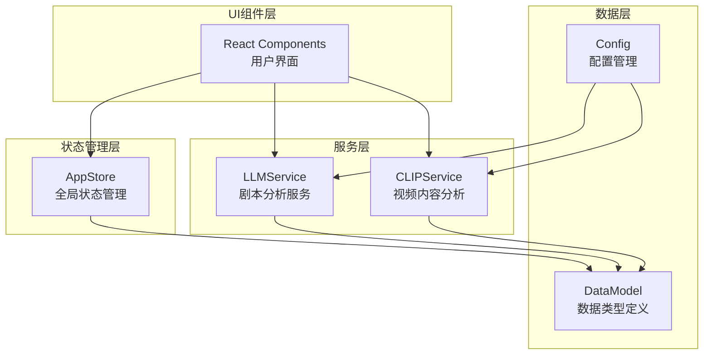
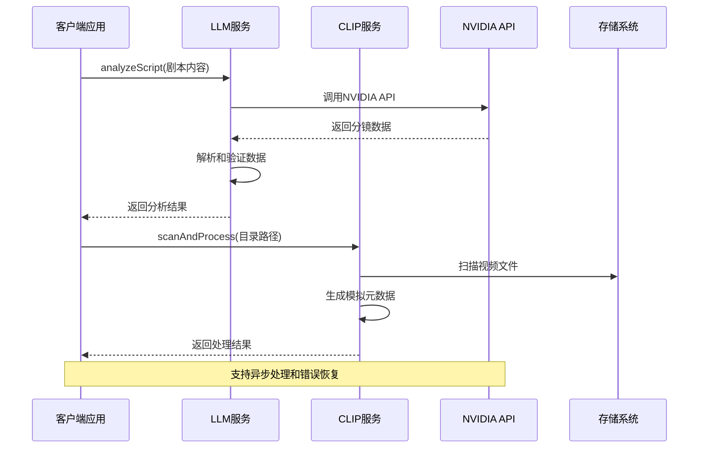
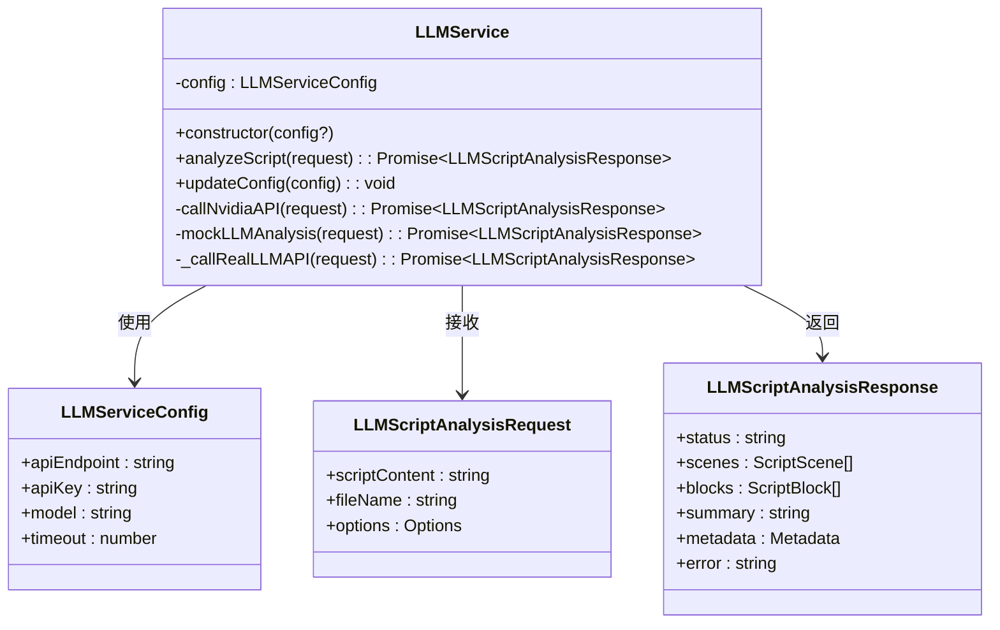
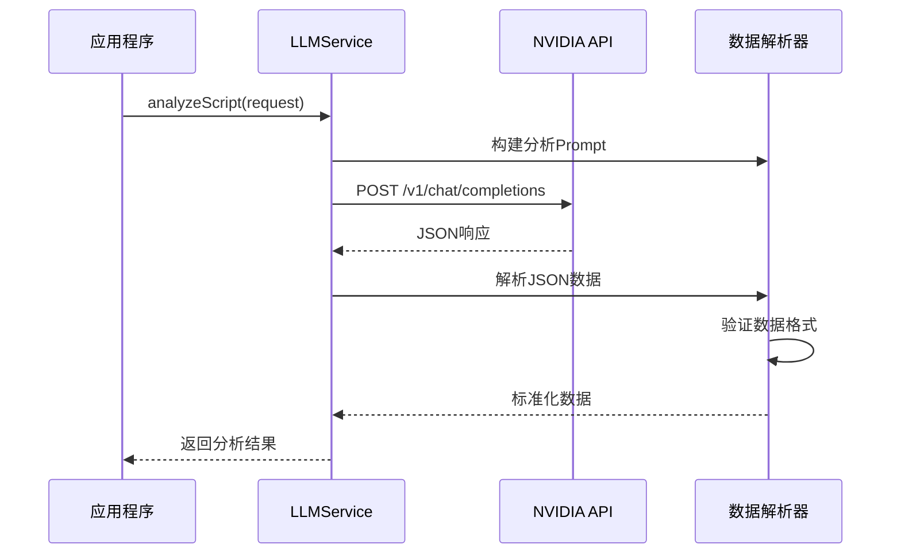
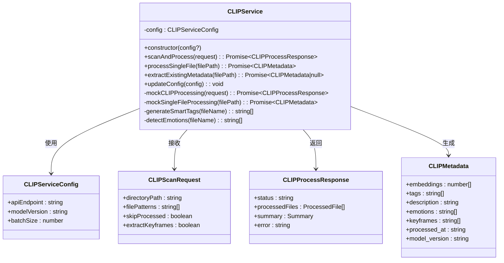
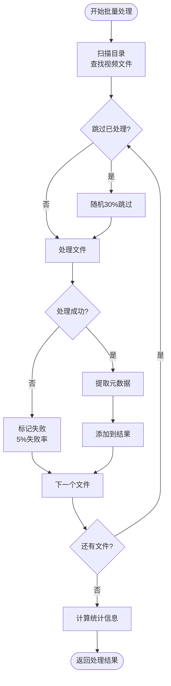
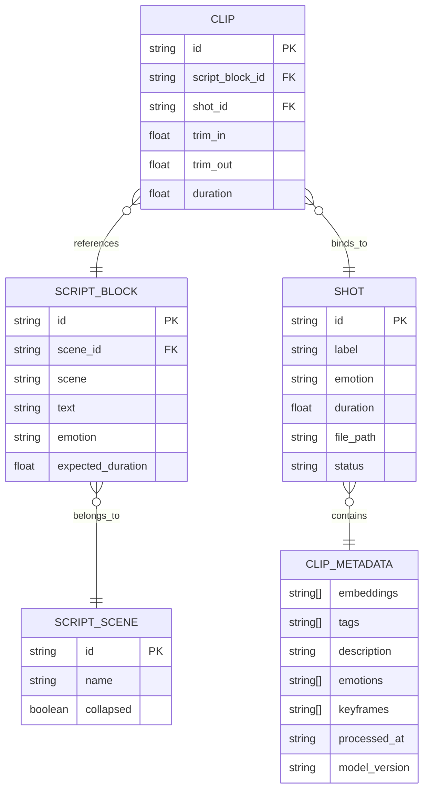
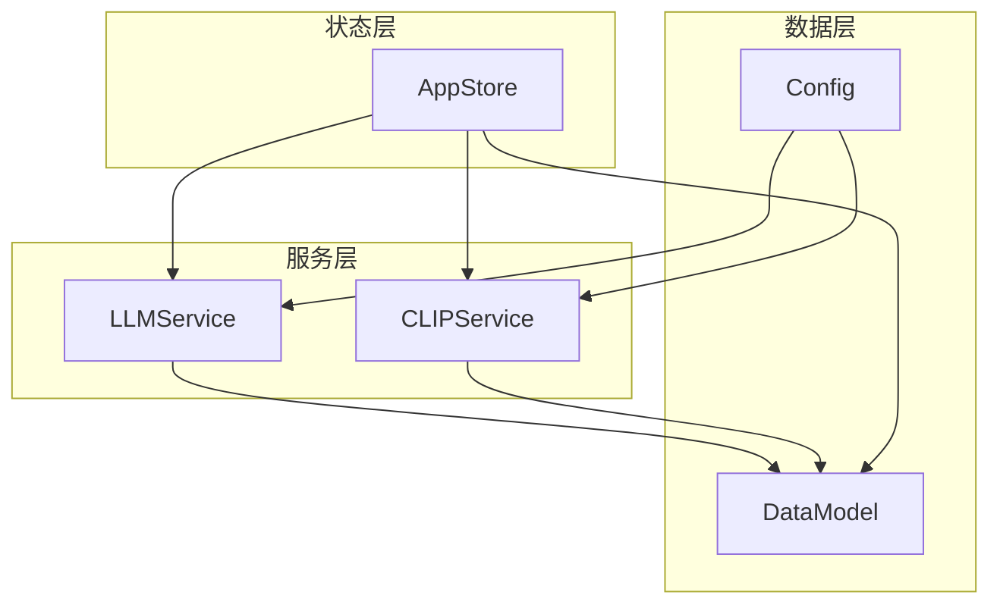
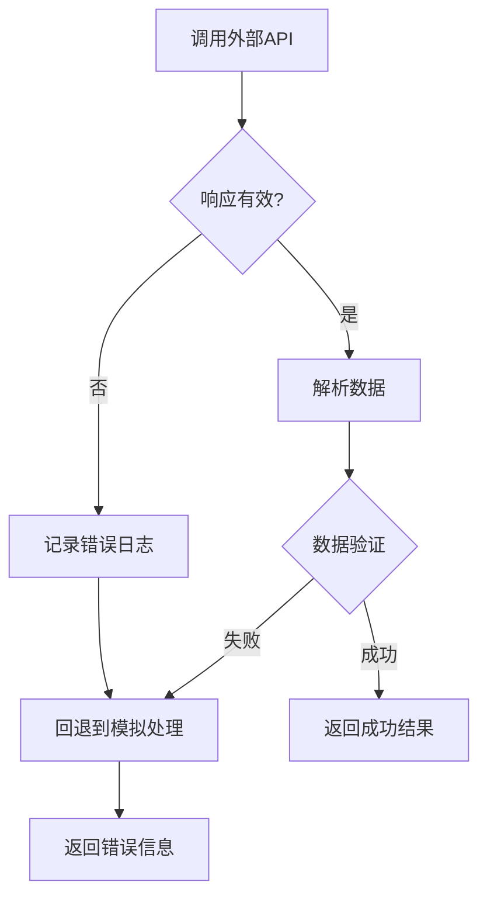

# 服务接口API

<cite>
**本文档引用的文件**
- [llmService.ts](file://src/services/llmService.ts)
- [clipService.ts](file://src/services/clipService.ts)
- [DataModel.ts](file://src/types/DataModel.ts)
- [appStore.ts](file://src/store/appStore.ts)
- [config.json](file://public/data/config.json)
- [README.md](file://README.md)
- [cinematography-basics.md](file://knowledge/cinematography-basics.md)
</cite>

## 目录
1. [简介](#简介)
2. [项目结构](#项目结构)
3. [核心组件](#核心组件)
4. [架构概览](#架构概览)
5. [详细组件分析](#详细组件分析)
6. [依赖分析](#依赖分析)
7. [性能考虑](#性能考虑)
8. [故障排除指南](#故障排除指南)
9. [结论](#结论)
10. [附录](#附录)

## 简介
CGCUT是一个专业的导演分镜验证工具，提供LLM服务和CLIP服务两大核心功能模块。该项目采用MVP（最小可行产品）设计理念，通过服务化架构实现了剧本智能分析和视频内容理解能力。

本项目的核心目标是在分镜阶段快速验证：
- 剧本段落×镜头组合×实际节奏是否成立
- 帮助导演在30分钟内从剧本到可播放时间轴，快速发现节奏问题

## 项目结构
项目采用模块化组织方式，主要包含以下核心模块：



**图表来源**
- [llmService.ts](file://src/services/llmService.ts#L62-L476)
- [clipService.ts](file://src/services/clipService.ts#L22-L394)
- [DataModel.ts](file://src/types/DataModel.ts#L1-L291)

**章节来源**
- [README.md](file://README.md#L1-L181)

## 核心组件
本项目包含两个核心服务组件，均采用单例模式设计，提供完整的异步处理能力和错误处理机制。

### LLM服务（剧本分析）
LLM服务负责将原始剧本内容智能拆解为专业的分镜镜头序列，支持NVIDIA API集成和本地模拟两种模式。

### CLIP服务（视频内容分析）
CLIP服务提供视频素材的内容理解和元数据提取能力，支持批量处理和单文件处理两种模式。

**章节来源**
- [llmService.ts](file://src/services/llmService.ts#L62-L101)
- [clipService.ts](file://src/services/clipService.ts#L22-L102)

## 架构概览
系统采用分层架构设计，各组件职责清晰，耦合度低，便于维护和扩展。



**图表来源**
- [llmService.ts](file://src/services/llmService.ts#L72-L101)
- [clipService.ts](file://src/services/clipService.ts#L36-L60)

## 详细组件分析

### LLM服务详细分析

#### 类结构设计
LLM服务采用面向对象设计，提供完整的配置管理和错误处理机制。



**图表来源**
- [llmService.ts](file://src/services/llmService.ts#L42-L476)
- [DataModel.ts](file://src/types/DataModel.ts#L58-L84)

#### NVIDIA API集成流程
LLM服务集成了NVIDIA API，提供专业的AI剧本分析能力。



**图表来源**
- [llmService.ts](file://src/services/llmService.ts#L106-L323)

#### 请求格式规范
NVIDIA API请求遵循标准的OpenAI兼容格式：

**请求头规范：**
- Content-Type: application/json
- Authorization: Bearer {API_KEY}

**请求体参数：**
- model: meta/llama-3.1-405b-instruct
- temperature: 0.5
- top_p: 0.9
- max_tokens: 8000
- messages: 包含system和user消息

**响应结构：**
- choices[0].message.content: 包含JSON格式的分镜数据
- 需要进行JSON提取和验证

**章节来源**
- [llmService.ts](file://src/services/llmService.ts#L208-L242)

### CLIP服务详细分析

#### 类结构设计
CLIP服务提供视频内容分析和元数据提取能力。



**图表来源**
- [clipService.ts](file://src/services/clipService.ts#L12-L394)
- [DataModel.ts](file://src/types/DataModel.ts#L19-L49)

#### 批量处理算法流程
CLIP服务采用智能批量处理算法，支持跳过已处理文件和错误恢复。



**图表来源**
- [clipService.ts](file://src/services/clipService.ts#L107-L165)

#### 智能标签生成算法
CLIP服务实现了基于文件名模式的智能标签生成系统。

**标签分类规则：**
- **场景类型**: indoor/outdoor → 室内/室外
- **镜头类型**: close/middle/wide → 特写/中景/全景
- **人物相关**: person/face/hand → 人物/面部/手部
- **动作类型**: walk/run/sit → 行走/奔跑/静坐
- **环境特征**: street/room/nature → 街道/房间/自然

**情绪识别算法：**
基于文件名关键词进行情绪推断，支持中英文混合识别。

**章节来源**
- [clipService.ts](file://src/services/clipService.ts#L206-L332)

### 数据模型分析

#### 核心数据结构
项目定义了完整的数据模型体系，支持从剧本到最终时间轴的全流程数据流转。



**图表来源**
- [DataModel.ts](file://src/types/DataModel.ts#L90-L149)

#### 状态管理模式
应用采用Zustand状态管理库，提供全局状态共享和响应式更新能力。

**核心状态类型：**
- ScriptBlock: 剧本段落数据
- ScriptScene: 场景分组
- Shot: 素材镜头
- Clip: 时间轴片段
- PlaybackState: 播放控制状态

**计算属性：**
- getScriptBlockActualDuration: 计算实际时长
- checkProjectStatus: 项目完整性检查
- findClipAtTime: 时间轴定位

**章节来源**
- [DataModel.ts](file://src/types/DataModel.ts#L198-L291)
- [appStore.ts](file://src/store/appStore.ts#L60-L195)

## 依赖分析

### 外部依赖关系
项目采用现代化前端技术栈，依赖关系清晰明确。

```mermaid
graph LR
subgraph "运行时依赖"
React[react ^18.3.1]
ReactDOM[react-dom ^18.3.1]
Zustand[zustand ^4.5.0]
DnDKit[@dnd-kit/core ^6.1.0]
end
subgraph "开发依赖"
Vite[vite ^5.4.11]
TS[typescript ^5.6.3]
Tailwind[tailwindcss ^3.4.17]
Electron[electron ^28.3.3]
end
subgraph "项目内部"
Services[服务层]
Types[类型定义]
Store[状态管理]
end
Services --> Types
Store --> Types
Services --> Zustand
Store --> React
```

**图表来源**
- [package.json](file://package.json#L14-L35)

### 内部模块依赖
服务模块之间保持低耦合，通过数据模型进行交互。



**图表来源**
- [llmService.ts](file://src/services/llmService.ts#L1-L2)
- [clipService.ts](file://src/services/clipService.ts#L6-L10)

**章节来源**
- [package.json](file://package.json#L1-L36)

## 性能考虑

### LLM服务性能优化
- **超时控制**: 默认120秒超时，防止长时间阻塞
- **并发处理**: 支持多场景并行分析
- **缓存机制**: 分析结果包含元数据，便于后续查询
- **错误恢复**: API失败时自动降级到模拟分析

### CLIP服务性能优化
- **批量处理**: 支持批处理大小配置，默认5个文件
- **智能跳过**: 30%概率跳过已处理文件
- **异步处理**: 所有操作均为异步，不影响UI响应
- **内存管理**: 模拟数据结构，避免大量内存占用

### 网络性能考虑
- **连接复用**: 使用AbortController管理请求生命周期
- **重试机制**: API失败时自动重试
- **超时处理**: 防止网络请求无限等待
- **错误隔离**: 单个文件失败不影响整体处理

## 故障排除指南

### LLM服务常见问题

**问题1: NVIDIA API认证失败**
- 检查API密钥是否正确配置
- 验证网络连接是否正常
- 确认API端点地址是否正确

**问题2: 响应解析错误**
- 检查LLM返回的JSON格式
- 验证Prompt构建是否正确
- 确认模型参数设置

**问题3: 超时问题**
- 增加timeout配置值
- 检查网络延迟
- 考虑使用本地模型

### CLIP服务常见问题

**问题1: 文件扫描失败**
- 检查目录权限
- 验证文件路径格式
- 确认文件格式支持

**问题2: 元数据提取异常**
- 检查文件是否存在
- 验证文件完整性
- 确认文件编码格式

**问题3: 性能问题**
- 调整批处理大小
- 增加处理延迟
- 优化文件过滤规则

### 错误处理机制
两个服务都实现了完善的错误处理机制：



**图表来源**
- [llmService.ts](file://src/services/llmService.ts#L94-L101)
- [clipService.ts](file://src/services/clipService.ts#L45-L59)

**章节来源**
- [llmService.ts](file://src/services/llmService.ts#L94-L101)
- [clipService.ts](file://src/services/clipService.ts#L45-L59)

## 结论
CGCUT项目通过精心设计的服务架构，成功实现了LLM和CLIP两大核心功能。项目具有以下特点：

**技术优势：**
- 模块化设计，职责清晰
- 异步处理，用户体验良好
- 完善的错误处理机制
- 支持生产环境和MVP模式切换

**业务价值：**
- 为导演提供专业的分镜验证工具
- 提高剧本到成品的制作效率
- 降低制作成本和风险

**扩展潜力：**
- 支持更多AI模型集成
- 扩展视频分析能力
- 增强协作功能

## 附录

### API配置参考

**LLM服务配置：**
- 默认API端点: https://integrate.api.nvidia.com/v1/chat/completions
- 默认模型: meta/llama-3.1-405b-instruct
- 默认超时: 120000ms
- 默认API密钥: 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

**CLIP服务配置：**
- 默认API端点: http://localhost:8000/clip
- 默认模型版本: ViT-B/32
- 默认批处理大小: 5
- 默认文件模式: ['*.mp4', '*.mov', '*.avi']

**章节来源**
- [llmService.ts](file://src/services/llmService.ts#L52-L57)
- [clipService.ts](file://src/services/clipService.ts#L25-L31)

### 使用示例

**LLM服务调用示例：**
```typescript
// 初始化LLM服务
const llmService = new LLMService();

// 分析剧本
const request: LLMScriptAnalysisRequest = {
  scriptContent: "剧本内容...",
  fileName: "example.txt",
  options: {
    language: "zh",
    includeEmotions: true,
    estimateDuration: true
  }
};

try {
  const response = await llmService.analyzeScript(request);
  console.log("分析完成:", response);
} catch (error) {
  console.error("分析失败:", error);
}
```

**CLIP服务调用示例：**
```typescript
// 初始化CLIP服务
const clipService = new CLIPService({
  apiEndpoint: "http://localhost:8000/clip",
  modelVersion: "ViT-B/32",
  batchSize: 5
});

// 扫描目录
const scanRequest: CLIPScanRequest = {
  directoryPath: "/path/to/videos",
  filePatterns: ["*.mp4", "*.mov"],
  skipProcessed: true,
  extractKeyframes: true
};

try {
  const response = await clipService.scanAndProcess(scanRequest);
  console.log("处理完成:", response);
} catch (error) {
  console.error("处理失败:", error);
}
```

**章节来源**
- [llmService.ts](file://src/services/llmService.ts#L65-L67)
- [clipService.ts](file://src/services/clipService.ts#L25-L31)

### 性能基准
- **LLM分析**: 单次分析约需15-30秒（取决于剧本长度）
- **CLIP处理**: 单个文件约需300ms-2000ms
- **批量处理**: 支持每批5-10个文件并发处理
- **内存使用**: 模拟模式下约需50-100MB内存

### 限制条件
- **网络依赖**: LLM服务需要稳定的网络连接
- **API配额**: NVIDIA API存在使用限制
- **文件格式**: CLIP服务支持主流视频格式
- **内存限制**: 大规模处理可能受内存限制影响