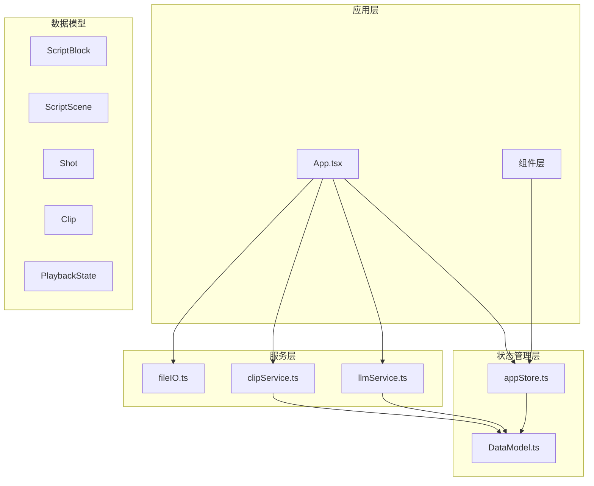
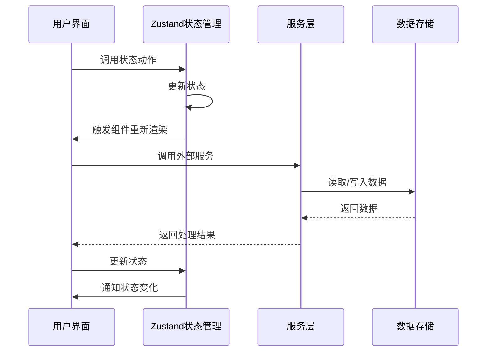
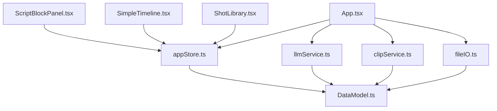

# 状态管理API

<cite>
**本文档引用的文件**
- [appStore.ts](file://src/store/appStore.ts)
- [DataModel.ts](file://src/types/DataModel.ts)
- [App.tsx](file://src/App.tsx)
- [ScriptBlockPanel.tsx](file://src/components/ScriptBlockPanel.tsx)
- [SimpleTimeline.tsx](file://src/components/SimpleTimeline.tsx)
- [ShotLibrary.tsx](file://src/components/ShotLibrary.tsx)
- [fileIO.ts](file://src/utils/fileIO.ts)
- [llmService.ts](file://src/services/llmService.ts)
- [clipService.ts](file://src/services/clipService.ts)
- [package.json](file://package.json)
</cite>

## 目录
1. [简介](#简介)
2. [项目结构](#项目结构)
3. [核心组件](#核心组件)
4. [架构概览](#架构概览)
5. [详细组件分析](#详细组件分析)
6. [依赖分析](#依赖分析)
7. [性能考虑](#性能考虑)
8. [故障排除指南](#故障排除指南)
9. [结论](#结论)

## 简介

CGCUT是一个导演分镜验证MVP工具，采用Zustand作为状态管理解决方案。该应用程序通过状态管理实现了完整的电影分镜创作工作流程，包括剧本分析、镜头拆解、素材管理和时间轴编辑等功能。

本项目的核心是基于Zustand的全局状态管理，提供了完整的动作(actions)、状态(state)和计算属性(selectors)体系，支持实时播放控制、素材库管理、项目数据持久化等高级功能。

## 项目结构

CGCUT项目采用模块化架构设计，主要包含以下核心模块：



**图表来源**
- [appStore.ts](file://src/store/appStore.ts#L1-L195)
- [DataModel.ts](file://src/types/DataModel.ts#L1-L291)

**章节来源**
- [package.json](file://package.json#L1-L36)
- [appStore.ts](file://src/store/appStore.ts#L1-L195)

## 核心组件

### Zustand状态管理器

CGCUT使用Zustand创建了一个类型安全的状态管理器，定义了完整的状态结构和操作接口。

#### 状态结构定义

状态管理器定义了以下主要状态类别：

1. **数据状态**
   - `scriptBlocks`: 剧本段落数组
   - `scriptScenes`: 剺本场景数组
   - `shots`: 素材镜头数组
   - `clips`: 时间轴镜头实例数组
   - `mediaLibrary`: 素材库配置信息
   - `originalScriptContent`: 原始剧本内容

2. **UI状态**
   - `selectedClipId`: 当前选中的剪辑ID
   - `selectedScriptBlockId`: 当前选中的剧本段落ID
   - `highlightedScriptBlockId`: 高亮显示的剧本段落ID
   - `activeTab`: 当前激活的标签页

3. **播放状态**
   - `playbackState`: 完整的播放控制状态

**章节来源**
- [appStore.ts](file://src/store/appStore.ts#L4-L80)

#### 动作(actions)分类

状态管理器提供了完整的动作分类体系：

1. **数据设置动作**
   - `setScriptBlocks(blocks: ScriptBlock[])`
   - `setScriptScenes(scenes: ScriptScene[])`
   - `setShots(shots: Shot[])`
   - `setClips(clips: Clip[])`
   - `setMediaLibrary(config: MediaLibraryConfig | null)`
   - `setOriginalScriptContent(content: string)`

2. **剪辑操作动作**
   - `addClip(clip: Clip)`
   - `updateClip(clipId: string, updates: Partial<Clip>)`
   - `deleteClip(clipId: string)`
   - `reorderClips(newClips: Clip[])`

3. **选择操作动作**
   - `selectClip(clipId: string | null)`
   - `selectScriptBlock(blockId: string | null)`
   - `setHighlightedScriptBlock(blockId: string | null)`
   - `setActiveTab(tab: 'script' | 'timeline' | 'library')`

4. **播放控制动作**
   - `setPlaybackState(state: Partial<PlaybackState>)`
   - `play(): void`
   - `pause(): void`
   - `seek(time: number): void`

5. **计算属性(selectors)**
   - `getScriptBlockActualDuration(blockId: string): number`
   - `getShotById(shotId: string): Shot | undefined`
   - `getClipById(clipId: string): Clip | undefined`
   - `checkProjectStatus(): ProjectCheckStatus`

6. **素材管理动作**
   - `updateShotStatus(shotId: string, status: Shot['status'])`
   - `addShot(shot: Shot)`
   - `deleteShot(shotId: string)`

**章节来源**
- [appStore.ts](file://src/store/appStore.ts#L22-L58)

#### 计算属性实现

计算属性提供了高效的数据查询和状态检查功能：

1. **脚本块时长计算**
   ```typescript
   getScriptBlockActualDuration: (blockId) => {
     const state = get();
     return calculateScriptBlockDuration(blockId, state.clips);
   }
   ```

2. **项目状态检查**
   ```typescript
   checkProjectStatus: () => {
     const state = get();
     // 检查剧本完整性、镜头匹配等
     return {
       hasScript: boolean,
       scriptSegmented: boolean,
       allBlocksHaveClips: boolean,
       allClipsHaveShots: boolean,
       missingBlocks: string[],
       missingShots: string[],
       readyToPlay: boolean,
     };
   }
   ```

**章节来源**
- [appStore.ts](file://src/store/appStore.ts#L131-L178)

## 架构概览

CGCUT采用分层架构设计，实现了清晰的关注点分离：



**图表来源**
- [App.tsx](file://src/App.tsx#L39-L59)
- [appStore.ts](file://src/store/appStore.ts#L60-L194)

### 状态流控制

应用程序实现了完整的状态流控制机制：

1. **初始化流程**
   - 加载项目数据
   - 设置默认素材库配置
   - 初始化播放状态

2. **数据处理流程**
   - LLM剧本分析
   - CLIP素材处理
   - 数据持久化

3. **用户交互流程**
   - 剪辑操作
   - 播放控制
   - 素材管理

**章节来源**
- [App.tsx](file://src/App.tsx#L39-L252)

## 详细组件分析

### 应用主组件(App)

App组件作为整个应用程序的入口点，负责协调各个子组件和状态管理：

#### 核心功能

1. **项目数据管理**
   - 加载和保存项目数据
   - 处理LLM和CLIP服务集成
   - 管理项目状态检查

2. **用户界面协调**
   - 剧本导入和分析
   - 素材库扫描和处理
   - 项目导出功能

3. **状态订阅机制**
   - 订阅多个状态字段
   - 实时响应状态变化
   - 条件渲染和状态更新

**章节来源**
- [App.tsx](file://src/App.tsx#L12-L497)

### 剧本段落面板(ScriptBlockPanel)

ScriptBlockPanel组件负责展示和管理剧本段落：

#### 主要特性

1. **双视图模式**
   - 原始剧本显示
   - LLM拆解结果展示

2. **智能高亮**
   - 基于播放状态的自动高亮
   - 播放指示器同步

3. **时长分析**
   - 实际时长vs预期时长比较
   - 时长状态可视化

4. **占位符创建**
   - 自动创建占位符剪辑
   - 智能素材匹配

**章节来源**
- [ScriptBlockPanel.tsx](file://src/components/ScriptBlockPanel.tsx#L1-L285)

### 时间轴编辑器(SimpleTimeline)

SimpleTimeline组件实现了完整的视频时间轴编辑功能：

#### 核心功能

1. **播放控制**
   - 实时播放/暂停
   - 精确时间跳转
   - 播放指示器

2. **拖拽排序**
   - DnDKit集成
   - 水平拖拽排序
   - 实时位置更新

3. **剪辑管理**
   - 剪辑选择和删除
   - 裁剪参数调整
   - 占位符标记

4. **视频预览**
   - 实时视频播放
   - 时间同步
   - 错误处理

**章节来源**
- [SimpleTimeline.tsx](file://src/components/SimpleTimeline.tsx#L1-L414)

### 素材库管理(ShotLibrary)

ShotLibrary组件提供了完整的素材库管理功能：

#### 管理功能

1. **素材浏览**
   - 情绪过滤
   - 状态筛选
   - 标签显示

2. **素材操作**
   - 替换剪辑素材
   - 标记处理状态
   - 编辑素材信息

3. **路径管理**
   - 素材库路径配置
   - 扫描状态监控
   - 统计信息显示

4. **批量操作**
   - 素材状态批量修改
   - 信息批量编辑
   - 删除确认机制

**章节来源**
- [ShotLibrary.tsx](file://src/components/ShotLibrary.tsx#L1-L359)

## 依赖分析

### 外部依赖

CGCUT项目使用了以下关键依赖：

```mermaid
graph LR
subgraph "核心依赖"
Zustand[zustand ^4.5.0]
React[react ^18.3.1]
ReactDOM[react-dom ^18.3.1]
end
subgraph "拖拽功能"
DnDKit[@dnd-kit/core ^6.1.0]
Sortable[@dnd-kit/sortable ^8.0.0]
Utilities[@dnd-kit/utilities ^3.2.2]
end
subgraph "开发工具"
Vite[vite ^5.4.11]
Tailwind[tailwindcss ^3.4.17]
TypeScript[typescript ^5.6.3]
end
App --> Zustand
App --> React
App --> ReactDOM
Timeline --> DnDKit
Timeline --> Sortable
Timeline --> Utilities
Build --> Vite
Build --> Tailwind
Build --> TypeScript
```

**图表来源**
- [package.json](file://package.json#L14-L34)

### 内部依赖关系

应用程序内部组件之间的依赖关系：



**图表来源**
- [App.tsx](file://src/App.tsx#L1-L11)
- [ScriptBlockPanel.tsx](file://src/components/ScriptBlockPanel.tsx#L1-L4)
- [SimpleTimeline.tsx](file://src/components/SimpleTimeline.tsx#L1-L6)
- [ShotLibrary.tsx](file://src/components/ShotLibrary.tsx#L1-L5)

**章节来源**
- [package.json](file://package.json#L1-L36)

## 性能考虑

### 状态更新优化

1. **选择性订阅**
   - 组件只订阅必要的状态字段
   - 避免不必要的重渲染
   - 使用选择器函数精确获取数据

2. **批量更新**
   - 合理使用set函数进行批量状态更新
   - 避免频繁的状态分割更新
   - 利用状态合并减少重渲染

3. **计算属性缓存**
   - 使用get()函数避免重复计算
   - 合理缓存昂贵的计算结果
   - 避免在渲染过程中进行复杂计算

### 渲染性能优化

1. **虚拟滚动**
   - 对大量数据使用虚拟滚动
   - 懒加载非可见元素
   - 控制DOM节点数量

2. **拖拽优化**
   - 使用transform进行拖拽动画
   - 避免布局抖动
   - 优化拖拽事件处理

3. **媒体资源管理**
   - 智能视频资源加载
   - 及时释放媒体资源
   - 避免内存泄漏

### 数据持久化策略

1. **增量保存**
   - 只保存变更的数据
   - 使用localStorage进行本地持久化
   - 支持离线数据恢复

2. **数据压缩**
   - 对大型数据进行压缩存储
   - 优化JSON序列化
   - 减少存储空间占用

## 故障排除指南

### 常见问题诊断

1. **状态不同步问题**
   - 检查状态订阅是否正确
   - 验证动作调用时机
   - 确认状态更新的原子性

2. **性能问题排查**
   - 使用React DevTools分析重渲染
   - 检查状态订阅范围
   - 优化计算属性实现

3. **数据一致性问题**
   - 验证数据模型定义
   - 检查数据转换逻辑
   - 确认数据验证机制

### 调试技巧

1. **状态监控**
   - 使用React DevTools追踪状态变化
   - 实现状态变更日志
   - 监控性能指标

2. **错误边界**
   - 实现适当的错误处理
   - 提供用户友好的错误信息
   - 支持错误恢复机制

3. **测试策略**
   - 单元测试覆盖关键逻辑
   - 集成测试验证组件交互
   - 性能测试确保用户体验

**章节来源**
- [appStore.ts](file://src/store/appStore.ts#L131-L178)
- [fileIO.ts](file://src/utils/fileIO.ts#L1-L95)

## 结论

CGCUT项目展示了如何在React应用中有效使用Zustand进行状态管理。通过精心设计的状态结构、完善的动作分类和高效的计算属性，实现了完整的电影分镜创作工作流程。

### 主要优势

1. **类型安全**: 完整的TypeScript类型定义确保编译时安全
2. **易于维护**: 清晰的状态结构和动作分类便于理解和维护
3. **高性能**: 优化的选择性订阅和计算属性提升性能
4. **可扩展性**: 模块化设计支持功能扩展和定制

### 最佳实践总结

1. **状态设计原则**
   - 保持状态扁平化
   - 避免状态冗余
   - 合理的数据结构设计

2. **动作实现规范**
   - 使用原子性更新
   - 提供完整的错误处理
   - 保持动作的单一职责

3. **性能优化策略**
   - 实现选择性订阅
   - 优化重渲染机制
   - 合理使用计算属性

通过遵循这些最佳实践，CGCUT项目为类似的创意工具开发提供了优秀的参考模板。