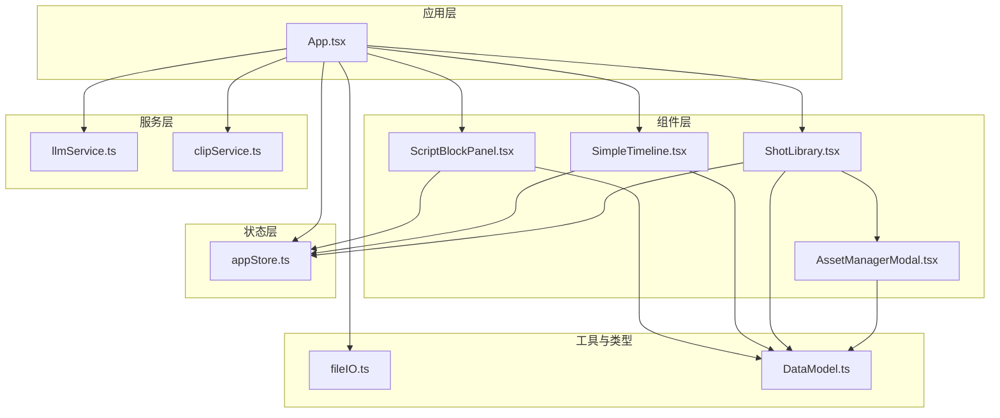
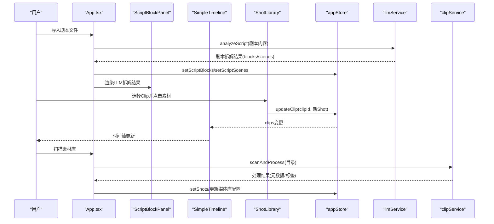
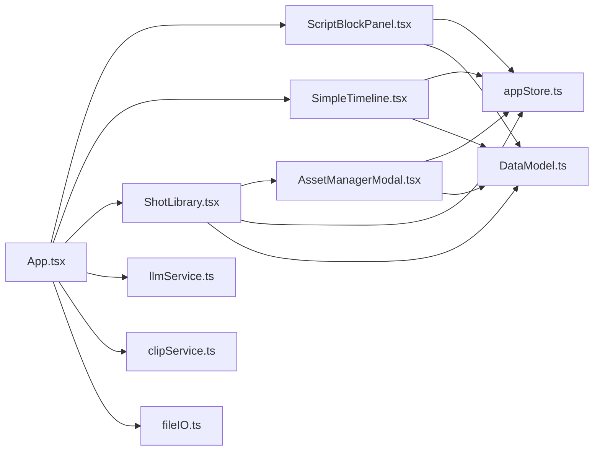

# 组件API

<cite>
**本文档引用的文件**
- [README.md](file://README.md)
- [src/App.tsx](file://src/App.tsx)
- [src/components/ScriptBlockPanel.tsx](file://src/components/ScriptBlockPanel.tsx)
- [src/components/SimpleTimeline.tsx](file://src/components/SimpleTimeline.tsx)
- [src/components/ShotLibrary.tsx](file://src/components/ShotLibrary.tsx)
- [src/components/AssetManagerModal.tsx](file://src/components/AssetManagerModal.tsx)
- [src/store/appStore.ts](file://src/store/appStore.ts)
- [src/types/DataModel.ts](file://src/types/DataModel.ts)
- [src/services/llmService.ts](file://src/services/llmService.ts)
- [src/services/clipService.ts](file://src/services/clipService.ts)
- [src/utils/fileIO.ts](file://src/utils/fileIO.ts)
- [knowledge/cinematography-basics.md](file://knowledge/cinematography-basics.md)
</cite>

## 目录
1. [简介](#简介)
2. [项目结构](#项目结构)
3. [核心组件](#核心组件)
4. [架构总览](#架构总览)
5. [组件详细分析](#组件详细分析)
6. [依赖关系分析](#依赖关系分析)
7. [性能考量](#性能考量)
8. [故障排查指南](#故障排查指南)
9. [结论](#结论)
10. [附录](#附录)

## 简介
本文件为 CGCUT 组件API的权威文档，覆盖所有React组件的公共接口（props）、事件处理、方法调用与生命周期；详解输入参数、输出事件与内部状态管理；提供组件使用示例与最佳实践；说明组件间通信与数据传递机制，并阐述可定制性与扩展点。CGCUT是一个导演分镜验证MVP工具，围绕“剧本段落×镜头组合×实际节奏”进行快速验证，帮助导演在30分钟内从剧本到可播放时间轴，快速发现节奏问题。

## 项目结构
- 组件层：ScriptBlockPanel、SimpleTimeline、ShotLibrary、AssetManagerModal
- 状态层：Zustand全局状态 appStore
- 类型与工具：DataModel、fileIO
- 服务层：llmService（剧本智能拆解）、clipService（视频内容分析）
- 知识库：cinematography-basics.md（分镜标准）

图表来源
- [src/App.tsx](file://src/App.tsx#L1-L497)
- [src/components/ScriptBlockPanel.tsx](file://src/components/ScriptBlockPanel.tsx#L1-L285)
- [src/components/SimpleTimeline.tsx](file://src/components/SimpleTimeline.tsx#L1-L414)
- [src/components/ShotLibrary.tsx](file://src/components/ShotLibrary.tsx#L1-L359)
- [src/components/AssetManagerModal.tsx](file://src/components/AssetManagerModal.tsx#L1-L511)
- [src/store/appStore.ts](file://src/store/appStore.ts#L1-L195)
- [src/services/llmService.ts](file://src/services/llmService.ts#L1-L476)
- [src/services/clipService.ts](file://src/services/clipService.ts#L1-L394)
- [src/utils/fileIO.ts](file://src/utils/fileIO.ts#L1-L95)
- [src/types/DataModel.ts](file://src/types/DataModel.ts#L1-L291)

章节来源
- [README.md](file://README.md#L126-L150)
- [src/App.tsx](file://src/App.tsx#L1-L497)

## 核心组件
- ScriptBlockPanel：左侧剧本段落面板，支持原文/LLM拆解双Tab、场景折叠、时长对比、占位符创建、播放高亮联动。
- SimpleTimeline：中间简化时间轴，支持拖拽排序、点击跳转、播放预览、裁剪手柄（预留）、占位符标识。
- ShotLibrary：右侧素材库，支持情绪/状态筛选、素材替换、路径配置、批量管理、CLIP标签展示。
- AssetManagerModal：素材库管理弹窗，支持搜索、排序、批量处理、状态变更、路径引用导入。
- 全局状态：Zustand appStore，集中管理剧本、镜头、素材、播放状态与UI选择状态。
- 服务：llmService（剧本分析）、clipService（视频内容分析），提供MVP模拟与生产集成接口。

章节来源
- [src/components/ScriptBlockPanel.tsx](file://src/components/ScriptBlockPanel.tsx#L5-L285)
- [src/components/SimpleTimeline.tsx](file://src/components/SimpleTimeline.tsx#L10-L414)
- [src/components/ShotLibrary.tsx](file://src/components/ShotLibrary.tsx#L7-L359)
- [src/components/AssetManagerModal.tsx](file://src/components/AssetManagerModal.tsx#L5-L511)
- [src/store/appStore.ts](file://src/store/appStore.ts#L4-L194)
- [src/services/llmService.ts](file://src/services/llmService.ts#L62-L476)
- [src/services/clipService.ts](file://src/services/clipService.ts#L22-L394)

## 架构总览
组件通过Zustand全局状态进行数据共享与状态驱动，服务层负责外部能力（LLM/CLIP），工具层负责数据持久化与项目导出。组件间通信主要通过状态订阅与回调事件实现。

图表来源
- [src/App.tsx](file://src/App.tsx#L71-L252)
- [src/services/llmService.ts](file://src/services/llmService.ts#L72-L101)
- [src/services/clipService.ts](file://src/services/clipService.ts#L36-L60)
- [src/store/appStore.ts](file://src/store/appStore.ts#L82-L194)
- [src/components/ShotLibrary.tsx](file://src/components/ShotLibrary.tsx#L42-L53)

## 组件详细分析

### ScriptBlockPanel 组件API
- 组件职责
  - 展示剧本段落（支持场景分组与折叠）
  - 原文与LLM拆解双Tab切换
  - 实时显示段落期望时长与实际时长对比
  - 播放时高亮当前段落
  - 为段落创建占位符Clip
- Props
  - className?: string
- 状态与订阅
  - scriptBlocks/scriptScenes/originalScriptContent/clips/highlightedScriptBlockId/playbackState/getScriptBlockActualDuration/addClip/shots
- 事件与交互
  - 场景折叠/展开
  - 为段落创建占位符Clip（内部生成占位Shot或复用匹配情绪Shot）
  - Tab切换（原文/解析）
- 方法与回调
  - getCurrentBlockId()：根据播放时间定位当前ScriptBlock
  - getDurationStatus(block)：计算时长状态（过短/过长/正常/空）
  - createPlaceholderClip(blockId)：创建占位Clip
- 生命周期
  - 初始化：订阅全局状态
  - effect：监听高亮ID变化并滚动至可见
- 内部状态
  - activeTab：'original' | 'parsed'
  - highlightedRef：DOM引用，用于滚动定位
- 可定制性
  - 支持自定义容器类名
  - 可扩展时长对比颜色与提示文案
- 最佳实践
  - 在播放时启用自动高亮，便于导演核对节奏
  - 使用“+ 占位”快速填充未匹配的段落

章节来源
- [src/components/ScriptBlockPanel.tsx](file://src/components/ScriptBlockPanel.tsx#L5-L285)
- [src/store/appStore.ts](file://src/store/appStore.ts#L132-L145)
- [src/types/DataModel.ts](file://src/types/DataModel.ts#L198-L205)

### SimpleTimeline 组件API
- 组件职责
  - 单轨时间轴编辑与播放预览
  - 拖拽排序Clip
  - 点击时间轴跳转播放位置
  - 播放指示器与时间刻度标尺
  - 占位符Clip标识与删除
- Props
  - className?: string
- 状态与订阅
  - clips/selectedClipId/playbackState/reorderClips/selectClip/deleteClip/seek
- 事件与交互
  - 拖拽结束：handleDragEnd，重排clips并调用reorderClips
  - 点击时间轴：handleTimelineClick，计算点击时间并seek
  - 播放控制：播放/暂停/停止
- 子组件
  - PlayheadIndicator：播放指示器
  - TimeRuler：时间刻度标尺（秒级与半秒次刻度）
  - TimelineClip：单个Clip条目（含拖拽、选择、删除、裁剪手柄预留）
  - VideoPreview：视频预览与播放循环
- 方法与回调
  - formatTime(seconds)：时间格式化
  - findCurrentClip()：根据播放时间定位当前Clip
- 生命周期
  - 初始化：订阅播放状态
  - effect：播放循环与视频同步
- 内部状态
  - timelineRef：时间轴容器引用
  - _isResizing：裁剪手柄状态（预留）
- 可定制性
  - PIXELS_PER_SECOND：时间轴缩放比例
  - 可扩展裁剪拖拽逻辑
- 最佳实践
  - 保持每个Clip的trim_in/trim_out合理范围
  - 使用播放指示器与时间刻度核对节奏

章节来源
- [src/components/SimpleTimeline.tsx](file://src/components/SimpleTimeline.tsx#L10-L414)
- [src/store/appStore.ts](file://src/store/appStore.ts#L91-L130)
- [src/types/DataModel.ts](file://src/types/DataModel.ts#L141-L148)

### ShotLibrary 组件API
- 组件职责
  - 展示素材库，支持情绪/状态筛选
  - 替换选中Clip绑定的Shot
  - 配置素材库路径
  - 批量管理（标记已处理、编辑标签、修改情绪、删除）
- Props
  - className?: string
- 状态与订阅
  - shots/setShots/deleteShot/updateShotStatus/mediaLibrary/setMediaLibrary/selectedClipId/getClipById/updateClip
- 事件与交互
  - 选择Clip后点击素材：handleReplaceShot
  - 设置素材库路径：handleSetLibraryPath
  - 标记已处理：handleMarkAsReady
  - 编辑标签：handleEditShot
  - 修改情绪：handleChangeEmotion
  - 删除素材：handleDeleteShot
- 子组件
  - AssetManagerModal：专业素材库管理弹窗
- 方法与回调
  - getStatusDisplay(status)：状态可视化
  - filteredShots：按情绪/状态过滤
- 生命周期
  - 初始化：订阅全局状态
- 内部状态
  - emotionFilter/statusFilter：筛选器
  - showPathConfig/showAssetManager：模态框开关
  - libraryPath：路径输入
- 可定制性
  - 支持自定义容器类名
  - 可扩展更多筛选维度
- 最佳实践
  - 使用情绪筛选快速匹配镜头情绪
  - 通过AssetManagerModal进行批量处理与状态管理

章节来源
- [src/components/ShotLibrary.tsx](file://src/components/ShotLibrary.tsx#L7-L359)
- [src/components/AssetManagerModal.tsx](file://src/components/AssetManagerModal.tsx#L14-L511)
- [src/store/appStore.ts](file://src/store/appStore.ts#L180-L194)

### AssetManagerModal 组件API
- 组件职责
  - 专业素材库管理弹窗，参考DAM系统设计
  - 支持搜索、排序、批量操作（处理、删除、修改情绪）
  - 状态统计卡片与处理进度可视化
- Props
  - isOpen: boolean
  - onClose: () => void
- 状态与订阅
  - shots/setShots/updateShotStatus/deleteShot/mediaLibrary
- 事件与交互
  - 切换标签页：按状态筛选
  - 搜索与排序：searchQuery/sortBy
  - 全选/取消全选：handleToggleSelectAll
  - 批量处理：handleBatchProcess（模拟处理）
  - 批量删除：handleBatchDelete
  - 添加路径/批量导入：handleAddPathReference/handleBatchImport
  - 批量修改情绪：handleBatchChangeEmotion
- 方法与回调
  - getStatusDisplay(status)：状态可视化
  - filteredShots：过滤与排序
- 生命周期
  - 初始化：订阅全局状态
- 内部状态
  - selectedTab/searchQuery/sortBy/processingProgress/isProcessing
  - selectedShots：选中集合
- 可定制性
  - 支持扩展排序字段与筛选条件
  - 可接入真实CLIP处理API
- 最佳实践
  - 使用批量处理提升素材库维护效率
  - 通过状态统计掌握素材库健康度

章节来源
- [src/components/AssetManagerModal.tsx](file://src/components/AssetManagerModal.tsx#L5-L511)
- [src/store/appStore.ts](file://src/store/appStore.ts#L180-L194)

### 全局状态 appStore API
- 状态字段
  - 数据：scriptBlocks/scriptScenes/shots/clips/mediaLibrary/originalScriptContent
  - UI：selectedClipId/selectedScriptBlockId/highlightedScriptBlockId/activeTab
  - 播放：playbackState
- Actions
  - 设置：setScriptBlocks/setScriptScenes/setShots/setClips/setMediaLibrary/setOriginalScriptContent/setActiveTab
  - Clip操作：addClip/updateClip/deleteClip/reorderClips
  - 选择：selectClip/selectScriptBlock/setHighlightedScriptBlock
  - 播放：setPlaybackState/play/pause/seek
  - 查询：getScriptBlockActualDuration/getShotById/getClipById/checkProjectStatus
  - 素材：updateShotStatus/addShot/deleteShot
- 计算函数
  - getScriptBlockActualDuration：按script_block_id汇总Clip时长
  - checkProjectStatus：项目状态检查（剧本导入/分段/占位/素材匹配/可播放）
- 生命周期
  - 初始化：设置初始状态
  - 计算：checkProjectStatus在调用时计算
- 可定制性
  - 可扩展更多查询与计算函数
  - 可增加更多UI状态字段
- 最佳实践
  - 通过统一Actions更新状态，避免直接修改
  - 使用计算函数减少重复逻辑

章节来源
- [src/store/appStore.ts](file://src/store/appStore.ts#L4-L194)
- [src/types/DataModel.ts](file://src/types/DataModel.ts#L198-L291)

### 服务层 API

#### LLMService
- 职责
  - 剧本智能拆解，生成场景与段落
  - 使用NVIDIA API或mock分析
- 方法
  - analyzeScript(request): Promise<LLMScriptAnalysisResponse>
  - callNvidiaAPI(request): Promise<LLMScriptAnalysisResponse>（私有）
  - mockLLMAnalysis(request): Promise<LLMScriptAnalysisResponse>（私有）
  - updateConfig(config): void
- 请求/响应
  - LLMScriptAnalysisRequest：scriptContent/fileName/options
  - LLMScriptAnalysisResponse：scenes/blocks/metadata/status/error
- 最佳实践
  - 在生产环境启用真实API，MVP阶段使用mock
  - 严格遵循分镜拆解规则与格式

章节来源
- [src/services/llmService.ts](file://src/services/llmService.ts#L62-L476)
- [src/types/DataModel.ts](file://src/types/DataModel.ts#L59-L84)

#### CLIPService
- 职责
  - 视频内容分析与元数据提取
  - 扫描目录并批量处理视频文件
- 方法
  - scanAndProcess(request): Promise<CLIPProcessResponse>
  - processSingleFile(filePath): Promise<CLIPMetadata>
  - extractExistingMetadata(filePath): Promise<CLIPMetadata|null>
  - mockCLIPProcessing(request): Promise<CLIPProcessResponse>（私有）
  - mockSingleFileProcessing(filePath, extractKeyframes): Promise<CLIPMetadata>（私有）
- 请求/响应
  - CLIPScanRequest：directoryPath/filePatterns/skipProcessed/extractKeyframes
  - CLIPProcessResponse：processedFiles/summary/status/error
  - CLIPMetadata：embeddings/tags/description/emotions/keyframes/processed_at/model_version
- 最佳实践
  - MVP阶段使用mock，生产环境接入真实API
  - 支持跳过已处理文件与关键帧提取

章节来源
- [src/services/clipService.ts](file://src/services/clipService.ts#L22-L394)
- [src/types/DataModel.ts](file://src/types/DataModel.ts#L22-L49)

### 工具层 API

#### fileIO
- 职责
  - 项目数据加载/保存（MVP阶段使用localStorage）
  - JSON文件读取与导出
- 方法
  - loadJSON<T>(filename): Promise<T>
  - saveJSON<T>(filename, data): Promise<void>
  - loadFromLocalStorage<T>(filename, fallback): Promise<T>
  - loadProjectData(): Promise<{scriptBlocks, shots, clips, config}>
  - saveProjectData(clips): Promise<void>
  - exportProjectData(clips, filename): void
- 最佳实践
  - 使用loadProjectData统一加载项目数据
  - 通过exportProjectData导出项目以便备份

章节来源
- [src/utils/fileIO.ts](file://src/utils/fileIO.ts#L7-L95)

## 依赖关系分析

图表来源
- [src/App.tsx](file://src/App.tsx#L1-L11)
- [src/components/ScriptBlockPanel.tsx](file://src/components/ScriptBlockPanel.tsx#L1-L4)
- [src/components/SimpleTimeline.tsx](file://src/components/SimpleTimeline.tsx#L1-L6)
- [src/components/ShotLibrary.tsx](file://src/components/ShotLibrary.tsx#L1-L5)
- [src/components/AssetManagerModal.tsx](file://src/components/AssetManagerModal.tsx#L1-L3)
- [src/store/appStore.ts](file://src/store/appStore.ts#L1-L2)
- [src/services/llmService.ts](file://src/services/llmService.ts#L1)
- [src/services/clipService.ts](file://src/services/clipService.ts#L1)
- [src/utils/fileIO.ts](file://src/utils/fileIO.ts#L1)
- [src/types/DataModel.ts](file://src/types/DataModel.ts#L1)

章节来源
- [src/App.tsx](file://src/App.tsx#L1-L11)
- [src/store/appStore.ts](file://src/store/appStore.ts#L1-L2)

## 性能考量
- 时间轴渲染
  - 使用PIXELS_PER_SECOND控制缩放，避免超大时间导致DOM过密
  - 仅渲染可见区域，利用滚动容器与相对定位
- 播放循环
  - 使用requestAnimationFrame驱动播放，避免高频setState
  - 仅在播放状态更新current_time，暂停时清理动画帧
- LLM/CLIP处理
  - MVP阶段使用mock，减少网络开销
  - 生产环境建议分批处理与超时控制
- 状态更新
  - 通过Zustand集中管理，避免跨组件重复订阅
  - 使用计算函数（如getScriptBlockActualDuration）减少重复计算

[本节为通用指导，无需特定文件引用]

## 故障排查指南
- 剧本导入失败
  - 检查文件格式（仅支持.txt/.json；.doc/.docx需后端支持）
  - 查看LLM分析错误提示，确认API可用性
- 素材库扫描失败
  - 确认素材库路径已设置且可访问
  - 检查CLIP处理返回的错误信息
- 时间轴播放异常
  - 确认当前Clip的trim_in/trim_out与duration一致
  - 检查视频文件路径是否有效
- 状态不一致
  - 使用checkProjectStatus检查项目状态
  - 通过console日志观察状态变化

章节来源
- [src/App.tsx](file://src/App.tsx#L83-L91)
- [src/App.tsx](file://src/App.tsx#L148-L153)
- [src/App.tsx](file://src/App.tsx#L173-L176)
- [src/services/clipService.ts](file://src/services/clipService.ts#L45-L59)
- [src/store/appStore.ts](file://src/store/appStore.ts#L148-L178)

## 结论
CGCUT通过清晰的组件划分与Zustand状态管理，实现了导演分镜验证的核心流程：剧本导入与拆解、时间轴编辑与播放、素材库管理与替换。组件API设计简洁、职责明确，具备良好的可定制性与扩展性。建议在生产环境中接入真实LLM/CLIP服务，并持续优化播放循环与渲染性能，以提升用户体验。

[本节为总结性内容，无需特定文件引用]

## 附录

### 组件间通信与数据传递机制
- 状态订阅
  - 组件通过useAppStore订阅所需状态字段
  - 通过actions触发状态更新，实现单向数据流
- 事件回调
  - 组件内部事件（如拖拽、点击）通过actions更新状态
  - 状态变化驱动其他组件重渲染
- 服务集成
  - App.tsx作为协调者，调用llmService与clipService
  - 服务结果经由actions写入全局状态

章节来源
- [src/components/ScriptBlockPanel.tsx](file://src/components/ScriptBlockPanel.tsx#L9-L29)
- [src/components/SimpleTimeline.tsx](file://src/components/SimpleTimeline.tsx#L331-L356)
- [src/components/ShotLibrary.tsx](file://src/components/ShotLibrary.tsx#L11-L53)
- [src/App.tsx](file://src/App.tsx#L71-L252)

### 组件使用示例与最佳实践
- 导入剧本
  - 通过App.tsx的文件输入触发handleImportScript，调用llmService分析并更新状态
- 时间轴编辑
  - 拖拽排序：SimpleTimeline.handleDragEnd -> reorderClips
  - 点击跳转：SimpleTimeline.handleTimelineClick -> seek
- 素材替换
  - ShotLibrary.handleReplaceShot -> updateClip
- 素材库管理
  - 通过AssetManagerModal进行批量处理与状态变更

章节来源
- [src/App.tsx](file://src/App.tsx#L71-L169)
- [src/components/SimpleTimeline.tsx](file://src/components/SimpleTimeline.tsx#L343-L367)
- [src/components/ShotLibrary.tsx](file://src/components/ShotLibrary.tsx#L42-L53)
- [src/components/AssetManagerModal.tsx](file://src/components/AssetManagerModal.tsx#L80-L126)

### 可定制性与扩展点
- 组件扩展
  - ScriptBlockPanel：可增加更多时长对比颜色与提示
  - SimpleTimeline：可实现裁剪拖拽逻辑与多轨支持
  - ShotLibrary：可增加更多筛选维度与排序选项
- 状态扩展
  - appStore：可增加更多UI状态字段与计算函数
- 服务扩展
  - llmService/clipService：可接入真实API与错误恢复机制
- 工具扩展
  - fileIO：可替换为Electron文件系统API

章节来源
- [src/components/SimpleTimeline.tsx](file://src/components/SimpleTimeline.tsx#L259-L266)
- [src/services/llmService.ts](file://src/services/llmService.ts#L429-L462)
- [src/services/clipService.ts](file://src/services/clipService.ts#L356-L390)
- [src/utils/fileIO.ts](file://src/utils/fileIO.ts#L25-L34)