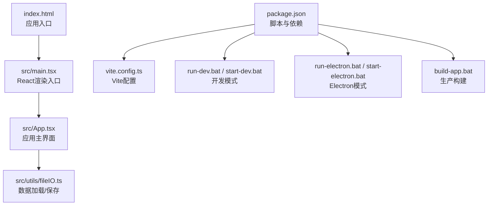
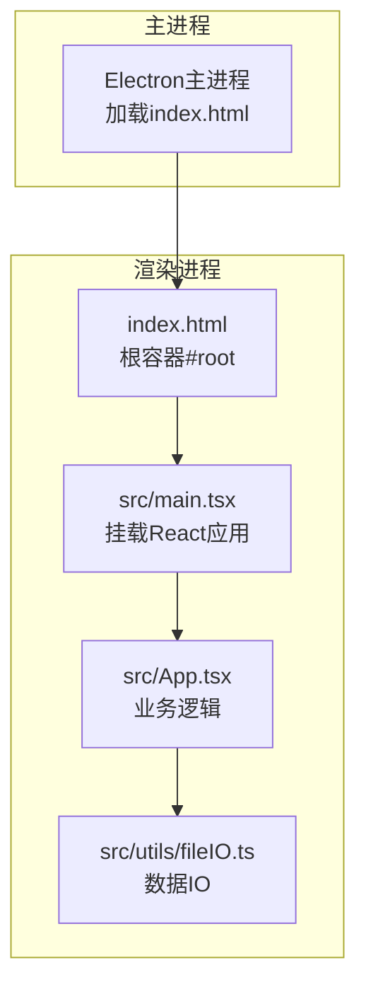
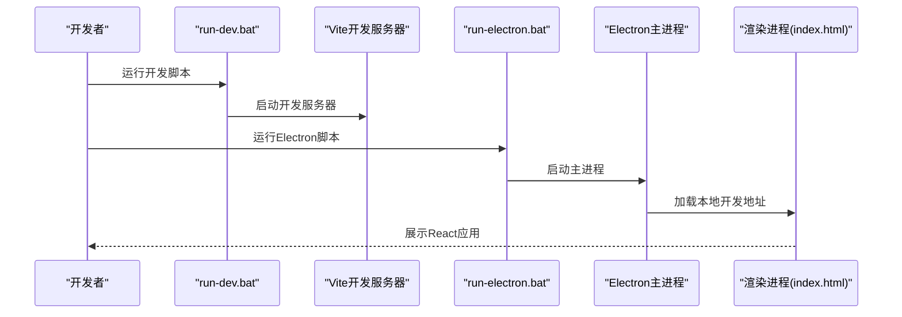
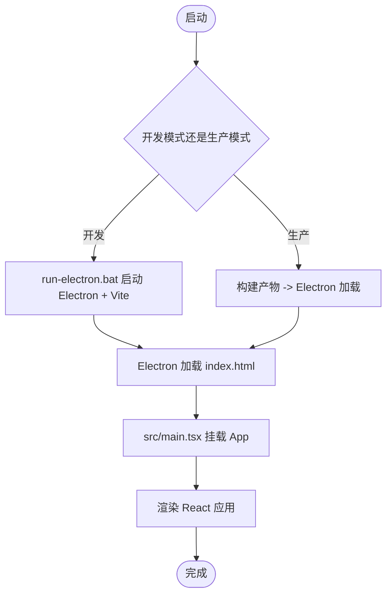
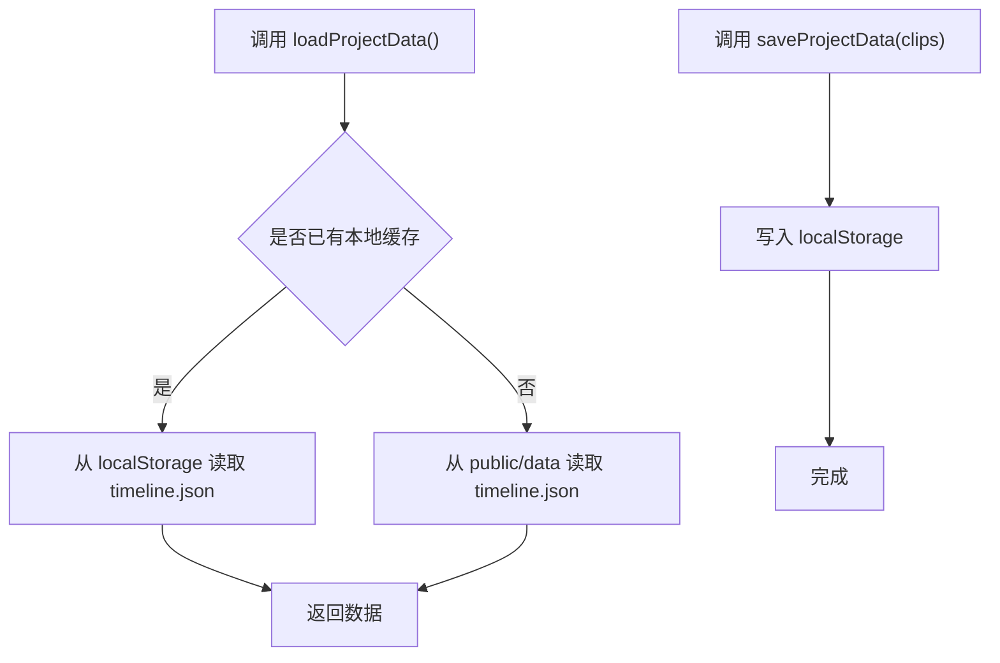
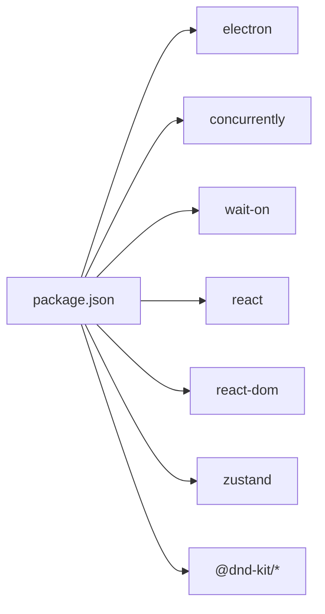

# Electron集成

<cite>
**本文引用的文件**
- [package.json](file://package.json)
- [vite.config.ts](file://vite.config.ts)
- [index.html](file://index.html)
- [src/main.tsx](file://src/main.tsx)
- [src/App.tsx](file://src/App.tsx)
- [src/utils/fileIO.ts](file://src/utils/fileIO.ts)
- [run-dev.bat](file://run-dev.bat)
- [run-electron.bat](file://run-electron.bat)
- [start-dev.bat](file://start-dev.bat)
- [start-electron.bat](file://start-electron.bat)
- [build-app.bat](file://build-app.bat)
- [LAUNCHERS.md](file://LAUNCHERS.md)
</cite>

## 目录
1. [简介](#简介)
2. [项目结构](#项目结构)
3. [核心组件](#核心组件)
4. [架构总览](#架构总览)
5. [详细组件分析](#详细组件分析)
6. [依赖分析](#依赖分析)
7. [性能考虑](#性能考虑)
8. [故障排查指南](#故障排查指南)
9. [结论](#结论)
10. [附录](#附录)

## 简介
本指南面向CGCUT项目，提供基于Electron的桌面应用集成开发方案。当前仓库已具备React + Vite前端工程，并通过脚本实现了“开发模式”下同时启动Vite开发服务器与Electron主进程的组合运行方式；生产模式下可通过构建产物进行打包与分发。本文将围绕以下目标展开：
- 解释Electron与React应用的集成方式（主进程与渲染进程配置思路）
- 说明开发模式与生产模式的不同启动方式
- 提供Electron原生能力的使用路径（文件系统访问、对话框调用、菜单定制等）
- 说明打包与分发流程（asar打包、签名与自动更新机制）
- 提供常见问题的调试方法与性能优化建议

## 项目结构
CGCUT采用React + Vite作为前端框架，入口HTML与React根节点位于src目录之外，便于Electron加载。主要文件与职责如下：
- package.json：定义了开发与打包脚本，以及Electron依赖
- vite.config.ts：配置Vite插件、基础路径与开发端口
- index.html：应用入口页面，挂载React根节点
- src/main.tsx：React应用的渲染入口，负责挂载App组件
- src/App.tsx：应用主界面与业务逻辑（含文件导入、导出、素材扫描等）
- src/utils/fileIO.ts：项目数据的加载与保存（当前使用fetch与localStorage，后续可接入Electron原生文件系统）
- 启动批处理脚本：run-dev.bat、run-electron.bat、start-dev.bat、start-electron.bat、build-app.bat
- LAUNCHERS.md：启动器使用说明

图表来源
- [package.json](file://package.json#L1-L36)
- [vite.config.ts](file://vite.config.ts#L1-L12)
- [index.html](file://index.html#L1-L13)
- [src/main.tsx](file://src/main.tsx#L1-L11)
- [src/App.tsx](file://src/App.tsx#L1-L497)
- [src/utils/fileIO.ts](file://src/utils/fileIO.ts#L1-L95)
- [run-dev.bat](file://run-dev.bat#L1-L41)
- [run-electron.bat](file://run-electron.bat#L1-L40)
- [start-dev.bat](file://start-dev.bat#L1-L53)
- [start-electron.bat](file://start-electron.bat#L1-L47)
- [build-app.bat](file://build-app.bat#L1-L44)

章节来源
- [package.json](file://package.json#L1-L36)
- [vite.config.ts](file://vite.config.ts#L1-L12)
- [index.html](file://index.html#L1-L13)
- [src/main.tsx](file://src/main.tsx#L1-L11)
- [src/App.tsx](file://src/App.tsx#L1-L497)
- [src/utils/fileIO.ts](file://src/utils/fileIO.ts#L1-L95)
- [run-dev.bat](file://run-dev.bat#L1-L41)
- [run-electron.bat](file://run-electron.bat#L1-L40)
- [start-dev.bat](file://start-dev.bat#L1-L53)
- [start-electron.bat](file://start-electron.bat#L1-L47)
- [build-app.bat](file://build-app.bat#L1-L44)
- [LAUNCHERS.md](file://LAUNCHERS.md#L1-L44)

## 核心组件
- 应用入口与渲染
  - index.html提供根容器，React在src/main.tsx中挂载App组件
- 开发与打包脚本
  - package.json中的脚本用于启动Vite与Electron组合开发，以及生产构建
- 数据加载与保存
  - src/utils/fileIO.ts当前通过fetch加载public/data中的JSON与localStorage保存，后续可替换为Electron原生文件系统API
- 启动器脚本
  - run-dev.bat与start-dev.bat用于Web开发模式
  - run-electron.bat与start-electron.bat用于Electron桌面应用模式
  - build-app.bat用于生产构建

章节来源
- [index.html](file://index.html#L1-L13)
- [src/main.tsx](file://src/main.tsx#L1-L11)
- [package.json](file://package.json#L1-L36)
- [src/utils/fileIO.ts](file://src/utils/fileIO.ts#L1-L95)
- [run-dev.bat](file://run-dev.bat#L1-L41)
- [run-electron.bat](file://run-electron.bat#L1-L40)
- [start-dev.bat](file://start-dev.bat#L1-L53)
- [start-electron.bat](file://start-electron.bat#L1-L47)
- [build-app.bat](file://build-app.bat#L1-L44)

## 架构总览
CGCUT的Electron集成采用“前端渲染进程 + 主进程桥接”的模式：
- 渲染进程：React应用在index.html中加载，通过src/main.tsx挂载App组件
- 主进程：通过Electron启动，加载index.html作为窗口内容
- 开发模式：Vite开发服务器与Electron并行运行，Electron加载本地开发地址
- 生产模式：构建产物由Electron加载，实现桌面应用分发

图表来源
- [index.html](file://index.html#L1-L13)
- [src/main.tsx](file://src/main.tsx#L1-L11)
- [src/App.tsx](file://src/App.tsx#L1-L497)
- [src/utils/fileIO.ts](file://src/utils/fileIO.ts#L1-L95)

## 详细组件分析

### 组件A：开发模式与生产模式启动流程
- 开发模式
  - run-dev.bat：启动Vite开发服务器，端口默认5173
  - run-electron.bat：启动Electron并组合运行Vite与Electron，便于联调
  - start-dev.bat：在新窗口启动Vite并自动打开浏览器
  - start-electron.bat：在新窗口启动Electron并组合运行Vite与Electron
- 生产模式
  - build-app.bat：执行生产构建，生成静态资源供Electron加载

图表来源
- [run-dev.bat](file://run-dev.bat#L1-L41)
- [run-electron.bat](file://run-electron.bat#L1-L40)
- [start-dev.bat](file://start-dev.bat#L1-L53)
- [start-electron.bat](file://start-electron.bat#L1-L47)
- [vite.config.ts](file://vite.config.ts#L1-L12)
- [index.html](file://index.html#L1-L13)

章节来源
- [run-dev.bat](file://run-dev.bat#L1-L41)
- [run-electron.bat](file://run-electron.bat#L1-L40)
- [start-dev.bat](file://start-dev.bat#L1-L53)
- [start-electron.bat](file://start-electron.bat#L1-L47)
- [vite.config.ts](file://vite.config.ts#L1-L12)
- [index.html](file://index.html#L1-L13)
- [LAUNCHERS.md](file://LAUNCHERS.md#L1-L44)

### 组件B：Electron主进程与渲染进程配置要点
- 主进程加载策略
  - 当前通过Electron直接加载本地开发地址（由run-electron.bat组合Vite与Electron），生产模式下可改为加载构建后的静态资源
- 渲染进程入口
  - index.html提供根容器，React在src/main.tsx挂载App组件
- Vite基础路径
  - vite.config.ts设置base为相对路径，确保构建后资源正确解析

图表来源
- [run-electron.bat](file://run-electron.bat#L1-L40)
- [index.html](file://index.html#L1-L13)
- [src/main.tsx](file://src/main.tsx#L1-L11)
- [vite.config.ts](file://vite.config.ts#L1-L12)

章节来源
- [run-electron.bat](file://run-electron.bat#L1-L40)
- [index.html](file://index.html#L1-L13)
- [src/main.tsx](file://src/main.tsx#L1-L11)
- [vite.config.ts](file://vite.config.ts#L1-L12)

### 组件C：Electron原生功能使用方法
- 文件系统访问
  - 当前src/utils/fileIO.ts通过fetch与localStorage实现数据读写，适合Web环境
  - 在Electron中可替换为原生文件系统API（例如使用dialog与shell模块配合原生fs），以实现真实文件读写与对话框交互
- 对话框调用
  - Electron提供对话框API，可用于打开/保存文件、选择目录等
- 菜单定制
  - Electron支持自定义应用菜单，可在主进程中创建并绑定事件

注意：以上为集成建议与使用路径说明，具体实现需在主进程与渲染进程之间建立IPC通信通道。

章节来源
- [src/utils/fileIO.ts](file://src/utils/fileIO.ts#L1-L95)

### 组件D：打包与分发流程
- asar打包
  - Electron支持将应用资源打包为asar归档，提升加载效率与安全性
- 签名
  - Windows/macOS/Linux平台均需对应用进行签名，以满足系统安全策略
- 自动更新
  - 可结合Electron自动更新机制或第三方方案（如Squirrel）实现应用更新

说明：上述为通用流程建议，具体实现需在构建脚本与主进程中增加相应配置。

章节来源
- [package.json](file://package.json#L1-L36)

### 组件E：数据加载与保存（与Electron集成的关系）
- 当前实现
  - 通过fetch加载public/data中的JSON文件，通过localStorage保存用户项目数据
- Electron集成建议
  - 替换为原生文件系统API，提供真实的文件打开/保存对话框与持久化存储
  - 保留现有接口（如loadProjectData/saveProjectData）以便最小化迁移成本

图表来源
- [src/utils/fileIO.ts](file://src/utils/fileIO.ts#L1-L95)
- [src/App.tsx](file://src/App.tsx#L1-L497)

章节来源
- [src/utils/fileIO.ts](file://src/utils/fileIO.ts#L1-L95)
- [src/App.tsx](file://src/App.tsx#L1-L497)

## 依赖分析
- 开发依赖
  - electron：桌面应用运行时
  - concurrently、wait-on：用于组合启动Vite与Electron
- 运行时依赖
  - React、ReactDOM、Zustand、拖拽库等：前端运行所需
- 构建链路
  - Vite负责前端构建，Electron负责加载构建产物或开发地址

图表来源
- [package.json](file://package.json#L1-L36)

章节来源
- [package.json](file://package.json#L1-L36)

## 性能考虑
- 构建优化
  - 合理拆分包、启用压缩与Tree Shaking，减少首屏体积
- 资源加载
  - 使用相对路径与合适的base配置，避免资源404导致的重试开销
- 进程间通信
  - 渲染进程与主进程的IPC调用应避免频繁同步阻塞，必要时采用异步与节流
- 文件IO
  - 大文件读写建议在后台线程或子进程中执行，避免阻塞UI

## 故障排查指南
- 端口占用
  - Vite默认端口5173被占用时会自动选择其他端口，若Electron未正确连接，请确认脚本输出的实际地址
- 权限问题
  - 首次运行会自动安装依赖，若出现权限错误，尝试以管理员身份运行脚本
- 构建失败
  - build-app.bat执行失败时，检查控制台输出并修复TypeScript或Vite配置问题
- Electron窗口空白
  - 确认index.html与src/main.tsx路径正确，开发模式下Electron加载的是本地开发地址

章节来源
- [run-dev.bat](file://run-dev.bat#L1-L41)
- [run-electron.bat](file://run-electron.bat#L1-L40)
- [start-dev.bat](file://start-dev.bat#L1-L53)
- [start-electron.bat](file://start-electron.bat#L1-L47)
- [build-app.bat](file://build-app.bat#L1-L44)
- [LAUNCHERS.md](file://LAUNCHERS.md#L1-L44)

## 结论
CGCUT项目已具备良好的前端工程基础与Electron组合开发脚本。通过替换数据IO为Electron原生文件系统API、完善主进程菜单与对话框、以及引入asar打包与签名流程，即可实现稳定的桌面应用交付。建议按以下步骤推进：
- 在主进程中接入对话框与文件系统API，并通过IPC向渲染进程暴露
- 保留现有数据接口，逐步替换为原生文件IO
- 配置生产构建与asar打包，完善签名与自动更新机制
- 持续优化构建体积与IPC性能，提升用户体验

## 附录
- 启动器使用建议
  - 开发调试：优先使用run-dev.bat或run-electron.bat，便于实时日志与联调
  - 快速启动：使用start-dev.bat自动打开浏览器
  - 桌面应用体验：使用run-electron.bat获得完整桌面应用体验
- 注意事项
  - 首次运行会自动安装依赖，确保系统已安装Node.js与npm
  - 如遇权限问题，可能需要以管理员身份运行脚本

章节来源
- [LAUNCHERS.md](file://LAUNCHERS.md#L1-L44)