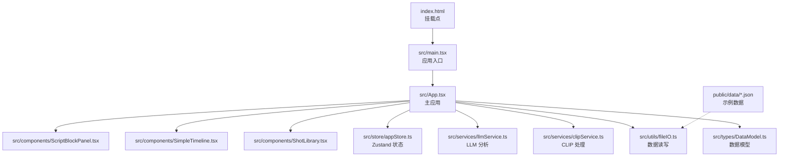
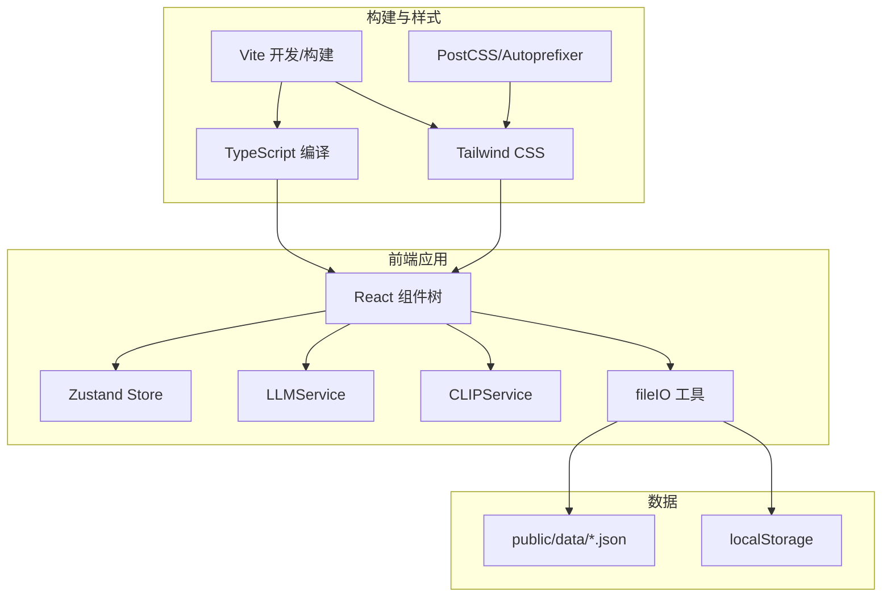
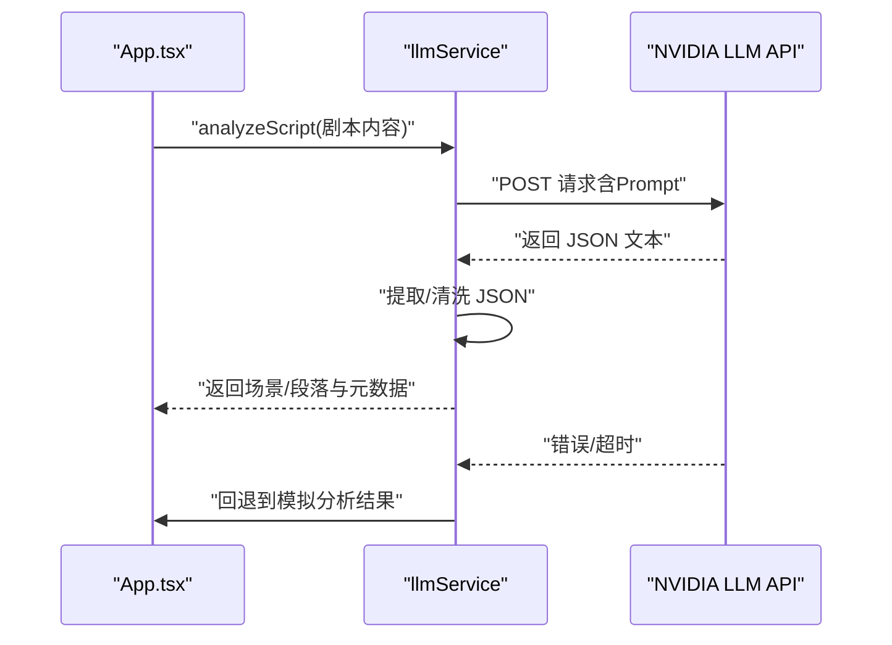
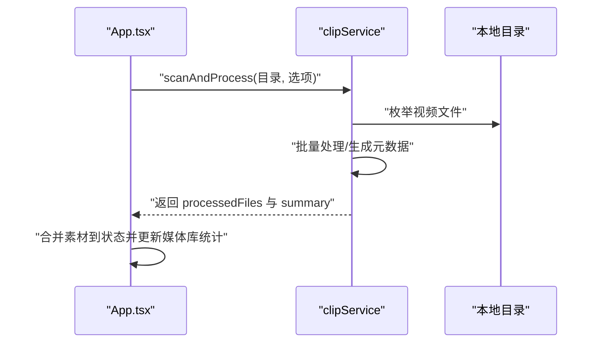
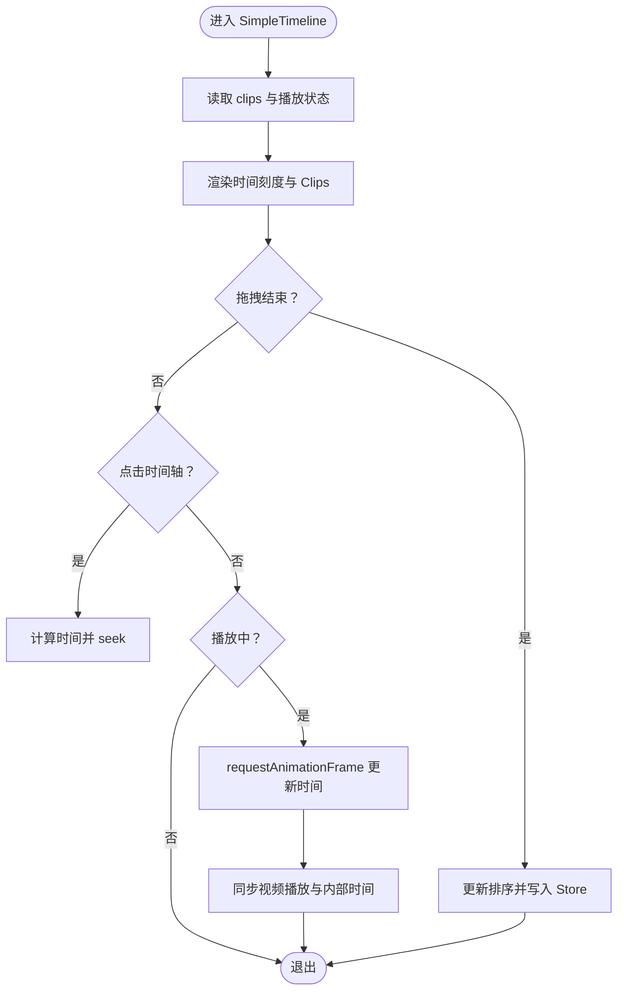
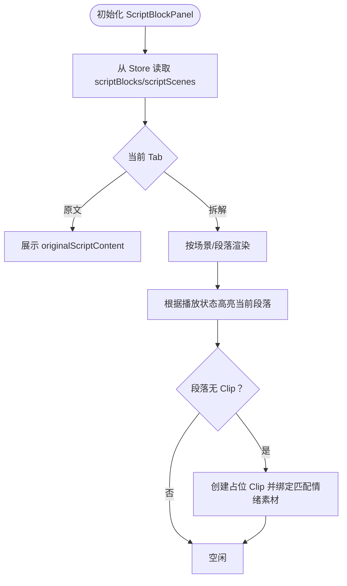
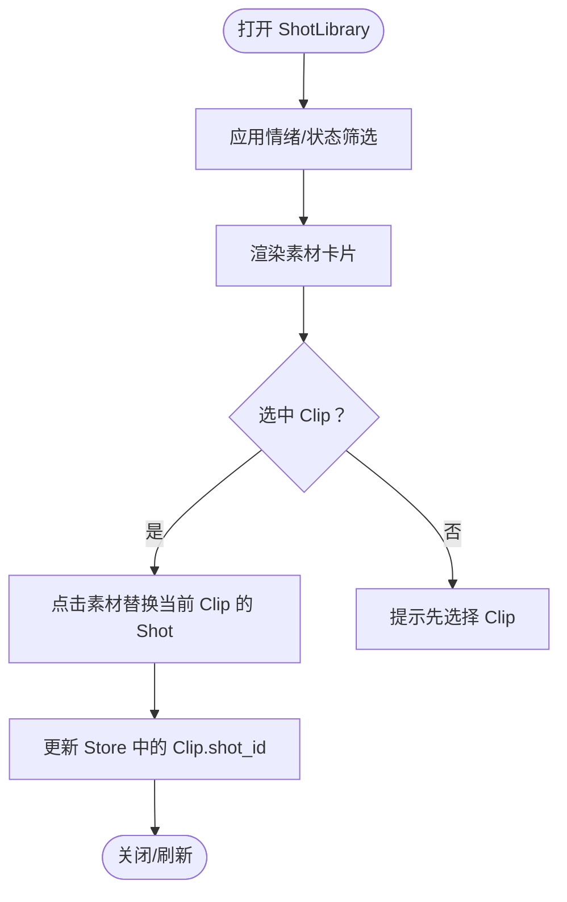
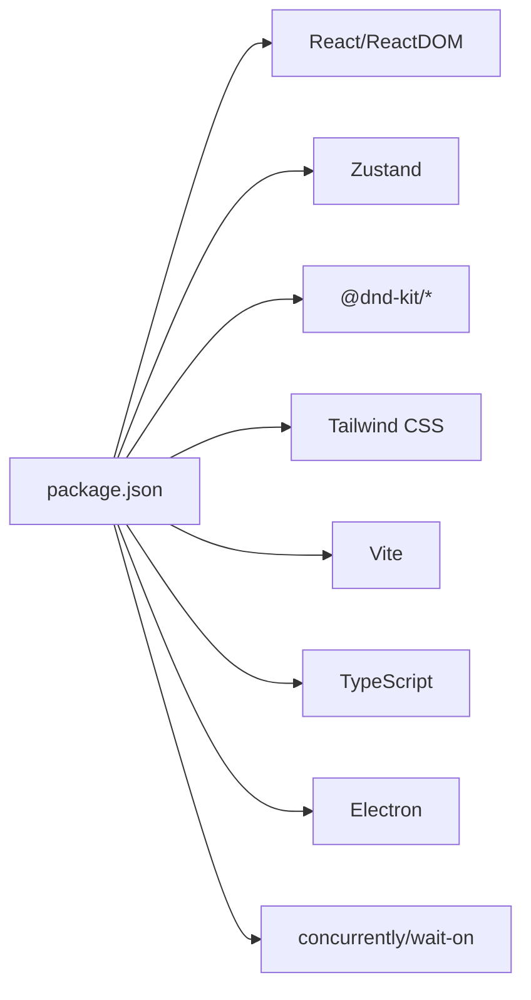

# 开发指南

<cite>
**本文引用的文件**
- [package.json](file://package.json)
- [vite.config.ts](file://vite.config.ts)
- [tsconfig.json](file://tsconfig.json)
- [tsconfig.node.json](file://tsconfig.node.json)
- [tailwind.config.js](file://tailwind.config.js)
- [postcss.config.js](file://postcss.config.js)
- [README.md](file://README.md)
- [index.html](file://index.html)
- [src/main.tsx](file://src/main.tsx)
- [src/App.tsx](file://src/App.tsx)
- [src/store/appStore.ts](file://src/store/appStore.ts)
- [src/types/DataModel.ts](file://src/types/DataModel.ts)
- [src/utils/fileIO.ts](file://src/utils/fileIO.ts)
- [src/services/llmService.ts](file://src/services/llmService.ts)
- [src/services/clipService.ts](file://src/services/clipService.ts)
- [src/components/ScriptBlockPanel.tsx](file://src/components/ScriptBlockPanel.tsx)
- [src/components/SimpleTimeline.tsx](file://src/components/SimpleTimeline.tsx)
- [src/components/ShotLibrary.tsx](file://src/components/ShotLibrary.tsx)
</cite>

## 目录
1. [简介](#简介)
2. [项目结构](#项目结构)
3. [核心组件](#核心组件)
4. [架构总览](#架构总览)
5. [详细组件分析](#详细组件分析)
6. [依赖分析](#依赖分析)
7. [性能考量](#性能考量)
8. [故障排查指南](#故障排查指南)
9. [结论](#结论)
10. [附录](#附录)

## 简介
本指南面向 CGCUT 项目的开发者，提供从环境搭建、构建配置、开发工作流、Electron 集成与调试、测试策略到部署流程的完整说明。CGCUT 是一款导演分镜验证 MVP 工具，采用 React 18 + TypeScript + Vite + Tailwind CSS 技术栈，并通过 Zustand 管理全局状态；同时集成了 LLM 与 CLIP 服务能力，支持剧本导入、分镜拆解、时间轴编辑与素材匹配。

## 项目结构
项目采用按功能模块划分的目录组织方式，核心源码位于 src 下，包含组件、服务、状态与类型定义，公共资源与数据位于 public 目录。入口文件通过 index.html 挂载到 DOM，Vite 提供开发服务器与打包能力。

图表来源
- [index.html](file://index.html#L1-L13)
- [src/main.tsx](file://src/main.tsx#L1-L11)
- [src/App.tsx](file://src/App.tsx#L1-L497)
- [src/components/ScriptBlockPanel.tsx](file://src/components/ScriptBlockPanel.tsx#L1-L285)
- [src/components/SimpleTimeline.tsx](file://src/components/SimpleTimeline.tsx#L1-L414)
- [src/components/ShotLibrary.tsx](file://src/components/ShotLibrary.tsx#L1-L359)
- [src/store/appStore.ts](file://src/store/appStore.ts#L1-L195)
- [src/services/llmService.ts](file://src/services/llmService.ts#L1-L476)
- [src/services/clipService.ts](file://src/services/clipService.ts#L1-L394)
- [src/utils/fileIO.ts](file://src/utils/fileIO.ts#L1-L95)
- [src/types/DataModel.ts](file://src/types/DataModel.ts#L1-L291)

章节来源
- [README.md](file://README.md#L1-L181)
- [index.html](file://index.html#L1-L13)
- [src/main.tsx](file://src/main.tsx#L1-L11)

## 核心组件
- 应用入口与挂载：index.html 与 main.tsx 负责初始化 React 根节点与样式入口。
- 主应用 App：负责项目数据加载、LLM/CLIP 流程调度、UI 控制与模态框展示。
- 状态管理：Zustand Store 统一管理脚本文案、场景、镜头、素材、播放状态与选择状态。
- 数据模型：定义 ScriptBlock、ScriptScene、Shot、Clip、PlaybackState 等核心类型及计算函数。
- 工具与服务：fileIO 负责公共数据读写；llmService 负责剧本分析；clipService 负责素材扫描与元数据提取。
- 组件层：ScriptBlockPanel 展示与高亮段落、时长对比与占位创建；SimpleTimeline 支持拖拽排序、裁剪占位与播放预览；ShotLibrary 提供素材筛选、替换与管理。

章节来源
- [src/App.tsx](file://src/App.tsx#L1-L497)
- [src/store/appStore.ts](file://src/store/appStore.ts#L1-L195)
- [src/types/DataModel.ts](file://src/types/DataModel.ts#L1-L291)
- [src/utils/fileIO.ts](file://src/utils/fileIO.ts#L1-L95)
- [src/services/llmService.ts](file://src/services/llmService.ts#L1-L476)
- [src/services/clipService.ts](file://src/services/clipService.ts#L1-L394)
- [src/components/ScriptBlockPanel.tsx](file://src/components/ScriptBlockPanel.tsx#L1-L285)
- [src/components/SimpleTimeline.tsx](file://src/components/SimpleTimeline.tsx#L1-L414)
- [src/components/ShotLibrary.tsx](file://src/components/ShotLibrary.tsx#L1-L359)

## 架构总览
CGCUT 采用前端单页应用架构，结合 Vite 开发服务器与构建管线，样式由 Tailwind CSS 与 PostCSS 驱动。数据层通过公共 JSON 文件与 localStorage 模拟持久化；业务流程通过服务层与状态层协同完成。

图表来源
- [vite.config.ts](file://vite.config.ts#L1-L12)
- [tsconfig.json](file://tsconfig.json#L1-L26)
- [tailwind.config.js](file://tailwind.config.js#L1-L12)
- [postcss.config.js](file://postcss.config.js#L1-L7)
- [src/App.tsx](file://src/App.tsx#L1-L497)
- [src/utils/fileIO.ts](file://src/utils/fileIO.ts#L1-L95)
- [src/services/llmService.ts](file://src/services/llmService.ts#L1-L476)
- [src/services/clipService.ts](file://src/services/clipService.ts#L1-L394)

## 详细组件分析

### LLM 剧本分析服务（llmService）
- 职责：接收剧本文本，调用外部 LLM API 进行分镜拆解，返回场景与段落结构，并补充元数据（时长、分析耗时等）。若 API 失败，回退至本地模拟分析。
- 关键流程：构造 Prompt → 调用 NVIDIA API → 解析 JSON → 校验格式 → 转换为内部数据结构 → 返回结果。
- 错误处理：超时控制、异常捕获、降级策略与错误提示。

图表来源
- [src/App.tsx](file://src/App.tsx#L70-L169)
- [src/services/llmService.ts](file://src/services/llmService.ts#L72-L319)

章节来源
- [src/services/llmService.ts](file://src/services/llmService.ts#L1-L476)
- [src/App.tsx](file://src/App.tsx#L70-L169)

### CLIP 素材处理服务（clipService）
- 职责：扫描指定目录中的视频文件，模拟批量处理与元数据提取，生成标签、情绪、描述与关键帧信息；支持跳过已处理文件与增量扫描。
- 关键流程：生成模拟文件列表 → 批量处理 → 统计汇总 → 返回处理结果。
- 与 App 集成：触发扫描 → 更新素材库配置 → 合并新素材到状态 → 展示进度与统计。

图表来源
- [src/App.tsx](file://src/App.tsx#L171-L252)
- [src/services/clipService.ts](file://src/services/clipService.ts#L36-L165)

章节来源
- [src/services/clipService.ts](file://src/services/clipService.ts#L1-L394)
- [src/App.tsx](file://src/App.tsx#L171-L252)

### 时间轴组件（SimpleTimeline）
- 职责：单轨时间轴编辑，支持拖拽排序、点击跳转、播放预览与占位符展示；渲染时间刻度标尺与播放指示器。
- 交互要点：拖拽事件处理、裁剪手柄预留、点击时间轴定位、播放循环与视频同步。

图表来源
- [src/components/SimpleTimeline.tsx](file://src/components/SimpleTimeline.tsx#L1-L414)
- [src/store/appStore.ts](file://src/store/appStore.ts#L1-L195)

章节来源
- [src/components/SimpleTimeline.tsx](file://src/components/SimpleTimeline.tsx#L1-L414)
- [src/store/appStore.ts](file://src/store/appStore.ts#L1-L195)

### 剧本段落面板（ScriptBlockPanel）
- 职责：展示原始剧本与 LLM 拆解结果，支持场景折叠/展开、段落高亮、时长对比与“占位”创建；与播放状态联动。
- 交互要点：Tab 在原文与拆解之间切换；根据播放时间高亮当前段落；为无镜头的段落一键创建占位 Clip。

图表来源
- [src/components/ScriptBlockPanel.tsx](file://src/components/ScriptBlockPanel.tsx#L1-L285)
- [src/store/appStore.ts](file://src/store/appStore.ts#L1-L195)

章节来源
- [src/components/ScriptBlockPanel.tsx](file://src/components/ScriptBlockPanel.tsx#L1-L285)
- [src/store/appStore.ts](file://src/store/appStore.ts#L1-L195)

### 素材库（ShotLibrary）
- 职责：展示素材列表、按情绪/状态筛选、替换时间轴选中 Clip 的素材、编辑标签/情绪、删除素材；支持设置素材库根路径与扫描统计。
- 交互要点：点击素材替换当前选中 Clip；右上角“素材管理”弹窗；路径配置模态框。

图表来源
- [src/components/ShotLibrary.tsx](file://src/components/ShotLibrary.tsx#L1-L359)
- [src/store/appStore.ts](file://src/store/appStore.ts#L1-L195)

章节来源
- [src/components/ShotLibrary.tsx](file://src/components/ShotLibrary.tsx#L1-L359)
- [src/store/appStore.ts](file://src/store/appStore.ts#L1-L195)

## 依赖分析
- 包管理与脚本：使用 npm 管理依赖与脚本，提供 dev/build/preview/electron/electron:dev 等命令。
- 构建与编译：Vite 提供开发服务器与打包；TypeScript 配置启用严格模式与 bundler 模式；Tailwind CSS 与 PostCSS/Autoprefixer 驱动样式。
- 运行时依赖：React、ReactDOM、Zustand、@dnd-kit（拖拽）、Tailwind CSS。
- 开发依赖：@vitejs/plugin-react、typescript、vite、tailwindcss、postcss、autoprefixer、electron、concurrently、wait-on。

图表来源
- [package.json](file://package.json#L1-L36)

章节来源
- [package.json](file://package.json#L1-L36)

## 性能考量
- 构建与运行时
  - 使用 Vite 的快速冷启动与热更新，开发体验更佳。
  - Tailwind 通过 content 白名单扫描，避免不必要的样式体积。
  - TypeScript 严格模式有助于早期发现潜在性能与类型问题。
- 组件与状态
  - Zustand 以最小状态切片更新，减少重渲染。
  - SimpleTimeline 采用像素/秒的比例缩放，合理控制渲染开销。
- 数据与 I/O
  - fileIO 使用 Promise.all 并行加载初始数据，缩短首屏等待。
  - CLIP 扫描采用批处理与进度统计，避免阻塞主线程。
- 建议
  - 对长列表进行虚拟化（如后续扩展）。
  - 对 LLM/CLIP 接口增加缓存与去抖策略。
  - 对视频预览使用懒加载与资源释放。

[本节为通用指导，无需列出章节来源]

## 故障排查指南
- LLM 分析失败
  - 现象：调用外部 API 失败或超时，UI 展示错误提示。
  - 排查：检查网络连通性、API Key 与超时设置；查看服务端返回状态；确认回退到模拟分析。
  - 参考路径：[llmService 分析流程](file://src/services/llmService.ts#L72-L319)
- CLIP 扫描异常
  - 现象：扫描进度卡住或失败，返回 summary。
  - 排查：确认素材库路径可访问；检查 skipProcessed 与文件格式；查看失败计数。
  - 参考路径：[clipService 扫描流程](file://src/services/clipService.ts#L36-L165)
- 时间轴播放异常
  - 现象：播放不流畅或视频不同步。
  - 排查：确认当前 Clip 的 Shot 是否有有效 file_path；检查 seek/play/pause 逻辑；避免频繁重排导致的帧丢失。
  - 参考路径：[SimpleTimeline 播放循环](file://src/components/SimpleTimeline.tsx#L64-L109)
- 数据加载失败
  - 现象：页面空白或报错。
  - 排查：确认 public/data 下的 JSON 文件存在且格式正确；检查 fileIO 的 fetch 与 localStorage 回退逻辑。
  - 参考路径：[fileIO 加载流程](file://src/utils/fileIO.ts#L51-L81)
- 开发与 Electron 调试
  - 使用 npm run electron:dev 同时启动前端与 Electron；确保 wait-on 等待本地开发服务器就绪后再启动 Electron。
  - 参考路径：[package.json 脚本](file://package.json#L7-L13)

章节来源
- [src/services/llmService.ts](file://src/services/llmService.ts#L72-L319)
- [src/services/clipService.ts](file://src/services/clipService.ts#L36-L165)
- [src/components/SimpleTimeline.tsx](file://src/components/SimpleTimeline.tsx#L64-L109)
- [src/utils/fileIO.ts](file://src/utils/fileIO.ts#L51-L81)
- [package.json](file://package.json#L7-L13)

## 结论
CGCUT 以清晰的模块划分与简洁的技术栈实现了导演分镜验证的核心能力。通过合理的状态管理、服务抽象与组件职责分离，项目具备良好的可维护性与扩展性。建议在后续迭代中完善测试体系、增强错误监控与日志记录，并逐步替换模拟服务为真实后端接口。

[本节为总结性内容，无需列出章节来源]

## 附录

### 开发环境搭建与工具配置
- Node.js 版本要求
  - 仓库未显式声明 Node.js 版本，建议使用 LTS 版本以保证兼容性。
- 依赖安装
  - 使用 npm 安装依赖：npm install
- 开发服务器
  - 启动开发服务器：npm run dev
  - 访问地址：http://localhost:5173
- 构建与预览
  - 构建生产包：npm run build
  - 本地预览：npm run preview

章节来源
- [README.md](file://README.md#L12-L30)
- [package.json](file://package.json#L7-L13)

### 构建配置详解
- Vite 配置
  - 插件：@vitejs/plugin-react
  - 服务器端口：5173
  - 基础路径：./
  - 参考路径：[vite.config.ts](file://vite.config.ts#L1-L12)
- TypeScript 配置
  - 目标与模块：ES2020/ESNext
  - 严格模式：开启
  - 模块解析：bundler
  - JSX：react-jsx
  - 参考路径：[tsconfig.json](file://tsconfig.json#L1-L26)，[tsconfig.node.json](file://tsconfig.node.json#L1-L11)
- Tailwind CSS 配置
  - content 覆盖：index.html 与 src 下 TS/JS/TSX 文件
  - 主题扩展：空
  - 参考路径：[tailwind.config.js](file://tailwind.config.js#L1-L12)
- PostCSS 配置
  - 插件：tailwindcss、autoprefixer
  - 参考路径：[postcss.config.js](file://postcss.config.js#L1-L7)

章节来源
- [vite.config.ts](file://vite.config.ts#L1-L12)
- [tsconfig.json](file://tsconfig.json#L1-L26)
- [tsconfig.node.json](file://tsconfig.node.json#L1-L11)
- [tailwind.config.js](file://tailwind.config.js#L1-L12)
- [postcss.config.js](file://postcss.config.js#L1-L7)

### 开发工作流程最佳实践
- 代码组织
  - 按功能模块划分：components、services、store、types、utils
  - 组件以功能命名（如 ScriptBlockPanel、SimpleTimeline、ShotLibrary）
  - 类型集中定义于 types/DataModel.ts
- 命名规范
  - 组件使用 PascalCase；文件使用驼峰或功能命名
  - 状态字段语义明确（如 playbackState、mediaLibrary）
- 调试技巧
  - 使用浏览器开发者工具断点与日志
  - 在 App.tsx 中对关键流程（LLM/CLIP）打印状态
  - 对长列表与高频更新的组件进行性能观察

[本节为通用指导，无需列出章节来源]

### Electron 集成与调试
- 启动方式
  - 开发模式：npm run electron:dev 同时启动前端与 Electron
  - 独立 Electron：npm run electron
- 注意事项
  - 确保开发服务器端口与 Electron 配置一致
  - 使用 concurrently 与 wait-on 确保前端就绪再启动 Electron
- 参考路径：[package.json 脚本](file://package.json#L7-L13)

章节来源
- [package.json](file://package.json#L7-L13)

### 测试策略
- 单元测试
  - 对纯函数（如 calculateScriptBlockDuration、updateClipTrim）编写测试用例
  - 对服务层（llmService、clipService）模拟外部依赖进行行为测试
- 集成测试
  - 模拟 App.tsx 中的导入/扫描/导出流程，验证状态变更与 UI 更新
- 端到端测试
  - 使用自动化工具（如 Playwright/Cypress）覆盖关键用户路径（导入剧本 → 拆解 → 时间轴编辑 → 素材替换 → 导出）

[本节为通用指导，无需列出章节来源]

### 部署流程
- 构建产物
  - 使用 npm run build 生成静态资源
- 部署建议
  - 将 public/data 下的数据与构建产物一起部署
  - 如需 Electron 打包，可在 CI 中生成桌面应用安装包
- 参考路径：[README.md 构建说明](file://README.md#L23-L30)，[package.json](file://package.json#L7-L13)

章节来源
- [README.md](file://README.md#L23-L30)
- [package.json](file://package.json#L7-L13)