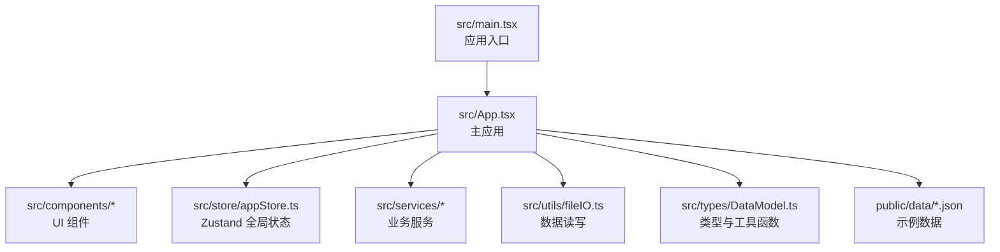
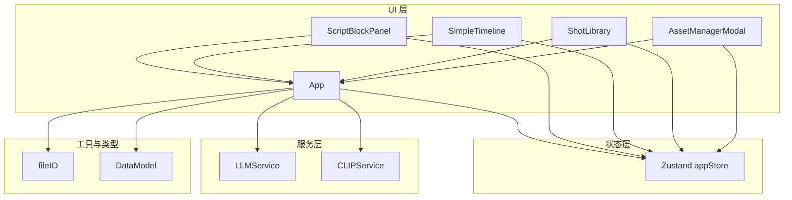
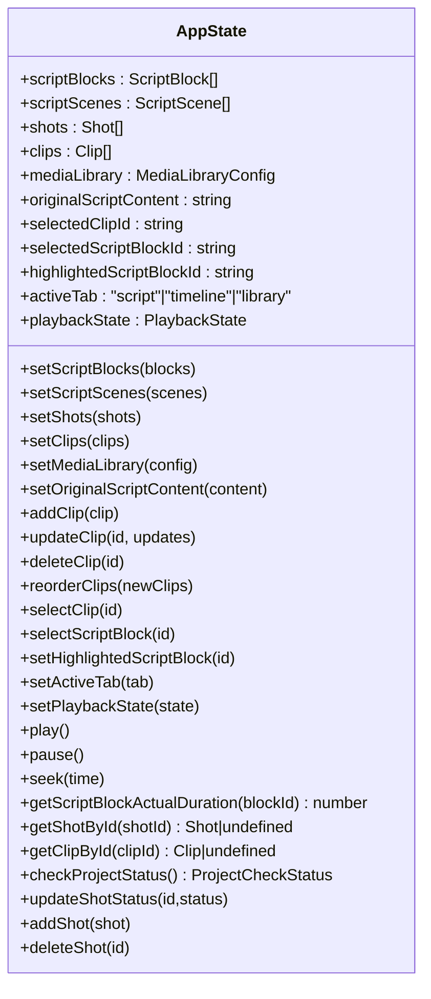
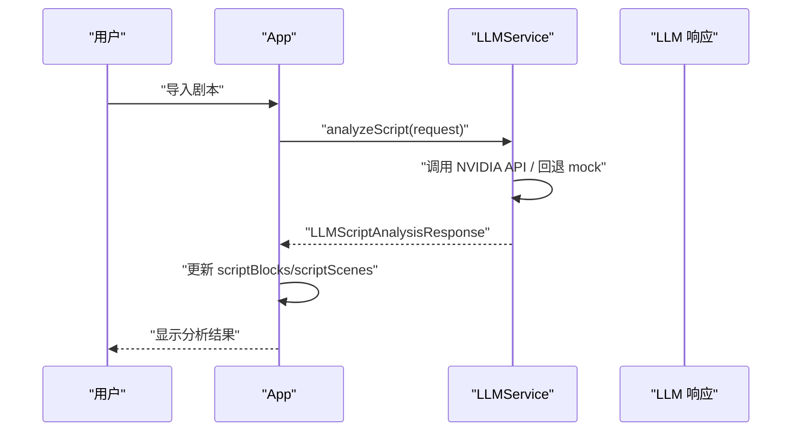
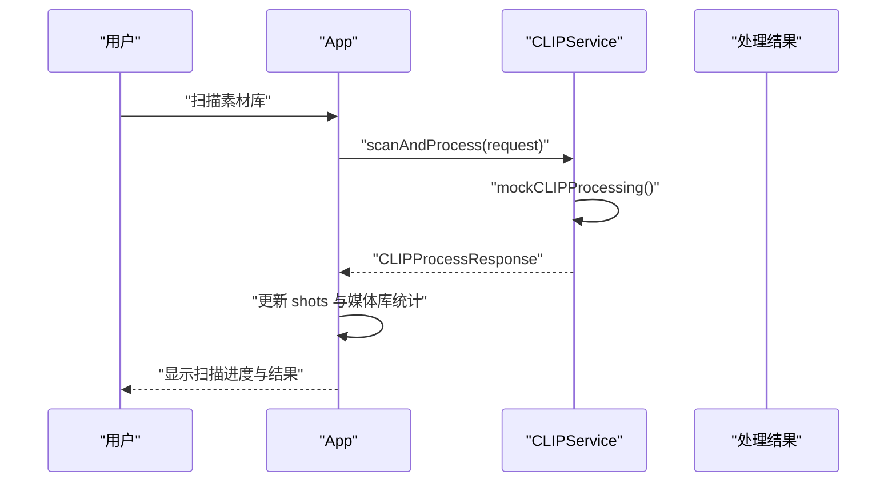
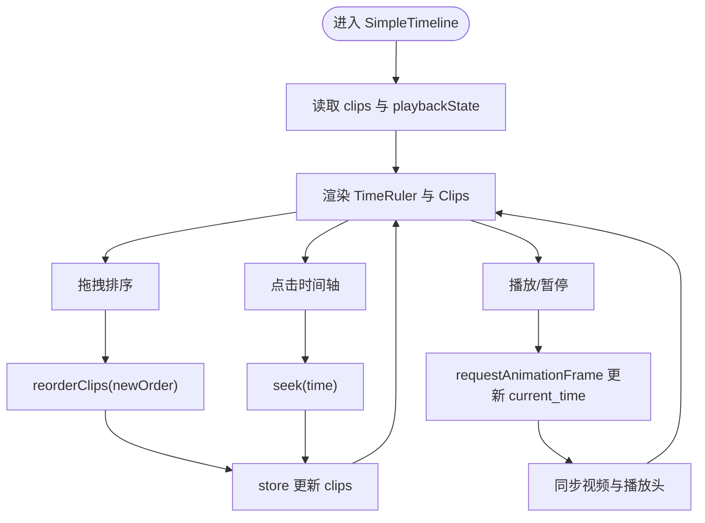
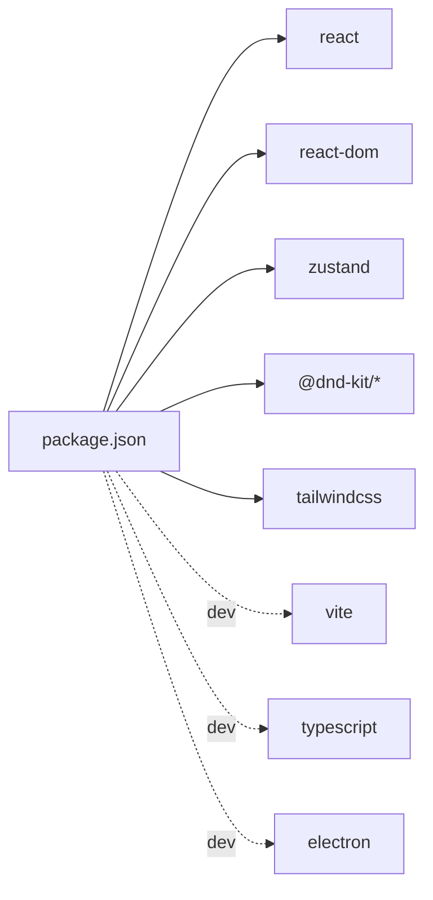

# 开发流程

<cite>
**本文档引用的文件**
- [README.md](file://README.md)
- [package.json](file://package.json)
- [tsconfig.json](file://tsconfig.json)
- [vite.config.ts](file://vite.config.ts)
- [src/main.tsx](file://src/main.tsx)
- [src/App.tsx](file://src/App.tsx)
- [src/store/appStore.ts](file://src/store/appStore.ts)
- [src/types/DataModel.ts](file://src/types/DataModel.ts)
- [src/utils/fileIO.ts](file://src/utils/fileIO.ts)
- [src/services/llmService.ts](file://src/services/llmService.ts)
- [src/services/clipService.ts](file://src/services/clipService.ts)
- [src/components/ScriptBlockPanel.tsx](file://src/components/ScriptBlockPanel.tsx)
- [src/components/SimpleTimeline.tsx](file://src/components/SimpleTimeline.tsx)
- [src/components/ShotLibrary.tsx](file://src/components/ShotLibrary.tsx)
- [src/components/AssetManagerModal.tsx](file://src/components/AssetManagerModal.tsx)
</cite>

## 目录
1. [简介](#简介)
2. [项目结构](#项目结构)
3. [核心组件](#核心组件)
4. [架构总览](#架构总览)
5. [详细组件分析](#详细组件分析)
6. [依赖分析](#依赖分析)
7. [性能考量](#性能考量)
8. [故障排查指南](#故障排查指南)
9. [结论](#结论)
10. [附录](#附录)

## 简介
本指南面向 CGCUT 项目的开发者，系统阐述代码组织与文件命名规范、状态管理模式与使用方法、TypeScript 类型体系、组件开发最佳实践以及调试与开发工具使用方式。目标是帮助团队在保持一致性的同时，高效迭代与扩展功能。

## 项目结构
- 采用按“职责领域”划分的目录组织：components（组件）、services（服务）、store（状态）、types（类型）、utils（工具）、public/data（静态数据）。
- 入口文件位于 src/main.tsx，主应用组件为 src/App.tsx。
- 构建与运行由 Vite 配置，TypeScript 编译选项启用严格模式，确保类型安全。

图表来源
- [src/main.tsx](file://src/main.tsx#L1-L11)
- [src/App.tsx](file://src/App.tsx#L1-L60)
- [src/store/appStore.ts](file://src/store/appStore.ts#L1-L60)
- [src/types/DataModel.ts](file://src/types/DataModel.ts#L1-L60)
- [src/utils/fileIO.ts](file://src/utils/fileIO.ts#L1-L40)
- [src/services/llmService.ts](file://src/services/llmService.ts#L1-L40)
- [src/services/clipService.ts](file://src/services/clipService.ts#L1-L40)

章节来源
- [README.md](file://README.md#L120-L150)
- [vite.config.ts](file://vite.config.ts#L1-L12)
- [tsconfig.json](file://tsconfig.json#L1-L26)

## 核心组件
- 组件层：ScriptBlockPanel（剧本段落面板）、SimpleTimeline（简化时间轴）、ShotLibrary（素材库）、AssetManagerModal（素材管理弹窗）。
- 服务层：llmService（剧本智能拆解）、clipService（视频内容分析与元数据提取）。
- 状态层：Zustand appStore（集中管理数据、UI、播放与项目状态）。
- 工具层：fileIO（JSON 加载/保存与导出）、DataModel（类型定义与计算函数）。

章节来源
- [src/components/ScriptBlockPanel.tsx](file://src/components/ScriptBlockPanel.tsx#L1-L60)
- [src/components/SimpleTimeline.tsx](file://src/components/SimpleTimeline.tsx#L1-L60)
- [src/components/ShotLibrary.tsx](file://src/components/ShotLibrary.tsx#L1-L60)
- [src/components/AssetManagerModal.tsx](file://src/components/AssetManagerModal.tsx#L1-L40)
- [src/services/llmService.ts](file://src/services/llmService.ts#L1-L60)
- [src/services/clipService.ts](file://src/services/clipService.ts#L1-L60)
- [src/store/appStore.ts](file://src/store/appStore.ts#L1-L60)
- [src/utils/fileIO.ts](file://src/utils/fileIO.ts#L1-L40)
- [src/types/DataModel.ts](file://src/types/DataModel.ts#L1-L60)

## 架构总览
应用采用“组件-服务-状态-类型-工具”的分层架构，组件通过 Zustand store 访问全局状态；服务负责外部集成（LLM/CLIP），工具负责数据持久化与计算；类型定义贯穿全栈，保证接口契约一致。

图表来源
- [src/App.tsx](file://src/App.tsx#L1-L120)
- [src/store/appStore.ts](file://src/store/appStore.ts#L1-L120)
- [src/services/llmService.ts](file://src/services/llmService.ts#L1-L120)
- [src/services/clipService.ts](file://src/services/clipService.ts#L1-L120)
- [src/utils/fileIO.ts](file://src/utils/fileIO.ts#L1-L60)
- [src/types/DataModel.ts](file://src/types/DataModel.ts#L1-L120)
- [src/components/ScriptBlockPanel.tsx](file://src/components/ScriptBlockPanel.tsx#L1-L60)
- [src/components/SimpleTimeline.tsx](file://src/components/SimpleTimeline.tsx#L1-L60)
- [src/components/ShotLibrary.tsx](file://src/components/ShotLibrary.tsx#L1-L60)
- [src/components/AssetManagerModal.tsx](file://src/components/AssetManagerModal.tsx#L1-L60)

## 详细组件分析

### 状态管理（Zustand）设计与使用
- 设计模式
  - 单一 store：集中存放数据状态（scriptBlocks/scriptScenes/shots/clips/mediaLibrary/originalScriptContent）、UI 状态（selectedClipId/activeTab/highlightedScriptBlockId）、播放状态（playbackState）。
  - 动作函数：提供 setter 与业务动作（addClip/updateClip/deleteClip/reorderClips/selectClip/selectScriptBlock/setHighlightedScriptBlock/setActiveTab/setPlaybackState/play/pause/seek）。
  - 计算函数：getScriptBlockActualDuration/getShotById/getClipById/checkProjectStatus 等，避免在组件中重复计算。
- 使用方法
  - 在组件中通过 useAppStore(state => state.xxx) 选择性订阅所需字段。
  - 通过 actions 更新状态，例如 setScriptBlocks、setClips、updateClip、reorderClips 等。
  - 通过计算函数进行派生数据展示，如时长差异、项目检查状态。
- 维护建议
  - 保持 action 职责单一，避免在 action 中做过多副作用。
  - 对复杂计算放入 store 的计算函数，减少组件重复逻辑。
  - 对外暴露稳定的 getter/setter，避免直接修改深层嵌套对象。

图表来源
- [src/store/appStore.ts](file://src/store/appStore.ts#L1-L195)

章节来源
- [src/store/appStore.ts](file://src/store/appStore.ts#L1-L195)

### 组件开发最佳实践
- Props 设计
  - 统一使用接口定义 props，如 ScriptBlockPanelProps、TimelineProps、ShotLibraryProps、AssetManagerModalProps，明确可选/必填属性。
  - 通过 className 透传容器样式，便于主题与布局统一。
- 事件处理
  - 使用受控组件与 store 动作配合，避免直接操作 DOM。
  - 拖拽排序使用 @dnd-kit，确保拖拽结束后通过 reorderClips 更新 store。
- 生命周期管理
  - 使用 useEffect 做副作用（如监听播放状态、滚动高亮段落），并在卸载时清理动画帧或定时器。
  - 通过 useRef 存储 DOM 引用，避免不必要的重渲染。
- 交互与可访问性
  - 为按钮与可点击元素提供禁用态与键盘可达性。
  - 对长文本使用省略与 title 提示，提升信息密度。

章节来源
- [src/components/ScriptBlockPanel.tsx](file://src/components/ScriptBlockPanel.tsx#L1-L120)
- [src/components/SimpleTimeline.tsx](file://src/components/SimpleTimeline.tsx#L1-L120)
- [src/components/ShotLibrary.tsx](file://src/components/ShotLibrary.tsx#L1-L120)
- [src/components/AssetManagerModal.tsx](file://src/components/AssetManagerModal.tsx#L1-L120)

### API/服务组件调用流程（LLM 与 CLIP）
- LLM 分析剧本
  - App 组件触发 handleImportScript -> llmService.analyzeScript -> 解析响应并更新 store。
  - 若外部 API 失败，回退到 mock 分析，保证 MVP 可用。
- CLIP 处理素材库
  - App 组件触发 handleScanMediaLibrary -> clipService.scanAndProcess -> 更新 shots 与媒体库统计。

图表来源
- [src/App.tsx](file://src/App.tsx#L70-L170)
- [src/services/llmService.ts](file://src/services/llmService.ts#L70-L120)

图表来源
- [src/App.tsx](file://src/App.tsx#L171-L252)
- [src/services/clipService.ts](file://src/services/clipService.ts#L36-L120)

### 复杂逻辑组件（时间轴与播放）
- 时间轴编辑
  - 使用 @dnd-kit 实现水平拖拽排序，点击时间轴任意位置可跳转到该时间。
  - 每个 Clip 渲染时根据时长换算像素宽度，支持左右边缘拖拽裁剪（预留）。
- 播放预览
  - 基于 requestAnimationFrame 实现播放循环，同步视频播放与播放头位置。
  - 根据当前时间定位到对应 Clip 与内部时间，支持跳转与暂停。
- 时间刻度
  - 生成秒级与半秒级刻度，偶数秒显示分钟:秒格式标签。

图表来源
- [src/components/SimpleTimeline.tsx](file://src/components/SimpleTimeline.tsx#L1-L200)
- [src/store/appStore.ts](file://src/store/appStore.ts#L115-L160)

章节来源
- [src/components/SimpleTimeline.tsx](file://src/components/SimpleTimeline.tsx#L1-L200)
- [src/store/appStore.ts](file://src/store/appStore.ts#L115-L160)

### 数据流与类型系统
- 类型定义
  - ScriptBlock/ScriptScene/Shot/Clip/PlaybackState/MediaLibraryConfig/ProjectCheckStatus 等核心数据模型。
  - 状态枚举：ShotStatus、LLMProcessStatus、CLIPProcessStatus。
  - 工具函数：calculateScriptBlockDuration/calculateTotalDuration/findClipAtTime/createClip/updateClipTrim/replaceClipShot。
- 数据流
  - 组件通过 store 读取数据，调用 actions 更新状态；服务层返回标准化响应，再由 App 统一合并到 store。
  - fileIO 负责 public/data 下的 JSON 加载与 localStorage 保存，支持导出项目数据。

章节来源
- [src/types/DataModel.ts](file://src/types/DataModel.ts#L1-L291)
- [src/utils/fileIO.ts](file://src/utils/fileIO.ts#L1-L95)
- [src/store/appStore.ts](file://src/store/appStore.ts#L1-L195)

## 依赖分析
- 运行时依赖
  - react/react-dom：框架基础。
  - zustand：轻量全局状态管理。
  - @dnd-kit：拖拽排序能力。
  - tailwindcss：样式工具。
- 开发依赖
  - vite、@vitejs/plugin-react、typescript、electron、concurrently、wait-on 等。
- 项目脚本
  - dev/build/preview/electron/electron:dev 等命令，便于本地开发与打包预览。

图表来源
- [package.json](file://package.json#L1-L36)

章节来源
- [package.json](file://package.json#L1-L36)

## 性能考量
- 状态粒度
  - 将大数组（clips/shots）拆分为独立字段，避免因单一状态变更导致大面积重渲染。
- 渲染优化
  - 使用 React.memo 与 useMemo/useCallback（在需要时引入）减少子组件重渲染。
  - 时间轴按需渲染可见区域，避免一次性渲染大量 Clip。
- 计算优化
  - 将昂贵计算放入 store 计算函数，利用 get() 读取最新状态，避免在渲染中重复计算。
- I/O 优化
  - fileIO 使用 Promise.all 并行加载数据，减少首屏等待。
- 播放性能
  - requestAnimationFrame 控制播放循环，避免高频 setState；视频同步仅在必要时更新 currentTime。

[本节为通用指导，无需列出具体文件来源]

## 故障排查指南
- LLM 分析失败
  - 现象：导入剧本后出现错误提示。
  - 排查：检查 API 端点与密钥配置；查看服务层回退逻辑是否生效。
- CLIP 扫描异常
  - 现象：扫描进度卡住或报错。
  - 排查：确认 mock 数据生成是否正常；检查目录路径与文件模式。
- 播放异常
  - 现象：视频不播放或播放头不动。
  - 排查：确认当前 Clip 对应 Shot 的 file_path 是否有效；检查 is_playing 与 current_time 更新链路。
- 状态不一致
  - 现象：UI 与 store 数据不一致。
  - 排查：检查 actions 是否正确调用；确认计算函数 getScriptBlockActualDuration 的依赖是否完整。

章节来源
- [src/services/llmService.ts](file://src/services/llmService.ts#L90-L120)
- [src/services/clipService.ts](file://src/services/clipService.ts#L100-L170)
- [src/components/SimpleTimeline.tsx](file://src/components/SimpleTimeline.tsx#L60-L120)
- [src/store/appStore.ts](file://src/store/appStore.ts#L130-L170)

## 结论
本指南总结了 CGCUT 的代码组织、状态管理、类型系统、组件开发与调试要点。遵循本文档的规范与最佳实践，可在保证类型安全与可维护性的前提下，持续扩展 LLM/CLIP 集成与 UI 能力，快速达成验收标准并支持后续迭代。

[本节为总结性内容，无需列出具体文件来源]

## 附录

### 文件命名与组织规范
- 组件：使用名词短语命名，如 ScriptBlockPanel.tsx、SimpleTimeline.tsx、ShotLibrary.tsx、AssetManagerModal.tsx。
- 服务：以 Service 结尾，如 llmService.ts、clipService.ts。
- 工具：以 IO/Util 等语义命名，如 fileIO.ts。
- 类型：以 DataModel.ts 命名聚合，或按领域拆分（当前为单一文件）。

章节来源
- [src/components/ScriptBlockPanel.tsx](file://src/components/ScriptBlockPanel.tsx#L1-L40)
- [src/components/SimpleTimeline.tsx](file://src/components/SimpleTimeline.tsx#L1-L40)
- [src/components/ShotLibrary.tsx](file://src/components/ShotLibrary.tsx#L1-L40)
- [src/components/AssetManagerModal.tsx](file://src/components/AssetManagerModal.tsx#L1-L40)
- [src/services/llmService.ts](file://src/services/llmService.ts#L1-L40)
- [src/services/clipService.ts](file://src/services/clipService.ts#L1-L40)
- [src/utils/fileIO.ts](file://src/utils/fileIO.ts#L1-L40)
- [src/types/DataModel.ts](file://src/types/DataModel.ts#L1-L40)

### TypeScript 类型使用要点
- 使用接口定义数据结构，如 ScriptBlock、ScriptScene、Shot、Clip、PlaybackState、MediaLibraryConfig。
- 使用联合类型表达状态枚举，如 ShotStatus、LLMProcessStatus、CLIPProcessStatus。
- 使用工具函数封装计算逻辑，避免在组件中散落重复代码。
- 通过泛型与 Partial 等类型工具增强动作函数的健壮性。

章节来源
- [src/types/DataModel.ts](file://src/types/DataModel.ts#L1-L291)

### 开发工具与调试技巧
- 启动与构建
  - npm run dev：启动 Vite 开发服务器。
  - npm run build：编译 TypeScript 并打包。
  - npm run preview：本地预览构建产物。
- Electron 集成
  - npm run electron：以 Electron 运行。
  - npm run electron:dev：同时启动前端与 Electron。
- 调试建议
  - 在组件中使用 useEffect 输出关键状态变化，便于定位问题。
  - 使用浏览器开发者工具的 Network 面板检查 LLM/CLIP 请求与响应。
  - 在 store 中对关键动作增加日志，追踪状态变更轨迹。

章节来源
- [README.md](file://README.md#L18-L30)
- [package.json](file://package.json#L1-L20)
- [vite.config.ts](file://vite.config.ts#L1-L12)