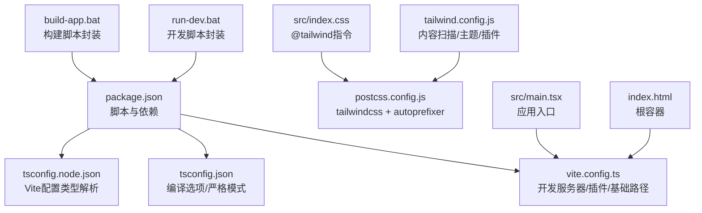
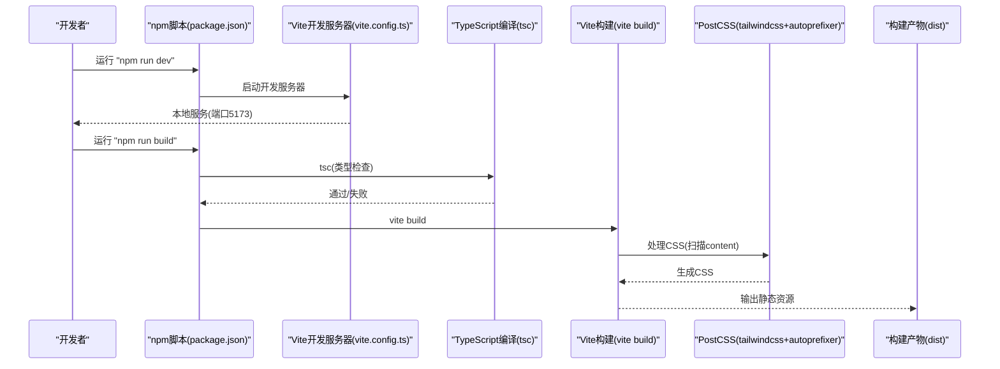
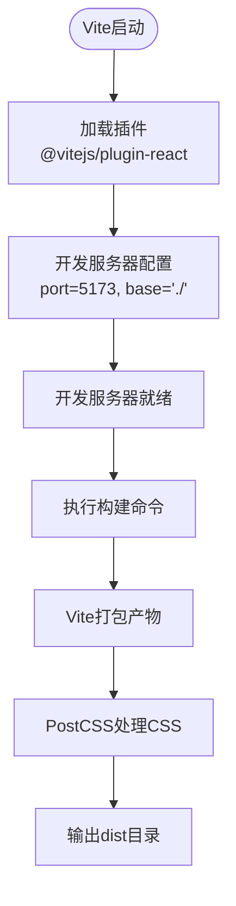
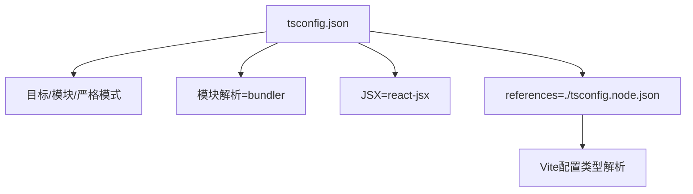
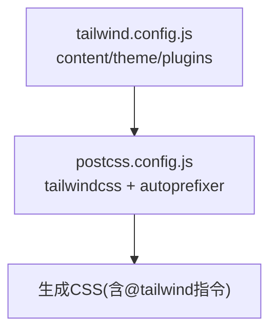
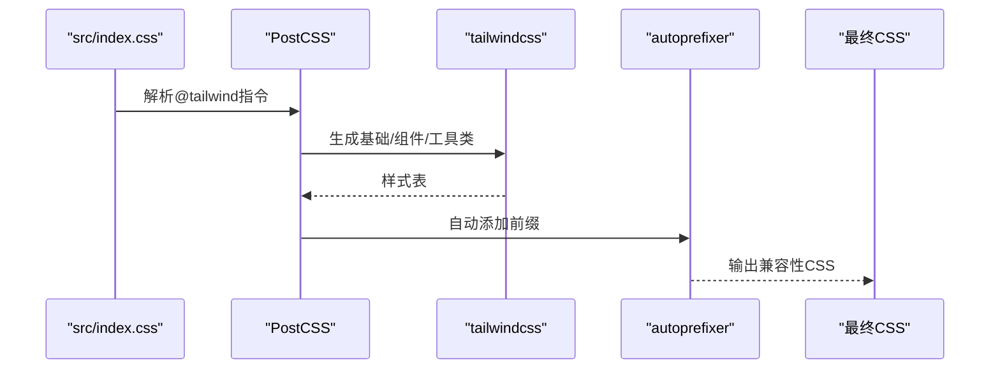
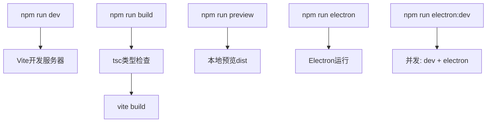
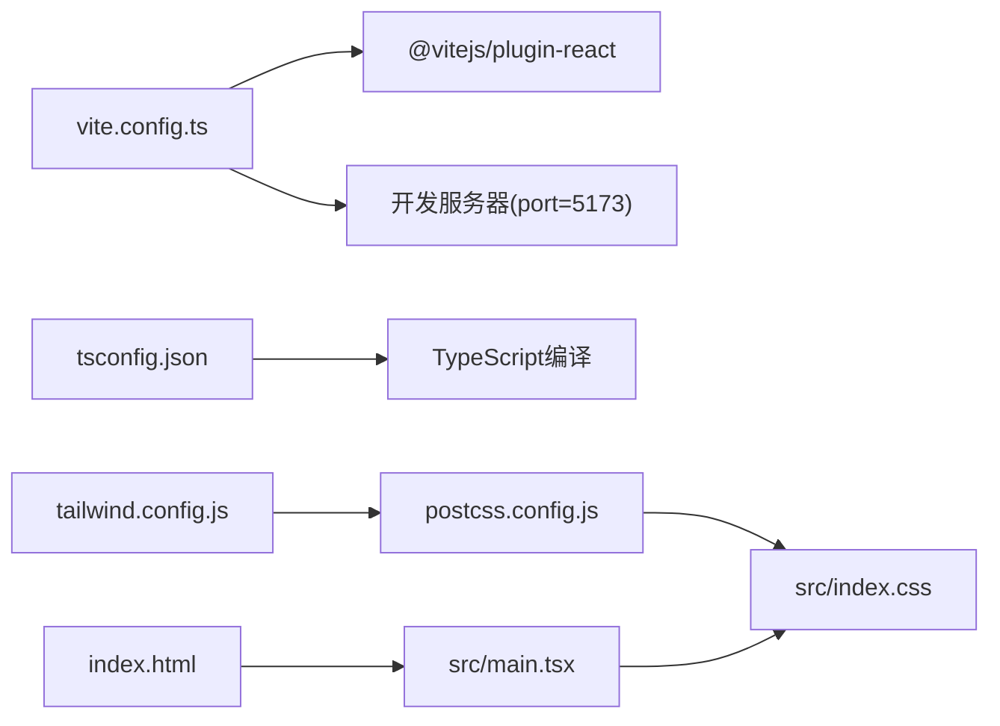

# 构建配置

<cite>
**本文档引用的文件**
- [vite.config.ts](file://vite.config.ts)
- [tsconfig.json](file://tsconfig.json)
- [tsconfig.node.json](file://tsconfig.node.json)
- [tailwind.config.js](file://tailwind.config.js)
- [postcss.config.js](file://postcss.config.js)
- [package.json](file://package.json)
- [src/index.css](file://src/index.css)
- [src/main.tsx](file://src/main.tsx)
- [index.html](file://index.html)
- [run-dev.bat](file://run-dev.bat)
- [build-app.bat](file://build-app.bat)
</cite>

## 目录
1. [简介](#简介)
2. [项目结构](#项目结构)
3. [核心组件](#核心组件)
4. [架构总览](#架构总览)
5. [详细组件分析](#详细组件分析)
6. [依赖关系分析](#依赖关系分析)
7. [性能考量](#性能考量)
8. [故障排查指南](#故障排查指南)
9. [结论](#结论)
10. [附录](#附录)

## 简介
本文件面向CGCUT项目的构建与开发配置，系统性说明以下方面：
- Vite配置：开发服务器、基础路径、插件与构建产物策略
- TypeScript编译配置：严格模式、模块解析、输出目标与打包器模式
- Tailwind CSS配置：内容扫描、主题扩展与插件体系
- PostCSS与CSS处理流程：自动前缀与Tailwind集成
- 构建命令与脚本：开发、构建、预览与Electron集成策略

本指南兼顾技术细节与可操作性，帮助开发者快速理解并高效维护构建链路。

## 项目结构
CGCUT采用前端现代化工程化方案，核心构建相关文件分布如下：
- 构建与打包：vite.config.ts、package.json
- 类型系统：tsconfig.json、tsconfig.node.json
- 样式系统：tailwind.config.js、postcss.config.js、src/index.css
- 应用入口：src/main.tsx、index.html
- 脚本与批处理：run-dev.bat、build-app.bat

图表来源
- [package.json](file://package.json#L7-L13)
- [vite.config.ts](file://vite.config.ts#L5-L11)
- [tsconfig.json](file://tsconfig.json#L2-L25)
- [tsconfig.node.json](file://tsconfig.node.json#L2-L9)
- [tailwind.config.js](file://tailwind.config.js#L3-L11)
- [postcss.config.js](file://postcss.config.js#L1-L6)
- [src/index.css](file://src/index.css#L1-L3)
- [src/main.tsx](file://src/main.tsx#L1-L11)
- [index.html](file://index.html#L8-L10)
- [run-dev.bat](file://run-dev.bat#L35-L41)
- [build-app.bat](file://build-app.bat#L35-L44)

章节来源
- [package.json](file://package.json#L1-L36)
- [vite.config.ts](file://vite.config.ts#L1-L12)
- [tsconfig.json](file://tsconfig.json#L1-L26)
- [tsconfig.node.json](file://tsconfig.node.json#L1-L11)
- [tailwind.config.js](file://tailwind.config.js#L1-L12)
- [postcss.config.js](file://postcss.config.js#L1-L7)
- [src/index.css](file://src/index.css#L1-L45)
- [src/main.tsx](file://src/main.tsx#L1-L11)
- [index.html](file://index.html#L1-L13)
- [run-dev.bat](file://run-dev.bat#L1-L41)
- [build-app.bat](file://build-app.bat#L1-L44)

## 核心组件
本节聚焦构建配置的关键组成及其职责：
- Vite开发服务器与插件：启用React插件、设置基础路径与端口
- TypeScript编译：严格模式、Bundler模块解析、JSX输出
- Tailwind CSS：内容扫描、主题扩展、插件注册
- PostCSS：Tailwind与Autoprefixer流水线
- 包脚本：dev/build/preview/electron/electron:dev

章节来源
- [vite.config.ts](file://vite.config.ts#L5-L11)
- [tsconfig.json](file://tsconfig.json#L2-L25)
- [tailwind.config.js](file://tailwind.config.js#L3-L11)
- [postcss.config.js](file://postcss.config.js#L1-L6)
- [package.json](file://package.json#L7-L13)

## 架构总览
下图展示从开发到构建的端到端流程，以及样式管线与类型检查的协同关系。

图表来源
- [package.json](file://package.json#L7-L13)
- [vite.config.ts](file://vite.config.ts#L5-L11)
- [tsconfig.json](file://tsconfig.json#L2-L25)
- [postcss.config.js](file://postcss.config.js#L1-L6)

## 详细组件分析

### Vite配置详解
- 插件体系
  - React插件：启用React JSX转换与HMR
- 开发服务器
  - 端口：固定端口5173；若被占用将自动选择其他端口
  - 基础路径：相对路径“./”，适配多级子目录部署
- 构建产物
  - 由Vite默认策略生成，结合PostCSS与Tailwind进行样式处理

图表来源
- [vite.config.ts](file://vite.config.ts#L5-L11)

章节来源
- [vite.config.ts](file://vite.config.ts#L5-L11)

### TypeScript编译配置
- 目标与模块
  - 目标：ES2020；模块：ESNext
  - 严格模式：开启严格检查、未使用变量/参数、switch穷举等
- 模块解析与打包器模式
  - 使用Bundler模式解析，支持TS扩展名导入、JSON模块解析
  - 与Vite的原生打包器配合，避免传统Node解析差异
- 无发射（No Emit）
  - 仅在构建阶段由Vite进行打包，TypeScript不直接生成JS
- JSX与引用
  - JSX：react-jsx；引用：tsconfig.node.json用于Vite配置类型

图表来源
- [tsconfig.json](file://tsconfig.json#L2-L25)
- [tsconfig.node.json](file://tsconfig.node.json#L2-L9)

章节来源
- [tsconfig.json](file://tsconfig.json#L1-L26)
- [tsconfig.node.json](file://tsconfig.node.json#L1-L11)

### Tailwind CSS配置
- 内容扫描
  - 扫描根HTML与src下所有TS/JS/TSX/JSX文件，确保按需生成样式
- 主题与插件
  - 主题：当前为空扩展；可在此加入颜色、字体、间距等自定义
  - 插件：当前为空；可扩展至动画、表格、深色模式等
- 与PostCSS集成
  - 通过postcss.config.js启用tailwindcss与autoprefixer

图表来源
- [tailwind.config.js](file://tailwind.config.js#L3-L11)
- [postcss.config.js](file://postcss.config.js#L1-L6)
- [src/index.css](file://src/index.css#L1-L3)

章节来源
- [tailwind.config.js](file://tailwind.config.js#L1-L12)
- [postcss.config.js](file://postcss.config.js#L1-L7)
- [src/index.css](file://src/index.css#L1-L45)

### PostCSS与CSS处理流程
- 插件顺序
  - tailwindcss：生成与裁剪样式
  - autoprefixer：自动添加浏览器前缀
- 与Tailwind协作
  - 在src/index.css中通过@tailwind指令引入基础、组件与工具类
- 浏览器兼容性
  - 通过autoprefixer提升兼容性，减少手动前缀维护成本

图表来源
- [src/index.css](file://src/index.css#L1-L3)
- [postcss.config.js](file://postcss.config.js#L1-L6)

章节来源
- [postcss.config.js](file://postcss.config.js#L1-L7)
- [src/index.css](file://src/index.css#L1-L45)

### 构建命令与脚本策略
- 开发命令
  - dev：启动Vite开发服务器
  - electron:dev：并发运行开发服务器与Electron，等待本地服务就绪后启动
- 构建命令
  - build：先执行tsc类型检查，再执行vite build
  - preview：本地预览构建产物
  - electron：直接以Electron打开当前目录
- 批处理脚本
  - run-dev.bat：自动检测Node/npm、安装依赖、启动开发
  - build-app.bat：自动检测Node/npm、安装依赖、执行构建

图表来源
- [package.json](file://package.json#L7-L13)
- [run-dev.bat](file://run-dev.bat#L35-L41)
- [build-app.bat](file://build-app.bat#L35-L44)

章节来源
- [package.json](file://package.json#L7-L13)
- [run-dev.bat](file://run-dev.bat#L1-L41)
- [build-app.bat](file://build-app.bat#L1-L44)

## 依赖关系分析
- Vite与TypeScript
  - tsconfig.json控制编译行为；vite.config.ts决定运行时与打包策略
- Tailwind与PostCSS
  - tailwind.config.js定义内容扫描与主题；postcss.config.js声明插件顺序
- 应用入口与HTML
  - index.html提供根容器；src/main.tsx挂载应用；src/index.css注入样式

图表来源
- [vite.config.ts](file://vite.config.ts#L5-L11)
- [tsconfig.json](file://tsconfig.json#L2-L25)
- [tailwind.config.js](file://tailwind.config.js#L3-L11)
- [postcss.config.js](file://postcss.config.js#L1-L6)
- [src/index.css](file://src/index.css#L1-L3)
- [src/main.tsx](file://src/main.tsx#L1-L11)
- [index.html](file://index.html#L8-L10)

章节来源
- [vite.config.ts](file://vite.config.ts#L1-L12)
- [tsconfig.json](file://tsconfig.json#L1-L26)
- [tailwind.config.js](file://tailwind.config.js#L1-L12)
- [postcss.config.js](file://postcss.config.js#L1-L7)
- [src/index.css](file://src/index.css#L1-L45)
- [src/main.tsx](file://src/main.tsx#L1-L11)
- [index.html](file://index.html#L1-L13)

## 性能考量
- 开发体验
  - 固定端口5173便于网络调试；若冲突自动切换端口
  - React插件提供快速热更新
- 构建效率
  - TypeScript仅做类型检查，Vite负责打包，减少重复工作
  - Tailwind按需生成，建议保持content扫描范围精确，避免生成冗余样式
- 样式体积
  - 合理使用工具类，避免过度嵌套与重复定义
  - 通过autoprefixer统一前缀，减少手工维护成本

## 故障排查指南
- 开发服务器无法启动
  - 确认Node.js与npm版本；检查端口5173是否被占用
  - 使用run-dev.bat自动安装依赖并启动
- 构建失败
  - 先执行tsc检查类型错误；修复后再执行vite build
  - 检查postcss.config.js与tailwind.config.js配置是否正确
- 样式未生效
  - 确认src/index.css中存在@tailwind指令
  - 检查tailwind.config.js的content扫描范围是否覆盖到目标文件
- Electron集成问题
  - 使用npm run electron:dev确保开发服务器先就绪
  - 若出现窗口空白，检查index.html与src/main.tsx的入口路径

章节来源
- [run-dev.bat](file://run-dev.bat#L5-L41)
- [build-app.bat](file://build-app.bat#L5-L44)
- [package.json](file://package.json#L7-L13)
- [src/index.css](file://src/index.css#L1-L45)
- [tailwind.config.js](file://tailwind.config.js#L3-L11)

## 结论
CGCUT的构建配置以Vite为核心，结合TypeScript严格模式、Tailwind CSS与PostCSS，形成简洁高效的前端工程化方案。通过合理的配置与脚本封装，开发者可在Windows环境下快速启动开发与构建流程，并以Electron实现桌面端运行。建议在后续迭代中：
- 逐步完善Tailwind主题与插件，提升UI一致性
- 优化content扫描范围，减少样式体积
- 在CI/CD中复用现有脚本，保证构建稳定性

## 附录
- 快速命令参考
  - 开发：npm run dev
  - 构建：npm run build
  - 预览：npm run preview
  - Electron：npm run electron
  - Electron开发：npm run electron:dev
- Windows脚本
  - run-dev.bat：自动检测环境并启动开发
  - build-app.bat：自动检测环境并执行构建

章节来源
- [package.json](file://package.json#L7-L13)
- [run-dev.bat](file://run-dev.bat#L1-L41)
- [build-app.bat](file://build-app.bat#L1-L44)