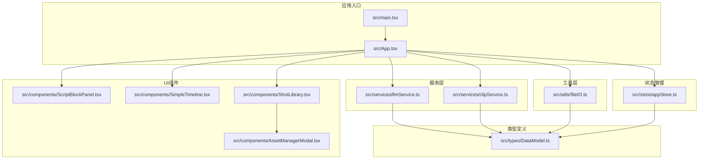
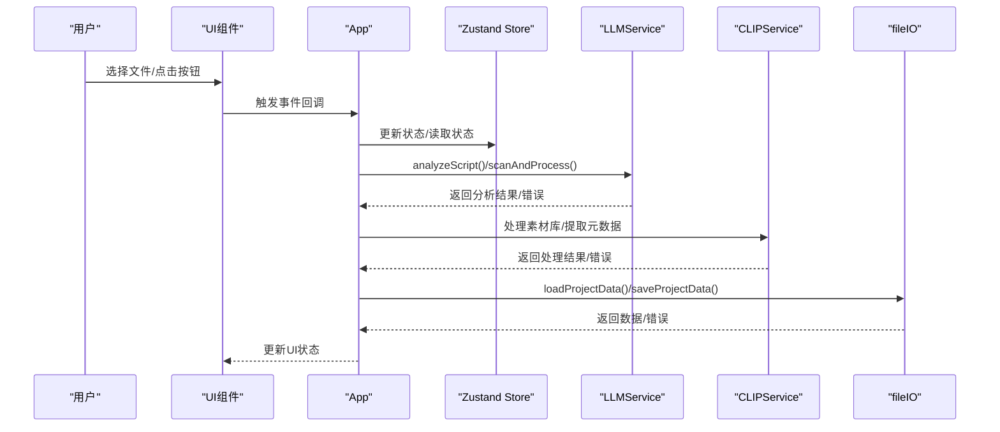
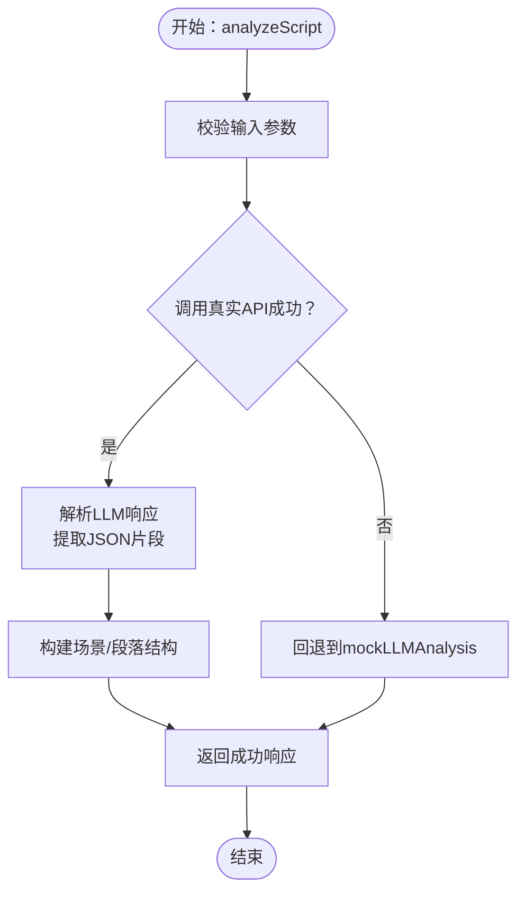
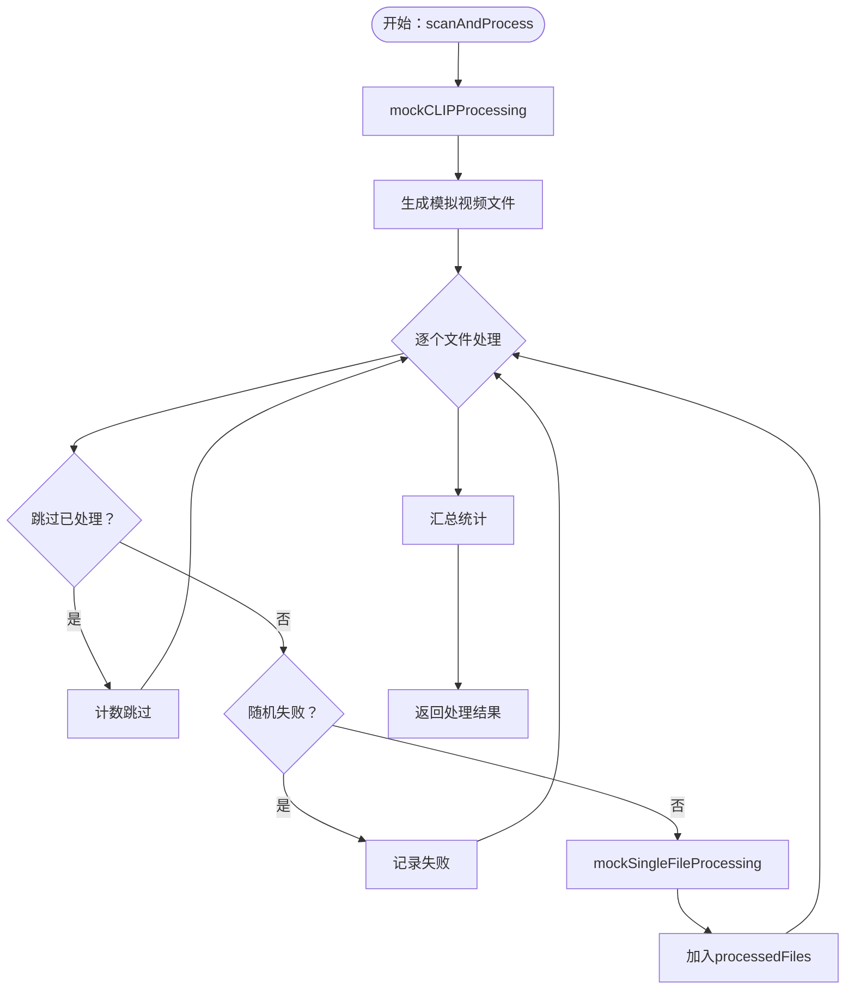
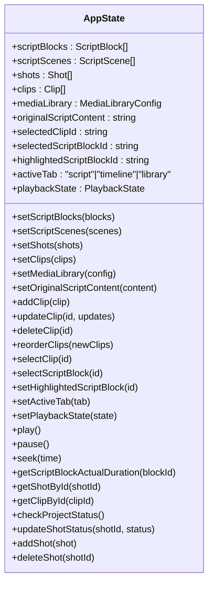
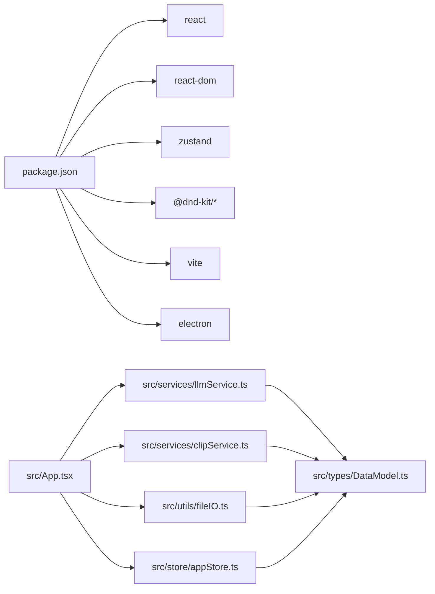

# 测试与调试

<cite>
**本文引用的文件**
- [package.json](file://package.json)
- [vite.config.ts](file://vite.config.ts)
- [src/main.tsx](file://src/main.tsx)
- [src/App.tsx](file://src/App.tsx)
- [src/store/appStore.ts](file://src/store/appStore.ts)
- [src/services/llmService.ts](file://src/services/llmService.ts)
- [src/services/clipService.ts](file://src/services/clipService.ts)
- [src/utils/fileIO.ts](file://src/utils/fileIO.ts)
- [src/types/DataModel.ts](file://src/types/DataModel.ts)
- [src/components/ScriptBlockPanel.tsx](file://src/components/ScriptBlockPanel.tsx)
- [src/components/SimpleTimeline.tsx](file://src/components/SimpleTimeline.tsx)
- [src/components/ShotLibrary.tsx](file://src/components/ShotLibrary.tsx)
- [src/components/AssetManagerModal.tsx](file://src/components/AssetManagerModal.tsx)
</cite>

## 目录
1. [简介](#简介)
2. [项目结构](#项目结构)
3. [核心组件](#核心组件)
4. [架构总览](#架构总览)
5. [详细组件分析](#详细组件分析)
6. [依赖分析](#依赖分析)
7. [性能考量](#性能考量)
8. [故障排查指南](#故障排查指南)
9. [结论](#结论)
10. [附录](#附录)

## 简介
本指南面向CGCUT项目的测试与调试工作，覆盖单元测试与集成测试的编写方法、端到端测试策略、调试技巧（浏览器开发者工具、React DevTools、Electron调试）、日志记录与错误追踪最佳实践，以及性能分析与内存泄漏检测方法。文档结合仓库现有代码结构与实现，给出可落地的测试与调试建议。

## 项目结构
CGCUT采用Vite + React + TypeScript技术栈，状态管理使用Zustand，UI组件通过拖拽库实现时间轴编辑，服务层封装LLM与CLIP分析流程，工具层负责项目数据的加载与保存。整体结构清晰，便于进行模块化测试与调试。

图表来源
- [src/main.tsx](file://src/main.tsx#L1-L11)
- [src/App.tsx](file://src/App.tsx#L1-L60)
- [src/store/appStore.ts](file://src/store/appStore.ts#L1-L60)
- [src/services/llmService.ts](file://src/services/llmService.ts#L1-L60)
- [src/services/clipService.ts](file://src/services/clipService.ts#L1-L60)
- [src/utils/fileIO.ts](file://src/utils/fileIO.ts#L1-L40)
- [src/types/DataModel.ts](file://src/types/DataModel.ts#L1-L60)
- [src/components/ScriptBlockPanel.tsx](file://src/components/ScriptBlockPanel.tsx#L1-L40)
- [src/components/SimpleTimeline.tsx](file://src/components/SimpleTimeline.tsx#L1-L40)
- [src/components/ShotLibrary.tsx](file://src/components/ShotLibrary.tsx#L1-L40)
- [src/components/AssetManagerModal.tsx](file://src/components/AssetManagerModal.tsx#L1-L40)

章节来源
- [package.json](file://package.json#L1-L36)
- [vite.config.ts](file://vite.config.ts#L1-L12)
- [src/main.tsx](file://src/main.tsx#L1-L11)

## 核心组件
- 应用入口与主组件：负责初始化React渲染、加载项目数据、协调服务层与UI组件。
- 状态管理（Zustand）：集中管理剧本段落、场景、镜头、素材、播放状态与UI状态，并提供项目状态检查与播放控制。
- 服务层：
  - LLMService：封装LLM剧本分析流程，支持真实API调用与MVP阶段的回退逻辑。
  - CLIPService：封装视频内容分析与元数据提取，支持批量扫描与单文件处理。
- 工具层：封装项目数据的加载与保存，支持从public/data加载与localStorage保存。
- 类型定义：统一数据模型与状态类型，确保跨模块一致性。
- UI组件：剧本段落面板、时间轴、素材库与素材管理弹窗，支撑用户交互与可视化。

章节来源
- [src/App.tsx](file://src/App.tsx#L1-L120)
- [src/store/appStore.ts](file://src/store/appStore.ts#L1-L120)
- [src/services/llmService.ts](file://src/services/llmService.ts#L60-L140)
- [src/services/clipService.ts](file://src/services/clipService.ts#L1-L80)
- [src/utils/fileIO.ts](file://src/utils/fileIO.ts#L1-L60)
- [src/types/DataModel.ts](file://src/types/DataModel.ts#L1-L120)
- [src/components/ScriptBlockPanel.tsx](file://src/components/ScriptBlockPanel.tsx#L1-L80)
- [src/components/SimpleTimeline.tsx](file://src/components/SimpleTimeline.tsx#L1-L80)
- [src/components/ShotLibrary.tsx](file://src/components/ShotLibrary.tsx#L1-L80)
- [src/components/AssetManagerModal.tsx](file://src/components/AssetManagerModal.tsx#L1-L80)

## 架构总览
下图展示从用户交互到服务层与工具层的数据流与职责边界。

图表来源
- [src/App.tsx](file://src/App.tsx#L60-L220)
- [src/store/appStore.ts](file://src/store/appStore.ts#L120-L195)
- [src/services/llmService.ts](file://src/services/llmService.ts#L70-L120)
- [src/services/clipService.ts](file://src/services/clipService.ts#L30-L120)
- [src/utils/fileIO.ts](file://src/utils/fileIO.ts#L50-L95)

## 详细组件分析

### LLM服务测试策略
- 单元测试要点
  - 输入校验：脚本内容长度、文件名合法性、选项参数。
  - API调用：模拟fetch响应，覆盖成功、超时、HTTP错误与JSON解析失败分支。
  - 回退逻辑：mockLLMAnalysis的输出结构与统计字段一致性。
  - 性能：对长文本与复杂场景的处理耗时与内存占用评估。
- 集成测试要点
  - 与App组件的协作：触发handleImportScript，验证状态变更与提示信息。
  - 与store的联动：检查scriptBlocks与scriptScenes的更新。
- 端到端测试要点
  - 用户流程：上传剧本文件 -> LLM分析 -> 展示结果 -> 保存项目。
  - 错误场景：不支持格式、网络异常、解析失败。

图表来源
- [src/services/llmService.ts](file://src/services/llmService.ts#L70-L120)
- [src/services/llmService.ts](file://src/services/llmService.ts#L200-L320)
- [src/services/llmService.ts](file://src/services/llmService.ts#L325-L423)

章节来源
- [src/services/llmService.ts](file://src/services/llmService.ts#L1-L120)
- [src/services/llmService.ts](file://src/services/llmService.ts#L120-L220)
- [src/services/llmService.ts](file://src/services/llmService.ts#L220-L320)
- [src/services/llmService.ts](file://src/services/llmService.ts#L320-L423)
- [src/App.tsx](file://src/App.tsx#L90-L170)

### CLIP服务测试策略
- 单元测试要点
  - 扫描与批处理：生成模拟视频文件列表、跳过已处理、失败率模拟。
  - 单文件处理：标签生成、情绪识别、关键帧抽取开关。
  - 元数据提取：已有元数据文件存在与否的分支处理。
- 集成测试要点
  - 与App组件协作：handleScanMediaLibrary触发，更新shots与媒体库统计。
  - 与store联动：合并新shots、更新媒体库配置。
- 端到端测试要点
  - 用户流程：设置素材库路径 -> 扫描 -> 展示进度 -> 更新素材库。
  - 错误场景：路径无效、扫描失败、解析失败。

图表来源
- [src/services/clipService.ts](file://src/services/clipService.ts#L100-L170)
- [src/services/clipService.ts](file://src/services/clipService.ts#L170-L210)
- [src/services/clipService.ts](file://src/services/clipService.ts#L210-L330)

章节来源
- [src/services/clipService.ts](file://src/services/clipService.ts#L1-L120)
- [src/services/clipService.ts](file://src/services/clipService.ts#L120-L220)
- [src/services/clipService.ts](file://src/services/clipService.ts#L220-L330)
- [src/App.tsx](file://src/App.tsx#L170-L252)

### 状态管理与数据模型测试策略
- 单元测试要点
  - 计算函数：calculateScriptBlockDuration、calculateTotalDuration、findClipAtTime。
  - Store动作：addClip/updateClip/deleteClip/reorderClips/selectClip等。
  - 项目状态检查：checkProjectStatus的布尔组合与缺失集合。
- 集成测试要点
  - 组件与store的绑定：ScriptBlockPanel、SimpleTimeline、ShotLibrary读取与更新状态。
  - 状态一致性：多处UI对同一状态的并发更新与重绘。

图表来源
- [src/store/appStore.ts](file://src/store/appStore.ts#L1-L195)
- [src/types/DataModel.ts](file://src/types/DataModel.ts#L195-L291)

章节来源
- [src/store/appStore.ts](file://src/store/appStore.ts#L1-L195)
- [src/types/DataModel.ts](file://src/types/DataModel.ts#L195-L291)

### UI组件测试策略
- ScriptBlockPanel
  - 单元测试：渲染场景/段落、高亮与自动滚动、占位符创建、时长状态判断。
  - 集成测试：与store联动，响应播放状态变化。
- SimpleTimeline
  - 单元测试：时间格式化、播放指示器、拖拽排序、点击跳转、裁剪手柄占位逻辑。
  - 集成测试：与播放循环、视频预览同步。
- ShotLibrary
  - 单元测试：筛选器（情绪/状态）、替换素材、标记已处理、编辑与删除。
  - 集成测试：与AssetManagerModal联动。
- AssetManagerModal
  - 单元测试：批量处理、批量删除、批量修改情绪、全选/取消全选、搜索与排序。

章节来源
- [src/components/ScriptBlockPanel.tsx](file://src/components/ScriptBlockPanel.tsx#L1-L120)
- [src/components/ScriptBlockPanel.tsx](file://src/components/ScriptBlockPanel.tsx#L120-L220)
- [src/components/ScriptBlockPanel.tsx](file://src/components/ScriptBlockPanel.tsx#L220-L285)
- [src/components/SimpleTimeline.tsx](file://src/components/SimpleTimeline.tsx#L1-L120)
- [src/components/SimpleTimeline.tsx](file://src/components/SimpleTimeline.tsx#L120-L240)
- [src/components/SimpleTimeline.tsx](file://src/components/SimpleTimeline.tsx#L240-L414)
- [src/components/ShotLibrary.tsx](file://src/components/ShotLibrary.tsx#L1-L120)
- [src/components/ShotLibrary.tsx](file://src/components/ShotLibrary.tsx#L120-L220)
- [src/components/ShotLibrary.tsx](file://src/components/ShotLibrary.tsx#L220-L359)
- [src/components/AssetManagerModal.tsx](file://src/components/AssetManagerModal.tsx#L1-L120)
- [src/components/AssetManagerModal.tsx](file://src/components/AssetManagerModal.tsx#L120-L240)
- [src/components/AssetManagerModal.tsx](file://src/components/AssetManagerModal.tsx#L240-L511)

## 依赖分析
- 外部依赖
  - React与DOM：应用基础运行时。
  - Zustand：轻量状态管理。
  - dnd-kit：拖拽排序。
  - Vite：开发与构建工具。
  - Electron：桌面应用运行时（脚本已提供）。
- 内部耦合
  - App组件耦合store、服务层与工具层；各UI组件通过store读取状态。
  - 服务层与类型定义强耦合，保证数据结构一致性。
  - 工具层与类型定义耦合，确保数据序列化与存储格式一致。

图表来源
- [package.json](file://package.json#L1-L36)
- [src/App.tsx](file://src/App.tsx#L1-L60)
- [src/store/appStore.ts](file://src/store/appStore.ts#L1-L60)
- [src/services/llmService.ts](file://src/services/llmService.ts#L1-L60)
- [src/services/clipService.ts](file://src/services/clipService.ts#L1-L60)
- [src/utils/fileIO.ts](file://src/utils/fileIO.ts#L1-L40)
- [src/types/DataModel.ts](file://src/types/DataModel.ts#L1-L60)

章节来源
- [package.json](file://package.json#L1-L36)

## 性能考量
- LLM调用
  - 超时控制与回退机制：确保在网络不稳定时仍可提供可用结果。
  - 日志采样：避免高频日志影响性能。
- CLIP处理
  - 批量处理与跳过已处理：减少重复计算。
  - 关键帧抽取按需开启：降低I/O与CPU开销。
- UI渲染
  - 虚拟滚动与懒渲染：对长列表（素材库）提升性能。
  - 状态粒度优化：避免不必要的重渲染。
- 存储与缓存
  - localStorage容量限制：大项目建议后端持久化方案。
  - 数据压缩与增量更新：减少序列化成本。

[本节为通用指导，无需列出章节来源]

## 故障排查指南
- 浏览器开发者工具
  - 控制台：定位错误堆栈与网络请求异常。
  - 性能面板：分析主线程阻塞、长任务与重排重绘。
  - 网络面板：检查LLM/CLIP API请求与响应体。
  - 存储面板：检查localStorage与IndexedDB（如启用）。
- React DevTools
  - 组件树：定位重渲染热点与深层嵌套。
  - Profiler：录制交互过程，识别昂贵子树。
  - Hooks：检查状态更新频率与依赖。
- Electron调试
  - 主进程：通过命令行参数启用调试端口，连接远程调试器。
  - 渲染进程：在菜单中启用开发者工具或通过快捷键打开。
  - 日志：在主进程与渲染进程分别输出日志，区分来源。
- 日志记录与错误追踪
  - 结构化日志：统一格式，包含时间戳、模块、级别与上下文。
  - 错误边界：捕获UI渲染错误，降级显示与上报。
  - Sentry/Datadog等APM：接入错误追踪与性能监控。
- 内存泄漏检测
  - 使用Performance Memory快照对比，定位未释放对象。
  - 检查事件监听器、定时器与闭包引用。
  - 避免在组件卸载后仍持有对DOM或全局对象的引用。

[本节为通用指导，无需列出章节来源]

## 结论
通过明确的测试策略与调试方法，CGCUT可以在功能迭代的同时保持稳定性与可维护性。建议优先完善单元测试与集成测试覆盖率，配合端到端测试保障关键用户流程，持续优化性能并建立完善的日志与错误追踪体系。

[本节为总结性内容，无需列出章节来源]

## 附录
- 测试框架建议
  - 单元测试：Jest + React Testing Library（或 Vitest + @testing-library/react）。
  - 集成测试：在Jest中模拟fetch与store，或使用Cypress进行端到端测试。
  - Mock策略：对LLMService与CLIPService进行方法级mock，隔离外部依赖。
- 配置要点
  - Vite配置：确保ESM与TypeScript支持，开发服务器端口与代理设置。
  - Electron脚本：开发与打包脚本分离，确保资源路径正确。
- 调试清单
  - 启用严格模式与类型检查。
  - 在关键路径添加日志与埋点。
  - 对长任务与重渲染进行性能剖析。
  - 建立错误上报与用户反馈渠道。

[本节为通用指导，无需列出章节来源]