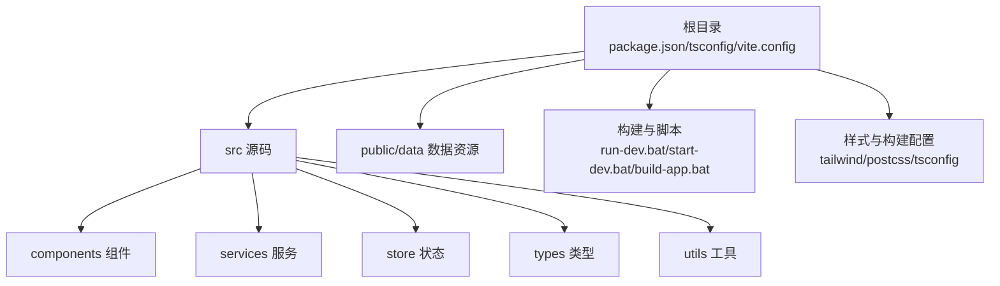
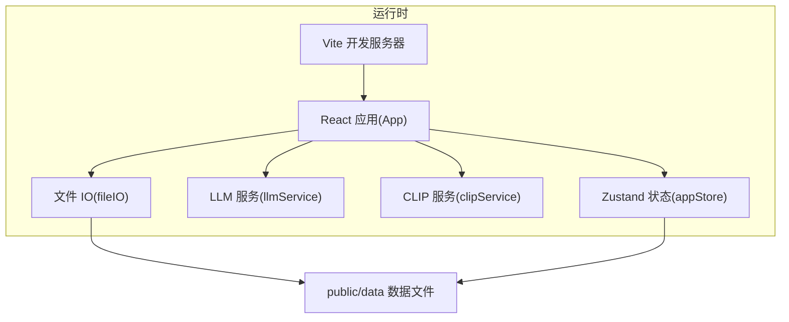

# 环境搭建

<cite>
**本文引用的文件**
- [package.json](file://package.json)
- [tsconfig.json](file://tsconfig.json)
- [tsconfig.node.json](file://tsconfig.node.json)
- [vite.config.ts](file://vite.config.ts)
- [tailwind.config.js](file://tailwind.config.js)
- [postcss.config.js](file://postcss.config.js)
- [README.md](file://README.md)
- [run-dev.bat](file://run-dev.bat)
- [start-dev.bat](file://start-dev.bat)
- [build-app.bat](file://build-app.bat)
- [src/main.tsx](file://src/main.tsx)
- [src/App.tsx](file://src/App.tsx)
- [src/store/appStore.ts](file://src/store/appStore.ts)
- [src/types/DataModel.ts](file://src/types/DataModel.ts)
- [src/services/llmService.ts](file://src/services/llmService.ts)
- [src/services/clipService.ts](file://src/services/clipService.ts)
- [src/utils/fileIO.ts](file://src/utils/fileIO.ts)
</cite>

## 目录
1. [简介](#简介)
2. [项目结构](#项目结构)
3. [核心组件](#核心组件)
4. [架构总览](#架构总览)
5. [详细组件分析](#详细组件分析)
6. [依赖分析](#依赖分析)
7. [性能注意事项](#性能注意事项)
8. [故障排查指南](#故障排查指南)
9. [结论](#结论)
10. [附录](#附录)

## 简介
本指南面向首次搭建 CGCUT 项目的开发者，提供从 Node.js 版本要求、包管理器选择、依赖安装、TypeScript 配置到开发环境验证与常见问题排查的全流程说明。CGCUT 基于 React 18 + TypeScript + Vite 构建，使用 Zustand 管理全局状态，Tailwind CSS 进行样式处理，并通过 LLM/CLIP 服务辅助剧本与素材分析。

## 项目结构
CGCUT 采用“前端单页应用 + 静态资源 + 构建工具”的典型现代前端工程结构：
- 根目录包含包管理与构建脚本、TypeScript 配置、Vite 配置、Tailwind 与 PostCSS 配置，以及 Windows 批处理脚本用于开发与构建。
- 源码位于 src/，按功能划分为组件、服务、状态(store)、类型(types)、工具(utils)等子目录。
- 数据资源位于 public/data/，包含示例数据文件，供应用初始化与演示使用。

图示来源
- [package.json](file://package.json#L1-L36)
- [vite.config.ts](file://vite.config.ts#L1-L12)
- [tailwind.config.js](file://tailwind.config.js#L1-L12)
- [postcss.config.js](file://postcss.config.js#L1-L7)
- [run-dev.bat](file://run-dev.bat#L1-L41)
- [start-dev.bat](file://start-dev.bat#L1-L53)
- [build-app.bat](file://build-app.bat#L1-L44)

章节来源
- [package.json](file://package.json#L1-L36)
- [README.md](file://README.md#L120-L150)

## 核心组件
- 包管理与脚本
  - 使用 npm 作为默认包管理器；yarn/pnpm 在本仓库未显式配置，但可按常规方式使用。
  - 提供 Windows 批处理脚本 run-dev.bat、start-dev.bat、build-app.bat，内置 Node.js/npm 检测、依赖安装与开发/构建流程。
- TypeScript 配置
  - tsconfig.json 采用严格模式与 bundler 模式，启用 JSX 支持与 noEmit 等编译选项。
  - tsconfig.node.json 专用于 Vite 配置文件的模块解析。
- 构建与打包
  - Vite 作为开发服务器与打包工具；构建脚本同时执行 tsc 与 vite build。
- 样式与工具链
  - Tailwind CSS 与 Autoprefixer 通过 PostCSS 配置集成；内容扫描路径覆盖 src 与 index.html。

章节来源
- [package.json](file://package.json#L1-L36)
- [tsconfig.json](file://tsconfig.json#L1-L26)
- [tsconfig.node.json](file://tsconfig.node.json#L1-L11)
- [vite.config.ts](file://vite.config.ts#L1-L12)
- [tailwind.config.js](file://tailwind.config.js#L1-L12)
- [postcss.config.js](file://postcss.config.js#L1-L7)
- [run-dev.bat](file://run-dev.bat#L1-L41)
- [start-dev.bat](file://start-dev.bat#L1-L53)
- [build-app.bat](file://build-app.bat#L1-L44)

## 架构总览
CGCUT 的前端运行时由 Vite 驱动，React 应用通过 Zustand 管理全局状态，组件通过服务层调用 LLM/CLIP 能力进行剧本与素材分析，数据 IO 层负责 public/data 的加载与 localStorage 的保存。

图示来源
- [vite.config.ts](file://vite.config.ts#L1-L12)
- [src/App.tsx](file://src/App.tsx#L1-L497)
- [src/store/appStore.ts](file://src/store/appStore.ts#L1-L195)
- [src/services/llmService.ts](file://src/services/llmService.ts#L1-L476)
- [src/services/clipService.ts](file://src/services/clipService.ts#L1-L394)
- [src/utils/fileIO.ts](file://src/utils/fileIO.ts#L1-L95)

## 详细组件分析

### Node.js 与包管理器
- Node.js 版本建议
  - 推荐使用 LTS 版本，以获得更稳定的包生态与工具链支持。
- 包管理器
  - 仓库默认使用 npm；如需使用 yarn/pnpm，可在本地按常规方式进行安装与切换。
- 依赖安装
  - 开发依赖与生产依赖均在 package.json 中声明；首次运行会自动安装全部依赖。
  - Windows 提供批处理脚本，自动检测 Node/npm 并在缺失时提示安装，随后执行 npm install。

章节来源
- [package.json](file://package.json#L1-L36)
- [run-dev.bat](file://run-dev.bat#L1-L41)
- [start-dev.bat](file://start-dev.bat#L1-L53)
- [build-app.bat](file://build-app.bat#L1-L44)

### TypeScript 配置详解
- 编译目标与模块系统
  - 目标 ES2020，模块系统为 ESNext，配合 Vite 的 bundler 模式。
- 模块解析与 JSX
  - moduleResolution 使用 bundler；允许 TS 扩展名导入；启用 JSX react-jsx。
- 严格模式与 Lint
  - 启用 strict、noUnusedLocals、noUnusedParameters、noFallthroughCasesInSwitch。
- noEmit 与输出
  - noEmit 为 true，表示仅做类型检查，不生成 JS 输出（由 Vite/TSX 处理）。
- include 与 references
  - include 指向 src；references 指向 tsconfig.node.json，用于 Vite 配置文件的类型支持。

章节来源
- [tsconfig.json](file://tsconfig.json#L1-L26)
- [tsconfig.node.json](file://tsconfig.node.json#L1-L11)

### Vite 配置与开发服务器
- 插件与基础配置
  - 使用 @vitejs/plugin-react；base 设置为相对路径；开发服务器端口为 5173。
- 开发流程
  - npm run dev 启动 Vite；Windows 提供 start-dev.bat 自动打开浏览器并等待启动。

章节来源
- [vite.config.ts](file://vite.config.ts#L1-L12)
- [start-dev.bat](file://start-dev.bat#L1-L53)

### 样式与工具链（Tailwind + PostCSS）
- Tailwind 配置
  - content 覆盖 index.html 与 src 下的 JS/TS/JSX/TSX 文件，确保按需生成样式。
- PostCSS 配置
  - 启用 tailwindcss 与 autoprefixer 插件，保证 CSS 浏览器兼容性与原子化样式生效。

章节来源
- [tailwind.config.js](file://tailwind.config.js#L1-L12)
- [postcss.config.js](file://postcss.config.js#L1-L7)

### React 入口与应用主组件
- 入口
  - src/main.tsx 创建根节点并渲染 App。
- 应用主组件
  - src/App.tsx 负责加载项目数据、导入剧本、扫描素材库、导出项目、一键检查等功能；与 Zustand 状态、服务层与工具层交互。

章节来源
- [src/main.tsx](file://src/main.tsx#L1-L11)
- [src/App.tsx](file://src/App.tsx#L1-L497)

### 状态管理（Zustand）
- appStore.ts 定义全局状态与动作，包括：
  - 数据状态：scriptBlocks/scriptScenes/shots/clips/mediaLibrary/originalScriptContent
  - UI 状态：selectedClipId/selectedScriptBlockId/highlightedScriptBlockId/activeTab
  - 播放状态：current_time/is_playing/current_clip_index/current_clip_internal_time/current_script_block_id
  - 计算函数：getScriptBlockActualDuration/getShotById/getClipById/checkProjectStatus
  - 素材管理：updateShotStatus/addShot/deleteShot

章节来源
- [src/store/appStore.ts](file://src/store/appStore.ts#L1-L195)

### 数据模型与工具
- 数据模型
  - src/types/DataModel.ts 定义 LLM/CLIP 请求/响应、剧本场景/段落、镜头、素材、播放状态、项目检查状态等类型。
- 文件 IO
  - src/utils/fileIO.ts 提供从 public/data 加载 JSON 与 localStorage 保存/读取能力；loadProjectData 并行加载 script_blocks.json、shots.json、timeline.json 与 config.json。

章节来源
- [src/types/DataModel.ts](file://src/types/DataModel.ts#L1-L291)
- [src/utils/fileIO.ts](file://src/utils/fileIO.ts#L1-L95)

### 服务层（LLM 与 CLIP）
- LLM 服务
  - src/services/llmService.ts 提供 analyzeScript 方法，支持调用外部 LLM API（NVIDIA）或回退到模拟分析；返回场景与段落结构及元数据。
- CLIP 服务
  - src/services/clipService.ts 提供 scanAndProcess/processSingleFile/extractExistingMetadata 等方法；MVP 阶段使用模拟处理，生产环境可接入真实 API。

章节来源
- [src/services/llmService.ts](file://src/services/llmService.ts#L1-L476)
- [src/services/clipService.ts](file://src/services/clipService.ts#L1-L394)

### 构建与打包
- 构建脚本
  - package.json 中 build 脚本先执行 tsc 再执行 vite build；Windows 提供 build-app.bat 自动安装依赖并执行构建。
- 开发与预览
  - dev 启动开发服务器；preview 启动静态预览服务器。

章节来源
- [package.json](file://package.json#L1-L36)
- [build-app.bat](file://build-app.bat#L1-L44)

## 依赖分析
- 生产依赖
  - React、React DOM、Zustand、拖拽相关 dnd-kit 包，用于界面与状态管理。
- 开发依赖
  - @types/react、@types/react-dom、@vitejs/plugin-react、typescript、vite、tailwindcss、postcss、autoprefixer、electron、concurrently、wait-on。
- 作用差异
  - 生产依赖在最终构建产物中保留；开发依赖仅参与开发与构建流程，不打入生产包。

章节来源
- [package.json](file://package.json#L1-L36)

## 性能注意事项
- 构建优化
  - 使用 Vite 的原生按需加载与热更新；合理拆分组件与路由，避免一次性加载过多资源。
- 样式体积控制
  - Tailwind content 路径精准覆盖，减少未使用样式的打包体积。
- 数据加载策略
  - 使用并行加载与懒加载策略，减少首屏阻塞；对大文件或远程资源增加缓存与降级方案。

## 故障排查指南
- Node.js 未安装或版本不兼容
  - 现象：批处理脚本报错，提示未找到 Node.js/npm。
  - 处理：安装推荐的 LTS 版本，重启终端后重试。
- 端口冲突
  - 现象：开发服务器端口 5173 被占用。
  - 处理：Vite 会自动选择其他端口；关注命令行输出的最终访问地址。
- 依赖安装失败
  - 现象：npm install 失败或卡住。
  - 处理：检查网络与代理；清理缓存后重试；必要时更换镜像源。
- LLM/CLIP 服务调用失败
  - 现象：LLM 分析或 CLIP 处理报错。
  - 处理：确认网络连通性；查看服务端点与鉴权配置；必要时使用模拟分析回退逻辑。
- 浏览器无法访问
  - 现象：打开 localhost:5173 无响应。
  - 处理：确认开发服务器已启动且端口正确；检查防火墙与杀毒软件拦截。

章节来源
- [run-dev.bat](file://run-dev.bat#L1-L41)
- [start-dev.bat](file://start-dev.bat#L1-L53)
- [src/services/llmService.ts](file://src/services/llmService.ts#L1-L476)
- [src/services/clipService.ts](file://src/services/clipService.ts#L1-L394)

## 结论
按照本指南完成 Node.js（建议 LTS）、npm/yarn 选择、依赖安装与 TypeScript/Vite/Tailwind 配置后，即可顺利启动 CGCUT 开发环境。建议在本地先通过批处理脚本验证开发服务器与数据加载，再逐步接入 LLM/CLIP 服务与 Electron 打包流程。

## 附录

### 开发环境验证清单
- 检查 Node.js 与 npm 版本
- 执行 npm install 安装依赖
- 运行 npm run dev 启动开发服务器
- 访问 http://localhost:5173 验证页面加载
- 加载 public/data 示例数据，确认界面正常
- 尝试导入剧本与扫描素材库，验证 LLM/CLIP 功能

章节来源
- [README.md](file://README.md#L13-L30)
- [start-dev.bat](file://start-dev.bat#L1-L53)
- [src/App.tsx](file://src/App.tsx#L1-L497)
- [src/utils/fileIO.ts](file://src/utils/fileIO.ts#L1-L95)