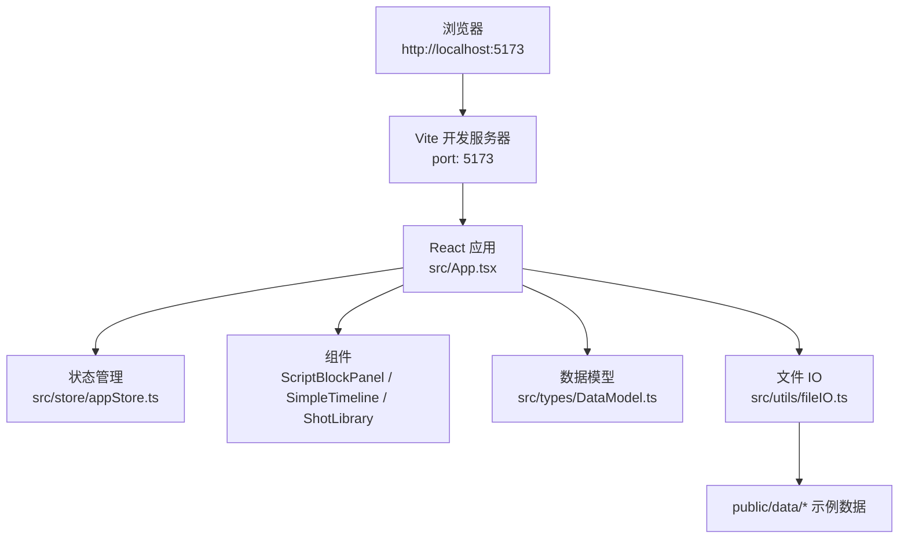
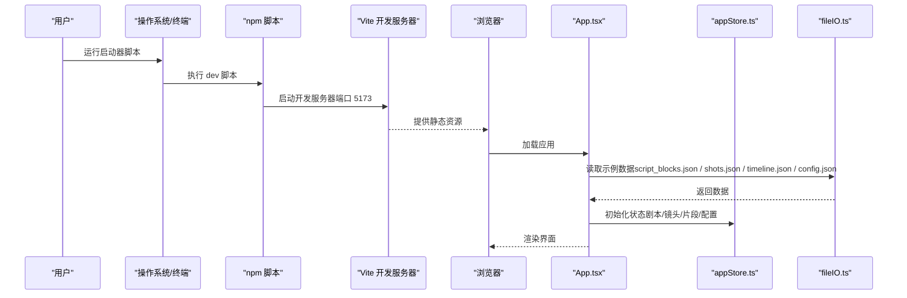
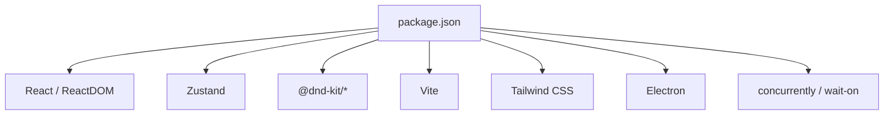
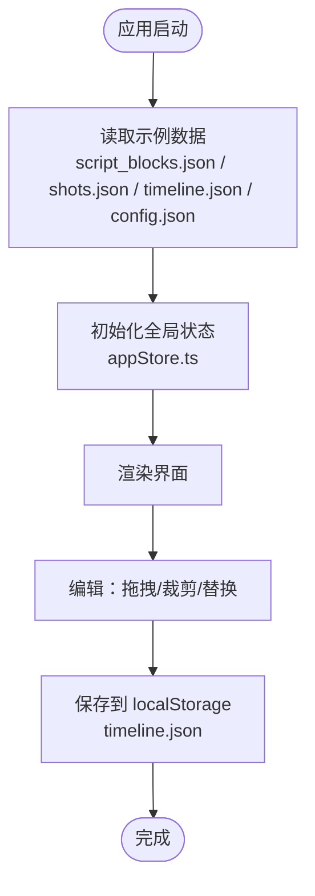

# 快速开始

<cite>
**本文引用的文件**
- [README.md](file://README.md)
- [package.json](file://package.json)
- [vite.config.ts](file://vite.config.ts)
- [start-dev.bat](file://start-dev.bat)
- [run-dev.bat](file://run-dev.bat)
- [LAUNCHERS.md](file://LAUNCHERS.md)
- [USAGE_GUIDE.md](file://USAGE_GUIDE.md)
- [public/data/config.json](file://public/data/config.json)
- [public/data/script_blocks.json](file://public/data/script_blocks.json)
- [public/data/shots.json](file://public/data/shots.json)
- [src/App.tsx](file://src/App.tsx)
- [src/store/appStore.ts](file://src/store/appStore.ts)
- [src/utils/fileIO.ts](file://src/utils/fileIO.ts)
- [src/types/DataModel.ts](file://src/types/DataModel.ts)
- [src/components/ScriptBlockPanel.tsx](file://src/components/ScriptBlockPanel.tsx)
- [src/components/SimpleTimeline.tsx](file://src/components/SimpleTimeline.tsx)
- [src/components/ShotLibrary.tsx](file://src/components/ShotLibrary.tsx)
</cite>

## 目录
1. [简介](#简介)
2. [项目结构](#项目结构)
3. [核心组件](#核心组件)
4. [架构总览](#架构总览)
5. [详细组件分析](#详细组件分析)
6. [依赖分析](#依赖分析)
7. [性能注意事项](#性能注意事项)
8. [故障排除指南](#故障排除指南)
9. [结论](#结论)
10. [附录](#附录)

## 简介
本指南面向新手开发者，帮助你在最短时间内运行 CGCUT 项目并理解基本功能。你将学会：
- 安装与启动：Node.js 环境要求、依赖安装命令、开发服务器启动方式
- 访问开发环境：http://localhost:5173
- 基本使用流程：导入示例数据、加载剧本、验证节奏、调整镜头
- 常见问题与故障排除
- 开发环境配置与调试技巧

## 项目结构
CGCUT 是基于 React 18 + TypeScript + Vite 的前端项目，采用模块化组织，核心目录与职责如下：
- src：源代码
  - components：UI 组件（剧本面板、时间轴、素材库等）
  - store：全局状态（Zustand）
  - utils：文件 IO（从 public/data 读取与 localStorage 保存）
  - types：数据模型与工具函数
  - App.tsx：主应用入口
- public/data：示例数据（剧本段落、镜头、时间轴、配置）
- 构建与启动：package.json 脚本、vite.config.ts、Windows 启动器批处理脚本

图表来源
- [vite.config.ts](file://vite.config.ts#L1-L12)
- [src/App.tsx](file://src/App.tsx#L1-L60)
- [src/store/appStore.ts](file://src/store/appStore.ts#L1-L60)
- [src/utils/fileIO.ts](file://src/utils/fileIO.ts#L51-L95)
- [public/data/script_blocks.json](file://public/data/script_blocks.json#L1-L38)
- [public/data/shots.json](file://public/data/shots.json#L1-L83)

章节来源
- [README.md](file://README.md#L118-L150)
- [vite.config.ts](file://vite.config.ts#L1-L12)
- [package.json](file://package.json#L1-L36)

## 核心组件
- 应用入口与数据加载：应用启动时从 public/data 读取示例数据，并初始化素材库配置；支持保存到 localStorage。
- 状态管理：集中维护剧本段落、镜头、时间轴片段、媒体库配置、播放状态等。
- 组件职责：
  - 剧本段落面板：展示段落、期望时长与实际时长对比、播放高亮、创建占位片段
  - 简单时间轴：单轨布局、拖拽排序、删除、裁剪 in/out、播放预览
  - 素材库：按情绪/状态筛选、替换镜头、设置素材库路径、标记素材状态

章节来源
- [src/App.tsx](file://src/App.tsx#L39-L90)
- [src/store/appStore.ts](file://src/store/appStore.ts#L1-L120)
- [src/utils/fileIO.ts](file://src/utils/fileIO.ts#L51-L95)
- [src/components/ScriptBlockPanel.tsx](file://src/components/ScriptBlockPanel.tsx#L1-L120)
- [src/components/SimpleTimeline.tsx](file://src/components/SimpleTimeline.tsx#L1-L120)
- [src/components/ShotLibrary.tsx](file://src/components/ShotLibrary.tsx#L1-L120)

## 架构总览
下面的时序图展示了“启动开发服务器并加载示例数据”的关键流程。

图表来源
- [run-dev.bat](file://run-dev.bat#L36-L41)
- [package.json](file://package.json#L8-L11)
- [vite.config.ts](file://vite.config.ts#L1-L12)
- [src/App.tsx](file://src/App.tsx#L39-L59)
- [src/utils/fileIO.ts](file://src/utils/fileIO.ts#L51-L95)
- [src/store/appStore.ts](file://src/store/appStore.ts#L60-L120)

## 详细组件分析

### 安装与启动
- Node.js 环境要求：项目使用现代前端技术栈，建议使用稳定版 Node.js 与 npm。
- 依赖安装：在项目根目录执行依赖安装命令。
- 启动开发服务器：执行开发脚本，浏览器将自动打开 http://localhost:5173。
- 端口说明：开发服务器默认端口为 5173；若被占用，Vite 会自动选择其他端口并在命令行输出实际访问地址。

章节来源
- [README.md](file://README.md#L13-L24)
- [package.json](file://package.json#L8-L11)
- [vite.config.ts](file://vite.config.ts#L1-L12)
- [run-dev.bat](file://run-dev.bat#L36-L41)
- [start-dev.bat](file://start-dev.bat#L35-L48)
- [LAUNCHERS.md](file://LAUNCHERS.md#L7-L17)

### 访问开发环境
- 默认访问地址：http://localhost:5173
- 若端口被占用：根据命令行提示查看实际端口；也可使用启动器脚本自动打开浏览器。

章节来源
- [README.md](file://README.md#L23-L24)
- [vite.config.ts](file://vite.config.ts#L8-L10)
- [run-dev.bat](file://run-dev.bat#L39-L41)

### 基本使用流程
- 导入示例数据：应用启动时会自动从 public/data 读取示例数据（剧本段落、镜头、时间轴、配置），无需手动导入。
- 加载剧本：顶部工具栏提供“导入剧本”按钮，支持 .txt/.json 格式；导入后会在左侧面板显示段落与场景。
- 验证节奏：剧本面板会实时显示每段的实际时长与期望时长对比，帮助快速发现节奏问题。
- 调整镜头：在素材库中选择合适镜头，拖拽到时间轴；支持拖拽排序、删除、裁剪 in/out；替换镜头后时间轴与段落时长会即时更新。
- 预览播放：时间轴上方集成播放器，支持播放/暂停、停止、进度跳转与实时预览。

章节来源
- [src/App.tsx](file://src/App.tsx#L282-L350)
- [src/components/ScriptBlockPanel.tsx](file://src/components/ScriptBlockPanel.tsx#L120-L182)
- [src/components/SimpleTimeline.tsx](file://src/components/SimpleTimeline.tsx#L160-L200)
- [src/components/ShotLibrary.tsx](file://src/components/ShotLibrary.tsx#L193-L200)
- [USAGE_GUIDE.md](file://USAGE_GUIDE.md#L64-L126)

### 开发环境配置与调试技巧
- 开发脚本：推荐使用 run-dev.bat 查看实时日志；或使用 start-dev.bat 自动打开浏览器。
- Electron 桌面应用：如需桌面体验，可使用 run-electron.bat 或 start-electron.bat。
- 构建生产版本：执行构建脚本生成产物。
- 调试要点：
  - 在浏览器开发者工具中查看网络请求与控制台日志
  - 关注数据加载与状态更新（App.tsx、fileIO.ts、appStore.ts）
  - 使用“一键检查”弹窗核对项目完整性（剧本导入、时间轴占位、素材匹配）

章节来源
- [LAUNCHERS.md](file://LAUNCHERS.md#L7-L31)
- [package.json](file://package.json#L8-L11)
- [src/App.tsx](file://src/App.tsx#L275-L306)

## 依赖分析
- 运行时依赖：React、ReactDOM、Zustand（状态管理）、@dnd-kit（拖拽）、Tailwind CSS（样式）
- 开发依赖：TypeScript、Vite、Tailwind CSS、PostCSS、Autoprefixer、Electron、concurrently、wait-on
- 脚本命令：dev、build、preview、electron、electron:dev

图表来源
- [package.json](file://package.json#L14-L35)

章节来源
- [package.json](file://package.json#L14-L35)

## 性能注意事项
- 视频预览：浏览器播放视频时受文件大小与编码影响，建议使用压缩后的预览文件以提升加载速度。
- 素材库扫描：扫描大量视频文件可能耗时较长，建议合理规划素材库路径与文件数量。
- 数据持久化：项目保存至浏览器 localStorage，容量有限且易受清理影响，建议定期导出项目备份。

章节来源
- [USAGE_GUIDE.md](file://USAGE_GUIDE.md#L100-L112)

## 故障排除指南
- 无法访问 http://localhost:5173
  - 确认开发服务器已启动且端口为 5173；若被占用，查看命令行输出的实际端口
  - 使用启动器脚本自动打开浏览器
- 依赖安装失败
  - 确认已安装 Node.js 与 npm；首次运行会自动安装依赖
- 剧本导入失败
  - 仅支持 .txt 与 .json 格式；DOC/DOCX 需转换为 TXT/JSON
- 素材库扫描失败
  - 确认已设置素材库路径；检查路径有效性与文件权限
- 播放器不工作
  - 确保时间轴中至少存在一个镜头片段；检查素材是否已正确关联

章节来源
- [run-dev.bat](file://run-dev.bat#L36-L41)
- [start-dev.bat](file://start-dev.bat#L35-L48)
- [src/App.tsx](file://src/App.tsx#L80-L110)
- [src/components/ShotLibrary.tsx](file://src/components/ShotLibrary.tsx#L116-L145)
- [USAGE_GUIDE.md](file://USAGE_GUIDE.md#L113-L126)

## 结论
通过本指南，你可以快速完成 CGCUT 项目的安装与启动，理解基本的数据流与使用流程，并掌握常见问题的排查方法。建议在熟悉基础功能后，进一步探索素材库扫描、镜头替换与播放预览等高级能力。

## 附录

### 示例数据说明
- 剧本段落：包含场景、文本、情绪与期望时长
- 镜头：包含镜头标签、情绪、时长、状态等
- 时间轴：片段集合，记录每个镜头的 in/out 与实际时长
- 配置：媒体服务器地址、预览质量等

章节来源
- [public/data/script_blocks.json](file://public/data/script_blocks.json#L1-L38)
- [public/data/shots.json](file://public/data/shots.json#L1-L83)
- [public/data/config.json](file://public/data/config.json#L1-L6)

### 数据加载与保存流程

图表来源
- [src/utils/fileIO.ts](file://src/utils/fileIO.ts#L51-L95)
- [src/store/appStore.ts](file://src/store/appStore.ts#L60-L120)
- [src/App.tsx](file://src/App.tsx#L39-L59)