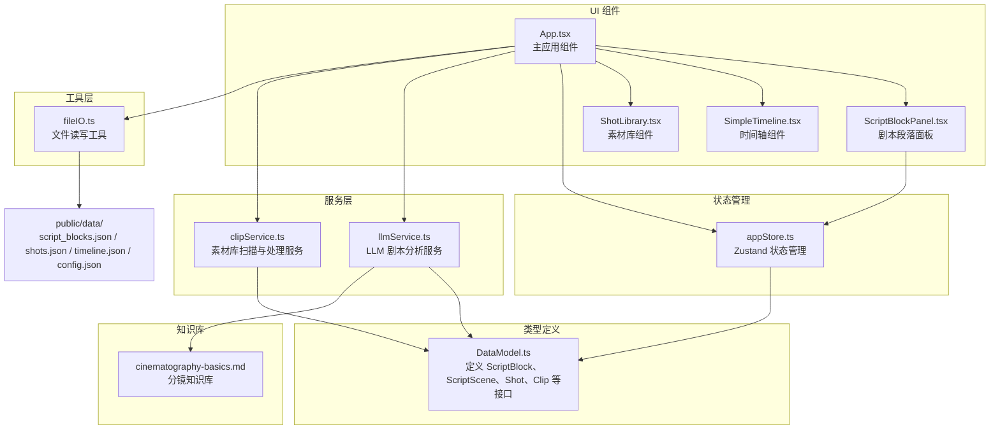
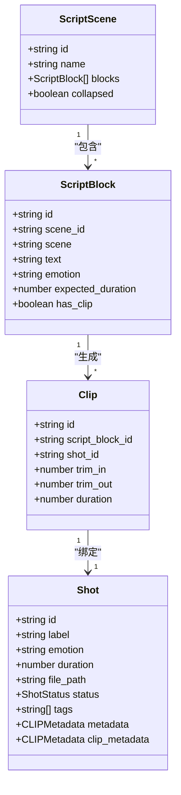
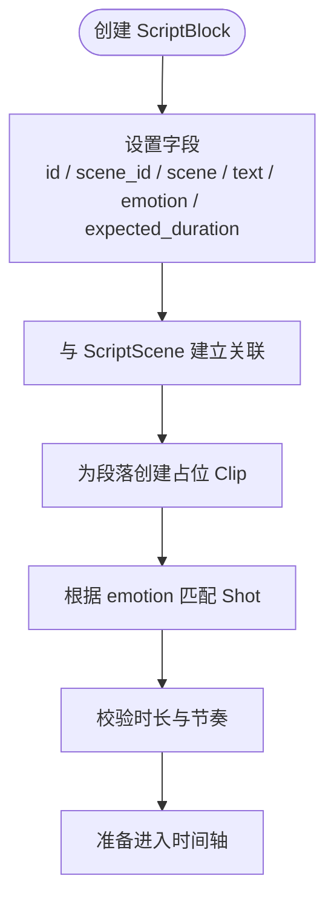
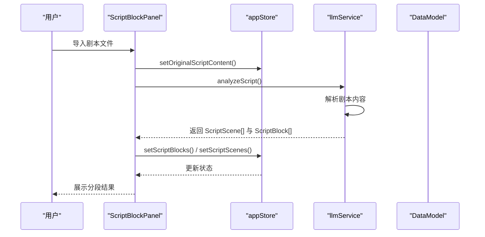
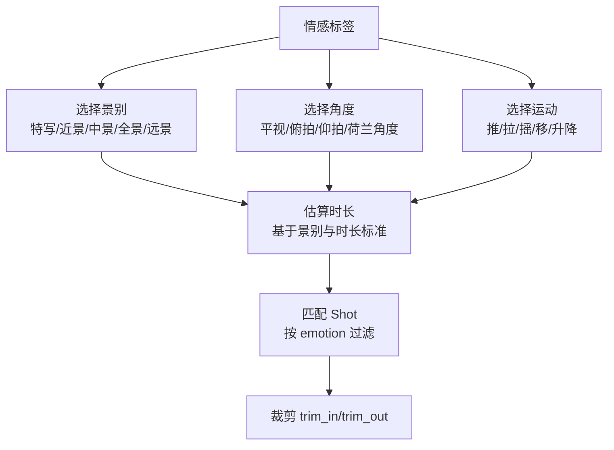
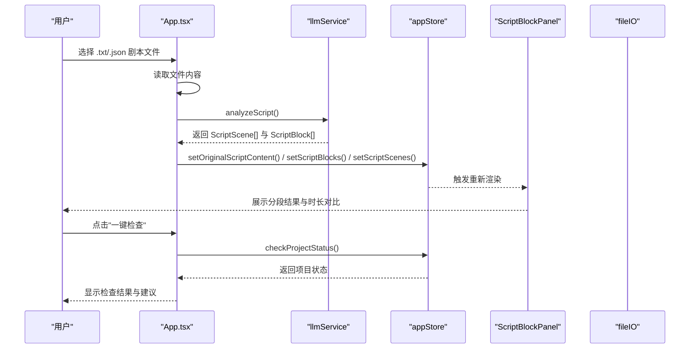
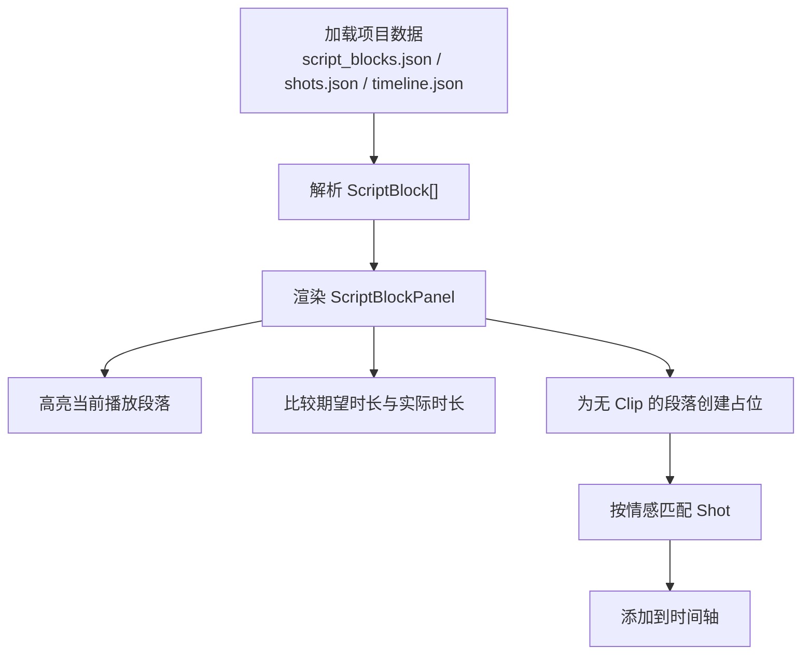
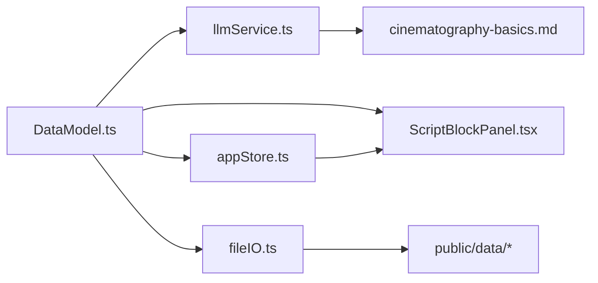

# 剧本段落数据模型

<cite>
**本文档引用的文件**
- [DataModel.ts](file://src/types/DataModel.ts)
- [script_blocks.json](file://public/data/script_blocks.json)
- [shots.json](file://public/data/shots.json)
- [llmService.ts](file://src/services/llmService.ts)
- [ScriptBlockPanel.tsx](file://src/components/ScriptBlockPanel.tsx)
- [appStore.ts](file://src/store/appStore.ts)
- [App.tsx](file://src/App.tsx)
- [fileIO.ts](file://src/utils/fileIO.ts)
- [cinematography-basics.md](file://knowledge/cinematography-basics.md)
</cite>

## 目录
1. [简介](#简介)
2. [项目结构](#项目结构)
3. [核心组件](#核心组件)
4. [架构概览](#架构概览)
5. [详细组件分析](#详细组件分析)
6. [依赖分析](#依赖分析)
7. [性能考量](#性能考量)
8. [故障排除指南](#故障排除指南)
9. [结论](#结论)
10. [附录](#附录)

## 简介
本文件详细说明剧本段落数据模型，重点阐述 ScriptBlock 接口的完整结构及其在影视分镜制作中的作用。ScriptBlock 作为叙事的基本单元，承载场景标识、台词描述、情感标签和预期时长等关键信息，并与 ScriptScene 形成层次化组织关系。本文还将解释情感标签系统如何影响镜头选择和节奏匹配，以及从剧本导入、拆解到验证的完整工作流程。

## 项目结构
该项目采用前端 React + TypeScript 架构，数据模型集中定义在类型文件中，UI 组件负责展示和交互，服务层负责外部 API 调用，存储层管理应用状态，工具层提供文件读写能力。



**图表来源**
- [DataModel.ts](file://src/types/DataModel.ts#L86-L135)
- [llmService.ts](file://src/services/llmService.ts#L62-L476)
- [appStore.ts](file://src/store/appStore.ts#L1-L195)
- [ScriptBlockPanel.tsx](file://src/components/ScriptBlockPanel.tsx#L1-L285)
- [App.tsx](file://src/App.tsx#L1-L497)
- [fileIO.ts](file://src/utils/fileIO.ts#L1-L95)
- [cinematography-basics.md](file://knowledge/cinematography-basics.md#L1-L366)

**章节来源**
- [DataModel.ts](file://src/types/DataModel.ts#L86-L135)
- [App.tsx](file://src/App.tsx#L1-L497)

## 核心组件
本节深入解析 ScriptBlock 接口的字段含义、用途以及与其他组件的关系。

- id: 唯一标识符，用于区分不同的剧本段落
- scene_id: 所属场景的唯一标识符，用于建立段落到场景的关联
- scene: 场景标识字符串，通常为场景名称（如 "INT. 卧室 - 夜晚"），便于 UI 展示和用户理解
- text: 段落的文本内容，通常是台词或场景描述
- emotion: 情感标签，决定镜头选择和节奏匹配（如 "紧张"、"焦虑"、"恐惧"、"释然" 等）
- expected_duration: 导演预期时长（秒），用于控制节奏和时长平衡
- has_clip?: 可选字段，指示该段落是否已有对应的剪辑片段

这些字段共同构成 ScriptBlock 的完整语义，支撑从剧本到分镜再到最终剪辑的全流程。

**章节来源**
- [DataModel.ts](file://src/types/DataModel.ts#L97-L109)

## 架构概览
下面的类图展示了数据模型之间的关系，特别是 ScriptBlock 与 ScriptScene 的层次关系，以及与 Shot、Clip 的关联。



**图表来源**
- [DataModel.ts](file://src/types/DataModel.ts#L86-L148)

**章节来源**
- [DataModel.ts](file://src/types/DataModel.ts#L86-L148)

## 详细组件分析

### ScriptBlock 接口详解
ScriptBlock 是剧本拆解后的最小叙事单元，其字段设计直接影响镜头选择和节奏控制：
- id: 唯一标识，确保在时间轴和素材库中可精确定位
- scene_id 与 scene: 建立段落到场景的层次关系，便于 UI 展示和批量操作
- text: 作为镜头描述的基础文本，LLM 会将其转换为具体的镜头语言
- emotion: 情感标签是镜头选择的核心依据，决定景别、角度、运动和节奏
- expected_duration: 时长基准，用于与实际剪辑时长对比，评估节奏是否合适
- has_clip: 标识段落是否已绑定素材，用于项目状态检查



**图表来源**
- [DataModel.ts](file://src/types/DataModel.ts#L97-L109)
- [ScriptBlockPanel.tsx](file://src/components/ScriptBlockPanel.tsx#L71-L106)

**章节来源**
- [DataModel.ts](file://src/types/DataModel.ts#L97-L109)
- [ScriptBlockPanel.tsx](file://src/components/ScriptBlockPanel.tsx#L71-L106)

### ScriptScene 与 ScriptBlock 的关系
ScriptScene 表示一个场景，包含多个 ScriptBlock。这种关系使得 UI 可以按场景折叠/展开，便于用户管理长剧本；同时，场景级别的时长统计有助于整体节奏把控。



**图表来源**
- [App.tsx](file://src/App.tsx#L70-L169)
- [llmService.ts](file://src/services/llmService.ts#L72-L101)
- [DataModel.ts](file://src/types/DataModel.ts#L86-L95)

**章节来源**
- [DataModel.ts](file://src/types/DataModel.ts#L86-L95)
- [App.tsx](file://src/App.tsx#L70-L169)

### 情感标签系统与镜头选择
情感标签是连接剧本与视觉语言的关键桥梁。根据知识库，不同情感对应不同的镜头特征、景别选择和节奏控制策略：
- 紧张：快速切换、特写/近景，快节奏
- 焦虑：手持摄影、晃动、不稳定构图，不规则节奏
- 恐惧：阴影、低照度、仰拍/俯拍，突变节奏
- 释然：稳定镜头、柔和光线、缓慢移动，舒缓节奏
- 平静：静止镜头、平衡构图、自然光，慢节奏
- 愤怒：强烈对比、快速推进、冲击感，爆发性节奏
- 悲伤：长镜头、缓慢移动、冷色调，延长节奏
- 喜悦：明亮、跳跃式剪辑、动态，活泼节奏



**图表来源**
- [cinematography-basics.md](file://knowledge/cinematography-basics.md#L142-L177)
- [ScriptBlockPanel.tsx](file://src/components/ScriptBlockPanel.tsx#L71-L106)

**章节来源**
- [cinematography-basics.md](file://knowledge/cinematography-basics.md#L142-L177)
- [ScriptBlockPanel.tsx](file://src/components/ScriptBlockPanel.tsx#L71-L106)

### 剧本导入、拆解与验证流程
完整的流程从用户导入剧本开始，经过 LLM 智能拆解，到 UI 展示，再到项目状态检查与素材匹配。



**图表来源**
- [App.tsx](file://src/App.tsx#L70-L169)
- [llmService.ts](file://src/services/llmService.ts#L72-L101)
- [appStore.ts](file://src/store/appStore.ts#L148-L178)
- [ScriptBlockPanel.tsx](file://src/components/ScriptBlockPanel.tsx#L1-L285)

**章节来源**
- [App.tsx](file://src/App.tsx#L70-L169)
- [llmService.ts](file://src/services/llmService.ts#L72-L101)
- [appStore.ts](file://src/store/appStore.ts#L148-L178)

### 数据模型与 UI 的交互
ScriptBlockPanel 负责展示 ScriptBlock 列表，支持场景折叠、时长对比、占位 Clip 创建等功能。UI 通过 appStore 获取状态并触发相应操作。



**图表来源**
- [fileIO.ts](file://src/utils/fileIO.ts#L54-L73)
- [ScriptBlockPanel.tsx](file://src/components/ScriptBlockPanel.tsx#L1-L285)
- [appStore.ts](file://src/store/appStore.ts#L131-L178)

**章节来源**
- [fileIO.ts](file://src/utils/fileIO.ts#L54-L73)
- [ScriptBlockPanel.tsx](file://src/components/ScriptBlockPanel.tsx#L1-L285)
- [appStore.ts](file://src/store/appStore.ts#L131-L178)

## 依赖分析
ScriptBlock 的实现依赖于多个模块：
- 类型定义：DataModel.ts 提供 ScriptBlock、ScriptScene、Shot、Clip 等接口
- 服务层：llmService.ts 负责剧本智能拆解，生成 ScriptScene[] 与 ScriptBlock[]
- 状态管理：appStore.ts 管理应用状态，包括 scriptBlocks、scriptScenes、clips、shots 等
- UI 组件：ScriptBlockPanel.tsx 展示 ScriptBlock 列表并提供交互
- 工具层：fileIO.ts 提供项目数据的加载与保存
- 知识库：cinematography-basics.md 提供情感与镜头关系的专业指导



**图表来源**
- [DataModel.ts](file://src/types/DataModel.ts#L86-L148)
- [llmService.ts](file://src/services/llmService.ts#L62-L476)
- [appStore.ts](file://src/store/appStore.ts#L1-L195)
- [ScriptBlockPanel.tsx](file://src/components/ScriptBlockPanel.tsx#L1-L285)
- [fileIO.ts](file://src/utils/fileIO.ts#L1-L95)
- [cinematography-basics.md](file://knowledge/cinematography-basics.md#L1-L366)

**章节来源**
- [DataModel.ts](file://src/types/DataModel.ts#L86-L148)
- [llmService.ts](file://src/services/llmService.ts#L62-L476)
- [appStore.ts](file://src/store/appStore.ts#L1-L195)
- [ScriptBlockPanel.tsx](file://src/components/ScriptBlockPanel.tsx#L1-L285)
- [fileIO.ts](file://src/utils/fileIO.ts#L1-L95)
- [cinematography-basics.md](file://knowledge/cinematography-basics.md#L1-L366)

## 性能考量
- LLM 分析：使用 NVIDIA API 进行剧本拆解，支持超时控制与回退机制，避免长时间阻塞
- UI 渲染：ScriptBlockPanel 支持场景折叠，减少一次性渲染的 DOM 节点数量
- 状态管理：Zustand 提供轻量级状态管理，避免不必要的重渲染
- 文件 IO：MVP 阶段使用 localStorage 模拟文件保存，后续可替换为 Electron API 实现真实文件写入

[本节为通用性能讨论，无需特定文件来源]

## 故障排除指南
- LLM 分析失败：检查 API 端点、密钥与超时设置，确认网络连接正常
- 剧本导入失败：确认文件格式为 .txt 或 .json，避免 DOC/DOCX 格式
- 项目状态检查：若提示缺少 Clip 或素材，检查 ScriptBlock 是否已创建占位 Clip，以及 Shot 是否按情感正确匹配
- 素材库扫描：确认素材库路径有效，文件格式符合要求（.mp4/.mov/.avi）

**章节来源**
- [App.tsx](file://src/App.tsx#L70-L169)
- [llmService.ts](file://src/services/llmService.ts#L94-L101)
- [appStore.ts](file://src/store/appStore.ts#L148-L178)

## 结论
ScriptBlock 作为剧本拆解后的基本单元，通过明确的字段定义和与 ScriptScene 的层次关系，为后续的镜头选择、节奏控制和时间轴编排提供了坚实基础。结合情感标签系统与专业的分镜知识库，能够实现从文本到视觉语言的高效转换。完善的导入、拆解与验证流程确保了项目的可控性和可交付性。

[本节为总结性内容，无需特定文件来源]

## 附录

### ScriptBlock 字段定义
- id: 唯一标识符
- scene_id: 所属场景 ID
- scene: 场景标识字符串
- text: 段落文本内容
- emotion: 情感标签
- expected_duration: 预期时长（秒）
- has_clip: 是否已有 Clip

**章节来源**
- [DataModel.ts](file://src/types/DataModel.ts#L97-L109)

### 实际 JSON 示例
以下为 script_blocks.json 中的示例数据，展示 ScriptBlock 的实际结构与字段取值。

```json
[
  {
    "id": "sb_001",
    "scene": "INT. 卧室 - 夜晚",
    "text": "主角躺在床上，辗转反侧。窗外传来微弱的雨声。",
    "emotion": "焦虑",
    "expected_duration": 8.0
  },
  {
    "id": "sb_002",
    "scene": "INT. 卧室 - 夜晚",
    "text": "突然，门外传来脚步声，越来越近。",
    "emotion": "紧张",
    "expected_duration": 5.0
  },
  {
    "id": "sb_003",
    "scene": "INT. 走廊 - 夜晚",
    "text": "门把手缓慢转动，发出轻微的吱呀声。",
    "emotion": "紧张",
    "expected_duration": 6.0
  },
  {
    "id": "sb_004",
    "scene": "INT. 卧室 - 夜晚",
    "text": "主角屏住呼吸，眼睛紧盯着房门。",
    "emotion": "恐惧",
    "expected_duration": 4.0
  },
  {
    "id": "sb_005",
    "scene": "INT. 卧室 - 夜晚",
    "text": "门突然打开，是妈妈端着一杯热牛奶。",
    "emotion": "释然",
    "expected_duration": 3.0
  }
]
```

**章节来源**
- [script_blocks.json](file://public/data/script_blocks.json#L1-L38)

### 情感标签与镜头选择对照
- 紧张：特写/近景，快节奏
- 焦虑：近景/中景，不规则节奏
- 恐惧：特写/全景，突变节奏
- 释然：全景/中景，舒缓节奏
- 平静：全景/远景，慢节奏
- 愤怒：近景/特写，爆发性节奏
- 悲伤：近景/中景，延长节奏
- 喜悦：全景/中景，活泼节奏

**章节来源**
- [cinematography-basics.md](file://knowledge/cinematography-basics.md#L142-L177)