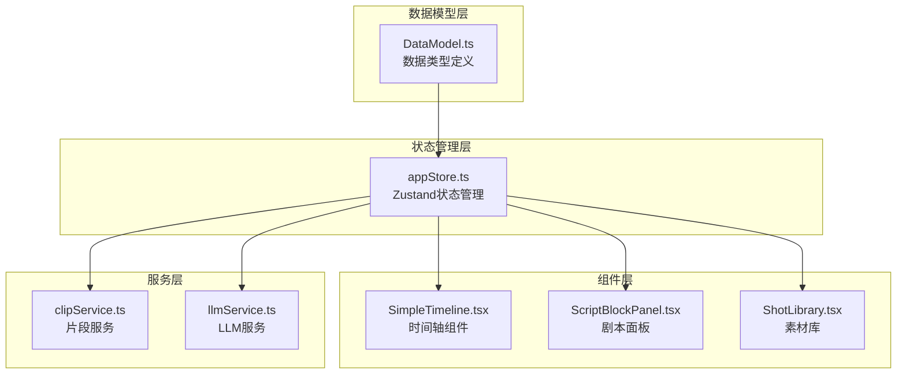
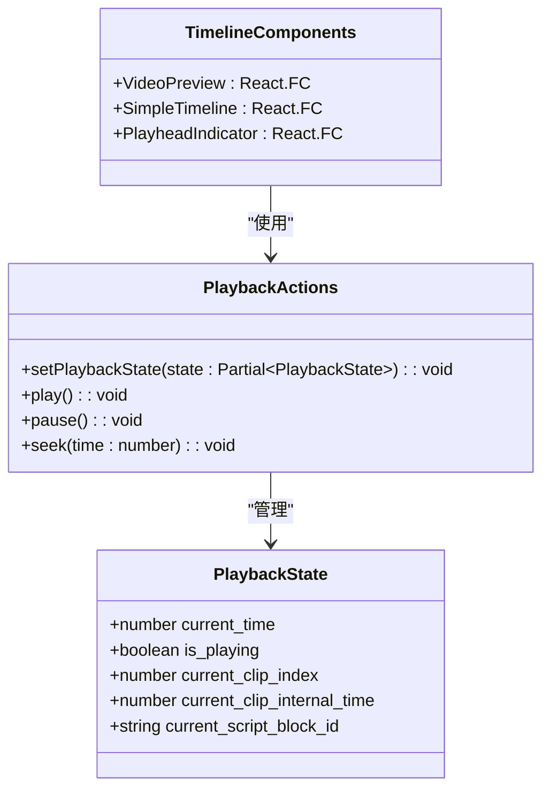
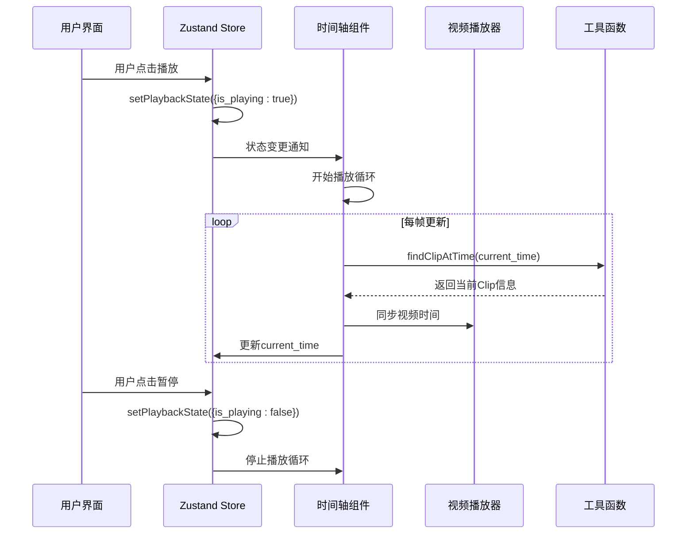
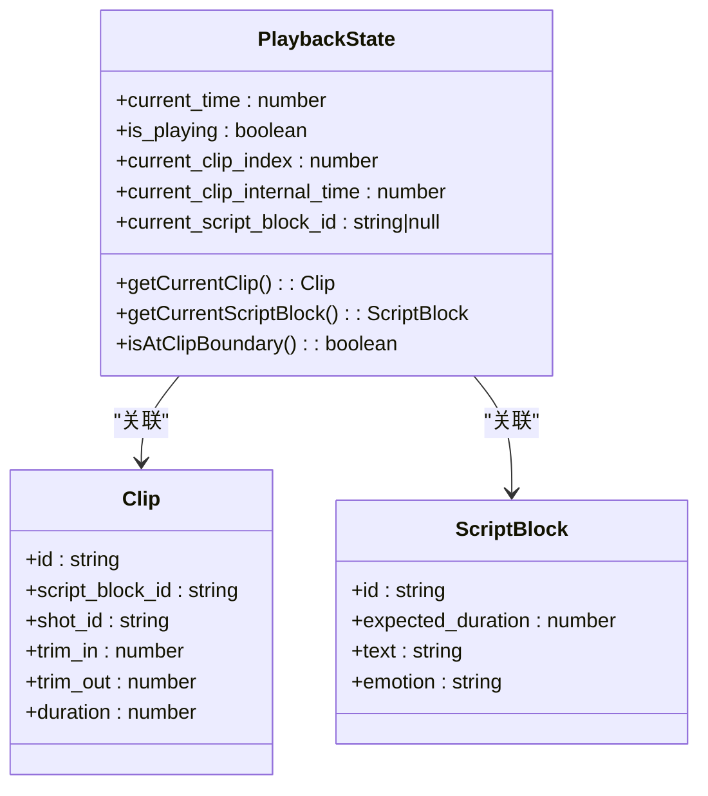
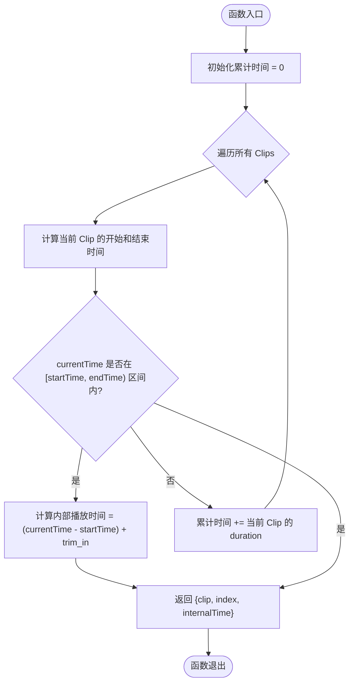
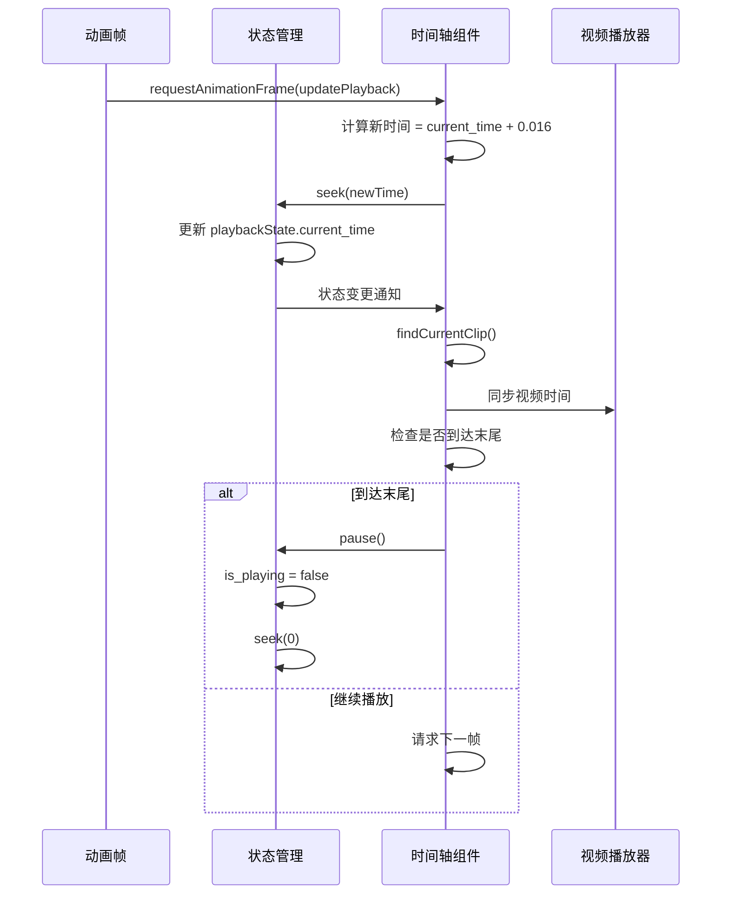
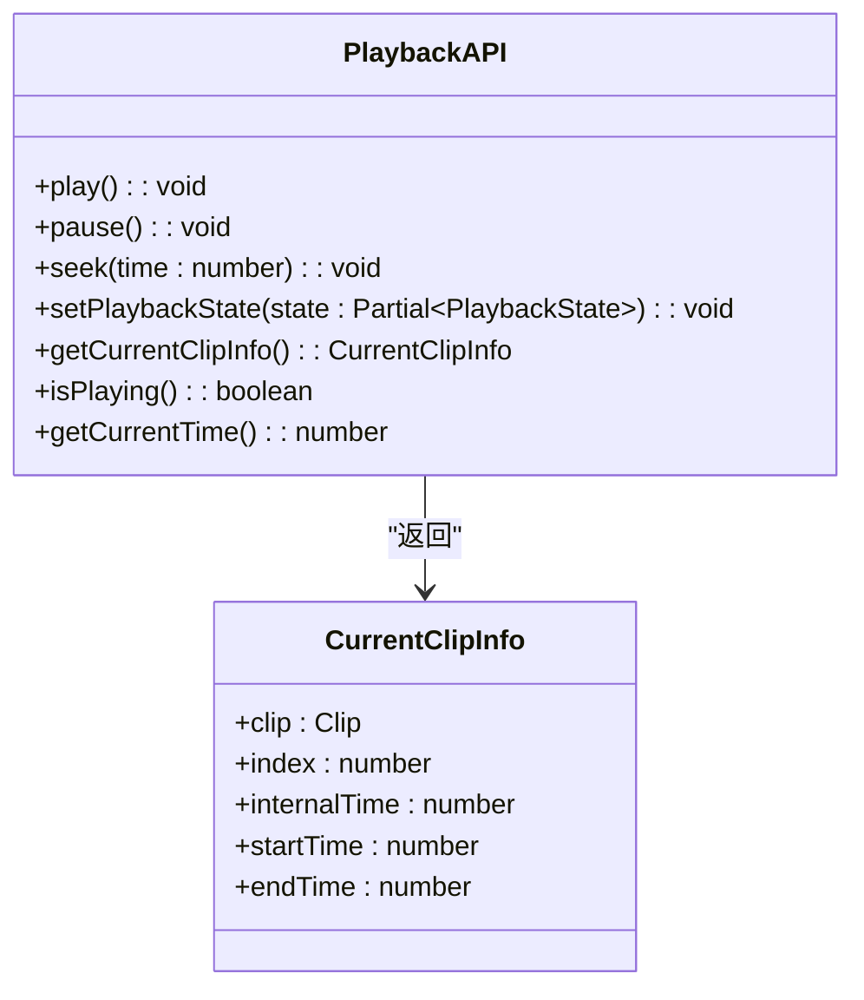
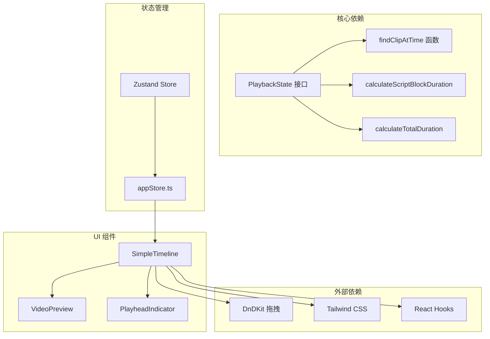

# 播放状态数据模型

<cite>
**本文档引用的文件**
- [DataModel.ts](file://src/types/DataModel.ts)
- [appStore.ts](file://src/store/appStore.ts)
- [SimpleTimeline.tsx](file://src/components/SimpleTimeline.tsx)
- [README.md](file://README.md)
</cite>

## 目录
1. [简介](#简介)
2. [项目结构](#项目结构)
3. [核心组件](#核心组件)
4. [架构概览](#架构概览)
5. [详细组件分析](#详细组件分析)
6. [依赖关系分析](#依赖关系分析)
7. [性能考虑](#性能考虑)
8. [故障排除指南](#故障排除指南)
9. [结论](#结论)

## 简介

本文档详细介绍了 CGCUT 项目中的播放状态数据模型，重点说明 PlaybackState 接口的完整结构和播放控制系统的工作原理。CGCUT 是一个专业的导演分镜验证工具，允许用户在分镜阶段快速验证剧本段落与镜头组合的实际节奏。

该系统的核心是基于时间轴的播放控制机制，通过精确的时间同步确保视频播放与时间轴编辑的协调一致。播放状态数据模型提供了完整的播放控制能力，包括播放、暂停、跳转等功能，并实现了智能的时间定位算法。

## 项目结构

CGCUT 项目采用模块化的架构设计，主要由以下核心部分组成：

**图表来源**
- [DataModel.ts](file://src/types/DataModel.ts#L1-L291)
- [appStore.ts](file://src/store/appStore.ts#L1-L195)

**章节来源**
- [README.md](file://README.md#L126-L150)

## 核心组件

### PlaybackState 接口定义

PlaybackState 是播放状态数据模型的核心接口，定义了播放控制所需的所有关键属性：

| 字段名 | 类型 | 描述 | 默认值 |
|--------|------|------|--------|
| current_time | number | 当前播放时间（秒，相对于时间轴起点） | 0 |
| is_playing | boolean | 播放/暂停状态 | false |
| current_clip_index | number | 当前播放的 Clip 索引 | -1 |
| current_clip_internal_time | number | 当前 Clip 内部播放时间（考虑 trim_in） | 0 |
| current_script_block_id | string \| null | 当前对应的 ScriptBlock ID | null |

### 播放控制 API

系统提供了完整的播放控制接口，通过 Zustand 状态管理实现：

**图表来源**
- [DataModel.ts](file://src/types/DataModel.ts#L187-L193)
- [appStore.ts](file://src/store/appStore.ts#L42-L46)

**章节来源**
- [DataModel.ts](file://src/types/DataModel.ts#L187-L193)
- [appStore.ts](file://src/store/appStore.ts#L42-L46)

## 架构概览

播放系统的整体架构采用分层设计，确保了清晰的职责分离和良好的可维护性：

**图表来源**
- [appStore.ts](file://src/store/appStore.ts#L119-L129)
- [SimpleTimeline.tsx](file://src/components/SimpleTimeline.tsx#L68-L92)
- [DataModel.ts](file://src/types/DataModel.ts#L217-L237)

## 详细组件分析

### 播放状态数据模型

PlaybackState 接口的设计体现了时间轴播放的核心需求：

**图表来源**
- [DataModel.ts](file://src/types/DataModel.ts#L187-L193)
- [DataModel.ts](file://src/types/DataModel.ts#L141-L148)
- [DataModel.ts](file://src/types/DataModel.ts#L101-L109)

### findClipAtTime 函数实现

findClipAtTime 是播放系统的核心算法，负责根据当前播放时间精确定位到对应的 Clip 实例：

**图表来源**
- [DataModel.ts](file://src/types/DataModel.ts#L217-L237)

算法的关键特性：
- **时间复杂度**: O(n)，其中 n 是 Clip 数量
- **空间复杂度**: O(1)，只使用常量额外空间
- **精度保证**: 使用精确的时间边界比较，避免浮点数误差
- **边界处理**: 正确处理时间轴边界情况

**章节来源**
- [DataModel.ts](file://src/types/DataModel.ts#L217-L237)

### 播放循环实现

播放系统通过 requestAnimationFrame 实现平滑的播放体验：

**图表来源**
- [SimpleTimeline.tsx](file://src/components/SimpleTimeline.tsx#L68-L92)

**章节来源**
- [SimpleTimeline.tsx](file://src/components/SimpleTimeline.tsx#L68-L92)

### 时间同步机制

系统实现了精确的时间同步机制，确保视频播放与播放状态保持一致：

| 同步点 | 同步方式 | 精度 | 处理逻辑 |
|--------|----------|------|----------|
| 播放状态变化 | useEffect 监听 | 每帧 | 检查时间差并进行同步 |
| 视频播放控制 | 自动播放/暂停 | 精确 | 根据 is_playing 状态控制 |
| 时间轴显示 | 格式化显示 | 秒级 | 使用 formatTime 函数格式化 |
| 进度条更新 | 百分比计算 | 浮点精度 | totalDuration > 0 时计算百分比 |

**章节来源**
- [SimpleTimeline.tsx](file://src/components/SimpleTimeline.tsx#L95-L109)

### 播放控制 API 详解

系统提供了完整的播放控制接口，支持多种播放场景：

**图表来源**
- [appStore.ts](file://src/store/appStore.ts#L43-L46)
- [SimpleTimeline.tsx](file://src/components/SimpleTimeline.tsx#L47-L62)

**章节来源**
- [appStore.ts](file://src/store/appStore.ts#L43-L46)

## 依赖关系分析

播放状态数据模型与其他组件的依赖关系如下：

**图表来源**
- [DataModel.ts](file://src/types/DataModel.ts#L187-L237)
- [appStore.ts](file://src/store/appStore.ts#L1-L58)
- [SimpleTimeline.tsx](file://src/components/SimpleTimeline.tsx#L1-L20)

**章节来源**
- [DataModel.ts](file://src/types/DataModel.ts#L187-L237)
- [appStore.ts](file://src/store/appStore.ts#L1-L58)

## 性能考虑

### 时间复杂度优化

1. **播放循环**: O(1) 每帧操作，使用 requestAnimationFrame 确保 60fps
2. **时间定位**: O(n) 线性搜索，对于典型的时间轴长度足够高效
3. **状态更新**: O(1) 状态变更，使用 Zustand 的高效状态管理

### 内存使用优化

- **状态最小化**: 只存储必要的播放状态信息
- **函数复用**: 复用计算函数避免重复计算
- **事件监听**: 合理的 useEffect 清理，防止内存泄漏

### 用户体验优化

- **平滑动画**: 使用 requestAnimationFrame 实现流畅的播放体验
- **精确同步**: 0.1秒阈值确保视频播放与 UI 同步
- **即时反馈**: 播放状态变化立即反映在 UI 上

## 故障排除指南

### 常见问题及解决方案

| 问题类型 | 症状 | 可能原因 | 解决方案 |
|----------|------|----------|----------|
| 播放卡顿 | 播放不流畅 | requestAnimationFrame 未正确清理 | 检查 useEffect 返回的清理函数 |
| 时间不同步 | 视频与时间轴不同步 | 时间差超过 0.1 秒阈值 | 调整同步逻辑或增加阈值 |
| 无法定位到 Clip | findClipAtTime 返回 null | 时间超出范围或数组为空 | 检查输入参数和数组有效性 |
| 播放停止 | 自动播放循环中断 | is_playing 状态异常 | 检查播放状态管理和事件处理 |

### 调试技巧

1. **状态监控**: 使用浏览器开发者工具监控 playbackState 的变化
2. **日志输出**: 在关键位置添加 console.log 输出调试信息
3. **边界测试**: 测试时间轴边界情况（开始、结束、中间）
4. **性能分析**: 使用性能面板分析播放循环的性能

**章节来源**
- [SimpleTimeline.tsx](file://src/components/SimpleTimeline.tsx#L86-L90)

## 结论

CGCUT 项目的播放状态数据模型设计精良，实现了以下关键目标：

1. **完整性**: PlaybackState 接口涵盖了播放控制的所有必要属性
2. **精确性**: findClipAtTime 算法确保了时间定位的准确性
3. **效率性**: 优化的播放循环和状态管理确保了良好的性能表现
4. **可维护性**: 清晰的架构设计和模块化组织便于后续扩展

该数据模型为导演分镜验证工具提供了坚实的技术基础，能够有效支持剧本节奏验证、镜头情绪匹配和快速迭代等核心功能。通过精确的时间同步机制和直观的播放控制接口，用户可以高效地完成分镜阶段的验证工作。

未来可以在以下方面进一步优化：
- 实现更高效的 Clip 定位算法（如二分查找）
- 添加播放历史记录功能
- 增强错误处理和恢复机制
- 优化移动端的播放体验