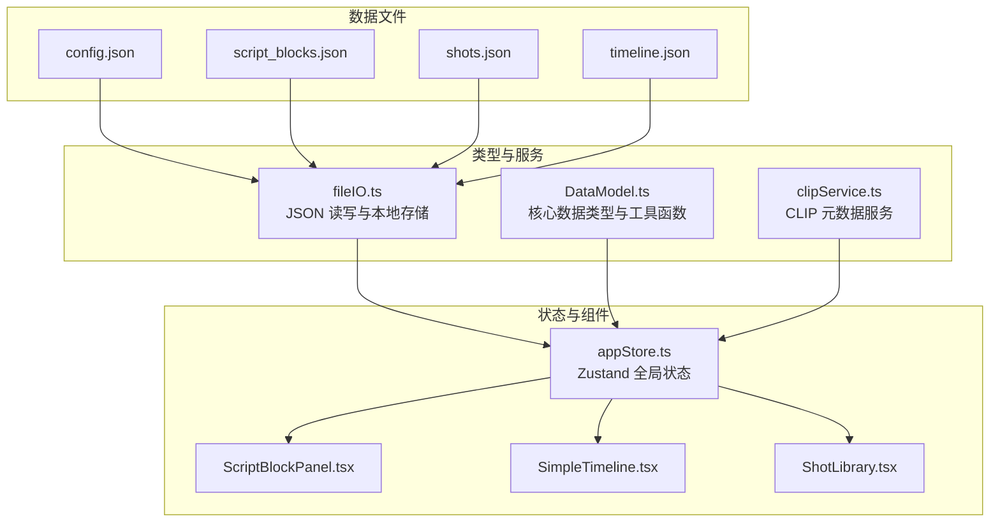
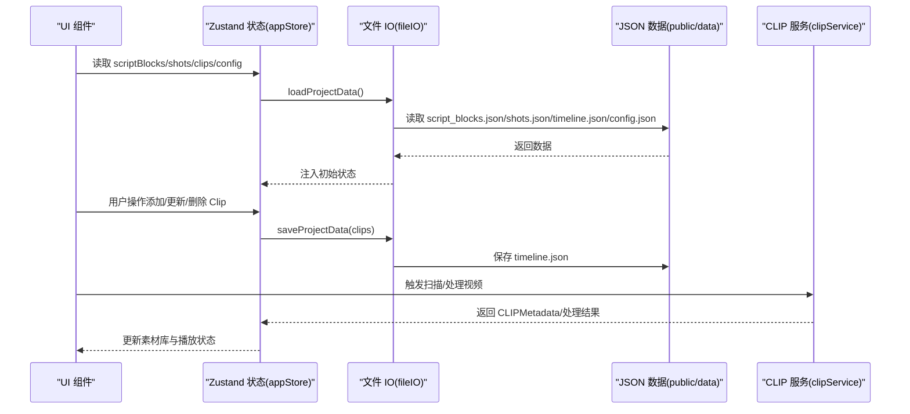
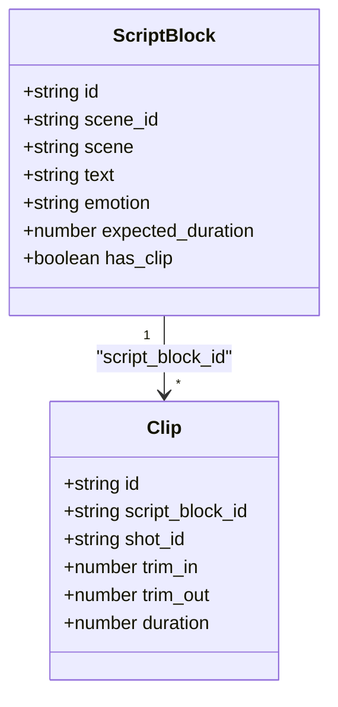
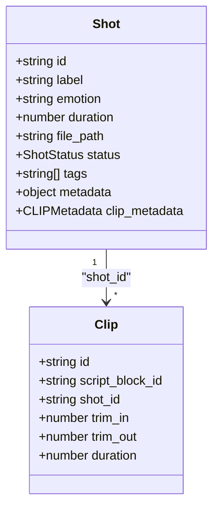
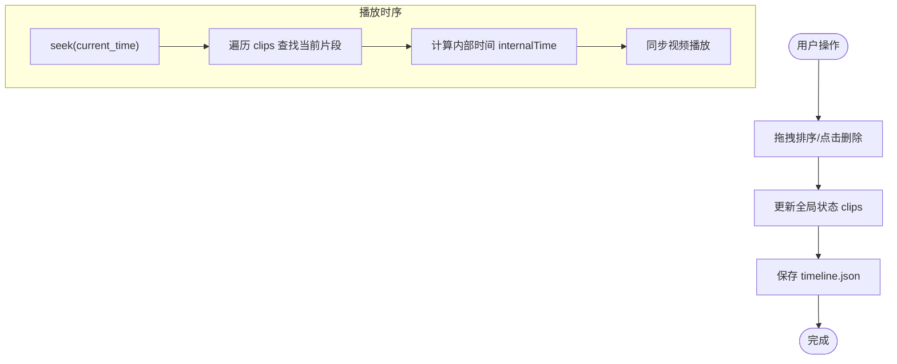
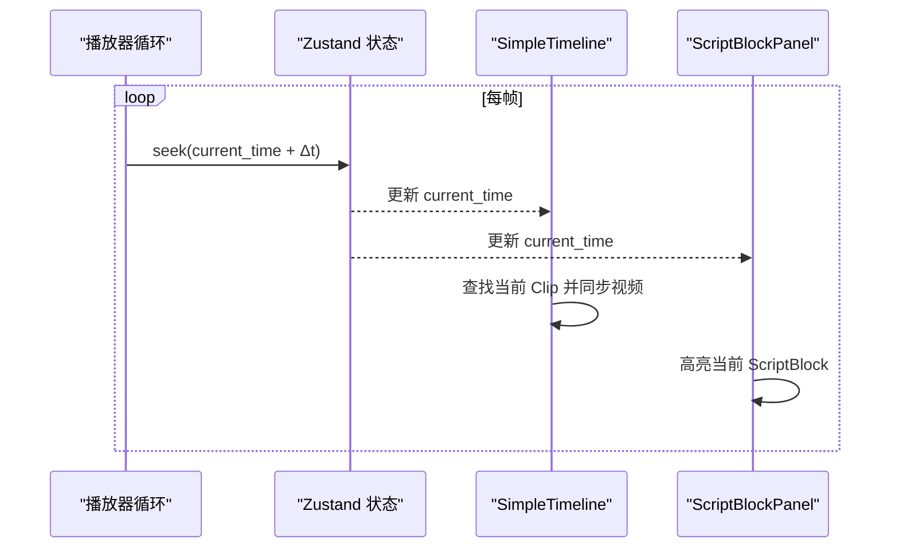
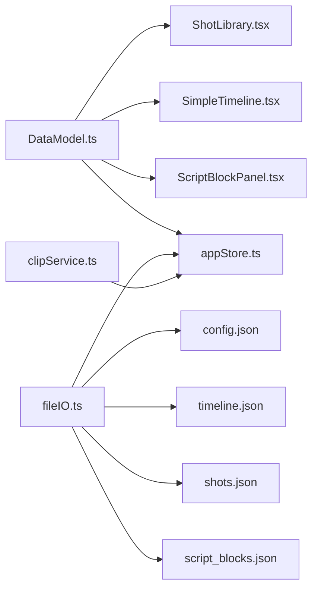

# 数据模型

<cite>
**本文引用的文件**
- [DataModel.ts](file://src/types/DataModel.ts)
- [appStore.ts](file://src/store/appStore.ts)
- [clipService.ts](file://src/services/clipService.ts)
- [fileIO.ts](file://src/utils/fileIO.ts)
- [ScriptBlockPanel.tsx](file://src/components/ScriptBlockPanel.tsx)
- [SimpleTimeline.tsx](file://src/components/SimpleTimeline.tsx)
- [ShotLibrary.tsx](file://src/components/ShotLibrary.tsx)
- [config.json](file://public/data/config.json)
- [script_blocks.json](file://public/data/script_blocks.json)
- [shots.json](file://public/data/shots.json)
- [timeline.json](file://public/data/timeline.json)
- [README.md](file://README.md)
</cite>

## 目录
1. [简介](#简介)
2. [项目结构](#项目结构)
3. [核心数据类型](#核心数据类型)
4. [架构概览](#架构概览)
5. [详细组件分析](#详细组件分析)
6. [依赖关系分析](#依赖关系分析)
7. [性能考量](#性能考量)
8. [故障排查指南](#故障排查指南)
9. [结论](#结论)
10. [附录](#附录)

## 简介
本文件系统性梳理 CGCUT 项目的数据模型与使用方式，重点覆盖四种核心数据类型：ScriptBlock（剧本段落）、Shot（素材镜头）、Clip（时间轴实例）与 PlaybackState（播放状态）。文档解释各类型的字段定义、数据类型与业务含义，描述它们之间的关系与引用方式；同时给出 JSON 数据文件结构、配置项说明、使用示例、数据验证规则以及生命周期与持久化策略。

## 项目结构
CGCUT 采用前端单页应用架构，数据模型集中定义在类型文件中，全局状态通过轻量状态库进行管理，UI 组件围绕数据模型进行渲染与交互。数据文件位于 public/data 目录，通过工具模块进行加载与保存。

图表来源
- [DataModel.ts](file://src/types/DataModel.ts#L1-L291)
- [fileIO.ts](file://src/utils/fileIO.ts#L1-L95)
- [clipService.ts](file://src/services/clipService.ts#L1-L394)
- [appStore.ts](file://src/store/appStore.ts#L1-L195)
- [ScriptBlockPanel.tsx](file://src/components/ScriptBlockPanel.tsx#L1-L285)
- [SimpleTimeline.tsx](file://src/components/SimpleTimeline.tsx#L1-L414)
- [ShotLibrary.tsx](file://src/components/ShotLibrary.tsx#L1-L359)

章节来源
- [README.md](file://README.md#L126-L150)

## 核心数据类型
本节逐一说明四种核心数据类型，包括字段定义、数据类型与业务含义，并指出它们之间的引用关系。

- ScriptBlock（剧本段落）
  - 字段与类型
    - id: string（唯一标识）
    - scene_id: string（所属场景 ID，用于场景分组）
    - scene: string（场景标识，如“INT. 卧室 - 夜晚”）
    - text: string（段落文本或描述）
    - emotion: string（情绪标签，如“紧张”、“焦虑”）
    - expected_duration: number（导演预期时长，单位秒）
    - has_clip?: boolean（是否已有对应的 Clip）
  - 业务含义
    - 表示剧本中的一个叙事单元，承载场景、台词、情绪与预期时长，驱动时间轴节奏校验。
  - 引用关系
    - 由 LLM 分析生成，或作为占位符参与时间轴构建。
    - 与 Clip 通过 script_block_id 建立一对多关系（一个 ScriptBlock 可对应多个 Clip）。

- Shot（素材镜头）
  - 字段与类型
    - id: string（唯一标识）
    - label: string（镜头描述，如“特写-手部”）
    - emotion: string（情绪标签，用于筛选）
    - duration: number（镜头时长，单位秒）
    - file_path: string（视频文件路径，后端引用路径）
    - status: ShotStatus（处理状态：pending/processing/ready/error）
    - tags?: string[]（标签列表）
    - metadata?: 对象（分辨率、帧率、编码格式、文件大小等）
    - clip_metadata?: CLIPMetadata（CLIP 提取的特征向量、标签、描述、情绪、关键帧、处理时间、模型版本等）
  - 业务含义
    - 表示可用的素材镜头，支持按情绪筛选与状态管理。
  - 引用关系
    - 与 Clip 通过 shot_id 建立一对一或多对一关系（一个 Shot 可被多个 Clip 复用）。

- Clip（时间轴实例）
  - 字段与类型
    - id: string（唯一标识）
    - script_block_id: string（所属 ScriptBlock ID）
    - shot_id: string（绑定的 Shot ID）
    - trim_in: number（裁剪起始点，相对 Shot 原始时长，单位秒）
    - trim_out: number（裁剪结束点，相对 Shot 原始时长，单位秒）
    - duration: number（裁剪后的实际时长，trim_out - trim_in）
  - 业务含义
    - 表示时间轴上的一个镜头实例，支持顺序调整、删除与裁剪。
  - 引用关系
    - 由 ScriptBlock 与 Shot 组合生成，是时间轴编辑的核心对象。

- PlaybackState（播放状态）
  - 字段与类型
    - current_time: number（当前播放时间，相对时间轴起点，单位秒）
    - is_playing: boolean（播放/暂停状态）
    - current_clip_index: number（当前播放的 Clip 索引）
    - current_clip_internal_time: number（当前 Clip 内部播放时间，考虑 trim_in）
    - current_script_block_id: string | null（当前对应的 ScriptBlock ID）
  - 业务含义
    - 描述播放器的实时状态，驱动 UI 高亮与视频同步播放。

章节来源
- [DataModel.ts](file://src/types/DataModel.ts#L86-L193)

## 架构概览
数据流自下而上：JSON 数据文件经文件 IO 模块加载，注入全局状态；组件订阅状态并渲染；用户操作触发状态变更，再通过文件 IO 持久化到 timeline.json。CLIP 服务负责视频内容分析与元数据提取，供素材库展示与筛选使用。

图表来源
- [fileIO.ts](file://src/utils/fileIO.ts#L54-L80)
- [appStore.ts](file://src/store/appStore.ts#L60-L195)
- [clipService.ts](file://src/services/clipService.ts#L36-L165)

## 详细组件分析

### ScriptBlock 类型与使用
- 字段与业务
  - scene_id 与 scene 用于场景分组与渲染；text 与 emotion 用于 UI 展示与筛选；expected_duration 用于时长校验。
- 与 UI 的交互
  - ScriptBlockPanel 根据播放状态高亮当前段落，计算实际时长并与期望时长比较，提供“占位”按钮为段落创建 Clip。
- 与 Clip 的关系
  - 通过 script_block_id 关联，一个 ScriptBlock 可对应多个 Clip（拼接/重复使用）。

图表来源
- [DataModel.ts](file://src/types/DataModel.ts#L86-L148)
- [ScriptBlockPanel.tsx](file://src/components/ScriptBlockPanel.tsx#L72-L106)

章节来源
- [ScriptBlockPanel.tsx](file://src/components/ScriptBlockPanel.tsx#L38-L106)
- [DataModel.ts](file://src/types/DataModel.ts#L86-L109)

### Shot 类型与使用
- 字段与业务
  - label、emotion、duration 用于素材库展示与筛选；file_path 用于视频播放；status 用于处理进度可视化；clip_metadata 用于智能标签与情绪识别。
- 与 UI 的交互
  - ShotLibrary 支持按情绪与状态筛选、标记为已处理、编辑标签与情绪、删除素材；点击素材可替换当前选中的 Clip。
- 与 Clip 的关系
  - 通过 shot_id 关联，一个 Shot 可被多个 Clip 复用。

图表来源
- [DataModel.ts](file://src/types/DataModel.ts#L116-L135)
- [ShotLibrary.tsx](file://src/components/ShotLibrary.tsx#L42-L53)

章节来源
- [ShotLibrary.tsx](file://src/components/ShotLibrary.tsx#L36-L103)
- [DataModel.ts](file://src/types/DataModel.ts#L116-L135)

### Clip 类型与使用
- 字段与业务
  - trim_in/trim_out/duration 控制裁剪；script_block_id/shot_id 建立与 ScriptBlock 和 Shot 的关联。
- 与 UI 的交互
  - SimpleTimeline 支持拖拽排序、点击时间轴跳转、删除 Clip；播放时根据 current_time 查找当前 Clip 并同步视频播放。
- 工具函数
  - createClip、updateClipTrim、replaceClipShot 提供 Clip 的创建、裁剪更新与替换 Shot 的能力。

图表来源
- [SimpleTimeline.tsx](file://src/components/SimpleTimeline.tsx#L343-L367)
- [appStore.ts](file://src/store/appStore.ts#L114-L129)

章节来源
- [SimpleTimeline.tsx](file://src/components/SimpleTimeline.tsx#L331-L414)
- [DataModel.ts](file://src/types/DataModel.ts#L137-L148)
- [DataModel.ts](file://src/types/DataModel.ts#L242-L290)

### PlaybackState 类型与使用
- 字段与业务
  - current_time/is_playing/current_clip_index/current_clip_internal_time/current_script_block_id 共同描述播放器状态。
- 与 UI 的交互
  - SimpleTimeline 的播放控制与视频预览依赖该状态；ScriptBlockPanel 根据播放状态高亮当前段落。
- 工具函数
  - findClipAtTime 根据时间查找 Clip；calculateTotalDuration/calculateScriptBlockDuration 用于时长统计。

图表来源
- [SimpleTimeline.tsx](file://src/components/SimpleTimeline.tsx#L67-L109)
- [ScriptBlockPanel.tsx](file://src/components/ScriptBlockPanel.tsx#L38-L49)
- [DataModel.ts](file://src/types/DataModel.ts#L214-L237)

章节来源
- [DataModel.ts](file://src/types/DataModel.ts#L184-L193)
- [SimpleTimeline.tsx](file://src/components/SimpleTimeline.tsx#L14-L20)
- [ScriptBlockPanel.tsx](file://src/components/ScriptBlockPanel.tsx#L38-L51)

## 依赖关系分析
- 类型定义集中在 DataModel.ts，提供接口与工具函数，被 store、components、services 共同依赖。
- appStore.ts 作为全局状态中心，聚合 ScriptBlock、ScriptScene、Shot、Clip、PlaybackState、MediaLibraryConfig 等状态，并提供计算与检查函数。
- fileIO.ts 负责从 public/data 目录加载 JSON 数据，使用 localStorage 模拟保存，后续可接入 Electron API 实现真实文件写入。
- clipService.ts 提供 CLIP 元数据服务，支持扫描与处理目录中的视频文件，返回 CLIPMetadata 以增强素材库的智能筛选能力。

图表来源
- [DataModel.ts](file://src/types/DataModel.ts#L1-L291)
- [appStore.ts](file://src/store/appStore.ts#L1-L195)
- [fileIO.ts](file://src/utils/fileIO.ts#L1-L95)
- [clipService.ts](file://src/services/clipService.ts#L1-L394)

章节来源
- [appStore.ts](file://src/store/appStore.ts#L1-L58)
- [fileIO.ts](file://src/utils/fileIO.ts#L54-L80)

## 性能考量
- 时间复杂度
  - 计算 ScriptBlock 实际时长：O(n)，n 为 Clip 数量。
  - 计算时间轴总时长：O(n)。
  - 播放时查找当前 Clip：O(n)。
- 优化建议
  - 对 Clips 建立索引（如按 script_block_id 分组），减少重复遍历。
  - 播放循环使用 requestAnimationFrame 控制帧率，避免高频重渲染。
  - 在素材库中对 Shot 按情绪与状态建立过滤索引，提升筛选性能。

[本节为通用性能讨论，无需列出具体文件来源]

## 故障排查指南
- 数据加载失败
  - 检查 public/data 下的 JSON 文件是否存在且格式正确。
  - 确认 fileIO.loadJSON 的网络请求是否成功。
- 保存失败
  - 检查浏览器 localStorage 权限与容量限制。
  - 如需真实文件写入，后续可接入 Electron API。
- 播放异常
  - 确认当前 Clip 的 trim_in/trim_out 与 Shot.duration 合法。
  - 检查视频文件路径 file_path 是否有效。
- CLIP 元数据缺失
  - 确认 clipService 的扫描与处理流程是否正常执行。
  - 若为模拟模式，注意其随机失败率与元数据提取概率。

章节来源
- [fileIO.ts](file://src/utils/fileIO.ts#L7-L18)
- [clipService.ts](file://src/services/clipService.ts#L36-L102)
- [SimpleTimeline.tsx](file://src/components/SimpleTimeline.tsx#L94-L109)

## 结论
CGCUT 的数据模型围绕 ScriptBlock、Shot、Clip 与 PlaybackState 四大核心类型构建，通过全局状态与文件 IO 实现数据的加载、编辑与持久化。类型定义清晰、职责明确，配合 UI 组件实现了导演分镜验证的关键流程。未来可在索引优化、真实文件写入与 CLIP 服务集成方面进一步完善。

[本节为总结性内容，无需列出具体文件来源]

## 附录

### JSON 数据文件结构与配置
- config.json
  - 字段
    - media_server_base_url: string（服务器素材根路径）
    - local_cache_path?: string（本地缓存目录）
    - preview_quality?: "low"|"medium"|"high"（预览视频质量）
  - 用途
    - 配置素材服务器地址与预览质量，供 UI 与服务使用。

- script_blocks.json
  - 字段
    - id: string
    - scene: string
    - text: string
    - emotion: string
    - expected_duration: number
  - 用途
    - 存储 LLM 分析后的剧本段落列表。

- shots.json
  - 字段
    - id: string
    - label: string
    - emotion: string
    - duration: number
    - file_path: string
    - status: ShotStatus
  - 用途
    - 存储可用素材镜头清单。

- timeline.json
  - 字段
    - id: string
    - script_block_id: string
    - shot_id: string
    - trim_in: number
    - trim_out: number
    - duration: number
  - 用途
    - 存储当前时间轴状态，随用户编辑实时更新。

章节来源
- [config.json](file://public/data/config.json#L1-L6)
- [script_blocks.json](file://public/data/script_blocks.json#L1-L38)
- [shots.json](file://public/data/shots.json#L1-L83)
- [timeline.json](file://public/data/timeline.json#L1-L59)

### 数据验证规则
- Clip 裁剪参数
  - trim_in ≥ 0
  - trim_out ≥ trim_in + 0.1
  - duration = trim_out - trim_in
- 时间轴一致性
  - 播放时间 current_time ∈ [0, totalDuration)
  - current_clip_index 指向当前 Clip
- 状态约束
  - Shot.status 仅允许枚举值
  - PlaybackState 字段类型与取值范围需与定义一致

章节来源
- [DataModel.ts](file://src/types/DataModel.ts#L258-L274)
- [DataModel.ts](file://src/types/DataModel.ts#L184-L193)

### 生命周期与持久化策略
- 加载
  - 通过 fileIO.loadProjectData 并行加载 script_blocks.json、shots.json、timeline.json、config.json。
- 编辑
  - 用户在 UI 中进行拖拽、裁剪、替换等操作，状态在 appStore 中更新。
- 保存
  - 通过 fileIO.saveProjectData 将 clips 持久化到 timeline.json；MVP 阶段使用 localStorage 模拟文件保存。
- 后续扩展
  - 可接入 Electron API 实现真实文件写入；CLIP 服务可对接真实 API，实现批量扫描与元数据提取。

章节来源
- [fileIO.ts](file://src/utils/fileIO.ts#L54-L80)
- [appStore.ts](file://src/store/appStore.ts#L60-L195)
- [clipService.ts](file://src/services/clipService.ts#L36-L165)