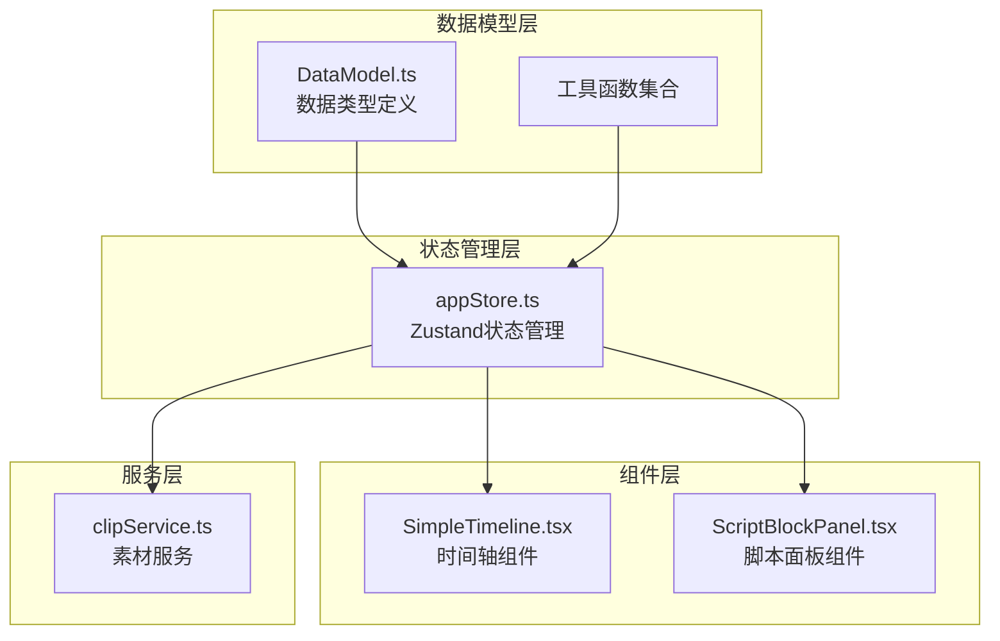
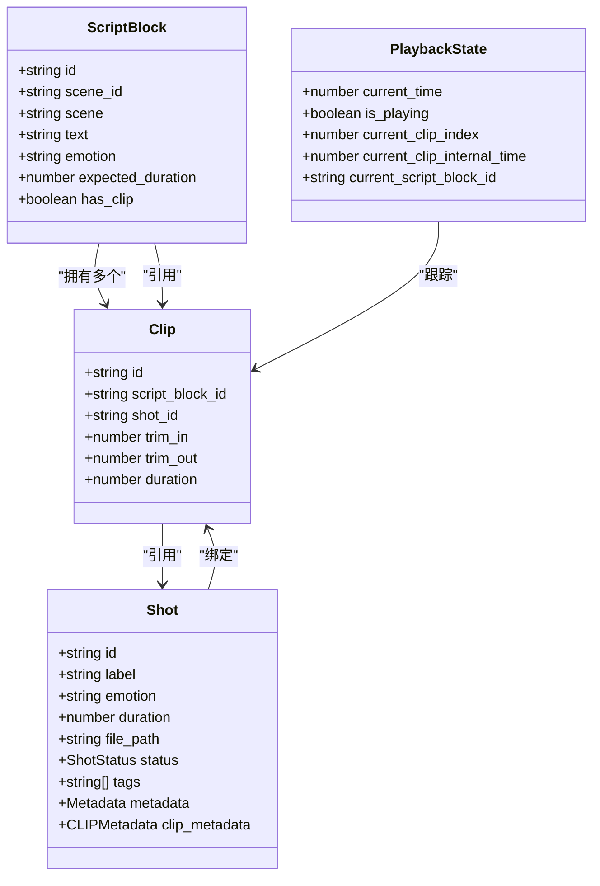
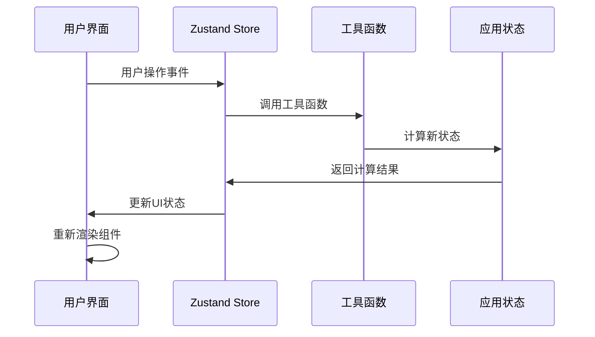
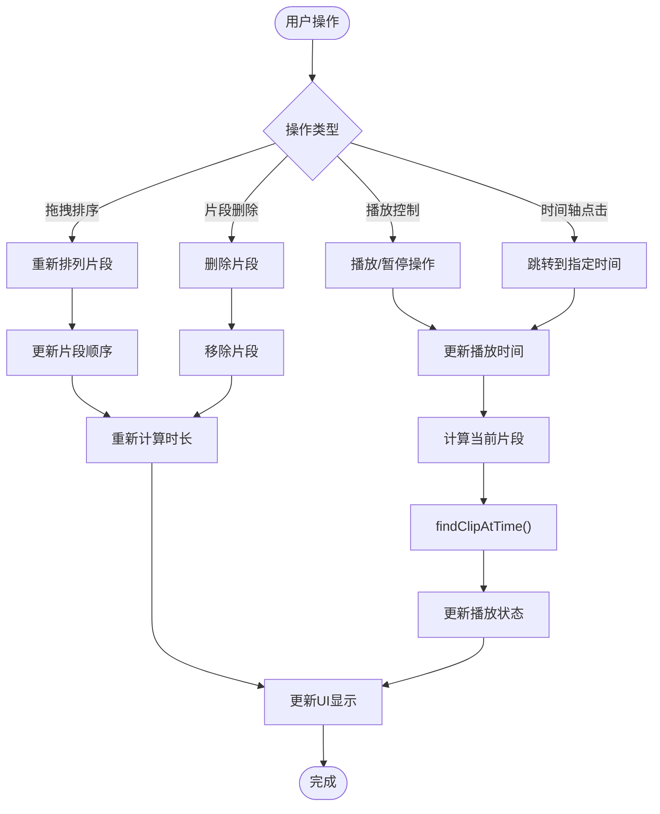
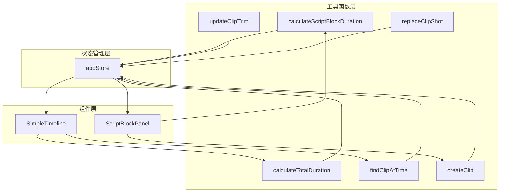
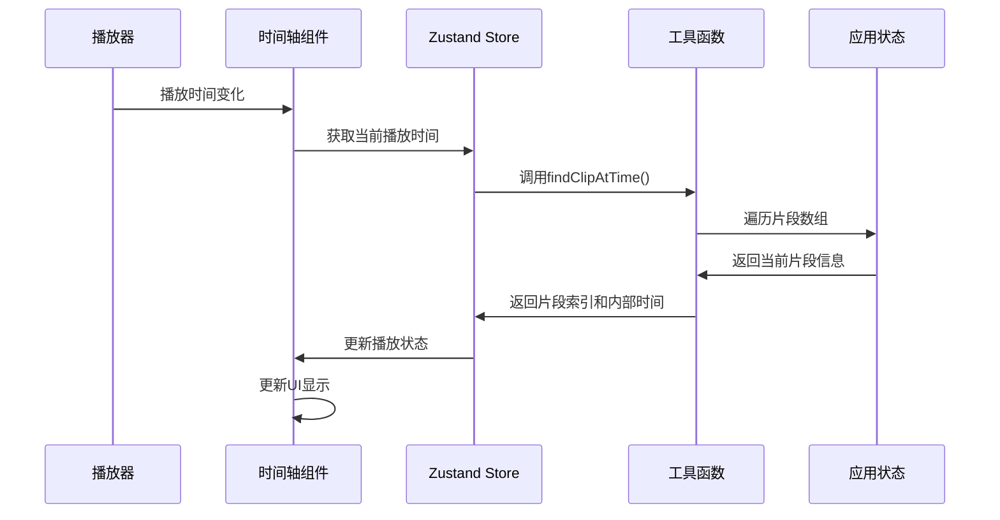
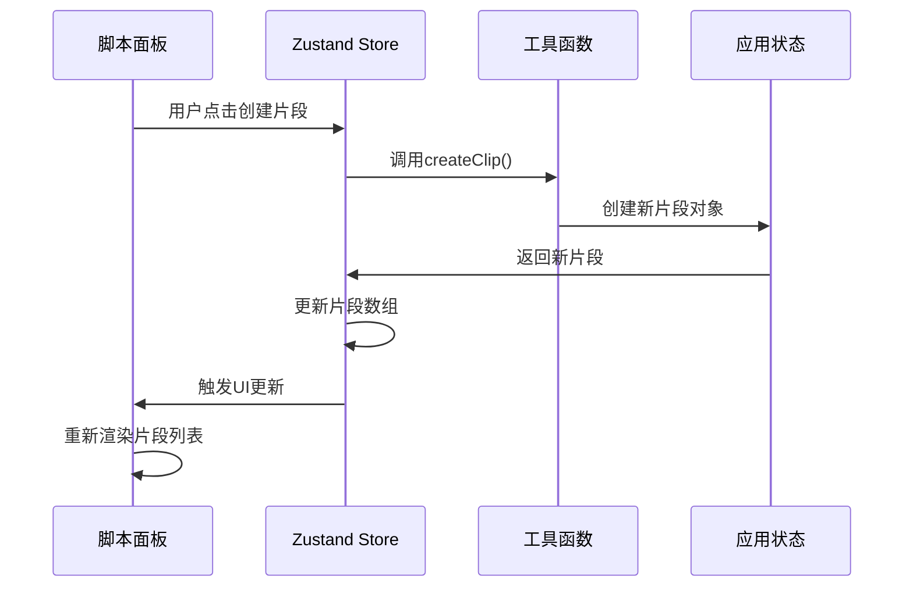

# 数据模型工具函数

<cite>
**本文档引用的文件**
- [DataModel.ts](file://src/types/DataModel.ts)
- [appStore.ts](file://src/store/appStore.ts)
- [SimpleTimeline.tsx](file://src/components/SimpleTimeline.tsx)
- [ScriptBlockPanel.tsx](file://src/components/ScriptBlockPanel.tsx)
- [clipService.ts](file://src/services/clipService.ts)
</cite>

## 目录
1. [简介](#简介)
2. [项目结构](#项目结构)
3. [核心组件](#核心组件)
4. [架构概览](#架构概览)
5. [详细组件分析](#详细组件分析)
6. [依赖分析](#依赖分析)
7. [性能考虑](#性能考虑)
8. [故障排除指南](#故障排除指南)
9. [结论](#结论)

## 简介

本文档详细介绍了CGCUT项目中的数据模型工具函数，重点分析了以下五个核心函数：calculateScriptBlockDuration、calculateTotalDuration、findClipAtTime、createClip、updateClipTrim和replaceClipShot。这些函数构成了时间轴编辑系统的核心数据处理能力，负责时长计算、时间轴查询和数据更新等关键功能。

这些工具函数采用纯函数设计，确保了数据的一致性和可预测性，同时通过与Zustand状态管理系统的集成，实现了高效的UI响应和状态同步。

## 项目结构

CGCUT项目采用模块化的架构设计，主要包含以下核心模块：



**图表来源**
- [DataModel.ts](file://src/types/DataModel.ts#L1-L291)
- [appStore.ts](file://src/store/appStore.ts#L1-L195)
- [SimpleTimeline.tsx](file://src/components/SimpleTimeline.tsx#L1-L414)
- [ScriptBlockPanel.tsx](file://src/components/ScriptBlockPanel.tsx#L1-L200)
- [clipService.ts](file://src/services/clipService.ts#L1-L394)

**章节来源**
- [DataModel.ts](file://src/types/DataModel.ts#L1-L291)
- [appStore.ts](file://src/store/appStore.ts#L1-L195)

## 核心组件

### 数据模型基础

项目的数据模型围绕三个核心实体构建：ScriptBlock（剧本段落）、Shot（素材镜头）和Clip（时间轴实例）。这些实体通过明确的关系连接，形成了完整的影视剪辑工作流。



**图表来源**
- [DataModel.ts](file://src/types/DataModel.ts#L90-L148)
- [DataModel.ts](file://src/types/DataModel.ts#L187-L193)

### 工具函数分类

所有工具函数都位于DataModel.ts文件中，按照功能分为三大类：

1. **时长计算函数**：calculateScriptBlockDuration、calculateTotalDuration
2. **时间轴查询函数**：findClipAtTime
3. **数据操作函数**：createClip、updateClipTrim、replaceClipShot

**章节来源**
- [DataModel.ts](file://src/types/DataModel.ts#L195-L290)

## 架构概览

### 状态管理架构

项目采用Zustand作为状态管理解决方案，实现了全局状态的集中管理和高效更新：



**图表来源**
- [appStore.ts](file://src/store/appStore.ts#L60-L195)
- [DataModel.ts](file://src/types/DataModel.ts#L195-L290)

### 组件交互流程

时间轴组件与工具函数的交互体现了典型的React + Zustand架构模式：



**图表来源**
- [SimpleTimeline.tsx](file://src/components/SimpleTimeline.tsx#L68-L92)
- [SimpleTimeline.tsx](file://src/components/SimpleTimeline.tsx#L358-L367)

**章节来源**
- [appStore.ts](file://src/store/appStore.ts#L60-L195)
- [SimpleTimeline.tsx](file://src/components/SimpleTimeline.tsx#L1-L414)

## 详细组件分析

### calculateScriptBlockDuration 函数

#### 功能概述
calculateScriptBlockDuration函数专门用于计算特定剧本段落的实际时长。它通过过滤属于该段落的所有片段，并累加它们的持续时间来得出结果。

#### 参数说明
- **scriptBlockId**: string - 目标剧本段落的唯一标识符
- **clips**: Clip[] - 包含所有时间轴片段的数组

#### 返回值类型
- **number** - 以秒为单位的实际时长

#### 实现原理
函数采用函数式编程范式，使用filter和reduce方法：
1. 过滤出属于指定scriptBlockId的所有片段
2. 对过滤结果进行累加求和
3. 返回最终的时长总和

#### 复杂度分析
- **时间复杂度**: O(n)，其中n是片段总数
- **空间复杂度**: O(k)，其中k是匹配片段的数量

#### 使用示例
```typescript
// 获取段落1的实际时长
const actualDuration = calculateScriptBlockDuration("block_1", clips);
```

**章节来源**
- [DataModel.ts](file://src/types/DataModel.ts#L195-L205)

### calculateTotalDuration 函数

#### 功能概述
calculateTotalDuration函数计算整个时间轴的总时长。它是所有片段时长的简单累加。

#### 参数说明
- **clips**: Clip[] - 时间轴上所有片段的数组

#### 返回值类型
- **number** - 以秒为单位的总时长

#### 实现原理
使用reduce方法对所有片段的duration属性进行累加。

#### 复杂度分析
- **时间复杂度**: O(n)，线性时间复杂度
- **空间复杂度**: O(1)，常数空间复杂度

#### 使用示例
```typescript
// 计算时间轴总时长
const totalDuration = calculateTotalDuration(clips);
```

**章节来源**
- [DataModel.ts](file://src/types/DataModel.ts#L207-L212)

### findClipAtTime 函数

#### 功能概述
findClipAtTime函数根据给定的播放时间，在时间轴上查找对应的片段。这是实现播放器定位功能的核心函数。

#### 参数说明
- **currentTime**: number - 当前播放时间（秒）
- **clips**: Clip[] - 时间轴片段数组

#### 返回值类型
- **{ clip: Clip; index: number; internalTime: number } | null** - 包含片段信息的对象或null

#### 实现原理
函数采用线性扫描算法：
1. 维护累积时间变量
2. 逐个检查每个片段的时间范围
3. 当currentTime落在某个片段范围内时，计算片段内部时间
4. 返回包含片段、索引和内部时间的信息

#### 复杂度分析
- **时间复杂度**: O(n)，线性时间复杂度
- **空间复杂度**: O(1)，常数空间复杂度

#### 边界条件处理
- 处理currentTime小于0的情况
- 处理currentTime等于总时长的情况
- 处理空片段数组的情况

#### 使用示例
```typescript
// 查找播放时间对应的片段
const clipInfo = findClipAtTime(120.5, clips);
if (clipInfo) {
    const { clip, index, internalTime } = clipInfo;
    console.log(`找到片段 ${clip.id}，内部时间: ${internalTime}s`);
}
```

**章节来源**
- [DataModel.ts](file://src/types/DataModel.ts#L214-L237)

### createClip 函数

#### 功能概述
createClip函数用于创建新的时间轴片段实例。它基于剧本段落和素材镜头创建完整的Clip对象。

#### 参数说明
- **scriptBlockId**: string - 剧本段落ID
- **shot**: Shot - 素材镜头对象

#### 返回值类型
- **Clip** - 新创建的片段对象

#### 实现原理
函数创建具有以下特征的新片段：
- 自动生成唯一ID
- 绑定到指定的剧本段落
- 绑定到指定的素材镜头
- 设置初始裁剪参数（trim_in=0，trim_out=素材时长）
- 设置初始时长等于素材时长

#### 复杂度分析
- **时间复杂度**: O(1)，常数时间复杂度
- **空间复杂度**: O(1)，常数空间复杂度

#### 使用示例
```typescript
// 为段落创建新片段
const newClip = createClip("block_1", shot);
```

**章节来源**
- [DataModel.ts](file://src/types/DataModel.ts#L239-L254)

### updateClipTrim 函数

#### 功能概述
updateClipTrim函数用于更新片段的裁剪参数。它确保裁剪范围的有效性并计算新的时长。

#### 参数说明
- **clip**: Clip - 目标片段对象
- **trimIn**: number - 裁剪起始点（秒）
- **trimOut**: number - 裁剪结束点（秒）

#### 返回值类型
- **Clip** - 更新后的片段对象

#### 实现原理
函数执行以下验证和更新步骤：
1. 确保trimIn不小于0
2. 确保trimOut至少比trimIn大0.1秒
3. 计算新的duration = trimOut - trimIn
4. 返回包含更新参数的新片段对象

#### 错误处理策略
- 强制约束最小裁剪间隔（0.1秒）
- 防止负值裁剪
- 维护裁剪范围的逻辑一致性

#### 复杂度分析
- **时间复杂度**: O(1)，常数时间复杂度
- **空间复杂度**: O(1)，常数空间复杂度

#### 使用示例
```typescript
// 更新片段裁剪参数
const updatedClip = updateClipTrim(clip, 10.5, 25.3);
```

**章节来源**
- [DataModel.ts](file://src/types/DataModel.ts#L256-L274)

### replaceClipShot 函数

#### 功能概述
replaceClipShot函数用于将片段关联的素材镜头替换为新的镜头。这在素材库选择新镜头时非常有用。

#### 参数说明
- **clip**: Clip - 目标片段对象
- **newShot**: Shot - 新的素材镜头对象

#### 返回值类型
- **Clip** - 替换后的片段对象

#### 实现原理
函数执行以下替换操作：
1. 更新shot_id为新镜头ID
2. 重置trim_in为0
3. 设置trim_out为新镜头时长
4. 设置duration为新镜头时长
5. 返回更新后的片段对象

#### 复杂度分析
- **时间复杂度**: O(1)，常数时间复杂度
- **空间复杂度**: O(1)，常数空间复杂度

#### 使用示例
```typescript
// 替换片段的素材镜头
const replacedClip = replaceClipShot(clip, newShot);
```

**章节来源**
- [DataModel.ts](file://src/types/DataModel.ts#L276-L290)

## 依赖分析

### 函数间协作关系

这些工具函数之间存在清晰的依赖关系和协作模式：



**图表来源**
- [DataModel.ts](file://src/types/DataModel.ts#L195-L290)
- [appStore.ts](file://src/store/appStore.ts#L60-L195)
- [SimpleTimeline.tsx](file://src/components/SimpleTimeline.tsx#L1-L414)
- [ScriptBlockPanel.tsx](file://src/components/ScriptBlockPanel.tsx#L1-L200)

### 数据流转过程

#### 播放状态更新流程



**图表来源**
- [SimpleTimeline.tsx](file://src/components/SimpleTimeline.tsx#L46-L62)
- [DataModel.ts](file://src/types/DataModel.ts#L214-L237)

#### 片段创建流程



**图表来源**
- [ScriptBlockPanel.tsx](file://src/components/ScriptBlockPanel.tsx#L71-L106)
- [DataModel.ts](file://src/types/DataModel.ts#L239-L254)

**章节来源**
- [appStore.ts](file://src/store/appStore.ts#L60-L195)
- [SimpleTimeline.tsx](file://src/components/SimpleTimeline.tsx#L1-L414)
- [ScriptBlockPanel.tsx](file://src/components/ScriptBlockPanel.tsx#L1-L200)

## 性能考虑

### 时间复杂度优化

1. **线性扫描优化**
   - findClipAtTime采用O(n)线性扫描，对于大多数场景足够高效
   - 可考虑实现二分查找以优化大型时间轴的查询性能

2. **批量操作优化**
   - calculateScriptBlockDuration和calculateTotalDuration都是O(n)操作
   - 可考虑缓存机制避免重复计算

3. **内存使用优化**
   - 所有工具函数都是纯函数，不产生副作用
   - 返回新对象而非修改现有对象，便于状态管理

### 状态更新优化

1. **状态合并策略**
   - Zustand使用浅比较优化状态更新
   - 避免不必要的状态重建

2. **组件订阅优化**
   - 使用选择器模式只订阅必要状态
   - 减少组件重渲染次数

### 并发处理

1. **异步操作分离**
   - 素材处理通过clipService异步执行
   - 不阻塞主线程的UI更新

2. **批处理策略**
   - 支持批量片段操作
   - 减少状态更新频率

## 故障排除指南

### 常见问题及解决方案

#### 时间轴查询异常

**问题症状**：findClipAtTime返回null或错误的片段信息

**可能原因**：
1. currentTime超出时间轴范围
2. 片段数组为空
3. 片段时长计算错误

**解决步骤**：
1. 验证currentTime是否在[0, totalDuration]范围内
2. 检查clips数组是否为空
3. 确认所有片段的duration属性有效

#### 片段裁剪异常

**问题症状**：updateClipTrim抛出异常或返回无效的裁剪参数

**可能原因**：
1. trimIn大于trimOut
2. 裁剪间隔过小
3. 负值裁剪

**解决步骤**：
1. 确保trimIn ≤ trimOut
2. 验证裁剪间隔至少为0.1秒
3. 检查输入参数的有效性

#### 性能问题

**问题症状**：大型时间轴操作响应缓慢

**优化建议**：
1. 考虑实现片段索引缓存
2. 使用虚拟化技术处理大量片段
3. 实施节流机制限制频繁更新

### 错误处理策略

#### 输入验证
- 所有函数都包含基本的输入验证
- 对边界条件进行特殊处理

#### 异常捕获
- 在组件层面捕获工具函数调用异常
- 提供友好的错误提示

#### 状态回滚
- 使用不可变更新确保状态一致性
- 发生错误时自动回滚到之前的状态

**章节来源**
- [DataModel.ts](file://src/types/DataModel.ts#L256-L274)
- [SimpleTimeline.tsx](file://src/components/SimpleTimeline.tsx#L68-L92)

## 结论

CGCUT项目的数据模型工具函数展现了现代前端应用的最佳实践：

1. **清晰的职责分离**：每个函数都有明确的功能边界
2. **纯函数设计**：确保了可预测性和可测试性
3. **高效的性能**：针对常见使用场景进行了优化
4. **健壮的错误处理**：提供了完善的边界条件处理

这些工具函数为时间轴编辑系统提供了坚实的基础，支持了从简单的时长计算到复杂的播放控制等核心功能。通过与Zustand状态管理系统的深度集成，实现了高效的UI响应和流畅的用户体验。

未来可以考虑的改进方向包括：实现更高级的查询算法、增加缓存机制、支持更复杂的时间轴操作等，以进一步提升系统的性能和功能完整性。