# 时间轴镜头实例数据模型

<cite>
**本文档引用的文件**
- [DataModel.ts](file://src/types/DataModel.ts)
- [clipService.ts](file://src/services/clipService.ts)
- [appStore.ts](file://src/store/appStore.ts)
- [SimpleTimeline.tsx](file://src/components/SimpleTimeline.tsx)
- [fileIO.ts](file://src/utils/fileIO.ts)
- [timeline.json](file://public/data/timeline.json)
- [script_blocks.json](file://public/data/script_blocks.json)
- [shots.json](file://public/data/shots.json)
- [README.md](file://README.md)
</cite>

## 目录
1. [简介](#简介)
2. [项目结构](#项目结构)
3. [核心组件](#核心组件)
4. [架构概览](#架构概览)
5. [详细组件分析](#详细组件分析)
6. [依赖关系分析](#依赖关系分析)
7. [性能考虑](#性能考虑)
8. [故障排除指南](#故障排除指南)
9. [结论](#结论)

## 简介

CGCUT是一个专业的导演分镜验证工具，专注于在分镜阶段快速验证剧本段落与镜头组合的节奏匹配度。本文档详细说明时间轴镜头实例数据模型，特别是Clip接口的完整结构和相关操作方法。

该工具允许导演在30分钟内从剧本到可播放时间轴，快速发现和调整节奏问题，而无需复杂的NLE（非线性编辑器）功能。

## 项目结构

CGCUT采用模块化的前端架构，主要包含以下核心模块：

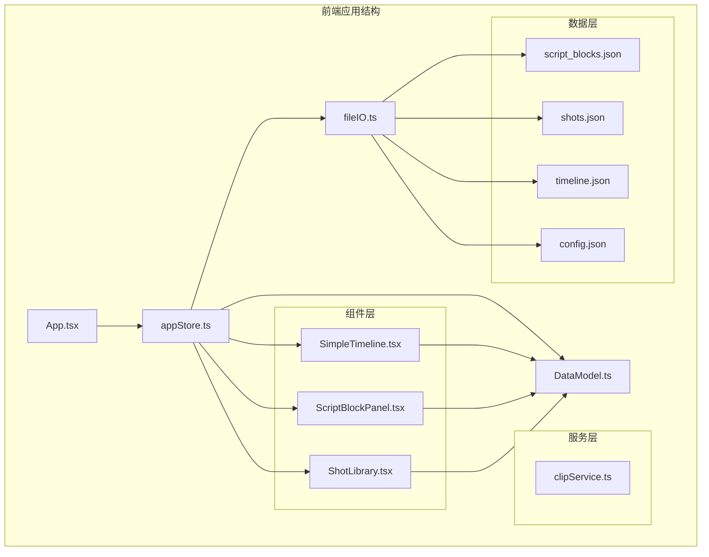

**图表来源**
- [README.md](file://README.md#L126-L150)
- [appStore.ts](file://src/store/appStore.ts#L1-L58)

**章节来源**
- [README.md](file://README.md#L1-L181)

## 核心组件

### Clip数据模型

Clip接口是时间轴镜头实例的核心数据结构，定义如下：

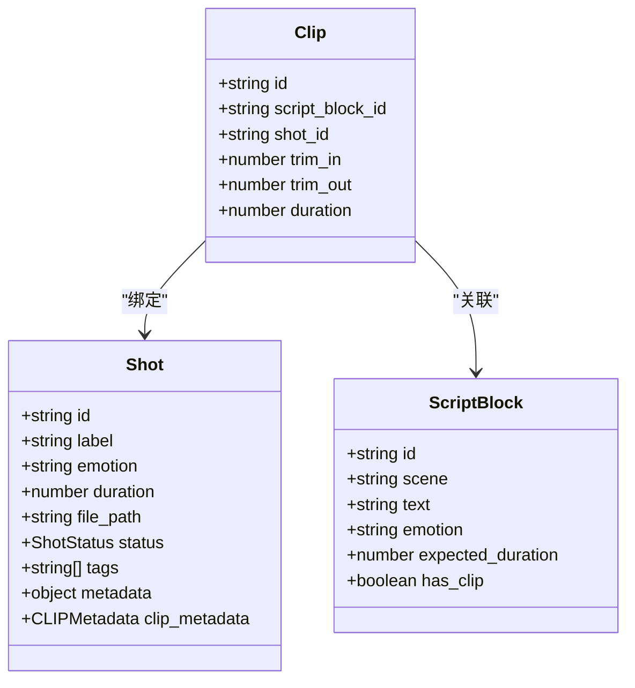

**图表来源**
- [DataModel.ts](file://src/types/DataModel.ts#L138-L148)
- [DataModel.ts](file://src/types/DataModel.ts#L120-L135)
- [DataModel.ts](file://src/types/DataModel.ts#L101-L109)

### 裁剪参数工作原理

裁剪参数通过相对原始镜头时长进行计算：

- **trim_in**: 裁剪起始点（秒，相对于Shot原始时长）
- **trim_out**: 裁剪结束点（秒，相对于Shot原始时长）
- **duration**: 裁剪后的实际时长（trim_out - trim_in）

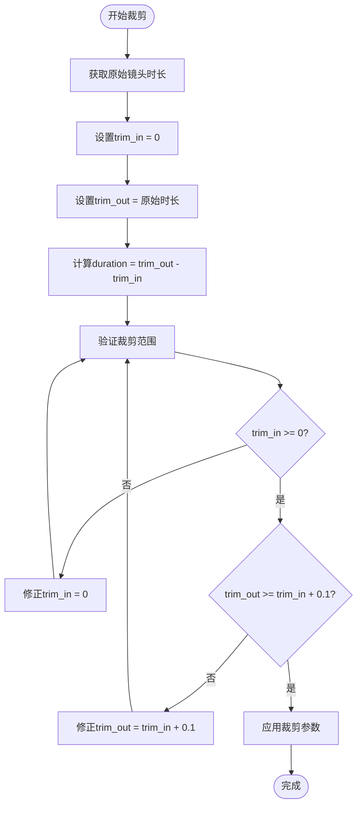

**图表来源**
- [DataModel.ts](file://src/types/DataModel.ts#L256-L274)

**章节来源**
- [DataModel.ts](file://src/types/DataModel.ts#L138-L148)
- [DataModel.ts](file://src/types/DataModel.ts#L242-L290)

## 架构概览

CGCUT采用React + TypeScript + Zustand的状态管理模式，实现了高效的时间轴编辑和播放控制：

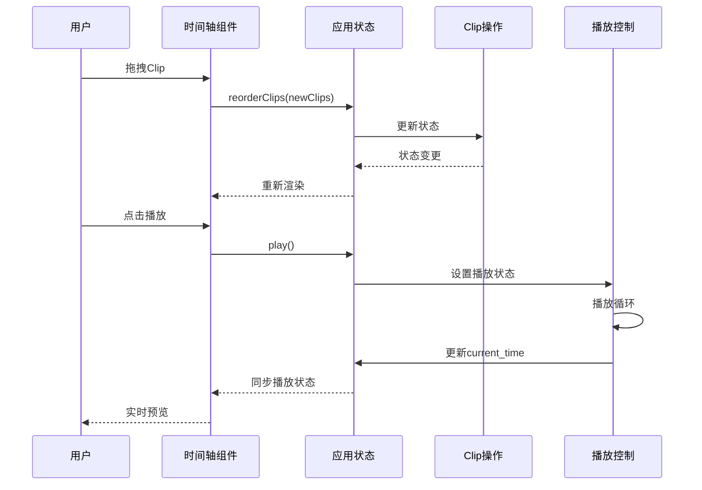

**图表来源**
- [SimpleTimeline.tsx](file://src/components/SimpleTimeline.tsx#L67-L92)
- [appStore.ts](file://src/store/appStore.ts#L119-L129)

**章节来源**
- [SimpleTimeline.tsx](file://src/components/SimpleTimeline.tsx#L1-L414)
- [appStore.ts](file://src/store/appStore.ts#L1-L195)

## 详细组件分析

### Clip工厂函数

#### createClip函数

创建新的Clip实例，初始化为完整镜头时长：

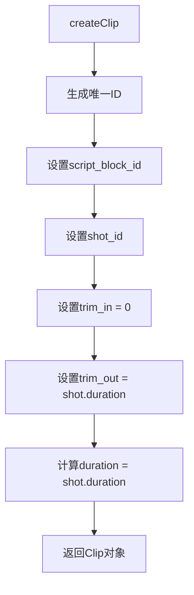

**图表来源**
- [DataModel.ts](file://src/types/DataModel.ts#L242-L254)

#### updateClipTrim函数

更新Clip的裁剪参数，确保参数有效性：

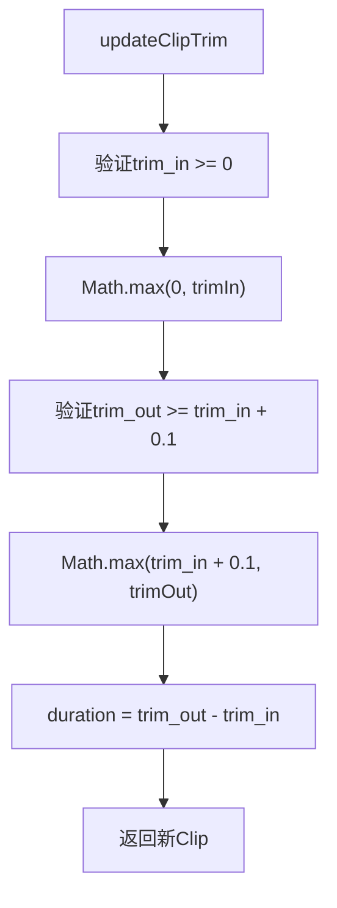

**图表来源**
- [DataModel.ts](file://src/types/DataModel.ts#L259-L274)

#### replaceClipShot函数

替换Clip绑定的Shot，重置裁剪参数：

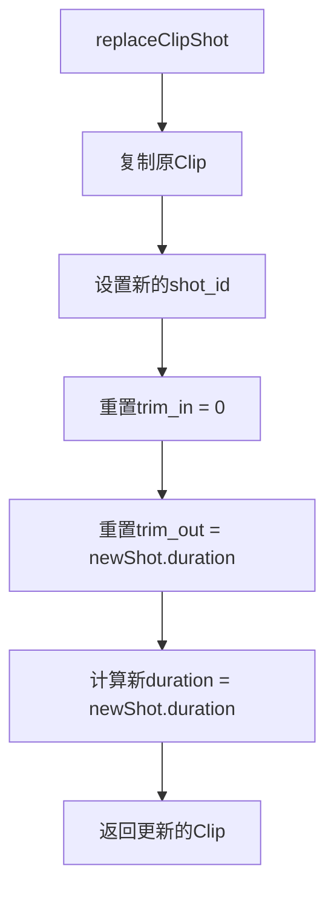

**图表来源**
- [DataModel.ts](file://src/types/DataModel.ts#L279-L290)

**章节来源**
- [DataModel.ts](file://src/types/DataModel.ts#L242-L290)

### 播放控制系统

#### PlaybackState数据结构

播放状态管理器负责跟踪播放进度和当前片段：

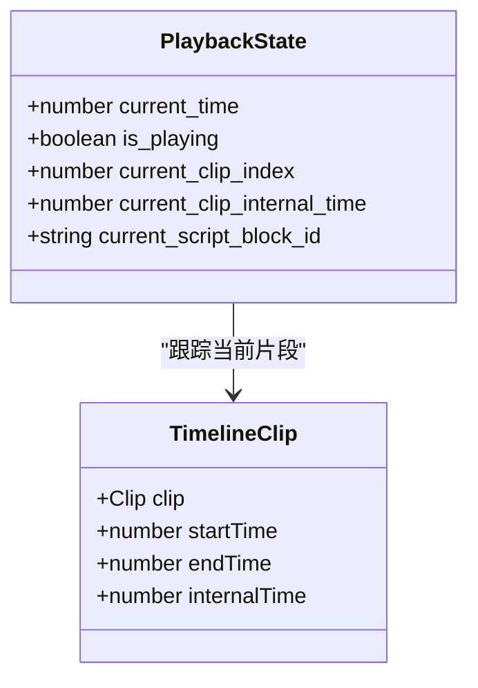

**图表来源**
- [DataModel.ts](file://src/types/DataModel.ts#L187-L193)

#### 播放循环实现

时间轴播放采用requestAnimationFrame实现平滑动画：

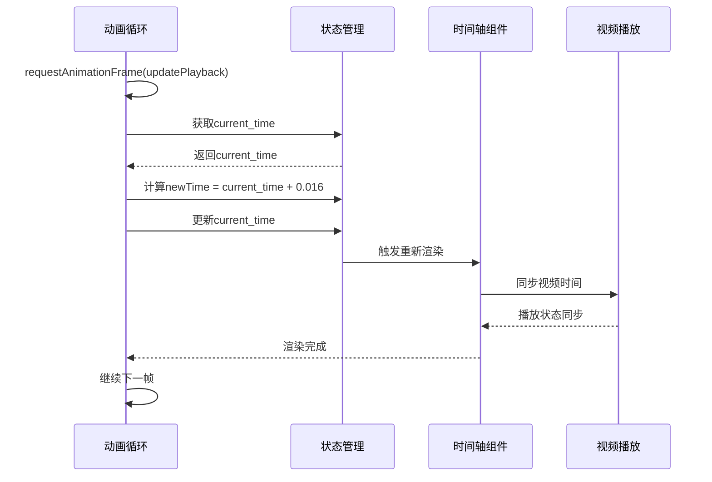

**图表来源**
- [SimpleTimeline.tsx](file://src/components/SimpleTimeline.tsx#L67-L92)

**章节来源**
- [DataModel.ts](file://src/types/DataModel.ts#L187-L193)
- [SimpleTimeline.tsx](file://src/components/SimpleTimeline.tsx#L67-L109)

### 数据持久化机制

#### 文件I/O操作

项目使用localStorage模拟文件系统，支持数据的加载和保存：

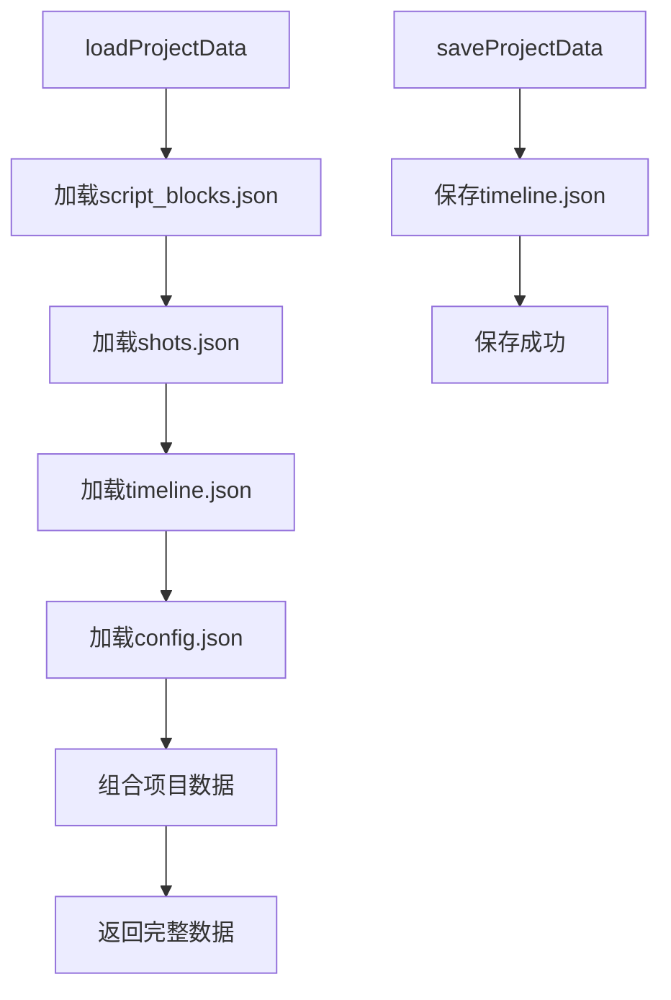

**图表来源**
- [fileIO.ts](file://src/utils/fileIO.ts#L54-L80)

**章节来源**
- [fileIO.ts](file://src/utils/fileIO.ts#L1-L95)

### 示例数据结构

#### 时间轴示例

基于示例数据，展示Clip实例的完整结构：

| 字段 | 值 | 说明 |
|------|-----|------|
| id | "clip_001" | 唯一标识符 |
| script_block_id | "sb_001" | 关联的剧本段落ID |
| shot_id | "shot_001" | 绑定的镜头ID |
| trim_in | 0.0 | 裁剪起始点（秒） |
| trim_out | 3.0 | 裁剪结束点（秒） |
| duration | 3.0 | 实际时长（秒） |

**章节来源**
- [timeline.json](file://public/data/timeline.json#L1-L59)
- [script_blocks.json](file://public/data/script_blocks.json#L1-L38)
- [shots.json](file://public/data/shots.json#L1-L83)

## 依赖关系分析

CGCUT的数据模型具有清晰的依赖层次：

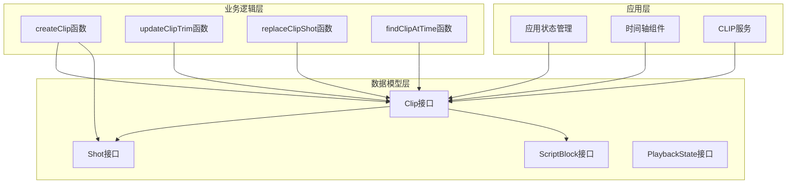

**图表来源**
- [DataModel.ts](file://src/types/DataModel.ts#L138-L290)
- [appStore.ts](file://src/store/appStore.ts#L1-L195)
- [SimpleTimeline.tsx](file://src/components/SimpleTimeline.tsx#L1-L414)

**章节来源**
- [DataModel.ts](file://src/types/DataModel.ts#L1-L291)
- [appStore.ts](file://src/store/appStore.ts#L1-L195)

## 性能考虑

### 时间复杂度分析

- **创建Clip**: O(1) - 固定的属性赋值操作
- **更新裁剪参数**: O(1) - 数学运算和边界检查
- **查找当前Clip**: O(n) - 线性遍历所有Clip
- **计算总时长**: O(n) - 线性求和所有Clip时长

### 优化建议

1. **索引优化**: 为频繁查询的字段建立索引
2. **缓存策略**: 缓存计算结果，避免重复计算
3. **批量操作**: 支持批量更新以减少重渲染次数
4. **虚拟滚动**: 对大量Clip时使用虚拟滚动技术

## 故障排除指南

### 常见问题及解决方案

#### 1. 裁剪参数无效

**问题**: trim_in > trim_out 或 duration < 0.1

**解决方案**: 
- 确保trim_in >= 0
- 确保trim_out >= trim_in + 0.1
- 使用updateClipTrim函数自动修正

#### 2. 播放异常

**问题**: 视频播放不同步或卡顿

**解决方案**:
- 检查视频文件路径是否正确
- 验证视频文件格式兼容性
- 确认浏览器支持相关视频编解码器

#### 3. 数据丢失

**问题**: 页面刷新后数据消失

**解决方案**:
- 检查localStorage权限
- 确认saveProjectData调用成功
- 验证文件保存机制

**章节来源**
- [DataModel.ts](file://src/types/DataModel.ts#L259-L274)
- [SimpleTimeline.tsx](file://src/components/SimpleTimeline.tsx#L95-L109)
- [fileIO.ts](file://src/utils/fileIO.ts#L25-L34)

## 结论

CGCUT的时间轴镜头实例数据模型设计简洁而功能完备，通过Clip接口实现了对镜头实例的精确控制。核心特性包括：

1. **精确的裁剪控制**: 通过trim_in和trim_out参数实现精确的镜头裁剪
2. **实时播放预览**: 基于requestAnimationFrame的平滑播放体验
3. **直观的UI交互**: 支持拖拽排序、删除和裁剪操作
4. **数据持久化**: 完整的项目数据保存和加载机制

该模型特别适合导演在分镜阶段进行快速验证和迭代，帮助在30分钟内从剧本到可播放时间轴，及时发现和调整节奏问题。通过工厂函数和操作方法的封装，开发者可以轻松扩展功能，同时保持代码的可维护性和一致性。