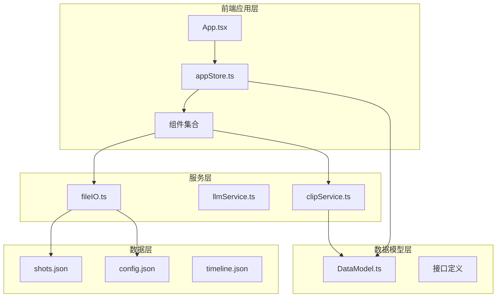
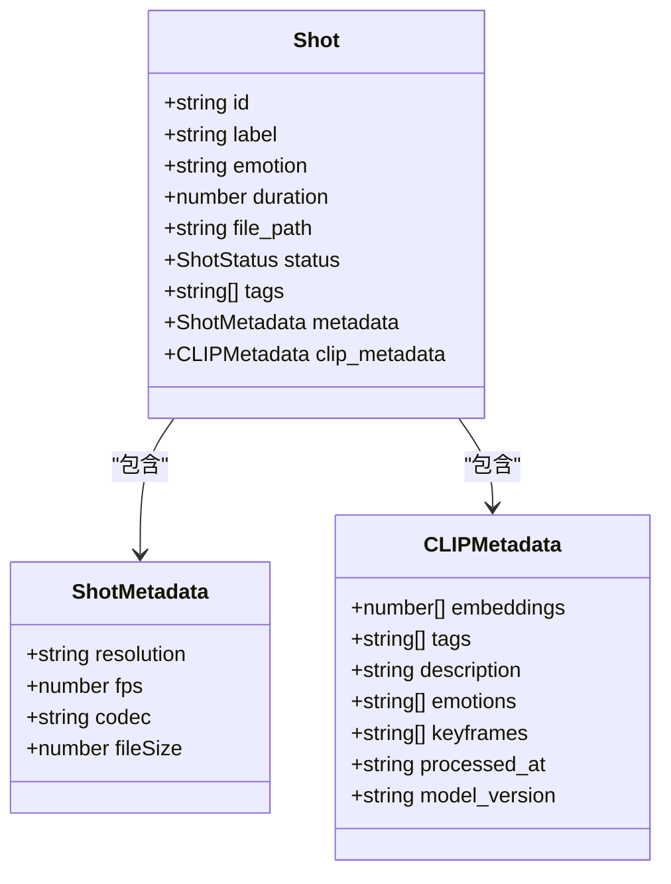
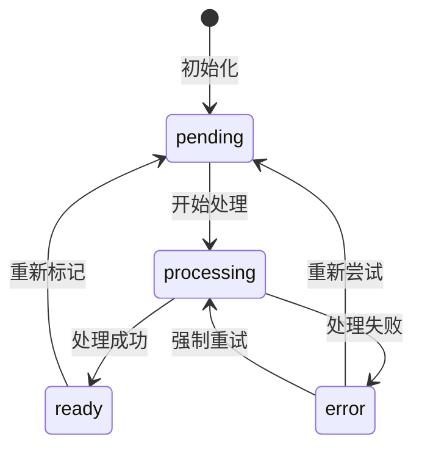
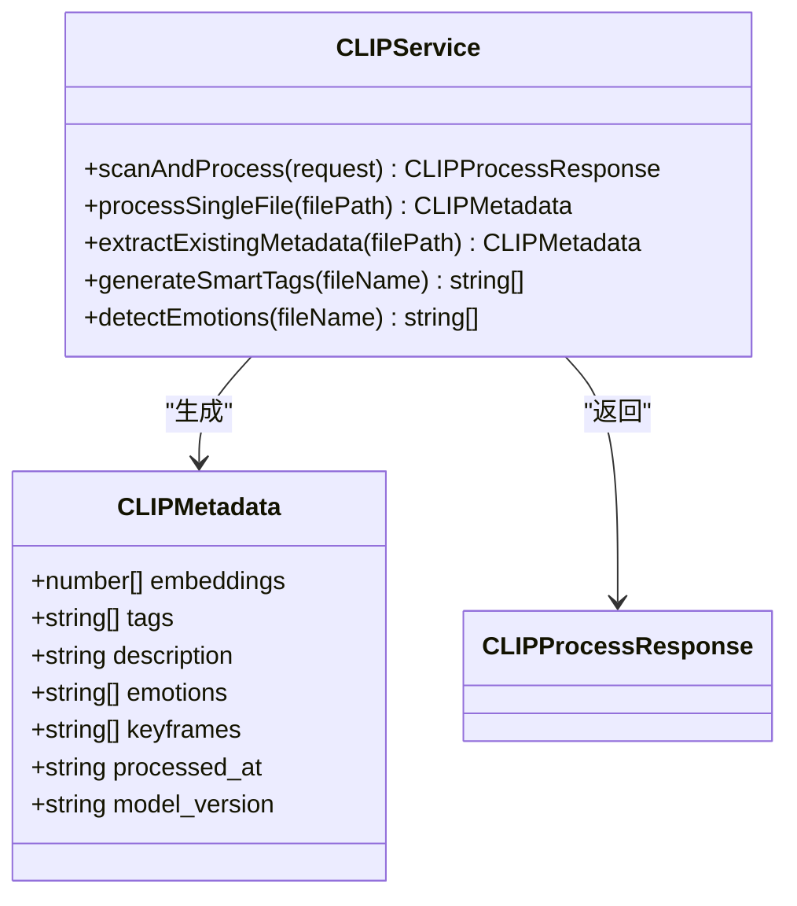
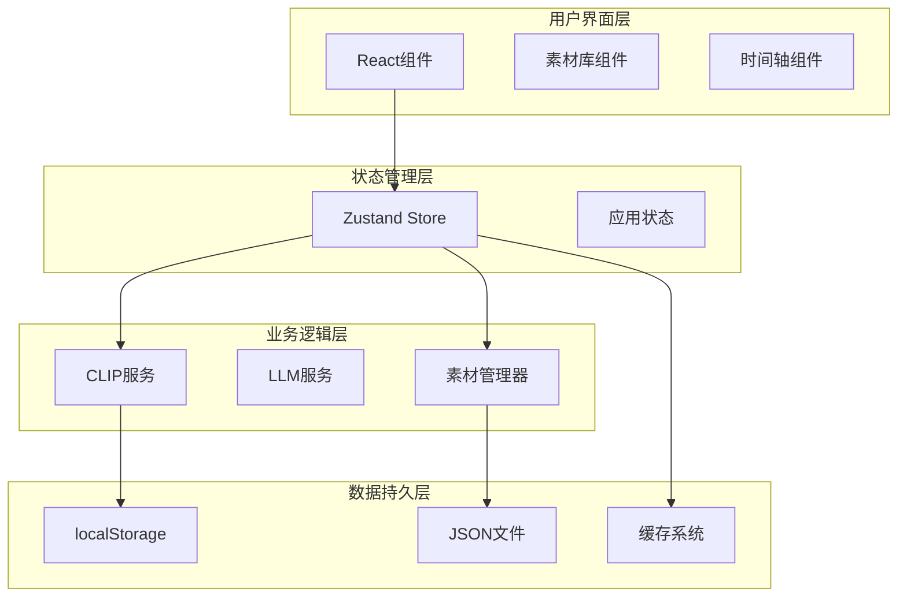
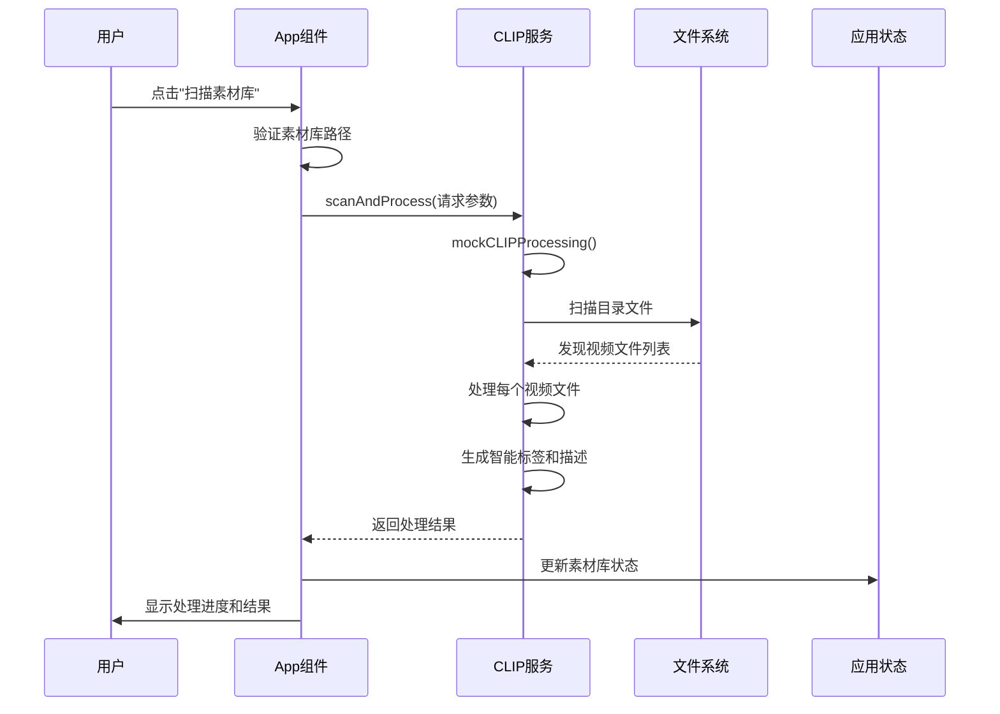
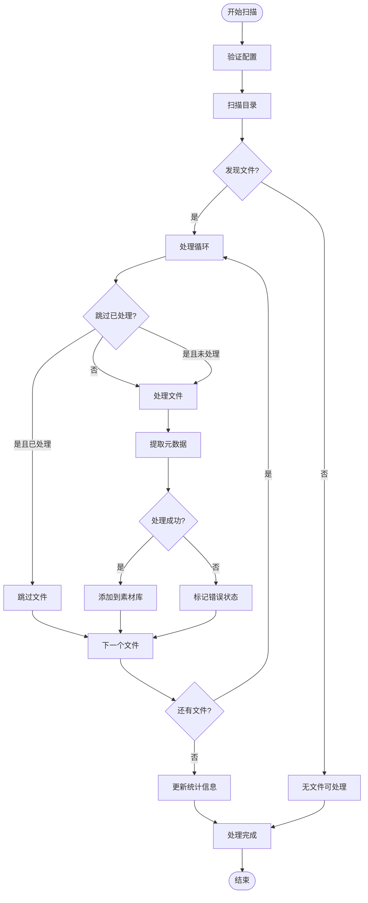
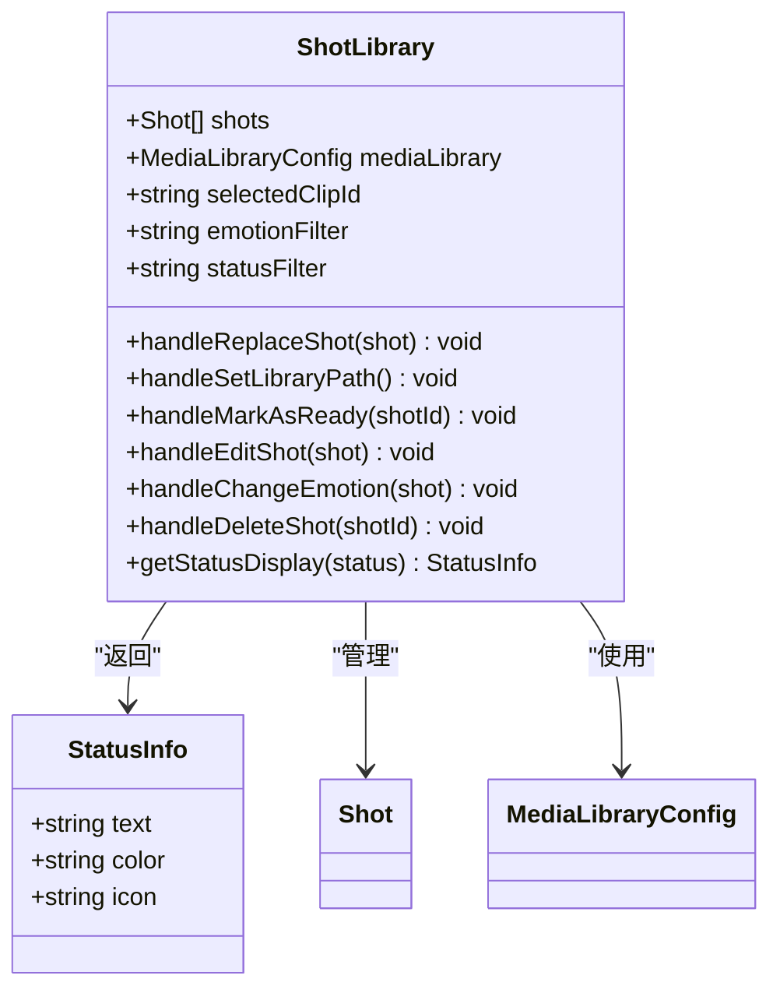
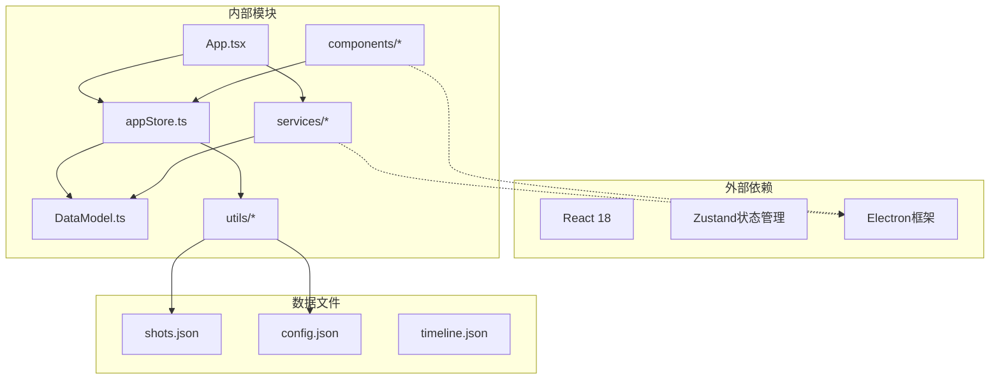

# 素材镜头数据模型

<cite>
**本文档引用的文件**
- [DataModel.ts](file://src/types/DataModel.ts)
- [clipService.ts](file://src/services/clipService.ts)
- [ShotLibrary.tsx](file://src/components/ShotLibrary.tsx)
- [appStore.ts](file://src/store/appStore.ts)
- [App.tsx](file://src/App.tsx)
- [fileIO.ts](file://src/utils/fileIO.ts)
- [shots.json](file://public/data/shots.json)
- [config.json](file://public/data/config.json)
</cite>

## 目录
1. [简介](#简介)
2. [项目结构](#项目结构)
3. [核心组件](#核心组件)
4. [架构概览](#架构概览)
5. [详细组件分析](#详细组件分析)
6. [依赖关系分析](#依赖关系分析)
7. [性能考量](#性能考量)
8. [故障排除指南](#故障排除指南)
9. [结论](#结论)

## 简介

CGCUT项目中的素材镜头数据模型是整个导演分镜验证系统的核心基础。该模型定义了视频素材的基本结构，包括镜头信息、处理状态、元数据以及与CLIP系统的集成方式。本文档将详细解析Shot接口的完整结构，解释素材处理状态的各种状态值及其含义，并描述metadata对象中分辨率、帧率、编码格式等技术规格字段。

## 项目结构

CGCUT项目采用模块化架构设计，主要包含以下核心模块：

**图表来源**
- [App.tsx](file://src/App.tsx#L1-L50)
- [appStore.ts](file://src/store/appStore.ts#L1-L30)
- [DataModel.ts](file://src/types/DataModel.ts#L1-L50)

**章节来源**
- [App.tsx](file://src/App.tsx#L1-L100)
- [appStore.ts](file://src/store/appStore.ts#L1-L60)

## 核心组件

### Shot接口结构详解

Shot接口是素材镜头数据模型的核心，定义了视频素材的基本属性和行为。以下是完整的字段说明：

**图表来源**
- [DataModel.ts](file://src/types/DataModel.ts#L120-L135)
- [DataModel.ts](file://src/types/DataModel.ts#L128-L133)
- [DataModel.ts](file://src/types/DataModel.ts#L9-L17)

#### 核心字段详细说明

**基础字段**
- `id`: 唯一标识符，格式为"shot_" + 时间戳 + 序号
- `label`: 镜头描述，如"特写-手部"、"全景-卧室环境"
- `emotion`: 情绪标签，用于素材筛选和情感分析
- `duration`: 镜头时长（秒），表示视频的实际播放时长
- `file_path`: 视频文件的后端引用路径

**状态管理字段**
- `status`: 素材处理状态，支持四种状态转换
- `tags`: 自动识别的标签列表，用于快速分类和搜索

**元数据字段**
- `metadata`: 技术规格信息，包含分辨率、帧率、编码格式等
- `clip_metadata`: CLIP模型提取的智能元数据

**章节来源**
- [DataModel.ts](file://src/types/DataModel.ts#L120-L135)

### ShotStatus状态系统

素材处理状态系统采用有限状态机设计，确保状态转换的可控性和可追踪性：

**图表来源**
- [DataModel.ts](file://src/types/DataModel.ts#L114)

#### 状态含义详解

- **pending（待处理）**: 素材已添加但尚未开始分析，通常用于手动标记或等待处理
- **processing（处理中）**: 正在使用CLIP模型进行内容分析和元数据提取
- **ready（已处理）**: 素材分析完成，元数据可用，可以正常用于时间轴
- **error（错误）**: 处理过程中发生异常，需要人工干预或重新处理

**章节来源**
- [DataModel.ts](file://src/types/DataModel.ts#L114)

### CLIP元数据系统

CLIP（Contrastive Language-Image Pre-training）元数据提供了智能化的内容理解和特征提取能力：

**图表来源**
- [DataModel.ts](file://src/types/DataModel.ts#L9-L17)
- [clipService.ts](file://src/services/clipService.ts#L22-L32)

#### CLIP元数据字段说明

- **embeddings**: 512维特征向量，用于相似度计算和智能检索
- **tags**: 自动生成的场景标签，如"室内"、"特写"、"人物"等
- **description**: 智能生成的场景描述文本
- **emotions**: 识别到的情绪标签数组
- **keyframes**: 关键帧截图路径列表（可选）
- **processed_at**: 处理完成的时间戳
- **model_version**: 使用的CLIP模型版本信息

**章节来源**
- [DataModel.ts](file://src/types/DataModel.ts#L9-L17)

## 架构概览

CGCUT项目的整体架构采用分层设计，确保数据流的清晰性和可维护性：

**图表来源**
- [App.tsx](file://src/App.tsx#L1-L40)
- [appStore.ts](file://src/store/appStore.ts#L1-L30)
- [clipService.ts](file://src/services/clipService.ts#L1-L20)

## 详细组件分析

### 素材库扫描流程

素材库扫描是项目的核心功能之一，负责自动发现和处理视频素材：

**图表来源**
- [App.tsx](file://src/App.tsx#L171-L252)
- [clipService.ts](file://src/services/clipService.ts#L36-L60)

#### 扫描参数配置

扫描过程支持多种配置选项：

- **directoryPath**: 扫描的根目录路径
- **filePatterns**: 文件匹配模式，默认包含.mp4、.mov、.avi格式
- **skipProcessed**: 跳过已处理文件的选项
- **extractKeyframes**: 是否提取关键帧截图

**章节来源**
- [clipService.ts](file://src/services/clipService.ts#L22-L27)

### 素材处理状态跟踪

素材处理状态跟踪系统提供了完整的生命周期管理：

**图表来源**
- [App.tsx](file://src/App.tsx#L185-L252)
- [clipService.ts](file://src/services/clipService.ts#L107-L165)

**章节来源**
- [App.tsx](file://src/App.tsx#L171-L252)

### 素材库组件实现

素材库组件提供了用户友好的界面来管理和操作素材：

**图表来源**
- [ShotLibrary.tsx](file://src/components/ShotLibrary.tsx#L11-L30)
- [ShotLibrary.tsx](file://src/components/ShotLibrary.tsx#L106-L114)

#### 组件功能特性

- **实时状态显示**: 展示已处理、待处理、处理中的素材数量
- **智能筛选**: 支持按情绪和状态进行多维度筛选
- **批量操作**: 支持一键标记、编辑、删除素材
- **状态可视化**: 使用颜色和图标直观展示素材状态

**章节来源**
- [ShotLibrary.tsx](file://src/components/ShotLibrary.tsx#L116-L359)

## 依赖关系分析

项目中的依赖关系体现了清晰的分层架构：

**图表来源**
- [App.tsx](file://src/App.tsx#L1-L12)
- [appStore.ts](file://src/store/appStore.ts#L1-L10)
- [DataModel.ts](file://src/types/DataModel.ts#L1-L10)

### 核心依赖关系

**类型依赖**: 所有组件和服务都严格遵循DataModel.ts中定义的接口规范，确保类型安全。

**状态依赖**: appStore.ts作为单一数据源，为所有组件提供状态共享和状态更新机制。

**服务依赖**: clipService.ts独立封装CLIP相关的业务逻辑，便于测试和维护。

**数据依赖**: fileIO.ts统一处理数据的加载和保存，支持MVP阶段的localStorage模拟和后续的Electron文件系统集成。

**章节来源**
- [DataModel.ts](file://src/types/DataModel.ts#L1-L50)
- [appStore.ts](file://src/store/appStore.ts#L1-L60)
- [clipService.ts](file://src/services/clipService.ts#L1-L32)

## 性能考量

### 内存优化策略

1. **状态分片**: 使用Zustand进行细粒度状态管理，避免不必要的组件重渲染
2. **懒加载**: 素材库组件按需渲染，减少初始加载压力
3. **虚拟滚动**: 对大量素材列表使用虚拟滚动技术

### 处理效率优化

1. **批处理**: CLIP服务支持批量处理视频文件，提高处理效率
2. **缓存机制**: 支持从现有元数据文件中提取信息，避免重复处理
3. **异步处理**: 所有长时间运行的操作都采用异步模式，保持UI响应性

### 存储优化

1. **增量更新**: 支持跳过已处理文件，只处理新发现的素材
2. **压缩存储**: JSON数据采用适当的压缩策略
3. **清理机制**: 定期清理无效或过期的数据

## 故障排除指南

### 常见问题及解决方案

**问题1: 素材库扫描失败**
- 检查素材库路径配置是否正确
- 验证文件权限和访问权限
- 确认视频文件格式支持情况

**问题2: CLIP处理错误**
- 检查网络连接和API端点配置
- 验证CLIP模型版本兼容性
- 查看错误日志获取具体错误信息

**问题3: 状态显示异常**
- 刷新页面重新加载状态
- 检查浏览器控制台的JavaScript错误
- 确认Zustand状态管理正常工作

**问题4: 数据同步问题**
- 检查localStorage的存储容量限制
- 验证文件IO操作的权限设置
- 确认Electron环境的文件系统访问

**章节来源**
- [App.tsx](file://src/App.tsx#L246-L251)
- [clipService.ts](file://src/services/clipService.ts#L45-L59)

### 调试技巧

1. **启用详细日志**: 在开发环境中启用详细的console.log输出
2. **状态监控**: 使用浏览器的Redux DevTools监控状态变化
3. **网络调试**: 检查CLIP API的请求和响应
4. **内存监控**: 使用浏览器性能工具监控内存使用情况

## 结论

CGCUT项目的素材镜头数据模型设计体现了现代前端应用的最佳实践。通过清晰的接口定义、完善的类型系统和合理的架构分层，该模型为导演分镜验证提供了坚实的技术基础。

**核心优势**：
- **类型安全**: 完整的TypeScript类型定义确保代码质量和开发体验
- **扩展性强**: 模块化的架构设计便于功能扩展和维护
- **用户体验**: 直观的界面设计和流畅的交互体验
- **性能优化**: 合理的状态管理和异步处理机制

**未来发展方向**：
- 集成真实的CLIP API服务
- 扩展更多的视频格式支持
- 增强AI辅助的素材推荐功能
- 优化大规模素材库的处理性能

该数据模型为整个CGCUT项目奠定了坚实的基础，为后续的功能扩展和技术升级提供了清晰的路径。