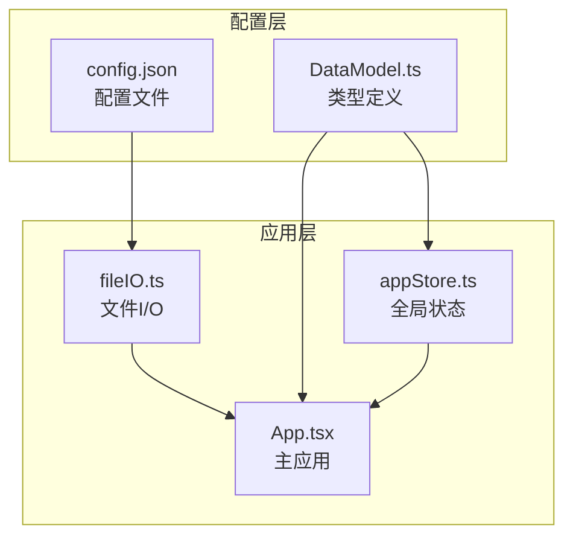
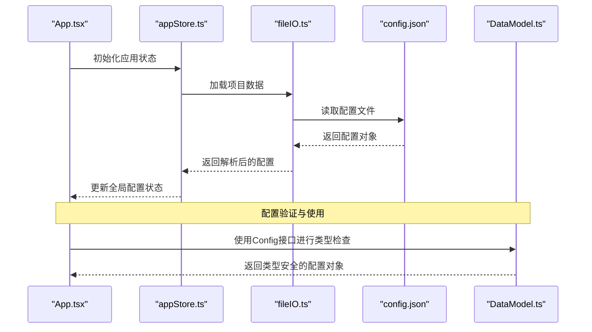
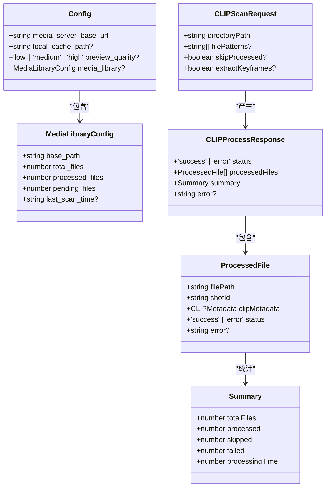
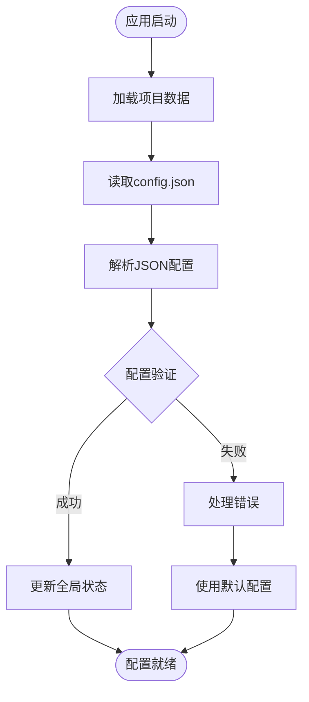
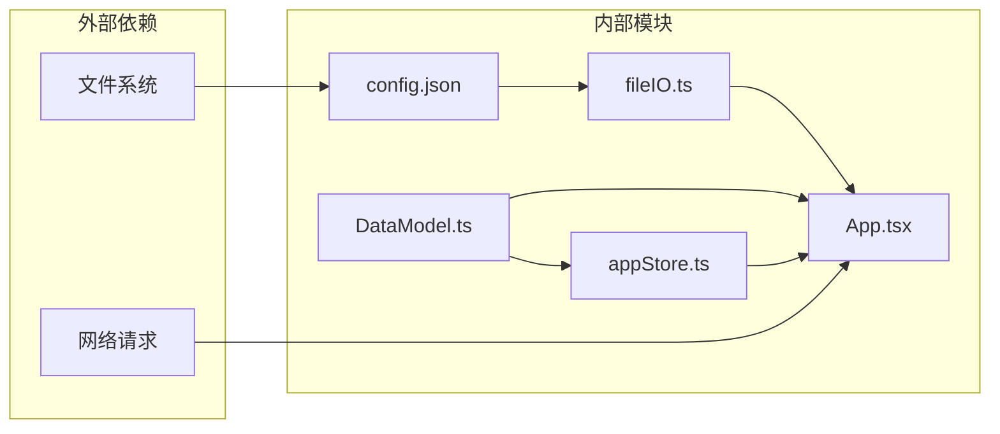

# 项目配置数据模型

<cite>
**本文档引用的文件**
- [config.json](file://public/data/config.json)
- [DataModel.ts](file://src/types/DataModel.ts)
- [fileIO.ts](file://src/utils/fileIO.ts)
- [appStore.ts](file://src/store/appStore.ts)
- [App.tsx](file://src/App.tsx)
- [README.md](file://README.md)
</cite>

## 目录
1. [简介](#简介)
2. [项目结构](#项目结构)
3. [核心组件](#核心组件)
4. [架构概览](#架构概览)
5. [详细组件分析](#详细组件分析)
6. [依赖关系分析](#依赖关系分析)
7. [性能考量](#性能考量)
8. [故障排除指南](#故障排除指南)
9. [结论](#结论)
10. [附录](#附录)

## 简介
本文件详细说明项目配置数据模型，重点解析Config接口的完整结构及其在媒体服务器配置、本地缓存策略、预览视频质量设置中的作用。同时涵盖MediaLibraryConfig中素材库扫描和状态跟踪的配置参数，并提供配置文件的JSON示例与最佳实践建议，以及配置验证和错误处理机制。

## 项目结构
项目采用模块化组织方式，配置相关的核心文件分布如下：
- 配置文件：public/data/config.json
- 类型定义：src/types/DataModel.ts
- 文件I/O：src/utils/fileIO.ts
- 应用状态：src/store/appStore.ts
- 应用入口：src/App.tsx
- 文档说明：README.md



**图表来源**
- [config.json](file://public/data/config.json#L1-L6)
- [DataModel.ts](file://src/types/DataModel.ts#L164-L169)
- [fileIO.ts](file://src/utils/fileIO.ts#L54-L73)
- [appStore.ts](file://src/store/appStore.ts#L60-L90)
- [App.tsx](file://src/App.tsx#L39-L59)

**章节来源**
- [config.json](file://public/data/config.json#L1-L6)
- [DataModel.ts](file://src/types/DataModel.ts#L164-L169)
- [fileIO.ts](file://src/utils/fileIO.ts#L54-L73)
- [appStore.ts](file://src/store/appStore.ts#L60-L90)
- [App.tsx](file://src/App.tsx#L39-L59)

## 核心组件
本节详细解析Config接口的各个字段及其作用。

### Config接口结构
Config接口定义了项目运行所需的核心配置项：

| 字段名 | 类型 | 必填 | 描述 |
|--------|------|------|------|
| media_server_base_url | string | 是 | 媒体服务器基础URL，用于构建媒体资源访问路径 |
| local_cache_path | string | 否 | 本地缓存目录路径，可选配置 |
| preview_quality | 'low' \| 'medium' \| 'high' | 否 | 预览视频质量等级，默认medium |

### 媒体服务器配置
- **用途**：提供统一的媒体资源访问入口
- **作用域**：用于构建媒体文件的完整访问URL
- **示例**：`http://localhost:8080/media`

### 本地缓存策略
- **可选性**：local_cache_path为可选字段
- **用途**：指定本地缓存目录，便于离线访问和性能优化
- **默认行为**：未配置时使用服务器直连模式

### 预览视频质量设置
- **质量等级**：low、medium、high三档
- **影响范围**：控制预览视频的分辨率和压缩质量
- **性能权衡**：质量越高，带宽占用越大，但视觉效果更佳

**章节来源**
- [DataModel.ts](file://src/types/DataModel.ts#L164-L169)
- [config.json](file://public/data/config.json#L2-L4)

## 架构概览
配置系统在应用中的工作流程如下：



**图表来源**
- [App.tsx](file://src/App.tsx#L39-L59)
- [appStore.ts](file://src/store/appStore.ts#L60-L90)
- [fileIO.ts](file://src/utils/fileIO.ts#L54-L73)
- [config.json](file://public/data/config.json#L1-L6)
- [DataModel.ts](file://src/types/DataModel.ts#L164-L169)

## 详细组件分析

### 配置数据模型类图


**图表来源**
- [DataModel.ts](file://src/types/DataModel.ts#L153-L169)
- [DataModel.ts](file://src/types/DataModel.ts#L22-L49)

### 配置加载流程


**图表来源**
- [fileIO.ts](file://src/utils/fileIO.ts#L54-L73)
- [config.json](file://public/data/config.json#L1-L6)

### 素材库配置参数详解
MediaLibraryConfig提供了完整的素材库状态跟踪能力：

| 参数名 | 类型 | 描述 | 示例值 |
|--------|------|------|--------|
| base_path | string | 素材库根路径 | `"U:\\PreVis_Assets"` |
| total_files | number | 素材库总文件数 | `1500` |
| processed_files | number | 已处理文件数 | `1200` |
| pending_files | number | 待处理文件数 | `300` |
| last_scan_time | string | 最后扫描时间戳 | `"2024-01-01T12:00:00Z"` |

**章节来源**
- [DataModel.ts](file://src/types/DataModel.ts#L153-L159)
- [App.tsx](file://src/App.tsx#L47-L55)

## 依赖关系分析
配置系统的依赖关系呈现清晰的层次结构：



**图表来源**
- [config.json](file://public/data/config.json#L1-L6)
- [DataModel.ts](file://src/types/DataModel.ts#L164-L169)
- [fileIO.ts](file://src/utils/fileIO.ts#L7-L18)
- [appStore.ts](file://src/store/appStore.ts#L1-L58)
- [App.tsx](file://src/App.tsx#L1-L11)

**章节来源**
- [fileIO.ts](file://src/utils/fileIO.ts#L7-L18)
- [DataModel.ts](file://src/types/DataModel.ts#L164-L169)
- [appStore.ts](file://src/store/appStore.ts#L1-L58)
- [App.tsx](file://src/App.tsx#L1-L11)

## 性能考量
预览视频质量设置对系统性能的影响分析：

### 质量等级对比
| 质量等级 | 分辨率 | 带宽占用 | 处理开销 | 适用场景 |
|----------|--------|----------|----------|----------|
| low | 360p | 低 | 低 | 移动设备、网络不佳 |
| medium | 720p | 中等 | 中等 | 桌面端、一般网络 |
| high | 1080p | 高 | 高 | 高性能设备、专业编辑 |

### 性能优化建议
1. **自适应质量**：根据网络状况动态调整预览质量
2. **缓存策略**：合理配置local_cache_path提升加载速度
3. **批量处理**：素材库扫描时采用批处理减少内存占用
4. **懒加载**：按需加载素材避免一次性加载过多资源

## 故障排除指南
配置相关的常见问题及解决方案：

### 配置文件错误
**问题**：config.json格式错误
**症状**：应用启动失败或配置加载异常
**解决**：
1. 验证JSON格式有效性
2. 检查必需字段完整性
3. 确认URL格式正确性

### 网络连接问题
**问题**：媒体服务器无法访问
**症状**：素材加载超时或404错误
**解决**：
1. 验证media_server_base_url可达性
2. 检查防火墙和代理设置
3. 确认服务器端口开放

### 缓存路径问题
**问题**：local_cache_path配置无效
**症状**：缓存功能异常或权限错误
**解决**：
1. 确认路径存在且可写
2. 检查文件系统权限
3. 验证相对路径解析正确

**章节来源**
- [fileIO.ts](file://src/utils/fileIO.ts#L8-L18)
- [App.tsx](file://src/App.tsx#L172-L176)

## 结论
项目配置数据模型通过Config接口提供了简洁而强大的配置管理能力。Config接口的设计充分考虑了媒体服务器配置、本地缓存策略和预览质量设置的需求，同时MediaLibraryConfig为素材库的扫描和状态跟踪提供了完整的参数支持。通过合理的配置验证和错误处理机制，系统能够在保证功能完整性的同时提供良好的用户体验。

## 附录

### 配置文件JSON示例
```json
{
  "media_server_base_url": "http://localhost:8080/media",
  "local_cache_path": "./cache",
  "preview_quality": "medium",
  "media_library": {
    "base_path": "U:\\PreVis_Assets",
    "total_files": 1500,
    "processed_files": 1200,
    "pending_files": 300,
    "last_scan_time": "2024-01-01T12:00:00Z"
  }
}
```

### 最佳实践建议
1. **配置验证**：始终验证必需字段的存在性和格式正确性
2. **错误处理**：实现优雅降级，配置缺失时使用合理默认值
3. **性能监控**：定期检查配置对系统性能的影响
4. **文档维护**：保持配置说明与代码实现同步更新
5. **安全考虑**：避免在配置中存储敏感信息，使用环境变量替代

### 配置迁移指南
当项目升级或重构时，建议：
1. 保留向后兼容的配置字段
2. 提供配置版本控制机制
3. 实现配置自动迁移脚本
4. 记录配置变更日志