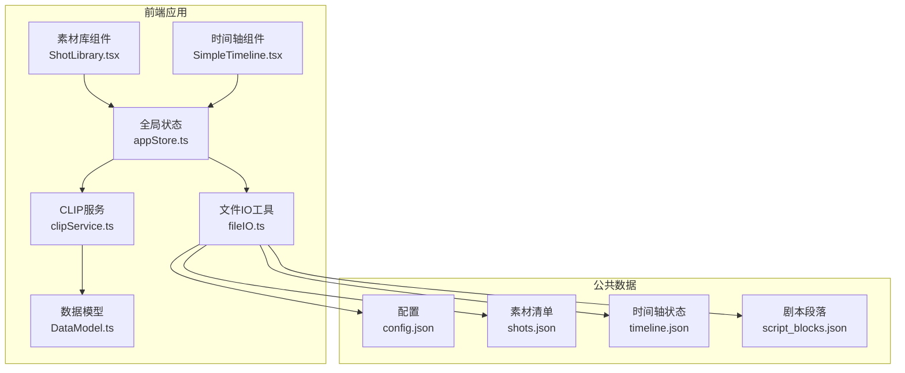
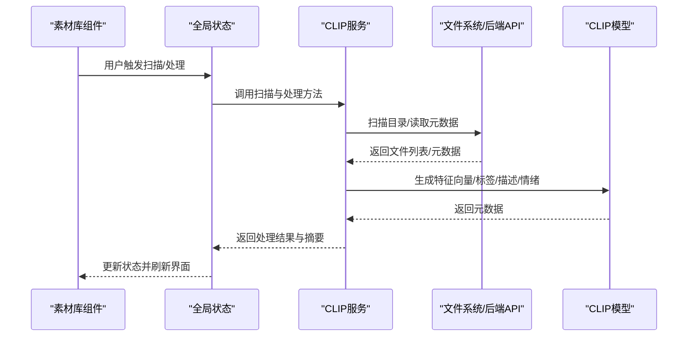
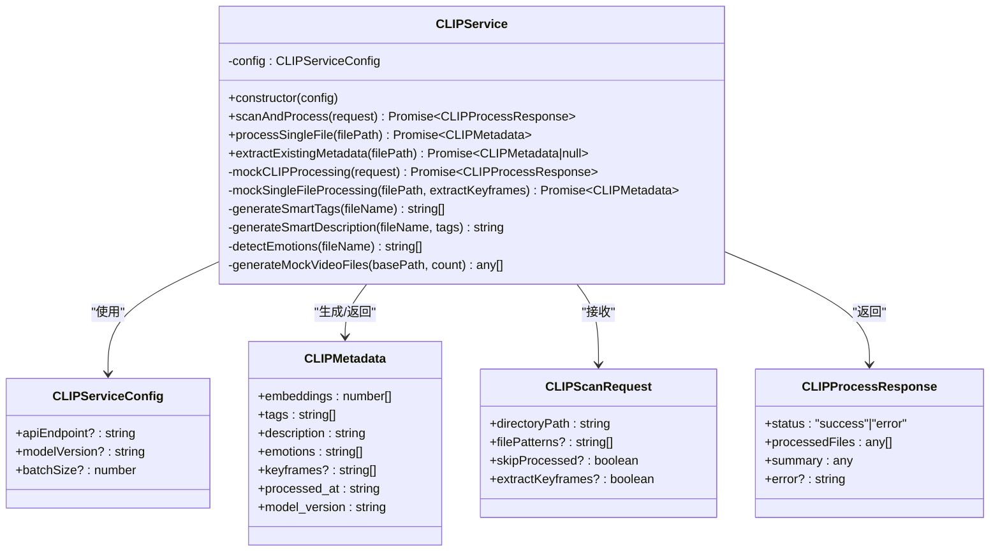
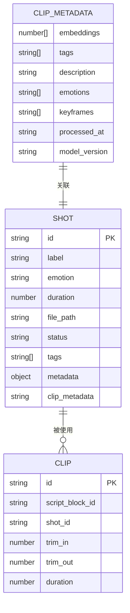
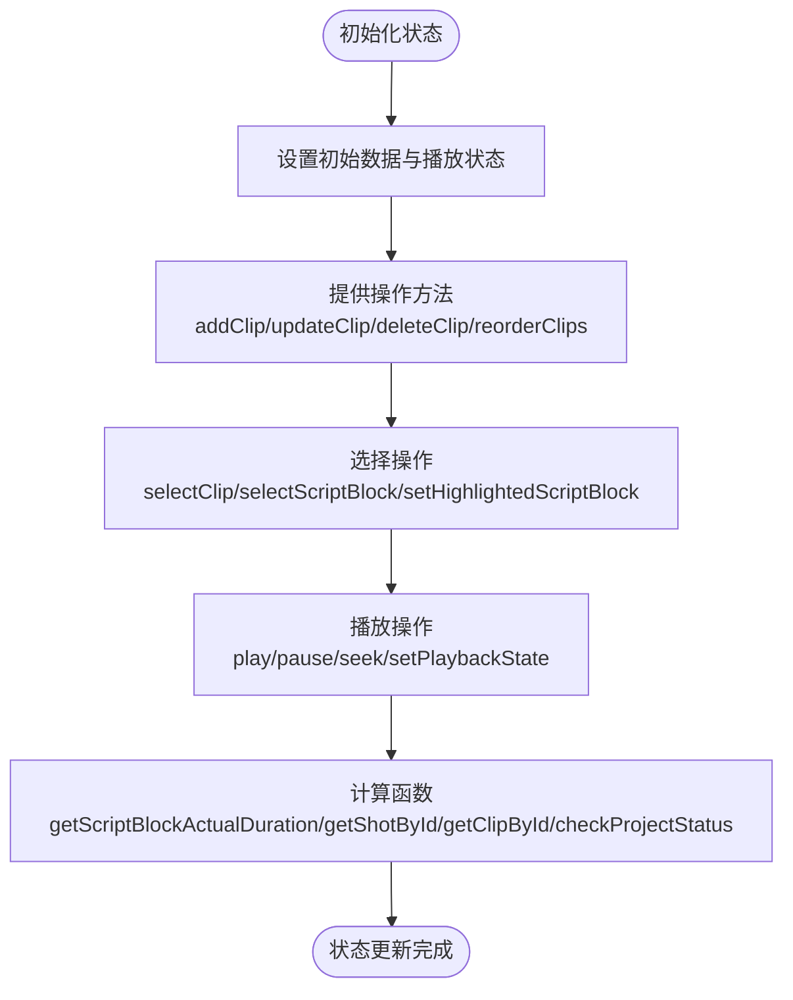
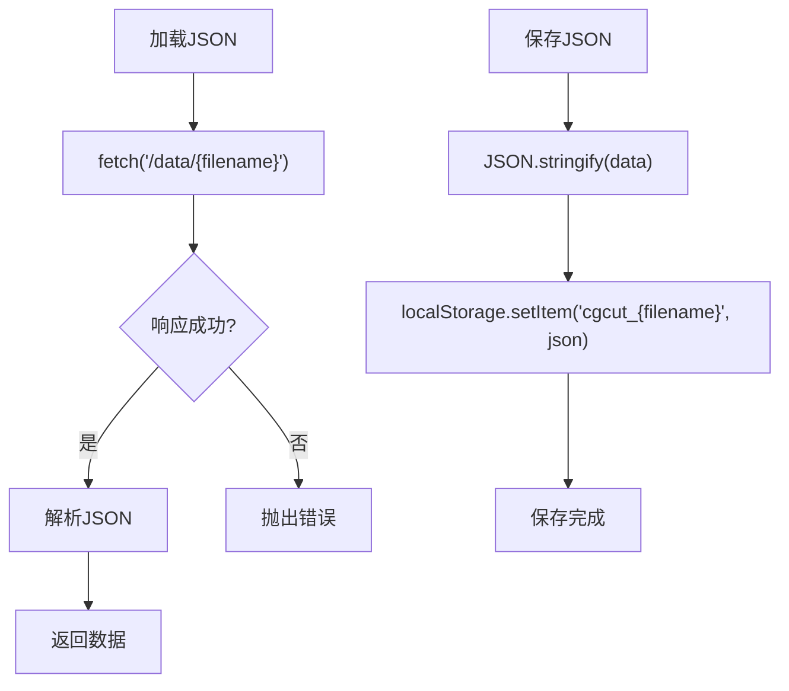
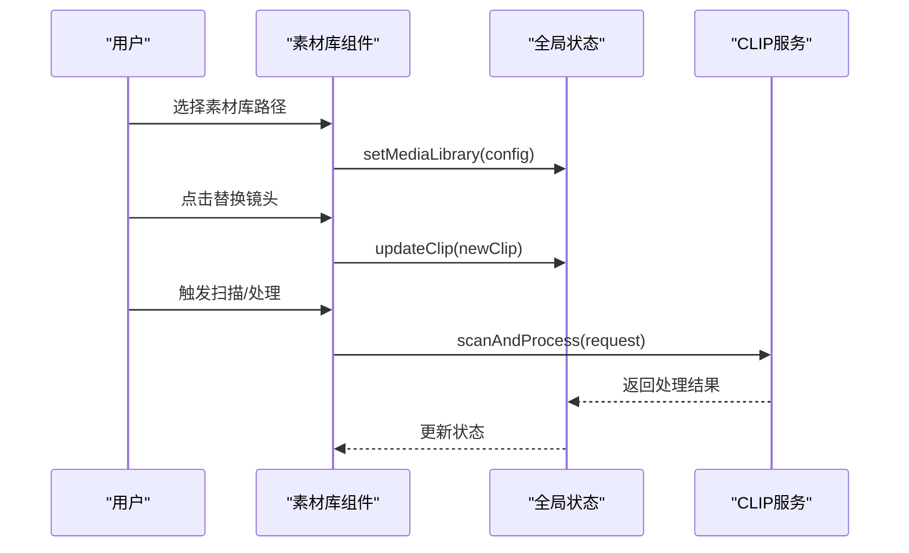
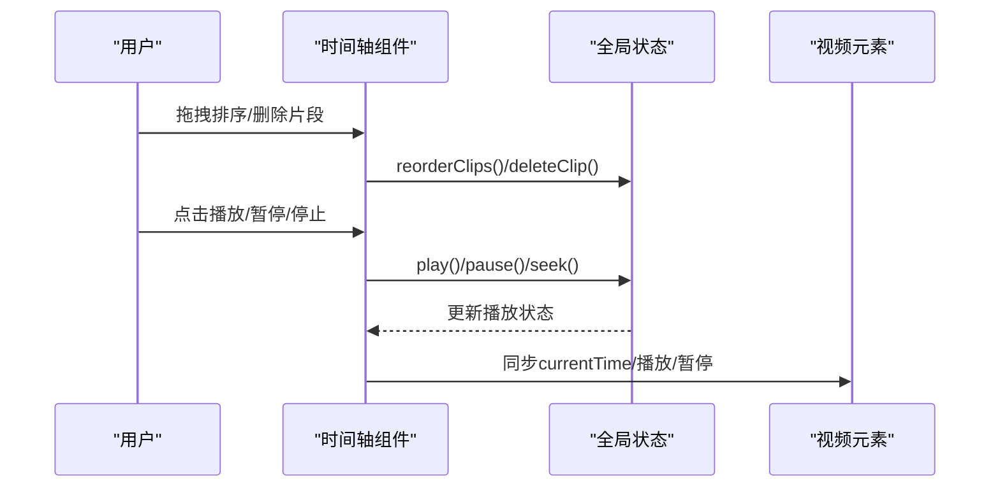
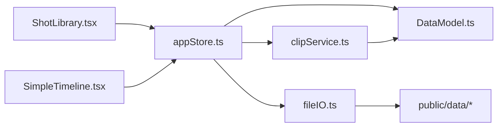

# CLIP服务

<cite>
**本文档引用的文件**
- [README.md](file://README.md)
- [clipService.ts](file://src/services/clipService.ts)
- [DataModel.ts](file://src/types/DataModel.ts)
- [appStore.ts](file://src/store/appStore.ts)
- [fileIO.ts](file://src/utils/fileIO.ts)
- [ShotLibrary.tsx](file://src/components/ShotLibrary.tsx)
- [SimpleTimeline.tsx](file://src/components/SimpleTimeline.tsx)
- [config.json](file://public/data/config.json)
- [script_blocks.json](file://public/data/script_blocks.json)
- [shots.json](file://public/data/shots.json)
- [timeline.json](file://public/data/timeline.json)
- [package.json](file://package.json)
</cite>

## 目录
1. [简介](#简介)
2. [项目结构](#项目结构)
3. [核心组件](#核心组件)
4. [架构概览](#架构概览)
5. [详细组件分析](#详细组件分析)
6. [依赖关系分析](#依赖关系分析)
7. [性能考量](#性能考量)
8. [故障排查指南](#故障排查指南)
9. [结论](#结论)
10. [附录](#附录)

## 简介
本项目是一个面向导演分镜验证的MVP工具，重点在于“剧本段落×镜头组合×实际节奏”的快速验证与可视化。CLIP服务作为视频内容分析与元数据提取的核心模块，负责：
- 视频文件扫描与批量处理
- CLIP特征向量、标签、场景描述、情绪识别等元数据生成
- 与素材库的集成与状态管理
- 为时间轴与素材库提供数据支撑

在MVP阶段，CLIP服务采用模拟处理流程，便于前端开发与演示；生产环境则预留了真实API集成的接口与示例，便于后续接入后端CLIP服务。

## 项目结构
项目采用前端单页应用架构，核心目录与职责如下：
- src/types：数据模型与类型定义
- src/services：业务服务层（含CLIP服务）
- src/store：全局状态管理（Zustand）
- src/utils：工具函数（文件IO）
- src/components：UI组件（素材库、时间轴等）
- public/data：示例数据与配置

图表来源
- [ShotLibrary.tsx](file://src/components/ShotLibrary.tsx#L1-L359)
- [SimpleTimeline.tsx](file://src/components/SimpleTimeline.tsx#L1-L414)
- [appStore.ts](file://src/store/appStore.ts#L1-L195)
- [fileIO.ts](file://src/utils/fileIO.ts#L1-L95)
- [DataModel.ts](file://src/types/DataModel.ts#L1-L291)
- [clipService.ts](file://src/services/clipService.ts#L1-L394)
- [config.json](file://public/data/config.json#L1-L6)
- [shots.json](file://public/data/shots.json#L1-L83)
- [timeline.json](file://public/data/timeline.json#L1-L59)
- [script_blocks.json](file://public/data/script_blocks.json#L1-L38)

章节来源
- [README.md](file://README.md#L126-L150)
- [package.json](file://package.json#L1-L36)

## 核心组件
- CLIP服务（CLIPService）：负责视频扫描、批量处理、单文件处理、元数据提取与模拟分析。
- 数据模型（DataModel）：定义CLIP元数据、扫描请求/响应、镜头、片段、播放状态等类型。
- 全局状态（appStore）：集中管理剧本段落、镜头、片段、素材库配置与播放状态。
- 文件IO（fileIO）：封装数据加载与保存，MVP阶段使用浏览器localStorage模拟持久化。
- UI组件：素材库（ShotLibrary）与时间轴（SimpleTimeline）消费状态并触发操作。

章节来源
- [clipService.ts](file://src/services/clipService.ts#L22-L394)
- [DataModel.ts](file://src/types/DataModel.ts#L9-L291)
- [appStore.ts](file://src/store/appStore.ts#L1-L195)
- [fileIO.ts](file://src/utils/fileIO.ts#L1-L95)

## 架构概览
CLIP服务在整体架构中的位置与交互如下：

图表来源
- [clipService.ts](file://src/services/clipService.ts#L36-L165)
- [ShotLibrary.tsx](file://src/components/ShotLibrary.tsx#L11-L68)
- [appStore.ts](file://src/store/appStore.ts#L60-L195)

## 详细组件分析

### CLIP服务（CLIPService）
- 职责
  - 接收扫描请求，执行批量处理或单文件处理
  - 生成模拟元数据（特征向量、标签、描述、情绪），或对接真实API
  - 支持跳过已处理文件、关键帧提取等选项
- 关键方法
  - scanAndProcess：批量扫描与处理
  - processSingleFile：单文件处理
  - extractExistingMetadata：尝试从已有元数据文件提取
  - mockCLIPProcessing/mockSingleFileProcessing：MVP阶段的模拟实现
- 配置项
  - apiEndpoint：CLIP服务API端点
  - modelVersion：模型版本
  - batchSize：批处理大小

图表来源
- [clipService.ts](file://src/services/clipService.ts#L12-L394)
- [DataModel.ts](file://src/types/DataModel.ts#L9-L49)

章节来源
- [clipService.ts](file://src/services/clipService.ts#L22-L394)
- [DataModel.ts](file://src/types/DataModel.ts#L9-L49)

### 数据模型（DataModel）
- CLIP元数据（CLIPMetadata）：包含特征向量、标签、描述、情绪、关键帧路径、处理时间与模型版本
- 扫描请求（CLIPScanRequest）：目录路径、文件匹配模式、跳过已处理、关键帧提取
- 扫描响应（CLIPProcessResponse）：处理状态、文件列表、统计摘要与错误信息
- 镜头（Shot）、片段（Clip）、播放状态（PlaybackState）、项目检查状态（ProjectCheckStatus）

图表来源
- [DataModel.ts](file://src/types/DataModel.ts#L9-L148)

章节来源
- [DataModel.ts](file://src/types/DataModel.ts#L9-L148)

### 全局状态（appStore）
- 管理剧本段落、镜头、片段、素材库配置与播放状态
- 提供计算函数（如计算段落实际时长、查找片段/镜头）
- 提供项目状态检查（是否可播放）

图表来源
- [appStore.ts](file://src/store/appStore.ts#L60-L195)

章节来源
- [appStore.ts](file://src/store/appStore.ts#L1-L195)

### 文件IO（fileIO）
- 加载JSON：从public/data目录加载示例数据
- 保存JSON：使用localStorage模拟文件保存
- 项目数据加载/保存：批量加载与保存时间轴状态

图表来源
- [fileIO.ts](file://src/utils/fileIO.ts#L7-L34)

章节来源
- [fileIO.ts](file://src/utils/fileIO.ts#L1-L95)

### 素材库组件（ShotLibrary）
- 支持按情绪与状态筛选
- 支持设置素材库路径、标记素材为已处理、编辑标签与情绪、删除素材
- 与全局状态联动，实现素材替换与状态更新

图表来源
- [ShotLibrary.tsx](file://src/components/ShotLibrary.tsx#L55-L103)
- [clipService.ts](file://src/services/clipService.ts#L36-L165)
- [appStore.ts](file://src/store/appStore.ts#L91-L107)

章节来源
- [ShotLibrary.tsx](file://src/components/ShotLibrary.tsx#L1-L359)

### 时间轴组件（SimpleTimeline）
- 支持拖拽排序、删除片段、点击跳转
- 内置播放循环与进度条，同步视频播放与播放头
- 与全局状态联动，实时反映片段时长与播放状态

图表来源
- [SimpleTimeline.tsx](file://src/components/SimpleTimeline.tsx#L343-L413)
- [appStore.ts](file://src/store/appStore.ts#L114-L129)

章节来源
- [SimpleTimeline.tsx](file://src/components/SimpleTimeline.tsx#L1-L414)

## 依赖关系分析
- 组件依赖
  - 素材库与时间轴组件依赖全局状态（Zustand）
  - CLIP服务依赖数据模型类型
  - 文件IO工具为数据加载/保存提供统一入口
- 外部依赖
  - React 18 + TypeScript + Vite
  - Zustand（状态管理）
  - @dnd-kit（拖拽）
  - Tailwind CSS（样式）

图表来源
- [ShotLibrary.tsx](file://src/components/ShotLibrary.tsx#L1-L359)
- [SimpleTimeline.tsx](file://src/components/SimpleTimeline.tsx#L1-L414)
- [appStore.ts](file://src/store/appStore.ts#L1-L195)
- [clipService.ts](file://src/services/clipService.ts#L1-L394)
- [fileIO.ts](file://src/utils/fileIO.ts#L1-L95)
- [DataModel.ts](file://src/types/DataModel.ts#L1-L291)

章节来源
- [package.json](file://package.json#L14-L34)

## 性能考量
- 批处理与并发控制
  - 批处理大小（batchSize）影响吞吐与资源占用，建议根据硬件能力与网络状况调整
  - 并发控制：MVP阶段采用串行模拟；生产环境可引入队列与并发限制，避免超载
- 进度跟踪
  - 处理摘要（processed/skipped/failed/processingTime）可用于UI反馈
- 错误处理
  - 对单文件失败进行隔离记录，不影响整体流程
- I/O与缓存
  - 元数据文件（.clip.json/.metadata.json）可减少重复处理
  - 本地缓存路径（local_cache_path）可提升加载速度
- 渲染与状态更新
  - 使用Zustand减少不必要的重渲染
  - 时间轴缩放（像素/秒）影响渲染性能，需合理设置

## 故障排查指南
- CLIP服务错误
  - 检查apiEndpoint配置是否正确
  - 确认网络连通性与后端服务状态
  - 查看错误响应中的错误信息
- 元数据提取失败
  - 确认元数据文件是否存在且可读
  - 检查文件扩展名与命名规则
- 素材库路径
  - 确认路径可访问且包含目标视频文件
  - 检查文件权限与跨域设置
- 时间轴播放异常
  - 检查片段时长与裁剪参数
  - 确认视频源路径有效

章节来源
- [clipService.ts](file://src/services/clipService.ts#L45-L59)
- [clipService.ts](file://src/services/clipService.ts#L81-L102)
- [ShotLibrary.tsx](file://src/components/ShotLibrary.tsx#L55-L68)
- [SimpleTimeline.tsx](file://src/components/SimpleTimeline.tsx#L94-L109)

## 结论
CLIP服务在本项目中承担了视频内容分析与元数据提取的关键角色。MVP阶段通过模拟处理实现了端到端流程验证，为后续对接真实CLIP服务提供了清晰的接口与数据结构。结合全局状态与UI组件，实现了从素材库扫描、元数据生成到时间轴验证的完整工作流。建议在生产环境中完善并发控制、错误恢复与缓存策略，并持续优化批处理参数以获得最佳性能。

## 附录

### 配置选项
- 服务器配置（config.json）
  - media_server_base_url：素材服务器根路径
  - local_cache_path：本地缓存目录（可选）
  - preview_quality：预览视频质量（low/medium/high）

章节来源
- [config.json](file://public/data/config.json#L1-L6)

### 数据文件说明
- script_blocks.json：剧本段落列表
- shots.json：素材镜头列表
- timeline.json：时间轴状态
- config.json：应用配置

章节来源
- [script_blocks.json](file://public/data/script_blocks.json#L1-L38)
- [shots.json](file://public/data/shots.json#L1-L83)
- [timeline.json](file://public/data/timeline.json#L1-L59)

### CLIP服务配置与使用要点
- 批处理机制
  - 通过batchSize控制每次处理的文件数量
  - 支持跳过已处理文件（skipProcessed）
  - 可选择是否提取关键帧（extractKeyframes）
- 元数据结构
  - embeddings：CLIP特征向量（512维）
  - tags：智能生成的标签
  - description：场景描述
  - emotions：识别到的情绪
  - keyframes：关键帧截图路径（可选）
  - processed_at：处理时间
  - model_version：模型版本
- 集成第三方API
  - 参考CLIPService中的API集成示例注释，替换模拟实现
  - 注意请求体字段与响应格式的一致性

章节来源
- [clipService.ts](file://src/services/clipService.ts#L12-L31)
- [clipService.ts](file://src/services/clipService.ts#L107-L165)
- [clipService.ts](file://src/services/clipService.ts#L356-L390)
- [DataModel.ts](file://src/types/DataModel.ts#L9-L17)