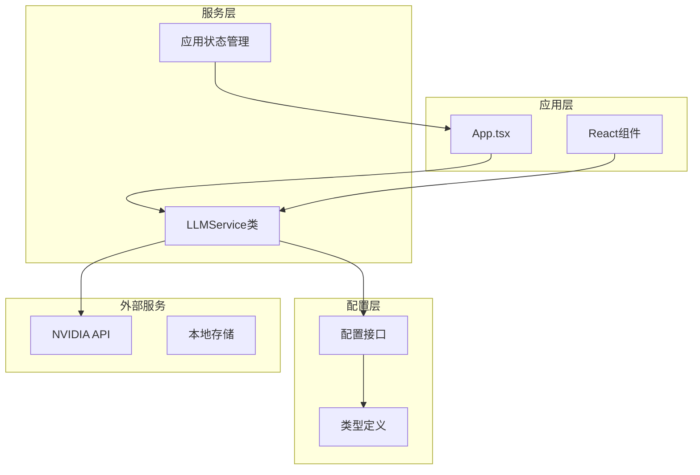
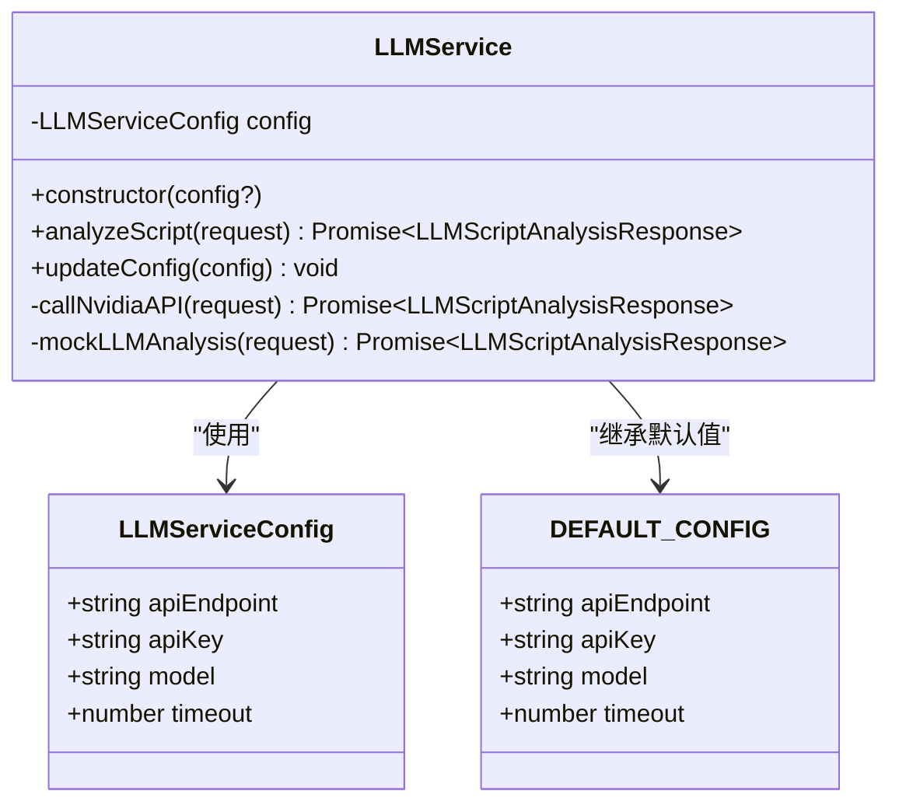
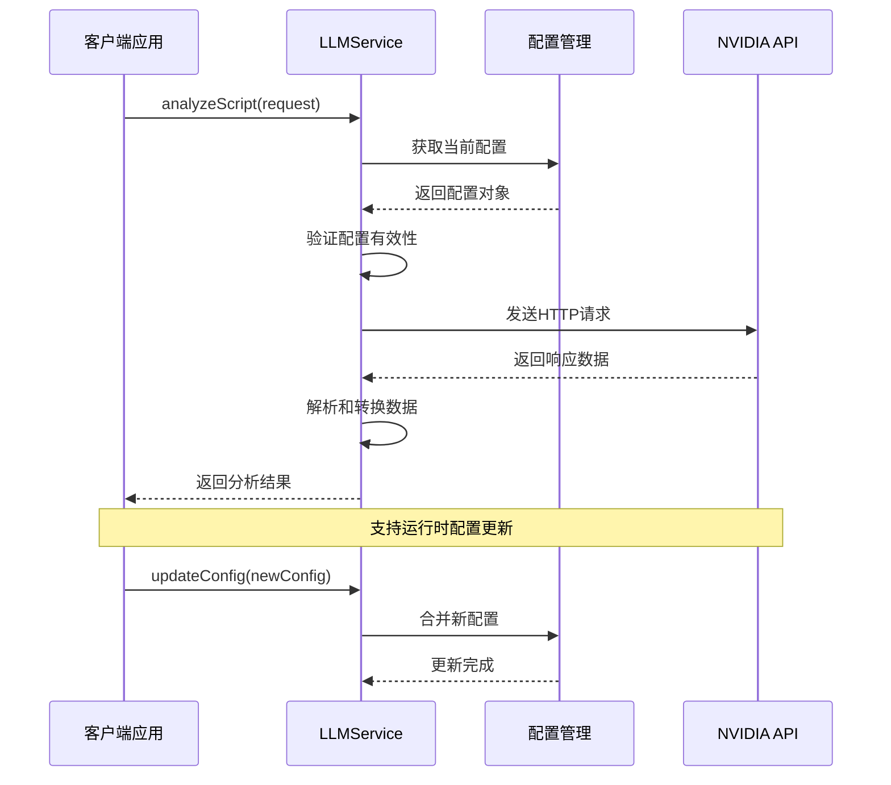
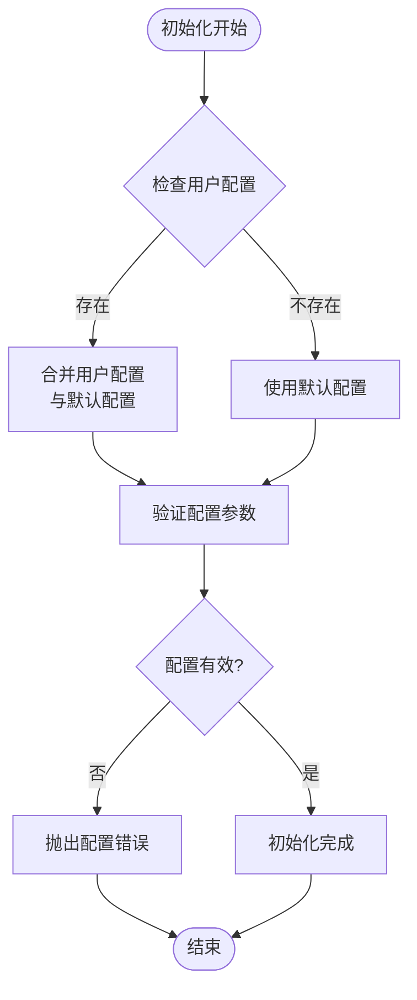
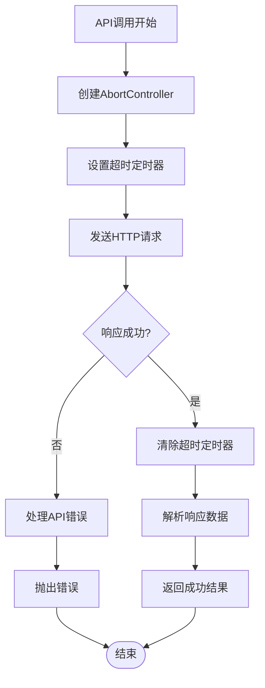
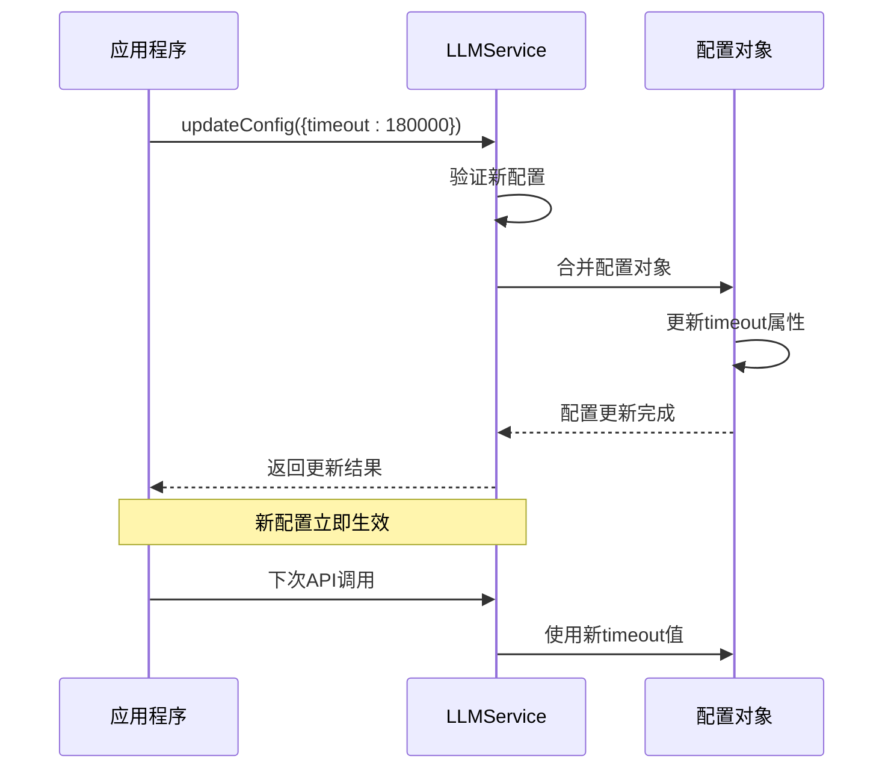
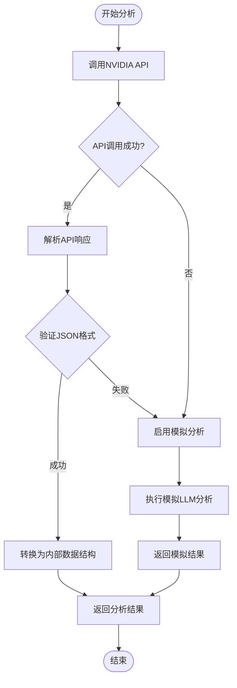
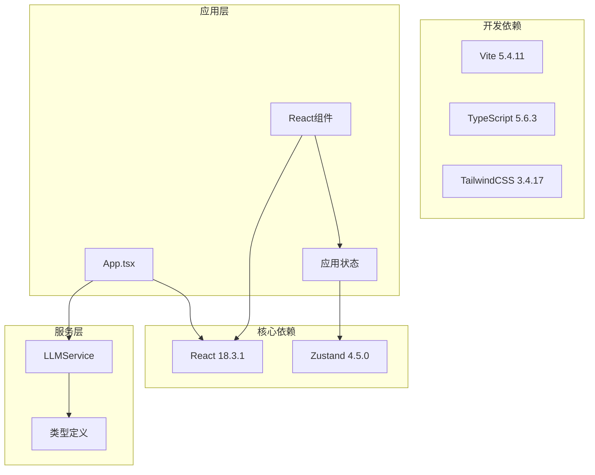

# API配置管理

<cite>
**本文档引用的文件**
- [llmService.ts](file://src/services/llmService.ts)
- [DataModel.ts](file://src/types/DataModel.ts)
- [App.tsx](file://src/App.tsx)
- [ScriptBlockPanel.tsx](file://src/components/ScriptBlockPanel.tsx)
- [appStore.ts](file://src/store/appStore.ts)
- [config.json](file://public/data/config.json)
- [package.json](file://package.json)
</cite>

## 目录
1. [简介](#简介)
2. [项目结构](#项目结构)
3. [核心组件](#核心组件)
4. [架构概览](#架构概览)
5. [详细组件分析](#详细组件分析)
6. [依赖关系分析](#依赖关系分析)
7. [性能考量](#性能考量)
8. [故障排除指南](#故障排除指南)
9. [结论](#结论)

## 简介

本文件详细阐述了CGCUT项目中的LLM API配置管理系统。该系统负责管理NVIDIA API端点配置、API密钥管理、模型参数设置和超时控制机制。系统采用TypeScript实现，提供了灵活的配置更新机制和运行时修改能力，确保在不同环境下能够安全、高效地使用AI驱动的剧本分析功能。

## 项目结构

CGCUT项目采用模块化架构设计，LLM配置管理位于服务层，通过类型定义确保配置的安全性和一致性。

**图表来源**
- [llmService.ts](file://src/services/llmService.ts#L42-L57)
- [App.tsx](file://src/App.tsx#L8-L10)

**章节来源**
- [llmService.ts](file://src/services/llmService.ts#L1-L50)
- [package.json](file://package.json#L1-L36)

## 核心组件

### LLMService配置管理器

LLMService类是整个配置管理的核心，负责维护和更新API配置参数。

**图表来源**
- [llmService.ts](file://src/services/llmService.ts#L42-L67)

### 配置参数详解

系统提供了四个关键配置参数，每个参数都有明确的作用和可调范围：

| 参数名 | 类型 | 默认值 | 作用 | 可调范围 |
|--------|------|--------|------|----------|
| apiEndpoint | string | NVIDIA API端点 | LLM API访问地址 | 任意有效的HTTP/HTTPS URL |
| apiKey | string | NVIDIA API密钥 | 认证令牌 | 10-200字符的字符串 |
| model | string | Llama 3.1 405B模型 | AI模型标识 | 任意有效的模型名称 |
| timeout | number | 120000毫秒 | 请求超时时间 | 10000-300000毫秒 |

**章节来源**
- [llmService.ts](file://src/services/llmService.ts#L42-L57)

## 架构概览

系统采用单例模式设计，确保全局只有一个LLMService实例，便于统一管理配置。

**图表来源**
- [llmService.ts](file://src/services/llmService.ts#L62-L101)
- [llmService.ts](file://src/services/llmService.ts#L467-L469)

## 详细组件分析

### 配置初始化流程

系统在初始化时会合并用户提供的配置与默认配置，确保所有必需参数都得到正确设置。

**图表来源**
- [llmService.ts](file://src/services/llmService.ts#L65-L67)

### 超时控制机制

系统实现了双重超时保护机制，确保API调用不会无限期挂起。

**图表来源**
- [llmService.ts](file://src/services/llmService.ts#L204-L233)

### 配置更新机制

系统支持运行时动态更新配置，无需重启应用即可生效。

**图表来源**
- [llmService.ts](file://src/services/llmService.ts#L467-L469)

**章节来源**
- [llmService.ts](file://src/services/llmService.ts#L65-L101)
- [llmService.ts](file://src/services/llmService.ts#L204-L323)

### 错误处理和回退机制

系统实现了完善的错误处理和回退机制，确保在API调用失败时仍能提供基本功能。

**图表来源**
- [llmService.ts](file://src/services/llmService.ts#L72-L101)
- [llmService.ts](file://src/services/llmService.ts#L329-L423)

**章节来源**
- [llmService.ts](file://src/services/llmService.ts#L94-L101)
- [llmService.ts](file://src/services/llmService.ts#L329-L423)

## 依赖关系分析

系统依赖关系清晰，主要依赖包括React生态系统和状态管理库。

**图表来源**
- [package.json](file://package.json#L14-L34)

**章节来源**
- [package.json](file://package.json#L1-L36)

## 性能考量

### 超时参数优化

系统提供了灵活的超时配置选项，可根据不同场景进行优化：

- **开发环境**: 推荐120-180秒，便于调试和测试
- **生产环境**: 建议180-300秒，确保复杂分析任务完成
- **资源受限环境**: 可降至60-120秒，避免长时间占用

### 模型参数调优

系统支持多种模型参数调整：

- **temperature**: 0.5（稳定结果）
- **top_p**: 0.9（保持多样性）
- **max_tokens**: 8000（支持长文本）

**章节来源**
- [llmService.ts](file://src/services/llmService.ts#L226-L228)

## 故障排除指南

### 常见配置问题

1. **API密钥无效**
   - 检查密钥格式是否正确
   - 确认密钥权限是否足够
   - 验证API端点可达性

2. **超时错误**
   - 增加timeout配置值
   - 检查网络连接稳定性
   - 考虑使用代理服务器

3. **模型参数错误**
   - 验证模型名称拼写
   - 确认模型可用性
   - 检查API配额限制

### 调试技巧

- 启用详细日志记录
- 使用浏览器开发者工具监控网络请求
- 检查API响应状态码
- 验证JSON响应格式

**章节来源**
- [llmService.ts](file://src/services/llmService.ts#L235-L242)
- [llmService.ts](file://src/services/llmService.ts#L455-L461)

## 结论

CGCUT项目的LLM API配置管理系统提供了完整、灵活且安全的配置管理解决方案。系统通过单例模式确保配置的一致性，通过运行时更新机制提供灵活性，通过完善的错误处理确保系统的稳定性。推荐在生产环境中结合具体的业务需求对配置参数进行优化，并建立相应的监控和告警机制。