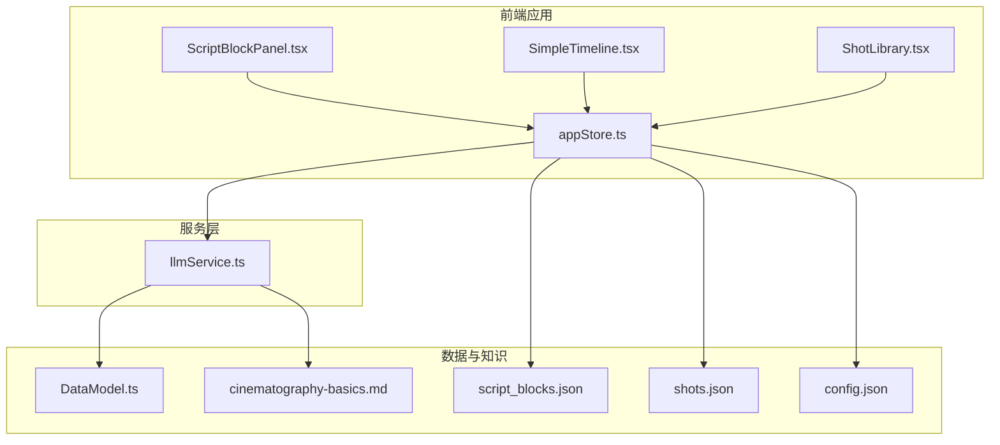
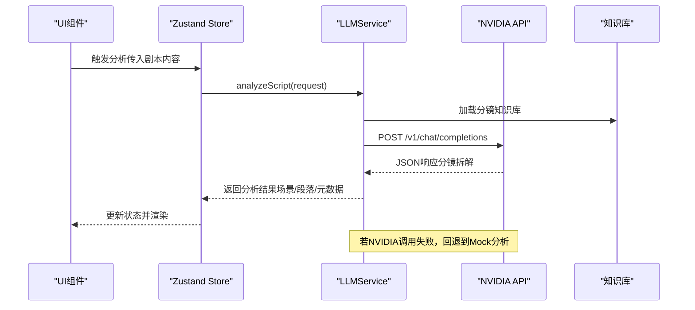
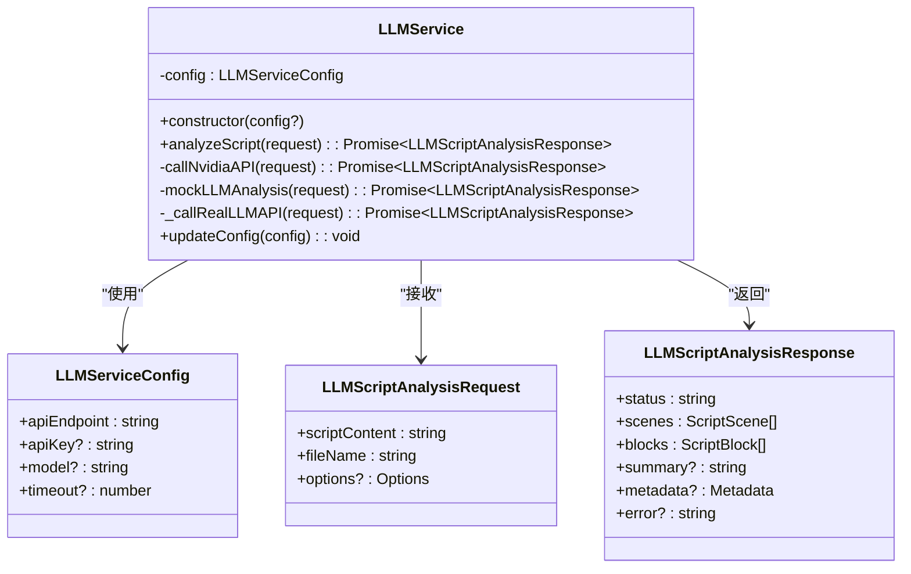
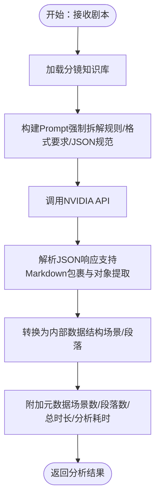
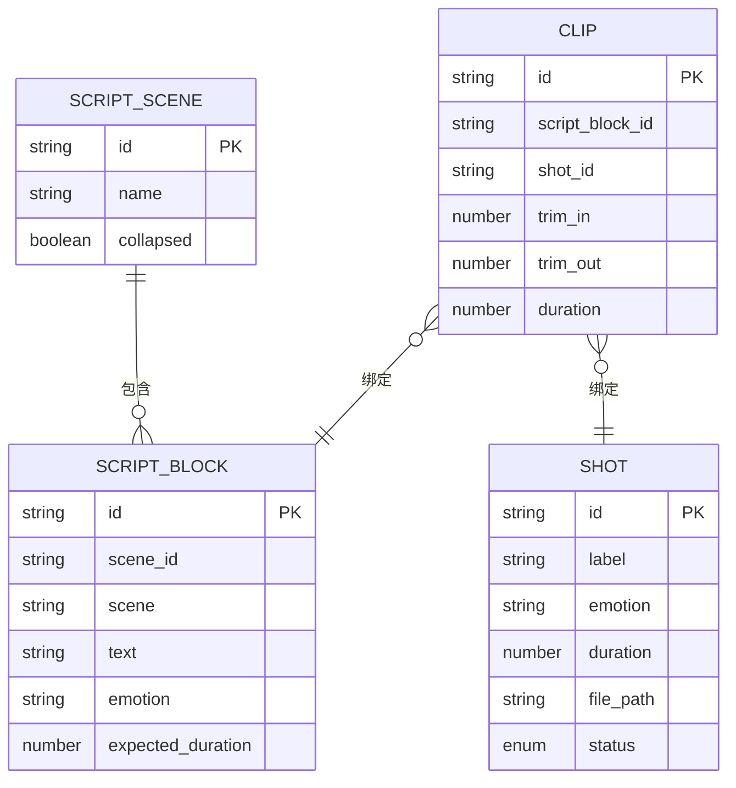
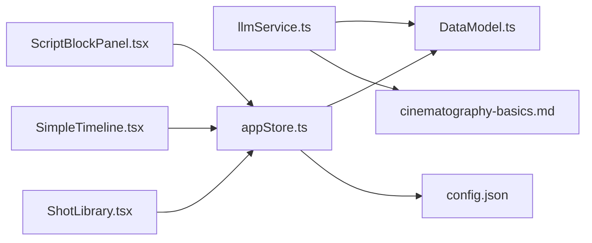

# LLM服务

<cite>
**本文档引用的文件**
- [README.md](file://README.md)
- [llmService.ts](file://src/services/llmService.ts)
- [cinematography-basics.md](file://knowledge/cinematography-basics.md)
- [DataModel.ts](file://src/types/DataModel.ts)
- [appStore.ts](file://src/store/appStore.ts)
- [ScriptBlockPanel.tsx](file://src/components/ScriptBlockPanel.tsx)
- [SimpleTimeline.tsx](file://src/components/SimpleTimeline.tsx)
- [ShotLibrary.tsx](file://src/components/ShotLibrary.tsx)
- [config.json](file://public/data/config.json)
- [script_blocks.json](file://public/data/script_blocks.json)
- [shots.json](file://public/data/shots.json)
- [llm-breakdown-tests.md](file://test-scenarios/llm-breakdown-tests.md)
- [package.json](file://package.json)
</cite>

## 目录
1. [简介](#简介)
2. [项目结构](#项目结构)
3. [核心组件](#核心组件)
4. [架构概览](#架构概览)
5. [详细组件分析](#详细组件分析)
6. [依赖分析](#依赖分析)
7. [性能考量](#性能考量)
8. [故障排查指南](#故障排查指南)
9. [结论](#结论)
10. [附录](#附录)

## 简介
本项目是一个“导演分镜验证MVP”工具，核心能力之一是通过LLM服务将剧本内容拆解为可执行的分镜镜头序列。该服务基于NVIDIA API，集成了专业的影视分镜知识库，确保输出符合景别、情绪、时长等专业标准，并提供Mock分析能力以保障MVP阶段的功能可用性。同时，系统还提供了完整的UI组件，支持剧本段落面板、简化时间轴、素材库等功能，帮助用户在30分钟内从剧本到可播放时间轴，快速发现节奏问题。

## 项目结构
项目采用前端React + TypeScript + Zustand的状态管理架构，数据持久化通过JSON文件与本地状态结合。LLM服务位于src/services目录，数据模型定义在src/types，状态管理在src/store，UI组件在src/components，知识库与测试场景分别位于knowledge与test-scenarios目录。

**图表来源**
- [ScriptBlockPanel.tsx](file://src/components/ScriptBlockPanel.tsx#L1-L285)
- [SimpleTimeline.tsx](file://src/components/SimpleTimeline.tsx#L1-L414)
- [ShotLibrary.tsx](file://src/components/ShotLibrary.tsx#L1-L359)
- [appStore.ts](file://src/store/appStore.ts#L1-L195)
- [llmService.ts](file://src/services/llmService.ts#L1-L476)
- [DataModel.ts](file://src/types/DataModel.ts#L1-L291)
- [config.json](file://public/data/config.json#L1-L6)
- [cinematography-basics.md](file://knowledge/cinematography-basics.md#L1-L366)
- [script_blocks.json](file://public/data/script_blocks.json#L1-L38)
- [shots.json](file://public/data/shots.json#L1-L83)

**章节来源**
- [README.md](file://README.md#L1-L181)
- [package.json](file://package.json#L1-L36)

## 核心组件
- LLM服务：负责调用NVIDIA API进行剧本分析，内置专业分镜知识库与Prompt工程，支持超时控制与错误回退至Mock分析。
- 数据模型：定义LLM请求/响应、剧本场景与段落、素材镜头、时间轴剪辑等核心数据结构。
- 状态管理：Zustand store集中管理剧本、场景、镜头、素材、播放状态等。
- UI组件：剧本段落面板、简化时间轴、素材库，支持时长对比、占位符创建、拖拽排序、裁剪等操作。
- 知识库与测试：专业的分镜知识库与测试用例，确保输出符合景别、情绪、时长等标准。

**章节来源**
- [llmService.ts](file://src/services/llmService.ts#L62-L476)
- [DataModel.ts](file://src/types/DataModel.ts#L58-L135)
- [appStore.ts](file://src/store/appStore.ts#L60-L195)
- [ScriptBlockPanel.tsx](file://src/components/ScriptBlockPanel.tsx#L1-L285)
- [SimpleTimeline.tsx](file://src/components/SimpleTimeline.tsx#L1-L414)
- [ShotLibrary.tsx](file://src/components/ShotLibrary.tsx#L1-L359)
- [cinematography-basics.md](file://knowledge/cinematography-basics.md#L1-L366)
- [llm-breakdown-tests.md](file://test-scenarios/llm-breakdown-tests.md#L1-L151)

## 架构概览
LLM服务作为核心分析引擎，接收剧本内容，结合知识库与Prompt工程，调用NVIDIA API生成分镜拆解结果；若API调用失败，则回退到Mock分析，保证MVP阶段功能可用。UI组件通过Zustand store与LLM服务交互，实时展示分析结果与时间轴预览。

**图表来源**
- [llmService.ts](file://src/services/llmService.ts#L72-L323)
- [cinematography-basics.md](file://knowledge/cinematography-basics.md#L1-L366)
- [appStore.ts](file://src/store/appStore.ts#L60-L195)

## 详细组件分析

### LLM服务（LLMService）
- 服务配置：支持自定义API端点、API密钥、模型名称与超时时间，默认使用NVIDIA API与Llama 3.1 405B模型，超时120秒。
- 分析流程：构建专业Prompt，调用NVIDIA API，解析JSON响应，转换为内部数据结构，附加元数据（场景数、段落数、总时长、分析耗时）。
- 错误处理：API调用失败时回退到Mock分析，模拟网络延迟，智能拆解段落，基于关键词识别情绪，估算时长。
- Mock分析：按段落拆分，检测场景标识，识别情绪标签，估算时长，生成场景与段落映射。
- 超时控制：AbortController与setTimeout组合，确保长时间请求不会阻塞主线程。
- JSON解析：支持Markdown代码块包裹与对象提取，增强鲁棒性。

**图表来源**
- [llmService.ts](file://src/services/llmService.ts#L42-L476)
- [DataModel.ts](file://src/types/DataModel.ts#L58-L84)

**章节来源**
- [llmService.ts](file://src/services/llmService.ts#L62-L476)
- [DataModel.ts](file://src/types/DataModel.ts#L58-L84)

### Prompt工程与知识库集成
- Prompt结构：明确强制拆解规则（每个场景至少3-10个镜头，禁止整段落作为1个镜头），镜头格式要求（景别开头、具体主体、动作/状态、情绪），JSON输出规范。
- 知识库内容：景别分类、摄像机角度、镜头运动、情绪标注系统、时长估算标准、分镜拆解原则、编写模板、场景拆解策略、常见错误与避免、实战拆解流程。
- 输出校验：最后检查清单确保每个场景的段落数量、文本格式、情绪与时长字段齐全。

**图表来源**
- [llmService.ts](file://src/services/llmService.ts#L109-L202)
- [cinematography-basics.md](file://knowledge/cinematography-basics.md#L1-L366)

**章节来源**
- [llmService.ts](file://src/services/llmService.ts#L109-L202)
- [cinematography-basics.md](file://knowledge/cinematography-basics.md#L1-L366)

### Mock分析功能
- 使用场景：MVP阶段、API不可用、开发调试。
- 实现原理：按段落拆分，检测场景标识，识别情绪标签（优先显式标签，其次关键词），估算时长（基于文本长度与内容类型），智能生成场景与段落映射。
- 优势：无需外部依赖，快速验证UI与流程。

**章节来源**
- [llmService.ts](file://src/services/llmService.ts#L329-L423)

### 数据模型与状态管理
- 数据模型：定义LLM请求/响应、剧本场景与段落、素材镜头、时间轴剪辑、播放状态、项目检查状态等。
- 状态管理：Zustand store集中管理数据与UI状态，提供计算函数（如时长计算、播放定位）、播放控制、素材管理等。
- UI集成：ScriptBlockPanel展示场景/段落与时长对比；SimpleTimeline支持拖拽排序、裁剪、播放预览；ShotLibrary支持情绪筛选、状态管理与替换。

**图表来源**
- [DataModel.ts](file://src/types/DataModel.ts#L90-L148)
- [appStore.ts](file://src/store/appStore.ts#L60-L195)

**章节来源**
- [DataModel.ts](file://src/types/DataModel.ts#L58-L148)
- [appStore.ts](file://src/store/appStore.ts#L60-L195)

### UI组件与交互
- 剧本段落面板：支持原文与LLM拆解双Tab，时长对比（期望vs实际），高亮当前播放段落，创建占位Clip。
- 简化时间轴：单轨布局，支持拖拽排序、删除、裁剪（预留接口），播放指示器与时间刻度标尺。
- 素材库：按情绪与状态筛选，支持替换、编辑、删除、标记为已处理，素材管理弹窗。

**章节来源**
- [ScriptBlockPanel.tsx](file://src/components/ScriptBlockPanel.tsx#L1-L285)
- [SimpleTimeline.tsx](file://src/components/SimpleTimeline.tsx#L1-L414)
- [ShotLibrary.tsx](file://src/components/ShotLibrary.tsx#L1-L359)

## 依赖分析
- 外部依赖：React、Zustand、@dnd-kit（拖拽）、Tailwind CSS（样式）、TypeScript（类型安全）。
- 内部依赖：LLM服务依赖数据模型与知识库；UI组件依赖Zustand store；store依赖数据模型与计算函数。
- 配置依赖：NVIDIA API端点、模型、超时；媒体服务器基础URL、预览质量等。

**图表来源**
- [llmService.ts](file://src/services/llmService.ts#L1-L476)
- [DataModel.ts](file://src/types/DataModel.ts#L1-L291)
- [appStore.ts](file://src/store/appStore.ts#L1-L195)
- [config.json](file://public/data/config.json#L1-L6)

**章节来源**
- [package.json](file://package.json#L14-L34)
- [llmService.ts](file://src/services/llmService.ts#L1-L476)
- [appStore.ts](file://src/store/appStore.ts#L1-L195)

## 性能考量
- 超时控制：默认120秒，避免长时间等待；AbortController及时中断请求。
- JSON解析优化：支持多种包裹与提取方式，减少解析失败风险。
- Mock分析：在开发与测试阶段提供快速反馈，降低对外部API的依赖。
- UI渲染：按需渲染与懒加载，避免大数据量时的卡顿。
- 状态管理：Zustand轻量高效，避免不必要的重渲染。

[本节为通用性能建议，不直接分析特定文件]

## 故障排查指南
- NVIDIA API错误：检查API端点、密钥与网络连接；查看响应状态与错误信息；确认模型名称正确。
- JSON解析失败：确认LLM返回的是纯JSON或被Markdown包裹的对象；检查最后检查清单（段落数量、格式、情绪与时长字段）。
- Mock分析异常：检查段落拆分逻辑、情绪识别关键词、时长估算公式；确保场景标识与段落格式一致。
- UI无响应：检查Zustand store状态更新、事件绑定与渲染逻辑；确认数据模型字段完整。

**章节来源**
- [llmService.ts](file://src/services/llmService.ts#L235-L262)
- [llmService.ts](file://src/services/llmService.ts#L319-L322)

## 结论
本LLM服务通过专业的Prompt工程与分镜知识库，实现了高质量的剧本拆解；结合Mock分析与完善的UI组件，能够在MVP阶段快速验证导演分镜方案。建议在生产环境中启用真实API调用，并持续优化Prompt与知识库，以提升拆解质量与稳定性。

[本节为总结性内容，不直接分析特定文件]

## 附录

### 服务配置选项
- API端点：NVIDIA API v1 chat completions
- API密钥：NVIDIA API Key
- 模型：Llama 3.1 405B
- 超时：120秒
- 配置文件：public/data/config.json（媒体服务器基础URL、预览质量）

**章节来源**
- [llmService.ts](file://src/services/llmService.ts#L42-L57)
- [config.json](file://public/data/config.json#L1-L6)

### API调用示例与响应处理
- 请求：POST /v1/chat/completions，消息包含system与user消息，temperature与top_p控制输出稳定性，max_tokens增加以支持长输出。
- 响应：解析choices[0].message.content中的JSON，支持Markdown包裹与对象提取，转换为内部数据结构并附加元数据。

**章节来源**
- [llmService.ts](file://src/services/llmService.ts#L204-L318)

### 测试场景与验收标准
- 测试用例：覆盖简单对话、紧张动作、复杂多场景，评估拆解粒度、专业术语、情绪准确性与时长合理性。
- 验收标准：所有测试用例通过（得分≥70），无“1段落”问题，镜头拆解符合专业标准，情绪标注准确，时长估算合理。

**章节来源**
- [llm-breakdown-tests.md](file://test-scenarios/llm-breakdown-tests.md#L1-L151)