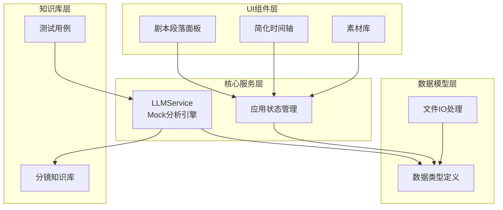
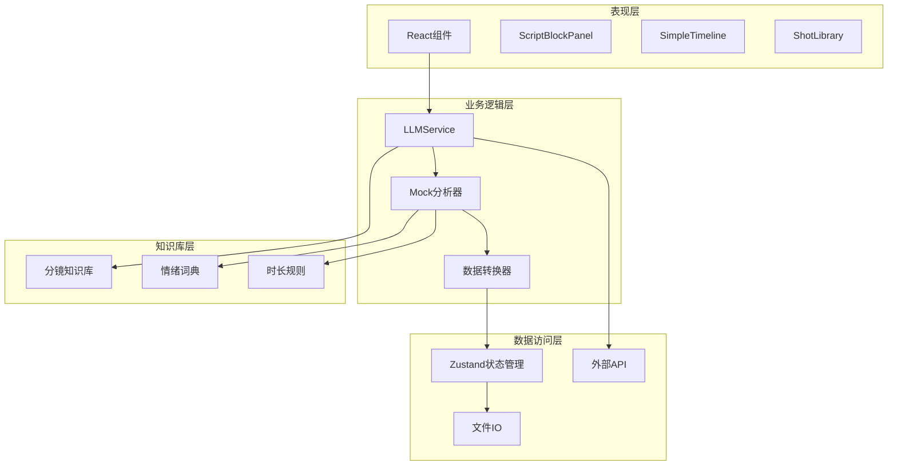
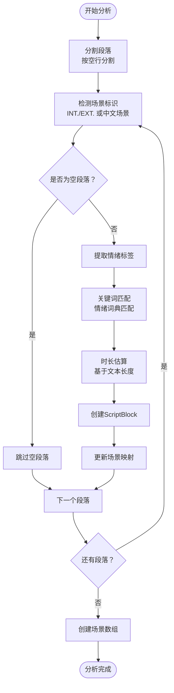
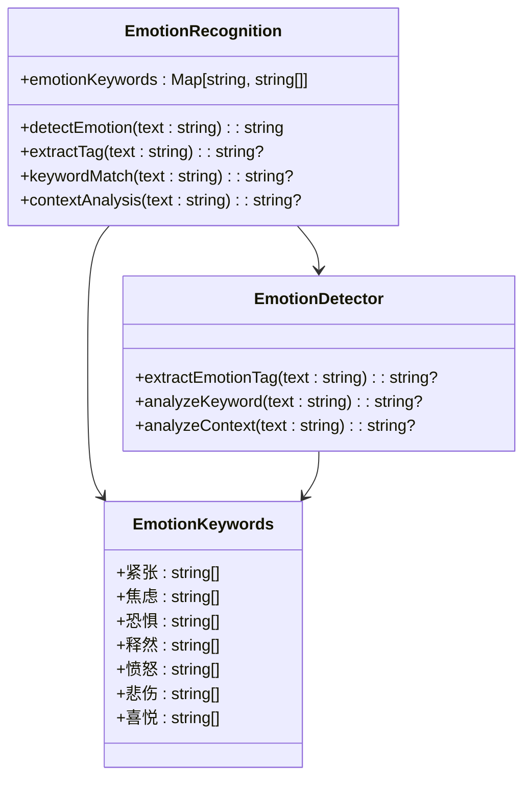
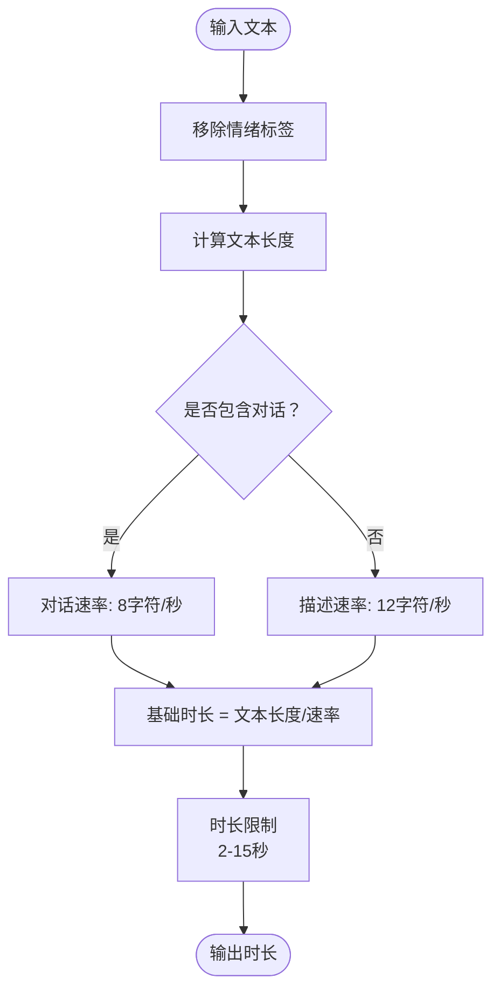
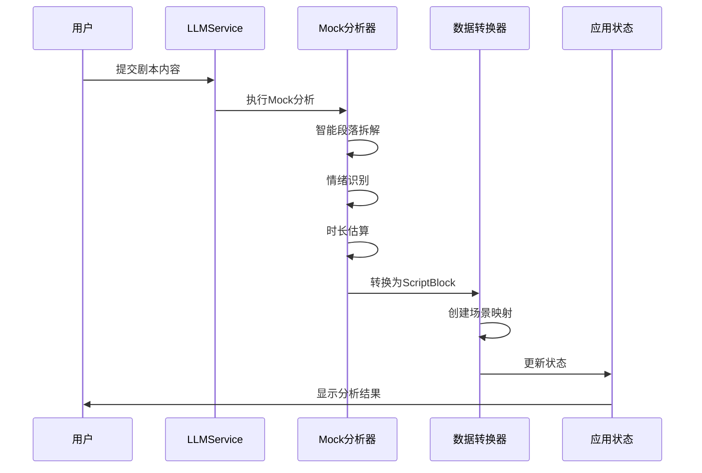

# Mock分析系统

<cite>
**本文档引用的文件**
- [README.md](file://README.md)
- [llmService.ts](file://src/services/llmService.ts)
- [DataModel.ts](file://src/types/DataModel.ts)
- [fileIO.ts](file://src/utils/fileIO.ts)
- [llm-breakdown-tests.md](file://test-scenarios/llm-breakdown-tests.md)
- [cinematography-basics.md](file://knowledge/cinematography-basics.md)
- [script_blocks.json](file://public/data/script_blocks.json)
- [shots.json](file://public/data/shots.json)
- [appStore.ts](file://src/store/appStore.ts)
- [ScriptBlockPanel.tsx](file://src/components/ScriptBlockPanel.tsx)
- [SimpleTimeline.tsx](file://src/components/SimpleTimeline.tsx)
- [ShotLibrary.tsx](file://src/components/ShotLibrary.tsx)
- [package.json](file://package.json)
</cite>

## 目录
1. [简介](#简介)
2. [项目结构](#项目结构)
3. [核心组件](#核心组件)
4. [架构概览](#架构概览)
5. [详细组件分析](#详细组件分析)
6. [依赖分析](#依赖分析)
7. [性能考虑](#性能考虑)
8. [故障排除指南](#故障排除指南)
9. [结论](#结论)
10. [附录](#附录)

## 简介
Mock分析系统是一个专业的导演分镜验证工具，用于在分镜阶段快速验证剧本段落×镜头组合×实际节奏是否成立。该系统实现了智能的Mock分析功能，能够将原始剧本内容转换为标准的ScriptBlock和ScriptScene格式，提供智能段落拆解、场景识别、情绪自动标注和时长估算等核心能力。

系统采用MVP（最小可行产品）设计理念，专注于导演分镜验证的核心需求，提供快速的节奏验证和镜头情绪匹配功能。通过Mock分析，用户可以在没有真实LLM API的情况下，依然获得高质量的分镜拆解结果。

## 项目结构
项目采用模块化的前端架构，主要包含以下核心模块：



**图表来源**
- [llmService.ts](file://src/services/llmService.ts#L62-L476)
- [DataModel.ts](file://src/types/DataModel.ts#L59-L135)
- [appStore.ts](file://src/store/appStore.ts#L60-L195)

**章节来源**
- [README.md](file://README.md#L126-L150)
- [package.json](file://package.json#L14-L34)

## 核心组件
Mock分析系统的核心由以下几个关键组件构成：

### 1. LLMService - Mock分析引擎
LLMService是系统的核心分析组件，负责将原始剧本内容转换为专业的分镜镜头序列。它实现了完整的Mock分析流程，包括智能段落拆解、场景识别、情绪标注和时长估算。

### 2. 数据模型系统
系统定义了完整的数据结构体系，包括ScriptBlock（剧本段落）、ScriptScene（场景）、Shot（镜头素材）等核心数据类型，确保分析结果的标准化和一致性。

### 3. 知识库系统
内置了专业的影视分镜知识库，包含镜头景别分类、情绪标注系统、时长估算标准等专业标准，为Mock分析提供权威的指导原则。

### 4. UI交互组件
提供直观的用户界面，包括剧本段落面板、简化时间轴和素材库，支持实时的分镜验证和镜头替换操作。

**章节来源**
- [llmService.ts](file://src/services/llmService.ts#L62-L101)
- [DataModel.ts](file://src/types/DataModel.ts#L86-L135)
- [cinematography-basics.md](file://knowledge/cinematography-basics.md#L1-L366)

## 架构概览
系统采用分层架构设计，各层职责清晰，耦合度低，便于维护和扩展：



**图表来源**
- [appStore.ts](file://src/store/appStore.ts#L1-L195)
- [llmService.ts](file://src/services/llmService.ts#L62-L476)
- [ScriptBlockPanel.tsx](file://src/components/ScriptBlockPanel.tsx#L9-L285)

## 详细组件分析

### Mock分析引擎实现
Mock分析引擎是系统的核心，实现了完整的剧本分析流程：

#### 智能段落拆解算法
系统采用多级拆解策略，将连续的剧本文本转换为独立的叙事单元：



**图表来源**
- [llmService.ts](file://src/services/llmService.ts#L329-L423)

#### 情绪识别算法
系统实现了多层次的情绪识别机制：



**图表来源**
- [llmService.ts](file://src/services/llmService.ts#L355-L377)

#### 时长估算机制
系统采用基于内容类型的时长估算算法：



**图表来源**
- [llmService.ts](file://src/services/llmService.ts#L379-L383)

### 数据结构转换过程
Mock分析系统实现了从原始剧本到标准数据结构的完整转换流程：



**图表来源**
- [llmService.ts](file://src/services/llmService.ts#L329-L423)
- [DataModel.ts](file://src/types/DataModel.ts#L86-L135)

### Mock分析的性能特点
Mock分析系统具有以下性能特征：

#### 时间复杂度分析
- **段落拆解**: O(n)，其中n为段落数量
- **场景识别**: O(m)，其中m为文本字符数
- **情绪识别**: O(k)，其中k为关键词匹配次数
- **时长估算**: O(1)，常数时间复杂度

#### 空间复杂度分析
- **内存使用**: O(n + m + k)，主要用于存储段落、场景和关键词数据
- **实时性**: 分析时间通常在几百毫秒内完成，适合实时交互

**章节来源**
- [llmService.ts](file://src/services/llmService.ts#L329-L423)
- [DataModel.ts](file://src/types/DataModel.ts#L198-L291)

## 依赖分析
系统依赖关系清晰，主要依赖包括：

```mermaid
graph TB
subgraph "运行时依赖"
React[React 18.3.1]
Zustand[Zustand 4.5.0]
DnDKit[@dnd-kit 6.1.0]
end
subgraph "开发依赖"
TypeScript[TypeScript 5.6.3]
Vite[Vite 5.4.11]
TailwindCSS[Tailwind CSS 3.4.17]
end
subgraph "核心功能"
LLMService[LLMService]
AppStore[应用状态]
Components[UI组件]
end
React --> Components
Zustand --> AppStore
DnDKit --> Components
LLMService --> AppStore
Components --> AppStore
```

**图表来源**
- [package.json](file://package.json#L14-L34)
- [llmService.ts](file://src/services/llmService.ts#L1-L476)

**章节来源**
- [package.json](file://package.json#L14-L34)

## 性能考虑
Mock分析系统在性能方面具有以下特点：

### 优势特性
1. **实时响应**: Mock分析在数百毫秒内完成，提供流畅的用户体验
2. **内存效率**: 采用增量处理策略，避免大量内存占用
3. **可扩展性**: 模块化设计便于功能扩展和性能优化
4. **容错性强**: 具备完善的错误处理和回退机制

### 性能优化策略
1. **懒加载**: UI组件按需加载，减少初始启动时间
2. **状态缓存**: 应用状态持久化，避免重复计算
3. **批量更新**: 批量处理数据更新，提高效率
4. **虚拟滚动**: 大数据集采用虚拟滚动技术

### 局限性分析
1. **准确性限制**: Mock分析相比真实LLM存在一定差距
2. **上下文理解**: 缺乏深层语义理解和上下文分析能力
3. **创意性不足**: 无法产生超出知识库框架的创新镜头
4. **个性化程度**: 无法根据特定项目风格进行定制

## 故障排除指南
系统提供了完善的错误处理和调试机制：

### 常见问题诊断
1. **分析失败**: 检查网络连接和API密钥配置
2. **结果异常**: 验证剧本格式和场景标识
3. **性能问题**: 监控内存使用和计算时间
4. **UI显示异常**: 检查状态同步和事件处理

### 调试工具
1. **控制台日志**: 详细的分析过程日志记录
2. **状态监控**: 实时查看应用状态变化
3. **性能分析**: 分析计算时间和内存使用
4. **错误追踪**: 完整的错误堆栈信息

**章节来源**
- [llmService.ts](file://src/services/llmService.ts#L94-L100)
- [llmService.ts](file://src/services/llmService.ts#L319-L322)

## 结论
Mock分析系统是一个功能完备、设计合理的导演分镜验证工具。通过智能的Mock分析算法，系统能够在MVP阶段提供接近专业的分镜拆解能力，满足导演在早期创作阶段的节奏验证需求。

系统的主要优势包括：
- **专业性**: 基于完整的影视分镜知识库
- **易用性**: 直观的用户界面和交互设计
- **实时性**: 快速的分析响应和更新
- **可扩展性**: 清晰的架构便于功能扩展

未来的发展方向包括：
- 集成真实LLM API以提升分析质量
- 增强上下文理解和创意生成能力
- 扩展多语言支持和个性化配置
- 优化性能和用户体验

## 附录

### 测试用例验证
系统提供了完整的测试用例，验证Mock分析的功能正确性：

| 测试场景 | 预期镜头数 | 情绪标注 | 时长估算 |
|---------|-----------|---------|---------|
| 简单对话 | 5-6个 | 平静、犹豫 | 20-30秒 |
| 紧张动作 | 7-10个 | 紧张、恐惧 | 30-40秒 |
| 复杂多场景 | 15-20个 | 愤怒→焦虑→释然 | 90-120秒 |

### 数据格式规范
系统支持的标准数据格式包括：

**ScriptBlock格式**:
```json
{
  "id": "string",
  "scene_id": "string",
  "scene": "string",
  "text": "string",
  "emotion": "string",
  "expected_duration": number
}
```

**ScriptScene格式**:
```json
{
  "id": "string",
  "name": "string",
  "blocks": ScriptBlock[],
  "collapsed": boolean
}
```

**章节来源**
- [llm-breakdown-tests.md](file://test-scenarios/llm-breakdown-tests.md#L8-L81)
- [DataModel.ts](file://src/types/DataModel.ts#L86-L135)