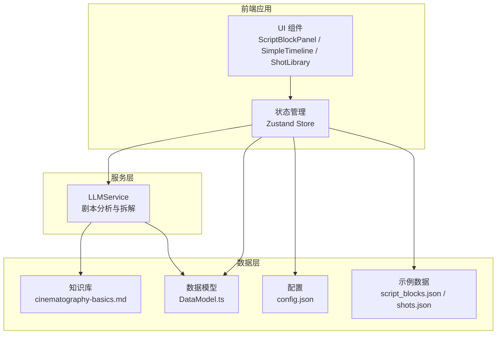
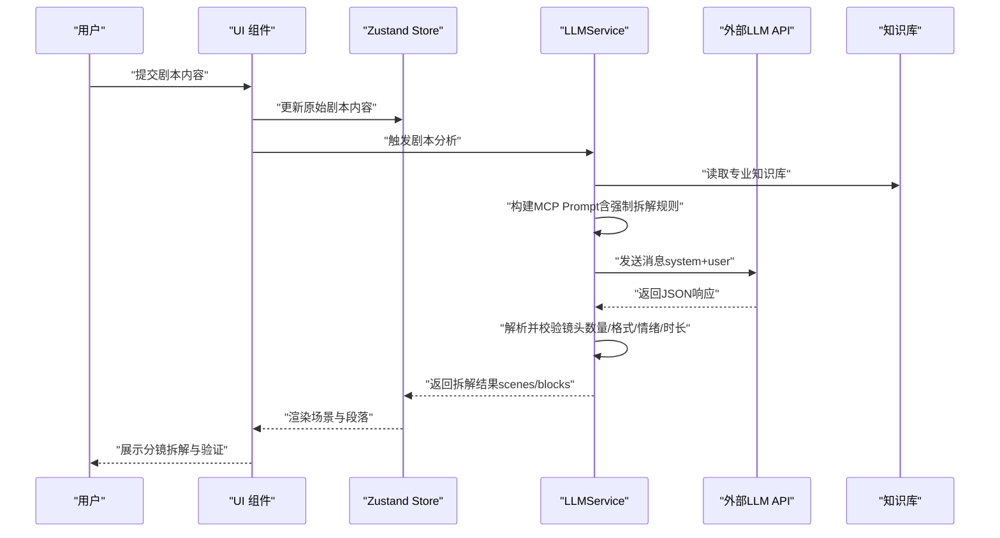
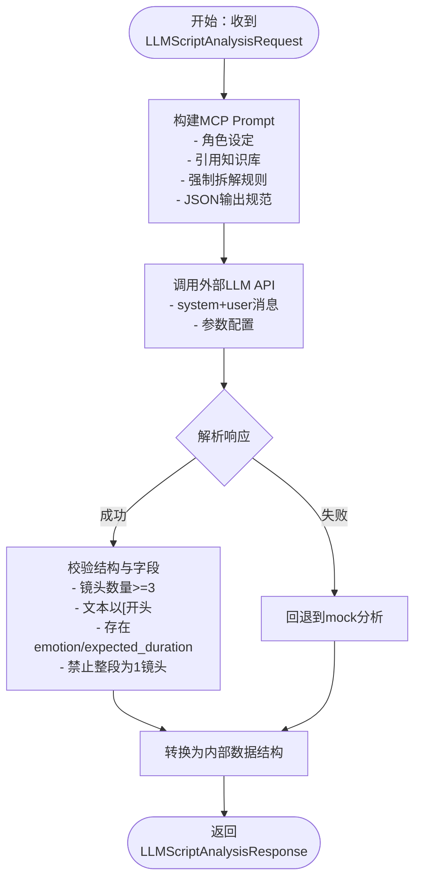
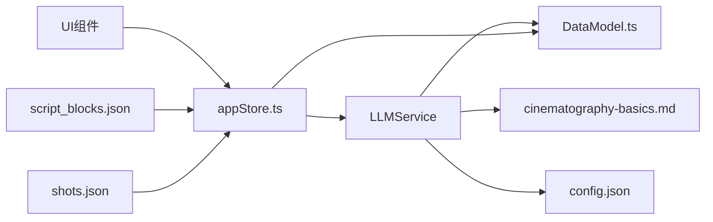

# Prompt工程

<cite>
**本文引用的文件**
- [README.md](file://README.md)
- [llmService.ts](file://src/services/llmService.ts)
- [cinematography-basics.md](file://knowledge/cinematography-basics.md)
- [DataModel.ts](file://src/types/DataModel.ts)
- [appStore.ts](file://src/store/appStore.ts)
- [llm-breakdown-tests.md](file://test-scenarios/llm-breakdown-tests.md)
- [config.json](file://public/data/config.json)
- [script_blocks.json](file://public/data/script_blocks.json)
- [shots.json](file://public/data/shots.json)
- [USAGE_GUIDE.md](file://USAGE_GUIDE.md)
</cite>

## 目录
1. [简介](#简介)
2. [项目结构](#项目结构)
3. [核心组件](#核心组件)
4. [架构总览](#架构总览)
5. [详细组件分析](#详细组件分析)
6. [依赖分析](#依赖分析)
7. [性能考量](#性能考量)
8. [故障排查指南](#故障排查指南)
9. [结论](#结论)
10. [附录](#附录)

## 简介
本文件围绕“导演分镜验证工具”的LLM剧本分析能力，系统阐述Prompt工程的设计与实现，重点解释Master Camera Plan（MCP）模式与强制拆解规则，以及Prompt的结构组成、约束与验证机制，并提供优化策略、调试方法与扩展方案。目标读者既包括技术工程师，也包括非技术用户，力求以循序渐进的方式帮助理解与使用。

## 项目结构
该项目采用前端React/Vite + TypeScript + Zustand的状态管理，核心功能围绕“剧本段落”“时间轴”“素材库”三大模块展开；LLM剧本分析由独立的服务类负责，通过外部API调用实现。

图表来源
- [llmService.ts](file://src/services/llmService.ts#L1-L476)
- [DataModel.ts](file://src/types/DataModel.ts#L59-L135)
- [cinematography-basics.md](file://knowledge/cinematography-basics.md#L1-L366)
- [config.json](file://public/data/config.json#L1-L6)
- [script_blocks.json](file://public/data/script_blocks.json#L1-L38)
- [shots.json](file://public/data/shots.json#L1-L83)

章节来源
- [README.md](file://README.md#L126-L150)
- [USAGE_GUIDE.md](file://USAGE_GUIDE.md#L1-L126)

## 核心组件
- LLMService：封装LLM调用、Prompt构建、响应解析与回退策略，提供剧本分析与拆解能力。
- 知识库：提供景别、镜头运动、情绪标注、时长估算、拆解策略等专业标准。
- 数据模型：定义ScriptBlock、ScriptScene、Shot、Clip等核心数据结构，支撑UI与业务逻辑。
- 状态管理：Zustand Store集中管理剧本、时间轴、素材、播放状态等。

章节来源
- [llmService.ts](file://src/services/llmService.ts#L62-L476)
- [cinematography-basics.md](file://knowledge/cinematography-basics.md#L1-L366)
- [DataModel.ts](file://src/types/DataModel.ts#L86-L148)
- [appStore.ts](file://src/store/appStore.ts#L1-L195)

## 架构总览
下面的时序图展示了从用户输入剧本到得到分镜拆解结果的关键流程，以及关键的约束与验证步骤。

图表来源
- [llmService.ts](file://src/services/llmService.ts#L106-L323)
- [cinematography-basics.md](file://knowledge/cinematography-basics.md#L1-L366)
- [DataModel.ts](file://src/types/DataModel.ts#L72-L109)

## 详细组件分析

### LLMService：MCP Prompt设计与实现
- 角色设定：以资深导演/分镜师身份，强调专业性与纪律性，确保对每个场景进行“强制拆解”。
- 知识库引用：将知识库内容注入Prompt，使LLM具备景别、镜头运动、情绪标注、时长估算、拆解策略等专业背景。
- 强制拆解规则：
  - 镜头数量：每个场景至少3个、至多10个；对话/动作/情感场景分别给出最小镜头数。
  - 금지行为：禁止将整段作为1个镜头、一句话作为1个镜头、少于3个镜头。
  - 格式要求：每个镜头必须以景别开头（如“[特写]”），并包含主体、动作/状态、情绪。
  - 输出规范：严格要求返回纯JSON，包含scenes/blocks结构，每个block包含text、emotion、expected_duration等字段。
- 参数与稳定性：
  - temperature与top_p设置为较低值，提升输出稳定性与一致性。
  - max_tokens适当增大，以容纳较长的分镜序列。
  - 超时控制与AbortController，防止长时间等待。
- 响应解析与校验：
  - 去除Markdown代码块标记，提取JSON对象。
  - 校验scenes与blocks数量、格式、情绪与时长字段是否存在。
  - 回退策略：API失败时使用mock分析，保证MVP可用性。

图表来源
- [llmService.ts](file://src/services/llmService.ts#L106-L323)
- [llmService.ts](file://src/services/llmService.ts#L329-L423)

章节来源
- [llmService.ts](file://src/services/llmService.ts#L106-L323)
- [llmService.ts](file://src/services/llmService.ts#L329-L423)

### 知识库：专业标准与拆解策略
- 镜头景别：提供LS/WS/MS/CU/ECU的定义、典型时长与适用情绪，作为拆解与时长估算的基础。
- 情绪与镜头关系：将情绪与景别、角度、运动等镜头语言关联，指导镜头选择与节奏控制。
- 场景拆解标准：对话/动作/情感场景的镜头数量区间与拆解策略，确保叙事完整性与节奏变化。
- 镜头编写格式：统一的“[景别] 主体 + 动作/状态 + 情感表现”格式，便于后续解析与一致性校验。
- 时长估算：基于景别与时长区间、对白/动作/情感等要素的综合估算方法。

章节来源
- [cinematography-basics.md](file://knowledge/cinematography-basics.md#L20-L177)

### 数据模型：结构化输出与约束
- ScriptScene：场景实体，包含id/name/blocks/collapsed等字段。
- ScriptBlock：段落实体，包含id/scene_id/scene/text/emotion/expected_duration等，其中expected_duration用于时长验证。
- Shot：素材镜头实体，包含id/label/emotion/duration/file_path/status等，用于素材库筛选与替换。
- Clip：时间轴镜头实例，包含trim_in/trim_out/duration等，支持裁剪与替换。

章节来源
- [DataModel.ts](file://src/types/DataModel.ts#L86-L148)

### 状态管理与UI集成
- Zustand Store集中管理scriptBlocks/scriptScenes/shots/clips/mediaLibrary/originalScriptContent等状态。
- 提供播放状态、选择状态、项目检查等功能，支撑UI交互与验证。
- 与LLMService协作，接收拆解结果并驱动UI渲染。

章节来源
- [appStore.ts](file://src/store/appStore.ts#L1-L195)

### 测试与验收：Prompt效果评估
- 测试用例覆盖简单对话、紧张动作、复杂多场景三类，明确场景数、镜头数、景别多样性、情绪标注与时长估算的预期。
- 评估标准包含拆解粒度、专业术语使用、情绪准确性与时长合理性四个维度，满分为100分，及格线为70分。
- 提供测试执行记录与迭代优化记录，便于持续改进Prompt与规则。

章节来源
- [llm-breakdown-tests.md](file://test-scenarios/llm-breakdown-tests.md#L1-L151)

## 依赖分析
- LLMService依赖：
  - 知识库：cinematography-basics.md，提供专业标准与拆解策略。
  - 数据模型：DataModel.ts，定义输入/输出结构。
  - 配置：config.json，提供媒体服务器基础URL等运行时配置。
  - 示例数据：script_blocks.json与shots.json，用于演示与验证。
- 组件耦合：
  - LLMService与知识库强耦合（Prompt中直接引用知识库内容）。
  - Store与LLMService弱耦合（通过调用接口与状态同步）。
  - UI与Store弱耦合（通过Zustand订阅状态变化）。

图表来源
- [llmService.ts](file://src/services/llmService.ts#L1-L476)
- [DataModel.ts](file://src/types/DataModel.ts#L59-L135)
- [config.json](file://public/data/config.json#L1-L6)
- [script_blocks.json](file://public/data/script_blocks.json#L1-L38)
- [shots.json](file://public/data/shots.json#L1-L83)

章节来源
- [llmService.ts](file://src/services/llmService.ts#L1-L476)
- [DataModel.ts](file://src/types/DataModel.ts#L59-L135)
- [config.json](file://public/data/config.json#L1-L6)

## 性能考量
- Prompt体积与token上限：通过增大max_tokens与合理组织知识库内容，确保长剧本也能被完整拆解。
- 超时与中断：使用AbortController与timeout，避免长时间阻塞；API失败时快速回退到mock分析，保障用户体验。
- 解析健壮性：对LLM响应进行多步提取与校验，减少格式异常带来的解析失败。
- UI渲染：在Store中聚合数据，避免频繁重渲染；仅在必要时触发状态更新。

章节来源
- [llmService.ts](file://src/services/llmService.ts#L204-L323)
- [llmService.ts](file://src/services/llmService.ts#L329-L423)

## 故障排查指南
- API调用失败：
  - 检查API端点与密钥配置是否正确。
  - 查看控制台错误信息与HTTP状态码。
  - 确认网络连接与跨域设置。
- JSON解析失败：
  - 确认LLM返回的是纯JSON，去除Markdown代码块标记。
  - 检查响应中是否包含合法的JSON对象。
- 拆解不符合规则：
  - 确认Prompt中强制拆解规则与格式要求未被忽略。
  - 检查知识库内容是否正确注入。
- 时长与情绪缺失：
  - 确保每个镜头都包含emotion与expected_duration字段。
  - 校验时长估算是否符合景别与时长区间。

章节来源
- [llmService.ts](file://src/services/llmService.ts#L204-L323)
- [llm-breakdown-tests.md](file://test-scenarios/llm-breakdown-tests.md#L84-L100)

## 结论
本项目通过“MCP模式+强制拆解规则”的Prompt设计，结合专业知识库与严格的输出规范，实现了高质量的剧本分镜拆解。其核心优势在于：
- 明确的镜头数量与格式约束，避免“整段为一镜”的常见问题；
- 以知识库为依据的专业标准，确保拆解符合影视叙事逻辑；
- 完善的解析与校验机制，提升鲁棒性；
- 可回退的mock分析，保障MVP可用性。

建议在后续迭代中持续优化Prompt与规则，完善测试用例与评估体系，并探索多语言与多风格的定制能力。

## 附录

### Prompt结构组成与约束清单
- 角色设定：以资深导演/分镜师身份，强调专业性与纪律性。
- 知识库引用：包含景别、镜头运动、情绪标注、时长估算、拆解策略等。
- 强制拆解规则：
  - 镜头数量：每个场景至少3个、至多10个；对话/动作/情感场景分别给出最小镜头数。
  - 禁止行为：整段为1镜头、一句话为1镜头、少于3个镜头。
  - 格式要求：以景别开头，包含主体、动作/状态、情绪。
  - JSON输出：scenes/blocks结构，包含text、emotion、expected_duration等字段。
- 验证机制：最后检查清单，确保每个场景的镜头数、格式、字段完整性。

章节来源
- [llmService.ts](file://src/services/llmService.ts#L109-L202)

### Prompt优化策略与调试方法
- 参数调优：
  - temperature与top_p：维持较低值以提升稳定性。
  - max_tokens：根据剧本长度动态调整，确保完整拆解。
  - 超时：合理设置timeout，避免长时间等待。
- 效果评估：
  - 使用测试用例覆盖不同场景类型，统计场景数、镜头数、情绪标注与时长估算的准确性。
  - 采用四维评分体系：拆解粒度、专业术语、情绪准确性、时长合理性。
- 迭代改进：
  - 基于测试反馈逐步调整Prompt措辞与规则表述。
  - 增加示例与边界情况说明，提升LLM对复杂场景的处理能力。
- 扩展与定制：
  - 支持多语言与多风格的Prompt模板，通过配置切换。
  - 允许用户自定义知识库片段，适配特定项目风格或品牌标准。

章节来源
- [llm-breakdown-tests.md](file://test-scenarios/llm-breakdown-tests.md#L84-L151)
- [llmService.ts](file://src/services/llmService.ts#L226-L228)