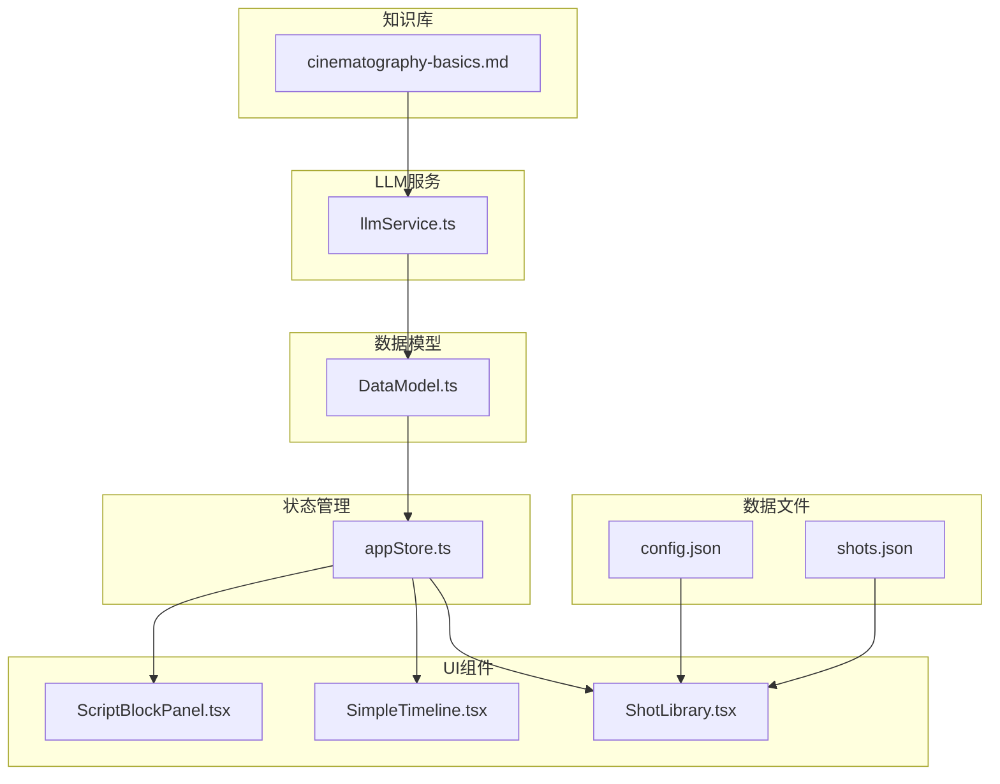
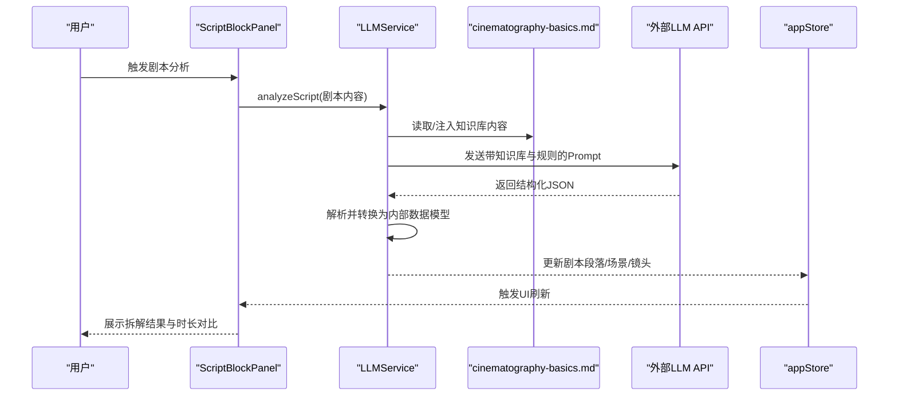
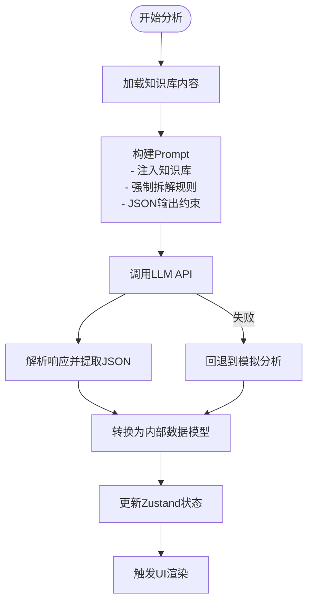
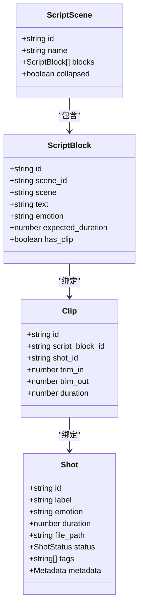
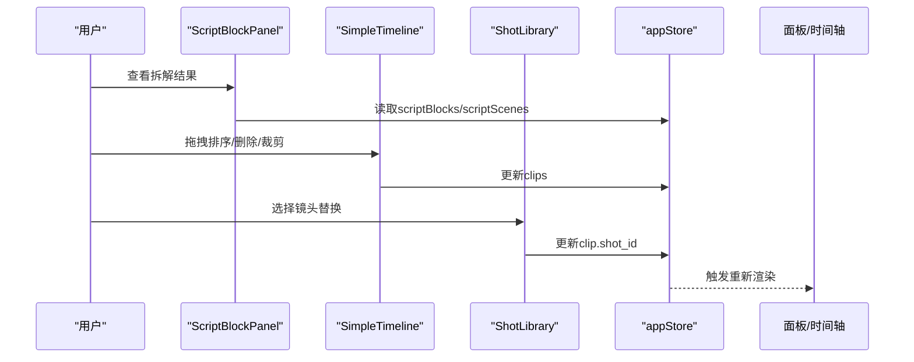
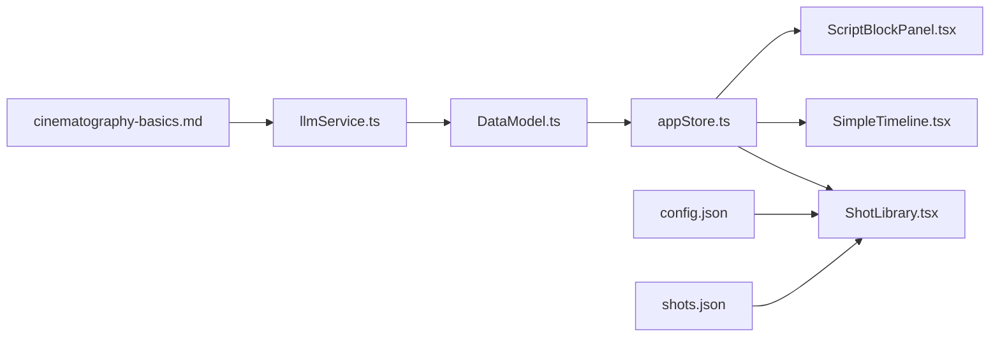

# 知识库集成

<cite>
**本文档引用的文件**
- [README.md](file://README.md)
- [cinematography-basics.md](file://knowledge/cinematography-basics.md)
- [config.json](file://public/data/config.json)
- [shots.json](file://public/data/shots.json)
- [llmService.ts](file://src/services/llmService.ts)
- [DataModel.ts](file://src/types/DataModel.ts)
- [appStore.ts](file://src/store/appStore.ts)
- [fileIO.ts](file://src/utils/fileIO.ts)
- [ScriptBlockPanel.tsx](file://src/components/ScriptBlockPanel.tsx)
- [ShotLibrary.tsx](file://src/components/ShotLibrary.tsx)
- [SimpleTimeline.tsx](file://src/components/SimpleTimeline.tsx)
- [llm-breakdown-tests.md](file://test-scenarios/llm-breakdown-tests.md)
</cite>

## 目录
1. [简介](#简介)
2. [项目结构](#项目结构)
3. [核心组件](#核心组件)
4. [架构总览](#架构总览)
5. [详细组件分析](#详细组件分析)
6. [依赖关系分析](#依赖关系分析)
7. [性能考量](#性能考量)
8. [故障排查指南](#故障排查指南)
9. [结论](#结论)
10. [附录](#附录)

## 简介
本项目“导演分镜验证工具”旨在帮助导演在分镜阶段快速验证“剧本段落 × 镜头组合 × 实际节奏”的一致性，并在30分钟内从剧本到可播放时间轴，及时发现节奏问题。项目采用“知识库驱动 + LLM分析”的方式，将影视分镜的专业知识转化为可执行的Prompt指令，从而实现对剧本的结构化拆解与镜头分配。

本章节围绕“知识库集成”主题，系统阐述：
- 影视分镜专业知识库的结构与内容（景别分类、情绪与镜头关系、场景拆解标准等）
- 知识库在LLM分析中的作用机制与Prompt构建
- 知识库的组织结构与更新维护策略
- 知识库扩展与定制方法（新增镜头类型、调整情绪分类、修改拆解规则）
- 知识库版本管理与兼容性处理机制

## 项目结构
项目采用前端React + TypeScript + Zustand的状态管理，数据以JSON文件形式存储在public/data目录，通过自定义的文件IO模块进行加载与持久化。核心模块包括：
- 知识库：位于knowledge目录，提供分镜专业知识
- LLM服务：封装与外部LLM API交互，负责将剧本拆解为镜头序列
- 数据模型：定义剧本段落、场景、镜头、时间轴等核心数据结构
- UI组件：剧本段落面板、简化时间轴、素材库等
- 状态管理：Zustand store集中管理应用状态与业务逻辑

图表来源
- [cinematography-basics.md](file://knowledge/cinematography-basics.md#L1-L366)
- [llmService.ts](file://src/services/llmService.ts#L1-L476)
- [DataModel.ts](file://src/types/DataModel.ts#L1-L291)
- [appStore.ts](file://src/store/appStore.ts#L1-L195)
- [ScriptBlockPanel.tsx](file://src/components/ScriptBlockPanel.tsx#L1-L285)
- [SimpleTimeline.tsx](file://src/components/SimpleTimeline.tsx#L1-L414)
- [ShotLibrary.tsx](file://src/components/ShotLibrary.tsx#L1-L359)
- [config.json](file://public/data/config.json#L1-L6)
- [shots.json](file://public/data/shots.json#L1-L83)

章节来源
- [README.md](file://README.md#L1-L181)
- [config.json](file://public/data/config.json#L1-L6)
- [shots.json](file://public/data/shots.json#L1-L83)

## 核心组件
- 知识库：提供景别分类、情绪标注、时长估算、场景拆解原则、拆解模板与实战流程等专业标准
- LLM服务：将知识库注入到Prompt中，强制拆解规则与格式约束，输出结构化的镜头序列
- 数据模型：定义ScriptBlock、ScriptScene、Shot、Clip等核心实体及其关系
- 状态管理：集中管理剧本、镜头、时间轴、素材库、播放状态等
- UI组件：分别负责剧本段落展示、时间轴编辑与预览、素材库筛选与替换

章节来源
- [cinematography-basics.md](file://knowledge/cinematography-basics.md#L1-L366)
- [llmService.ts](file://src/services/llmService.ts#L1-L476)
- [DataModel.ts](file://src/types/DataModel.ts#L1-L291)
- [appStore.ts](file://src/store/appStore.ts#L1-L195)

## 架构总览
LLM服务在分析剧本时，会将“知识库内容”注入到Prompt中，并附加严格的拆解规则与输出格式约束。随后，LLM返回结构化数据，由服务层解析并转换为应用内部的数据模型，再通过Zustand store分发给UI组件。

图表来源
- [llmService.ts](file://src/services/llmService.ts#L72-L323)
- [cinematography-basics.md](file://knowledge/cinematography-basics.md#L1-L366)
- [ScriptBlockPanel.tsx](file://src/components/ScriptBlockPanel.tsx#L1-L285)
- [appStore.ts](file://src/store/appStore.ts#L1-L195)

## 详细组件分析

### 知识库内容与结构
知识库以Markdown形式组织，涵盖以下核心领域：
- 镜头景别分类：远景、全景、中景、近景、特写，含典型时长与情绪表达
- 摄像机角度与运动：平视、俯拍、仰拍、鸟瞰、荷兰角度；推拉摇移升降
- 情绪标注系统：紧张、焦虑、恐惧、释然、平静、愤怒、悲伤、喜悦
- 时长估算标准：基于景别与时长的基准值，结合内容类型进行系数调整
- 分镜拆解原则：完整性、主体明确、情绪传递、节奏控制
- 分镜编写模板：标准格式与示例
- 场景拆解策略：单场景与多场景串联的标准
- 常见错误与避免：镜头过长、景别单调、情绪不明、拆分过细
- 实战拆解流程：场景识别、镜头数量、设计序列、标注信息、整体审查
- 关键术语对照表：中英文与缩写对照

章节来源
- [cinematography-basics.md](file://knowledge/cinematography-basics.md#L1-L366)

### LLM服务与知识库集成
LLM服务将知识库内容嵌入到Prompt中，并附加强制拆解规则与JSON输出格式约束，确保LLM输出符合应用的数据模型。关键点包括：
- 知识库注入：将知识库内容作为系统提示的一部分
- 拆解规则：强制每个场景至少3-10个镜头，禁止整段落作为单一镜头
- 输出格式：严格要求JSON结构，包含场景、段落、文本、情绪、时长等字段
- 错误处理：API失败时回退到模拟分析，保证MVP可用性
- 配置管理：支持API端点、密钥、模型、超时等参数

图表来源
- [llmService.ts](file://src/services/llmService.ts#L72-L323)

章节来源
- [llmService.ts](file://src/services/llmService.ts#L1-L476)

### 数据模型与知识库映射
数据模型中的实体与知识库紧密对应：
- ScriptBlock：对应知识库中的“镜头描述”，包含文本、情绪、时长
- ScriptScene：对应知识库中的“场景”，包含多个段落
- Shot：对应知识库中的“镜头类型”，包含景别、情绪、时长
- Clip：对应时间轴上的镜头实例，绑定ScriptBlock与Shot

图表来源
- [DataModel.ts](file://src/types/DataModel.ts#L86-L148)

章节来源
- [DataModel.ts](file://src/types/DataModel.ts#L1-L291)

### UI组件与知识库联动
- 剧本段落面板：展示LLM拆解后的场景与段落，支持原文与拆解结果双Tab切换，实时显示期望时长与实际时长对比
- 简化时间轴：单轨布局，支持拖拽排序、删除、裁剪；显示时间刻度与播放指示器
- 素材库：按情绪筛选镜头，支持替换时间轴中的Clip；支持素材路径配置与状态管理

图表来源
- [ScriptBlockPanel.tsx](file://src/components/ScriptBlockPanel.tsx#L1-L285)
- [SimpleTimeline.tsx](file://src/components/SimpleTimeline.tsx#L1-L414)
- [ShotLibrary.tsx](file://src/components/ShotLibrary.tsx#L1-L359)
- [appStore.ts](file://src/store/appStore.ts#L1-L195)

章节来源
- [ScriptBlockPanel.tsx](file://src/components/ScriptBlockPanel.tsx#L1-L285)
- [SimpleTimeline.tsx](file://src/components/SimpleTimeline.tsx#L1-L414)
- [ShotLibrary.tsx](file://src/components/ShotLibrary.tsx#L1-L359)

### 知识库组织结构与更新维护策略
- 组织结构：以Markdown章节划分，覆盖景别、角度、运动、情绪、时长、拆解原则、模板、策略、错误与流程等
- 更新策略：通过版本号与更新时间标注，遵循“最小变更、向后兼容”的原则；重大变更需同步更新Prompt与数据模型
- 维护策略：定期评审与测试，结合测试用例验证拆解质量；提供扩展接口以支持新增镜头类型与规则

章节来源
- [cinematography-basics.md](file://knowledge/cinematography-basics.md#L1-L366)
- [llm-breakdown-tests.md](file://test-scenarios/llm-breakdown-tests.md#L1-L151)

### 知识库扩展与定制方法
- 新增镜头类型：在知识库中增加新的景别/角度/运动描述，并在LLM服务的Prompt中同步更新，确保输出格式与数据模型兼容
- 调整情绪分类：修改情绪标注系统与情绪系数，更新时长估算公式与拆解规则，确保Prompt中的情绪集合与输出字段一致
- 修改拆解规则：调整场景拆解标准与镜头数量范围，更新Prompt中的强制拆解规则与JSON Schema，确保解析逻辑能够正确处理
- 数据文件扩展：在shots.json中新增镜头条目，确保情绪、时长、标签等字段与知识库一致；在config.json中配置媒体服务器路径

章节来源
- [cinematography-basics.md](file://knowledge/cinematography-basics.md#L142-L206)
- [llmService.ts](file://src/services/llmService.ts#L109-L202)
- [shots.json](file://public/data/shots.json#L1-L83)
- [config.json](file://public/data/config.json#L1-L6)

### 知识库版本管理与兼容性处理
- 版本管理：知识库文件包含更新时间戳，便于追踪变更；建议在Prompt中加入版本声明，确保LLM输出与知识库版本一致
- 兼容性处理：当知识库发生破坏性变更时，需同步更新LLM服务的Prompt与解析逻辑；提供回退策略（如mock分析）以保障MVP可用性
- 测试验证：通过测试用例持续验证拆解质量，包括镜头数量、专业术语、情绪准确性与时长合理性

章节来源
- [llm-breakdown-tests.md](file://test-scenarios/llm-breakdown-tests.md#L1-L151)
- [llmService.ts](file://src/services/llmService.ts#L329-L423)

## 依赖关系分析
- 知识库依赖：LLM服务依赖知识库内容构建Prompt；UI组件依赖状态管理与数据模型
- 数据依赖：素材库依赖config.json中的媒体服务器配置；时间轴依赖shots.json中的镜头数据
- 状态依赖：Zustand store集中管理数据，组件通过store读取与更新状态

图表来源
- [cinematography-basics.md](file://knowledge/cinematography-basics.md#L1-L366)
- [llmService.ts](file://src/services/llmService.ts#L1-L476)
- [DataModel.ts](file://src/types/DataModel.ts#L1-L291)
- [appStore.ts](file://src/store/appStore.ts#L1-L195)
- [ScriptBlockPanel.tsx](file://src/components/ScriptBlockPanel.tsx#L1-L285)
- [SimpleTimeline.tsx](file://src/components/SimpleTimeline.tsx#L1-L414)
- [ShotLibrary.tsx](file://src/components/ShotLibrary.tsx#L1-L359)
- [config.json](file://public/data/config.json#L1-L6)
- [shots.json](file://public/data/shots.json#L1-L83)

章节来源
- [appStore.ts](file://src/store/appStore.ts#L1-L195)
- [fileIO.ts](file://src/utils/fileIO.ts#L1-L95)

## 性能考量
- LLM调用性能：通过超时控制与回退机制保障稳定性；合理设置temperature与max_tokens以平衡质量与速度
- UI渲染性能：Zustand状态分片管理，组件按需订阅；时间轴采用虚拟滚动与像素缩放减少DOM压力
- 数据加载性能：MVP阶段使用localStorage模拟文件写入，后续可通过Electron实现真实文件I/O

## 故障排查指南
- LLM API失败：检查API端点、密钥与超时设置；查看错误日志并触发回退到模拟分析
- JSON解析失败：确认LLM输出严格遵循JSON格式；检查Prompt中的代码块标记与提取逻辑
- 数据不一致：核对知识库版本与Prompt声明；检查数据模型字段映射与解析逻辑
- UI异常：检查Zustand状态更新路径；确认组件订阅与渲染逻辑

章节来源
- [llmService.ts](file://src/services/llmService.ts#L94-L101)
- [llmService.ts](file://src/services/llmService.ts#L248-L263)
- [fileIO.ts](file://src/utils/fileIO.ts#L1-L95)

## 结论
本项目通过“知识库 + LLM”的方式，将影视分镜的专业知识结构化、可执行化，实现了从剧本到镜头序列的自动化拆解与验证。知识库作为核心输入，LLM服务负责规则化与格式化，UI组件负责可视化与交互。通过完善的测试与回退机制，项目在MVP阶段即可稳定运行，并为后续扩展与定制提供了清晰的路径。

## 附录
- 测试用例：包含对话、动作、多场景等测试场景，用于评估拆解质量与专业性
- 数据文件：config.json与shots.json为素材库与镜头数据的基础配置
- 组件清单：UI组件与服务模块的职责边界清晰，便于维护与扩展

章节来源
- [llm-breakdown-tests.md](file://test-scenarios/llm-breakdown-tests.md#L1-L151)
- [config.json](file://public/data/config.json#L1-L6)
- [shots.json](file://public/data/shots.json#L1-L83)