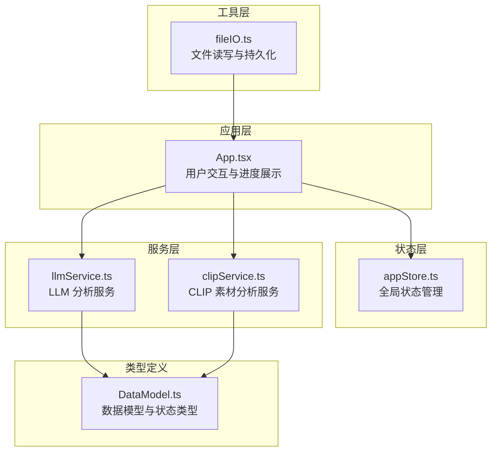
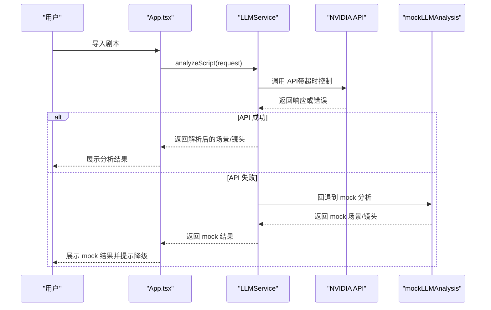
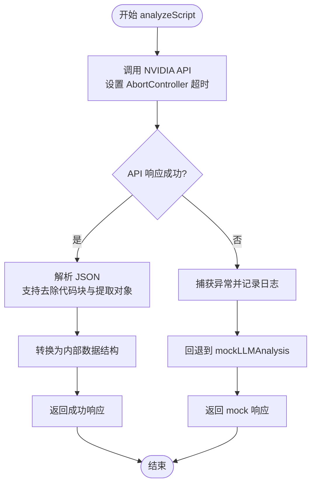
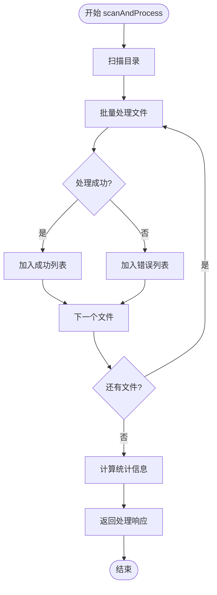
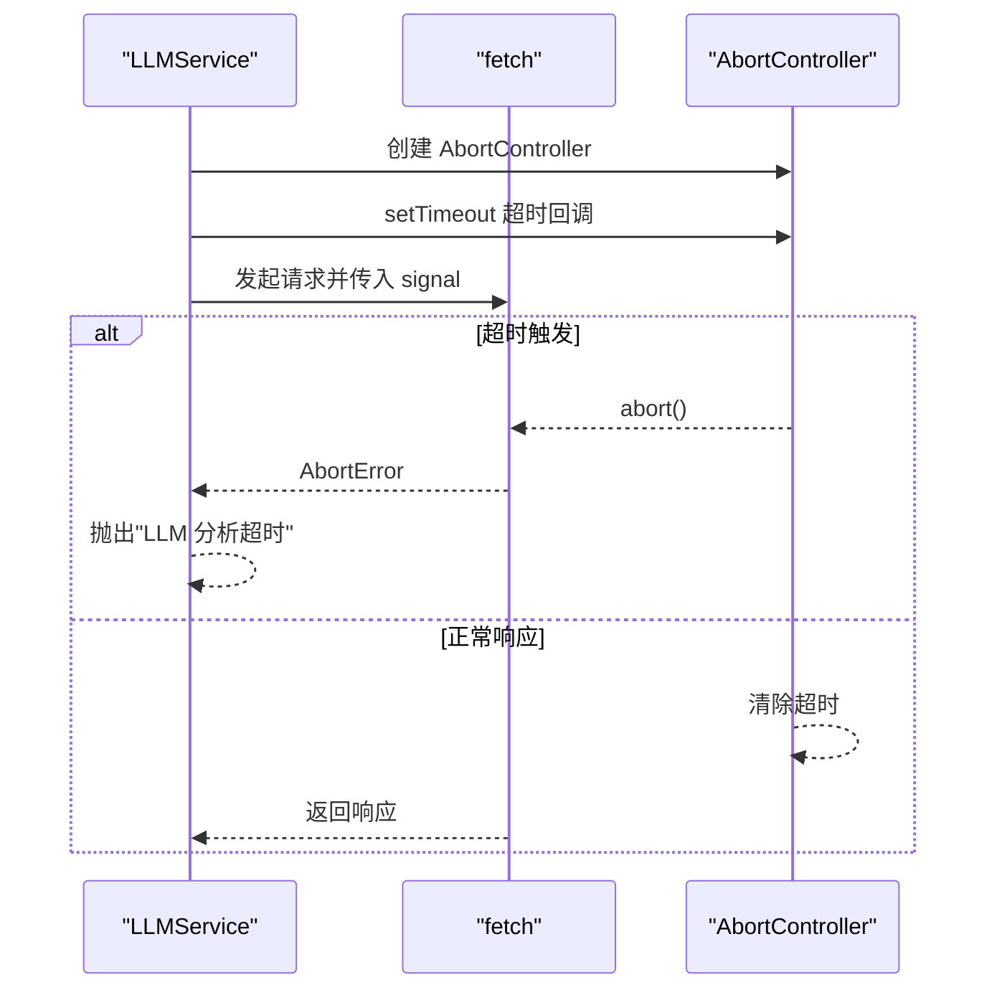
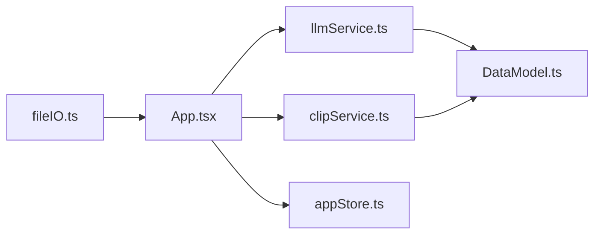

# 错误处理与恢复

<cite>
**本文档引用的文件**
- [llmService.ts](file://src/services/llmService.ts)
- [clipService.ts](file://src/services/clipService.ts)
- [appStore.ts](file://src/store/appStore.ts)
- [App.tsx](file://src/App.tsx)
- [DataModel.ts](file://src/types/DataModel.ts)
- [fileIO.ts](file://src/utils/fileIO.ts)
- [llm-breakdown-tests.md](file://test-scenarios/llm-breakdown-tests.md)
- [README.md](file://README.md)
</cite>

## 目录
1. [简介](#简介)
2. [项目结构](#项目结构)
3. [核心组件](#核心组件)
4. [架构概览](#架构概览)
5. [详细组件分析](#详细组件分析)
6. [依赖关系分析](#依赖关系分析)
7. [性能考量](#性能考量)
8. [故障排除指南](#故障排除指南)
9. [结论](#结论)
10. [附录](#附录)

## 简介
本文件详细阐述 CGCUT 项目中 LLM 服务的错误处理与恢复机制，涵盖 API 调用失败、网络超时、JSON 解析错误等异常情况的处理策略；深入解释 mock 分析功能的实现原理与触发条件，包括回退机制的设计逻辑与用户体验保障；说明超时控制机制（AbortController 的使用与超时参数配置）；提供错误日志记录与监控方案（错误分类、统计分析与告警机制）；并包含故障排除指南与性能优化建议。

## 项目结构
CGCUT 采用模块化架构，核心错误处理分布在服务层（LLM/CLIP）、状态管理层（Zustand Store）与应用层（UI 交互）。关键文件职责如下：
- 服务层：负责与外部 API 通信、错误捕获与回退逻辑
- 状态层：维护应用状态与 UI 进度反馈
- 应用层：处理用户交互、展示进度与错误提示
- 类型定义：统一错误状态与响应结构
- 工具层：文件读写与持久化

图表来源
- [App.tsx](file://src/App.tsx#L1-L497)
- [appStore.ts](file://src/store/appStore.ts#L1-L195)
- [llmService.ts](file://src/services/llmService.ts#L1-L476)
- [clipService.ts](file://src/services/clipService.ts#L1-L394)
- [DataModel.ts](file://src/types/DataModel.ts#L1-L291)
- [fileIO.ts](file://src/utils/fileIO.ts#L1-L95)

章节来源
- [README.md](file://README.md#L1-L181)

## 核心组件
- LLMService：负责剧本分析与 JSON 解析，包含超时控制与 mock 回退机制
- CLIPService：负责视频素材分析，包含批量处理与错误回退
- Zustand Store：维护 UI 状态与进度反馈
- App 组件：处理用户交互与错误提示
- DataModel：统一错误状态与响应结构

章节来源
- [llmService.ts](file://src/services/llmService.ts#L62-L476)
- [clipService.ts](file://src/services/clipService.ts#L22-L394)
- [appStore.ts](file://src/store/appStore.ts#L1-L195)
- [App.tsx](file://src/App.tsx#L1-L497)
- [DataModel.ts](file://src/types/DataModel.ts#L52-L84)

## 架构概览
LLM 与 CLIP 服务均采用“主流程 + 回退机制”的设计：当主流程出现异常（网络错误、超时、JSON 解析失败），系统自动切换到 mock 分析，确保用户能够继续工作并获得基本功能。

图表来源
- [llmService.ts](file://src/services/llmService.ts#L72-L101)
- [llmService.ts](file://src/services/llmService.ts#L106-L323)
- [llmService.ts](file://src/services/llmService.ts#L329-L423)

## 详细组件分析

### LLMService 错误处理与回退机制
- 主流程：调用 NVIDIA API，设置 AbortController 超时，解析 JSON，转换为内部数据结构
- 异常处理：捕获 API 调用异常，记录错误日志，回退到 mockLLMAnalysis
- JSON 解析增强：支持去除 Markdown 代码块标记、提取 JSON 对象，提升容错性
- 超时控制：AbortController + setTimeout，超时参数可配置，默认 120 秒

图表来源
- [llmService.ts](file://src/services/llmService.ts#L72-L101)
- [llmService.ts](file://src/services/llmService.ts#L106-L323)
- [llmService.ts](file://src/services/llmService.ts#L329-L423)

章节来源
- [llmService.ts](file://src/services/llmService.ts#L72-L101)
- [llmService.ts](file://src/services/llmService.ts#L106-L323)
- [llmService.ts](file://src/services/llmService.ts#L329-L423)

### CLIPService 错误处理与回退机制
- 主流程：扫描目录，批量处理视频文件，生成元数据
- 异常处理：捕获处理异常，返回错误响应结构，保留处理统计信息
- mock 实现：模拟文件发现、处理延迟、失败率与成功处理
- 错误分类：按“跳过已处理”“编码格式不支持”等维度统计

图表来源
- [clipService.ts](file://src/services/clipService.ts#L36-L60)
- [clipService.ts](file://src/services/clipService.ts#L107-L165)

章节来源
- [clipService.ts](file://src/services/clipService.ts#L36-L60)
- [clipService.ts](file://src/services/clipService.ts#L107-L165)

### 超时控制机制（AbortController）
- LLMService：在调用 fetch 时传入 AbortController.signal，并使用 setTimeout 在超时后调用 controller.abort()
- 超时参数：默认 120000ms（120 秒），可通过 updateConfig 动态更新
- 错误区分：捕获 AbortError 并抛出“LLM 分析超时”错误

图表来源
- [llmService.ts](file://src/services/llmService.ts#L204-L233)
- [llmService.ts](file://src/services/llmService.ts#L430-L462)

章节来源
- [llmService.ts](file://src/services/llmService.ts#L204-L233)
- [llmService.ts](file://src/services/llmService.ts#L430-L462)

### mock 分析功能实现原理与触发条件
- 触发条件：LLM API 调用失败或超时
- 实现原理：基于剧本段落智能拆分、场景识别、情绪关键词匹配与时长估算
- 用户体验保障：保持 UI 进度提示，返回结构化数据，保证后续流程可用

章节来源
- [llmService.ts](file://src/services/llmService.ts#L94-L101)
- [llmService.ts](file://src/services/llmService.ts#L329-L423)

### UI 错误处理与进度反馈
- LLM 分析进度：通过状态变量 llmStatus/llmProgress 展示“AI 分析中…”模态框
- CLIP 处理进度：通过状态变量 clipStatus/clipProgress 展示“CLIP 分析中…”模态框
- 错误提示：捕获异常后设置状态并弹窗提示，避免 UI 卡死

章节来源
- [App.tsx](file://src/App.tsx#L29-L38)
- [App.tsx](file://src/App.tsx#L351-L375)
- [App.tsx](file://src/App.tsx#L450-L491)

## 依赖关系分析
- LLMService 依赖 DataModel（请求/响应结构）、AbortController（超时控制）
- CLIPService 依赖 DataModel（请求/响应结构）、文件系统（MVP 阶段模拟）
- App 组件依赖 LLMService/CLIPService、Zustand Store、fileIO（数据持久化）

图表来源
- [llmService.ts](file://src/services/llmService.ts#L1-L476)
- [clipService.ts](file://src/services/clipService.ts#L1-L394)
- [App.tsx](file://src/App.tsx#L1-L497)
- [appStore.ts](file://src/store/appStore.ts#L1-L195)
- [DataModel.ts](file://src/types/DataModel.ts#L1-L291)
- [fileIO.ts](file://src/utils/fileIO.ts#L1-L95)

章节来源
- [llmService.ts](file://src/services/llmService.ts#L1-L476)
- [clipService.ts](file://src/services/clipService.ts#L1-L394)
- [App.tsx](file://src/App.tsx#L1-L497)
- [appStore.ts](file://src/store/appStore.ts#L1-L195)
- [DataModel.ts](file://src/types/DataModel.ts#L1-L291)
- [fileIO.ts](file://src/utils/fileIO.ts#L1-L95)

## 性能考量
- 超时参数：默认 120 秒，可根据网络环境与 API 响应时间调整
- JSON 解析优化：支持去除 Markdown 代码块与提取 JSON 对象，减少解析失败
- mock 分析：在 API 不可用时提供快速回退，保证用户体验
- 批量处理：CLIPService 支持批量处理与跳过已处理文件，提高效率

章节来源
- [llmService.ts](file://src/services/llmService.ts#L52-L57)
- [llmService.ts](file://src/services/llmService.ts#L248-L262)
- [clipService.ts](file://src/services/clipService.ts#L107-L165)

## 故障排除指南
- API 调用失败
  - 现象：LLM 分析失败，UI 弹窗提示
  - 排查：检查网络连接、API 端点与密钥配置
  - 处理：系统自动回退到 mock 分析
- JSON 解析错误
  - 现象：无法解析 LLM 返回的 JSON
  - 排查：查看响应内容是否包含 JSON 对象，确认格式
  - 处理：系统尝试去除 Markdown 代码块并提取 JSON 对象
- 超时错误
  - 现象：LLM 分析超时
  - 排查：检查网络延迟与 API 响应时间
  - 处理：调整超时参数或优化网络环境
- CLIP 处理失败
  - 现象：扫描素材库失败
  - 排查：检查目录路径与文件格式
  - 处理：查看错误统计并重试

章节来源
- [llmService.ts](file://src/services/llmService.ts#L235-L241)
- [llmService.ts](file://src/services/llmService.ts#L254-L262)
- [llmService.ts](file://src/services/llmService.ts#L455-L461)
- [clipService.ts](file://src/services/clipService.ts#L45-L59)

## 结论
CGCUT 的错误处理与恢复机制通过“主流程 + 回退机制”的设计，在 API 调用失败、网络超时、JSON 解析错误等异常情况下，能够自动切换到 mock 分析，确保用户持续获得基本功能与良好体验。超时控制采用 AbortController，具备可配置的超时参数。UI 层通过状态管理提供清晰的进度与错误反馈。建议在生产环境中完善错误日志与监控体系，以便进一步提升稳定性与可观测性。

## 附录
- 测试用例：参考 LLM 分镜拆解测试用例，验证分镜拆解质量与专业性
- 数据模型：统一错误状态与响应结构，便于前后端协作与错误分类

章节来源
- [llm-breakdown-tests.md](file://test-scenarios/llm-breakdown-tests.md#L1-L151)
- [DataModel.ts](file://src/types/DataModel.ts#L52-L84)