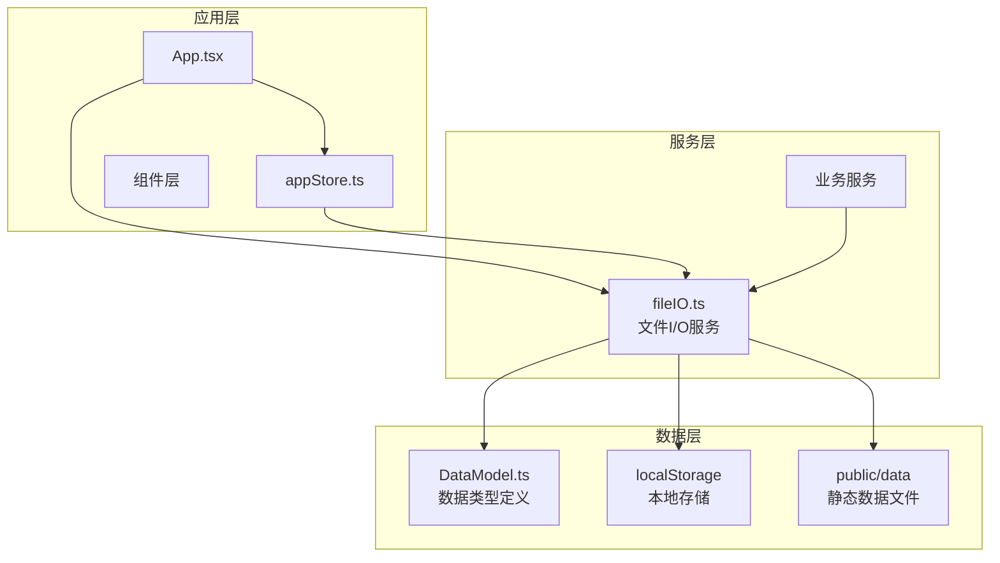
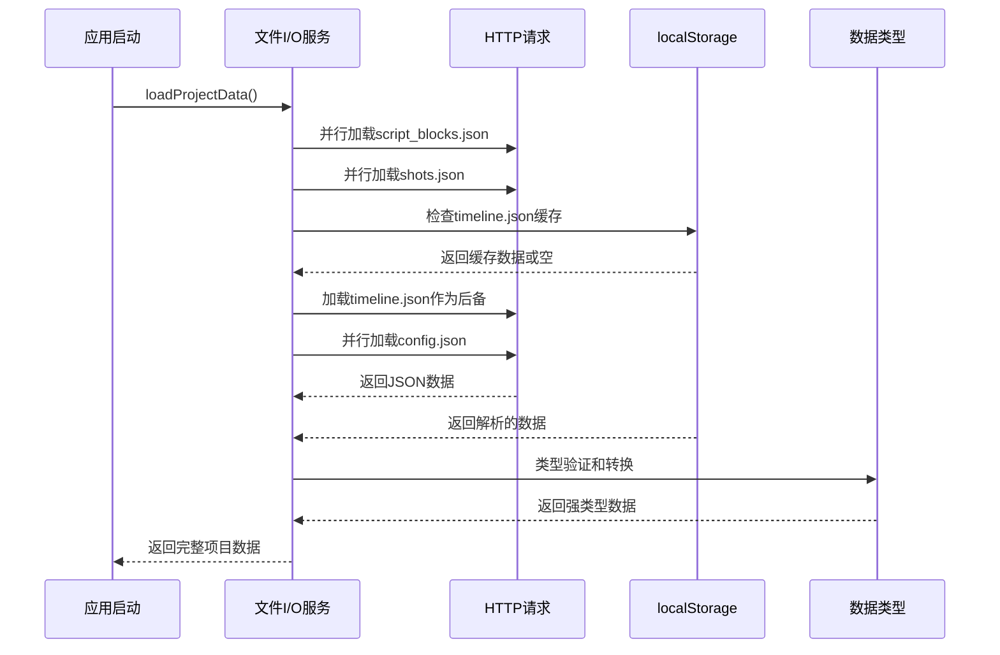
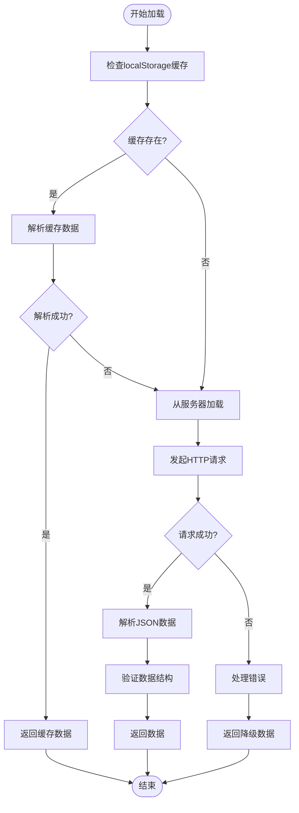
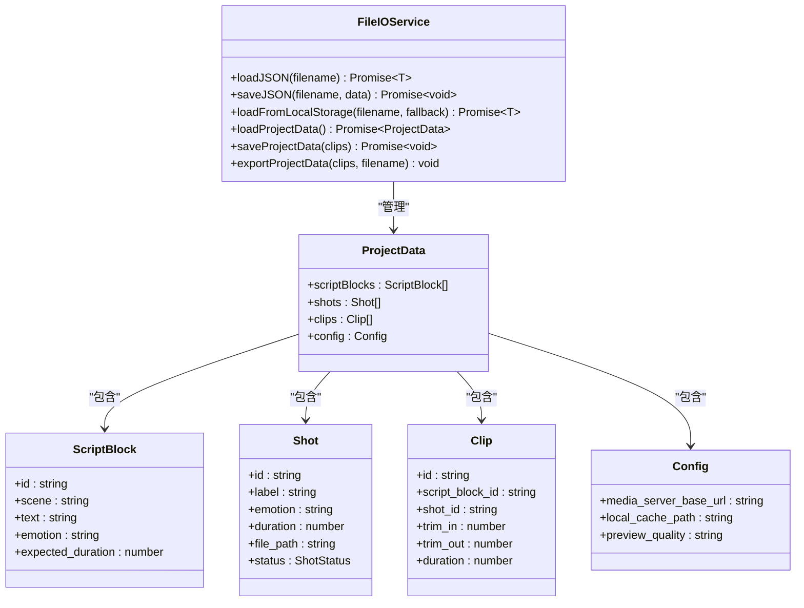
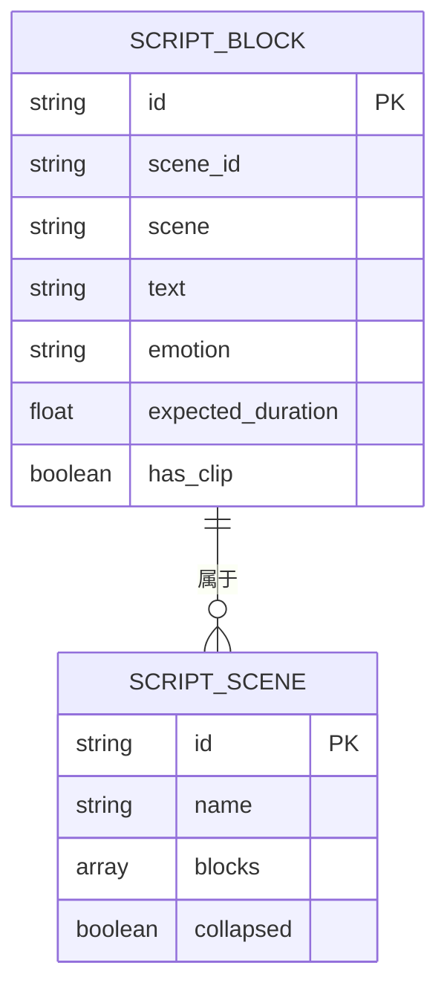
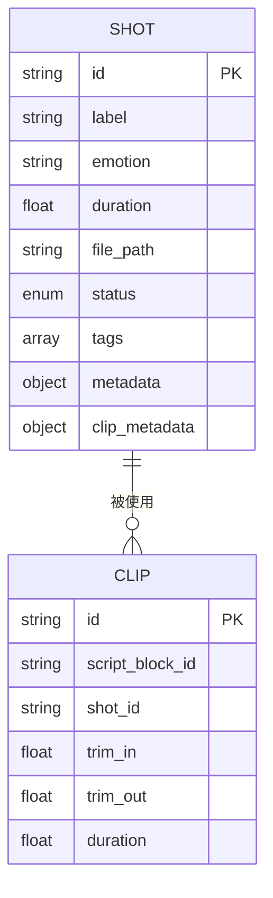
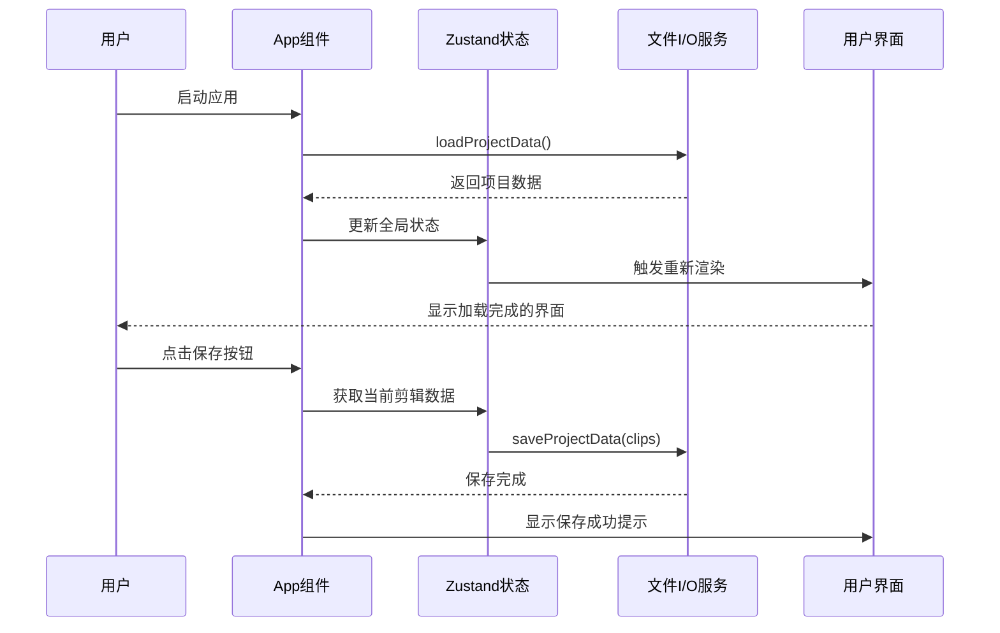
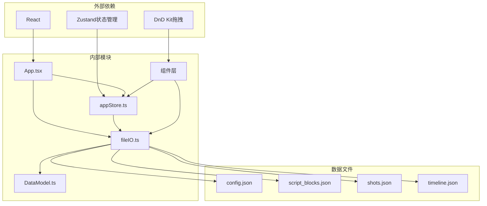
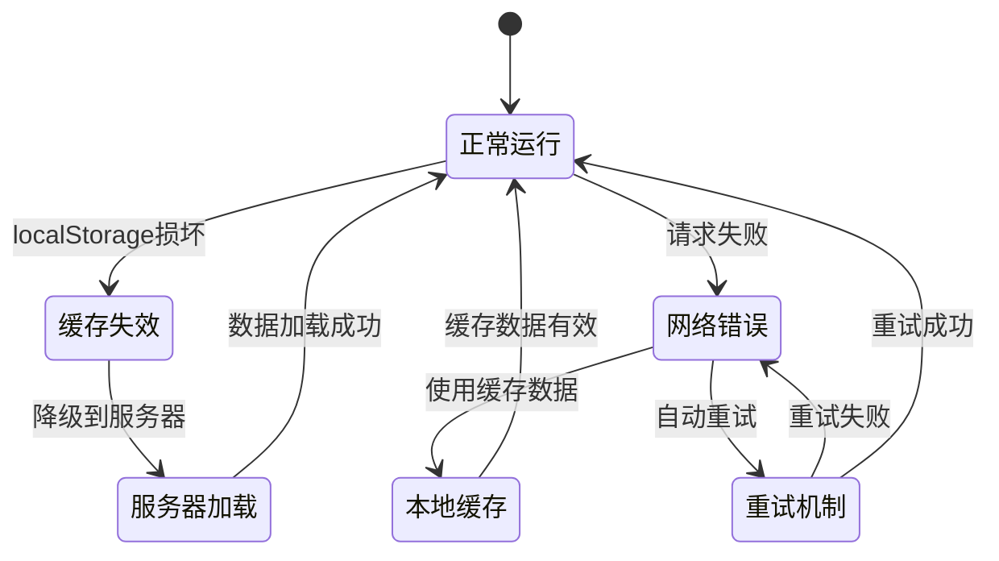

# 文件I/O服务

<cite>
**本文档引用的文件**
- [src/utils/fileIO.ts](file://src/utils/fileIO.ts)
- [src/types/DataModel.ts](file://src/types/DataModel.ts)
- [src/store/appStore.ts](file://src/store/appStore.ts)
- [src/App.tsx](file://src/App.tsx)
- [src/components/SimpleTimeline.tsx](file://src/components/SimpleTimeline.tsx)
- [public/data/config.json](file://public/data/config.json)
- [public/data/script_blocks.json](file://public/data/script_blocks.json)
- [public/data/shots.json](file://public/data/shots.json)
- [public/data/timeline.json](file://public/data/timeline.json)
- [package.json](file://package.json)
</cite>

## 目录
1. [简介](#简介)
2. [项目结构](#项目结构)
3. [核心组件](#核心组件)
4. [架构概览](#架构概览)
5. [详细组件分析](#详细组件分析)
6. [依赖关系分析](#依赖关系分析)
7. [性能考虑](#性能考虑)
8. [故障排除指南](#故障排除指南)
9. [结论](#结论)

## 简介

文件I/O服务是CGCUT项目的核心基础设施，负责管理项目数据的持久化存储和文件操作。该服务实现了完整的JSON数据处理机制，包括数据序列化、反序列化和版本兼容性处理，同时提供了localStorage持久化和文件导入导出功能。

CGCUT是一个导演分镜验证MVP工具，主要处理四类核心数据：
- **config.json**: 配置文件，包含媒体服务器基础URL、本地缓存路径和预览质量设置
- **script_blocks.json**: 剧本数据，包含场景描述、情感标签和预期时长
- **shots.json**: 素材库数据，包含镜头信息、状态和元数据
- **timeline.json**: 时间轴数据，包含剪辑片段和裁剪参数

## 项目结构

项目采用模块化架构设计，文件I/O服务位于`src/utils/fileIO.ts`，与类型定义、状态管理和UI组件形成清晰的分层结构。

**图表来源**
- [src/utils/fileIO.ts](file://src/utils/fileIO.ts#L1-L95)
- [src/App.tsx](file://src/App.tsx#L1-L497)
- [src/store/appStore.ts](file://src/store/appStore.ts#L1-L195)

**章节来源**
- [src/utils/fileIO.ts](file://src/utils/fileIO.ts#L1-L95)
- [src/types/DataModel.ts](file://src/types/DataModel.ts#L1-L291)
- [package.json](file://package.json#L1-L36)

## 核心组件

文件I/O服务包含以下核心组件：

### 1. JSON数据处理组件
- **loadJSON**: 异步加载JSON文件，支持错误处理和状态检查
- **saveJSON**: 将数据序列化为JSON并保存到localStorage
- **loadFromLocalStorage**: 从localStorage加载数据，支持降级机制

### 2. 项目数据管理组件
- **loadProjectData**: 并行加载所有项目数据，实现数据完整性
- **saveProjectData**: 保存时间轴数据到localStorage
- **exportProjectData**: 导出项目数据为JSON文件

### 3. 数据模型组件
- **ScriptBlock**: 剧本段落数据结构
- **Shot**: 素材镜头数据结构  
- **Clip**: 时间轴剪辑数据结构
- **Config**: 应用配置数据结构

**章节来源**
- [src/utils/fileIO.ts](file://src/utils/fileIO.ts#L7-L94)
- [src/types/DataModel.ts](file://src/types/DataModel.ts#L101-L169)

## 架构概览

文件I/O服务采用异步架构设计，通过Promise.all实现并行数据加载，确保应用启动的高效性。

**图表来源**
- [src/utils/fileIO.ts](file://src/utils/fileIO.ts#L54-L73)
- [src/App.tsx](file://src/App.tsx#L41-L58)

## 详细组件分析

### 文件加载组件

文件加载组件实现了智能的数据加载策略，支持多种数据源和错误处理机制。

**图表来源**
- [src/utils/fileIO.ts](file://src/utils/fileIO.ts#L39-L49)
- [src/utils/fileIO.ts](file://src/utils/fileIO.ts#L7-L18)

#### 关键特性

1. **并行加载**: 使用Promise.all实现多文件并行加载，提升启动性能
2. **降级机制**: 当localStorage数据损坏时自动回退到服务器数据
3. **错误处理**: 完善的异常捕获和错误日志记录
4. **类型安全**: 通过TypeScript泛型确保数据类型正确性

**章节来源**
- [src/utils/fileIO.ts](file://src/utils/fileIO.ts#L54-L73)

### 数据持久化组件

数据持久化组件提供了完整的数据保存和恢复机制。

**图表来源**
- [src/utils/fileIO.ts](file://src/utils/fileIO.ts#L1-L95)
- [src/types/DataModel.ts](file://src/types/DataModel.ts#L101-L169)

#### 持久化策略

1. **localStorage存储**: 使用`cgcut_`前缀区分应用数据
2. **JSON序列化**: 采用2空格缩进格式化输出
3. **版本兼容**: 通过数据结构验证确保向前兼容
4. **增量更新**: 支持部分数据更新而非整包替换

**章节来源**
- [src/utils/fileIO.ts](file://src/utils/fileIO.ts#L25-L34)

### 数据模型定义

数据模型定义了应用中使用的各种数据结构，确保类型安全和数据一致性。

#### 剧本数据模型

**图表来源**
- [src/types/DataModel.ts](file://src/types/DataModel.ts#L90-L109)

#### 素材数据模型

**图表来源**
- [src/types/DataModel.ts](file://src/types/DataModel.ts#L120-L148)

**章节来源**
- [src/types/DataModel.ts](file://src/types/DataModel.ts#L90-L169)

### 应用集成组件

应用集成了文件I/O服务，在启动时自动加载项目数据，并提供用户交互接口。

**图表来源**
- [src/App.tsx](file://src/App.tsx#L39-L68)
- [src/store/appStore.ts](file://src/store/appStore.ts#L60-L195)

**章节来源**
- [src/App.tsx](file://src/App.tsx#L39-L68)
- [src/store/appStore.ts](file://src/store/appStore.ts#L60-L195)

## 依赖关系分析

文件I/O服务的依赖关系体现了清晰的分层架构和模块化设计。

**图表来源**
- [package.json](file://package.json#L14-L34)
- [src/utils/fileIO.ts](file://src/utils/fileIO.ts#L1)
- [src/App.tsx](file://src/App.tsx#L1-L11)

### 关键依赖特性

1. **最小依赖**: 仅依赖React和Zustand，保持轻量级设计
2. **类型安全**: 通过TypeScript确保编译时类型检查
3. **模块化**: 清晰的模块边界，便于测试和维护
4. **可扩展性**: 支持Electron集成，便于桌面应用部署

**章节来源**
- [package.json](file://package.json#L14-L34)
- [src/utils/fileIO.ts](file://src/utils/fileIO.ts#L1)

## 性能考虑

文件I/O服务在设计时充分考虑了性能优化和用户体验。

### 并行加载优化

通过Promise.all实现多文件并行加载，显著减少应用启动时间：

**图表来源**
- [src/utils/fileIO.ts](file://src/utils/fileIO.ts#L60-L65)

### 内存管理策略

1. **增量更新**: 仅更新变化的数据，避免全量重绘
2. **缓存机制**: localStorage缓存减少网络请求
3. **懒加载**: 按需加载大型数据文件
4. **垃圾回收**: 及时释放临时对象和事件监听器

### 错误恢复机制

**图表来源**
- [src/utils/fileIO.ts](file://src/utils/fileIO.ts#L39-L49)

## 故障排除指南

### 常见问题及解决方案

#### 1. 数据加载失败

**症状**: 应用启动时出现数据加载错误

**原因分析**:
- 网络连接问题
- JSON文件格式错误
- localStorage空间不足

**解决步骤**:
1. 检查网络连接状态
2. 验证JSON文件语法
3. 清理localStorage缓存
4. 检查文件权限

#### 2. 数据不一致

**症状**: 应用显示的数据与预期不符

**排查方法**:
1. 检查数据版本兼容性
2. 验证数据完整性
3. 确认数据转换逻辑
4. 检查缓存同步状态

#### 3. 性能问题

**症状**: 应用响应缓慢或内存占用过高

**优化建议**:
1. 实施数据分页加载
2. 优化数据结构
3. 减少不必要的重渲染
4. 实现数据压缩

**章节来源**
- [src/utils/fileIO.ts](file://src/utils/fileIO.ts#L14-L17)
- [src/utils/fileIO.ts](file://src/utils/fileIO.ts#L31-L33)

### 调试技巧

1. **启用开发模式**: 使用浏览器开发者工具监控网络请求
2. **日志记录**: 在关键节点添加详细的日志信息
3. **数据验证**: 实施严格的输入验证和错误处理
4. **性能监控**: 使用性能分析工具识别瓶颈

## 结论

文件I/O服务为CGCUT项目提供了稳定可靠的数据持久化解决方案。通过精心设计的架构和完善的错误处理机制，该服务确保了应用数据的一致性和可靠性。

### 主要优势

1. **架构清晰**: 模块化设计便于维护和扩展
2. **性能优秀**: 并行加载和缓存机制提升用户体验
3. **类型安全**: TypeScript支持确保编译时类型检查
4. **易于测试**: 清晰的接口设计便于单元测试

### 发展方向

1. **Electron集成**: 通过Electron API实现真正的文件系统访问
2. **数据库支持**: 考虑引入IndexedDB支持更大规模数据
3. **云同步**: 实现多设备数据同步功能
4. **版本迁移**: 建立完整的数据版本迁移机制

该文件I/O服务为CGCUT项目的未来发展奠定了坚实的技术基础，为导演分镜验证工作流提供了可靠的数字基础设施。