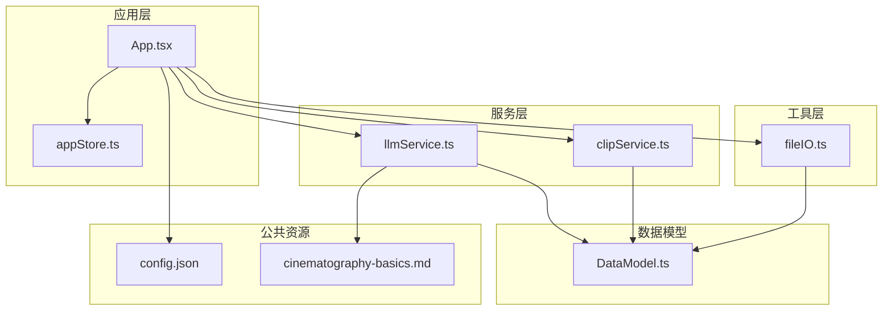
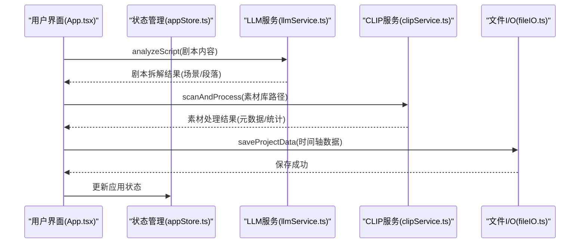
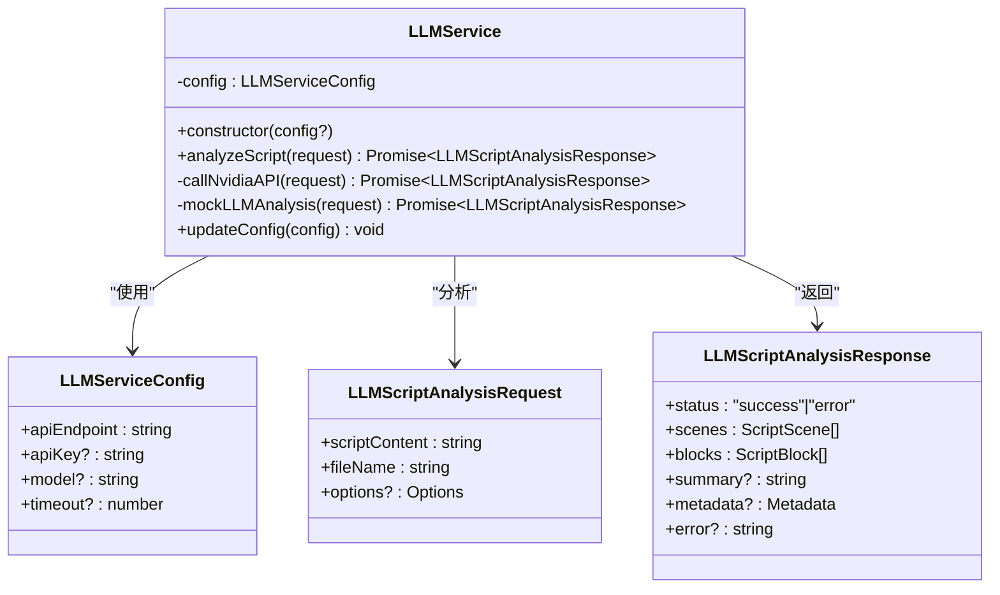
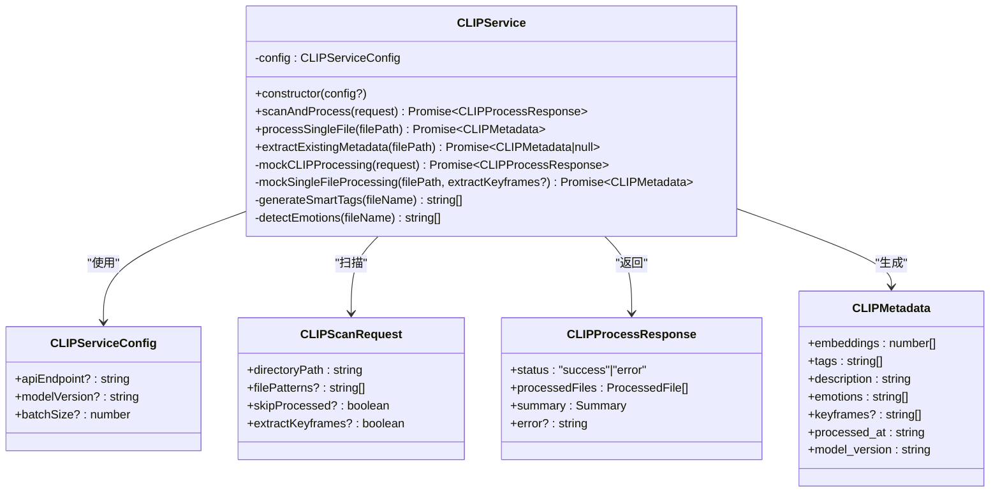
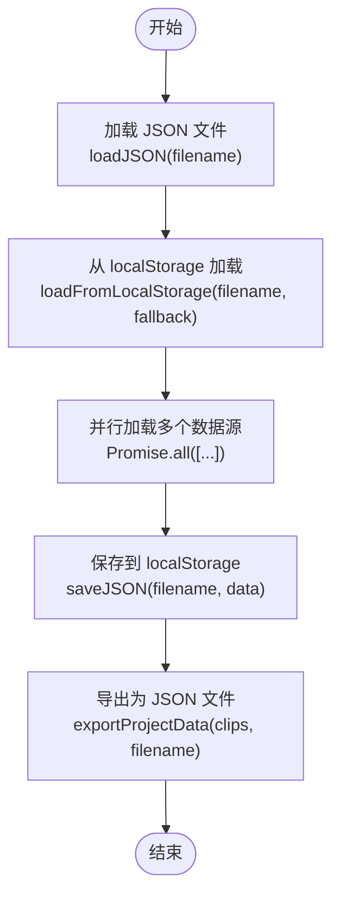
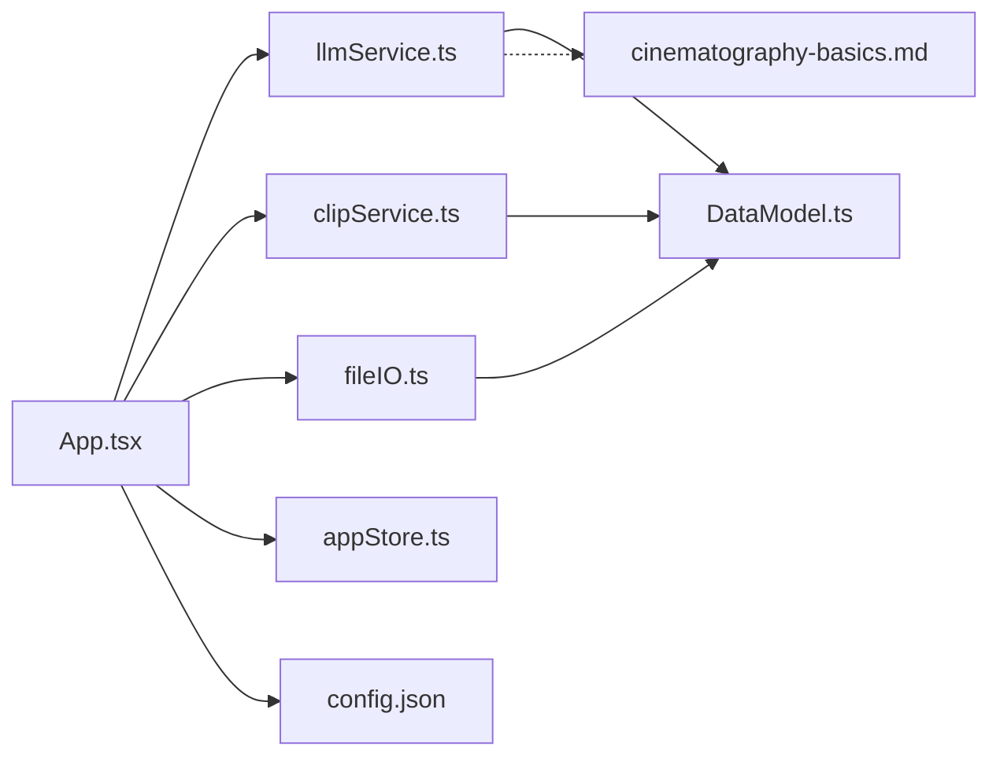

# 服务集成

<cite>
**本文档引用的文件**
- [llmService.ts](file://src/services/llmService.ts)
- [clipService.ts](file://src/services/clipService.ts)
- [fileIO.ts](file://src/utils/fileIO.ts)
- [DataModel.ts](file://src/types/DataModel.ts)
- [config.json](file://public/data/config.json)
- [cinematography-basics.md](file://knowledge/cinematography-basics.md)
- [appStore.ts](file://src/store/appStore.ts)
- [App.tsx](file://src/App.tsx)
</cite>

## 目录
1. [简介](#简介)
2. [项目结构](#项目结构)
3. [核心组件](#核心组件)
4. [架构概览](#架构概览)
5. [详细组件分析](#详细组件分析)
6. [依赖分析](#依赖分析)
7. [性能考量](#性能考量)
8. [故障排除指南](#故障排除指南)
9. [结论](#结论)
10. [附录](#附录)

## 简介
本文件详细说明 CGCUT 项目的服务集成实现，涵盖三大核心服务：
- LLM 服务（基于 NVIDIA API 的剧本智能分析）
- CLIP 服务（视频内容分析与元数据提取）
- 文件 I/O 服务（数据持久化与本地存储）

文档重点解释各服务的集成方式、错误处理机制、配置管理、数据模型以及使用示例与最佳实践，并提供性能优化指导。

## 项目结构
项目采用模块化组织，服务层位于 src/services，数据模型位于 src/types，工具函数位于 src/utils，应用入口与状态管理位于 src/App.tsx 与 src/store/appStore.ts，公共资源位于 public/data。

**图表来源**
- [App.tsx](file://src/App.tsx#L1-L200)
- [llmService.ts](file://src/services/llmService.ts#L1-L476)
- [clipService.ts](file://src/services/clipService.ts#L1-L394)
- [fileIO.ts](file://src/utils/fileIO.ts#L1-L95)
- [DataModel.ts](file://src/types/DataModel.ts#L1-L291)
- [config.json](file://public/data/config.json#L1-L6)
- [cinematography-basics.md](file://knowledge/cinematography-basics.md#L1-L366)

**章节来源**
- [App.tsx](file://src/App.tsx#L1-L200)
- [llmService.ts](file://src/services/llmService.ts#L1-L476)
- [clipService.ts](file://src/services/clipService.ts#L1-L394)
- [fileIO.ts](file://src/utils/fileIO.ts#L1-L95)
- [DataModel.ts](file://src/types/DataModel.ts#L1-L291)
- [config.json](file://public/data/config.json#L1-L6)
- [cinematography-basics.md](file://knowledge/cinematography-basics.md#L1-L366)

## 核心组件
- LLMService：封装 NVIDIA API 的剧本智能分析，具备回退到模拟分析的能力，支持超时控制与错误恢复。
- CLIPService：提供视频素材扫描与处理能力，支持批量处理、跳过已处理文件、关键帧提取与元数据生成。
- FileIO：负责项目数据的加载、保存与导出，支持 localStorage 持久化与浏览器下载导出。

**章节来源**
- [llmService.ts](file://src/services/llmService.ts#L62-L476)
- [clipService.ts](file://src/services/clipService.ts#L22-L394)
- [fileIO.ts](file://src/utils/fileIO.ts#L7-L95)

## 架构概览
服务集成遵循“应用层 -> 服务层 -> 工具层”的分层设计，应用层通过状态管理器协调服务调用，服务层负责与外部 API 交互，工具层提供数据持久化与文件操作。

**图表来源**
- [App.tsx](file://src/App.tsx#L70-L169)
- [llmService.ts](file://src/services/llmService.ts#L72-L101)
- [clipService.ts](file://src/services/clipService.ts#L36-L60)
- [fileIO.ts](file://src/utils/fileIO.ts#L78-L80)
- [appStore.ts](file://src/store/appStore.ts#L60-L195)

## 详细组件分析

### LLM 服务（剧本智能分析）
- 功能概述
  - 基于 NVIDIA API 的 LLM 分析，将剧本拆解为场景与镜头段落。
  - 内置影视分镜知识库，确保输出符合专业标准。
  - 支持超时控制与错误回退（模拟分析）。
- 关键特性
  - Prompt 工程：强制每个场景拆解为 3-10 个镜头，严格 JSON 输出格式。
  - 知识库集成：整合影视分镜专业知识，提升拆解质量。
  - 错误处理：API 失败时自动回退至模拟分析，保证可用性。
  - 超时控制：AbortController 控制请求超时，防止长时间阻塞。
- 数据模型
  - 请求：LLMScriptAnalysisRequest（剧本内容、文件名、选项）
  - 响应：LLMScriptAnalysisResponse（场景数组、段落数组、元数据）
- 使用示例
  - 应用层通过 llmService.analyzeScript 调用，接收场景与段落数据后更新状态。
- 配置管理
  - 默认配置包含 API 端点、API Key、模型名称与超时时间，支持运行时更新。

**图表来源**
- [llmService.ts](file://src/services/llmService.ts#L42-L476)
- [DataModel.ts](file://src/types/DataModel.ts#L58-L84)

**章节来源**
- [llmService.ts](file://src/services/llmService.ts#L62-L476)
- [DataModel.ts](file://src/types/DataModel.ts#L58-L84)
- [cinematography-basics.md](file://knowledge/cinematography-basics.md#L1-L366)

### CLIP 服务（视频内容分析）
- 功能概述
  - 扫描指定目录中的视频文件，提取 CLIP 特征向量、标签、描述与情绪。
  - 支持批量处理、跳过已处理文件、关键帧提取与元数据复用。
  - 提供模拟处理与真实 API 集成示例。
- 关键特性
  - 批处理：按批次处理视频文件，支持自定义批大小。
  - 智能标签：基于文件名模式识别场景类型、镜头类型、人物、动作与环境。
  - 情绪检测：基于关键词推断情绪类别。
  - 元数据复用：尝试从已有 .clip.json 文件提取元数据。
- 数据模型
  - 请求：CLIPScanRequest（目录路径、文件模式、跳过已处理、提取关键帧）
  - 响应：CLIPProcessResponse（处理结果数组、统计信息）
  - 元数据：CLIPMetadata（嵌入向量、标签、描述、情绪、关键帧、处理时间、模型版本）
- 使用示例
  - 应用层通过 clipService.scanAndProcess 调用，接收处理结果后更新素材库状态。
- 配置管理
  - 默认 API 端点、模型版本与批大小，支持运行时更新。

**图表来源**
- [clipService.ts](file://src/services/clipService.ts#L12-L394)
- [DataModel.ts](file://src/types/DataModel.ts#L22-L49)

**章节来源**
- [clipService.ts](file://src/services/clipService.ts#L22-L394)
- [DataModel.ts](file://src/types/DataModel.ts#L22-L49)

### 文件 I/O 服务（数据持久化）
- 功能概述
  - 项目数据加载：从 public/data 目录加载 JSON 文件，支持从 localStorage 回退。
  - 项目数据保存：将时间轴数据保存到 localStorage。
  - 项目数据导出：将时间轴数据导出为浏览器下载的 JSON 文件。
- 关键特性
  - 并行加载：Promise.all 并行加载多个数据源，提升启动速度。
  - 回退机制：当 localStorage 不存在或解析失败时，回退到公共数据。
  - 下载导出：Blob + ObjectURL 实现浏览器端导出。
- 数据模型
  - 项目数据结构：scriptBlocks、shots、clips、config。
- 使用示例
  - 应用层通过 loadProjectData 获取初始数据，通过 saveProjectData 保存编辑后的数据。

**图表来源**
- [fileIO.ts](file://src/utils/fileIO.ts#L7-L95)
- [DataModel.ts](file://src/types/DataModel.ts#L54-L72)

**章节来源**
- [fileIO.ts](file://src/utils/fileIO.ts#L7-L95)
- [DataModel.ts](file://src/types/DataModel.ts#L54-L72)

## 依赖分析
- 组件耦合
  - App.tsx 依赖 LLMService、CLIPService、FileIO 与 appStore。
  - 服务层依赖 DataModel 类型定义。
  - LLMService 依赖知识库文件以增强 Prompt。
- 外部依赖
  - NVIDIA API（LLM 分析）、本地 CLIP API（模拟实现）。
- 潜在循环依赖
  - 服务层与工具层之间为单向依赖，无循环。
- 接口契约
  - 服务层通过明确的请求/响应接口与应用层交互，便于替换实现。

**图表来源**
- [App.tsx](file://src/App.tsx#L1-L200)
- [llmService.ts](file://src/services/llmService.ts#L1-L476)
- [clipService.ts](file://src/services/clipService.ts#L1-L394)
- [fileIO.ts](file://src/utils/fileIO.ts#L1-L95)
- [DataModel.ts](file://src/types/DataModel.ts#L1-L291)
- [config.json](file://public/data/config.json#L1-L6)
- [cinematography-basics.md](file://knowledge/cinematography-basics.md#L1-L366)

**章节来源**
- [App.tsx](file://src/App.tsx#L1-L200)
- [llmService.ts](file://src/services/llmService.ts#L1-L476)
- [clipService.ts](file://src/services/clipService.ts#L1-L394)
- [fileIO.ts](file://src/utils/fileIO.ts#L1-L95)
- [DataModel.ts](file://src/types/DataModel.ts#L1-L291)
- [config.json](file://public/data/config.json#L1-L6)
- [cinematography-basics.md](file://knowledge/cinematography-basics.md#L1-L366)

## 性能考量
- LLM 服务
  - 超时控制：默认 120 秒，可根据网络状况调整。
  - Prompt 优化：严格的 JSON 输出格式与知识库约束，减少无效重试。
  - 回退策略：API 失败时使用模拟分析，保障用户体验。
- CLIP 服务
  - 批处理：合理设置批大小，平衡吞吐量与内存占用。
  - 跳过已处理：通过 skipProcessed 减少重复工作。
  - 关键帧提取：按需开启，避免不必要的 I/O。
- 文件 I/O
  - 并行加载：Promise.all 并行获取多源数据，缩短启动时间。
  - localStorage：适合小规模数据，大体量数据建议后端存储。
- 最佳实践
  - 在应用层统一管理服务状态与进度提示。
  - 对外部 API 调用进行统一的错误捕获与用户反馈。
  - 对大数据量操作提供进度条与取消机制。

[本节为通用性能指导，无需特定文件来源]

## 故障排除指南
- LLM 服务
  - API 调用失败：检查 API Key、端点与网络连接；服务会自动回退到模拟分析。
  - JSON 解析失败：确认 LLM 返回内容包含有效 JSON；服务会抛出明确错误。
  - 超时：调整超时配置或优化网络环境。
- CLIP 服务
  - 扫描失败：检查目录权限与文件格式；模拟处理会返回错误信息。
  - 元数据缺失：确认 .clip.json 文件存在；服务会尝试重新生成。
  - 批处理异常：检查批大小与磁盘空间。
- 文件 I/O
  - 加载失败：检查 public/data 目录与文件权限；服务会抛出错误。
  - 保存失败：检查浏览器存储配额；服务会抛出错误。
  - 导出失败：检查浏览器下载权限。

**章节来源**
- [llmService.ts](file://src/services/llmService.ts#L94-L101)
- [llmService.ts](file://src/services/llmService.ts#L235-L242)
- [clipService.ts](file://src/services/clipService.ts#L45-L59)
- [clipService.ts](file://src/services/clipService.ts#L87-L102)
- [fileIO.ts](file://src/utils/fileIO.ts#L14-L18)
- [fileIO.ts](file://src/utils/fileIO.ts#L30-L34)

## 结论
CGCUT 的服务集成以清晰的分层设计实现了 LLM、CLIP 与文件 I/O 的协同工作。通过严格的错误处理与回退机制，系统在开发阶段即可稳定运行；通过可配置的参数与模拟实现，为后续接入真实 API 提供了便利。建议在生产环境中替换模拟实现，完善日志与监控，并根据实际数据规模优化批处理与存储策略。

[本节为总结性内容，无需特定文件来源]

## 附录

### 服务接口使用示例与最佳实践
- LLM 分析
  - 输入：剧本内容、文件名、语言、是否分析情绪、是否估算时长。
  - 输出：场景数组、段落数组、元数据（场景数、段落数、预估时长、分析耗时）。
  - 最佳实践：在 UI 中显示分析进度，提供取消按钮；对错误进行用户友好提示。
- CLIP 扫描
  - 输入：目录路径、文件模式、是否跳过已处理、是否提取关键帧。
  - 输出：处理结果数组（文件路径、镜头 ID、元数据、状态、错误）、统计信息。
  - 最佳实践：分批处理大目录；提供进度条与实时统计；对失败项单独记录。
- 文件 I/O
  - 加载：并行加载多个数据源，支持回退到公共数据。
  - 保存：保存到 localStorage，提供导出为 JSON 的下载功能。
  - 最佳实践：对大文件导出提供压缩或分片策略；对存储失败进行重试与提示。

**章节来源**
- [App.tsx](file://src/App.tsx#L70-L169)
- [App.tsx](file://src/App.tsx#L171-L252)
- [fileIO.ts](file://src/utils/fileIO.ts#L54-L95)

### 配置管理
- LLM 服务配置
  - apiEndpoint：NVIDIA API 端点
  - apiKey：API 密钥
  - model：模型名称
  - timeout：超时时间（毫秒）
- CLIP 服务配置
  - apiEndpoint：CLIP API 端点
  - modelVersion：模型版本
  - batchSize：批处理大小
- 应用配置
  - media_server_base_url：媒体服务器根路径
  - local_cache_path：本地缓存路径
  - preview_quality：预览视频质量

**章节来源**
- [llmService.ts](file://src/services/llmService.ts#L42-L57)
- [clipService.ts](file://src/services/clipService.ts#L12-L31)
- [config.json](file://public/data/config.json#L1-L6)