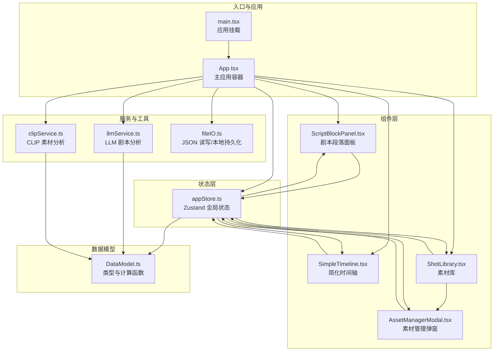
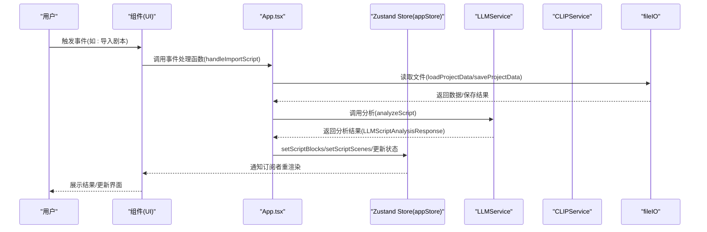
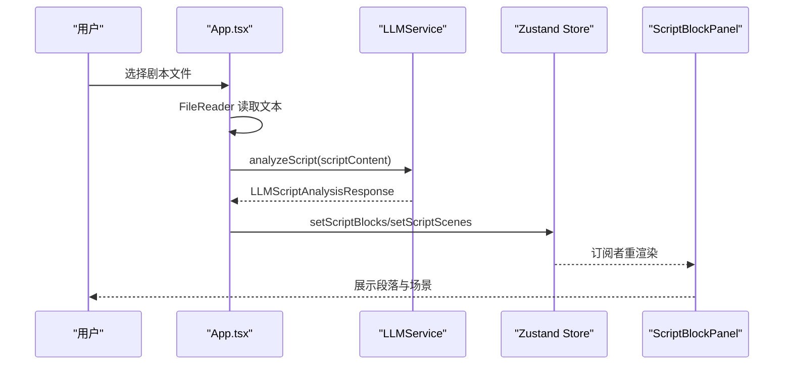
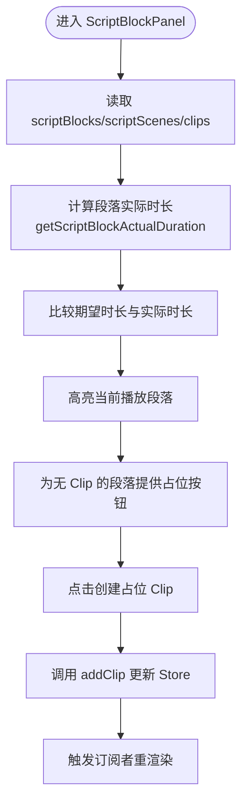
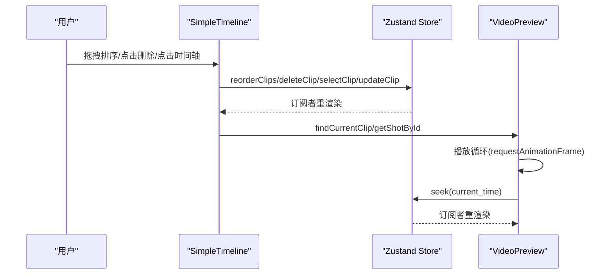
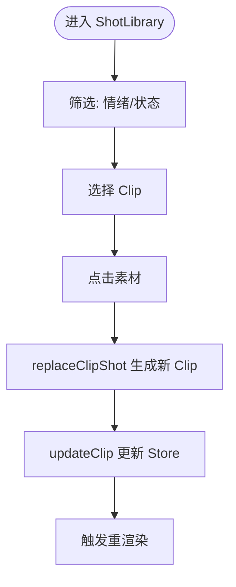
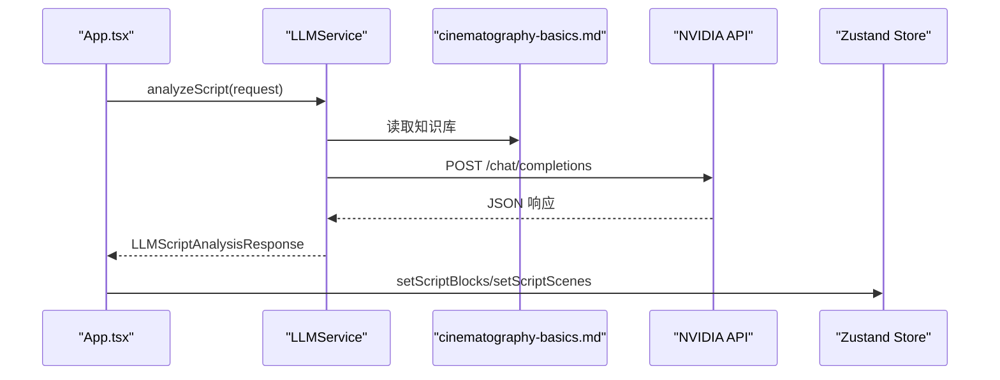
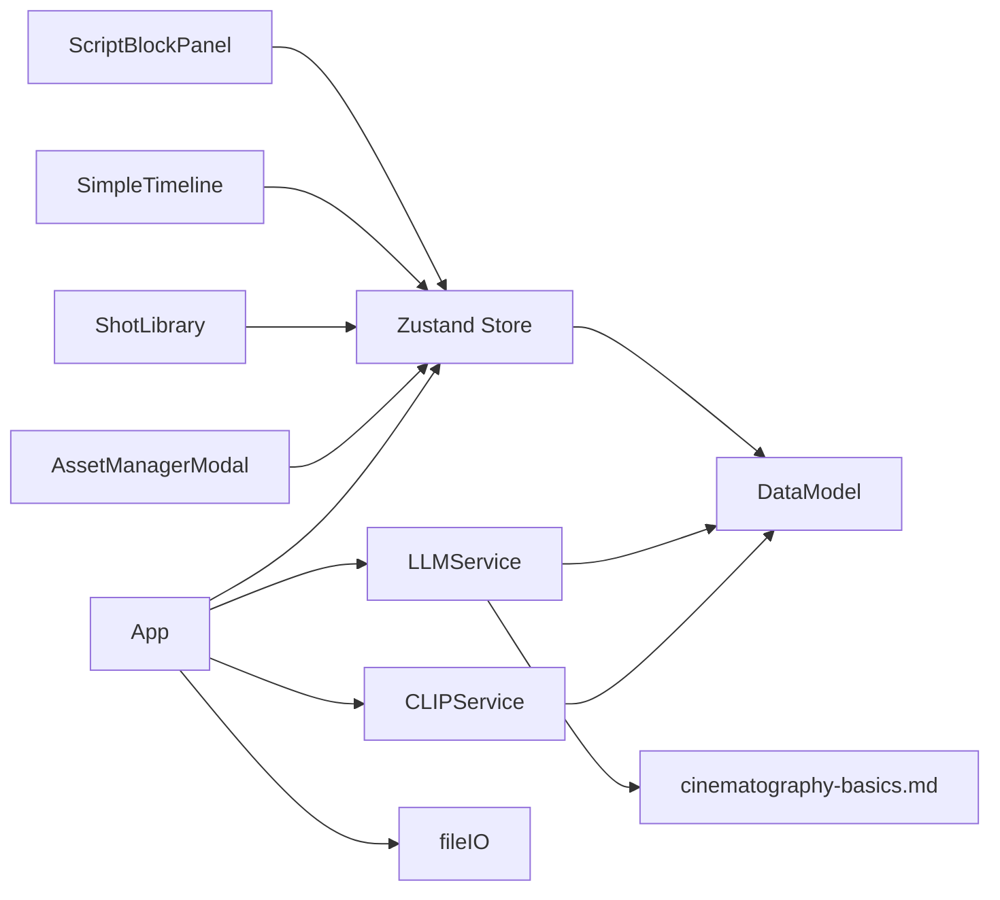

# 数据流设计

<cite>
**本文档引用的文件**
- [README.md](file://README.md)
- [src/main.tsx](file://src/main.tsx)
- [src/App.tsx](file://src/App.tsx)
- [src/store/appStore.ts](file://src/store/appStore.ts)
- [src/types/DataModel.ts](file://src/types/DataModel.ts)
- [src/services/llmService.ts](file://src/services/llmService.ts)
- [src/services/clipService.ts](file://src/services/clipService.ts)
- [src/utils/fileIO.ts](file://src/utils/fileIO.ts)
- [src/components/ScriptBlockPanel.tsx](file://src/components/ScriptBlockPanel.tsx)
- [src/components/SimpleTimeline.tsx](file://src/components/SimpleTimeline.tsx)
- [src/components/ShotLibrary.tsx](file://src/components/ShotLibrary.tsx)
- [src/components/AssetManagerModal.tsx](file://src/components/AssetManagerModal.tsx)
- [knowledge/cinematography-basics.md](file://knowledge/cinematography-basics.md)
</cite>

## 目录
1. [简介](#简介)
2. [项目结构](#项目结构)
3. [核心组件](#核心组件)
4. [架构总览](#架构总览)
5. [详细组件分析](#详细组件分析)
6. [依赖关系分析](#依赖关系分析)
7. [性能考量](#性能考量)
8. [故障排查指南](#故障排查指南)
9. [结论](#结论)
10. [附录](#附录)

## 简介
本文件为 CGCUT 的数据流设计文档，围绕“从用户操作到状态更新”的完整数据流转过程进行系统化梳理，涵盖事件处理、状态变更、组件重渲染、单向数据流原则、组件间数据传递模式、异步数据处理（LLM 与 CLIP）、数据验证与转换流程，并提供数据流图表、调试技巧与性能优化建议。

## 项目结构
CGCUT 采用 React + Zustand 的前端架构，数据流自顶向下单向流动，UI 通过事件触发状态更新，Zustand Store 统一管理全局状态，组件订阅所需字段并触发重渲染。

**图表来源**
- [src/main.tsx](file://src/main.tsx#L1-L11)
- [src/App.tsx](file://src/App.tsx#L1-L497)
- [src/store/appStore.ts](file://src/store/appStore.ts#L1-L195)
- [src/components/ScriptBlockPanel.tsx](file://src/components/ScriptBlockPanel.tsx#L1-L285)
- [src/components/SimpleTimeline.tsx](file://src/components/SimpleTimeline.tsx#L1-L414)
- [src/components/ShotLibrary.tsx](file://src/components/ShotLibrary.tsx#L1-L359)
- [src/components/AssetManagerModal.tsx](file://src/components/AssetManagerModal.tsx#L1-L511)
- [src/services/llmService.ts](file://src/services/llmService.ts#L1-L476)
- [src/services/clipService.ts](file://src/services/clipService.ts#L1-L394)
- [src/utils/fileIO.ts](file://src/utils/fileIO.ts#L1-L95)
- [src/types/DataModel.ts](file://src/types/DataModel.ts#L1-L291)

**章节来源**
- [README.md](file://README.md#L126-L150)
- [src/main.tsx](file://src/main.tsx#L1-L11)
- [src/App.tsx](file://src/App.tsx#L1-L497)

## 核心组件
- 全局状态中心：Zustand Store（appStore），集中管理 scriptBlocks、scriptScenes、shots、clips、媒体库、播放状态、选择状态等。
- 事件驱动：App.tsx 作为顶层容器，负责文件导入、项目检查、保存导出、素材扫描等异步任务。
- 组件订阅：各 UI 组件通过 useAppStore 订阅所需字段，触发局部重渲染。
- 数据模型：DataModel.ts 定义数据结构、计算函数与接口契约，确保跨模块一致性。
- 服务层：llmService.ts、clipService.ts 封装外部异步调用；fileIO.ts 封装数据读写与本地持久化。

**章节来源**
- [src/store/appStore.ts](file://src/store/appStore.ts#L1-L195)
- [src/types/DataModel.ts](file://src/types/DataModel.ts#L1-L291)
- [src/services/llmService.ts](file://src/services/llmService.ts#L1-L476)
- [src/services/clipService.ts](file://src/services/clipService.ts#L1-L394)
- [src/utils/fileIO.ts](file://src/utils/fileIO.ts#L1-L95)

## 架构总览
CGCUT 采用“单向数据流”设计：
- 用户事件（点击、拖拽、文件上传）由组件捕获。
- 事件回调通过 App.tsx 或组件内部 action 更新 Zustand 状态。
- 订阅该状态的组件收到变更通知，触发重渲染。
- 异步任务（LLM/CLIP）通过服务层封装，返回 Promise，最终落地到 Store，驱动 UI 更新。

**图表来源**
- [src/App.tsx](file://src/App.tsx#L70-L169)
- [src/utils/fileIO.ts](file://src/utils/fileIO.ts#L54-L80)
- [src/services/llmService.ts](file://src/services/llmService.ts#L72-L101)
- [src/store/appStore.ts](file://src/store/appStore.ts#L82-L88)

## 详细组件分析

### 组件 A：App.tsx（顶层容器与事件编排）
- 职责
  - 生命周期加载项目数据（loadProjectData），初始化媒体库。
  - 处理用户导入剧本（handleImportScript）：文件读取、LLM 分析、状态更新、进度反馈。
  - 处理素材扫描（handleScanMediaLibrary）：CLIP 扫描、更新 shots 与媒体库统计。
  - 导出/保存/一键检查等交互。
- 数据流要点
  - 单向更新：通过 setXxx setters 更新 Store。
  - 异步状态：llmStatus/clipStatus 控制 UI 模态框与禁用态。
  - 项目检查：调用 Store 的 checkProjectStatus 计算项目状态并弹窗展示。

**图表来源**
- [src/App.tsx](file://src/App.tsx#L70-L169)
- [src/services/llmService.ts](file://src/services/llmService.ts#L72-L101)
- [src/store/appStore.ts](file://src/store/appStore.ts#L82-L88)

**章节来源**
- [src/App.tsx](file://src/App.tsx#L1-L497)

### 组件 B：ScriptBlockPanel.tsx（剧本段落面板）
- 职责
  - 展示原始剧本与 LLM 拆解结果（场景/段落）。
  - 计算段落实际时长与期望时长差异，高亮当前播放段落。
  - 为段落创建占位 Clip。
- 数据流要点
  - 订阅 scriptBlocks/scriptScenes/clips/playbackState。
  - 使用 getScriptBlockActualDuration 计算实际时长。
  - 通过 addClip/createPlaceholderClip 更新 Store。

**图表来源**
- [src/components/ScriptBlockPanel.tsx](file://src/components/ScriptBlockPanel.tsx#L38-L106)
- [src/store/appStore.ts](file://src/store/appStore.ts#L132-L135)

**章节来源**
- [src/components/ScriptBlockPanel.tsx](file://src/components/ScriptBlockPanel.tsx#L1-L285)

### 组件 C：SimpleTimeline.tsx（简化时间轴）
- 职责
  - 拖拽排序 Clip、删除 Clip、点击时间轴跳转、播放控制。
  - 播放时同步视频源与播放头。
- 数据流要点
  - DndKit 拖拽结束后通过 reorderClips 更新 Store。
  - deleteClip/selectClip/updateClip 等操作直接更新 Store。
  - 播放循环通过 requestAnimationFrame 与 seek 更新 playbackState。

**图表来源**
- [src/components/SimpleTimeline.tsx](file://src/components/SimpleTimeline.tsx#L343-L367)
- [src/components/SimpleTimeline.tsx](file://src/components/SimpleTimeline.tsx#L68-L92)
- [src/store/appStore.ts](file://src/store/appStore.ts#L92-L107)

**章节来源**
- [src/components/SimpleTimeline.tsx](file://src/components/SimpleTimeline.tsx#L1-L414)

### 组件 D：ShotLibrary.tsx（素材库）
- 职责
  - 情绪/状态筛选、替换选中 Clip 的 Shot、设置媒体库路径、编辑/删除素材。
- 数据流要点
  - 通过 replaceClipShot 生成新 Clip 并 updateClip 更新 Store。
  - setMediaLibrary/updateShotStatus/deleteShot 等操作更新 Store。

**图表来源**
- [src/components/ShotLibrary.tsx](file://src/components/ShotLibrary.tsx#L42-L53)
- [src/types/DataModel.ts](file://src/types/DataModel.ts#L279-L290)

**章节来源**
- [src/components/ShotLibrary.tsx](file://src/components/ShotLibrary.tsx#L1-L359)

### 组件 E：AssetManagerModal.tsx（素材管理弹窗）
- 职责
  - 批量处理素材、搜索/排序、批量修改情绪/删除、添加路径引用。
- 数据流要点
  - 通过 updateShotStatus/addShot/deleteShot 等操作更新 Store。
  - 模拟批量处理进度，完成后更新状态。

**章节来源**
- [src/components/AssetManagerModal.tsx](file://src/components/AssetManagerModal.tsx#L1-L511)

### 服务层：LLMService 与 CLIPService
- LLMService
  - analyzeScript：调用 NVIDIA API 或回退到 mock 分析，返回 ScriptScene[] 与 ScriptBlock[]。
  - 知识库注入：将 cinematography-basics.md 作为提示词的一部分，约束镜头类型与时长。
- CLIPService
  - scanAndProcess/processSingleFile：MVP 阶段使用 mock，模拟扫描、处理、提取元数据。
  - 支持跳过已处理、失败统计、进度反馈。

**图表来源**
- [src/services/llmService.ts](file://src/services/llmService.ts#L106-L323)
- [knowledge/cinematography-basics.md](file://knowledge/cinematography-basics.md#L1-L366)
- [src/store/appStore.ts](file://src/store/appStore.ts#L82-L88)

**章节来源**
- [src/services/llmService.ts](file://src/services/llmService.ts#L1-L476)
- [src/services/clipService.ts](file://src/services/clipService.ts#L1-L394)

### 工具层：fileIO.ts
- loadProjectData：并发加载 script_blocks.json、shots.json、timeline.json（优先 localStorage，否则回退到 public/data）。
- saveProjectData：保存 clips 到 localStorage。
- 导出项目：生成 JSON 下载。

**章节来源**
- [src/utils/fileIO.ts](file://src/utils/fileIO.ts#L54-L95)

### 数据模型与计算
- 数据模型：ScriptBlock、ScriptScene、Shot、Clip、PlaybackState、MediaLibraryConfig、ProjectCheckStatus。
- 计算函数：calculateScriptBlockDuration、calculateTotalDuration、findClipAtTime、createClip、updateClipTrim、replaceClipShot。
- 项目状态检查：checkProjectStatus 统计剧本导入、分段、占位、素材匹配与就绪状态。

**章节来源**
- [src/types/DataModel.ts](file://src/types/DataModel.ts#L1-L291)
- [src/store/appStore.ts](file://src/store/appStore.ts#L148-L178)

## 依赖关系分析
- 组件依赖 Store：ScriptBlockPanel、SimpleTimeline、ShotLibrary、AssetManagerModal 通过 useAppStore 订阅状态。
- App.tsx 依赖服务与工具：llmService、clipService、fileIO。
- Store 依赖 DataModel：类型定义与计算函数。
- LLMService 依赖知识库文件：cinematography-basics.md。
- 组件间通信：通过 props（如 SimpleTimeline 的 data-clip 属性）与 Store 共享状态。

**图表来源**
- [src/components/ScriptBlockPanel.tsx](file://src/components/ScriptBlockPanel.tsx#L1-L285)
- [src/components/SimpleTimeline.tsx](file://src/components/SimpleTimeline.tsx#L1-L414)
- [src/components/ShotLibrary.tsx](file://src/components/ShotLibrary.tsx#L1-L359)
- [src/components/AssetManagerModal.tsx](file://src/components/AssetManagerModal.tsx#L1-L511)
- [src/App.tsx](file://src/App.tsx#L1-L497)
- [src/store/appStore.ts](file://src/store/appStore.ts#L1-L195)
- [src/services/llmService.ts](file://src/services/llmService.ts#L1-L476)
- [src/services/clipService.ts](file://src/services/clipService.ts#L1-L394)
- [src/utils/fileIO.ts](file://src/utils/fileIO.ts#L1-L95)
- [src/types/DataModel.ts](file://src/types/DataModel.ts#L1-L291)
- [knowledge/cinematography-basics.md](file://knowledge/cinematography-basics.md#L1-L366)

**章节来源**
- [src/store/appStore.ts](file://src/store/appStore.ts#L1-L195)
- [src/App.tsx](file://src/App.tsx#L1-L497)

## 性能考量
- 渲染优化
  - 使用 Zustand 的细粒度订阅，仅在相关字段变化时重渲染。
  - 避免在渲染期间进行昂贵计算，将计算逻辑放在 Store 计算函数中。
- 异步处理
  - LLM/CLIP 请求增加超时与错误回退（mock），避免阻塞 UI。
  - 批量处理素材时使用进度反馈，减少用户等待焦虑。
- 内存管理
  - 本地持久化使用 localStorage，注意容量上限；必要时清理历史数据。
  - 视频预览仅在当前 Clip 时同步，避免不必要的 DOM 与媒体资源占用。
- I/O 与并发
  - loadProjectData 并发加载多个 JSON，缩短首屏等待。
  - CLIP 扫描模拟批处理，合理设置批次大小与并发度。

[本节为通用指导，无需特定文件引用]

## 故障排查指南
- LLM 分析失败
  - 现象：handleImportScript 抛错，llmStatus 置为 error。
  - 排查：检查文件格式、网络连接、API Key；查看控制台错误日志。
  - 处理：回退到 mock 分析，或更换 API 端点。
- CLIP 扫描异常
  - 现象：clipStatus error，弹窗提示失败。
  - 排查：检查媒体库路径、文件格式、磁盘权限；查看 mock 失败率。
  - 处理：跳过已处理文件、重试或手动添加素材路径。
- 时间轴播放异常
  - 现象：播放头不动、视频不播放。
  - 排查：确认当前 Clip 的 shot.file_path 是否有效；检查 seek/play/pause 的 Store 更新。
- 状态不一致
  - 现象：段落时长与实际不符。
  - 排查：检查 calculateScriptBlockDuration 的 clips 输入；确认 updateClipTrim 的边界校验。

**章节来源**
- [src/App.tsx](file://src/App.tsx#L148-L161)
- [src/services/llmService.ts](file://src/services/llmService.ts#L94-L101)
- [src/services/clipService.ts](file://src/services/clipService.ts#L45-L59)
- [src/components/SimpleTimeline.tsx](file://src/components/SimpleTimeline.tsx#L68-L109)

## 结论
CGCUT 的数据流遵循“单向数据流”原则：事件自上而下触发，状态自顶向下传播，组件订阅状态并重渲染。通过 Zustand 统一状态管理、服务层封装异步调用、工具层抽象 I/O，实现了清晰、可维护且可扩展的数据流体系。建议在后续迭代中引入更完善的错误边界、日志追踪与性能监控，以进一步提升稳定性与可观测性。

[本节为总结性内容，无需特定文件引用]

## 附录
- 数据验证与转换
  - 文件格式校验：handleImportScript 对 .txt/.json/.doc/.docx 进行判断。
  - LLM 输出解析：去除 Markdown 包裹、提取 JSON、转换为 ScriptScene/ScriptBlock。
  - CLIP 元数据：生成标签、情绪、描述与关键帧路径。
- 调试技巧
  - 在组件中打印订阅字段变化，定位渲染触发点。
  - 使用浏览器 DevTools 的 Redux DevTools（结合 Zustand）观察 Store 变化。
  - 为异步服务添加超时与重试策略，记录关键时间戳（如分析耗时）。

[本节为通用指导，无需特定文件引用]