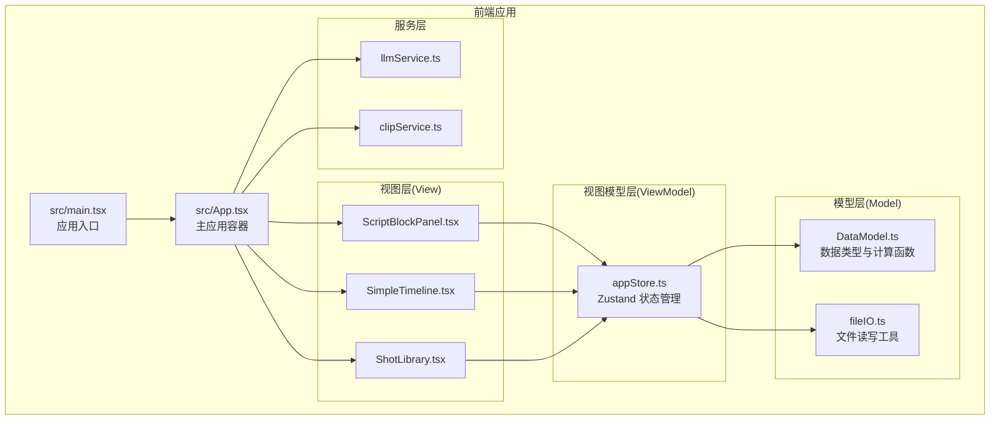
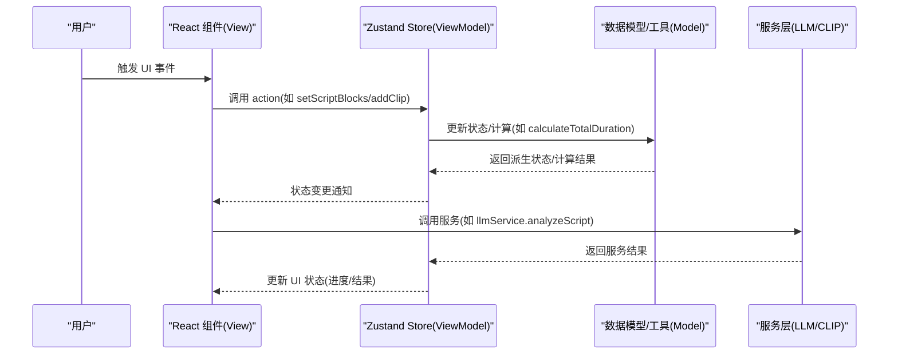
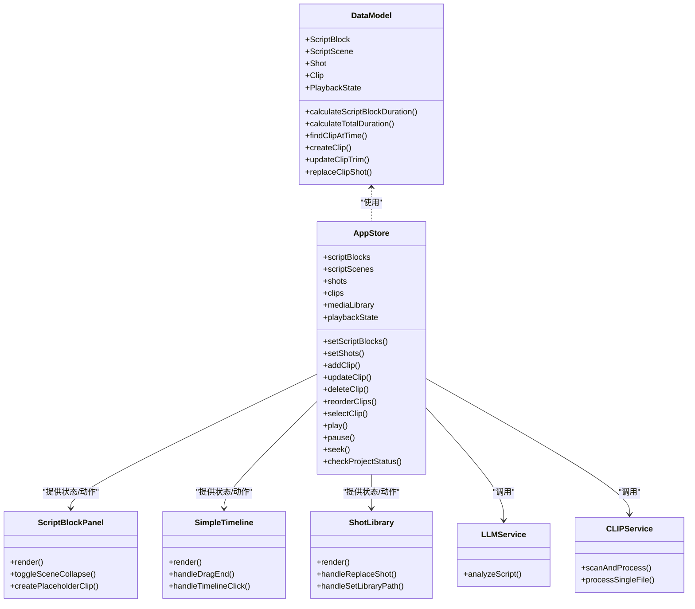
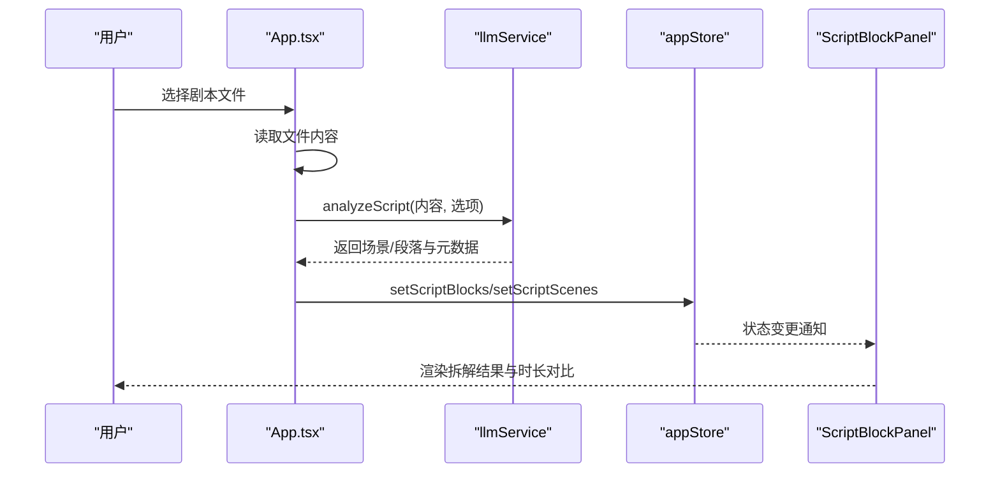
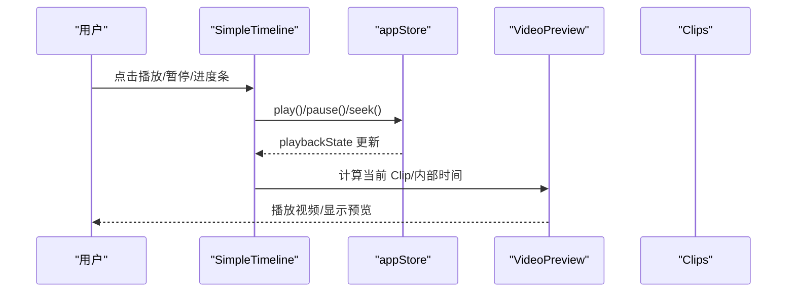
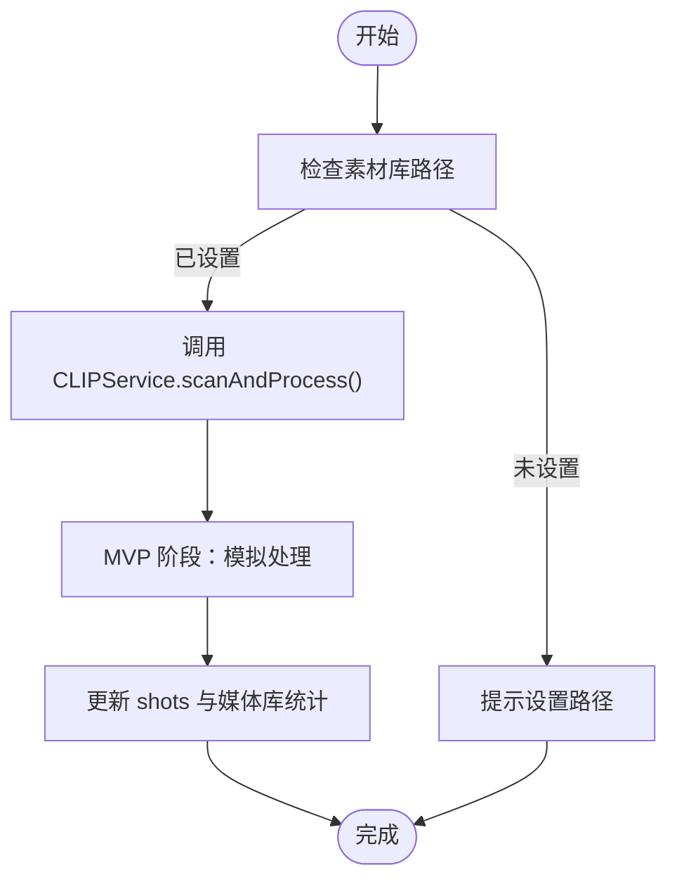
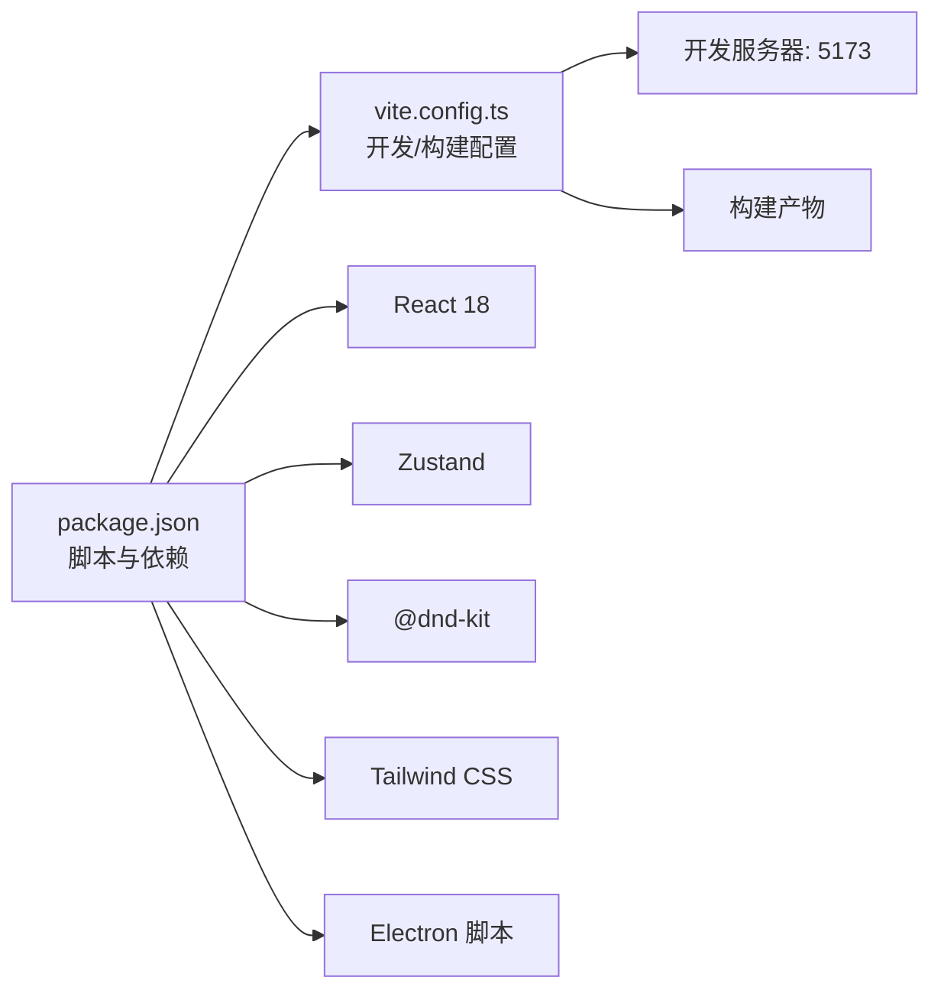

# 整体架构模式

<cite>
**本文档引用的文件**
- [README.md](file://README.md)
- [package.json](file://package.json)
- [vite.config.ts](file://vite.config.ts)
- [src/main.tsx](file://src/main.tsx)
- [src/App.tsx](file://src/App.tsx)
- [src/store/appStore.ts](file://src/store/appStore.ts)
- [src/types/DataModel.ts](file://src/types/DataModel.ts)
- [src/utils/fileIO.ts](file://src/utils/fileIO.ts)
- [src/services/llmService.ts](file://src/services/llmService.ts)
- [src/services/clipService.ts](file://src/services/clipService.ts)
- [src/components/ScriptBlockPanel.tsx](file://src/components/ScriptBlockPanel.tsx)
- [src/components/SimpleTimeline.tsx](file://src/components/SimpleTimeline.tsx)
- [src/components/ShotLibrary.tsx](file://src/components/ShotLibrary.tsx)
</cite>

## 目录
1. [简介](#简介)
2. [项目结构](#项目结构)
3. [核心组件](#核心组件)
4. [架构总览](#架构总览)
5. [详细组件分析](#详细组件分析)
6. [依赖分析](#依赖分析)
7. [性能考量](#性能考量)
8. [故障排查指南](#故障排查指南)
9. [结论](#结论)

## 简介
本项目采用 MVVM 架构模式，围绕“导演分镜验证”这一目标，提供剧本段落、时间轴与素材库三大功能模块。MVVM 在本项目中的体现如下：
- Model 层：数据模型与业务数据（剧本段落、镜头、素材、播放状态等），由统一的数据类型定义与工具函数支撑。
- View 层：React 组件负责渲染与交互，承担 UI 表现与用户输入捕获。
- ViewModel 层：Zustand 全局状态管理，集中协调数据与视图之间的状态流转，封装业务逻辑与状态变更。

此外，项目使用 Vite 作为构建工具，结合 Electron 脚本实现桌面应用打包；服务层通过 LLM/CLIP 服务抽象，实现 AI 驱动的剧本拆解与素材内容分析。

## 项目结构
项目采用按职责分层的组织方式：
- src/types：数据模型与类型定义，统一约束 Model 层数据结构。
- src/store：Zustand 全局状态，承载 ViewModel 层逻辑。
- src/components：React 组件，承担 View 层职责。
- src/services：外部服务封装（LLM/CLIP），隔离业务与外部依赖。
- src/utils：通用工具（文件 IO、计算函数等），服务于 Model 与 ViewModel。
- public/data：静态数据资源（JSON），作为 MVP 阶段的数据来源。

图表来源
- [src/main.tsx](file://src/main.tsx#L1-L11)
- [src/App.tsx](file://src/App.tsx#L1-L497)
- [src/store/appStore.ts](file://src/store/appStore.ts#L1-L195)
- [src/types/DataModel.ts](file://src/types/DataModel.ts#L1-L291)
- [src/utils/fileIO.ts](file://src/utils/fileIO.ts#L1-L95)
- [src/services/llmService.ts](file://src/services/llmService.ts#L1-L476)
- [src/services/clipService.ts](file://src/services/clipService.ts#L1-L394)
- [src/components/ScriptBlockPanel.tsx](file://src/components/ScriptBlockPanel.tsx#L1-L285)
- [src/components/SimpleTimeline.tsx](file://src/components/SimpleTimeline.tsx#L1-L414)
- [src/components/ShotLibrary.tsx](file://src/components/ShotLibrary.tsx#L1-L359)

章节来源
- [README.md](file://README.md#L126-L150)

## 核心组件
- 应用入口与主容器
  - 入口文件负责挂载 React 应用。
  - 主应用容器负责加载项目数据、协调服务调用、管理全局 UI 状态与模态框。
- 视图层组件
  - 剧本段落面板：展示剧本段落、时长对比、场景折叠、占位符创建。
  - 简化时间轴：单轨时间轴、播放预览、拖拽排序、裁剪手柄、播放控制。
  - 素材库：情绪/状态筛选、素材替换、路径配置、素材管理。
- 视图模型层（Zustand）
  - 统一管理脚本段落、场景、镜头、素材、媒体库、播放状态等。
  - 提供选择、播放、计算、检查等功能方法。
- 模型层（数据模型与工具）
  - 统一的数据类型定义与计算函数（时长、查找、创建、更新等）。
  - 文件 IO 工具（加载/保存 JSON、导出项目）。
- 服务层
  - LLM 服务：剧本分析、场景拆解、时长估算。
  - CLIP 服务：素材扫描与内容分析（MVP 阶段模拟，生产环境预留 API 接口）。

章节来源
- [src/main.tsx](file://src/main.tsx#L1-L11)
- [src/App.tsx](file://src/App.tsx#L1-L497)
- [src/store/appStore.ts](file://src/store/appStore.ts#L1-L195)
- [src/types/DataModel.ts](file://src/types/DataModel.ts#L1-L291)
- [src/utils/fileIO.ts](file://src/utils/fileIO.ts#L1-L95)
- [src/services/llmService.ts](file://src/services/llmService.ts#L1-L476)
- [src/services/clipService.ts](file://src/services/clipService.ts#L1-L394)
- [src/components/ScriptBlockPanel.tsx](file://src/components/ScriptBlockPanel.tsx#L1-L285)
- [src/components/SimpleTimeline.tsx](file://src/components/SimpleTimeline.tsx#L1-L414)
- [src/components/ShotLibrary.tsx](file://src/components/ShotLibrary.tsx#L1-L359)

## 架构总览
MVVM 在本项目中的落地要点：
- Model-View 分离
  - Model 层通过类型定义与计算函数确保数据一致性与可预测性。
  - View 层只负责渲染与事件回调，不直接操作状态。
- ViewModel-View 绑定
  - ViewModel 通过 Zustand 订阅状态变化，驱动视图更新。
  - 组件通过 hooks 订阅所需状态片段，避免跨组件耦合。
- 服务层解耦
  - LLM/CLIP 服务对外暴露统一接口，内部可替换实现（MVP 模拟与生产 API）。
- 数据流方向
  - 用户操作触发 View -> ViewModel（actions），ViewModel 更新 Model（store/state），Model 通过计算函数派生状态，最终反馈到 View。

图表来源
- [src/App.tsx](file://src/App.tsx#L70-L169)
- [src/store/appStore.ts](file://src/store/appStore.ts#L60-L195)
- [src/services/llmService.ts](file://src/services/llmService.ts#L72-L101)
- [src/services/clipService.ts](file://src/services/clipService.ts#L36-L60)
- [src/types/DataModel.ts](file://src/types/DataModel.ts#L195-L237)

## 详细组件分析

### MVVM 分层职责与交互
- Model 层职责
  - 统一的数据结构定义（ScriptBlock、ScriptScene、Shot、Clip、PlaybackState 等）。
  - 计算函数（时长计算、播放定位、创建/更新 Clip 等）。
  - 文件 IO（加载/保存 JSON、导出项目）。
- View 层职责
  - ScriptBlockPanel：渲染剧本段落、场景折叠、时长对比、占位符创建。
  - SimpleTimeline：渲染时间轴、播放预览、拖拽排序、裁剪手柄、播放控制。
  - ShotLibrary：渲染素材库、筛选、替换、路径配置。
- ViewModel 层职责
  - appStore：集中管理状态、提供 actions、封装计算与检查逻辑。
  - 通过 hooks 订阅状态，避免跨组件直接共享状态。

图表来源
- [src/types/DataModel.ts](file://src/types/DataModel.ts#L1-L291)
- [src/store/appStore.ts](file://src/store/appStore.ts#L1-L195)
- [src/components/ScriptBlockPanel.tsx](file://src/components/ScriptBlockPanel.tsx#L1-L285)
- [src/components/SimpleTimeline.tsx](file://src/components/SimpleTimeline.tsx#L1-L414)
- [src/components/ShotLibrary.tsx](file://src/components/ShotLibrary.tsx#L1-L359)
- [src/services/llmService.ts](file://src/services/llmService.ts#L1-L476)
- [src/services/clipService.ts](file://src/services/clipService.ts#L1-L394)

章节来源
- [src/types/DataModel.ts](file://src/types/DataModel.ts#L1-L291)
- [src/store/appStore.ts](file://src/store/appStore.ts#L1-L195)
- [src/components/ScriptBlockPanel.tsx](file://src/components/ScriptBlockPanel.tsx#L1-L285)
- [src/components/SimpleTimeline.tsx](file://src/components/SimpleTimeline.tsx#L1-L414)
- [src/components/ShotLibrary.tsx](file://src/components/ShotLibrary.tsx#L1-L359)
- [src/services/llmService.ts](file://src/services/llmService.ts#L1-L476)
- [src/services/clipService.ts](file://src/services/clipService.ts#L1-L394)

### 组件化架构与单一职责
- 单一职责原则
  - ScriptBlockPanel：专注剧本段落展示与占位符创建。
  - SimpleTimeline：专注时间轴渲染、播放预览与拖拽排序。
  - ShotLibrary：专注素材库展示、筛选与替换。
  - appStore：专注状态聚合与动作封装。
- 组件复用策略
  - 通过 props 传递数据与回调，减少跨组件耦合。
  - ViewModel 通过 hooks 提供状态订阅，组件按需订阅，避免重复渲染。
  - 类型定义集中管理，保证跨组件数据一致性。

章节来源
- [src/components/ScriptBlockPanel.tsx](file://src/components/ScriptBlockPanel.tsx#L1-L285)
- [src/components/SimpleTimeline.tsx](file://src/components/SimpleTimeline.tsx#L1-L414)
- [src/components/ShotLibrary.tsx](file://src/components/ShotLibrary.tsx#L1-L359)
- [src/store/appStore.ts](file://src/store/appStore.ts#L1-L195)

### 数据流与处理逻辑

#### 剧本导入与 LLM 分析流程

图表来源
- [src/App.tsx](file://src/App.tsx#L70-L169)
- [src/services/llmService.ts](file://src/services/llmService.ts#L72-L101)
- [src/store/appStore.ts](file://src/store/appStore.ts#L82-L89)
- [src/components/ScriptBlockPanel.tsx](file://src/components/ScriptBlockPanel.tsx#L10-L29)

章节来源
- [src/App.tsx](file://src/App.tsx#L70-L169)
- [src/services/llmService.ts](file://src/services/llmService.ts#L1-L476)
- [src/store/appStore.ts](file://src/store/appStore.ts#L1-L195)
- [src/components/ScriptBlockPanel.tsx](file://src/components/ScriptBlockPanel.tsx#L1-L285)

#### 时间轴播放与预览流程

图表来源
- [src/components/SimpleTimeline.tsx](file://src/components/SimpleTimeline.tsx#L35-L205)
- [src/store/appStore.ts](file://src/store/appStore.ts#L114-L129)

章节来源
- [src/components/SimpleTimeline.tsx](file://src/components/SimpleTimeline.tsx#L1-L414)
- [src/store/appStore.ts](file://src/store/appStore.ts#L1-L195)

#### 素材扫描与 CLIP 处理流程

图表来源
- [src/App.tsx](file://src/App.tsx#L171-L252)
- [src/services/clipService.ts](file://src/services/clipService.ts#L36-L60)
- [src/store/appStore.ts](file://src/store/appStore.ts#L180-L193)

章节来源
- [src/App.tsx](file://src/App.tsx#L171-L252)
- [src/services/clipService.ts](file://src/services/clipService.ts#L1-L394)
- [src/store/appStore.ts](file://src/store/appStore.ts#L1-L195)

## 依赖分析
- 技术栈与工具链
  - 前端：React 18 + TypeScript + Vite
  - 状态管理：Zustand
  - 拖拽：@dnd-kit
  - 样式：Tailwind CSS
  - 数据：JSON 文件（localStorage 持久化）
  - 服务：LLM/CLIP 服务抽象
- 项目脚本与 Electron 集成
  - package.json 提供 dev/build/preview/electron 脚本，支持开发与桌面应用打包。
  - Vite 配置启用 React 插件与本地开发服务器。

图表来源
- [package.json](file://package.json#L1-L36)
- [vite.config.ts](file://vite.config.ts#L1-L12)

章节来源
- [package.json](file://package.json#L1-L36)
- [vite.config.ts](file://vite.config.ts#L1-L12)
- [README.md](file://README.md#L118-L125)

## 性能考量
- 状态粒度与订阅优化
  - 通过 ViewModel 粒度化状态与计算，避免不必要的重渲染。
  - 组件按需订阅状态片段，减少全局广播。
- 计算函数与缓存
  - 将复杂计算（时长、播放定位）集中在 Model 层，减少重复计算。
- 拖拽与渲染
  - 时间轴使用 @dnd-kit 优化拖拽体验，合理设置像素/秒比例，避免过度重排。
- 服务调用与超时
  - LLM/CLIP 服务设置超时与回退策略，提升稳定性与用户体验。

## 故障排查指南
- 剧本导入失败
  - 检查文件格式（仅支持 .txt/.json），确认 LLM 服务可用或查看回退逻辑。
- 素材库扫描异常
  - 确认素材库路径设置正确，检查 CLIP 服务模拟逻辑与错误提示。
- 播放预览无视频
  - 确认素材库中已为 Clip 绑定有效视频路径，或使用占位符进行验证。
- 保存/导出失败
  - 检查浏览器 localStorage 权限与容量，必要时清理缓存或改用导出功能。

章节来源
- [src/App.tsx](file://src/App.tsx#L70-L169)
- [src/App.tsx](file://src/App.tsx#L171-L252)
- [src/components/SimpleTimeline.tsx](file://src/components/SimpleTimeline.tsx#L115-L156)
- [src/utils/fileIO.ts](file://src/utils/fileIO.ts#L1-L95)

## 结论
本项目以 MVVM 为核心架构，清晰划分 Model-View-ViewModel 三层职责，配合组件化设计与 Zustand 状态管理，实现了剧本段落、时间轴与素材库的高效协作。Vite 与 Electron 的集成为开发与桌面应用打包提供了良好基础，服务层通过 LLM/CLIP 抽象，既满足 MVP 阶段需求，又为后续生产环境扩展预留空间。建议持续优化状态订阅粒度与计算缓存，进一步提升交互流畅度与可维护性。