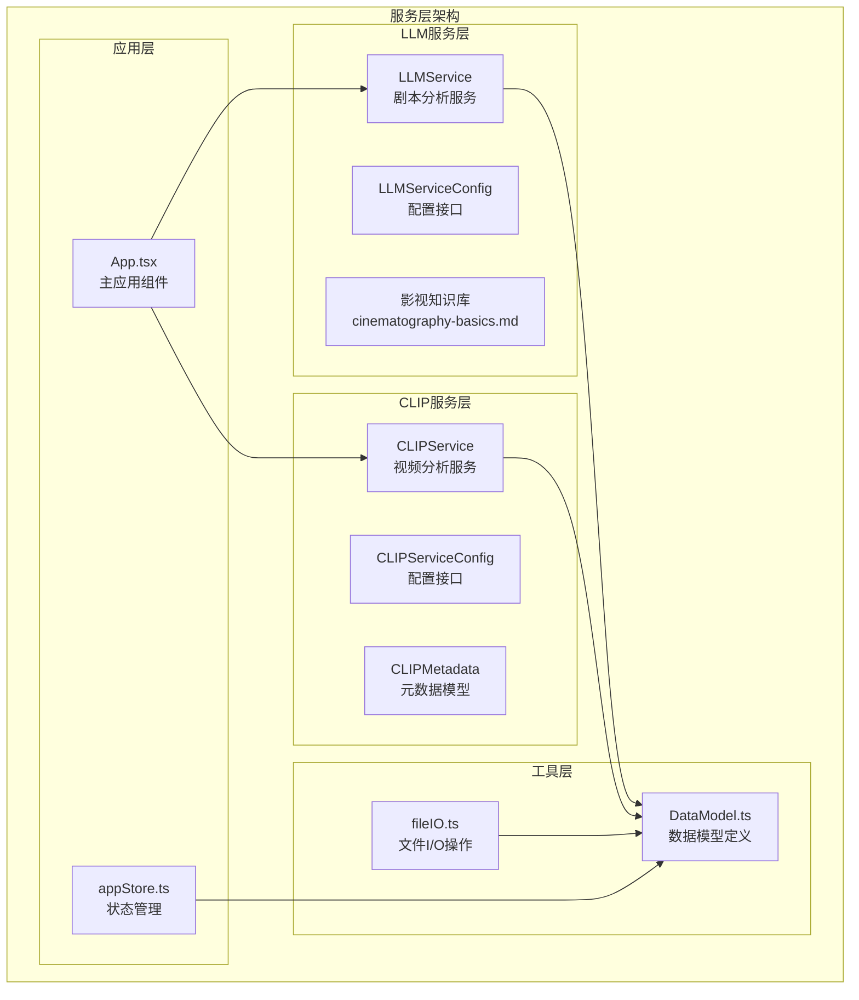
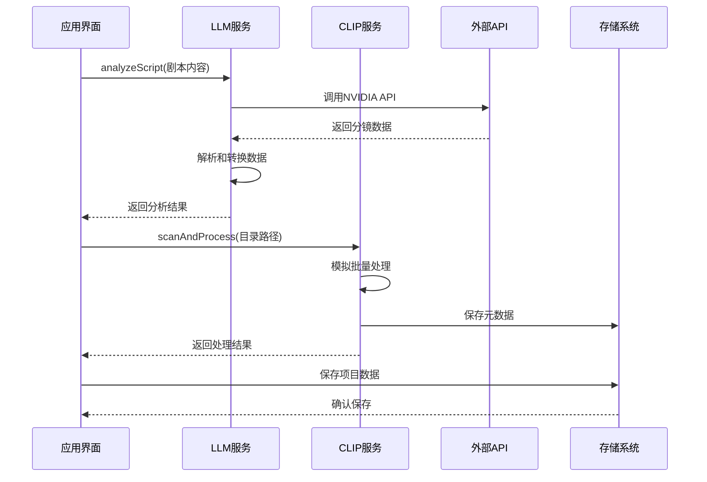
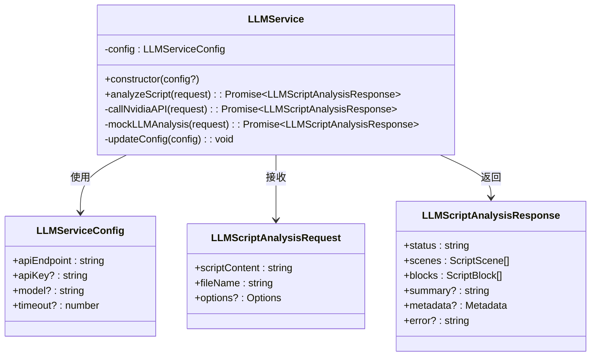
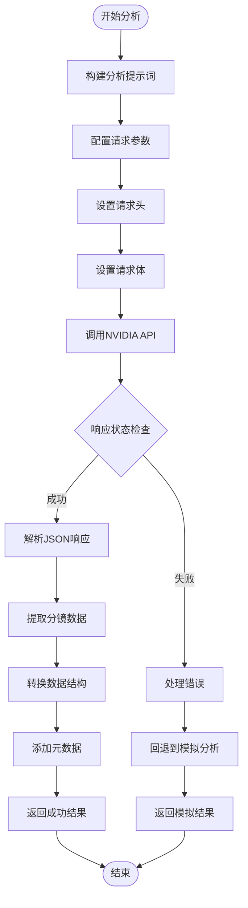
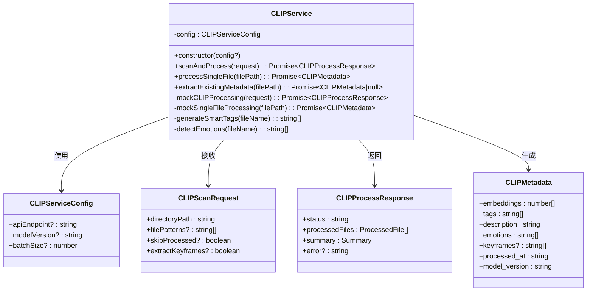
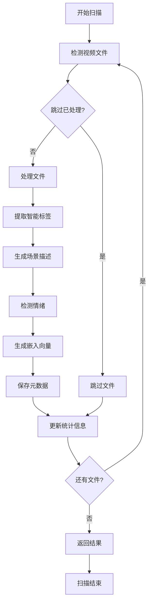
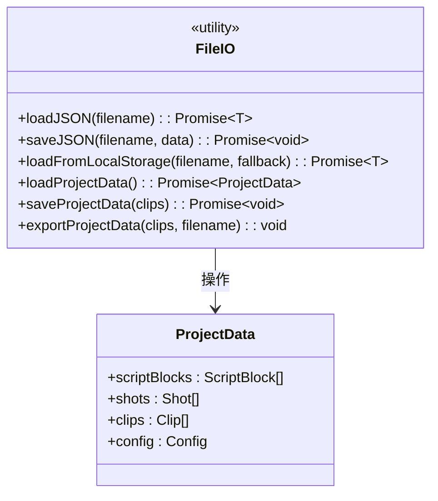
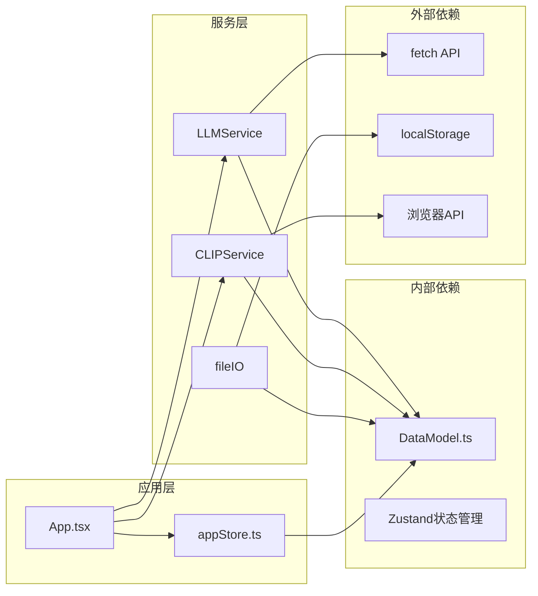

# 服务层架构

<cite>
**本文档引用的文件**
- [llmService.ts](file://src/services/llmService.ts)
- [clipService.ts](file://src/services/clipService.ts)
- [fileIO.ts](file://src/utils/fileIO.ts)
- [DataModel.ts](file://src/types/DataModel.ts)
- [appStore.ts](file://src/store/appStore.ts)
- [App.tsx](file://src/App.tsx)
- [README.md](file://README.md)
- [package.json](file://package.json)
</cite>

## 目录
1. [简介](#简介)
2. [项目结构](#项目结构)
3. [核心组件](#核心组件)
4. [架构概览](#架构概览)
5. [详细组件分析](#详细组件分析)
6. [依赖分析](#依赖分析)
7. [性能考量](#性能考量)
8. [故障排除指南](#故障排除指南)
9. [结论](#结论)
10. [附录](#附录)

## 简介
CGCUT是一个专业的导演分镜验证工具，采用服务层架构将AI智能分析与媒体处理功能模块化。该架构的核心理念是职责分离：LLM服务专注于剧本智能拆解和场景分析，CLIP服务负责视频内容分析和元数据提取，两者通过清晰的数据契约进行协作。

项目采用MVP（最小可行产品）策略，在保证核心功能的前提下，为后续的生产环境集成预留了充分的扩展空间。

## 项目结构
服务层位于src/services目录下，采用按功能域划分的组织方式：

**图表来源**
- [llmService.ts](file://src/services/llmService.ts#L62-L476)
- [clipService.ts](file://src/services/clipService.ts#L22-L394)
- [fileIO.ts](file://src/utils/fileIO.ts#L1-L95)
- [DataModel.ts](file://src/types/DataModel.ts#L1-L291)

**章节来源**
- [README.md](file://README.md#L126-L150)
- [package.json](file://package.json#L1-L36)

## 核心组件
服务层由三个核心组件构成，每个组件都实现了单一职责原则：

### LLM服务（LLMService）
- **职责**：基于NVIDIA API的剧本智能分析，将原始剧本拆解为专业的分镜镜头序列
- **核心能力**：场景识别、镜头拆分、情绪标注、时长估算
- **配置管理**：支持自定义API端点、模型版本、超时时间等参数

### CLIP服务（CLIPService）
- **职责**：视频内容分析和元数据提取，支持批量处理和单文件处理
- **核心能力**：智能标签生成、场景描述、情绪识别、关键帧提取
- **模拟实现**：提供完整的MVP阶段模拟功能，便于开发和测试

### 文件I/O服务（fileIO）
- **职责**：项目数据的持久化和导出功能
- **核心能力**：JSON数据加载、本地存储、项目导出
- **设计模式**：Promise-based异步操作，错误处理和回退机制

**章节来源**
- [llmService.ts](file://src/services/llmService.ts#L62-L101)
- [clipService.ts](file://src/services/clipService.ts#L22-L81)
- [fileIO.ts](file://src/utils/fileIO.ts#L7-L95)

## 架构概览
服务层采用分层架构设计，通过清晰的接口契约实现松耦合：

**图表来源**
- [App.tsx](file://src/App.tsx#L106-L134)
- [App.tsx](file://src/App.tsx#L186-L252)
- [llmService.ts](file://src/services/llmService.ts#L106-L323)
- [clipService.ts](file://src/services/clipService.ts#L36-L165)

## 详细组件分析

### LLM服务架构分析

#### 设计理念
LLM服务采用"知识库驱动 + 大模型集成"的设计模式，通过内置的专业影视知识库确保分析结果的专业性和一致性。

**图表来源**
- [llmService.ts](file://src/services/llmService.ts#L42-L57)
- [llmService.ts](file://src/services/llmService.ts#L59-L84)
- [DataModel.ts](file://src/types/DataModel.ts#L58-L84)

#### NVIDIA API集成机制
LLM服务通过HTTP请求与NVIDIA API进行交互，实现了完整的请求参数配置和响应处理流程：

**图表来源**
- [llmService.ts](file://src/services/llmService.ts#L106-L323)

#### 请求参数配置
LLM服务的NVIDIA API集成包含以下关键配置：

| 参数 | 类型 | 默认值 | 说明 |
|------|------|--------|------|
| apiEndpoint | string | NVIDIA API端点 | AI服务访问地址 |
| apiKey | string | NVAPI密钥 | 认证令牌 |
| model | string | Llama 3.1 405B | 模型版本 |
| timeout | number | 120000ms | 超时时间 |

#### 响应处理机制
服务实现了robust的响应处理，包括JSON提取、数据验证和错误恢复：

1. **JSON提取**：支持Markdown代码块标记和纯JSON格式
2. **数据验证**：检查场景数量、镜头格式和必需字段
3. **错误恢复**：API失败时自动回退到模拟分析

**章节来源**
- [llmService.ts](file://src/services/llmService.ts#L106-L323)

### CLIP服务架构分析

#### 设计理念
CLIP服务采用"模拟优先 + 生产就绪"的设计策略，MVP阶段提供完整的模拟功能，同时保留生产环境的无缝迁移路径。

**图表来源**
- [clipService.ts](file://src/services/clipService.ts#L12-L31)
- [clipService.ts](file://src/services/clipService.ts#L19-L49)
- [DataModel.ts](file://src/types/DataModel.ts#L9-L17)

#### 视频内容分析实现机制
CLIP服务通过智能算法实现视频内容的自动化分析：

**图表来源**
- [clipService.ts](file://src/services/clipService.ts#L107-L165)

#### 元数据提取机制
服务实现了多层次的元数据提取策略：

1. **智能标签生成**：基于文件名模式识别场景类型、镜头类型、人物特征等
2. **场景描述生成**：结合标签信息生成自然语言描述
3. **情绪识别**：通过关键词匹配识别视频内容的情绪属性
4. **嵌入向量生成**：创建512维的特征向量用于相似度搜索

#### 批处理逻辑
CLIP服务支持高效的批处理模式：

- **批量大小控制**：默认5个文件一批
- **并发处理**：模拟环境中使用Promise.all实现并行处理
- **进度跟踪**：实时更新处理进度和统计信息
- **错误隔离**：单个文件失败不影响整体处理流程

**章节来源**
- [clipService.ts](file://src/services/clipService.ts#L107-L332)

### 文件I/O操作设计模式

#### 设计模式
fileIO模块采用了现代Web开发的最佳实践：

**图表来源**
- [fileIO.ts](file://src/utils/fileIO.ts#L7-L95)

#### JSON数据处理
服务提供了完整的JSON数据处理能力：

1. **异步加载**：使用fetch API进行异步数据加载
2. **错误处理**：统一的错误捕获和用户友好的错误消息
3. **类型安全**：TypeScript泛型确保数据类型正确性
4. **回退机制**：localStorage作为后备存储方案

#### 项目导出功能
项目导出采用浏览器原生API实现：

- **Blob对象**：创建可下载的JSON文件
- **URL对象**：临时文件链接管理
- **自动下载**：无需服务器端处理的客户端导出
- **文件命名**：时间戳确保文件唯一性

**章节来源**
- [fileIO.ts](file://src/utils/fileIO.ts#L7-L95)

## 依赖分析

### 组件耦合关系
服务层采用低耦合设计，通过清晰的接口定义实现模块间的松散耦合：

**图表来源**
- [llmService.ts](file://src/services/llmService.ts#L1-L10)
- [clipService.ts](file://src/services/clipService.ts#L6-L10)
- [fileIO.ts](file://src/utils/fileIO.ts#L1-L1)
- [DataModel.ts](file://src/types/DataModel.ts#L1-L291)

### 错误处理机制
服务层实现了多层次的错误处理策略：

1. **API错误处理**：NVIDIA API调用失败时的优雅降级
2. **网络异常处理**：超时、连接失败等网络问题的处理
3. **数据解析错误**：JSON格式错误和数据结构不匹配的处理
4. **用户反馈机制**：通过UI状态和进度条提供实时反馈

**章节来源**
- [llmService.ts](file://src/services/llmService.ts#L94-L100)
- [clipService.ts](file://src/services/clipService.ts#L45-L59)

## 性能考量
服务层在设计时充分考虑了性能优化：

### 异步处理
- **Promise链式调用**：避免阻塞主线程
- **并发控制**：批量处理时的并发数量限制
- **内存管理**：及时清理临时对象和事件监听器

### 缓存策略
- **模拟数据缓存**：MVP阶段的模拟数据减少重复计算
- **状态持久化**：localStorage存储确保用户体验连续性
- **进度状态**：实时进度反馈提升用户感知性能

### 优化建议
1. **请求超时配置**：根据网络环境调整超时时间
2. **批处理大小**：根据设备性能调整批处理数量
3. **数据压缩**：对大文件传输进行压缩处理
4. **增量更新**：支持部分数据的增量同步

## 故障排除指南

### 常见问题诊断

#### LLM服务问题
1. **API调用失败**
   - 检查网络连接和API密钥
   - 验证请求参数格式
   - 查看控制台错误日志

2. **响应解析错误**
   - 确认返回数据格式符合预期
   - 检查JSON字符串格式
   - 验证数据结构完整性

#### CLIP服务问题
1. **文件扫描失败**
   - 检查目录权限和路径有效性
   - 验证文件格式支持性
   - 确认磁盘空间充足

2. **元数据提取异常**
   - 检查文件编码和格式
   - 验证文件完整性
   - 确认模拟数据生成逻辑

#### 文件I/O问题
1. **数据加载失败**
   - 检查文件路径和权限
   - 验证JSON格式正确性
   - 确认浏览器兼容性

2. **保存操作异常**
   - 检查localStorage容量限制
   - 验证浏览器存储权限
   - 确认数据序列化成功

**章节来源**
- [llmService.ts](file://src/services/llmService.ts#L235-L242)
- [clipService.ts](file://src/services/clipService.ts#L84-L101)
- [fileIO.ts](file://src/utils/fileIO.ts#L8-L18)

## 结论
CGCUT的服务层架构展现了现代前端应用的最佳实践：通过明确的职责分离、清晰的接口设计和完善的错误处理机制，实现了高度模块化的系统架构。LLM服务和CLIP服务的职责分离确保了各功能领域的专业性和可维护性，而文件I/O服务的抽象设计为数据持久化提供了灵活的解决方案。

该架构不仅满足了MVP阶段的功能需求，更为未来的生产环境集成和功能扩展奠定了坚实的基础。通过合理的性能优化和错误处理策略，系统能够在各种运行环境下保持稳定的性能表现。

## 附录

### 扩展指南

#### 添加新的AI服务
1. **创建服务类**：遵循现有服务类的模式
2. **定义数据模型**：在DataModel.ts中添加必要的接口
3. **实现API集成**：参考LLMService的NVIDIA API集成模式
4. **添加错误处理**：实现统一的错误处理和回退机制
5. **集成到应用**：在App.tsx中添加服务实例和UI集成

#### 配置管理最佳实践
- **环境变量**：使用环境变量管理API密钥和端点
- **配置验证**：在服务初始化时验证配置参数
- **动态更新**：支持运行时配置更新
- **默认值**：为可选配置提供合理的默认值

#### 性能监控
- **指标收集**：记录API调用时间和成功率
- **错误追踪**：收集详细的错误信息和上下文
- **用户行为**：监控用户操作和使用模式
- **性能报告**：定期生成性能分析报告