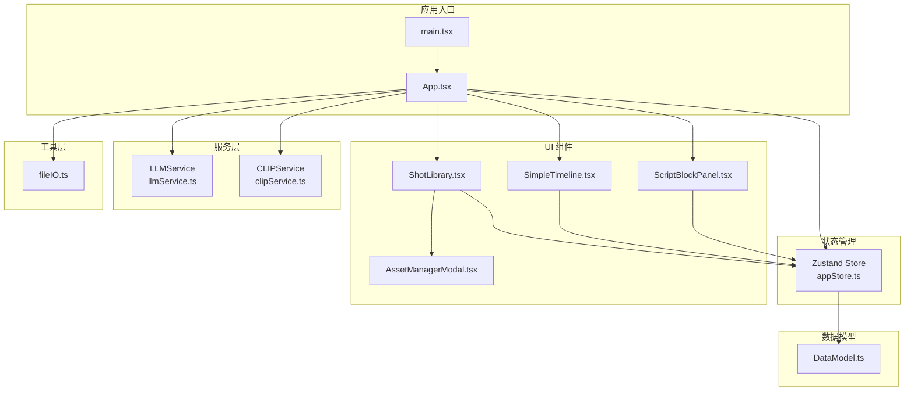
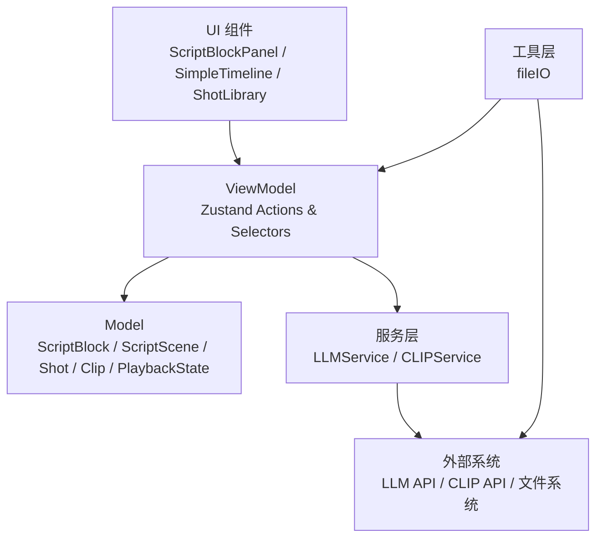
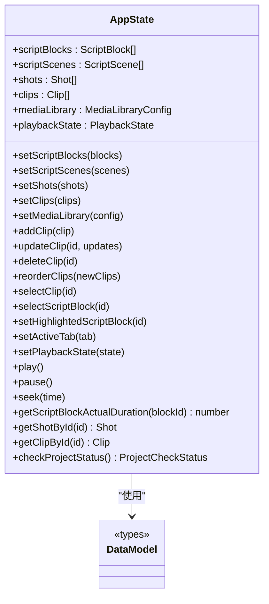
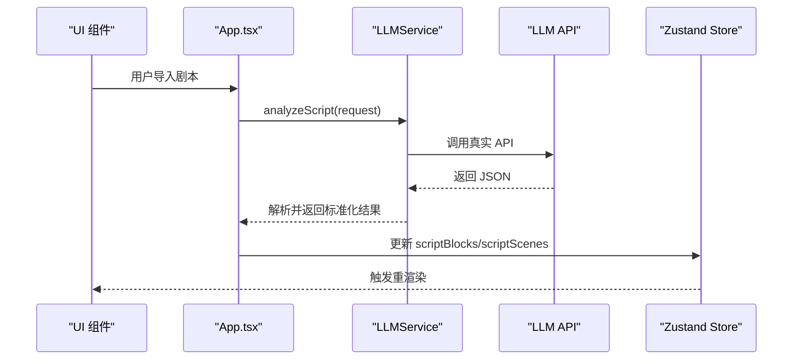
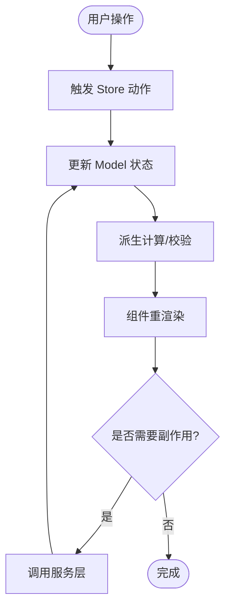
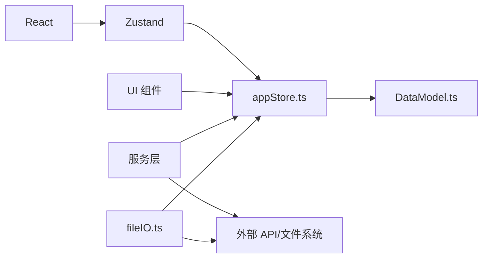

# 架构设计

<cite>
**本文档引用的文件**
- [README.md](file://README.md)
- [package.json](file://package.json)
- [src/main.tsx](file://src/main.tsx)
- [src/App.tsx](file://src/App.tsx)
- [src/store/appStore.ts](file://src/store/appStore.ts)
- [src/types/DataModel.ts](file://src/types/DataModel.ts)
- [src/services/llmService.ts](file://src/services/llmService.ts)
- [src/services/clipService.ts](file://src/services/clipService.ts)
- [src/utils/fileIO.ts](file://src/utils/fileIO.ts)
- [src/components/ScriptBlockPanel.tsx](file://src/components/ScriptBlockPanel.tsx)
- [src/components/SimpleTimeline.tsx](file://src/components/SimpleTimeline.tsx)
- [src/components/ShotLibrary.tsx](file://src/components/ShotLibrary.tsx)
- [src/components/AssetManagerModal.tsx](file://src/components/AssetManagerModal.tsx)
</cite>

## 目录
1. [简介](#简介)
2. [项目结构](#项目结构)
3. [核心组件](#核心组件)
4. [架构总览](#架构总览)
5. [详细组件分析](#详细组件分析)
6. [依赖关系分析](#依赖关系分析)
7. [性能考量](#性能考量)
8. [故障排查指南](#故障排查指南)
9. [结论](#结论)
10. [附录](#附录)

## 简介
CGCUT 是一款面向导演分镜验证的专业工具，旨在帮助用户在分镜阶段快速验证“剧本段落 × 镜头组合 × 实际节奏”是否成立，并能在约 30 分钟内从剧本到可播放时间轴，及时发现节奏问题。项目采用 MVVM 架构风格，结合组件化设计、Zustand 状态管理、服务层抽象以及清晰的数据流与组件通信模式，形成简洁高效的前端架构。

## 项目结构
项目采用“按功能域划分”的组件化组织方式，主要模块如下：
- 入口与主应用：main.tsx、App.tsx
- 类型与数据模型：types/DataModel.ts
- 状态管理：store/appStore.ts（Zustand）
- 服务层：services/llmService.ts、services/clipService.ts
- 工具层：utils/fileIO.ts
- UI 组件：components 下的各面板组件
- 配置与资源：public/data 下的 JSON 数据文件

图表来源
- [src/main.tsx](file://src/main.tsx#L1-L11)
- [src/App.tsx](file://src/App.tsx#L1-L497)
- [src/store/appStore.ts](file://src/store/appStore.ts#L1-L195)
- [src/types/DataModel.ts](file://src/types/DataModel.ts#L1-L291)
- [src/services/llmService.ts](file://src/services/llmService.ts#L1-L476)
- [src/services/clipService.ts](file://src/services/clipService.ts#L1-L394)
- [src/utils/fileIO.ts](file://src/utils/fileIO.ts#L1-L95)
- [src/components/ScriptBlockPanel.tsx](file://src/components/ScriptBlockPanel.tsx#L1-L285)
- [src/components/SimpleTimeline.tsx](file://src/components/SimpleTimeline.tsx#L1-L414)
- [src/components/ShotLibrary.tsx](file://src/components/ShotLibrary.tsx#L1-L359)
- [src/components/AssetManagerModal.tsx](file://src/components/AssetManagerModal.tsx#L1-L511)

章节来源
- [README.md](file://README.md#L126-L150)
- [package.json](file://package.json#L1-L36)

## 核心组件
- 主应用 App：负责加载项目数据、协调 LLM/CLIP 服务、统一状态更新与 UI 控制。
- Zustand Store：集中管理全局状态（剧本段落、场景、镜头、素材、播放状态、媒体库配置等），提供派生计算与项目状态检查。
- 服务层：
  - LLMService：封装对 LLM 的调用，支持真实 API 与 MVP 模拟。
  - CLIPService：封装对 CLIP 的调用，支持真实 API 与 MVP 模拟。
- 工具层 fileIO：封装数据加载与保存（MVP 阶段使用 localStorage）。
- UI 组件：
  - ScriptBlockPanel：展示与管理剧本段落，支持占位创建与时长对比。
  - SimpleTimeline：单轨时间轴，支持拖拽排序、播放控制、裁剪占位、播放预览。
  - ShotLibrary：素材库，支持筛选、替换、编辑、删除、扫描与处理。
  - AssetManagerModal：专业素材管理弹窗，支持批量处理、导入、排序与搜索。

章节来源
- [src/App.tsx](file://src/App.tsx#L1-L497)
- [src/store/appStore.ts](file://src/store/appStore.ts#L1-L195)
- [src/services/llmService.ts](file://src/services/llmService.ts#L1-L476)
- [src/services/clipService.ts](file://src/services/clipService.ts#L1-L394)
- [src/utils/fileIO.ts](file://src/utils/fileIO.ts#L1-L95)
- [src/components/ScriptBlockPanel.tsx](file://src/components/ScriptBlockPanel.tsx#L1-L285)
- [src/components/SimpleTimeline.tsx](file://src/components/SimpleTimeline.tsx#L1-L414)
- [src/components/ShotLibrary.tsx](file://src/components/ShotLibrary.tsx#L1-L359)
- [src/components/AssetManagerModal.tsx](file://src/components/AssetManagerModal.tsx#L1-L511)

## 架构总览
CGCUT 采用 MVVM 风格的前端架构：
- Model：由 Zustand Store 与 DataModel 定义的数据结构组成，承载业务数据与派生计算。
- View：UI 组件树，负责渲染与交互。
- ViewModel：Store 中的动作与派生函数充当 ViewModel，将 Model 转换为 View 可消费的状态。
- 服务层：LLMService 与 CLIPService 抽象外部能力，屏蔽真实 API 与模拟实现差异。
- 数据流：从 UI 事件触发 Store 动作，Store 更新 Model，View 重新渲染；服务层通过副作用更新 Store。

图表来源
- [src/App.tsx](file://src/App.tsx#L1-L497)
- [src/store/appStore.ts](file://src/store/appStore.ts#L1-L195)
- [src/services/llmService.ts](file://src/services/llmService.ts#L1-L476)
- [src/services/clipService.ts](file://src/services/clipService.ts#L1-L394)
- [src/utils/fileIO.ts](file://src/utils/fileIO.ts#L1-L95)

## 详细组件分析

### Zustand 状态管理（MVVM 的 ViewModel 层）
- 设计目标：集中管理全局状态，提供派生计算与项目状态检查，避免组件内部重复逻辑。
- 关键特性：
  - 状态切片：scriptBlocks、scriptScenes、shots、clips、mediaLibrary、playbackState 等。
  - 动作函数：addClip、updateClip、deleteClip、reorderClips、selectClip、setPlaybackState、play/pause/seek 等。
  - 派生函数：getScriptBlockActualDuration、checkProjectStatus、getShotById、getClipById 等。
  - 计算属性：根据 clips 计算每个 ScriptBlock 实际时长，用于 UI 时长对比。
- 优势：
  - 无样板代码，API 简洁，易于维护。
  - 与 React Hooks 深度集成，便于组件订阅局部状态。
  - 支持复杂状态更新与跨组件共享。

图表来源
- [src/store/appStore.ts](file://src/store/appStore.ts#L1-L195)
- [src/types/DataModel.ts](file://src/types/DataModel.ts#L1-L291)

章节来源
- [src/store/appStore.ts](file://src/store/appStore.ts#L1-L195)
- [src/types/DataModel.ts](file://src/types/DataModel.ts#L195-L291)

### 服务层抽象（LLM 与 CLIP）
- LLMService：
  - 支持真实 NVIDIA API 调用与 MVP 模拟回退。
  - 通过 Prompt 控制输出格式与拆解规则，确保每个场景至少 3 个镜头。
  - 返回标准化的 ScriptScene/ScriptBlock 结构与元数据。
- CLIPService：
  - 支持真实 API 与 MVP 模拟，生成标签、情绪、描述与特征向量。
  - 提供批量扫描与单文件处理接口，支持跳过已处理与关键帧提取。
- 设计要点：
  - 统一的请求/响应接口，便于替换实现。
  - 错误处理与回退策略，保证 MVP 可用性。
  - 保留生产环境接入点（注释示例），便于平滑迁移。

图表来源
- [src/App.tsx](file://src/App.tsx#L70-L170)
- [src/services/llmService.ts](file://src/services/llmService.ts#L72-L101)
- [src/store/appStore.ts](file://src/store/appStore.ts#L82-L89)

章节来源
- [src/services/llmService.ts](file://src/services/llmService.ts#L1-L476)
- [src/services/clipService.ts](file://src/services/clipService.ts#L1-L394)

### 数据流与组件通信
- 单向数据流：UI 事件 -> Store 动作 -> Model 更新 -> View 重渲染。
- 组件间通信：
  - ScriptBlockPanel 与 SimpleTimeline 通过 Store 共享 clips 与 playbackState，实现播放状态联动。
  - ShotLibrary 与 SimpleTimeline 通过 Store 共享 selectedClipId 与 updateClip，实现素材替换。
  - App 作为协调者，负责调用服务层并将结果注入 Store。
- 播放预览：SimpleTimeline 内部根据 playbackState 计算当前 Clip 与内部时间，同步视频元素播放。

图表来源
- [src/App.tsx](file://src/App.tsx#L1-L497)
- [src/store/appStore.ts](file://src/store/appStore.ts#L1-L195)
- [src/components/SimpleTimeline.tsx](file://src/components/SimpleTimeline.tsx#L67-L109)

章节来源
- [src/components/ScriptBlockPanel.tsx](file://src/components/ScriptBlockPanel.tsx#L1-L285)
- [src/components/SimpleTimeline.tsx](file://src/components/SimpleTimeline.tsx#L1-L414)
- [src/components/ShotLibrary.tsx](file://src/components/ShotLibrary.tsx#L1-L359)

### 组件职责与交互

#### ScriptBlockPanel
- 职责：展示剧本段落，支持场景折叠、时长对比、创建占位 Clip、高亮当前播放段落。
- 交互：点击“+ 占位”为段落创建 Clip；根据播放状态高亮当前段落；Tab 在原文与 LLM 拆解之间切换。

章节来源
- [src/components/ScriptBlockPanel.tsx](file://src/components/ScriptBlockPanel.tsx#L1-L285)

#### SimpleTimeline
- 职责：单轨时间轴，支持拖拽排序、播放控制、点击跳转、播放指示器、裁剪占位。
- 交互：拖拽排序触发 reorderClips；点击时间轴跳转 seek；播放循环驱动 playbackState。

章节来源
- [src/components/SimpleTimeline.tsx](file://src/components/SimpleTimeline.tsx#L1-L414)

#### ShotLibrary 与 AssetManagerModal
- ShotLibrary：展示素材，支持筛选、替换、编辑、删除、扫描与处理；提供素材管理弹窗。
- AssetManagerModal：专业素材管理，支持批量处理、导入、排序、搜索、全选与状态切换。

章节来源
- [src/components/ShotLibrary.tsx](file://src/components/ShotLibrary.tsx#L1-L359)
- [src/components/AssetManagerModal.tsx](file://src/components/AssetManagerModal.tsx#L1-L511)

## 依赖关系分析
- 技术栈与依赖：
  - React 18 + TypeScript + Vite：现代前端开发体验。
  - Zustand：轻量状态管理，替代 Redux。
  - @dnd-kit：拖拽排序，提升时间轴交互体验。
  - Tailwind CSS：实用优先的样式框架。
  - Electron：可选桌面端运行。
- 组件耦合与内聚：
  - 组件通过 Store 解耦，低耦合高内聚。
  - 服务层与 Store 解耦，便于替换实现。
- 外部依赖：
  - LLM API（NVIDIA）与 CLIP API（本地/远程）。
  - 浏览器文件系统与 localStorage（MVP）。

图表来源
- [package.json](file://package.json#L14-L34)
- [src/store/appStore.ts](file://src/store/appStore.ts#L1-L195)
- [src/types/DataModel.ts](file://src/types/DataModel.ts#L1-L291)
- [src/utils/fileIO.ts](file://src/utils/fileIO.ts#L1-L95)

章节来源
- [package.json](file://package.json#L1-L36)

## 性能考量
- 状态更新粒度：Zustand 通过选择器订阅局部状态，减少不必要的重渲染。
- 派生计算：将复杂计算（如时长对比）放在 Store 内部，避免组件重复计算。
- 拖拽性能：@dnd-kit 优化拖拽体验，时间轴容器使用虚拟滚动思想（按需渲染可见片段）。
- I/O 优化：MVP 阶段使用 localStorage，减少网络往返；生产环境可引入缓存与批处理。
- 播放循环：SimpleTimeline 使用 requestAnimationFrame 控制播放，避免高频 setState。

[本节为通用指导，无需特定文件来源]

## 故障排查指南
- LLM 分析失败：
  - 现象：导入剧本后报错或返回空结果。
  - 排查：检查 API Key、网络连通性；查看服务层回退逻辑是否生效。
- CLIP 处理失败：
  - 现象：扫描素材库失败或进度卡住。
  - 排查：确认素材库路径、文件格式；查看服务层模拟逻辑与错误信息。
- 播放异常：
  - 现象：视频不播放或时间不同步。
  - 排查：检查素材路径、视频元素同步逻辑、playbackState 更新。
- 数据丢失：
  - 现象：刷新页面后数据消失。
  - 排查：确认 localStorage 存储与读取逻辑；生产环境可迁移到 Electron 文件写入。

章节来源
- [src/services/llmService.ts](file://src/services/llmService.ts#L94-L101)
- [src/services/clipService.ts](file://src/services/clipService.ts#L44-L60)
- [src/components/SimpleTimeline.tsx](file://src/components/SimpleTimeline.tsx#L67-L109)
- [src/utils/fileIO.ts](file://src/utils/fileIO.ts#L25-L34)

## 结论
CGCUT 通过 MVVM 架构与组件化设计，实现了清晰的数据流与低耦合的 UI 组件。Zustand 提供了简洁高效的状态管理，服务层抽象保证了可替换性与可扩展性。整体架构在 MVP 阶段具备良好可用性，并为后续接入真实 LLM/CLIP API 与 Electron 提供了清晰的演进路径。

## 附录
- 技术选型理由：
  - React 18 + TypeScript：强类型与现代生态，适合快速迭代。
  - Zustand：API 简洁，学习成本低，适合中小型项目。
  - @dnd-kit：拖拽体验优秀，适合时间轴编辑。
  - Tailwind CSS：样式开发效率高，主题一致性好。
- 扩展性建议：
  - 服务层：保留真实 API 接入点，逐步替换模拟实现。
  - 数据层：引入持久化（Electron 文件系统或 IndexedDB）。
  - 性能：对大数据集启用虚拟滚动与懒加载。
  - 可靠性：完善错误边界与重试机制。

[本节为总结性内容，无需特定文件来源]