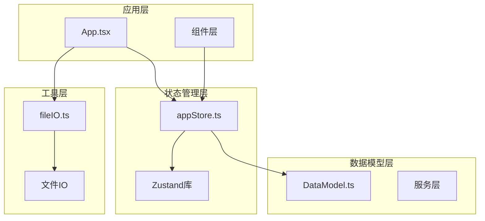
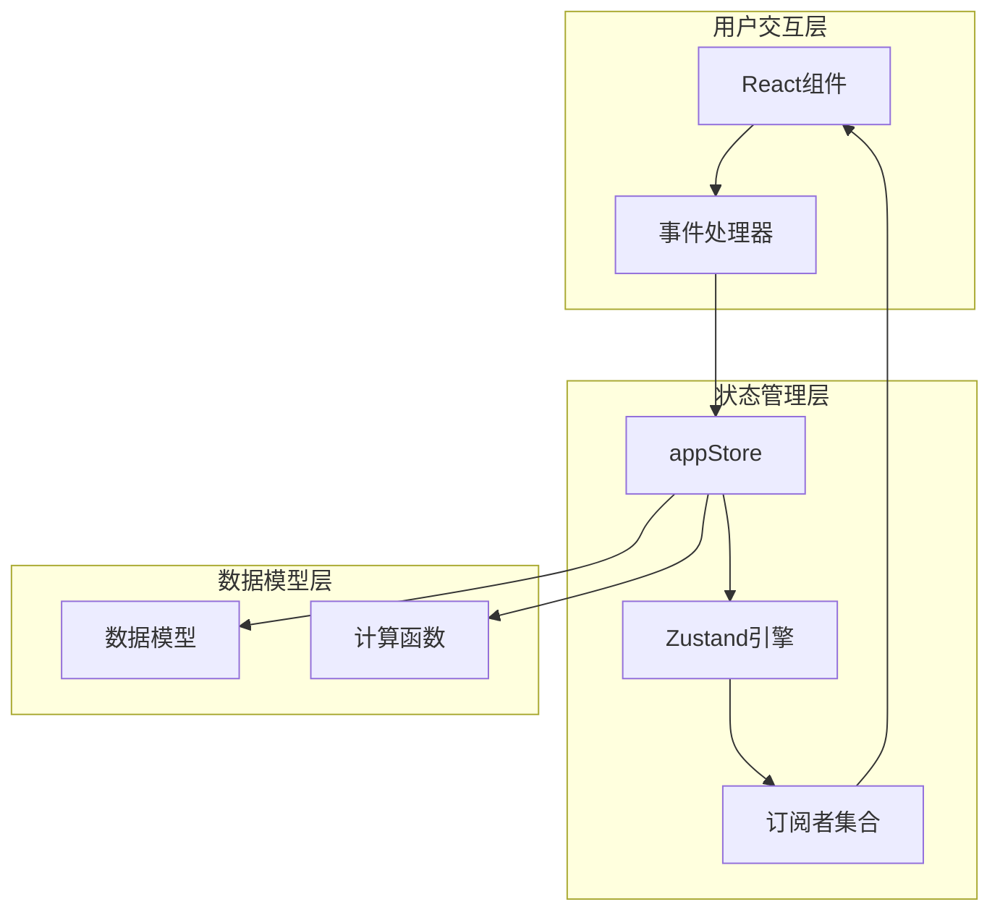
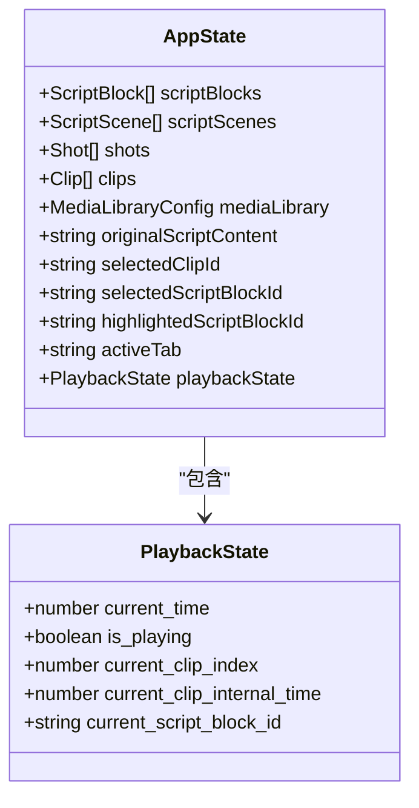
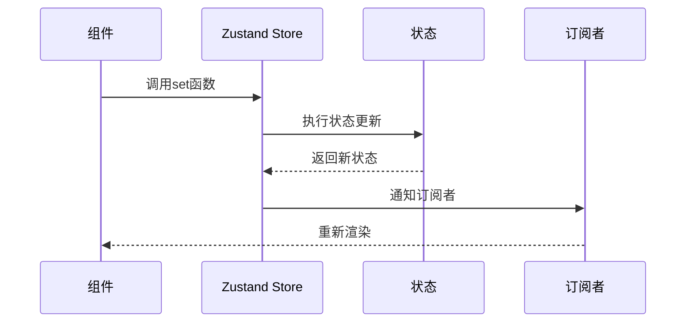
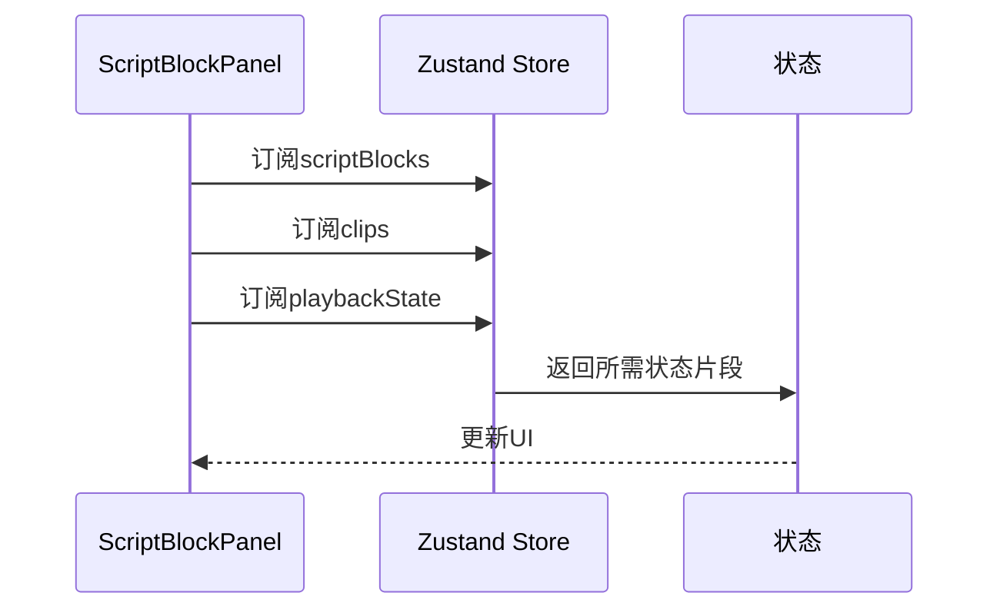
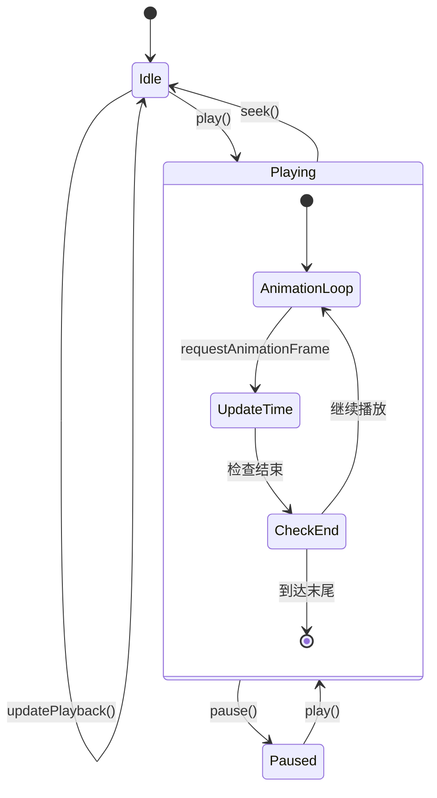
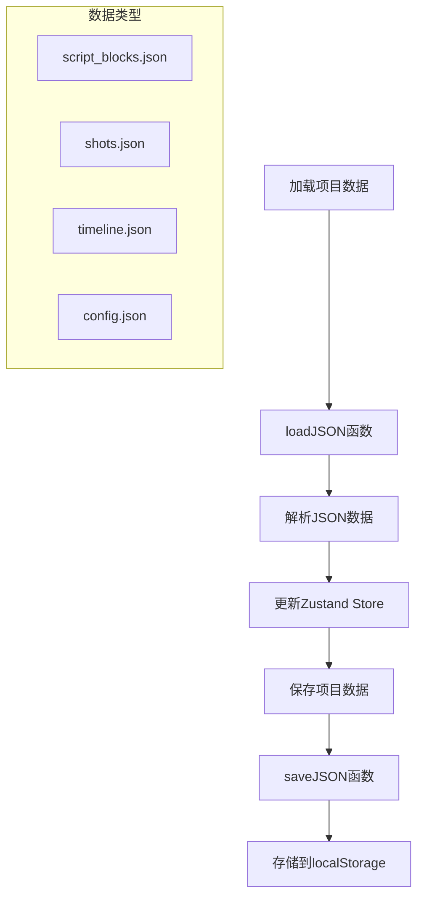
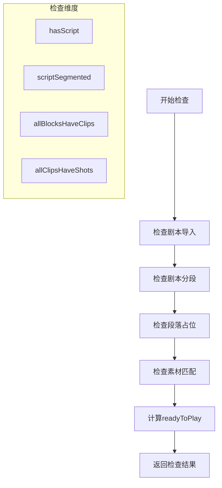
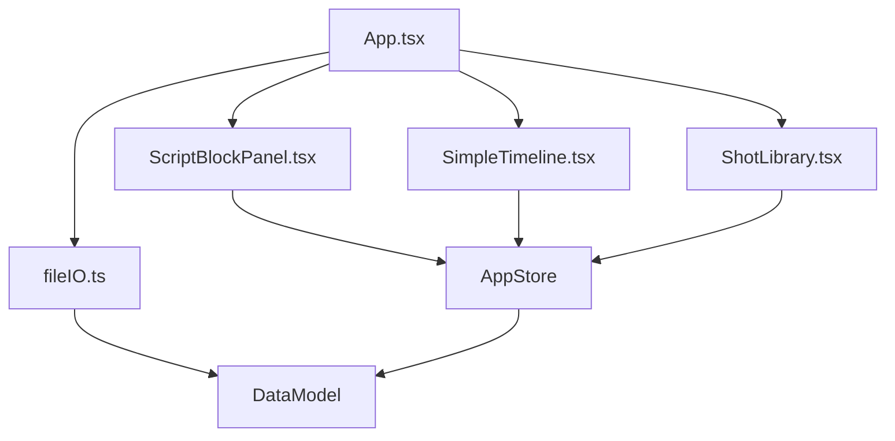

# 状态管理设计

<cite>
**本文档引用的文件**
- [appStore.ts](file://src/store/appStore.ts)
- [DataModel.ts](file://src/types/DataModel.ts)
- [ScriptBlockPanel.tsx](file://src/components/ScriptBlockPanel.tsx)
- [SimpleTimeline.tsx](file://src/components/SimpleTimeline.tsx)
- [fileIO.ts](file://src/utils/fileIO.ts)
- [App.tsx](file://src/App.tsx)
- [package.json](file://package.json)
- [README.md](file://README.md)
</cite>

## 目录
1. [简介](#简介)
2. [项目结构](#项目结构)
3. [核心组件](#核心组件)
4. [架构概览](#架构概览)
5. [详细组件分析](#详细组件分析)
6. [依赖关系分析](#依赖关系分析)
7. [性能考量](#性能考量)
8. [故障排除指南](#故障排除指南)
9. [结论](#结论)

## 简介

CGCUT是一个专业的导演分镜验证MVP工具，采用Zustand作为状态管理库。该系统专注于在分镜阶段快速验证剧本段落×镜头组合×实际节奏的有效性，帮助导演在30分钟内从剧本到可播放时间轴，快速发现节奏问题。

本设计文档深入分析了Zustand状态管理库的选择原因和优势，详细解释了AppState接口的设计理念，包括数据状态、UI状态和播放状态的分类管理。同时涵盖了状态更新的原子性设计、计算属性的实现方式、状态持久化策略以及最佳实践指南。

## 项目结构

CGCUT项目采用模块化架构，主要分为以下几个核心模块：



**图表来源**
- [App.tsx](file://src/App.tsx#L1-L50)
- [appStore.ts](file://src/store/appStore.ts#L1-L20)
- [DataModel.ts](file://src/types/DataModel.ts#L1-L30)

**章节来源**
- [README.md](file://README.md#L126-L150)
- [package.json](file://package.json#L1-L36)

## 核心组件

### Zustand状态管理库选择

CGCUT选择Zustand作为状态管理库基于以下关键优势：

1. **极简API设计**：相比Redux，Zustand提供了更简洁的API，减少了样板代码
2. **无需Provider包装**：可以直接在组件中导入store实例，避免了Provider的复杂性
3. **类型安全**：完全支持TypeScript，提供完整的类型推断
4. **高性能**：采用最小化订阅机制，只通知必要的组件
5. **开发体验**：内置调试工具，支持时间旅行调试

### AppState接口设计

AppState接口采用清晰的状态分类设计，将状态分为三个主要类别：

#### 数据状态（Data State）
- `scriptBlocks`: 剧本段落数组
- `scriptScenes`: 剧本场景数组  
- `shots`: 素材镜头数组
- `clips`: 时间轴镜头实例数组
- `mediaLibrary`: 素材库配置
- `originalScriptContent`: 原始剧本内容

#### UI状态（UI State）
- `selectedClipId`: 当前选中的Clip ID
- `selectedScriptBlockId`: 当前选中的ScriptBlock ID
- `highlightedScriptBlockId`: 当前高亮的ScriptBlock ID
- `activeTab`: 当前激活的标签页

#### 播放状态（Playback State）
- `playbackState`: 包含播放控制和时间信息的完整播放状态

**章节来源**
- [appStore.ts](file://src/store/appStore.ts#L4-L58)

## 架构概览

CGCUT采用单store架构模式，所有状态集中管理：



**图表来源**
- [appStore.ts](file://src/store/appStore.ts#L60-L194)
- [DataModel.ts](file://src/types/DataModel.ts#L195-L291)

## 详细组件分析

### Zustand Store实现分析

#### 状态初始化
Store使用工厂函数模式创建，提供清晰的初始状态定义：



**图表来源**
- [appStore.ts](file://src/store/appStore.ts#L4-L21)
- [DataModel.ts](file://src/types/DataModel.ts#L184-L193)

#### 状态更新原子性设计

Zustand通过`set`函数确保状态更新的原子性：



**图表来源**
- [appStore.ts](file://src/store/appStore.ts#L82-L107)

#### 计算属性实现

计算属性通过`get()`函数实现，提供只读的派生状态：

```mermaid
flowchart TD
GetCall[get()调用] --> LoadState[加载当前状态]
LoadState --> ProcessData[处理数据]
ProcessData --> ReturnResult[返回计算结果]
subgraph "计算函数类型"
Duration[getScriptBlockActualDuration]
ShotLookup[getShotById]
ClipLookup[getClipById]
StatusCheck[checkProjectStatus]
end
```

**图表来源**
- [appStore.ts](file://src/store/appStore.ts#L131-L178)
- [DataModel.ts](file://src/types/DataModel.ts#L195-L237)

**章节来源**
- [appStore.ts](file://src/store/appStore.ts#L60-L194)

### 组件集成模式

#### ScriptBlockPanel组件集成
ScriptBlockPanel通过选择性订阅优化性能：



**图表来源**
- [ScriptBlockPanel.tsx](file://src/components/ScriptBlockPanel.tsx#L9-L18)

#### SimpleTimeline组件集成
SimpleTimeline实现复杂的播放控制逻辑：



**图表来源**
- [SimpleTimeline.tsx](file://src/components/SimpleTimeline.tsx#L67-L92)

**章节来源**
- [ScriptBlockPanel.tsx](file://src/components/ScriptBlockPanel.tsx#L9-L285)
- [SimpleTimeline.tsx](file://src/components/SimpleTimeline.tsx#L1-L414)

### 状态持久化策略

#### localStorage集成
项目采用localStorage进行状态持久化，实现数据的跨会话保存：



**图表来源**
- [fileIO.ts](file://src/utils/fileIO.ts#L54-L80)

#### 持久化实现细节

状态持久化通过以下机制实现：

1. **异步加载机制**：使用Promise.all并行加载多个数据源
2. **回退机制**：当localStorage中没有数据时，自动回退到默认JSON文件
3. **错误处理**：完善的try-catch机制处理加载和保存异常
4. **类型安全**：完整的TypeScript类型定义确保数据完整性

**章节来源**
- [fileIO.ts](file://src/utils/fileIO.ts#L1-L95)

### 计算属性深度分析

#### getScriptBlockActualDuration实现
该函数计算指定ScriptBlock的实际总时长：

```mermaid
flowchart TD
Input[接收blockId] --> LoadState[获取当前状态]
LoadState --> FilterClips[过滤匹配的Clips]
FilterClips --> SumDurations[累加duration字段]
SumDurations --> ReturnResult[返回总时长]
subgraph "算法复杂度"
O[n] where n = number of clips
end
```

**图表来源**
- [appStore.ts](file://src/store/appStore.ts#L132-L135)
- [DataModel.ts](file://src/types/DataModel.ts#L195-L205)

#### checkProjectStatus实现
项目状态检查提供完整的项目健康度评估：



**图表来源**
- [appStore.ts](file://src/store/appStore.ts#L147-L178)

**章节来源**
- [appStore.ts](file://src/store/appStore.ts#L131-L178)
- [DataModel.ts](file://src/types/DataModel.ts#L171-L182)

## 依赖关系分析

### 核心依赖关系

```mermaid
graph LR
subgraph "外部依赖"
Zustand[zustand ^4.5.0]
React[react ^18.3.1]
DnDKit[@dnd-kit/*]
end
subgraph "内部模块"
AppStore[src/store/appStore.ts]
DataModel[src/types/DataModel.ts]
Components[src/components/*]
Utils[src/utils/*]
end
AppStore --> Zustand
Components --> AppStore
Components --> DataModel
Utils --> DataModel
AppStore --> DataModel
```

**图表来源**
- [package.json](file://package.json#L14-L21)
- [appStore.ts](file://src/store/appStore.ts#L1-L2)

### 组件间依赖



**图表来源**
- [App.tsx](file://src/App.tsx#L1-L11)
- [ScriptBlockPanel.tsx](file://src/components/ScriptBlockPanel.tsx#L1-L4)

**章节来源**
- [package.json](file://package.json#L14-L21)

## 性能考量

### 订阅优化策略

1. **选择性订阅**：组件只订阅需要的状态片段，减少不必要的重渲染
2. **状态分割**：将大对象分割为独立的状态字段，提高更新精度
3. **计算缓存**：计算属性通过get()函数实现，避免重复计算

### 内存管理

1. **状态清理**：组件卸载时自动清理订阅
2. **引用优化**：避免创建新的对象引用，除非必要
3. **批量更新**：使用部分更新模式减少状态变更次数

### 并发处理

1. **异步操作**：文件IO操作使用async/await模式
2. **并发加载**：使用Promise.all并行加载多个数据源
3. **错误隔离**：每个操作都有独立的错误处理机制

## 故障排除指南

### 常见问题诊断

#### 状态不更新问题
- 检查set函数调用是否正确
- 确认组件是否正确订阅了相关状态
- 验证状态更新是否在正确的上下文中执行

#### 性能问题
- 使用React DevTools Profiler分析组件重渲染
- 检查是否存在不必要的状态订阅
- 优化计算属性的执行频率

#### 数据持久化问题
- 检查localStorage权限和容量限制
- 验证JSON数据格式的正确性
- 确认文件IO操作的异步处理

**章节来源**
- [fileIO.ts](file://src/utils/fileIO.ts#L1-L95)

## 结论

CGCUT的状态管理系统展现了现代前端应用的最佳实践：

1. **架构简洁性**：Zustand的极简API设计使得状态管理变得直观易懂
2. **性能优化**：通过选择性订阅和原子性更新实现了高效的性能表现
3. **类型安全**：完整的TypeScript支持确保了开发时的类型安全保障
4. **可维护性**：清晰的状态分类和计算属性设计提高了代码的可维护性
5. **用户体验**：localStorage持久化和实时状态更新提供了流畅的用户体验

该设计为导演分镜验证工具提供了坚实的技术基础，能够有效支持快速迭代和实时验证的核心需求。通过合理的状态管理策略，CGCUT能够在保持简单性的同时，提供强大的功能支持。