# 剧本段落面板

<cite>
**本文档引用的文件**
- [ScriptBlockPanel.tsx](file://src/components/ScriptBlockPanel.tsx)
- [llmService.ts](file://src/services/llmService.ts)
- [DataModel.ts](file://src/types/DataModel.ts)
- [fileIO.ts](file://src/utils/fileIO.ts)
- [appStore.ts](file://src/store/appStore.ts)
- [App.tsx](file://src/App.tsx)
- [script_blocks.json](file://public/data/script_blocks.json)
- [shots.json](file://public/data/shots.json)
- [cinematography-basics.md](file://knowledge/cinematography-basics.md)
- [test-script.txt](file://test-script.txt)
- [USAGE_GUIDE.md](file://USAGE_GUIDE.md)
</cite>

## 目录
1. [简介](#简介)
2. [项目结构](#项目结构)
3. [核心组件](#核心组件)
4. [架构概览](#架构概览)
5. [详细组件分析](#详细组件分析)
6. [依赖关系分析](#依赖关系分析)
7. [性能考量](#性能考量)
8. [故障排除指南](#故障排除指南)
9. [结论](#结论)
10. [附录](#附录)

## 简介
剧本段落面板是 CGCUT 导演分镜验证 MVP 工具的核心组件之一，负责展示和管理由 LLM 智能拆解生成的剧本段落。该面板提供了完整的剧本段落可视化、时长验证、AI 智能拆解、场景分组、占位片段创建等功能，是连接剧本内容与时间轴制作流程的关键枢纽。

## 项目结构
CGCUT 采用模块化的 React + TypeScript 架构，主要目录结构如下：
- `src/components/`: UI 组件层，包含 ScriptBlockPanel、SimpleTimeline、ShotLibrary 等
- `src/services/`: 服务层，包含 llmService、clipService 等业务服务
- `src/store/`: 状态管理层，使用 Zustand 管理全局状态
- `src/types/`: 类型定义层，定义所有数据模型和接口
- `src/utils/`: 工具函数层，包含文件 IO、辅助函数等
- `public/data/`: 预置数据文件，包含示例剧本和素材数据
- `knowledge/`: 专业知识库，为 LLM 提供分镜拆解指导

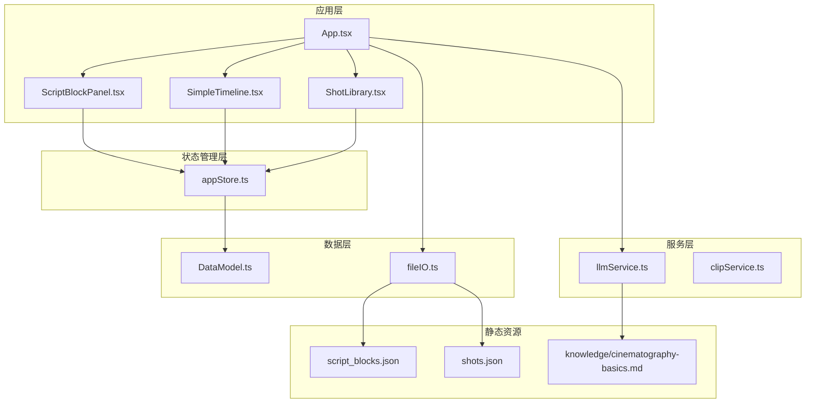

**图表来源**
- [App.tsx](file://src/App.tsx#L1-L497)
- [ScriptBlockPanel.tsx](file://src/components/ScriptBlockPanel.tsx#L1-L285)
- [llmService.ts](file://src/services/llmService.ts#L1-L476)

**章节来源**
- [App.tsx](file://src/App.tsx#L1-L497)
- [package.json](file://package.json#L1-L36)

## 核心组件
剧本段落面板包含以下核心功能模块：

### 1. 剧本导入与解析
- 支持 .txt 和 .json 格式的剧本文件导入
- 集成 LLM 服务进行智能剧本拆解
- 实时进度反馈和错误处理

### 2. 段落展示与管理
- 结构化场景分组显示
- 情绪标签可视化
- 时长对比展示
- 占位片段创建功能

### 3. 时长验证机制
- 期望时长 vs 实际时长对比
- 时长偏差状态指示
- 自动滚动到当前播放段落

### 4. 用户交互功能
- 场景折叠/展开
- 段落高亮显示
- 占位片段一键创建
- Tab 切换（原文/拆解）

**章节来源**
- [ScriptBlockPanel.tsx](file://src/components/ScriptBlockPanel.tsx#L1-L285)
- [llmService.ts](file://src/services/llmService.ts#L1-L476)

## 架构概览
剧本段落面板采用 React 函数组件 + Zustand 状态管理的架构模式，实现了清晰的数据流向和组件职责分离。

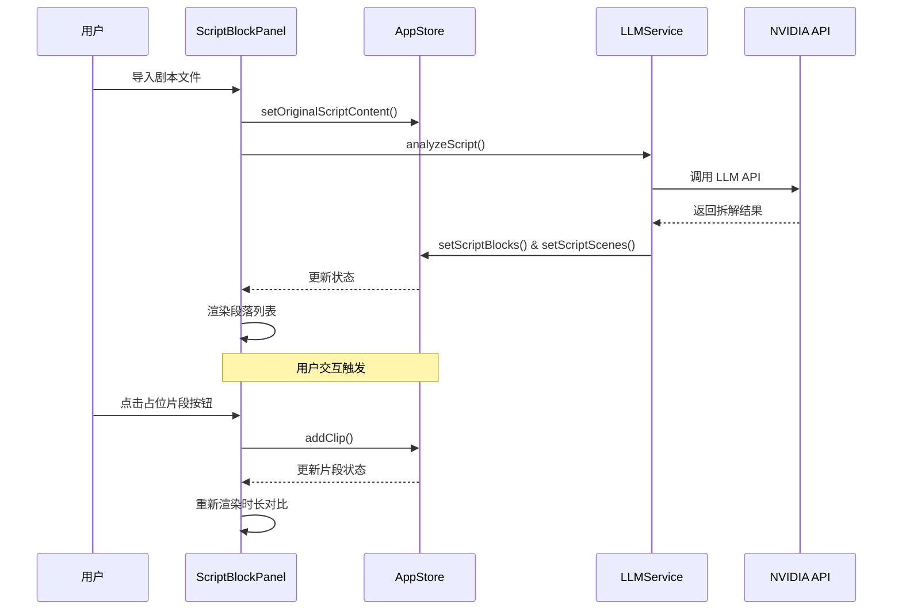

**图表来源**
- [ScriptBlockPanel.tsx](file://src/components/ScriptBlockPanel.tsx#L72-L106)
- [llmService.ts](file://src/services/llmService.ts#L72-L101)
- [appStore.ts](file://src/store/appStore.ts#L92-L107)

## 详细组件分析

### ScriptBlockPanel 组件分析

ScriptBlockPanel 是剧本段落面板的核心组件，实现了完整的段落管理和展示功能。

#### 组件架构设计
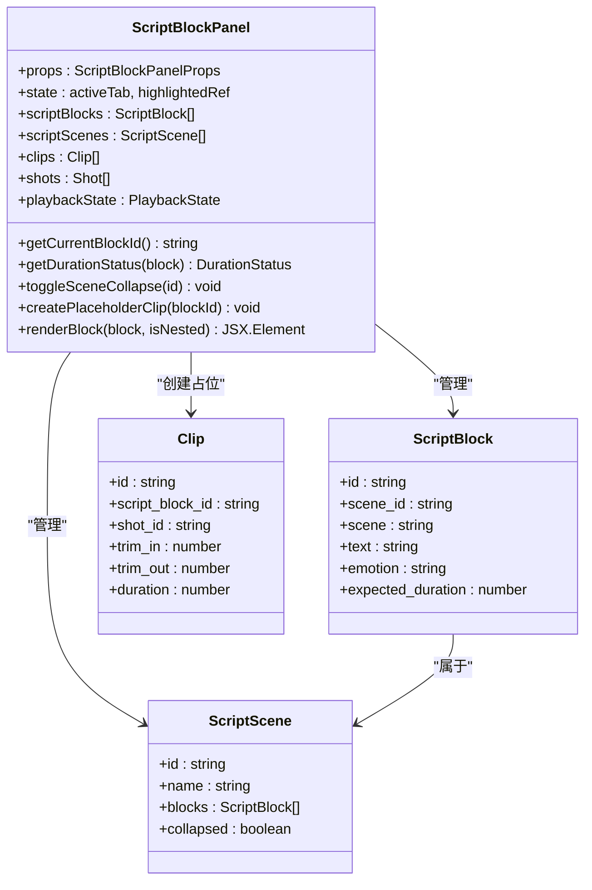

**图表来源**
- [ScriptBlockPanel.tsx](file://src/components/ScriptBlockPanel.tsx#L1-L285)
- [DataModel.ts](file://src/types/DataModel.ts#L101-L148)

#### 时长验证算法实现
时长验证功能通过比较期望时长和实际时长来提供直观的状态反馈：

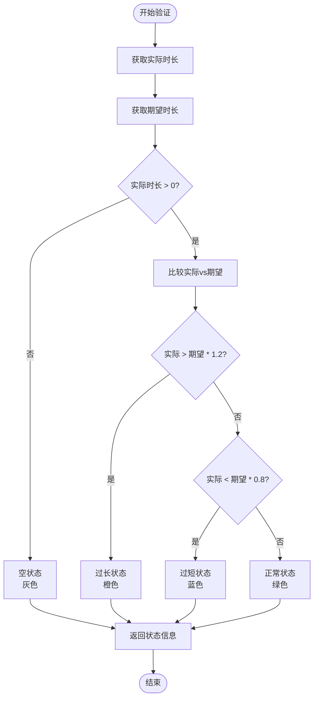

**图表来源**
- [ScriptBlockPanel.tsx](file://src/components/ScriptBlockPanel.tsx#L53-L61)

#### 占位片段创建机制
当用户点击"占位"按钮时，系统会自动为段落创建对应的占位片段：

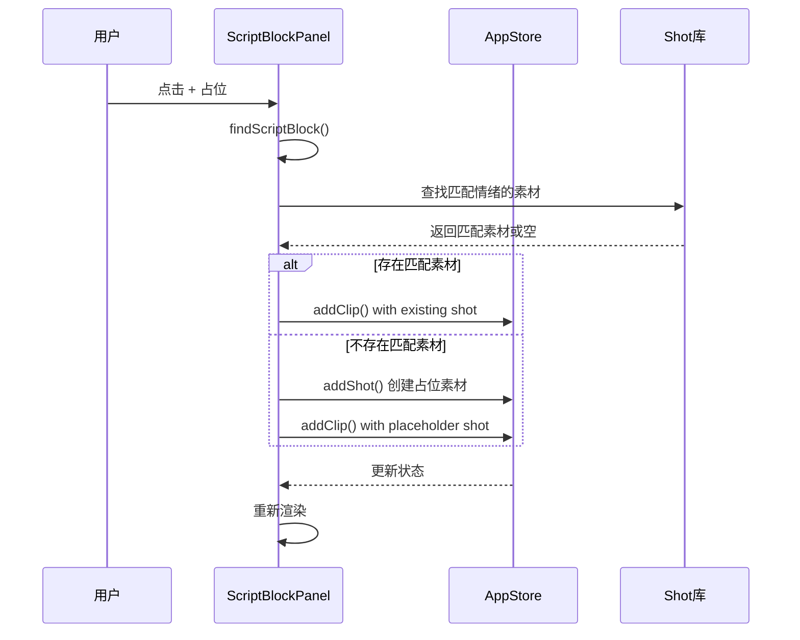

**图表来源**
- [ScriptBlockPanel.tsx](file://src/components/ScriptBlockPanel.tsx#L72-L106)

**章节来源**
- [ScriptBlockPanel.tsx](file://src/components/ScriptBlockPanel.tsx#L1-L285)

### LLM 剧本分析服务分析

LLMService 负责调用 NVIDIA API 进行剧本智能拆解，集成了完整的专业知识库和拆解规则。

#### LLM 配置与初始化
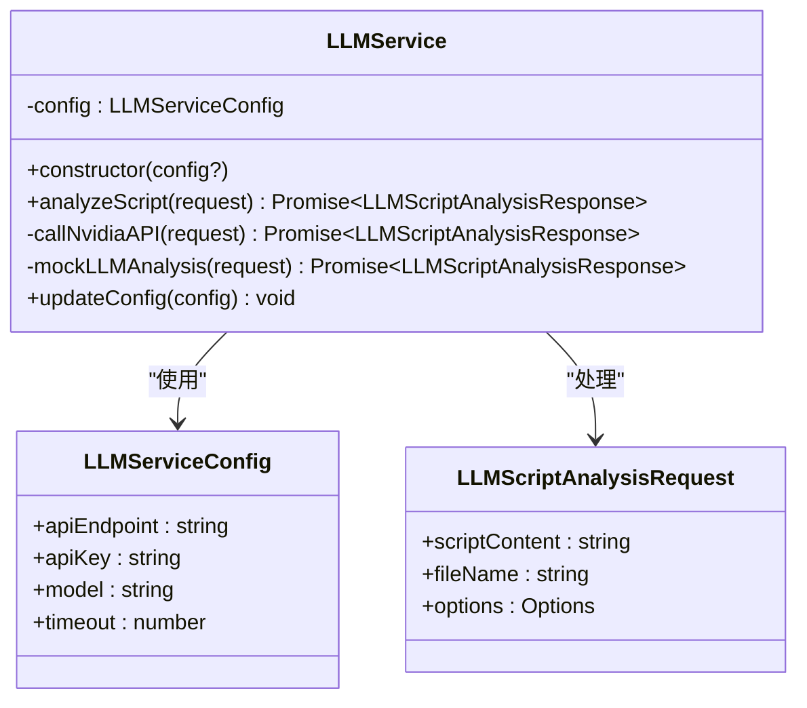

**图表来源**
- [llmService.ts](file://src/services/llmService.ts#L42-L57)
- [llmService.ts](file://src/services/llmService.ts#L59-L101)

#### 智能拆解算法
LLM 拆解过程遵循严格的分镜标准和专业知识库：

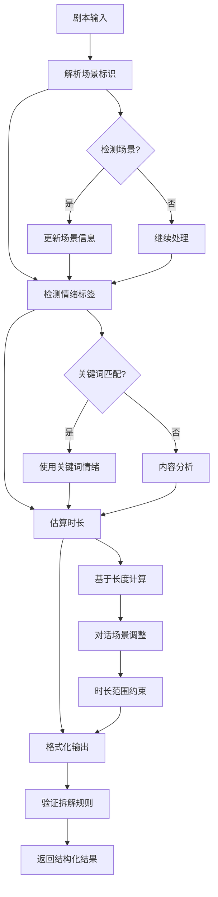

**图表来源**
- [llmService.ts](file://src/services/llmService.ts#L337-L423)
- [cinematography-basics.md](file://knowledge/cinematography-basics.md#L159-L177)

#### 专业知识库集成
LLMService 内置了完整的影视分镜专业知识库，确保拆解结果的专业性和一致性：

**章节来源**
- [llmService.ts](file://src/services/llmService.ts#L1-L476)
- [cinematography-basics.md](file://knowledge/cinematography-basics.md#L1-L366)

### 数据模型与状态管理

应用使用 Zustand 进行状态管理，实现了跨组件的状态共享和响应式更新。

#### 核心数据模型
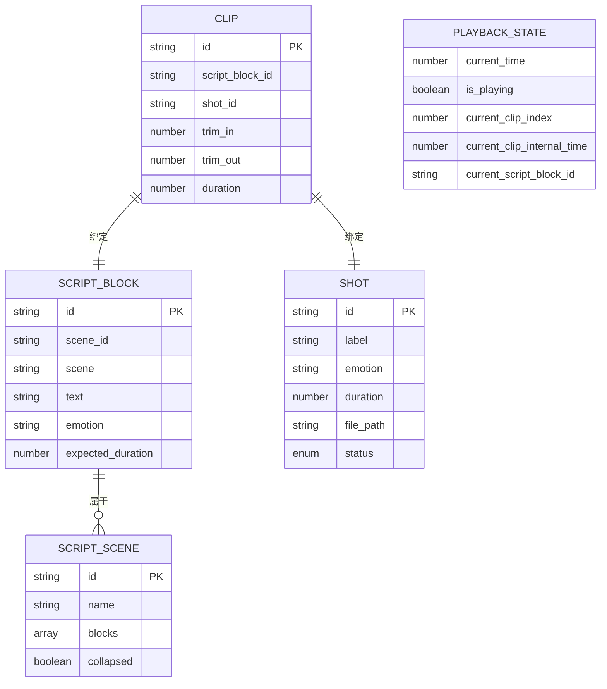

**图表来源**
- [DataModel.ts](file://src/types/DataModel.ts#L101-L148)
- [DataModel.ts](file://src/types/DataModel.ts#L187-L193)

#### 状态管理流程
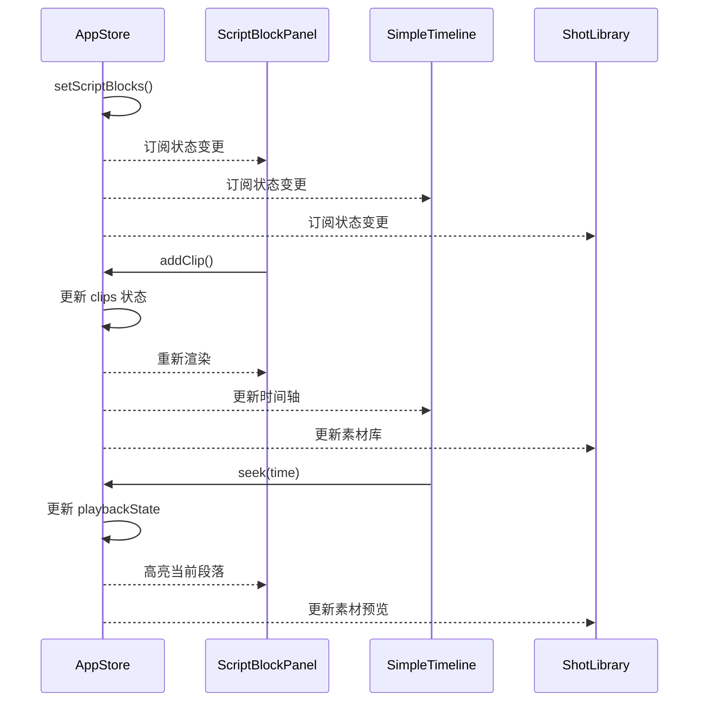

**图表来源**
- [appStore.ts](file://src/store/appStore.ts#L60-L194)
- [ScriptBlockPanel.tsx](file://src/components/ScriptBlockPanel.tsx#L38-L49)

**章节来源**
- [DataModel.ts](file://src/types/DataModel.ts#L1-L291)
- [appStore.ts](file://src/store/appStore.ts#L1-L195)

## 依赖关系分析

### 组件依赖关系
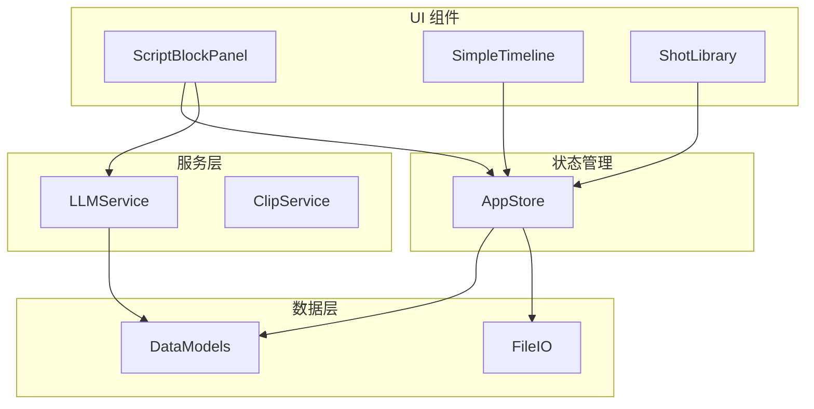

**图表来源**
- [ScriptBlockPanel.tsx](file://src/components/ScriptBlockPanel.tsx#L1-L285)
- [App.tsx](file://src/App.tsx#L1-L497)

### 外部依赖分析
- **React 18.3.1**: 核心 UI 框架
- **Zustand 4.5.0**: 轻量级状态管理
- **@dnd-kit**: 拖拽排序功能
- **TailwindCSS**: 样式框架
- **NVIDIA API**: LLM 服务集成

**章节来源**
- [package.json](file://package.json#L14-L34)

## 性能考量

### 1. 渲染优化
- 使用 React.memo 优化组件重渲染
- 条件渲染减少不必要的 DOM 更新
- 虚拟滚动支持大量段落的高效显示

### 2. 状态管理优化
- 局部状态更新避免全量重渲染
- 计算属性缓存减少重复计算
- 事件委托减少事件监听器数量

### 3. LLM 调用优化
- 超时控制防止长时间阻塞
- 错误回退机制保证用户体验
- 进度反馈提升用户感知

## 故障排除指南

### 常见问题及解决方案

#### 1. 剧本导入失败
**问题**: 导入 .txt/.json 文件时报错
**解决方案**:
- 检查文件格式是否正确
- 确认文件编码为 UTF-8
- 验证文件内容符合格式要求

#### 2. LLM 分析超时
**问题**: AI 分析长时间无响应
**解决方案**:
- 检查网络连接状态
- 验证 API 密钥有效性
- 调整超时设置或重试

#### 3. 占位片段创建失败
**问题**: 点击"占位"按钮无反应
**解决方案**:
- 确认段落已正确拆解
- 检查素材库中是否存在匹配素材
- 验证状态管理正常工作

#### 4. 时长显示异常
**问题**: 期望时长与实际时长显示不一致
**解决方案**:
- 检查片段是否正确绑定
- 验证时长计算逻辑
- 确认播放状态同步

**章节来源**
- [ScriptBlockPanel.tsx](file://src/components/ScriptBlockPanel.tsx#L25-L29)
- [llmService.ts](file://src/services/llmService.ts#L94-L100)

## 结论
剧本段落面板作为 CGCUT 的核心组件，成功实现了以下目标：

1. **智能化剧本处理**: 通过 LLM 服务实现专业的剧本分镜拆解
2. **直观的可视化展示**: 提供结构化的场景分组和段落管理
3. **精确的时长控制**: 实时对比期望时长与实际时长
4. **便捷的用户交互**: 支持占位片段创建和场景折叠功能
5. **完整的数据流**: 从导入到展示的完整工作流程

该组件展现了现代前端开发的最佳实践，包括模块化架构、状态管理、组件设计和用户体验优化。通过持续的迭代和优化，剧本段落面板将成为导演分镜制作流程中不可或缺的重要工具。

## 附录

### 使用示例

#### 1. 基本使用流程
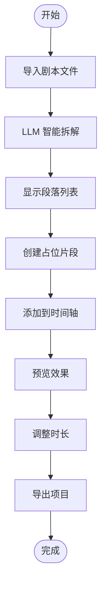

#### 2. 专业术语对照
- **景别**: 特写(ECU)、近景(CU)、中景(MS)、全景(WS)、远景(LS)
- **情绪标签**: 紧张、焦虑、恐惧、释然、平静、愤怒、悲伤、喜悦
- **时长估算**: 基于景别和内容类型的智能计算

#### 3. 最佳实践建议
- 使用标准的场景标识格式 (INT./EXT.)
- 在剧本中明确标注情绪标签
- 合理控制段落长度和节奏
- 定期保存项目进度
- 利用占位片段提高制作效率

**章节来源**
- [USAGE_GUIDE.md](file://USAGE_GUIDE.md#L64-L86)
- [test-script.txt](file://test-script.txt#L1-L14)