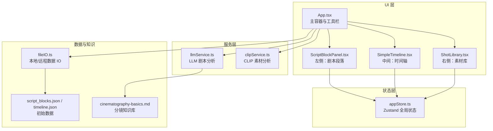
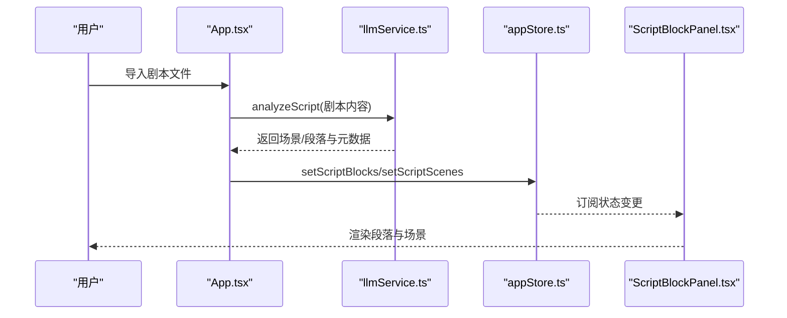
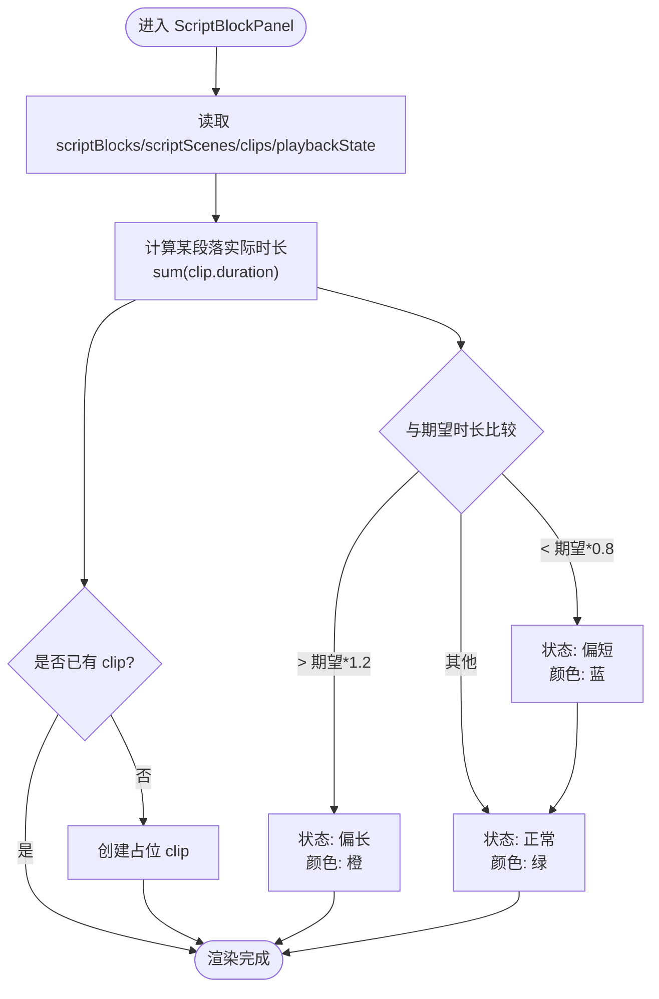
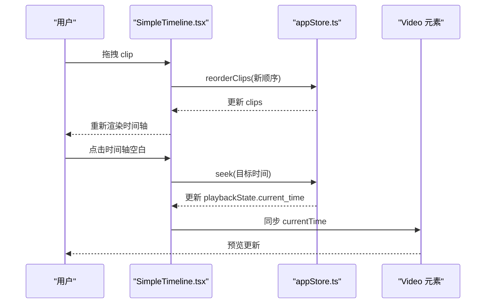
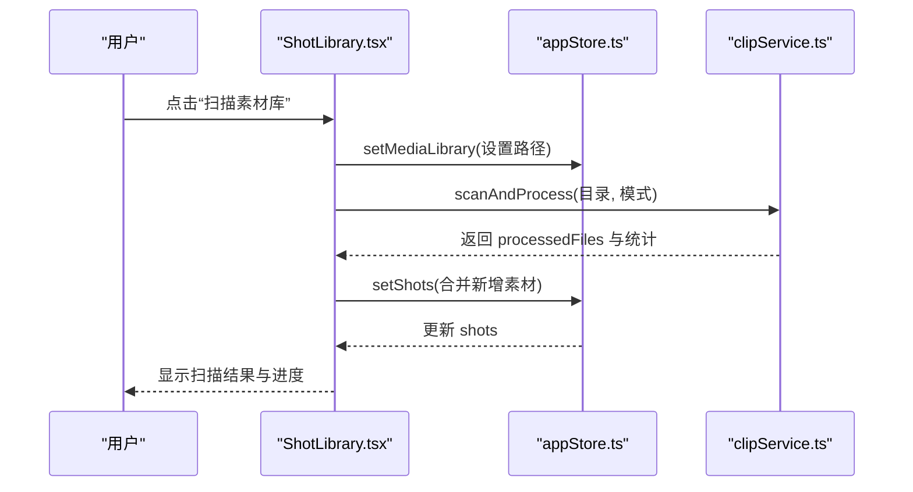
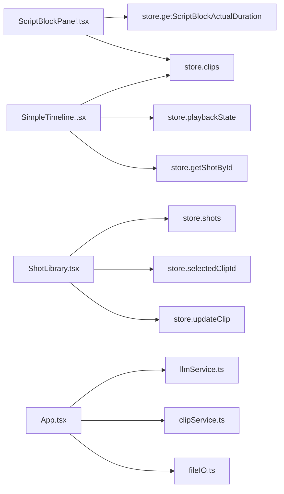
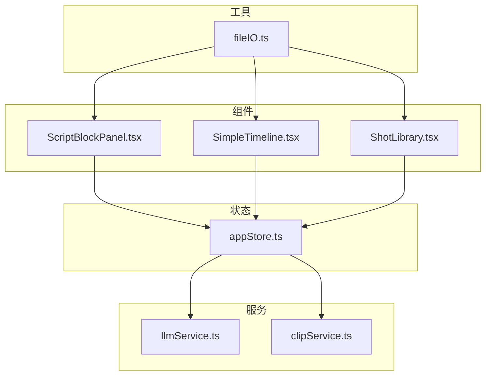

# 核心功能

<cite>
**本文引用的文件**
- [App.tsx](file://src/App.tsx)
- [ScriptBlockPanel.tsx](file://src/components/ScriptBlockPanel.tsx)
- [SimpleTimeline.tsx](file://src/components/SimpleTimeline.tsx)
- [ShotLibrary.tsx](file://src/components/ShotLibrary.tsx)
- [appStore.ts](file://src/store/appStore.ts)
- [DataModel.ts](file://src/types/DataModel.ts)
- [llmService.ts](file://src/services/llmService.ts)
- [clipService.ts](file://src/services/clipService.ts)
- [fileIO.ts](file://src/utils/fileIO.ts)
- [script_blocks.json](file://public/data/script_blocks.json)
- [timeline.json](file://public/data/timeline.json)
- [cinematography-basics.md](file://knowledge/cinematography-basics.md)
</cite>

## 目录
1. [简介](#简介)
2. [项目结构](#项目结构)
3. [核心组件](#核心组件)
4. [架构总览](#架构总览)
5. [详细组件分析](#详细组件分析)
6. [依赖关系分析](#依赖关系分析)
7. [性能考量](#性能考量)
8. [故障排查指南](#故障排查指南)
9. [结论](#结论)
10. [附录](#附录)

## 简介
本文件针对 CGCUT 的核心功能模块进行系统化文档化，重点覆盖三块主面板：
- 剧本段落面板（左侧）：负责展示 LLM 拆解后的剧本段落、场景分组、时长验证与占位创建。
- 简单时间轴（中间）：负责时间轴可视化、播放预览、拖拽排序、占位符与裁剪（预留）。
- 素材库（右侧）：负责素材筛选、状态管理、替换流程与路径配置。

文档将深入解释各面板的功能实现、用户交互方式、数据流转与协作关系，并提供使用示例与最佳实践。

## 项目结构
项目采用前端单页应用架构，使用 Zustand 管理全局状态，组件通过 hooks 访问 store，服务层封装 LLM 与 CLIP 的处理逻辑，工具层负责本地/远程数据 IO。

图表来源
- [App.tsx](file://src/App.tsx#L1-L497)
- [ScriptBlockPanel.tsx](file://src/components/ScriptBlockPanel.tsx#L1-L285)
- [SimpleTimeline.tsx](file://src/components/SimpleTimeline.tsx#L1-L414)
- [ShotLibrary.tsx](file://src/components/ShotLibrary.tsx#L1-L359)
- [appStore.ts](file://src/store/appStore.ts#L1-L195)
- [llmService.ts](file://src/services/llmService.ts#L1-L476)
- [clipService.ts](file://src/services/clipService.ts#L1-L394)
- [fileIO.ts](file://src/utils/fileIO.ts#L1-L95)
- [script_blocks.json](file://public/data/script_blocks.json#L1-L38)
- [timeline.json](file://public/data/timeline.json#L1-L59)
- [cinematography-basics.md](file://knowledge/cinematography-basics.md#L1-L366)

章节来源
- [App.tsx](file://src/App.tsx#L1-L497)
- [package.json](file://package.json#L1-L36)

## 核心组件
- 剧本段落面板（左侧）
  - 展示场景分组与段落列表，支持原文/解析双 Tab。
  - 根据时间轴播放状态高亮当前段落。
  - 时长验证：比较“期望时长”与“实际时长”，给出颜色提示与差异值。
  - 占位创建：为无 clip 的段落一键创建占位 clip，并尝试匹配情绪相近素材。
- 简单时间轴（中间）
  - 时间轴可视化与播放预览，支持播放/暂停/跳转。
  - 拖拽排序：使用 dnd-kit 实现 clip 重排。
  - 占位符标识：当素材未就绪时显示占位符样式与提示。
  - 裁剪功能：预留裁剪手柄与逻辑（当前实现为占位，后续可接入）。
- 素材库（右侧）
  - 情绪筛选与状态筛选，支持批量标记与编辑。
  - 替换流程：选中时间轴 clip 后点击素材即可替换绑定 shot。
  - 路径配置：设置媒体库根路径，触发扫描与 CLIP 处理。
  - 素材管理弹窗：集成资产管理工作流。

章节来源
- [ScriptBlockPanel.tsx](file://src/components/ScriptBlockPanel.tsx#L1-L285)
- [SimpleTimeline.tsx](file://src/components/SimpleTimeline.tsx#L1-L414)
- [ShotLibrary.tsx](file://src/components/ShotLibrary.tsx#L1-L359)
- [appStore.ts](file://src/store/appStore.ts#L1-L195)

## 架构总览
CGCUT 的数据流遵循“服务层 -> Store -> UI”的单向数据流：
- 服务层负责外部能力（LLM/CLIP），产出结构化数据。
- Store 统一管理 scriptBlocks、scriptScenes、shots、clips、播放状态等。
- UI 组件通过 hooks 访问 Store，触发动作并驱动渲染。

图表来源
- [App.tsx](file://src/App.tsx#L70-L169)
- [llmService.ts](file://src/services/llmService.ts#L72-L101)
- [appStore.ts](file://src/store/appStore.ts#L82-L89)
- [ScriptBlockPanel.tsx](file://src/components/ScriptBlockPanel.tsx#L9-L29)

## 详细组件分析

### 剧本段落面板（左侧）
- 功能要点
  - 场景折叠/展开：点击场景标题切换 collapsed 状态，持久化到 store。
  - Tab 切换：原文与 LLM 拆解结果互斥显示。
  - 时长验证：通过计算某段落对应的所有 clip 的 duration 总和，与期望时长比较，给出“偏短/偏长/正常/空”的状态与颜色。
  - 占位创建：若段落尚未绑定 clip，则提供“+ 占位”按钮；优先匹配情绪一致的素材，否则创建“占位符”素材并绑定。
  - 播放高亮：根据当前播放时间定位当前段落，自动滚动到高亮元素。
- 用户交互
  - 点击段落：选中/高亮该段落。
  - 点击“+ 占位”：为该段落创建占位 clip。
- 数据流
  - 读取 scriptBlocks/scriptScenes/clips/playbackState。
  - 计算 getScriptBlockActualDuration(blockId)。
  - 调用 addClip/createPlaceholderClip/updateClip。
- 时长验证机制
  - 期望时长来自 ScriptBlock.expected_duration。
  - 实际时长来自 store.clips 中与该段落关联的 clip 的 duration 之和。
  - 阈值：±20% 作为“偏短/偏长”的判断边界。

图表来源
- [ScriptBlockPanel.tsx](file://src/components/ScriptBlockPanel.tsx#L53-L106)
- [DataModel.ts](file://src/types/DataModel.ts#L198-L205)

章节来源
- [ScriptBlockPanel.tsx](file://src/components/ScriptBlockPanel.tsx#L1-L285)
- [DataModel.ts](file://src/types/DataModel.ts#L198-L205)

### 简单时间轴（中间）
- 功能要点
  - 播放预览：根据 clips 与当前播放时间，定位当前 clip 与内部时间，驱动 video 元素播放与同步。
  - 播放控制：播放/暂停/停止/进度条点击跳转。
  - 拖拽排序：使用 dnd-kit 的 SortableContext + useSortable 实现水平拖拽重排。
  - 占位符：当 shot 不存在或 file_path 为空时，显示占位符样式与提示。
  - 裁剪预留：提供左右裁剪手柄事件入口，当前为占位，后续可接入 updateClipTrim。
- 用户交互
  - 点击时间轴空白处：跳转到点击位置。
  - 点击 clip：选中该 clip。
  - 拖拽 clip：改变顺序。
  - 点击删除按钮：删除该 clip。
- 数据流
  - 读取 clips、selectedClipId、playbackState。
  - 调用 reorderClips/selectClip/deleteClip/seek。
  - 通过 getShotById 获取素材详情，用于预览与占位提示。

图表来源
- [SimpleTimeline.tsx](file://src/components/SimpleTimeline.tsx#L343-L367)
- [SimpleTimeline.tsx](file://src/components/SimpleTimeline.tsx#L68-L109)
- [appStore.ts](file://src/store/appStore.ts#L107-L129)

章节来源
- [SimpleTimeline.tsx](file://src/components/SimpleTimeline.tsx#L1-L414)
- [appStore.ts](file://src/store/appStore.ts#L1-L195)

### 素材库（右侧）
- 功能要点
  - 情绪筛选与状态筛选：支持按情绪与处理状态过滤素材。
  - 替换流程：选中时间轴中的 clip 后，点击素材即调用 replaceClipShot 更新绑定 shot，并重置 trim_in/out 与 duration。
  - 路径配置：设置 mediaLibrary.base_path，触发扫描与 CLIP 处理。
  - 素材管理：支持标记为已处理、编辑标签、修改情绪、删除素材。
- 用户交互
  - 点击素材：若选中 clip，则替换绑定。
  - 点击“素材管理”：打开弹窗进行资产管理。
  - 点击“添加路径”：弹出路径配置框。
- 数据流
  - 读取 shots/mediaLibrary/selectedClipId。
  - 调用 updateClip/replaceClipShot/updateShotStatus/deleteShot。
  - 通过 clipService.scanAndProcess 扫描并更新 shots。

图表来源
- [ShotLibrary.tsx](file://src/components/ShotLibrary.tsx#L55-L103)
- [clipService.ts](file://src/services/clipService.ts#L36-L60)
- [App.tsx](file://src/App.tsx#L171-L252)

章节来源
- [ShotLibrary.tsx](file://src/components/ShotLibrary.tsx#L1-L359)
- [clipService.ts](file://src/services/clipService.ts#L1-L394)
- [App.tsx](file://src/App.tsx#L171-L252)

### 项目状态检查与协作关系
- 项目状态检查
  - 检查是否有剧本、是否已分段、每个段落是否都有 clip、每个 clip 是否都有对应素材。
  - 输出 readyToPlay 与缺失清单，供一键检查模态框展示。
- 协作关系
  - ScriptBlockPanel 依赖 store.getScriptBlockActualDuration 与 store.clips。
  - SimpleTimeline 依赖 store.clips、store.playbackState、store.getShotById。
  - ShotLibrary 依赖 store.shots、store.selectedClipId、store.updateClip。
  - App.tsx 作为协调者，负责导入剧本、扫描素材库、保存导出、项目检查。

图表来源
- [ScriptBlockPanel.tsx](file://src/components/ScriptBlockPanel.tsx#L132-L135)
- [SimpleTimeline.tsx](file://src/components/SimpleTimeline.tsx#L332-L340)
- [ShotLibrary.tsx](file://src/components/ShotLibrary.tsx#L18-L21)
- [appStore.ts](file://src/store/appStore.ts#L148-L178)
- [App.tsx](file://src/App.tsx#L39-L59)

章节来源
- [appStore.ts](file://src/store/appStore.ts#L148-L178)
- [App.tsx](file://src/App.tsx#L275-L280)

## 依赖关系分析
- 组件耦合
  - 三个面板均依赖 appStore，形成高内聚、低耦合的状态共享。
  - SimpleTimeline 依赖 dnd-kit 进行拖拽排序，耦合到 UI 交互层。
- 外部依赖
  - LLM 服务：调用 NVIDIA API，MVP 阶段提供 mock 回退。
  - CLIP 服务：扫描并处理视频，提取元数据，MVP 阶段提供模拟实现。
  - 数据 IO：MVP 阶段使用 fetch + localStorage，后续可接入 Electron 文件系统。
- 潜在风险
  - LLM/CLIP API 调用失败时的回退策略需完善。
  - 拖拽排序与裁剪功能的边界条件与一致性校验。

图表来源
- [ScriptBlockPanel.tsx](file://src/components/ScriptBlockPanel.tsx#L1-L285)
- [SimpleTimeline.tsx](file://src/components/SimpleTimeline.tsx#L1-L414)
- [ShotLibrary.tsx](file://src/components/ShotLibrary.tsx#L1-L359)
- [appStore.ts](file://src/store/appStore.ts#L1-L195)
- [llmService.ts](file://src/services/llmService.ts#L1-L476)
- [clipService.ts](file://src/services/clipService.ts#L1-L394)
- [fileIO.ts](file://src/utils/fileIO.ts#L1-L95)

章节来源
- [package.json](file://package.json#L14-L34)

## 性能考量
- 渲染优化
  - 使用 React.memo 与 useMemo（建议）减少不必要的重渲染。
  - 时间轴按像素/秒缩放，合理设置最小单位，避免过度频繁的 DOM 更新。
- 状态更新
  - 批量更新 clips/shots 时，尽量一次性提交，避免多次 re-render。
- I/O 与异步
  - LLM/CLIP 请求设置超时与取消信号，防止长时间阻塞 UI。
  - 扫描素材库时，使用分批处理与进度反馈，避免主线程卡顿。
- 存储策略
  - MVP 阶段使用 localStorage，注意存储上限与序列化开销；生产环境建议 Electron 文件系统。

## 故障排查指南
- LLM 分析失败
  - 现象：导入剧本后无段落或报错。
  - 排查：检查 API Key、网络连接；查看控制台错误；确认文件格式为 .txt/.json。
  - 参考：[llmService.ts](file://src/services/llmService.ts#L94-L101)
- CLIP 扫描失败
  - 现象：扫描素材库无结果或报错。
  - 排查：确认媒体库路径存在且可访问；检查文件格式匹配；查看失败率与错误信息。
  - 参考：[clipService.ts](file://src/services/clipService.ts#L44-L59)
- 时间轴播放异常
  - 现象：播放卡顿或跳转无效。
  - 排查：检查 clips 的 duration/trim_in/trim_out 是否有效；确认 video 元素可播放。
  - 参考：[SimpleTimeline.tsx](file://src/components/SimpleTimeline.tsx#L68-L109)
- 占位符无法替换
  - 现象：点击素材无反应。
  - 排查：确保已选中时间轴中的 clip；确认素材状态为“待处理/已处理”均可替换。
  - 参考：[ShotLibrary.tsx](file://src/components/ShotLibrary.tsx#L42-L53)

章节来源
- [llmService.ts](file://src/services/llmService.ts#L94-L101)
- [clipService.ts](file://src/services/clipService.ts#L44-L59)
- [SimpleTimeline.tsx](file://src/components/SimpleTimeline.tsx#L68-L109)
- [ShotLibrary.tsx](file://src/components/ShotLibrary.tsx#L42-L53)

## 结论
CGCUT 的三块核心面板围绕“剧本 -> 时间轴 -> 素材库”的工作流协同运作。通过清晰的数据模型与集中式状态管理，实现了从剧本智能拆解到时间轴可视化与素材匹配的闭环。建议在后续版本中完善：
- 裁剪功能的完整实现与边界校验。
- LLM/CLIP 的错误回退与重试机制。
- 更丰富的项目检查与导出能力。
- Electron 文件系统与本地缓存的深度集成。

## 附录
- 使用示例
  - 导入剧本：点击“导入剧本”，选择 .txt/.json 文件，等待 LLM 分析完成。
  - 创建占位：在剧本段落面板点击“+ 占位”，自动生成对应时长的占位 clip。
  - 拖拽排序：在时间轴中拖拽 clip 调整顺序。
  - 替换素材：在素材库中选择情绪相近素材，点击“替换”完成绑定。
  - 扫描素材库：设置媒体库路径后点击“扫描素材库”，等待 CLIP 处理完成。
- 最佳实践
  - 剧本导入前先整理好场景标识与情绪标注，提升 LLM 拆解质量。
  - 保持素材命名规范，便于 CLIP 自动标签与情绪识别。
  - 定期检查项目状态，确保每个段落都有对应 clip，每个 clip 都有可用素材。
  - 使用“一键检查”功能，及时发现缺失与不一致问题。