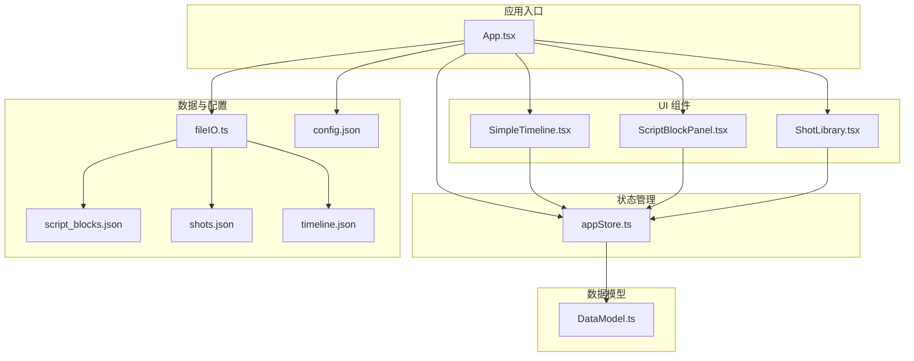
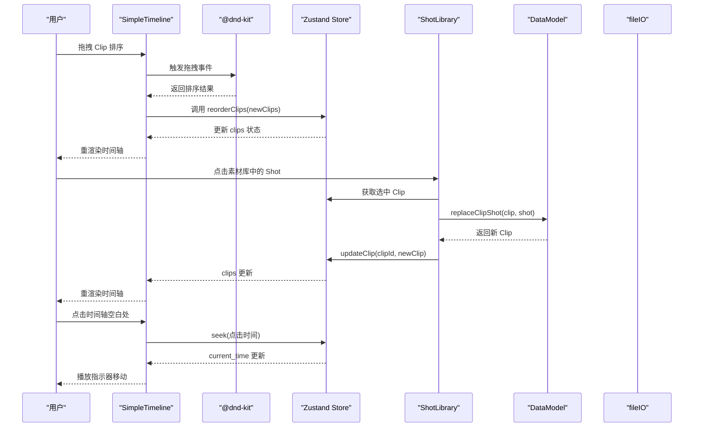
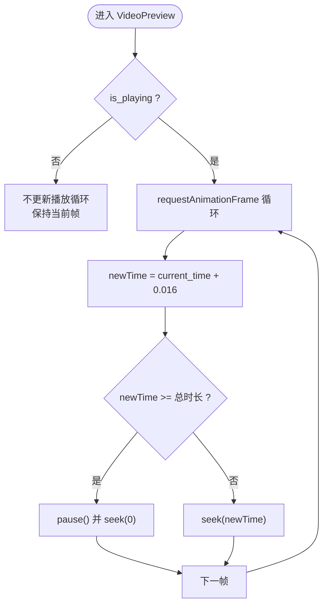
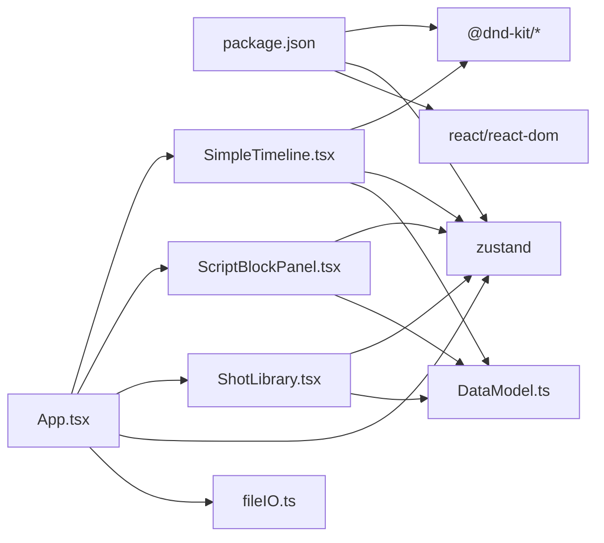

# 简化时间轴

<cite>
**本文引用的文件**
- [README.md](file://README.md)
- [package.json](file://package.json)
- [src/App.tsx](file://src/App.tsx)
- [src/components/SimpleTimeline.tsx](file://src/components/SimpleTimeline.tsx)
- [src/components/ScriptBlockPanel.tsx](file://src/components/ScriptBlockPanel.tsx)
- [src/components/ShotLibrary.tsx](file://src/components/ShotLibrary.tsx)
- [src/store/appStore.ts](file://src/store/appStore.ts)
- [src/types/DataModel.ts](file://src/types/DataModel.ts)
- [src/utils/fileIO.ts](file://src/utils/fileIO.ts)
- [public/data/config.json](file://public/data/config.json)
- [public/data/script_blocks.json](file://public/data/script_blocks.json)
- [public/data/shots.json](file://public/data/shots.json)
- [public/data/timeline.json](file://public/data/timeline.json)
</cite>

## 目录
1. [简介](#简介)
2. [项目结构](#项目结构)
3. [核心组件](#核心组件)
4. [架构总览](#架构总览)
5. [详细组件分析](#详细组件分析)
6. [依赖关系分析](#依赖关系分析)
7. [性能考量](#性能考量)
8. [故障排查指南](#故障排查指南)
9. [结论](#结论)
10. [附录](#附录)

## 简介
本技术文档围绕“简化时间轴”功能进行系统化说明，目标是帮助开发者与使用者快速理解并高效使用单轨时间轴的交互设计、拖拽排序、镜头裁剪、播放预览、时间计算与缩放平移等核心能力。文档同时覆盖与素材库的实时同步机制、Zustand 状态管理、@dnd-kit 拖拽库集成、以及基于 requestAnimationFrame 的流畅播放实现。

## 项目结构
项目采用 React + TypeScript + Zustand + @dnd-kit 的前端架构，数据以 JSON 文件形式在 public/data 下提供示例数据，运行时通过 localStorage 持久化时间轴状态。

图表来源
- [src/App.tsx](file://src/App.tsx#L1-L497)
- [src/components/SimpleTimeline.tsx](file://src/components/SimpleTimeline.tsx#L1-L414)
- [src/components/ScriptBlockPanel.tsx](file://src/components/ScriptBlockPanel.tsx#L1-L285)
- [src/components/ShotLibrary.tsx](file://src/components/ShotLibrary.tsx#L1-L359)
- [src/store/appStore.ts](file://src/store/appStore.ts#L1-L195)
- [src/types/DataModel.ts](file://src/types/DataModel.ts#L1-L291)
- [src/utils/fileIO.ts](file://src/utils/fileIO.ts#L1-L95)
- [public/data/config.json](file://public/data/config.json#L1-L6)
- [public/data/script_blocks.json](file://public/data/script_blocks.json#L1-L38)
- [public/data/shots.json](file://public/data/shots.json#L1-L83)
- [public/data/timeline.json](file://public/data/timeline.json#L1-L59)

章节来源
- [README.md](file://README.md#L126-L150)
- [package.json](file://package.json#L1-L36)

## 核心组件
- 简化时间轴（单轨）：负责展示时间刻度、Clip 列表、播放指示器、播放控制、拖拽排序、点击跳转、裁剪手柄占位。
- 剧本段落面板：展示 ScriptBlock 列表，高亮当前播放段落，提供“占位”创建与时长对比。
- 素材库：展示 Shot 列表，按情绪/状态筛选，支持替换时间轴选中 Clip 的素材。
- 全局状态（Zustand）：集中管理 clips、播放状态、选中项、媒体库配置、项目检查状态等。
- 数据模型与工具：定义数据结构、计算函数（时长、查找 Clip）、文件 IO（加载/保存/导出）。

章节来源
- [src/components/SimpleTimeline.tsx](file://src/components/SimpleTimeline.tsx#L331-L414)
- [src/components/ScriptBlockPanel.tsx](file://src/components/ScriptBlockPanel.tsx#L9-L285)
- [src/components/ShotLibrary.tsx](file://src/components/ShotLibrary.tsx#L11-L359)
- [src/store/appStore.ts](file://src/store/appStore.ts#L4-L195)
- [src/types/DataModel.ts](file://src/types/DataModel.ts#L140-L291)
- [src/utils/fileIO.ts](file://src/utils/fileIO.ts#L54-L95)

## 架构总览
简化时间轴的交互链路如下：用户在时间轴中拖拽 Clip 排序、点击时间轴跳转、在素材库中选择素材替换当前选中 Clip；全局状态驱动播放循环与 UI 同步；数据模型提供计算与校验；文件 IO 负责持久化与导出。

图表来源
- [src/components/SimpleTimeline.tsx](file://src/components/SimpleTimeline.tsx#L343-L367)
- [src/components/ShotLibrary.tsx](file://src/components/ShotLibrary.tsx#L42-L53)
- [src/store/appStore.ts](file://src/store/appStore.ts#L107-L129)
- [src/types/DataModel.ts](file://src/types/DataModel.ts#L279-L290)
- [src/utils/fileIO.ts](file://src/utils/fileIO.ts#L78-L80)

## 详细组件分析

### 简化时间轴（单轨）
- 设计理念
  - 单轨布局，专注镜头顺序验证，避免多轨/特效/音频等复杂编辑。
  - 时间刻度标尺：秒级主刻度 + 0.5 秒次刻度，像素比固定（每秒像素数）。
  - 播放指示器：红色竖线 + 圆点，随播放状态移动。
  - 播放预览：基于 HTMLVideoElement，结合 requestAnimationFrame 控制播放循环与 seek。
- 拖拽排序实现机制
  - 使用 @dnd-kit 的 DndContext + SortableContext + useSortable，实现水平拖拽排序。
  - 拖拽结束回调中计算新索引，更新 clips 数组并通过 Zustand 更新状态。
- 镜头裁剪功能
  - 当前实现提供裁剪手柄（左右两侧），但裁剪拖拽逻辑为占位（TODO），尚未实现实际拖拽更新 trim_in/trim_out。
- 播放预览系统
  - 基于 requestAnimationFrame 的播放循环，每帧推进约 0.016 秒，到达末尾自动暂停并回到开头。
  - findCurrentClip 根据累计时长定位当前 Clip，内部时间 = 当前时间 - 开始时间 + trim_in。
  - 同步视频元素的 currentTime，若播放则 play，否则 pause。
- 时间计算与缩放
  - 像素比常量：每秒像素数，用于将秒转换为像素宽度与位置。
  - 时间刻度：整秒主刻度，0.5 秒次刻度；格式化时间字符串。
  - 点击时间轴空白处跳转：根据鼠标相对可视区域的像素位置换算为时间并 seek。
- 交互细节
  - 选中 Clip 高亮边框与背景，占位符（无有效 file_path）显示虚线边框与“占位符”标记。
  - 删除按钮支持移除 Clip。
  - 播放控制：播放/暂停、停止、进度条点击跳转。

图表来源
- [src/components/SimpleTimeline.tsx](file://src/components/SimpleTimeline.tsx#L68-L92)

章节来源
- [src/components/SimpleTimeline.tsx](file://src/components/SimpleTimeline.tsx#L1-L414)
- [src/types/DataModel.ts](file://src/types/DataModel.ts#L187-L237)

### 剧本段落面板
- 功能要点
  - 展示 ScriptBlock 列表，支持场景分组折叠/展开。
  - 根据当前播放时间动态高亮对应 ScriptBlock。
  - 为未分配 Clip 的段落提供“占位”按钮，自动创建占位 Clip（优先匹配情绪，否则创建临时占位 Shot）。
  - 实时显示期望时长 vs 实际时长，颜色区分“过短/正常/过长”，并给出差异值。
- 与时间轴联动
  - 通过 getScriptBlockActualDuration 计算某段落实际时长（由 clips 中该段落的 Clip duration 求和）。
  - ScriptBlockPanel 与 SimpleTimeline 共享 clips 状态，实现播放时的双向高亮。

章节来源
- [src/components/ScriptBlockPanel.tsx](file://src/components/ScriptBlockPanel.tsx#L38-L106)
- [src/types/DataModel.ts](file://src/types/DataModel.ts#L198-L205)

### 素材库
- 功能要点
  - 展示 Shot 列表，支持按情绪与状态筛选。
  - 点击素材库中的 Shot 可替换当前选中 Clip 的素材，触发 replaceClipShot 并更新 Clip 的 trim_in/trim_out/duration。
  - 支持编辑标签、修改情绪、删除素材、标记为已处理等。
  - 提供素材库路径配置与扫描处理（CLIP 分析）入口。
- 与时间轴联动
  - 选中 Clip 后，素材库提示“已选中 Clip，点击素材即可替换”。

章节来源
- [src/components/ShotLibrary.tsx](file://src/components/ShotLibrary.tsx#L42-L53)
- [src/types/DataModel.ts](file://src/types/DataModel.ts#L279-L290)

### 全局状态（Zustand）
- 状态结构
  - 数据：scriptBlocks、scriptScenes、shots、clips、mediaLibrary、originalScriptContent。
  - UI：selectedClipId、selectedScriptBlockId、highlightedScriptBlockId、activeTab。
  - 播放：playbackState（current_time、is_playing、current_clip_index、current_clip_internal_time、current_script_block_id）。
- 关键动作
  - Clip 操作：addClip、updateClip、deleteClip、reorderClips。
  - 选择操作：selectClip、selectScriptBlock、setHighlightedScriptBlock、setActiveTab。
  - 播放操作：setPlaybackState、play、pause、seek。
  - 计算函数：getScriptBlockActualDuration、getShotById、getClipById、checkProjectStatus。
  - 素材管理：updateShotStatus、addShot、deleteShot。

章节来源
- [src/store/appStore.ts](file://src/store/appStore.ts#L4-L195)

### 数据模型与工具
- 数据模型
  - ScriptBlock、ScriptScene、Shot、Clip、PlaybackState、MediaLibraryConfig、Config。
  - 计算函数：calculateScriptBlockDuration、calculateTotalDuration、findClipAtTime、createClip、updateClipTrim、replaceClipShot。
- 文件 IO
  - loadJSON/loadFromLocalStorage：从 public/data 加载 JSON，或从 localStorage 回退。
  - saveJSON/saveProjectData：保存时间轴到 localStorage。
  - exportProjectData：导出项目为 JSON 文件。

章节来源
- [src/types/DataModel.ts](file://src/types/DataModel.ts#L90-L291)
- [src/utils/fileIO.ts](file://src/utils/fileIO.ts#L54-L95)

## 依赖关系分析
- 技术栈
  - 前端：React 18、TypeScript、Vite。
  - 状态管理：Zustand。
  - 拖拽：@dnd-kit/core、@dnd-kit/sortable、@dnd-kit/utilities。
  - 样式：Tailwind CSS。
  - 数据：JSON 文件 + localStorage。
- 组件耦合
  - SimpleTimeline 与 Zustand Store 强耦合，负责渲染与交互；与 DataModel 的计算函数配合。
  - ScriptBlockPanel 与 SimpleTimeline 通过共享 clips 状态实现播放高亮联动。
  - ShotLibrary 通过 replaceClipShot 与 Store 的 updateClip 实现素材替换。
- 外部依赖
  - 浏览器原生 API：HTMLVideoElement、requestAnimationFrame、FileReader、Blob、URL。
  - Electron（可选）：通过 package.json 脚本支持，可用于真实文件写入。

图表来源
- [package.json](file://package.json#L14-L34)
- [src/components/SimpleTimeline.tsx](file://src/components/SimpleTimeline.tsx#L1-L10)
- [src/components/ScriptBlockPanel.tsx](file://src/components/ScriptBlockPanel.tsx#L1-L4)
- [src/components/ShotLibrary.tsx](file://src/components/ShotLibrary.tsx#L1-L6)
- [src/App.tsx](file://src/App.tsx#L1-L11)
- [src/utils/fileIO.ts](file://src/utils/fileIO.ts#L1-L1)

章节来源
- [package.json](file://package.json#L14-L34)

## 性能考量
- 播放循环
  - 使用 requestAnimationFrame 控制播放循环，帧间隔约 0.016 秒，保证流畅播放。
  - 在 seek 时与视频元素的 currentTime 存在较大偏差时才进行同步，减少频繁调用。
- 渲染优化
  - SimpleTimeline 中对每个 Clip 的宽度与位置使用像素比计算，避免复杂 DOM 重排。
  - 拖拽排序仅更新 clips 数组，随后一次性重渲染。
- 数据访问
  - findCurrentClip 与 getScriptBlockActualDuration 为 O(n) 遍历，适合小规模数据集；若数据量增大可考虑索引优化。
- I/O
  - 时间轴状态保存至 localStorage，避免频繁网络请求；导出为 Blob 下载，避免阻塞主线程。

[本节为通用性能建议，不直接分析具体文件，故无章节来源]

## 故障排查指南
- 播放无视频画面
  - 检查当前 Clip 对应 Shot 的 file_path 是否为空；若为空，预览区域会显示镜头信息与提示。
  - 确认播放状态 is_playing 与 seek 的调用是否正确。
- 拖拽无效
  - 确认 @dnd-kit 的 DndContext 与 SortableContext 正确包裹；确保 items 与 strategy 配置正确。
  - 检查 handleDragEnd 的索引计算与 reorderClips 的调用。
- 裁剪手柄不可用
  - 当前裁剪拖拽逻辑为占位（TODO），尚未实现实际拖拽更新 trim_in/trim_out。
- 时间轴点击跳转异常
  - 确认 timelineRef 的 scrollLeft 与 clientX 的计算方式一致；注意容器滚动偏移。
- 素材替换不生效
  - 确认选中 Clip 的存在与 getClipById 的返回；检查 replaceClipShot 的返回值是否传入 updateClip。
- 项目状态检查
  - 使用“一键检查”查看缺失的段落或素材，确保所有 ScriptBlock 都有 Clip，且所有 Clip 都有对应 Shot。

章节来源
- [src/components/SimpleTimeline.tsx](file://src/components/SimpleTimeline.tsx#L68-L109)
- [src/components/ShotLibrary.tsx](file://src/components/ShotLibrary.tsx#L42-L53)
- [src/store/appStore.ts](file://src/store/appStore.ts#L119-L129)

## 结论
简化时间轴通过单轨设计、清晰的交互与稳定的播放预览，实现了导演在分镜阶段快速验证节奏与情绪匹配的目标。@dnd-kit 的拖拽排序与 Zustand 的状态管理提供了良好的扩展基础；素材库与时间轴的实时同步机制使得镜头替换与占位创建变得直观高效。未来可在裁剪拖拽、缩放/平移、多轨支持等方面逐步增强，同时保持 MVP 的简洁性与易用性。

[本节为总结性内容，不直接分析具体文件，故无章节来源]

## 附录

### API 说明（基于现有实现）
- 状态管理（Zustand）
  - actions
    - play()/pause()/seek(time)：控制播放状态与时间指针。
    - reorderClips(newClips)：更新时间轴顺序。
    - updateClip(clipId, updates)/deleteClip(clipId)：更新或删除 Clip。
    - selectClip(clipId)/selectScriptBlock(blockId)：设置选中项。
    - checkProjectStatus()：返回项目检查状态对象。
  - selectors
    - getScriptBlockActualDuration(blockId)：计算某段落实际时长。
    - getShotById(shotId)/getClipById(clipId)：查询实体。
- 数据模型（DataModel）
  - 计算函数
    - calculateScriptBlockDuration(scriptBlockId, clips)：求和某段落下所有 Clip 的 duration。
    - calculateTotalDuration(clips)：求和所有 Clip 的 duration。
    - findClipAtTime(currentTime, clips)：返回当前时间对应的 Clip 与内部时间。
    - createClip(scriptBlockId, shot)：创建新 Clip。
    - updateClipTrim(clip, trimIn, trimOut)：更新裁剪参数。
    - replaceClipShot(clip, newShot)：替换素材并重置裁剪。
- 文件 IO（fileIO）
  - loadProjectData()：批量加载 script_blocks、shots、clips、config。
  - saveProjectData(clips)：保存 clips 至 localStorage。
  - exportProjectData(clips, filename)：导出项目为 JSON 文件。

章节来源
- [src/store/appStore.ts](file://src/store/appStore.ts#L22-L195)
- [src/types/DataModel.ts](file://src/types/DataModel.ts#L198-L290)
- [src/utils/fileIO.ts](file://src/utils/fileIO.ts#L54-L95)

### 使用示例（基于现有实现）
- 加载示例数据并初始化项目
  - 通过 App.tsx 的 useEffect 调用 loadProjectData，分别设置 scriptBlocks、shots、clips、mediaLibrary。
- 为 ScriptBlock 创建占位 Clip
  - 在 ScriptBlockPanel 中点击“+ 占位”，自动创建占位 Clip 并添加到 clips。
- 替换素材
  - 在素材库中点击某个 Shot，触发 replaceClipShot 并更新当前选中 Clip。
- 播放/暂停/停止/跳转
  - 点击播放/暂停按钮切换 is_playing；停止按钮会 pause 并 seek(0)；进度条点击触发 seek。
- 导出项目
  - 点击“导出项目”，生成 JSON 文件并触发下载。

章节来源
- [src/App.tsx](file://src/App.tsx#L39-L59)
- [src/components/ScriptBlockPanel.tsx](file://src/components/ScriptBlockPanel.tsx#L71-L106)
- [src/components/ShotLibrary.tsx](file://src/components/ShotLibrary.tsx#L42-L53)
- [src/components/SimpleTimeline.tsx](file://src/components/SimpleTimeline.tsx#L162-L201)
- [src/utils/fileIO.ts](file://src/utils/fileIO.ts#L254-L273)