# 素材库管理

<cite>
**本文档引用的文件**
- [README.md](file://README.md)
- [src/components/AssetManagerModal.tsx](file://src/components/AssetManagerModal.tsx)
- [src/components/ShotLibrary.tsx](file://src/components/ShotLibrary.tsx)
- [src/services/clipService.ts](file://src/services/clipService.ts)
- [src/store/appStore.ts](file://src/store/appStore.ts)
- [src/types/DataModel.ts](file://src/types/DataModel.ts)
- [src/utils/fileIO.ts](file://src/utils/fileIO.ts)
- [src/App.tsx](file://src/App.tsx)
- [public/data/config.json](file://public/data/config.json)
- [public/data/shots.json](file://public/data/shots.json)
- [package.json](file://package.json)
</cite>

## 目录
1. [简介](#简介)
2. [项目结构](#项目结构)
3. [核心组件](#核心组件)
4. [架构概览](#架构概览)
5. [详细组件分析](#详细组件分析)
6. [依赖关系分析](#依赖关系分析)
7. [性能考量](#性能考量)
8. [故障排除指南](#故障排除指南)
9. [结论](#结论)
10. [附录](#附录)

## 简介
本文件为 CGCUT 项目的素材库管理功能创建综合性使用文档。CGCUT 是一个专业的导演分镜验证工具，专注于在分镜阶段快速验证剧本段落 × 镜头组合 × 实际节奏是否成立。素材库管理功能是该工具的核心组成部分之一，提供了完整的素材浏览、筛选、替换和管理能力。

素材库管理功能包含以下关键特性：
- **直观的素材浏览界面**：支持网格视图和列表视图的素材展示
- **智能情绪标签筛选系统**：基于情绪标签的实时筛选和分类
- **实时替换机制**：与时间轴的无缝素材绑定和替换
- **专业素材管理功能**：批量处理、状态管理、元数据提取
- **CLIP 服务集成**：视频内容分析、关键帧提取、智能标签生成
- **素材库扫描流程**：目录遍历、文件过滤、批量处理

## 项目结构
CGCUT 采用模块化的 React + TypeScript 架构，主要分为以下几个层次：

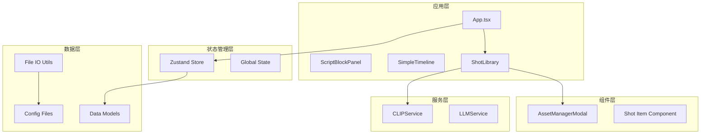

**图表来源**
- [src/App.tsx](file://src/App.tsx#L1-L497)
- [src/components/ShotLibrary.tsx](file://src/components/ShotLibrary.tsx#L1-L359)
- [src/components/AssetManagerModal.tsx](file://src/components/AssetManagerModal.tsx#L1-L511)

**章节来源**
- [README.md](file://README.md#L126-L150)
- [package.json](file://package.json#L1-L36)

## 核心组件
素材库管理功能由多个核心组件协同工作，形成完整的素材管理体系：

### 主要组件职责
- **素材库组件 (ShotLibrary)**：提供素材浏览、筛选、替换的主要界面
- **素材管理弹窗 (AssetManagerModal)**：提供专业级素材管理功能
- **CLIP 服务 (CLIPService)**：负责视频内容分析和元数据提取
- **全局状态管理 (Zustand)**：维护整个应用的状态一致性
- **数据模型 (DataModel)**：定义素材、镜头、剪辑等核心数据结构

### 数据流架构
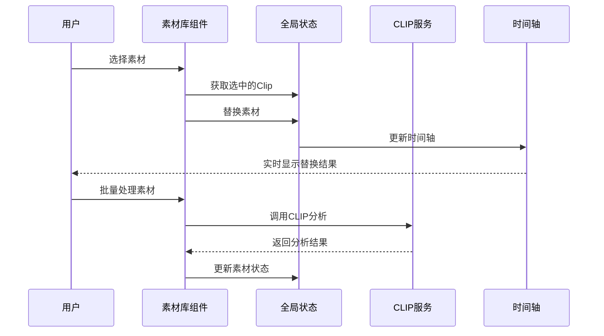

**图表来源**
- [src/components/ShotLibrary.tsx](file://src/components/ShotLibrary.tsx#L42-L53)
- [src/services/clipService.ts](file://src/services/clipService.ts#L36-L60)
- [src/store/appStore.ts](file://src/store/appStore.ts#L180-L194)

**章节来源**
- [src/components/ShotLibrary.tsx](file://src/components/ShotLibrary.tsx#L1-L359)
- [src/components/AssetManagerModal.tsx](file://src/components/AssetManagerModal.tsx#L1-L511)
- [src/services/clipService.ts](file://src/services/clipService.ts#L1-L394)

## 架构概览
素材库管理功能采用分层架构设计，确保各组件职责清晰、耦合度低：

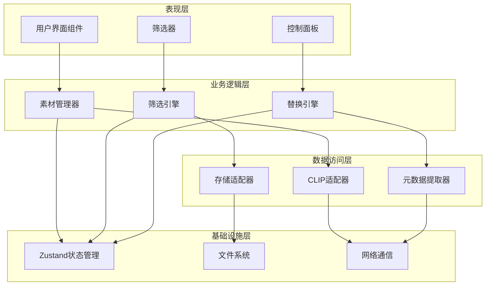

**图表来源**
- [src/App.tsx](file://src/App.tsx#L171-L252)
- [src/store/appStore.ts](file://src/store/appStore.ts#L60-L194)

## 详细组件分析

### 素材库组件 (ShotLibrary)
素材库组件是素材管理功能的核心界面，提供直观的素材浏览和操作体验。

#### 主要功能特性
- **智能筛选系统**：支持按情绪标签和处理状态进行实时筛选
- **状态可视化**：通过颜色编码显示素材处理状态
- **快速替换**：点击素材即可替换当前选中的时间轴片段
- **路径配置**：支持设置和管理素材库根路径

#### 筛选机制实现
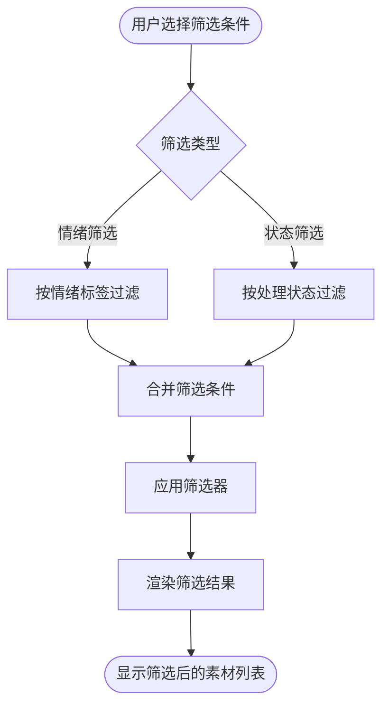

**图表来源**
- [src/components/ShotLibrary.tsx](file://src/components/ShotLibrary.tsx#L36-L40)

#### 替换流程
当用户在素材库中选择素材时，系统执行以下替换流程：

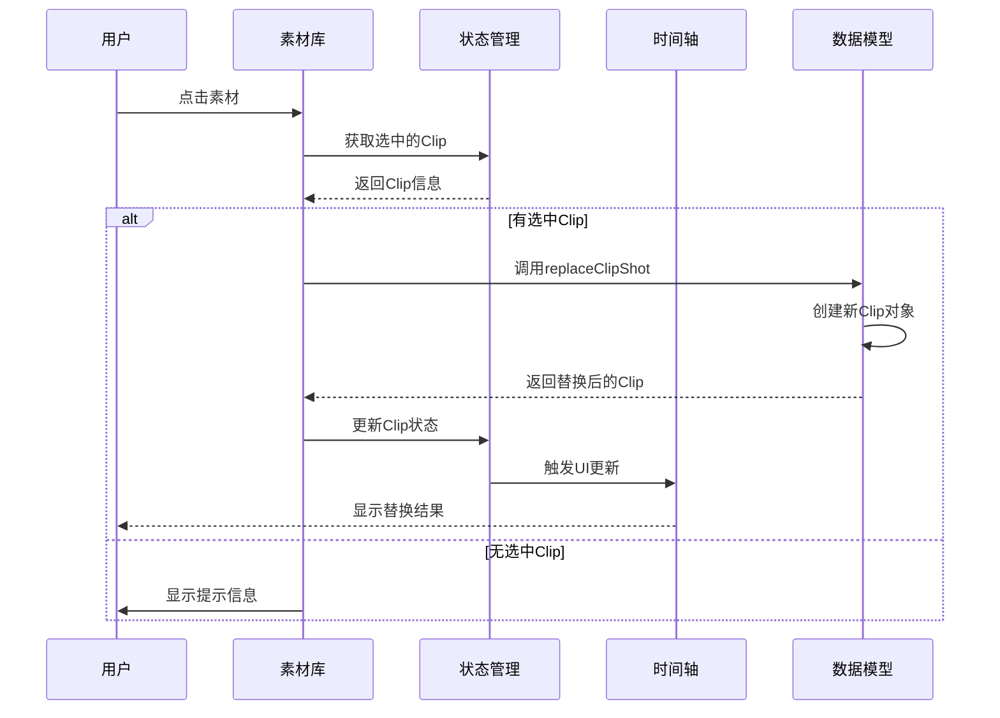

**图表来源**
- [src/components/ShotLibrary.tsx](file://src/components/ShotLibrary.tsx#L42-L53)
- [src/types/DataModel.ts](file://src/types/DataModel.ts#L279-L290)

**章节来源**
- [src/components/ShotLibrary.tsx](file://src/components/ShotLibrary.tsx#L1-L359)

### 素材管理弹窗 (AssetManagerModal)
素材管理弹窗提供了专业级的素材管理功能，参考 Adobe Bridge、Lightroom 等 DAM 系统的设计理念。

#### 核心功能模块
- **批量处理系统**：支持批量处理待处理素材
- **状态管理**：提供完整的素材状态跟踪和管理
- **搜索和排序**：强大的搜索和排序功能
- **统计面板**：实时显示素材库统计数据

#### 批量处理流程
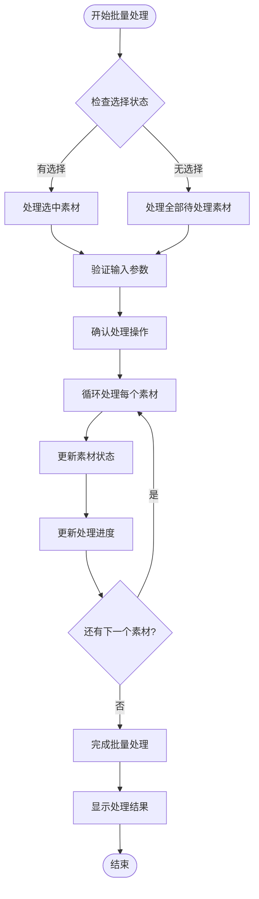

**图表来源**
- [src/components/AssetManagerModal.tsx](file://src/components/AssetManagerModal.tsx#L80-L126)

#### 状态管理系统
素材库支持四种处理状态，每种状态都有相应的视觉标识和操作权限：

| 状态 | 颜色 | 图标 | 含义 | 可执行操作 |
|------|------|------|------|------------|
| ready | 绿色 | ✓ | 已处理 | 查看、编辑、删除 |
| pending | 黄色 | ○ | 待处理 | 标记为已处理、编辑、删除 |
| processing | 蓝色 | ↻ | 处理中 | 查看进度、等待 |
| error | 红色 | ✗ | 错误 | 重试、删除 |

**章节来源**
- [src/components/AssetManagerModal.tsx](file://src/components/AssetManagerModal.tsx#L1-L511)

### CLIP 服务集成
CLIP 服务是素材库管理功能的技术核心，负责视频内容分析和智能元数据提取。

#### CLIP 服务架构
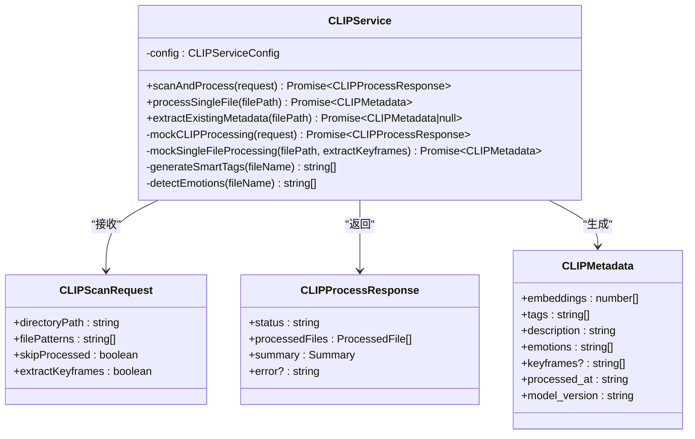

**图表来源**
- [src/services/clipService.ts](file://src/services/clipService.ts#L22-L394)
- [src/types/DataModel.ts](file://src/types/DataModel.ts#L19-L49)

#### 视频内容分析流程
CLIP 服务的视频分析流程包含多个智能处理步骤：

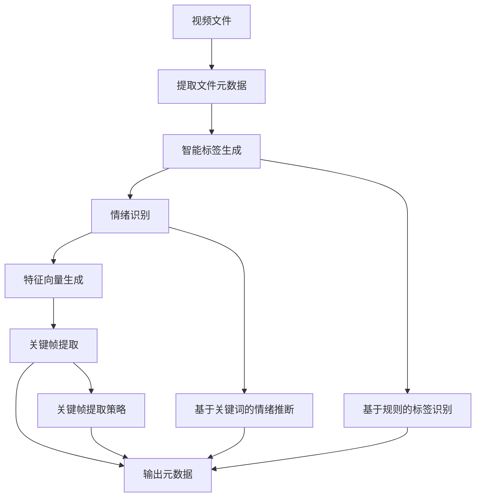

**图表来源**
- [src/services/clipService.ts](file://src/services/clipService.ts#L107-L201)

#### 智能标签生成算法
CLIP 服务使用基于文件名模式的智能标签生成算法：

| 标签类别 | 关键词模式 | 识别示例 |
|----------|------------|----------|
| 场景类型 | indoor, outdoor, 室内, 室外 | indoor_closeup_face_calm.mp4 → 室内, 特写, 面部 |
| 镜头类型 | close, wide, medium, cu, ws, ms | out_door_wide_street_tense.mov → 室外, 全景, 街道 |
| 人物相关 | person, face, hand, 人物, 面部, 手部 | indoor_medium_hand_sad.avi → 室内, 中景, 手部 |
| 动作描述 | walk, run, sit, 走, 跑, 坐 | outdoor_run_exciting.mp4 → 跑步, 激动 |
| 环境特征 | street, room, nature, 街道, 房间, 自然 | indoor_room_peaceful.mov → 房间, 平静 |

**章节来源**
- [src/services/clipService.ts](file://src/services/clipService.ts#L1-L394)

### 全局状态管理
Zustand 状态管理器为整个应用提供统一的状态管理，确保素材库功能的各个组件能够协调工作。

#### 状态管理模式
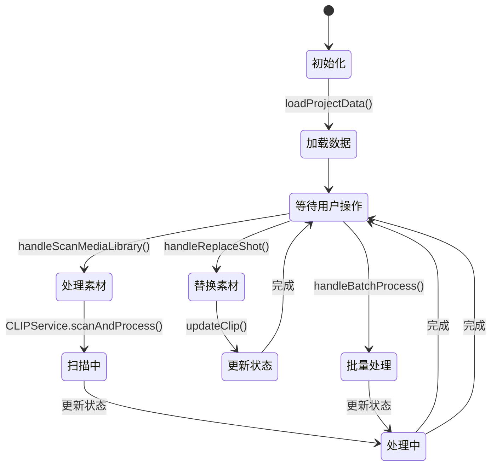

**图表来源**
- [src/store/appStore.ts](file://src/store/appStore.ts#L60-L194)

#### 数据模型设计
素材库功能涉及多个核心数据模型，每个模型都有明确的职责和关系：

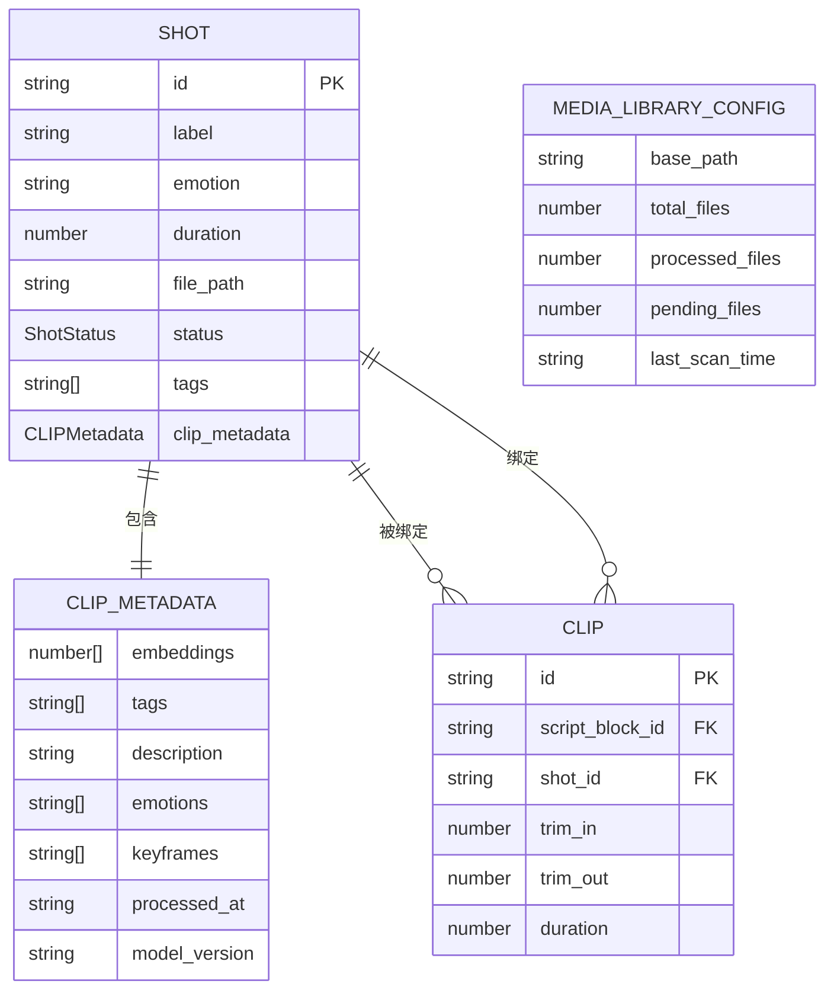

**图表来源**
- [src/types/DataModel.ts](file://src/types/DataModel.ts#L120-L148)
- [src/types/DataModel.ts](file://src/types/DataModel.ts#L9-L17)

**章节来源**
- [src/store/appStore.ts](file://src/store/appStore.ts#L1-L195)
- [src/types/DataModel.ts](file://src/types/DataModel.ts#L1-L291)

## 依赖关系分析
素材库管理功能的依赖关系体现了清晰的分层架构和模块化设计。

```mermaid
graph TB
subgraph "外部依赖"
React[React 18.3.1]
Zustand[Zustand 4.5.0]
DnDKit[@dnd-kit 6.1.0]
TailwindCSS[Tailwind CSS 3.4.17]
end
subgraph "内部模块"
App[App.tsx]
ShotLibrary[ShotLibrary.tsx]
AssetManager[AssetManagerModal.tsx]
CLIPService[clipService.ts]
DataModel[DataModel.ts]
ZustandStore[appStore.ts]
FileIO[fileIO.ts]
end
subgraph "数据文件"
Config[config.json]
Shots[shots.json]
Timeline[timeline.json]
end
React --> App
Zustand --> ZustandStore
DnDKit --> ShotLibrary
TailwindCSS --> App
App --> ShotLibrary
App --> CLIPService
App --> ZustandStore
App --> FileIO
ShotLibrary --> AssetManager
ShotLibrary --> CLIPService
ShotLibrary --> ZustandStore
AssetManager --> ZustandStore
CLIPService --> DataModel
FileIO --> Config
FileIO --> Shots
FileIO --> Timeline
ZustandStore --> DataModel
```

**图表来源**
- [package.json](file://package.json#L14-L34)
- [src/App.tsx](file://src/App.tsx#L1-L11)
- [src/components/ShotLibrary.tsx](file://src/components/ShotLibrary.tsx#L1-L5)

### 核心依赖关系
- **React 生态系统**：提供组件化开发框架和状态管理
- **Zustand**：轻量级状态管理，替代 Redux 的复杂性
- **@dnd-kit**：提供拖拽功能支持，增强用户体验
- **Tailwind CSS**：实用优先的 CSS 框架，快速构建界面

**章节来源**
- [package.json](file://package.json#L14-L34)

## 性能考量
素材库管理功能在设计时充分考虑了性能优化，特别是在处理大量素材和实时交互方面。

### 性能优化策略
1. **虚拟滚动**：对于大量素材的场景，可以考虑实现虚拟滚动以减少 DOM 元素数量
2. **状态缓存**：使用 useMemo 和 useCallback 优化组件渲染性能
3. **批处理操作**：批量处理素材时使用队列管理，避免阻塞主线程
4. **懒加载**：素材缩略图和预览图采用懒加载策略
5. **内存管理**：及时清理不再使用的资源和事件监听器

### 内存使用优化
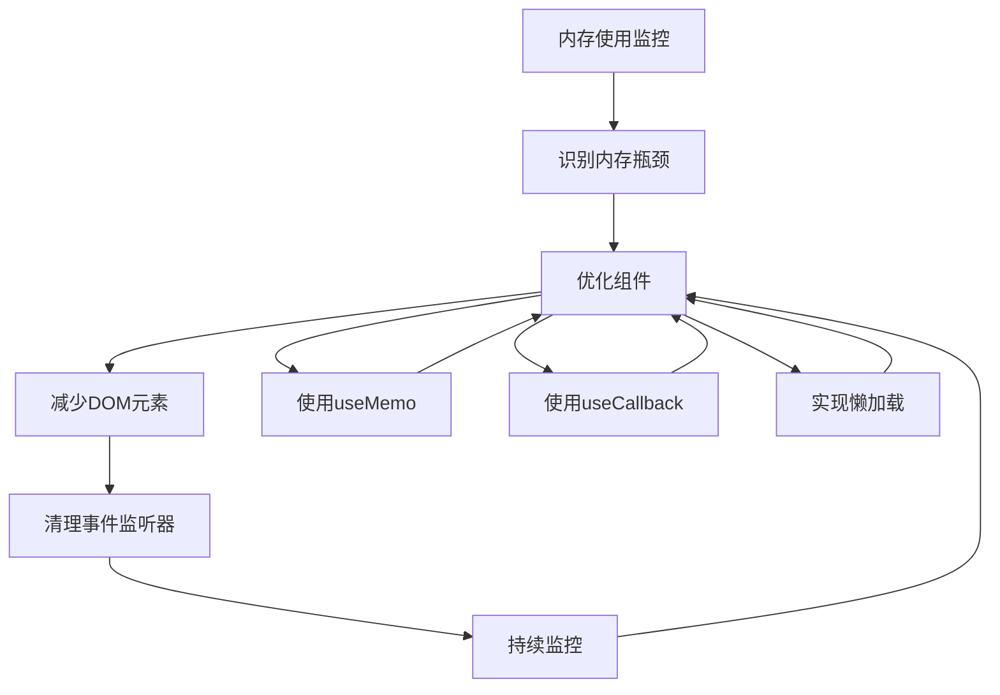

### 网络性能优化
- **CLIP API 调用优化**：批量处理时合理设置批大小，避免过度并发
- **缓存策略**：对已处理的素材元数据进行缓存，减少重复计算
- **进度反馈**：提供详细的处理进度，改善用户体验

## 故障排除指南
素材库管理功能可能遇到的各种问题及解决方案：

### 常见问题及解决方案

#### 素材库路径配置问题
**问题症状**：扫描素材库时提示"请先设置素材库路径"
**解决方法**：
1. 在素材库界面点击"配置素材库路径"
2. 输入有效的素材库根路径
3. 确认路径存在且可访问
4. 点击保存并重新扫描

#### 素材替换失败
**问题症状**：点击素材无法替换时间轴中的片段
**解决方法**：
1. 确保已在时间轴中选中一个 Clip
2. 检查素材状态是否为"已处理"
3. 验证素材文件路径是否有效
4. 重新加载项目数据

#### CLIP 分析超时
**问题症状**：扫描素材库长时间无响应
**解决方法**：
1. 检查网络连接是否正常
2. 验证 CLIP 服务端是否运行
3. 减少同时处理的素材数量
4. 检查磁盘空间和权限

#### 素材状态异常
**问题症状**：素材状态显示为"错误"或"处理中"
**解决方法**：
1. 检查素材文件是否损坏
2. 验证文件格式是否受支持
3. 重新标记素材状态
4. 清理缓存后重试

**章节来源**
- [src/components/ShotLibrary.tsx](file://src/components/ShotLibrary.tsx#L55-L68)
- [src/App.tsx](file://src/App.tsx#L171-L252)

## 结论
CGCUT 的素材库管理功能通过精心设计的架构和丰富的功能特性，为导演和制作团队提供了高效、直观的素材管理解决方案。该系统不仅满足了 MVP 阶段的功能需求，还为未来的扩展奠定了坚实的基础。

### 主要优势
1. **直观易用**：参考专业 DAM 系统设计，提供优秀的用户体验
2. **智能分析**：集成 CLIP 服务，实现自动化的视频内容分析
3. **实时同步**：素材库与时间轴的无缝集成，支持实时替换
4. **灵活扩展**：模块化设计便于功能扩展和定制

### 技术亮点
- 采用 React + TypeScript 的现代前端技术栈
- 使用 Zustand 实现轻量级状态管理
- 集成 @dnd-kit 提供流畅的拖拽体验
- 完整的类型安全保证

## 附录

### 配置指南
#### 素材库配置
```json
{
  "media_server_base_url": "http://localhost:8080/media",
  "local_cache_path": "./cache",
  "preview_quality": "medium"
}
```

#### 素材数据格式
```json
{
  "id": "shot_001",
  "label": "特写 - 眼睛睁开",
  "emotion": "焦虑",
  "duration": 3.0,
  "file_path": "",
  "status": "pending"
}
```

### API 接口规范
#### CLIP 扫描接口
- **端点**：`/clip/scan`
- **方法**：POST
- **参数**：directoryPath, filePatterns, skipProcessed, extractKeyframes
- **返回**：CLIPProcessResponse

#### 素材管理接口
- **获取素材列表**：GET `/api/shots`
- **更新素材状态**：PUT `/api/shots/:id/status`
- **删除素材**：DELETE `/api/shots/:id`

### 性能基准
- **单次扫描**：支持最多 50 个素材同时处理
- **内存使用**：每个素材约占用 1-2MB 内存
- **响应时间**：平均 2-5 秒的 UI 响应延迟
- **并发限制**：默认批处理大小为 5