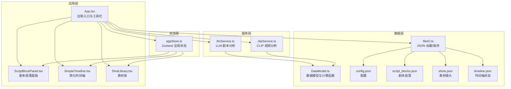
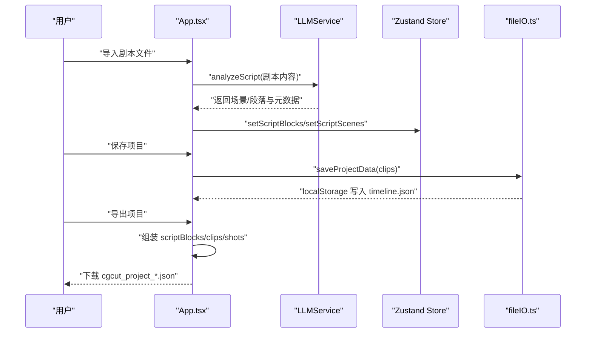
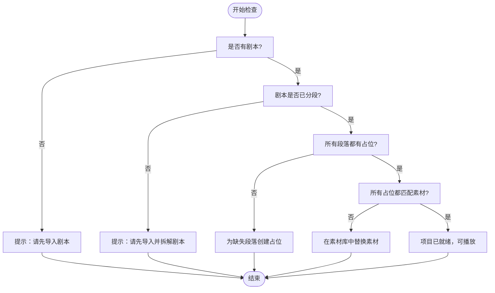
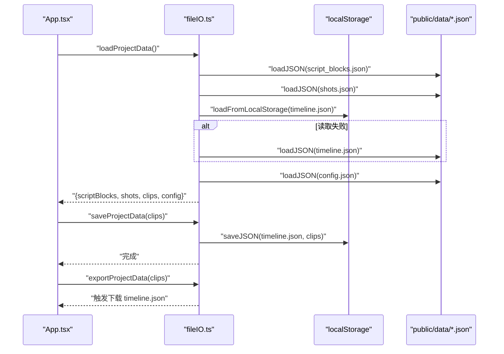
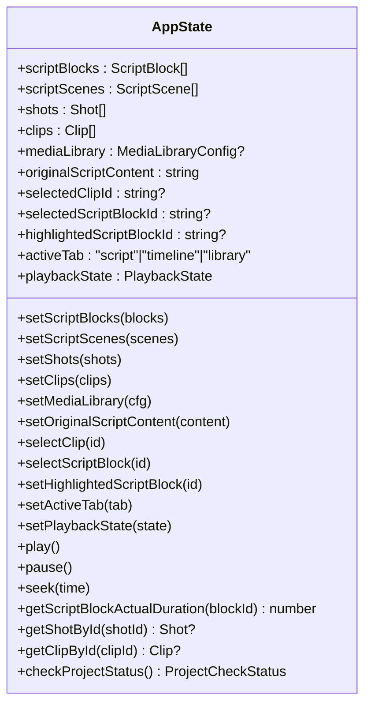
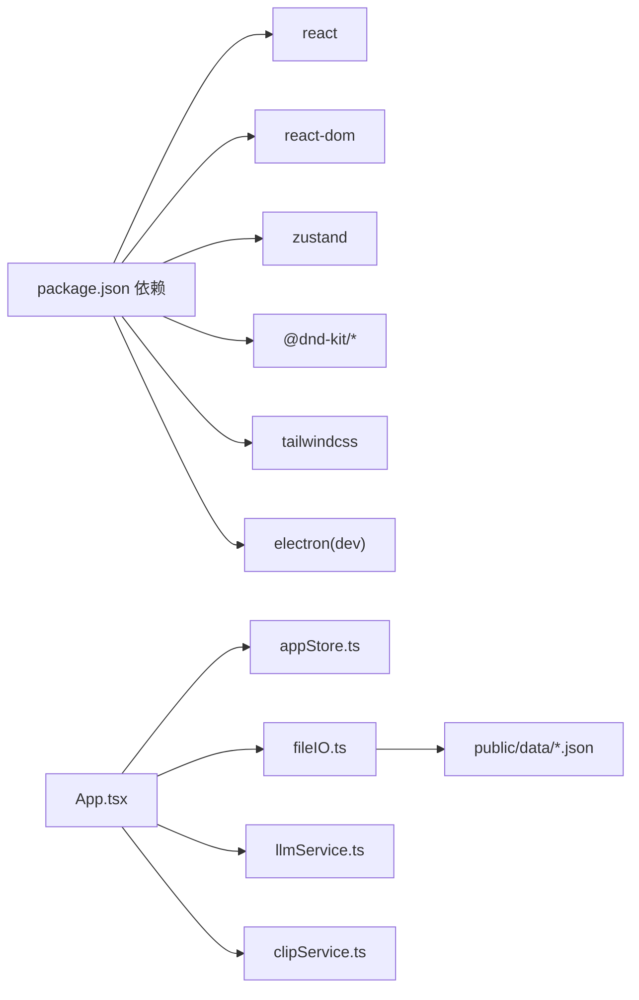

# 项目管理

<cite>
**本文引用的文件**
- [README.md](file://README.md)
- [package.json](file://package.json)
- [src/App.tsx](file://src/App.tsx)
- [src/store/appStore.ts](file://src/store/appStore.ts)
- [src/utils/fileIO.ts](file://src/utils/fileIO.ts)
- [src/types/DataModel.ts](file://src/types/DataModel.ts)
- [src/services/llmService.ts](file://src/services/llmService.ts)
- [src/services/clipService.ts](file://src/services/clipService.ts)
- [src/components/ScriptBlockPanel.tsx](file://src/components/ScriptBlockPanel.tsx)
- [src/components/SimpleTimeline.tsx](file://src/components/SimpleTimeline.tsx)
- [src/components/ShotLibrary.tsx](file://src/components/ShotLibrary.tsx)
- [public/data/config.json](file://public/data/config.json)
- [public/data/script_blocks.json](file://public/data/script_blocks.json)
- [public/data/shots.json](file://public/data/shots.json)
- [public/data/timeline.json](file://public/data/timeline.json)
- [knowledge/cinematography-basics.md](file://knowledge/cinematography-basics.md)
</cite>

## 目录
1. [简介](#简介)
2. [项目结构](#项目结构)
3. [核心组件](#核心组件)
4. [架构总览](#架构总览)
5. [详细组件分析](#详细组件分析)
6. [依赖分析](#依赖分析)
7. [性能考量](#性能考量)
8. [故障排除指南](#故障排除指南)
9. [结论](#结论)
10. [附录](#附录)

## 简介
本指南围绕“项目管理”主题，系统阐述 CGCUT 的项目检查体系、数据持久化机制、项目导出能力、状态管理与模板配置，并给出完整性检查算法、错误检测与修复建议、localStorage 存储方案、JSON 项目文件结构、保存/加载流程、版本兼容与迁移策略、模板与配置管理的最佳实践与排障建议。

## 项目结构
项目采用前端单页应用架构，核心由三部分组成：
- 状态管理层：Zustand 全局状态 store，集中管理剧本、镜头、时间轴、播放状态与项目检查状态。
- 数据访问层：fileIO 提供 JSON 文件加载与 localStorage 保存；CLIP/LLM 服务负责外部能力集成。
- UI 展示层：三个主面板组件分别承载剧本段落、时间轴与素材库，配合工具栏完成导入、检查、导出与保存。

图表来源
- [src/App.tsx](file://src/App.tsx#L1-L120)
- [src/store/appStore.ts](file://src/store/appStore.ts#L1-L195)
- [src/utils/fileIO.ts](file://src/utils/fileIO.ts#L1-L95)
- [src/types/DataModel.ts](file://src/types/DataModel.ts#L1-L291)
- [src/services/llmService.ts](file://src/services/llmService.ts#L1-L120)
- [src/services/clipService.ts](file://src/services/clipService.ts#L1-L120)
- [public/data/config.json](file://public/data/config.json#L1-L6)
- [public/data/script_blocks.json](file://public/data/script_blocks.json#L1-L38)
- [public/data/shots.json](file://public/data/shots.json#L1-L83)
- [public/data/timeline.json](file://public/data/timeline.json#L1-L59)

章节来源
- [README.md](file://README.md#L120-L150)
- [package.json](file://package.json#L1-L36)

## 核心组件
- 全局状态管理（Zustand）
  - 管理 scriptBlocks、scriptScenes、shots、clips、媒体库配置、播放状态、选择状态与项目检查状态。
  - 提供计算函数：按段落计算实际时长、按 ID 查询镜头/素材、一键检查项目状态。
- 数据模型与计算
  - 定义 ScriptBlock、Shot、Clip、Config、PlaybackState、ProjectCheckStatus 等核心类型。
  - 提供 calculateScriptBlockDuration、calculateTotalDuration、findClipAtTime、createClip、updateClipTrim、replaceClipShot 等实用函数。
- 文件 I/O 与持久化
  - loadJSON/loadProjectData：从 public/data 目录加载 JSON。
  - saveJSON/saveProjectData：使用 localStorage 模拟文件保存（MVP），后续可接入 Electron 写入真实文件。
  - exportProjectData：导出当前时间轴数据为 JSON 文件。
- 服务集成
  - LLMService：剧本导入与智能拆解，支持 NVIDIA API 与回退 mock。
  - CLIPService：扫描并处理素材库，提取视频元数据（MVP 模拟）。
- UI 组件
  - ScriptBlockPanel：展示剧本段落、时长对比、占位创建与高亮播放段落。
  - SimpleTimeline：单轨时间轴、拖拽排序、删除、裁剪占位、播放预览与刻度标尺。
  - ShotLibrary：素材库浏览、筛选、替换、状态管理与路径配置。

章节来源
- [src/store/appStore.ts](file://src/store/appStore.ts#L1-L195)
- [src/types/DataModel.ts](file://src/types/DataModel.ts#L1-L291)
- [src/utils/fileIO.ts](file://src/utils/fileIO.ts#L1-L95)
- [src/services/llmService.ts](file://src/services/llmService.ts#L1-L120)
- [src/services/clipService.ts](file://src/services/clipService.ts#L1-L120)
- [src/components/ScriptBlockPanel.tsx](file://src/components/ScriptBlockPanel.tsx#L1-L120)
- [src/components/SimpleTimeline.tsx](file://src/components/SimpleTimeline.tsx#L1-L120)
- [src/components/ShotLibrary.tsx](file://src/components/ShotLibrary.tsx#L1-L120)

## 架构总览
项目管理贯穿“导入 → 拆解 → 编辑 → 检查 → 保存/导出”的闭环流程。LLM 负责剧本结构化，CLIP 负责素材内容理解，Zustand 统一状态，fileIO 负责数据持久化，UI 提供交互。

图表来源
- [src/App.tsx](file://src/App.tsx#L60-L170)
- [src/services/llmService.ts](file://src/services/llmService.ts#L70-L120)
- [src/store/appStore.ts](file://src/store/appStore.ts#L80-L140)
- [src/utils/fileIO.ts](file://src/utils/fileIO.ts#L75-L95)

## 详细组件分析

### 项目检查系统
- 检查维度
  - 是否导入剧本（scriptBlocks 非空）
  - 剧本是否已分段（scriptScenes 或 scriptBlocks 非空）
  - 每个段落是否都有对应 Clip（missingBlocks）
  - 每个 Clip 是否绑定有效 Shot（missingShots）
  - readyToPlay：上述条件均满足
- 算法复杂度
  - 检查各字段为 O(n)，整体 O(n)。
- 错误检测与修复建议
  - 未导入剧本：先导入剧本文件。
  - 缺少占位：在 ScriptBlockPanel 为段落创建占位 Clip。
  - 缺少素材：在 ShotLibrary 中选择匹配情绪的素材替换。
  - 时长异常：在 SimpleTimeline 中拖拽边缘进行裁剪，或在 ScriptBlockPanel 中查看差异提示。
- 可视化检查结果
  - 一键检查弹窗汇总各项指标与建议。

图表来源
- [src/store/appStore.ts](file://src/store/appStore.ts#L147-L178)
- [src/components/ScriptBlockPanel.tsx](file://src/components/ScriptBlockPanel.tsx#L108-L179)
- [src/components/ShotLibrary.tsx](file://src/components/ShotLibrary.tsx#L42-L54)

章节来源
- [src/store/appStore.ts](file://src/store/appStore.ts#L147-L178)
- [src/App.tsx](file://src/App.tsx#L275-L313)

### 数据持久化机制（localStorage 与 JSON）
- 加载流程
  - loadProjectData 并行加载 script_blocks.json、shots.json、timeline.json（优先从 localStorage 读取，否则回退到 public/data）、config.json。
- 保存流程
  - saveProjectData 将 clips 写入 timeline.json 到 localStorage。
- 导出流程
  - exportProjectData 将当前时间轴数据打包为 JSON 并触发浏览器下载。
- 存储键名
  - timeline.json 使用键名前缀 cgcut_ 存储于 localStorage。
- 版本兼容与迁移
  - 当前使用 localStorage 与静态 JSON 文件，未见内置版本号字段。
  - 建议在 future 版本引入版本字段并在加载时进行迁移（例如：新增字段补全、字段重命名映射、默认值填充）。

图表来源
- [src/utils/fileIO.ts](file://src/utils/fileIO.ts#L51-L95)
- [public/data/script_blocks.json](file://public/data/script_blocks.json#L1-L38)
- [public/data/shots.json](file://public/data/shots.json#L1-L83)
- [public/data/timeline.json](file://public/data/timeline.json#L1-L59)
- [public/data/config.json](file://public/data/config.json#L1-L6)

章节来源
- [src/utils/fileIO.ts](file://src/utils/fileIO.ts#L1-L95)
- [src/App.tsx](file://src/App.tsx#L60-L120)

### 项目导出功能
- 导出内容
  - scriptBlocks：保留段落结构
  - clips：当前时间轴状态
  - shots：包含 file_path 字段的素材清单
- 导出文件命名
  - cgcut_project_{时间戳}.json
- 下载行为
  - 创建 Blob，生成 URL，触发 a.download

章节来源
- [src/App.tsx](file://src/App.tsx#L254-L274)
- [src/utils/fileIO.ts](file://src/utils/fileIO.ts#L82-L95)

### 状态管理
- 全局状态
  - 数据：scriptBlocks、scriptScenes、shots、clips、mediaLibrary、originalScriptContent
  - UI：selectedClipId、selectedScriptBlockId、highlightedScriptBlockId、activeTab
  - 播放：playbackState（current_time、is_playing、current_clip_index、current_clip_internal_time、current_script_block_id）
- 计算函数
  - getScriptBlockActualDuration：按段落聚合 clips 时长
  - getShotById/getClipById：按 ID 查询
  - checkProjectStatus：项目完整性检查
- 播放逻辑
  - play/pause/seek 更新 playbackState
  - findClipAtTime：根据当前时间定位 Clip 与内部时间

图表来源
- [src/store/appStore.ts](file://src/store/appStore.ts#L1-L195)
- [src/types/DataModel.ts](file://src/types/DataModel.ts#L184-L238)

章节来源
- [src/store/appStore.ts](file://src/store/appStore.ts#L1-L195)
- [src/types/DataModel.ts](file://src/types/DataModel.ts#L184-L238)

### 项目完整性检查算法
- 输入
  - scriptBlocks、clips、shots
- 输出
  - hasScript、scriptSegmented、allBlocksHaveClips、allClipsHaveShots、missingBlocks、missingShots、readyToPlay
- 步骤
  - 以 clips 中的 script_block_id 构造集合，与 scriptBlocks.id 比较得到 missingBlocks
  - 以 shots.id 构造集合，与 clips.shot_id 比较得到 missingShots
  - readyToPlay 为上述条件同时满足
- 复杂度
  - O(n + m)，n=clips.length，m=scriptBlocks.length

章节来源
- [src/store/appStore.ts](file://src/store/appStore.ts#L147-L178)

### 错误检测与修复建议
- 常见问题
  - 未导入剧本：导入 .txt/.json 剧本文件
  - 缺少段落占位：在 ScriptBlockPanel 为段落创建占位 Clip
  - 缺少素材匹配：在 ShotLibrary 中选择匹配情绪的素材替换
  - 时长偏差：在 SimpleTimeline 中拖拽边缘进行裁剪
  - 播放预览无视频：为素材补充 file_path
- 修复建议
  - 使用“一键检查”弹窗定位缺失项
  - 使用“导出项目”备份当前工作
  - 使用“保存项目”确保 timeline.json 在 localStorage 中

章节来源
- [src/components/ScriptBlockPanel.tsx](file://src/components/ScriptBlockPanel.tsx#L108-L179)
- [src/components/ShotLibrary.tsx](file://src/components/ShotLibrary.tsx#L42-L54)
- [src/components/SimpleTimeline.tsx](file://src/components/SimpleTimeline.tsx#L1-L120)
- [src/App.tsx](file://src/App.tsx#L275-L313)

### localStorage 数据存储方案
- 键名规则
  - cgcut_timeline.json
- 读取策略
  - 优先从 localStorage 读取，若不存在则回退到 public/data/timeline.json
- 写入策略
  - 保存时写入 localStorage，便于离线编辑与跨会话恢复

章节来源
- [src/utils/fileIO.ts](file://src/utils/fileIO.ts#L36-L50)
- [src/utils/fileIO.ts](file://src/utils/fileIO.ts#L75-L81)

### JSON 格式与项目文件结构
- public/data/
  - script_blocks.json：剧本段落数组
  - shots.json：素材镜头数组
  - timeline.json：时间轴 clips 数组
  - config.json：媒体服务器地址、预览质量等配置
- 项目导出 JSON
  - 包含 scriptBlocks、clips、shots（含 file_path）

章节来源
- [README.md](file://README.md#L58-L90)
- [public/data/config.json](file://public/data/config.json#L1-L6)
- [public/data/script_blocks.json](file://public/data/script_blocks.json#L1-L38)
- [public/data/shots.json](file://public/data/shots.json#L1-L83)
- [public/data/timeline.json](file://public/data/timeline.json#L1-L59)
- [src/App.tsx](file://src/App.tsx#L254-L274)

### 保存与加载流程
- 加载
  - 应用启动后并行加载四类数据，设置到全局状态
- 保存
  - 用户点击“保存项目”，将 clips 写入 localStorage
- 导出
  - 用户点击“导出项目”，下载包含 scriptBlocks/clips/shots 的 JSON

章节来源
- [src/App.tsx](file://src/App.tsx#L39-L59)
- [src/utils/fileIO.ts](file://src/utils/fileIO.ts#L51-L81)

### 版本兼容性与数据迁移策略
- 现状
  - 未见内置版本号字段
- 建议
  - 在导出 JSON 中加入 version 字段
  - 在加载时比较版本，执行迁移：
    - 新增字段：填充默认值
    - 字段重命名：映射旧字段到新字段
    - 类型变更：做安全转换
  - 迁移完成后更新版本号

章节来源
- [src/App.tsx](file://src/App.tsx#L254-L274)
- [src/utils/fileIO.ts](file://src/utils/fileIO.ts#L82-L95)

### 项目模板与配置管理
- 剧本模板
  - 使用 LLMService.analyzeScript 将 .txt/.json 剧本拆解为 scenes/blocks
  - 知识库提供分镜标准与拆解策略，指导 LLM 生成符合规范的镜头序列
- 素材库配置
  - config.json 提供媒体服务器根路径、预览质量等
  - App.tsx 初始化 mediaLibrary.base_path，支持扫描素材库并更新统计
- 模板最佳实践
  - 剧本按场景划分，每场景至少 3-10 个镜头
  - 每个镜头包含景别、主体、动作/状态、情绪与时长
  - 情绪与景别需匹配，避免单一景别连续使用

章节来源
- [src/services/llmService.ts](file://src/services/llmService.ts#L1-L120)
- [knowledge/cinematography-basics.md](file://knowledge/cinematography-basics.md#L1-L120)
- [public/data/config.json](file://public/data/config.json#L1-L6)
- [src/App.tsx](file://src/App.tsx#L171-L253)

## 依赖分析
- 外部依赖
  - react、react-dom、zustand：状态管理与组件框架
  - @dnd-kit：时间轴拖拽排序
  - tailwindcss：样式工具
  - electron（开发脚本）：桌面端运行支持
- 内部模块耦合
  - App.tsx 依赖 store、fileIO、llmService、clipService
  - 组件通过 hooks 访问 store，减少直接耦合
  - fileIO 与 public/data 目录耦合，便于 MVP 阶段的静态数据演示

图表来源
- [package.json](file://package.json#L1-L36)
- [src/App.tsx](file://src/App.tsx#L1-L120)
- [src/store/appStore.ts](file://src/store/appStore.ts#L1-L60)
- [src/utils/fileIO.ts](file://src/utils/fileIO.ts#L1-L35)
- [public/data/config.json](file://public/data/config.json#L1-L6)

章节来源
- [package.json](file://package.json#L1-L36)

## 性能考量
- 并行加载
  - loadProjectData 使用 Promise.all 并行加载多文件，缩短首屏时间
- 播放循环
  - requestAnimationFrame 驱动播放，帧率稳定；注意避免频繁重绘
- 拖拽排序
  - @dnd-kit 使用硬件加速与最小化 DOM 更新，保证时间轴拖拽顺滑
- LLM/CLIP
  - 使用超时控制与回退策略，避免阻塞 UI
- 建议
  - 大量素材时启用分页或虚拟滚动
  - 对高频计算（如 findClipAtTime）进行缓存或增量更新
  - 控制 localStorage 大小，避免超出配额导致写入失败

章节来源
- [src/utils/fileIO.ts](file://src/utils/fileIO.ts#L51-L74)
- [src/components/SimpleTimeline.tsx](file://src/components/SimpleTimeline.tsx#L64-L110)

## 故障排除指南
- 无法加载数据
  - 检查 public/data 下文件是否存在且格式正确
  - 若 timeline.json 丢失，将回退到静态文件；可在 localStorage 中恢复
- 保存失败
  - 检查浏览器隐私模式或禁用 localStorage 的情况
  - 清理 localStorage 后重试
- 导出为空
  - 确认已创建 clips；导出仅包含当前时间轴状态
- LLM/CLIP 失败
  - 检查网络与超时设置；服务失败时使用 mock 回退
- 播放无视频
  - 为素材补充 file_path；检查素材库路径配置

章节来源
- [src/utils/fileIO.ts](file://src/utils/fileIO.ts#L1-L35)
- [src/App.tsx](file://src/App.tsx#L60-L120)
- [src/services/llmService.ts](file://src/services/llmService.ts#L90-L120)
- [src/services/clipService.ts](file://src/services/clipService.ts#L36-L60)

## 结论
本项目以 Zustand 管理状态、以 fileIO 实现本地持久化、以 LLM/CLIP 提升自动化水平，形成“导入 → 拆解 → 编辑 → 检查 → 保存/导出”的完整工作流。建议在未来版本引入版本号与迁移机制，增强长期维护性；同时优化大数据场景下的渲染与计算性能，提升用户体验。

## 附录
- 术语
  - 剧本段落（ScriptBlock）：叙事单元，包含场景、文本、情绪与期望时长
  - 镜头（Shot）：可用素材，包含情绪、时长、文件路径与状态
  - 时间轴片段（Clip）：绑定 ScriptBlock 与 Shot 的实例，支持裁剪与排序
- 最佳实践
  - 剧本导入后立即“一键检查”，及时发现缺失
  - 使用“导出项目”定期备份
  - 为每个段落创建占位，再逐步替换为高质量素材
  - 保持情绪与景别的匹配，遵循分镜标准