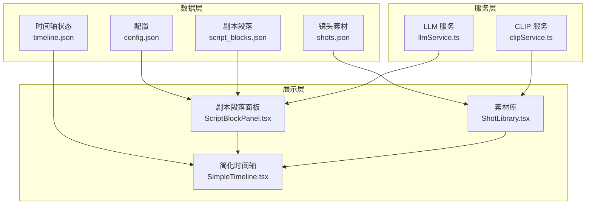
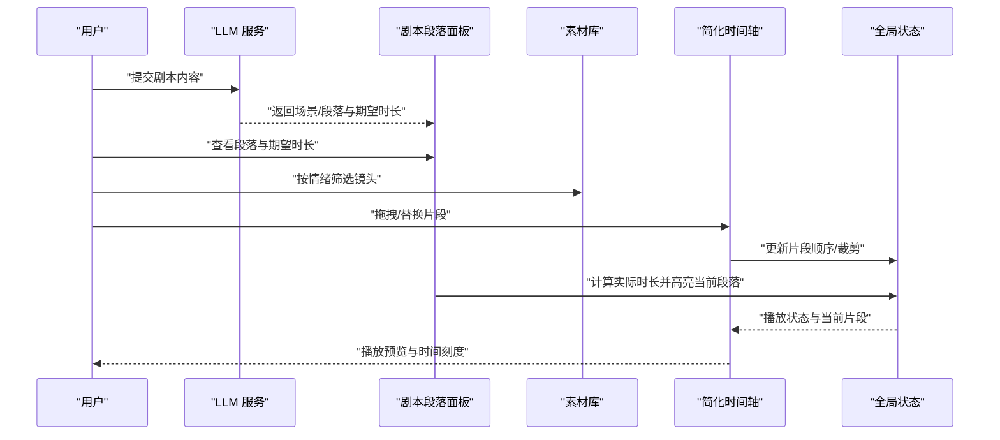
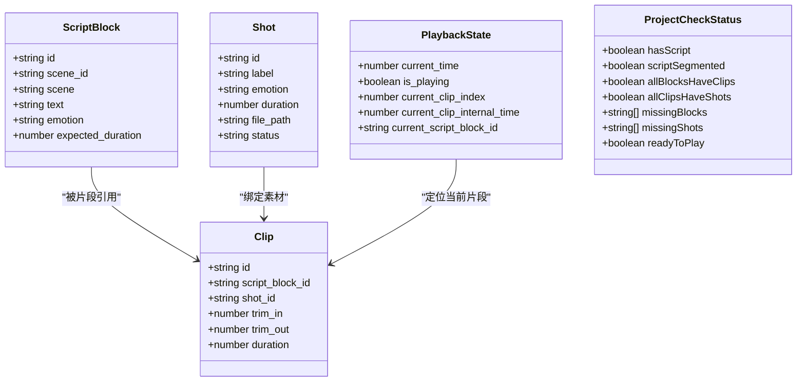
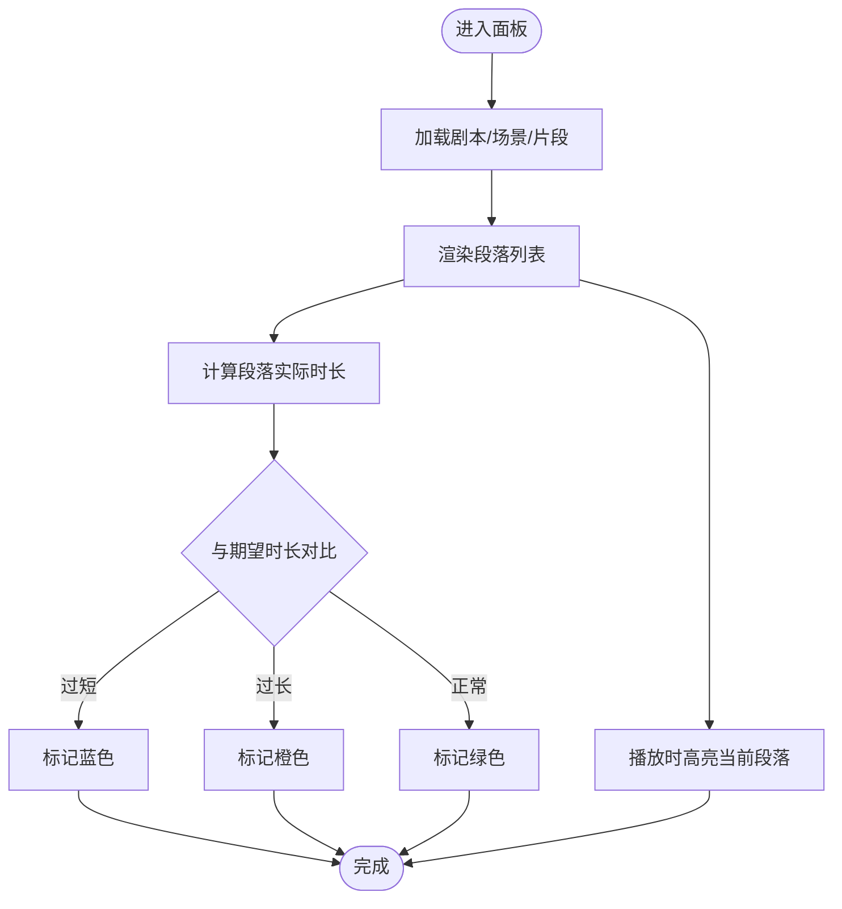
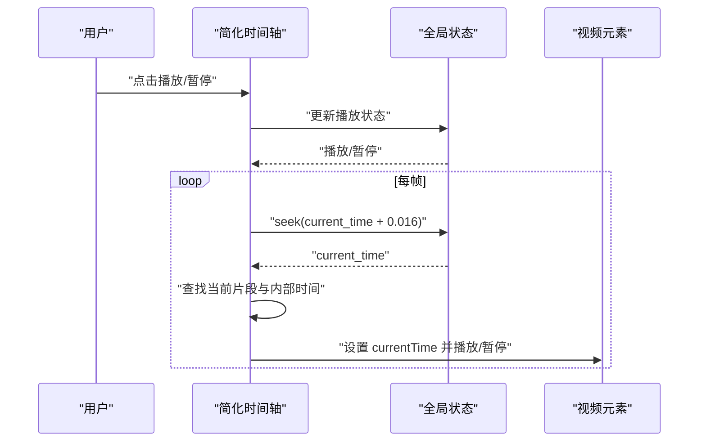
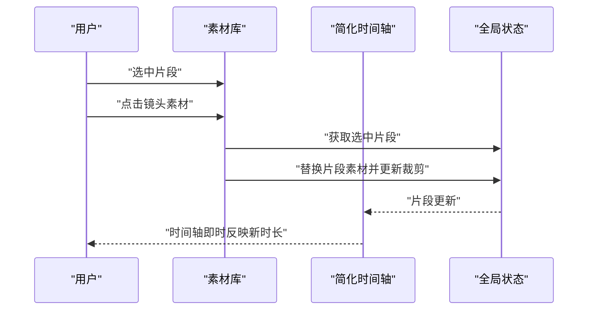
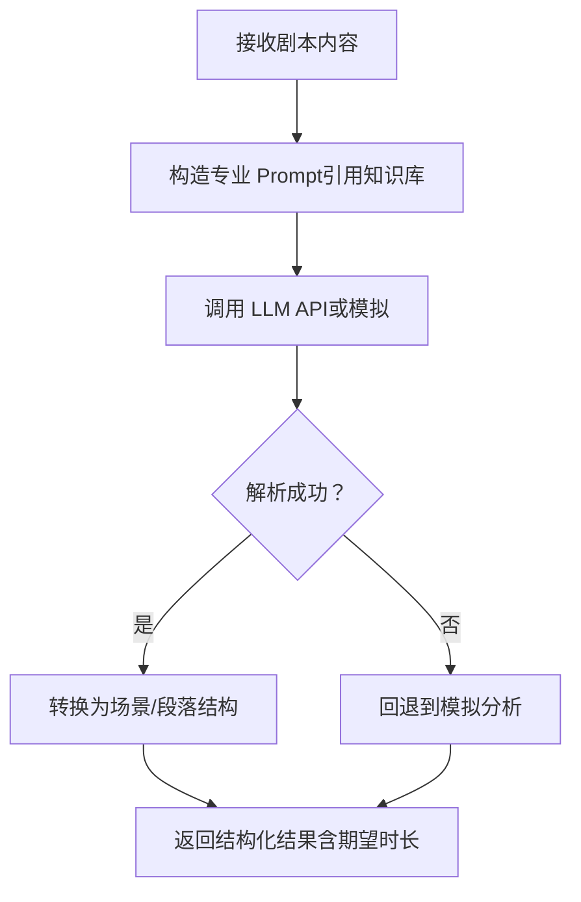
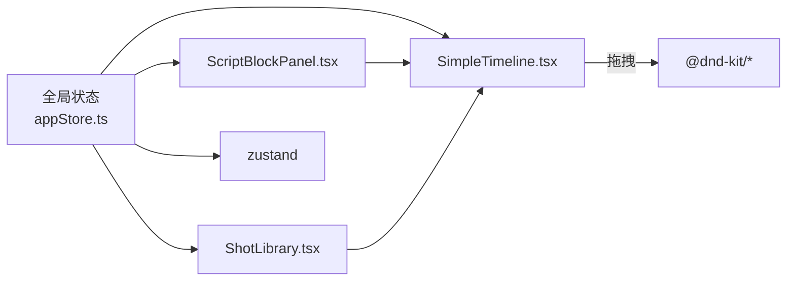

# 知识库

<cite>
**本文引用的文件**
- [README.md](file://README.md)
- [知识库文件](file://knowledge/cinematography-basics.md)
- [数据模型定义](file://src/types/DataModel.ts)
- [全局状态管理](file://src/store/appStore.ts)
- [剧本段落面板](file://src/components/ScriptBlockPanel.tsx)
- [简化时间轴](file://src/components/SimpleTimeline.tsx)
- [素材库](file://src/components/ShotLibrary.tsx)
- [LLM 服务](file://src/services/llmService.ts)
- [CLIP 服务](file://src/services/clipService.ts)
- [文件 IO 工具](file://src/utils/fileIO.ts)
- [项目配置](file://public/data/config.json)
- [剧本段落数据](file://public/data/script_blocks.json)
- [镜头素材数据](file://public/data/shots.json)
- [时间轴数据](file://public/data/timeline.json)
- [包管理配置](file://package.json)
</cite>

## 目录
1. [简介](#简介)
2. [项目结构](#项目结构)
3. [核心组件](#核心组件)
4. [架构总览](#架构总览)
5. [详细组件分析](#详细组件分析)
6. [依赖分析](#依赖分析)
7. [性能考量](#性能考量)
8. [故障排查指南](#故障排查指南)
9. [结论](#结论)
10. [附录](#附录)

## 简介
本知识库面向 CGCUT 分镜验证工具的使用者与开发者，系统梳理影视分镜基础知识与节奏理论，并结合 CGCUT 的数据模型、界面组件与服务模块，给出在工具中落地“剧本段落 × 镜头组合 × 实际节奏”的验证方法论。文档同时提供实用的创作指导、最佳实践、学习路径与进阶建议，帮助用户高效完成从剧本到可播放时间轴的验证工作。

## 项目结构
CGCUT 采用前端单页应用架构，核心由三大部分组成：
- 数据层：JSON 文件驱动的数据源（剧本段落、镜头素材、时间轴、配置），通过文件 IO 工具加载与持久化。
- 展示层：三个主要面板——剧本段落面板、简化时间轴、素材库，分别负责段落与节奏校验、镜头顺序与裁剪、镜头素材筛选与替换。
- 服务层：LLM 服务用于剧本拆解与节奏估算；CLIP 服务用于素材元数据提取与智能标注（MVP 阶段为模拟）。

**图表来源**
- [项目配置](file://public/data/config.json#L1-L6)
- [剧本段落数据](file://public/data/script_blocks.json#L1-L38)
- [镜头素材数据](file://public/data/shots.json#L1-L83)
- [时间轴数据](file://public/data/timeline.json#L1-L59)
- [剧本段落面板](file://src/components/ScriptBlockPanel.tsx#L1-L285)
- [简化时间轴](file://src/components/SimpleTimeline.tsx#L1-L414)
- [素材库](file://src/components/ShotLibrary.tsx#L1-L359)
- [LLM 服务](file://src/services/llmService.ts#L1-L476)
- [CLIP 服务](file://src/services/clipService.ts#L1-L394)

**章节来源**
- [README.md](file://README.md#L1-L181)
- [包管理配置](file://package.json#L1-L36)

## 核心组件
- 数据模型与计算函数：定义剧本段落、镜头素材、时间轴片段、播放状态、项目检查状态等核心类型，并提供时长计算、片段查找、克隆与裁剪等工具函数，支撑节奏验证与播放逻辑。
- 全局状态管理：集中管理剧本、镜头、片段、播放状态与 UI 交互状态，提供查询、更新、重排、播放控制等动作。
- 剧本段落面板：展示段落、期望时长与实际时长对比，支持占位片段创建、情绪高亮、播放时自动高亮当前段落。
- 简化时间轴：单轨布局，支持拖拽排序、删除、裁剪（in/out 边缘手柄）、播放预览与时间刻度标尺。
- 素材库：按情绪与状态筛选镜头，支持替换当前选中片段、编辑标签与情绪、删除镜头、配置素材库路径。
- 服务模块：LLM 服务基于专业知识库对剧本进行拆解与节奏估算；CLIP 服务在 MVP 阶段提供模拟元数据提取。

**章节来源**
- [数据模型定义](file://src/types/DataModel.ts#L1-L291)
- [全局状态管理](file://src/store/appStore.ts#L1-L195)
- [剧本段落面板](file://src/components/ScriptBlockPanel.tsx#L1-L285)
- [简化时间轴](file://src/components/SimpleTimeline.tsx#L1-L414)
- [素材库](file://src/components/ShotLibrary.tsx#L1-L359)
- [LLM 服务](file://src/services/llmService.ts#L1-L476)
- [CLIP 服务](file://src/services/clipService.ts#L1-L394)

## 架构总览
CGCUT 的验证闭环围绕“剧本 → 拆解与节奏估算 → 镜头选择与排列 → 节奏校验与播放预览”展开。LLM 服务提供结构化的段落与期望时长；素材库与时间轴负责镜头的可视化组织与实时验证；全局状态统一协调各组件。

**图表来源**
- [LLM 服务](file://src/services/llmService.ts#L1-L476)
- [剧本段落面板](file://src/components/ScriptBlockPanel.tsx#L1-L285)
- [简化时间轴](file://src/components/SimpleTimeline.tsx#L1-L414)
- [素材库](file://src/components/ShotLibrary.tsx#L1-L359)
- [全局状态管理](file://src/store/appStore.ts#L1-L195)

## 详细组件分析

### 影视分镜基础知识与节奏理论
- 镜头景别与时长参考
  - 特写：强调细节，常用于紧张/恐惧，时长 1-4 秒
  - 近景：聚焦肩部以上，适合对话与情绪递进，时长 2-6 秒
  - 中景：腰部以上，适合日常交流，时长 3-8 秒
  - 全景：全身+环境，建立空间关系，时长 4-10 秒
  - 远景：大范围场景，营造宏大/孤独感，时长 5-12 秒
- 情绪与镜头关系
  - 紧张/焦虑：快速切换、手持、近景/中景
  - 恐惧：阴影、仰拍/俯拍、特写
  - 释然/平静：稳定、缓慢移动、远景
  - 情绪场景通常包含环境、人物全身、表情近景、特写等层次
- 节奏理论在分镜中的应用
  - 时长估算：依据景别与时长参考，结合段落长度与对话密度估算
  - 情绪匹配：镜头类型与情绪一致，避免景别与情绪错配
  - 节奏变化：通过景别切换频率、镜头运动与停顿控制节奏起伏
- 分镜创作实践
  - 场景拆解：对话/动作/情感场景各有镜头数量与层次要求
  - 镜头编写格式：明确景别、主体、动作/状态、情绪与时长
  - 快速验证：在时间轴上拖拽与替换，实时对比期望时长与实际时长

**章节来源**
- [知识库文件](file://knowledge/cinematography-basics.md)

### 数据模型与计算函数
- 关键类型
  - 剧本段落：包含场景标识、文本、期望时长与情绪
  - 镜头素材：包含标签、情绪、时长、文件路径与状态
  - 时间轴片段：绑定段落与素材，记录裁剪 in/out 与实际时长
  - 播放状态：当前播放时间、是否播放、当前片段索引与内部时间
  - 项目检查状态：是否具备剧本、是否分段、片段与素材是否完备
- 计算函数
  - 计算段落实际时长：汇总该段落下所有片段时长
  - 计算总时长：汇总所有片段时长
  - 查找当前片段：根据播放时间定位片段与内部时间
  - 创建/更新/替换片段：生成新片段、更新裁剪参数、替换素材并同步时长

**图表来源**
- [数据模型定义](file://src/types/DataModel.ts#L90-L149)

**章节来源**
- [数据模型定义](file://src/types/DataModel.ts#L1-L291)

### 剧本段落面板（ScriptBlockPanel）
- 功能要点
  - 展示场景与段落，显示期望时长与实际时长，差异颜色提示（过短/过长/正常）
  - 播放时自动高亮当前段落，便于节奏核对
  - 为无片段的段落一键创建占位片段，优先匹配情绪相近素材
- 交互与验证
  - 通过全局状态查询段落实际时长并与期望时长比较
  - 在播放状态下根据时间轴片段定位当前段落并高亮

**图表来源**
- [剧本段落面板](file://src/components/ScriptBlockPanel.tsx#L1-L285)
- [数据模型定义](file://src/types/DataModel.ts#L195-L213)

**章节来源**
- [剧本段落面板](file://src/components/ScriptBlockPanel.tsx#L1-L285)
- [全局状态管理](file://src/store/appStore.ts#L1-L195)

### 简化时间轴（SimpleTimeline）
- 功能要点
  - 单轨布局，支持拖拽排序、删除片段、裁剪 in/out 边缘
  - 时间刻度标尺（秒级与半秒次刻度），播放指示器与进度条
  - 内置视频预览：根据当前片段与素材路径播放，同步播放状态
- 播放与定位
  - 播放循环：每帧推进约 16.67ms，到达末尾自动停止并回到开头
  - 通过累计时长定位当前片段与片段内部播放时间

**图表来源**
- [简化时间轴](file://src/components/SimpleTimeline.tsx#L1-L414)
- [全局状态管理](file://src/store/appStore.ts#L1-L195)

**章节来源**
- [简化时间轴](file://src/components/SimpleTimeline.tsx#L1-L414)
- [全局状态管理](file://src/store/appStore.ts#L1-L195)

### 素材库（ShotLibrary）
- 功能要点
  - 按情绪与状态筛选镜头，支持替换当前选中片段
  - 编辑镜头标签与情绪、删除镜头、标记素材状态
  - 配置素材库路径，统计已处理/待处理/处理中素材数量
- 替换流程
  - 选中时间轴片段 → 点击素材库镜头 → 自动替换并更新时长

**图表来源**
- [素材库](file://src/components/ShotLibrary.tsx#L1-L359)
- [数据模型定义](file://src/types/DataModel.ts#L276-L291)

**章节来源**
- [素材库](file://src/components/ShotLibrary.tsx#L1-L359)
- [数据模型定义](file://src/types/DataModel.ts#L276-L291)

### LLM 服务（剧本拆解与节奏估算）
- 专业知识库驱动的拆解 Prompt，强制每个场景拆解为 3-10 个镜头，规范镜头格式、情绪与时长
- 返回结构化场景与段落，包含期望时长与情绪，供节奏验证与镜头选择
- 失败时回退到模拟分析，保证 MVP 可用性

**图表来源**
- [LLM 服务](file://src/services/llmService.ts#L1-L476)

**章节来源**
- [LLM 服务](file://src/services/llmService.ts#L1-L476)

### CLIP 服务（素材元数据提取）
- MVP 阶段模拟处理：随机生成标签、描述、情绪与嵌入向量，支持关键帧抽取开关
- 生产环境可对接真实 CLIP API（代码示例在文件末尾注释）

**章节来源**
- [CLIP 服务](file://src/services/clipService.ts#L1-L394)

### 文件 IO 与数据持久化
- 加载：从 public/data 目录加载 JSON 数据，时间轴状态优先从 localStorage 恢复
- 保存：将时间轴状态保存至 localStorage，支持导出为 JSON 文件下载
- 项目数据：script_blocks.json、shots.json、timeline.json、config.json

**章节来源**
- [文件 IO 工具](file://src/utils/fileIO.ts#L1-L95)
- [项目配置](file://public/data/config.json#L1-L6)
- [剧本段落数据](file://public/data/script_blocks.json#L1-L38)
- [镜头素材数据](file://public/data/shots.json#L1-L83)
- [时间轴数据](file://public/data/timeline.json#L1-L59)

## 依赖分析
- 组件耦合
  - 剧本段落面板依赖全局状态查询段落实际时长与播放状态
  - 简化时间轴依赖全局状态进行播放控制与片段定位
  - 素材库依赖全局状态进行片段替换与素材状态管理
- 外部依赖
  - 拖拽：@dnd-kit/core 与 @dnd-kit/sortable 实现片段拖拽排序
  - 状态管理：Zustand 提供轻量全局状态
  - UI 与样式：React、Tailwind CSS

**图表来源**
- [全局状态管理](file://src/store/appStore.ts#L1-L195)
- [简化时间轴](file://src/components/SimpleTimeline.tsx#L1-L414)
- [素材库](file://src/components/ShotLibrary.tsx#L1-L359)
- [包管理配置](file://package.json#L1-L36)

**章节来源**
- [包管理配置](file://package.json#L1-L36)

## 性能考量
- 播放循环：每帧推进约 16.67ms，确保流畅播放；当到达总时长时自动停止并回到开头
- 时间轴渲染：像素比固定（每秒 60 像素），刻度与片段宽度按时长计算，避免复杂布局重排
- 数据计算：时长计算与片段查找为线性遍历，片段数量适中时开销可控
- 建议
  - 控制片段数量与总时长，避免超长时间轴导致渲染压力
  - 合理使用情绪筛选与状态筛选，减少素材库渲染节点
  - 使用占位片段进行快速验证，再逐步替换为完整素材

[本节为通用性能讨论，无需特定文件来源]

## 故障排查指南
- 素材未就绪
  - 现象：视频预览区域显示“素材未就绪”
  - 处理：在素材库中为镜头补充文件路径或标记为“已处理”
- 无法播放
  - 现象：点击播放无反应
  - 处理：确认时间轴存在片段；检查素材库路径配置；确保片段绑定有效素材
- 时长不匹配
  - 现象：段落实际时长与期望时长差异较大
  - 处理：通过时间轴拖拽调整片段顺序与裁剪；优先匹配情绪相近镜头
- LLM 拆解失败
  - 现象：无法获取场景/段落
  - 处理：检查网络与 API Key；等待回退到模拟分析；或手动创建段落

**章节来源**
- [简化时间轴](file://src/components/SimpleTimeline.tsx#L1-L414)
- [素材库](file://src/components/ShotLibrary.tsx#L1-L359)
- [LLM 服务](file://src/services/llmService.ts#L1-L476)

## 结论
CGCUT 通过“剧本段落 × 镜头组合 × 实际节奏”的验证闭环，帮助导演在短时间内发现节奏问题并进行快速迭代。结合影视分镜基础知识与节奏理论，配合 LLM 拆解与 CLIP 元数据能力，用户可以在时间轴上直观地进行镜头选择、排列与裁剪，实现从创意到可播放验证的高效转化。

[本节为总结性内容，无需特定文件来源]

## 附录

### 学习路径与进阶指导
- 入门阶段
  - 掌握景别与时长参考、情绪与镜头关系、节奏理论基础
  - 熟悉 CGCUT 界面与基本操作：加载剧本、创建占位片段、拖拽排序、裁剪、播放预览
- 进阶阶段
  - 使用 LLM 服务进行剧本拆解与节奏估算，理解期望时长与实际时长的差异
  - 通过 CLIP 服务为素材生成智能标签与情绪，提升镜头筛选效率
  - 结合“知识库文件”中的场景拆解标准，优化镜头数量与层次
- 专家阶段
  - 设计自定义镜头库，完善素材状态管理与路径配置
  - 探索素材库扩展（如音频轨、特效/转场、精细渲染参数）与协作功能
  - 输出分镜脚本与时间轴数据，形成标准化交付流程

**章节来源**
- [知识库文件](file://knowledge/cinematography-basics.md)
- [LLM 服务](file://src/services/llmService.ts#L1-L476)
- [CLIP 服务](file://src/services/clipService.ts#L1-L394)
- [素材库](file://src/components/ShotLibrary.tsx#L1-L359)