# 技术架构概览

<cite>
**本文档引用的文件**
- [package.json](file://package.json)
- [vite.config.ts](file://vite.config.ts)
- [tsconfig.json](file://tsconfig.json)
- [tsconfig.node.json](file://tsconfig.node.json)
- [tailwind.config.js](file://tailwind.config.js)
- [index.html](file://index.html)
- [src/main.tsx](file://src/main.tsx)
- [src/App.tsx](file://src/App.tsx)
- [src/store/appStore.ts](file://src/store/appStore.ts)
- [src/services/llmService.ts](file://src/services/llmService.ts)
- [src/services/clipService.ts](file://src/services/clipService.ts)
- [src/utils/fileIO.ts](file://src/utils/fileIO.ts)
- [src/types/DataModel.ts](file://src/types/DataModel.ts)
- [src/components/ScriptBlockPanel.tsx](file://src/components/ScriptBlockPanel.tsx)
- [src/components/SimpleTimeline.tsx](file://src/components/SimpleTimeline.tsx)
- [src/components/ShotLibrary.tsx](file://src/components/ShotLibrary.tsx)
- [src/components/AssetManagerModal.tsx](file://src/components/AssetManagerModal.tsx)
- [public/data/config.json](file://public/data/config.json)
</cite>

## 目录
1. [简介](#简介)
2. [项目结构](#项目结构)
3. [核心组件](#核心组件)
4. [架构总览](#架构总览)
5. [详细组件分析](#详细组件分析)
6. [依赖关系分析](#依赖关系分析)
7. [性能考量](#性能考量)
8. [故障排查指南](#故障排查指南)
9. [结论](#结论)
10. [附录](#附录)

## 简介
本项目旨在为导演与分镜团队提供一个“剧本智能拆解 + 时间轴编排 + 素材匹配”的验证工具，覆盖从剧本导入、LLM 智能拆解、时间轴可视化编排，到素材库扫描与匹配的完整工作流。前端采用 React 18 + TypeScript + Vite 构建，结合 Zustand 管理全局状态；UI 交互通过 Tailwind CSS 实现现代化风格；拖拽交互由 @dnd-kit 提供；项目同时具备 Electron 打包能力，便于桌面端部署。

技术选型背景与考量：
- React 18：成熟生态、并发特性、易于组件化与状态管理。
- TypeScript：强类型保障开发效率与可维护性。
- Vite：快速冷启与热更新，适合开发体验与多环境构建。
- Electron：将 Web 应用打包为桌面应用，便于离线使用与本地资源访问。
- Zustand：轻量状态管理，避免样板代码，提升开发效率。
- @dnd-kit：专业拖拽交互，满足时间轴重排与素材替换。
- Tailwind CSS：实用优先的原子化样式框架，快速搭建一致的 UI。

## 项目结构
项目采用“功能模块 + 层次清晰”的组织方式：
- src/components：页面级与业务组件（脚本面板、时间轴、素材库、资产弹窗）
- src/services：LLM 与 CLIP 服务封装
- src/store：Zustand 全局状态
- src/types：数据模型与类型定义
- src/utils：文件 IO 与工具函数
- public/data：初始数据与配置
- 构建与运行：Vite 配置、TypeScript 配置、Tailwind 配置、入口 HTML

图表来源
- [index.html](file://index.html#L1-L13)
- [src/main.tsx](file://src/main.tsx#L1-L11)
- [src/App.tsx](file://src/App.tsx#L1-L497)
- [src/components/ScriptBlockPanel.tsx](file://src/components/ScriptBlockPanel.tsx#L1-L285)
- [src/components/SimpleTimeline.tsx](file://src/components/SimpleTimeline.tsx#L1-L414)
- [src/components/ShotLibrary.tsx](file://src/components/ShotLibrary.tsx#L1-L359)
- [src/components/AssetManagerModal.tsx](file://src/components/AssetManagerModal.tsx#L1-L511)
- [src/store/appStore.ts](file://src/store/appStore.ts#L1-L195)
- [src/services/llmService.ts](file://src/services/llmService.ts#L1-L476)
- [src/services/clipService.ts](file://src/services/clipService.ts#L1-L394)
- [src/utils/fileIO.ts](file://src/utils/fileIO.ts#L1-L95)
- [src/types/DataModel.ts](file://src/types/DataModel.ts#L1-L291)
- [public/data/config.json](file://public/data/config.json#L1-L6)
- [vite.config.ts](file://vite.config.ts#L1-L12)
- [tsconfig.json](file://tsconfig.json#L1-L26)
- [tailwind.config.js](file://tailwind.config.js#L1-L12)

章节来源
- [package.json](file://package.json#L1-L36)
- [vite.config.ts](file://vite.config.ts#L1-L12)
- [tsconfig.json](file://tsconfig.json#L1-L26)
- [tailwind.config.js](file://tailwind.config.js#L1-L12)
- [index.html](file://index.html#L1-L13)

## 核心组件
- 应用入口与启动流程
  - 入口 HTML 提供挂载节点，main.tsx 创建 React 根并渲染 App。
  - App 在首次挂载时加载初始项目数据，并初始化媒体库配置。
- 状态管理
  - Zustand Store 统一管理脚本文本、场景/段落、时间轴片段、素材镜头、播放状态、选择状态等。
  - 提供计算函数（如段落实际时长、项目状态检查）与播放控制方法。
- 服务层
  - LLMService：封装 NVIDIA API 调用与备用模拟逻辑，负责剧本拆解与返回结构化场景/段落。
  - CLIPService：封装素材扫描与处理流程，MVP 阶段提供模拟实现，生产环境可替换为真实 API。
- 工具与数据模型
  - fileIO：加载初始数据与保存时间轴数据（localStorage 模拟）。
  - DataModel：定义剧本、镜头、素材、播放状态、配置等类型与工具函数。

章节来源
- [src/main.tsx](file://src/main.tsx#L1-L11)
- [src/App.tsx](file://src/App.tsx#L1-L120)
- [src/store/appStore.ts](file://src/store/appStore.ts#L1-L195)
- [src/services/llmService.ts](file://src/services/llmService.ts#L1-L120)
- [src/services/clipService.ts](file://src/services/clipService.ts#L1-L120)
- [src/utils/fileIO.ts](file://src/utils/fileIO.ts#L1-L95)
- [src/types/DataModel.ts](file://src/types/DataModel.ts#L1-L120)

## 架构总览
整体采用“组件化 + 服务层 + 状态管理”的分层架构：
- 视图层：React 组件负责渲染与用户交互（拖拽、点击、筛选、替换等）。
- 服务层：LLMService 与 CLIPService 封装外部能力，统一返回标准化数据结构。
- 状态层：Zustand Store 提供集中式状态与派生计算，减少组件间通信成本。
- 工具层：fileIO 负责数据持久化与导出；DataModel 提供类型与算法工具。

图表来源
- [src/components/ScriptBlockPanel.tsx](file://src/components/ScriptBlockPanel.tsx#L1-L285)
- [src/components/SimpleTimeline.tsx](file://src/components/SimpleTimeline.tsx#L1-L414)
- [src/components/ShotLibrary.tsx](file://src/components/ShotLibrary.tsx#L1-L359)
- [src/components/AssetManagerModal.tsx](file://src/components/AssetManagerModal.tsx#L1-L511)
- [src/store/appStore.ts](file://src/store/appStore.ts#L1-L195)
- [src/services/llmService.ts](file://src/services/llmService.ts#L1-L476)
- [src/services/clipService.ts](file://src/services/clipService.ts#L1-L394)
- [src/utils/fileIO.ts](file://src/utils/fileIO.ts#L1-L95)
- [src/types/DataModel.ts](file://src/types/DataModel.ts#L1-L291)

## 详细组件分析

### 状态管理（Zustand）
- 设计要点
  - 单一 Store 管理所有业务状态与动作，避免跨组件共享复杂 props。
  - 提供派生计算（如段落实际时长、项目状态检查），减少视图层重复计算。
  - 播放状态与选择状态分离，便于时间轴预览与交互同步。
- 关键能力
  - 数据 CRUD：脚本文本、场景/段落、镜头片段、素材镜头。
  - 播放控制：播放/暂停、seek、当前片段定位。
  - 项目检查：校验剧本导入、段落绑定、素材匹配完整性。
- 性能建议
  - 使用选择器精确订阅，避免无关重渲染。
  - 将大数组操作（如重排片段）放在 Store 内部，减少外部计算。

图表来源
- [src/store/appStore.ts](file://src/store/appStore.ts#L1-L195)

章节来源
- [src/store/appStore.ts](file://src/store/appStore.ts#L1-L195)

### LLM 剧本分析服务
- 设计要点
  - 以“专业分镜知识库”为约束，确保输出符合影视分镜规范。
  - 支持真实 API 调用与备用模拟，提升 MVP 阶段可用性。
  - 输出标准化场景/段落结构，包含情绪与预期时长。
- 关键流程
  - 用户上传剧本 → 读取内容 → 调用 LLM → 解析 JSON → 更新 Store → 展示结果。
- 错误处理
  - API 失败自动降级为模拟分析，保证可用性。
  - 超时控制与错误提示，便于用户感知。

```mermaid
sequenceDiagram
participant U as "用户"
participant A as "App"
participant L as "LLMService"
participant API as "NVIDIA API"
U->>A : "选择剧本文件"
A->>A : "读取文件内容"
A->>L : "analyzeScript(内容)"
L->>API : "POST /chat/completions"
API-->>L : "返回 JSON"
L-->>A : "解析后的场景/段落"
A->>A : "更新 Store 与 UI"
A-->>U : "展示分析结果"
```

图表来源
- [src/App.tsx](file://src/App.tsx#L70-L170)
- [src/services/llmService.ts](file://src/services/llmService.ts#L70-L200)

章节来源
- [src/services/llmService.ts](file://src/services/llmService.ts#L1-L200)
- [src/App.tsx](file://src/App.tsx#L70-L170)

### CLIP 素材处理服务
- 设计要点
  - 扫描指定目录，批量处理视频文件，提取元数据（标签、情绪、嵌入向量等）。
  - MVP 阶段提供模拟实现，生产环境可替换为真实 API。
- 关键流程
  - 用户设置素材库路径 → 触发扫描 → 模拟处理 → 更新 Store → 展示素材库。
- 错误处理
  - 失败文件记录与统计，不影响整体流程。

图表来源
- [src/App.tsx](file://src/App.tsx#L171-L252)
- [src/services/clipService.ts](file://src/services/clipService.ts#L36-L165)

章节来源
- [src/services/clipService.ts](file://src/services/clipService.ts#L1-L165)
- [src/App.tsx](file://src/App.tsx#L171-L252)

### 时间轴组件（SimpleTimeline）
- 设计要点
  - 基于 @dnd-kit 实现片段拖拽重排，支持左右裁剪手柄（预留交互）。
  - 内置播放预览：根据播放状态同步视频源与时间轴指示器。
  - 与 Store 紧密耦合：选择、删除、重排、seek 等操作均通过 Store 方法完成。
- 交互流程
  - 拖拽结束触发 reorderClips → Store 更新顺序 → 视图重绘。
  - 点击时间轴跳转 → seek → 播放状态变化 → 预览同步。

图表来源
- [src/components/SimpleTimeline.tsx](file://src/components/SimpleTimeline.tsx#L331-L414)
- [src/store/appStore.ts](file://src/store/appStore.ts#L90-L110)

章节来源
- [src/components/SimpleTimeline.tsx](file://src/components/SimpleTimeline.tsx#L1-L200)
- [src/store/appStore.ts](file://src/store/appStore.ts#L90-L110)

### 素材库与资产弹窗（ShotLibrary / AssetManagerModal）
- 设计要点
  - ShotLibrary 提供筛选（情绪/状态）、替换素材、标记状态、编辑信息等常用操作。
  - AssetManagerModal 提供专业 DAM 风格的批量处理、搜索、排序与进度反馈。
- 交互流程
  - 在时间轴选中片段 → 在素材库点击目标素材 → 触发 replaceClipShot → Store 更新片段绑定。

图表来源
- [src/components/ShotLibrary.tsx](file://src/components/ShotLibrary.tsx#L1-L200)
- [src/components/AssetManagerModal.tsx](file://src/components/AssetManagerModal.tsx#L1-L200)
- [src/store/appStore.ts](file://src/store/appStore.ts#L120-L140)

章节来源
- [src/components/ShotLibrary.tsx](file://src/components/ShotLibrary.tsx#L1-L200)
- [src/components/AssetManagerModal.tsx](file://src/components/AssetManagerModal.tsx#L1-L200)
- [src/store/appStore.ts](file://src/store/appStore.ts#L120-L140)

### 数据模型与工具函数
- 数据模型
  - 定义了剧本场景/段落、素材镜头、片段、播放状态、项目检查状态、媒体库配置等核心类型。
- 工具函数
  - 计算段落实际时长、时间轴总时长、根据时间查找片段等，支撑播放与校验逻辑。

章节来源
- [src/types/DataModel.ts](file://src/types/DataModel.ts#L1-L291)

## 依赖关系分析
- 前端依赖
  - React 18、Zustand、@dnd-kit、Tailwind CSS、TypeScript、Vite。
- 开发依赖
  - 构建与打包、样式处理、Electron、并发与等待工具等。
- 运行时数据
  - public/data 下的初始配置与示例数据，用于演示与快速上手。

图表来源
- [package.json](file://package.json#L1-L36)
- [vite.config.ts](file://vite.config.ts#L1-L12)
- [tsconfig.json](file://tsconfig.json#L1-L26)
- [tailwind.config.js](file://tailwind.config.js#L1-L12)

章节来源
- [package.json](file://package.json#L1-L36)
- [vite.config.ts](file://vite.config.ts#L1-L12)
- [tsconfig.json](file://tsconfig.json#L1-L26)
- [tailwind.config.js](file://tailwind.config.js#L1-L12)

## 性能考量
- 构建与打包
  - Vite 的快速冷启与按需加载，适合开发与预览；生产构建建议开启压缩与分包策略。
- 状态更新
  - 使用 Zustand 选择器订阅，避免不必要的重渲染；将大数组操作放入 Store 内部。
- 拖拽与渲染
  - @dnd-kit 的优化与 CSS 变换，保持时间轴流畅；注意片段数量较多时的虚拟化策略。
- 网络与 I/O
  - LLM/CLIP 请求增加超时与重试策略；文件读写建议使用后台任务与进度反馈。
- 样式与体积
  - Tailwind 按需扫描 content，避免无用样式；生产环境启用 Tree Shaking 与压缩。

## 故障排查指南
- LLM 分析失败
  - 现象：分析进度卡住或报错。
  - 排查：检查网络连通性、API Key 有效性、超时设置；查看服务端返回内容格式。
  - 参考：服务内部包含降级为模拟分析的逻辑。
- CLIP 扫描异常
  - 现象：扫描无结果或部分失败。
  - 排查：确认素材库路径可访问、文件格式受支持、后端服务可用；查看失败统计。
- 时间轴播放异常
  - 现象：播放不同步或无法跳转。
  - 排查：确认片段裁剪参数有效、当前片段存在且有文件路径；检查播放状态与 seek 调用链。
- 状态不一致
  - 现象：UI 与 Store 数据不一致。
  - 排查：检查 Store 动作是否正确调用、选择器订阅是否精准、组件是否使用最新状态。

章节来源
- [src/services/llmService.ts](file://src/services/llmService.ts#L90-L120)
- [src/services/clipService.ts](file://src/services/clipService.ts#L36-L120)
- [src/components/SimpleTimeline.tsx](file://src/components/SimpleTimeline.tsx#L1-L120)
- [src/store/appStore.ts](file://src/store/appStore.ts#L1-L60)

## 结论
本项目以 React 18 + TypeScript + Vite 为基础，结合 Zustand、@dnd-kit、Tailwind CSS，构建了面向导演分镜验证的高效前端工具。通过清晰的服务层与状态层分离，配合完善的组件化设计，实现了从剧本导入、智能拆解、时间轴编排到素材匹配的完整工作流。Electron 能力为后续桌面端部署提供了基础。未来可在生产环境接入真实 LLM/CLIP API、引入虚拟化与缓存机制、增强错误恢复与可观测性，持续提升用户体验与稳定性。

## 附录
- 开发与构建
  - 开发：npm run dev（Vite 开发服务器）。
  - 预览：npm run preview（Vite 预览）。
  - 构建：npm run build（TypeScript 编译 + Vite 打包）。
  - Electron：npm run electron / npm run electron:dev。
- 初始化数据
  - public/data 下包含初始配置与示例数据，便于快速上手。
- TypeScript 与 Tailwind
  - tsconfig.json 采用 bundler 模式与严格模式；tailwind.config.js 按需扫描 src 与 index.html。

章节来源
- [package.json](file://package.json#L1-L36)
- [public/data/config.json](file://public/data/config.json#L1-L6)
- [tsconfig.json](file://tsconfig.json#L1-L26)
- [tailwind.config.js](file://tailwind.config.js#L1-L12)