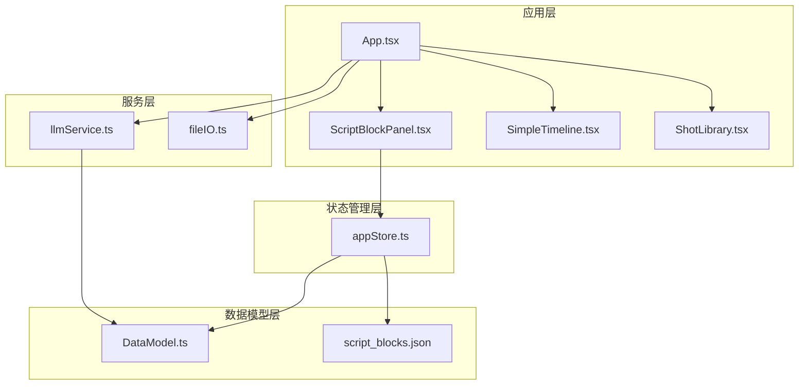
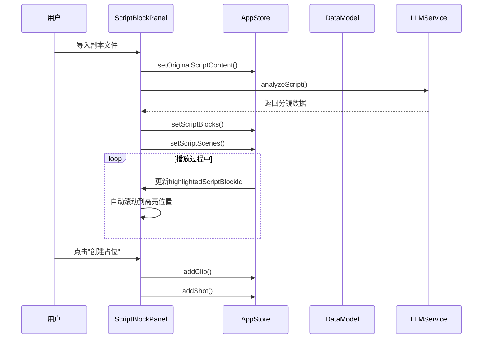
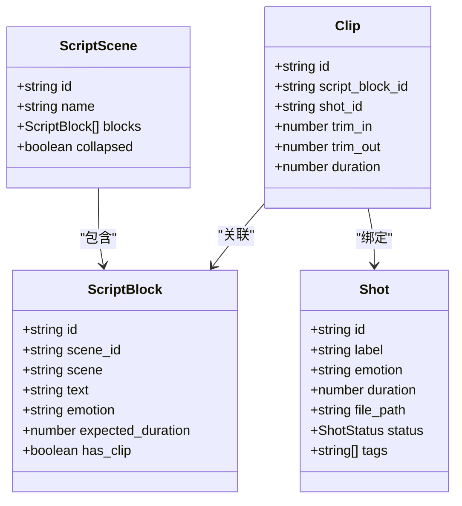
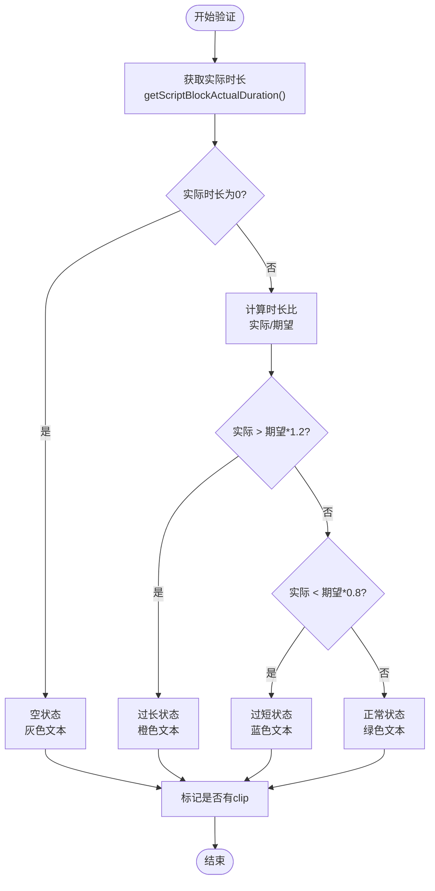
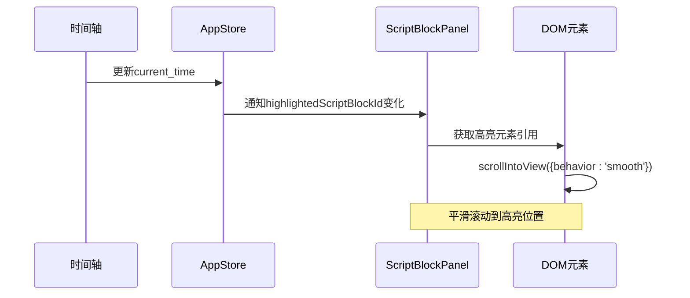
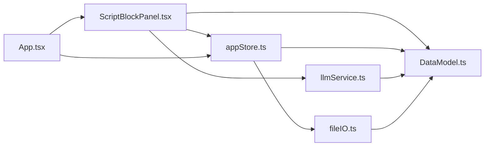

# 剧本段落面板

<cite>
**本文档引用的文件**
- [ScriptBlockPanel.tsx](file://src/components/ScriptBlockPanel.tsx)
- [DataModel.ts](file://src/types/DataModel.ts)
- [appStore.ts](file://src/store/appStore.ts)
- [llmService.ts](file://src/services/llmService.ts)
- [fileIO.ts](file://src/utils/fileIO.ts)
- [App.tsx](file://src/App.tsx)
- [script_blocks.json](file://public/data/script_blocks.json)
</cite>

## 目录
1. [简介](#简介)
2. [项目结构](#项目结构)
3. [核心组件](#核心组件)
4. [架构概览](#架构概览)
5. [详细组件分析](#详细组件分析)
6. [依赖关系分析](#依赖关系分析)
7. [性能考量](#性能考量)
8. [故障排除指南](#故障排除指南)
9. [结论](#结论)

## 简介
剧本段落面板是CGCUT项目中的核心UI组件，负责展示和管理电影剧本的分镜段落。该面板提供了完整的剧本可视化、时长验证、颜色编码系统以及播放时的自动高亮功能。通过智能的时长比较算法，面板能够直观地显示每个段落的期望时长与实际时长差异，帮助导演和制作团队进行精确的时间控制。

## 项目结构
CGCUT采用模块化架构设计，剧本段落面板位于组件层，通过状态管理器与数据模型进行交互。整体架构遵循React函数式组件模式，结合Zustand状态管理库实现高效的状态同步。

**图表来源**
- [App.tsx](file://src/App.tsx#L332-L347)
- [ScriptBlockPanel.tsx](file://src/components/ScriptBlockPanel.tsx#L9-L19)
- [appStore.ts](file://src/store/appStore.ts#L60-L194)

**章节来源**
- [App.tsx](file://src/App.tsx#L332-L347)
- [ScriptBlockPanel.tsx](file://src/components/ScriptBlockPanel.tsx#L1-L285)

## 核心组件
剧本段落面板是整个应用的核心界面组件，承担着以下主要职责：
- 展示剧本分镜段落的层次化结构
- 实时显示段落时长状态和颜色编码
- 提供播放时的自动高亮功能
- 支持场景折叠/展开的交互体验
- 实现占位clip的创建和管理

**章节来源**
- [ScriptBlockPanel.tsx](file://src/components/ScriptBlockPanel.tsx#L9-L285)

## 架构概览
剧本段落面板采用React Hooks + Zustand状态管理的现代前端架构。组件通过useAppStore Hook访问全局状态，实现了高效的响应式更新。

**图表来源**
- [ScriptBlockPanel.tsx](file://src/components/ScriptBlockPanel.tsx#L72-L106)
- [appStore.ts](file://src/store/appStore.ts#L132-L135)
- [llmService.ts](file://src/services/llmService.ts#L72-L101)

**章节来源**
- [ScriptBlockPanel.tsx](file://src/components/ScriptBlockPanel.tsx#L38-L49)
- [appStore.ts](file://src/store/appStore.ts#L119-L129)

## 详细组件分析

### ScriptBlock数据模型
ScriptBlock是剧本段落的核心数据结构，定义了完整的段落信息和状态管理。

**图表来源**
- [DataModel.ts](file://src/types/DataModel.ts#L101-L109)
- [DataModel.ts](file://src/types/DataModel.ts#L90-L95)
- [DataModel.ts](file://src/types/DataModel.ts#L141-L148)
- [DataModel.ts](file://src/types/DataModel.ts#L120-L135)

ScriptBlock模型包含以下关键属性：
- **id**: 段落唯一标识符
- **scene_id**: 所属场景的ID
- **scene**: 场景名称标识
- **text**: 段落文本内容
- **emotion**: 情绪标签（紧张、焦虑、恐惧、释然等）
- **expected_duration**: 导演期望时长（秒）
- **has_clip**: 是否已有对应的clip

**章节来源**
- [DataModel.ts](file://src/types/DataModel.ts#L101-L109)
- [script_blocks.json](file://public/data/script_blocks.json#L2-L37)

### 时长验证机制
剧本段落面板实现了智能的时长验证系统，通过比较期望时长与实际时长来提供视觉反馈。

**图表来源**
- [ScriptBlockPanel.tsx](file://src/components/ScriptBlockPanel.tsx#L53-L61)
- [DataModel.ts](file://src/types/DataModel.ts#L198-L205)

时长验证算法采用以下阈值判断逻辑：
- **空状态**: 当实际时长为0时，显示灰色文本，表示尚未分配素材
- **过短**: 实际时长小于期望时长的80%时，显示蓝色文本
- **过长**: 实际时长大于期望时长的120%时，显示橙色文本
- **正常**: 在期望时长的80%-120%范围内，显示绿色文本

**章节来源**
- [ScriptBlockPanel.tsx](file://src/components/ScriptBlockPanel.tsx#L53-L61)

### 颜色编码系统
面板使用直观的颜色编码系统来传达时长状态信息：

| 颜色 | 状态 | 含义 | 阈值 |
|------|------|------|------|
| 绿色 | 正常 | 符合预期时长 | 期望×0.8 ≤ 实际 ≤ 期望×1.2 |
| 蓝色 | 过短 | 实际时长不足 | 实际 < 期望×0.8 |
| 橙色 | 过长 | 实际时长超出 | 实际 > 期望×1.2 |
| 灰色 | 空状态 | 无素材分配 | 实际时长 = 0 |

**章节来源**
- [ScriptBlockPanel.tsx](file://src/components/ScriptBlockPanel.tsx#L57-L60)

### 播放时自动高亮功能
播放时的自动高亮功能通过以下机制实现：

**图表来源**
- [ScriptBlockPanel.tsx](file://src/components/ScriptBlockPanel.tsx#L31-L36)
- [ScriptBlockPanel.tsx](file://src/components/ScriptBlockPanel.tsx#L39-L49)

**章节来源**
- [ScriptBlockPanel.tsx](file://src/components/ScriptBlockPanel.tsx#L31-L36)
- [ScriptBlockPanel.tsx](file://src/components/ScriptBlockPanel.tsx#L39-L51)

### 用户交互流程
剧本段落面板支持多种用户交互模式：

#### 场景折叠/展开
用户可以通过点击场景标题来折叠或展开场景内容，支持层级化的场景组织。

#### 段落高亮
在播放过程中，当前播放的段落会自动高亮显示，并平滑滚动到可视区域内。

#### 占位clip创建
当段落没有对应的clip时，用户可以看到"创建占位"按钮，点击后会自动生成相应的占位clip。

**章节来源**
- [ScriptBlockPanel.tsx](file://src/components/ScriptBlockPanel.tsx#L64-L69)
- [ScriptBlockPanel.tsx](file://src/components/ScriptBlockPanel.tsx#L144-L153)

### 视觉反馈机制
面板提供了多层次的视觉反馈：

1. **颜色编码**: 基于时长状态的颜色指示
2. **图标状态**: ✓ 表示已完成，○ 表示待完成
3. **高亮效果**: 播放时的黄色高亮背景
4. **折叠指示**: ▼/▶ 符号显示展开状态

**章节来源**
- [ScriptBlockPanel.tsx](file://src/components/ScriptBlockPanel.tsx#L174-L178)
- [ScriptBlockPanel.tsx](file://src/components/ScriptBlockPanel.tsx#L240-L251)

## 依赖关系分析

**图表来源**
- [ScriptBlockPanel.tsx](file://src/components/ScriptBlockPanel.tsx#L1-L3)
- [appStore.ts](file://src/store/appStore.ts#L1-L2)
- [llmService.ts](file://src/services/llmService.ts#L1)

**章节来源**
- [ScriptBlockPanel.tsx](file://src/components/ScriptBlockPanel.tsx#L1-L3)
- [appStore.ts](file://src/store/appStore.ts#L1-L2)

## 性能考量
剧本段落面板在设计时充分考虑了性能优化：

1. **状态局部化**: 使用useEffect监听特定状态变化，避免不必要的重渲染
2. **计算缓存**: 通过useAppStore.getState()直接访问计算函数，减少函数重新创建
3. **条件渲染**: 仅在需要时渲染场景内容，支持懒加载
4. **内存管理**: 合理使用useRef管理DOM引用，避免内存泄漏

**章节来源**
- [ScriptBlockPanel.tsx](file://src/components/ScriptBlockPanel.tsx#L25-L29)
- [ScriptBlockPanel.tsx](file://src/components/ScriptBlockPanel.tsx#L132-L135)

## 故障排除指南

### 常见问题及解决方案

#### 剧本文件导入失败
- **症状**: 导入剧本后面板显示空白
- **原因**: 文件格式不支持或LLM分析失败
- **解决**: 确认文件格式为.txt或.json，检查网络连接

#### 时长显示异常
- **症状**: 段落时长始终显示为灰色或异常数值
- **原因**: 时长计算函数未正确执行
- **解决**: 检查clips数组是否正确更新，确认getScriptBlockActualDuration函数调用

#### 播放高亮不生效
- **症状**: 播放时段落不自动高亮
- **原因**: highlightedScriptBlockId状态未正确更新
- **解决**: 检查playbackState的current_time更新逻辑

**章节来源**
- [ScriptBlockPanel.tsx](file://src/components/ScriptBlockPanel.tsx#L53-L61)
- [appStore.ts](file://src/store/appStore.ts#L132-L135)

## 结论
剧本段落面板作为CGCUT项目的核心组件，成功实现了电影剧本分镜的专业化管理功能。通过智能的时长验证机制、直观的颜色编码系统和流畅的播放高亮体验，为导演和制作团队提供了高效的工作流程支持。面板的设计充分体现了现代前端开发的最佳实践，包括清晰的组件分离、高效的性能优化和完善的错误处理机制。

未来可以在现有基础上进一步增强功能，如添加批量编辑、导出统计报告、集成更多AI辅助功能等，以满足更复杂的创作需求。