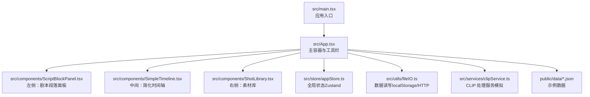
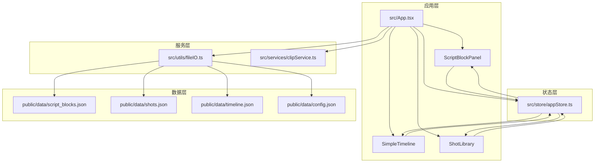
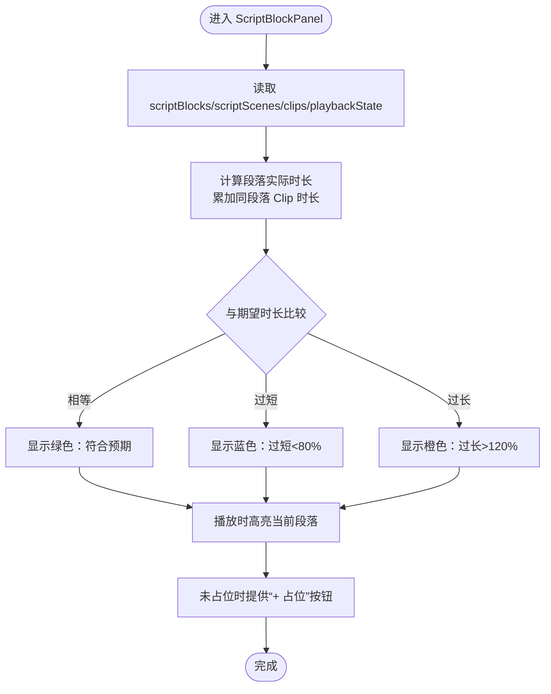
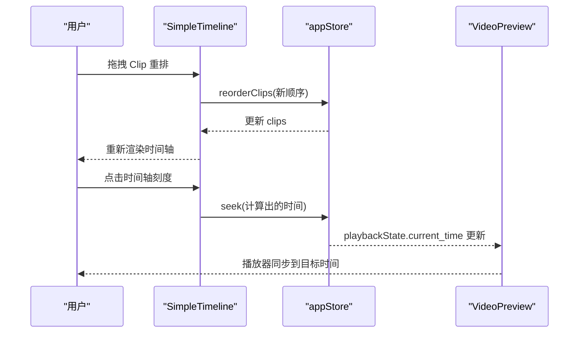
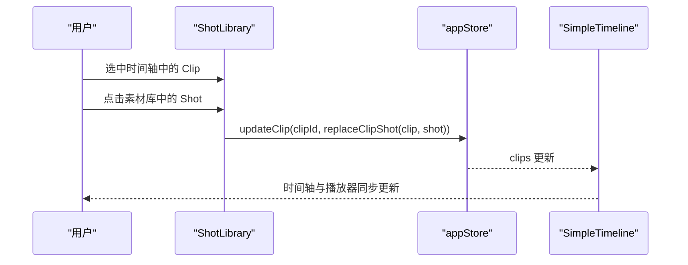
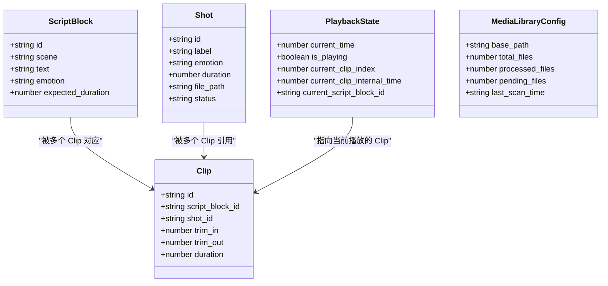
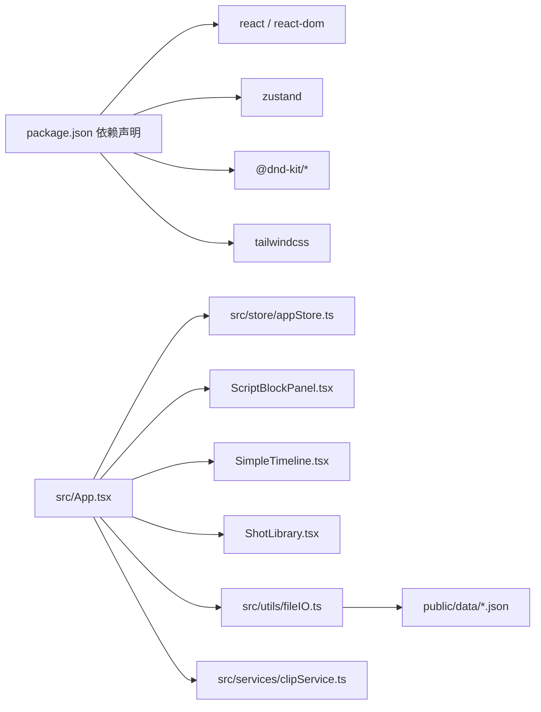

# 核心功能特性

<cite>
**本文档引用的文件**
- [README.md](file://README.md)
- [USAGE_GUIDE.md](file://USAGE_GUIDE.md)
- [src/App.tsx](file://src/App.tsx)
- [src/main.tsx](file://src/main.tsx)
- [src/store/appStore.ts](file://src/store/appStore.ts)
- [src/components/ScriptBlockPanel.tsx](file://src/components/ScriptBlockPanel.tsx)
- [src/components/SimpleTimeline.tsx](file://src/components/SimpleTimeline.tsx)
- [src/components/ShotLibrary.tsx](file://src/components/ShotLibrary.tsx)
- [src/types/DataModel.ts](file://src/types/DataModel.ts)
- [src/services/clipService.ts](file://src/services/clipService.ts)
- [src/utils/fileIO.ts](file://src/utils/fileIO.ts)
- [public/data/script_blocks.json](file://public/data/script_blocks.json)
- [public/data/shots.json](file://public/data/shots.json)
- [public/data/timeline.json](file://public/data/timeline.json)
- [package.json](file://package.json)
</cite>

## 目录
1. [简介](#简介)
2. [项目结构](#项目结构)
3. [核心组件](#核心组件)
4. [架构总览](#架构总览)
5. [详细组件分析](#详细组件分析)
6. [依赖分析](#依赖分析)
7. [性能考量](#性能考量)
8. [故障排查指南](#故障排查指南)
9. [结论](#结论)
10. [附录](#附录)

## 简介
CGCUT 是一款面向导演与分镜创作者的“验证器”工具，目标是在约 30 分钟内帮助用户从剧本快速构建可播放时间轴，并验证“剧本段落 × 镜头组合 × 实际节奏”的一致性。其核心围绕三层面板设计：
- 左侧：剧本段落面板（ScriptBlock Panel），用于显示与校验每段的期望时长与实际时长，支持播放时自动高亮当前段落。
- 中间：简化时间轴（Simple Timeline），单轨布局，支持拖拽排序、删除、基础裁剪（in/out 边缘手柄），并内置视频预览播放器。
- 右侧：素材库（Shot Library），按情绪筛选与管理素材，支持替换时间轴中的 Clip 并即时更新时长。

该工具强调“快验证、可迭代”，严格限制功能边界，避免进入复杂 NLE 工作流，确保用户聚焦于节奏与情绪的验证。

## 项目结构
- 前端采用 React 18 + TypeScript + Vite，状态管理使用 Zustand，拖拽使用 @dnd-kit，UI 使用 Tailwind CSS。
- 数据来源为 public/data 下的 JSON 文件（script_blocks.json、shots.json、timeline.json、config.json），并通过 fileIO 工具进行加载与保存（MVP 阶段使用 localStorage 持久化）。
- 应用入口位于 src/main.tsx，主容器 App.tsx 负责加载数据、导入剧本、扫描素材库、导出项目与状态检查；三个面板组件分别实现具体功能。

图表来源
- [src/main.tsx](file://src/main.tsx#L1-L11)
- [src/App.tsx](file://src/App.tsx#L1-L120)
- [src/components/ScriptBlockPanel.tsx](file://src/components/ScriptBlockPanel.tsx#L1-L60)
- [src/components/SimpleTimeline.tsx](file://src/components/SimpleTimeline.tsx#L1-L60)
- [src/components/ShotLibrary.tsx](file://src/components/ShotLibrary.tsx#L1-L60)
- [src/store/appStore.ts](file://src/store/appStore.ts#L1-L60)
- [src/utils/fileIO.ts](file://src/utils/fileIO.ts#L1-L40)
- [src/services/clipService.ts](file://src/services/clipService.ts#L1-L40)
- [public/data/script_blocks.json](file://public/data/script_blocks.json#L1-L20)

章节来源
- [package.json](file://package.json#L1-L36)
- [src/main.tsx](file://src/main.tsx#L1-L11)
- [src/App.tsx](file://src/App.tsx#L1-L120)

## 核心组件
- 剧本段落面板（左侧）
  - 展示场景与段落，实时显示每段实际时长 vs 期望时长，差异以颜色提示（绿色/蓝色/橙色）。
  - 播放时根据播放时间自动高亮当前段落。
  - 支持为段落一键创建占位 Clip，并按段落情绪匹配或创建占位素材。
- 简化时间轴（中间）
  - 单轨布局，时间刻度为秒级，支持拖拽重排、删除 Clip、点击时间轴跳转、基础裁剪（in/out 边界手柄）。
  - 内置视频预览播放器，播放时同步显示当前镜头信息与播放控制。
- 素材库（右侧）
  - 按情绪与状态筛选素材，支持编辑标签、修改情绪、删除素材。
  - 替换流程：选中时间轴中的 Clip → 点击素材库中的 Shot → 自动替换并更新时长。

章节来源
- [README.md](file://README.md#L30-L90)
- [src/components/ScriptBlockPanel.tsx](file://src/components/ScriptBlockPanel.tsx#L50-L120)
- [src/components/SimpleTimeline.tsx](file://src/components/SimpleTimeline.tsx#L1-L120)
- [src/components/ShotLibrary.tsx](file://src/components/ShotLibrary.tsx#L1-L120)

## 架构总览
CGCUT 采用“单页应用 + 全局状态 + 组件化面板”的轻量架构。数据从 public/data 加载，经由 Zustand store 统一管理，三个面板通过 store 读写数据并互相影响。工具栏提供导入剧本、扫描素材库、导出项目、保存项目与一键检查等功能。

图表来源
- [src/App.tsx](file://src/App.tsx#L1-L120)
- [src/store/appStore.ts](file://src/store/appStore.ts#L1-L120)
- [src/utils/fileIO.ts](file://src/utils/fileIO.ts#L50-L95)
- [src/services/clipService.ts](file://src/services/clipService.ts#L30-L120)
- [public/data/script_blocks.json](file://public/data/script_blocks.json#L1-L20)
- [public/data/shots.json](file://public/data/shots.json#L1-L20)
- [public/data/timeline.json](file://public/data/timeline.json#L1-L20)

## 详细组件分析

### 剧本段落面板（左侧）
- 时长验证机制
  - 依据时间轴中属于该段落的所有 Clip 时长累加，计算“实际时长”，并与“期望时长”比较，给出颜色提示与差值显示。
  - 当播放时，根据当前播放时间定位当前段落并高亮。
- 占位与情绪匹配
  - 若某段尚未放置 Clip，可一键创建占位 Clip；若无匹配情绪素材，会创建占位素材并绑定。
- 场景分组与 Tab
  - 支持场景分组折叠/展开；提供“原文/LLM拆解”双 Tab，便于对照原始文本与解析结果。

图表来源
- [src/components/ScriptBlockPanel.tsx](file://src/components/ScriptBlockPanel.tsx#L38-L120)
- [src/types/DataModel.ts](file://src/types/DataModel.ts#L195-L213)

章节来源
- [src/components/ScriptBlockPanel.tsx](file://src/components/ScriptBlockPanel.tsx#L1-L120)
- [src/types/DataModel.ts](file://src/types/DataModel.ts#L195-L213)

### 简化时间轴（中间）
- 单轨编辑能力
  - 拖拽排序：使用 @dnd-kit 实现水平方向排序，拖拽结束后更新全局 Clips 顺序。
  - 删除 Clip：点击 Clip 右上角“×”删除。
  - 裁剪（计划中）：提供 in/out 边界手柄，点击拖拽以调整 trim_in/trim_out（当前实现预留接口，交互逻辑待完善）。
  - 点击时间轴刻度跳转：点击标尺位置计算对应时间并 seek。
- 播放与预览
  - 内置视频预览播放器：根据当前播放时间定位当前 Clip 与内部时间，同步 video 元素播放与进度条。
  - 播放控制：播放/暂停、停止、进度条拖动、时间显示。
- 时间刻度标尺
  - 秒级主刻度，5 秒标签；0.5 秒次刻度，提升微调体验。

图表来源
- [src/components/SimpleTimeline.tsx](file://src/components/SimpleTimeline.tsx#L331-L414)
- [src/store/appStore.ts](file://src/store/appStore.ts#L90-L140)

章节来源
- [src/components/SimpleTimeline.tsx](file://src/components/SimpleTimeline.tsx#L1-L200)
- [src/store/appStore.ts](file://src/store/appStore.ts#L90-L140)

### 素材库（右侧）
- 情绪筛选与状态筛选
  - 情绪过滤：支持“全部/焦虑/紧张/平静/恐惧/释然”等。
  - 状态过滤：全部/已处理/待处理/处理中。
- 替换流程
  - 选中时间轴中的 Clip → 点击素材库中的 Shot → 调用 replaceClipShot 更新 trim_in/trim_out/duration，并写回 store。
- 素材管理
  - 编辑标签、修改情绪、删除素材。
  - 素材库路径配置：设置 base_path 后可触发扫描与处理流程（CLIP 处理服务）。

图表来源
- [src/components/ShotLibrary.tsx](file://src/components/ShotLibrary.tsx#L40-L70)
- [src/types/DataModel.ts](file://src/types/DataModel.ts#L276-L291)
- [src/store/appStore.ts](file://src/store/appStore.ts#L90-L120)

章节来源
- [src/components/ShotLibrary.tsx](file://src/components/ShotLibrary.tsx#L1-L120)
- [src/types/DataModel.ts](file://src/types/DataModel.ts#L276-L291)

### 数据模型与状态
- 数据模型
  - ScriptBlock：剧本段落，含场景、文本、情绪、期望时长等。
  - Shot：素材镜头，含标签、情绪、时长、文件路径、状态、CLIP 元数据等。
  - Clip：时间轴镜头实例，含 script_block_id、shot_id、trim_in/trim_out、duration。
  - PlaybackState：播放状态（当前时间、是否播放、当前 Clip 索引与内部时间、对应 ScriptBlock）。
  - MediaLibraryConfig：素材库配置（根路径、统计信息等）。
- 计算函数
  - calculateScriptBlockDuration：按段落聚合 Clip 时长。
  - calculateTotalDuration：计算时间轴总时长。
  - findClipAtTime：根据播放时间定位当前 Clip 与内部时间。
  - createClip / updateClipTrim / replaceClipShot：Clip 生命周期与裁剪/替换逻辑。

图表来源
- [src/types/DataModel.ts](file://src/types/DataModel.ts#L86-L194)

章节来源
- [src/types/DataModel.ts](file://src/types/DataModel.ts#L86-L194)

## 依赖分析
- 外部依赖
  - React 18、Zustand（状态管理）、@dnd-kit（拖拽）、Tailwind CSS（样式）、TypeScript（类型安全）。
- 内部模块耦合
  - App.tsx 作为中枢，协调数据加载、导入/导出、扫描素材库与状态检查。
  - 三个面板通过 store 读写数据，彼此通过数据联动产生交互反馈。
  - fileIO.ts 与 public/data/* 解耦数据源；clipService.ts 提供 CLIP 处理服务（MVP 阶段为模拟）。

图表来源
- [package.json](file://package.json#L14-L36)
- [src/App.tsx](file://src/App.tsx#L1-L120)
- [src/store/appStore.ts](file://src/store/appStore.ts#L1-L60)
- [src/utils/fileIO.ts](file://src/utils/fileIO.ts#L50-L95)
- [src/services/clipService.ts](file://src/services/clipService.ts#L30-L120)

章节来源
- [package.json](file://package.json#L14-L36)

## 性能考量
- 时间轴渲染
  - 使用固定像素/秒的比例（PIXELS_PER_SECOND）控制缩放，保证大时间轴的可滚动性与刻度密度可控。
  - 播放循环使用 requestAnimationFrame 控制，帧率稳定，避免高频重绘。
- 拖拽与排序
  - @dnd-kit 的 SortableContext 与 horizontalListSortingStrategy 提升拖拽性能与体验。
- 数据读写
  - 初始数据一次性加载，后续通过 store 响应式更新，减少不必要的重渲染。
- CLIP 处理
  - MVP 阶段为模拟处理，生产环境建议使用批处理与后台任务队列，避免阻塞 UI。

## 故障排查指南
- 导入剧本失败
  - 检查文件格式（仅支持 .txt/.json；DOC/DOCX 需转换为 TXT/JSON）。
  - 查看 LLM 分析进度与错误提示，确认网络与服务可用。
- 素材库扫描失败
  - 确认已设置素材库路径；检查路径有效性与可访问性。
  - 查看 CLIP 处理进度与错误信息，必要时重试或更换目录。
- 播放器不工作
  - 确认时间轴中至少存在一个 Clip；若素材未就绪，播放器会显示占位提示。
- 保存/导出异常
  - 保存使用 localStorage，若浏览器清理数据会导致丢失；导出为 JSON 文件，便于备份。

章节来源
- [src/App.tsx](file://src/App.tsx#L80-L170)
- [src/App.tsx](file://src/App.tsx#L170-L260)
- [src/App.tsx](file://src/App.tsx#L254-L274)
- [USAGE_GUIDE.md](file://USAGE_GUIDE.md#L113-L126)

## 结论
CGCUT 通过三层面板实现了“剧本节奏验证”的闭环：左侧验证时长与情绪匹配，中间进行单轨编辑与播放预览，右侧提供素材筛选与替换。借助全局状态与数据模型，各面板协同工作，形成清晰的数据流与交互链路。该设计在 MVP 阶段保持极简与高效，适合快速迭代与节奏校验。

## 附录
- 使用流程要点
  - 准备素材：导入剧本 → 导入视频素材 → 扫描素材库（可选）。
  - 编辑时间轴：从左侧选择段落 → 从右侧选择合适镜头 → 拖放至时间轴 → 调整顺序与裁剪。
  - 预览与调整：播放预览 → 发现节奏问题 → 替换镜头 → 保存/导出项目。
- 数据文件说明
  - script_blocks.json：剧本段落数据。
  - shots.json：素材镜头数据。
  - timeline.json：时间轴状态（Clip 列表）。
  - config.json：媒体服务器与预览质量等配置。

章节来源
- [README.md](file://README.md#L58-L90)
- [USAGE_GUIDE.md](file://USAGE_GUIDE.md#L64-L112)
- [public/data/script_blocks.json](file://public/data/script_blocks.json#L1-L38)
- [public/data/shots.json](file://public/data/shots.json#L1-L83)
- [public/data/timeline.json](file://public/data/timeline.json#L1-L59)