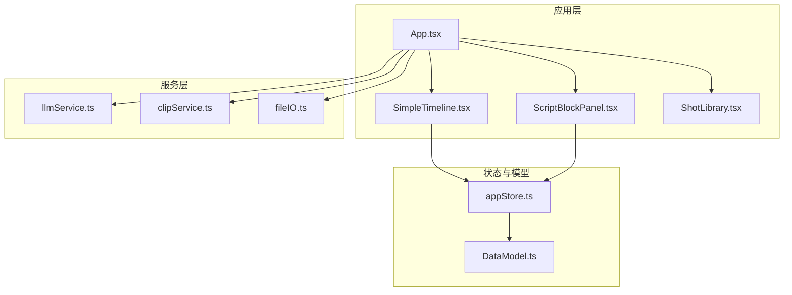
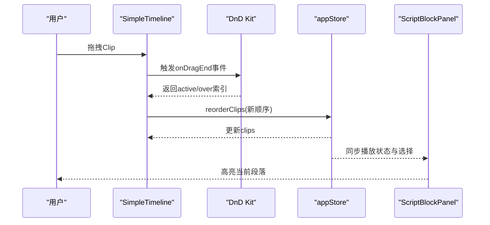
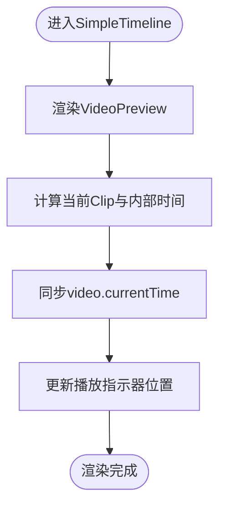
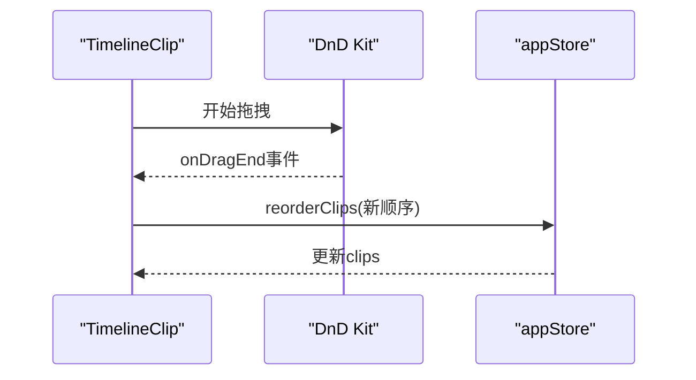
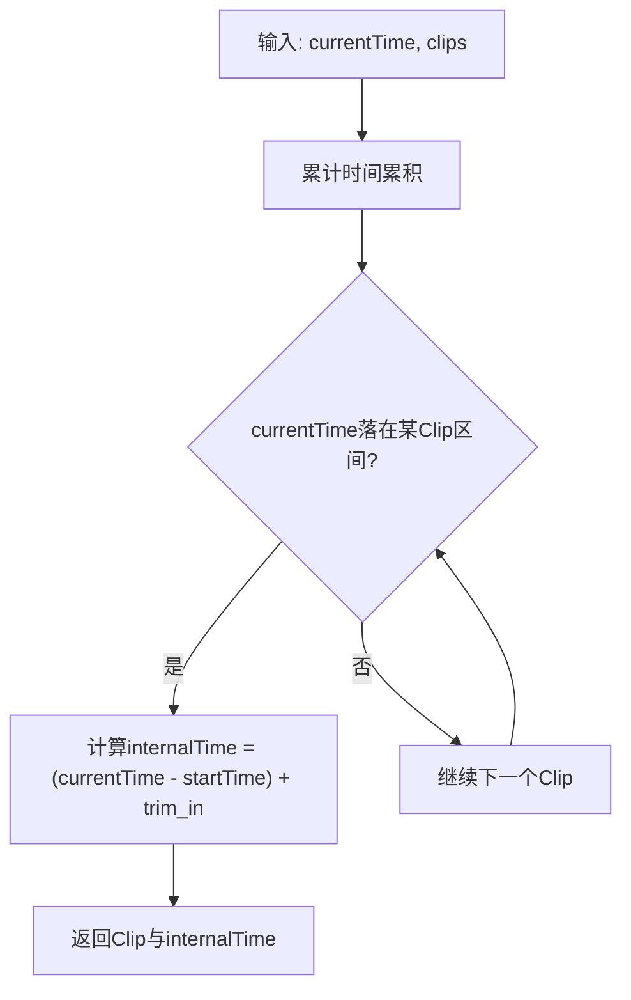
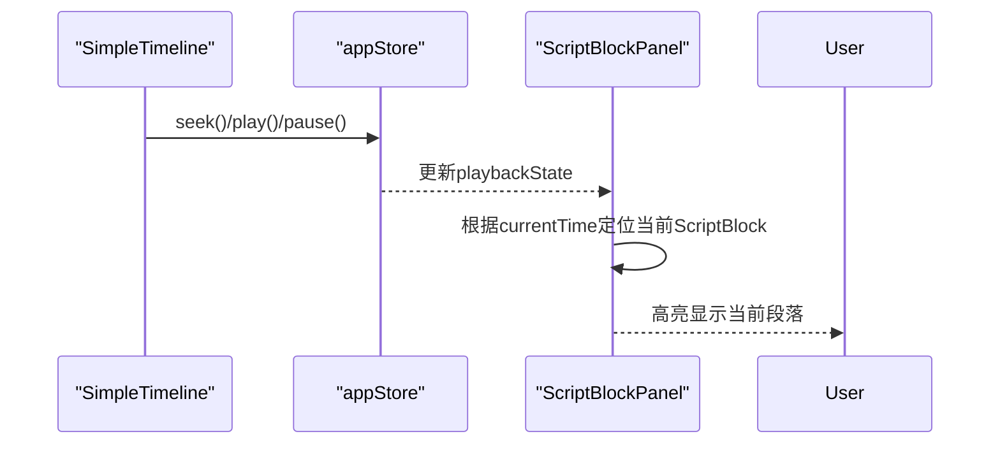
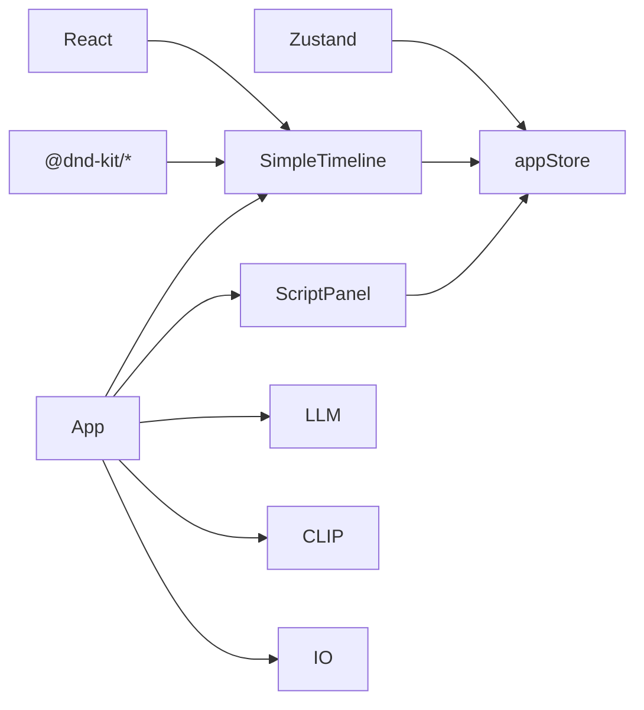

# 简化时间轴

<cite>
**本文档引用的文件**
- [SimpleTimeline.tsx](file://src/components/SimpleTimeline.tsx)
- [DataModel.ts](file://src/types/DataModel.ts)
- [appStore.ts](file://src/store/appStore.ts)
- [ScriptBlockPanel.tsx](file://src/components/ScriptBlockPanel.tsx)
- [clipService.ts](file://src/services/clipService.ts)
- [llmService.ts](file://src/services/llmService.ts)
- [fileIO.ts](file://src/utils/fileIO.ts)
- [App.tsx](file://src/App.tsx)
- [package.json](file://package.json)
- [timeline.json](file://public/data/timeline.json)
- [script_blocks.json](file://public/data/script_blocks.json)
</cite>

## 目录
1. [简介](#简介)
2. [项目结构](#项目结构)
3. [核心组件](#核心组件)
4. [架构概览](#架构概览)
5. [详细组件分析](#详细组件分析)
6. [依赖分析](#依赖分析)
7. [性能考量](#性能考量)
8. [故障排查指南](#故障排查指南)
9. [结论](#结论)
10. [附录](#附录)

## 简介
本文件面向CGCUT的“简化时间轴”组件，提供从设计理念到实现细节的完整技术文档。重点涵盖：
- 单轨布局的时间轴架构与秒级时间刻度、时间标签系统
- 基于DnD Kit的拖拽排序（Drag-and-Drop）集成
- 删除与裁剪操作的实现机制
- Clip数据模型与时间轴状态管理（in/out点、时间计算、边界检测）
- 与剧本段落面板的数据同步与一致性校验
- 性能优化策略、用户体验设计原则与常见问题解决方案
- 详细的API参考与使用示例

## 项目结构
简化时间轴位于src/components/SimpleTimeline.tsx，配合Zustand全局状态、数据模型与服务层共同工作。整体采用“单轨布局 + 水平线性排列”的时间轴设计，像素与秒的映射通过常量进行统一换算，确保UI与逻辑一致。

图表来源
- [App.tsx](file://src/App.tsx#L1-L497)
- [SimpleTimeline.tsx](file://src/components/SimpleTimeline.tsx#L1-L414)
- [ScriptBlockPanel.tsx](file://src/components/ScriptBlockPanel.tsx#L1-L285)
- [appStore.ts](file://src/store/appStore.ts#L1-L195)
- [DataModel.ts](file://src/types/DataModel.ts#L1-L291)
- [llmService.ts](file://src/services/llmService.ts#L1-L476)
- [clipService.ts](file://src/services/clipService.ts#L1-L394)
- [fileIO.ts](file://src/utils/fileIO.ts#L1-L95)

章节来源
- [App.tsx](file://src/App.tsx#L1-L497)
- [package.json](file://package.json#L1-L36)

## 核心组件
- 简化时间轴容器：负责渲染视频预览、时间刻度、播放控制与Clip列表，并承载DnD上下文。
- 时间刻度标尺：按秒生成主刻度与半秒次刻度，提供视觉时间参考。
- 播放指示器：随播放状态实时定位当前时间。
- Clip组件：展示镜头信息、占位符标记、删除按钮与裁剪手柄（预留）。
- 全局状态：Zustand存储管理剧本、镜头、时间轴、播放状态与选择状态。
- 数据模型：定义Clip、Shot、ScriptBlock、PlaybackState等核心类型与计算函数。

章节来源
- [SimpleTimeline.tsx](file://src/components/SimpleTimeline.tsx#L1-L414)
- [DataModel.ts](file://src/types/DataModel.ts#L137-L291)
- [appStore.ts](file://src/store/appStore.ts#L1-L195)

## 架构概览
简化时间轴采用“单轨布局 + 水平线性”的时间轴架构，具备以下特性：
- 单轨布局：所有Clip水平排列在同一轨道，便于直观查看整体节奏与顺序。
- 秒级时间刻度：每秒对应固定像素数，保证UI与时间计算一致。
- DnD排序：基于@drag-and-drop的sortable与context，实现拖拽重排。
- 删除与裁剪：删除按钮触发状态更新；裁剪手柄预留交互逻辑。
- 数据同步：时间轴与剧本段落面板通过全局状态共享，保持时长与状态一致。

图表来源
- [SimpleTimeline.tsx](file://src/components/SimpleTimeline.tsx#L343-L356)
- [appStore.ts](file://src/store/appStore.ts#L107-L107)
- [ScriptBlockPanel.tsx](file://src/components/ScriptBlockPanel.tsx#L38-L49)

## 详细组件分析

### 时间轴容器与播放控制
- 视频预览区域：根据当前播放时间定位到对应Clip，同步video元素的currentTime，实现与时间轴的联动播放。
- 播放控制栏：包含播放/暂停、停止、时间显示与进度条点击跳转。
- 时间刻度标尺：按秒生成主刻度与半秒次刻度，便于精确定位。
- 播放指示器：红色竖线指示当前播放位置，随播放状态实时更新。

图表来源
- [SimpleTimeline.tsx](file://src/components/SimpleTimeline.tsx#L47-L109)
- [SimpleTimeline.tsx](file://src/components/SimpleTimeline.tsx#L208-L241)
- [SimpleTimeline.tsx](file://src/components/SimpleTimeline.tsx#L23-L32)

章节来源
- [SimpleTimeline.tsx](file://src/components/SimpleTimeline.tsx#L35-L205)

### DnD排序与拖拽交互
- DnD上下文：使用DnD Kit的DndContext与SortableContext，策略为horizontalListSortingStrategy。
- 拖拽结束回调：根据active与over的索引计算新顺序，调用reorderClips更新状态。
- 拖拽样式：通过useSortable提供的transform与transition实现流畅动画。

图表来源
- [SimpleTimeline.tsx](file://src/components/SimpleTimeline.tsx#L389-L407)
- [SimpleTimeline.tsx](file://src/components/SimpleTimeline.tsx#L343-L356)
- [appStore.ts](file://src/store/appStore.ts#L107-L107)

章节来源
- [SimpleTimeline.tsx](file://src/components/SimpleTimeline.tsx#L244-L414)
- [appStore.ts](file://src/store/appStore.ts#L107-L107)

### 删除与裁剪操作
- 删除：点击Clip右上角×按钮，触发deleteClip，从状态中移除该Clip并取消选择。
- 裁剪：预留handleTrimStart逻辑，当前为TODO，未来可实现左右手柄拖拽调整trim_in/trim_out。

章节来源
- [SimpleTimeline.tsx](file://src/components/SimpleTimeline.tsx#L318-L326)
- [SimpleTimeline.tsx](file://src/components/SimpleTimeline.tsx#L261-L265)

### Clip数据模型与时间计算
- Clip字段：包含脚本段落ID、镜头ID、裁剪起止点与实际时长。
- 时间计算函数：
  - calculateTotalDuration：累加所有Clip的duration。
  - findClipAtTime：根据当前播放时间定位到具体Clip与其内部时间。
  - updateClipTrim：确保trim_in ≤ trim_out且最小片段长度，更新duration。
  - replaceClipShot：替换绑定镜头并重置裁剪范围。
- 边界检测：裁剪时强制最小片段长度，防止无效片段。

图表来源
- [DataModel.ts](file://src/types/DataModel.ts#L217-L237)

章节来源
- [DataModel.ts](file://src/types/DataModel.ts#L141-L291)

### 与剧本段落面板的数据同步
- ScriptBlockPanel根据播放状态与clips计算当前播放的ScriptBlock，并高亮显示。
- 时长验证：通过getScriptBlockActualDuration比较期望时长与实际时长，给出状态提示。
- 占位符创建：当段落尚未绑定Clip时，可一键创建占位Clip并自动匹配情绪相近的素材。

图表来源
- [ScriptBlockPanel.tsx](file://src/components/ScriptBlockPanel.tsx#L38-L49)
- [ScriptBlockPanel.tsx](file://src/components/ScriptBlockPanel.tsx#L53-L61)
- [appStore.ts](file://src/store/appStore.ts#L119-L129)

章节来源
- [ScriptBlockPanel.tsx](file://src/components/ScriptBlockPanel.tsx#L1-L285)
- [DataModel.ts](file://src/types/DataModel.ts#L198-L212)

### 服务与数据流
- LLM服务：将剧本内容拆解为场景与段落，生成期望时长与情绪标签。
- CLIP服务：扫描素材库，提取视频特征与元数据，更新素材库状态。
- 文件IO：加载/保存项目数据，支持localStorage与导出下载。

章节来源
- [llmService.ts](file://src/services/llmService.ts#L72-L101)
- [clipService.ts](file://src/services/clipService.ts#L36-L60)
- [fileIO.ts](file://src/utils/fileIO.ts#L54-L80)

## 依赖分析
- 前端依赖：React、Zustand、@dnd-kit系列包，用于状态管理与拖拽交互。
- 组件耦合：SimpleTimeline与ScriptBlockPanel通过全局状态共享数据，低耦合高内聚。
- 外部服务：LLM与CLIP服务通过HTTP调用，MVP阶段提供mock实现，生产环境可无缝替换。

图表来源
- [package.json](file://package.json#L14-L21)
- [SimpleTimeline.tsx](file://src/components/SimpleTimeline.tsx#L1-L7)
- [appStore.ts](file://src/store/appStore.ts#L1-L2)

章节来源
- [package.json](file://package.json#L1-L36)

## 性能考量
- 渲染优化
  - 使用useMemo/useCallback减少不必要的重渲染（建议在后续迭代中引入）。
  - 时间轴容器仅在clips或播放状态变化时更新，避免频繁重排。
- 动画与帧率
  - 播放循环使用requestAnimationFrame，帧间隔约16.67ms，确保流畅播放。
  - 视频currentTime与internalTime的差值超过阈值才更新，减少频繁seek。
- 数据结构
  - clips数组按顺序存储，查找当前Clip采用线性遍历，适合中小规模数据；大规模数据可考虑二分查找或索引表。
- 状态管理
  - Zustand提供轻量级状态管理，避免Provider层级过深带来的性能损耗。

[本节为通用性能指导，不直接分析特定文件]

## 故障排查指南
- 播放异常
  - 检查视频文件路径是否有效，若为空则显示占位信息而非播放。
  - 确认seek调用范围在[0, totalDuration]之间。
- 拖拽无效
  - 确认DnD Kit的items与ids正确传递，SortableContext的strategy为horizontalListSortingStrategy。
- 裁剪功能未生效
  - 当前裁剪逻辑为预留，需实现handleTrimStart的具体逻辑与updateClipTrim调用。
- 时长不一致
  - 检查calculateTotalDuration与findClipAtTime的实现，确保trim_in/trim_out边界合法。

章节来源
- [SimpleTimeline.tsx](file://src/components/SimpleTimeline.tsx#L68-L92)
- [SimpleTimeline.tsx](file://src/components/SimpleTimeline.tsx#L358-L367)
- [DataModel.ts](file://src/types/DataModel.ts#L258-L274)

## 结论
简化时间轴通过单轨布局与秒级时间刻度，提供了直观、易用的时间轴编辑体验。结合DnD Kit实现的拖拽排序、全局状态管理与与剧本段落面板的紧密协作，形成了完整的创作工作流。未来可在裁剪交互、性能优化与数据规模扩展方面持续增强。

[本节为总结性内容，不直接分析特定文件]

## 附录

### API参考

- 状态与动作（Zustand）
  - setScriptBlocks(blocks: ScriptBlock[]): void
  - setShots(shots: Shot[]): void
  - setClips(clips: Clip[]): void
  - addClip(clip: Clip): void
  - updateClip(id: string, updates: Partial<Clip>): void
  - deleteClip(id: string): void
  - reorderClips(newClips: Clip[]): void
  - selectClip(id: string | null): void
  - play(): void
  - pause(): void
  - seek(time: number): void
  - getScriptBlockActualDuration(blockId: string): number
  - getShotById(shotId: string): Shot | undefined
  - checkProjectStatus(): ProjectCheckStatus

- 数据模型
  - Clip: id, script_block_id, shot_id, trim_in, trim_out, duration
  - ScriptBlock: id, scene_id, scene, text, emotion, expected_duration
  - Shot: id, label, emotion, duration, file_path, status, tags, metadata
  - PlaybackState: current_time, is_playing, current_clip_index, current_clip_internal_time, current_script_block_id

- 计算函数
  - calculateScriptBlockDuration(scriptBlockId: string, clips: Clip[]): number
  - calculateTotalDuration(clips: Clip[]): number
  - findClipAtTime(currentTime: number, clips: Clip[]): { clip, index, internalTime } | null
  - createClip(scriptBlockId: string, shot: Shot): Clip
  - updateClipTrim(clip: Clip, trimIn: number, trimOut: number): Clip
  - replaceClipShot(clip: Clip, newShot: Shot): Clip

- 文件IO
  - loadProjectData(): Promise<{ scriptBlocks, shots, clips, config }>
  - saveProjectData(clips: Clip[]): Promise<void>
  - exportProjectData(clips: Clip[], filename?: string): void

章节来源
- [appStore.ts](file://src/store/appStore.ts#L22-L58)
- [DataModel.ts](file://src/types/DataModel.ts#L141-L291)
- [fileIO.ts](file://src/utils/fileIO.ts#L54-L95)

### 使用示例

- 在时间轴中添加占位Clip
  - 通过ScriptBlockPanel为未绑定的段落点击“+ 占位”，自动创建占位Clip并匹配情绪相近素材。
- 拖拽重排
  - 在时间轴中拖拽任意Clip到目标位置，完成后自动更新顺序。
- 删除Clip
  - 点击Clip右上角×按钮，从时间轴移除该片段。
- 跳转播放
  - 点击时间轴空白区域或进度条，跳转到对应时间。

章节来源
- [ScriptBlockPanel.tsx](file://src/components/ScriptBlockPanel.tsx#L72-L106)
- [SimpleTimeline.tsx](file://src/components/SimpleTimeline.tsx#L389-L407)
- [SimpleTimeline.tsx](file://src/components/SimpleTimeline.tsx#L358-L367)