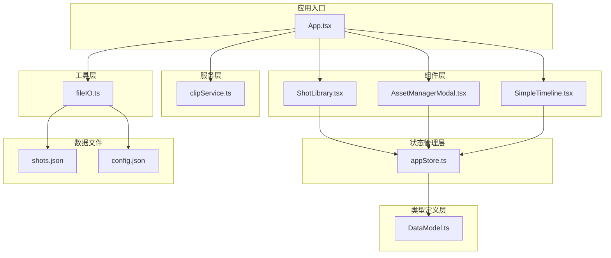
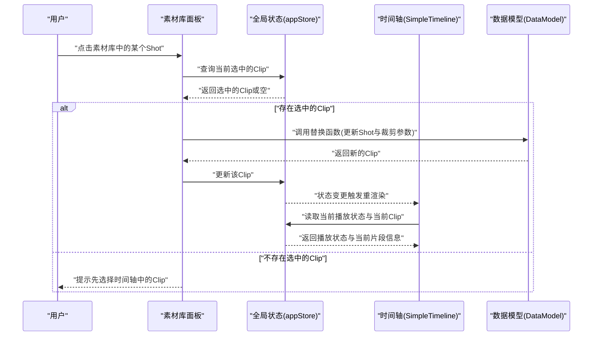
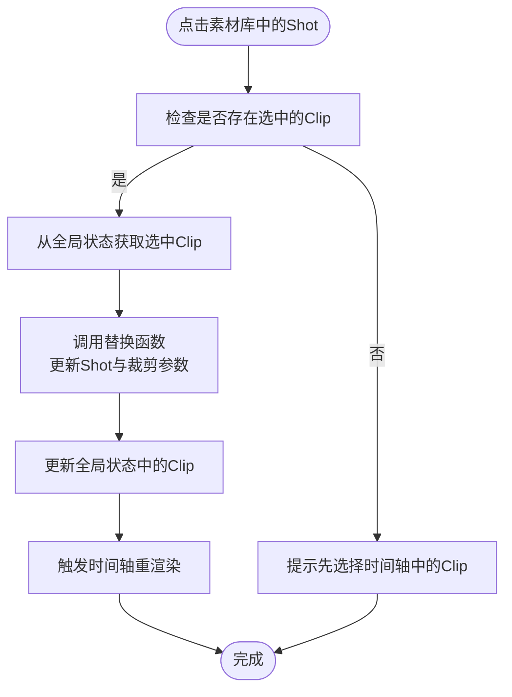
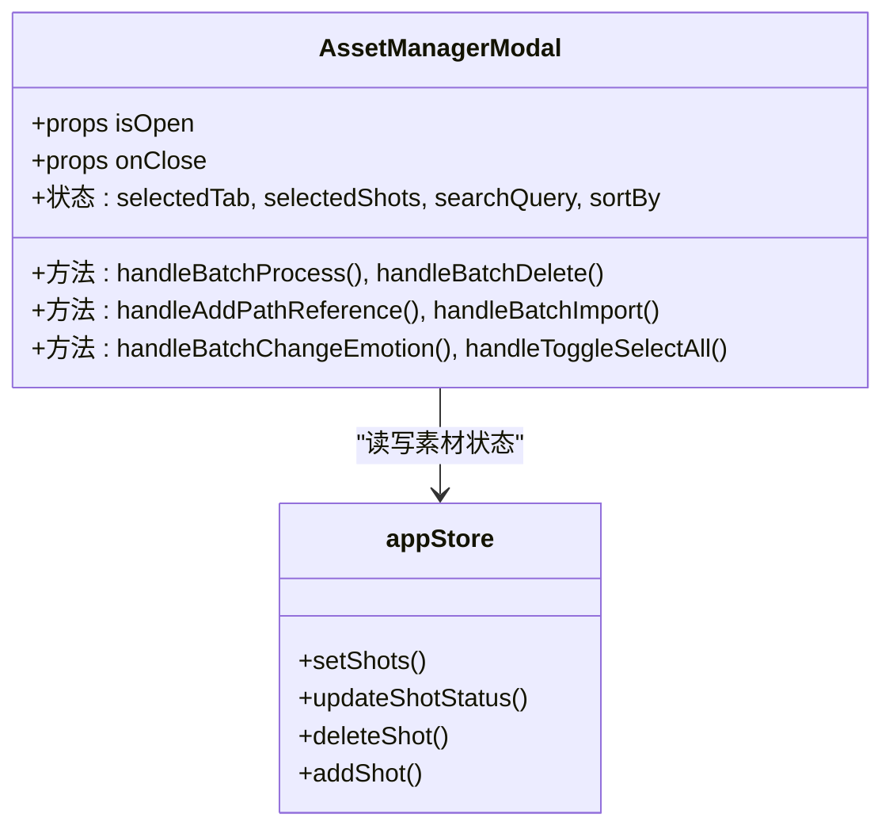
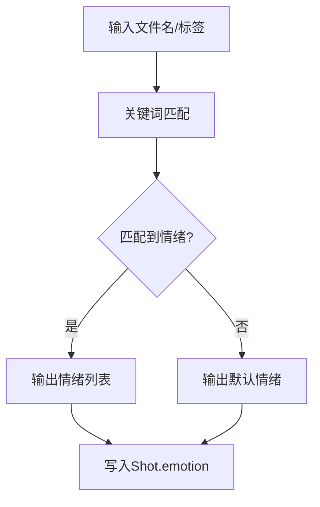
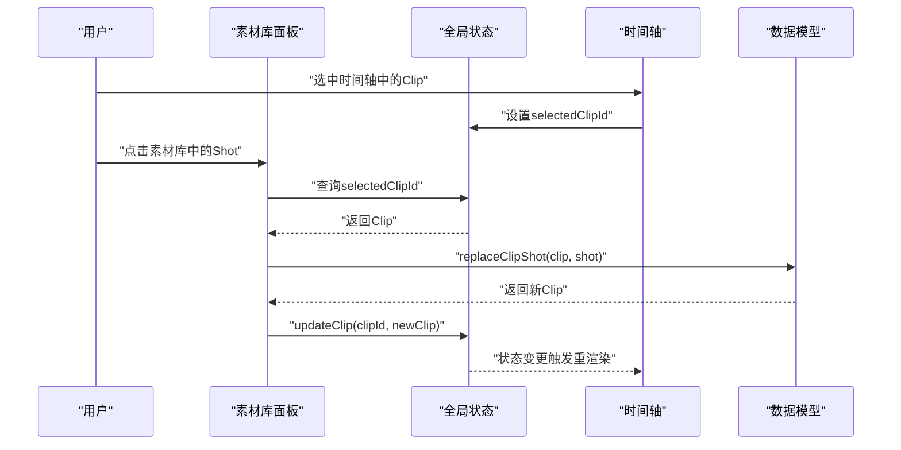
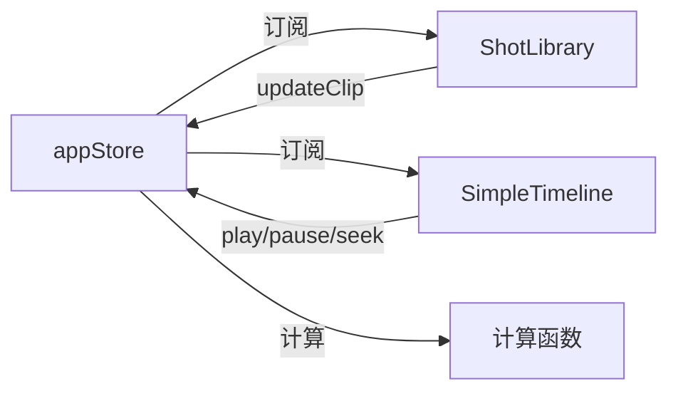
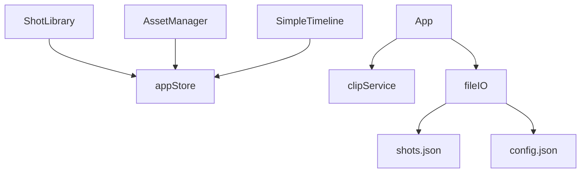

# 素材库

<cite>
**本文档引用的文件**
- [DataModel.ts](file://src/types/DataModel.ts)
- [ShotLibrary.tsx](file://src/components/ShotLibrary.tsx)
- [AssetManagerModal.tsx](file://src/components/AssetManagerModal.tsx)
- [appStore.ts](file://src/store/appStore.ts)
- [SimpleTimeline.tsx](file://src/components/SimpleTimeline.tsx)
- [clipService.ts](file://src/services/clipService.ts)
- [fileIO.ts](file://src/utils/fileIO.ts)
- [App.tsx](file://src/App.tsx)
- [shots.json](file://public/data/shots.json)
- [config.json](file://public/data/config.json)
- [README.md](file://README.md)
</cite>

## 目录
1. [简介](#简介)
2. [项目结构](#项目结构)
3. [核心组件](#核心组件)
4. [架构概览](#架构概览)
5. [详细组件分析](#详细组件分析)
6. [依赖关系分析](#依赖关系分析)
7. [性能考量](#性能考量)
8. [故障排除指南](#故障排除指南)
9. [结论](#结论)
10. [附录](#附录)

## 简介
本文件面向CGCUT的素材库系统，聚焦右侧素材库面板的核心功能与实现细节。内容涵盖：
- 所有可用素材（Shot）的展示与管理
- 按情绪标签的智能筛选机制
- 素材替换的完整流程（选中Clip→点击Shot→自动替换→时长更新）
- Shot数据模型结构详解（镜头ID、标签、情感分类、时长、预览路径等）
- 情绪筛选算法与素材管理权限控制
- AssetManagerModal模态框的实现细节
- 素材库与时间轴的双向数据绑定与实时状态同步
- 素材配置最佳实践、性能优化建议与故障排除指南

## 项目结构
CGCUT采用模块化组织，素材库系统主要由以下层次构成：
- 类型定义层：统一的数据模型与接口规范
- 组件层：素材库面板、资产管理系统、时间轴预览
- 状态管理层：全局状态与计算函数
- 服务层：CLIP内容分析服务
- 工具层：文件读写与项目数据持久化
- 应用入口：页面布局与事件调度

图表来源
- [App.tsx](file://src/App.tsx#L330-L348)
- [ShotLibrary.tsx](file://src/components/ShotLibrary.tsx#L1-L359)
- [AssetManagerModal.tsx](file://src/components/AssetManagerModal.tsx#L1-L511)
- [SimpleTimeline.tsx](file://src/components/SimpleTimeline.tsx#L1-L414)
- [appStore.ts](file://src/store/appStore.ts#L1-L195)
- [DataModel.ts](file://src/types/DataModel.ts#L1-L291)
- [clipService.ts](file://src/services/clipService.ts#L1-L394)
- [fileIO.ts](file://src/utils/fileIO.ts#L1-L95)
- [shots.json](file://public/data/shots.json#L1-L83)
- [config.json](file://public/data/config.json#L1-L6)

章节来源
- [README.md](file://README.md#L1-L181)
- [App.tsx](file://src/App.tsx#L330-L348)

## 核心组件
- 素材库面板（ShotLibrary）：展示所有可用素材，支持按情绪与状态筛选，提供素材替换、编辑、删除等操作入口。
- 资产管理模态框（AssetManagerModal）：专业级素材库管理界面，支持批量处理、搜索、排序、状态切换与进度可视化。
- 全局状态管理（appStore）：集中管理剧本段落、镜头实例、素材、媒体库配置与播放状态，提供计算函数与数据绑定。
- 数据模型（DataModel）：定义Shot、Clip、ScriptBlock、PlaybackState等核心数据结构及计算函数。
- CLIP服务（clipService）：负责视频内容分析与元数据提取，支持批量扫描与单文件处理。
- 文件IO（fileIO）：负责项目数据的加载与保存，支持localStorage持久化与导出。

章节来源
- [ShotLibrary.tsx](file://src/components/ShotLibrary.tsx#L1-L359)
- [AssetManagerModal.tsx](file://src/components/AssetManagerModal.tsx#L1-L511)
- [appStore.ts](file://src/store/appStore.ts#L1-L195)
- [DataModel.ts](file://src/types/DataModel.ts#L116-L148)
- [clipService.ts](file://src/services/clipService.ts#L1-L394)
- [fileIO.ts](file://src/utils/fileIO.ts#L1-L95)

## 架构概览
素材库系统围绕“数据模型—组件—状态管理—服务—文件IO”的分层架构构建，确保：
- 数据一致性：通过全局状态统一管理素材与时间轴数据
- 交互流畅：组件通过状态订阅实现UI与数据的实时联动
- 可扩展性：服务层抽象内容分析能力，便于接入真实后端
- 可维护性：清晰的职责划分与依赖关系

图表来源
- [ShotLibrary.tsx](file://src/components/ShotLibrary.tsx#L42-L53)
- [appStore.ts](file://src/store/appStore.ts#L30-L57)
- [SimpleTimeline.tsx](file://src/components/SimpleTimeline.tsx#L331-L414)
- [DataModel.ts](file://src/types/DataModel.ts#L276-L290)

## 详细组件分析

### Shot数据模型与属性
- 基本字段
  - id：唯一标识
  - label：镜头描述（如“特写-手部”）
  - emotion：情绪标签（用于筛选）
  - duration：镜头时长（秒）
  - file_path：视频文件路径（后端引用路径）
  - status：处理状态（pending/processing/ready/error）
  - tags：标签列表
  - metadata：视频元信息（分辨率、帧率、编码、文件大小）
  - clip_metadata：CLIP提取的元数据（特征向量、标签、描述、情绪、关键帧、处理时间、模型版本）

- 计算函数
  - calculateScriptBlockDuration：根据所属剧本段落聚合所有Clip时长
  - calculateTotalDuration：计算时间轴总时长
  - findClipAtTime：根据当前播放时间定位当前Clip与内部时间
  - createClip：创建新Clip实例（初始裁剪为整段）
  - updateClipTrim：更新裁剪参数（trim_in/trim_out/duration）
  - replaceClipShot：替换Clip绑定的Shot并重置裁剪

章节来源
- [DataModel.ts](file://src/types/DataModel.ts#L116-L148)
- [DataModel.ts](file://src/types/DataModel.ts#L195-L290)

### 素材库面板（ShotLibrary）
- 展示与筛选
  - 情绪筛选：基于所有Shot的emotion去重生成按钮组，支持“全部/具体情绪”
  - 状态筛选：支持“全部/已处理/待处理/处理中”
  - 统计信息：显示已处理、待处理、处理中的数量
- 操作入口
  - 替换素材：点击任意Shot时，若存在选中的Clip则自动替换并更新时长
  - 编辑标签与情绪：支持修改label与emotion
  - 标记为已处理：将状态从pending改为ready
  - 删除素材：确认后移除
- 路径配置：打开模态框设置素材库根路径，保存后更新媒体库配置
- 选中提示：当存在选中的Clip时，在底部显示“已选中Clip，点击素材即可替换”

图表来源
- [ShotLibrary.tsx](file://src/components/ShotLibrary.tsx#L42-L53)
- [appStore.ts](file://src/store/appStore.ts#L30-L57)
- [DataModel.ts](file://src/types/DataModel.ts#L276-L290)

章节来源
- [ShotLibrary.tsx](file://src/components/ShotLibrary.tsx#L1-L359)

### AssetManagerModal模态框
- 专业素材库管理界面
  - 状态标签页：全部/已处理/待处理/处理中/错误，统计各状态数量
  - 搜索与排序：支持按名称、时长、状态、日期排序
  - 批量操作：全选/取消全选、批量处理、批量修改情绪、批量删除
  - 进度可视化：处理中显示进度条与状态徽章
- 新增素材
  - 单个路径引用：输入路径、标签、情绪、时长，创建pending状态的Shot
  - 批量导入：按行输入路径列表，批量创建
- 统计卡片：显示总素材、已处理、待处理、处理中、错误的比例与数量

图表来源
- [AssetManagerModal.tsx](file://src/components/AssetManagerModal.tsx#L1-L511)
- [appStore.ts](file://src/store/appStore.ts#L54-L58)

章节来源
- [AssetManagerModal.tsx](file://src/components/AssetManagerModal.tsx#L1-L511)
- [appStore.ts](file://src/store/appStore.ts#L54-L58)

### 情绪筛选算法
- 情绪来源
  - 预设情绪列表：焦虑、紧张、平静、恐惧、释然、愤怒、悲伤、喜悦
  - CLIP服务：基于文件名关键词与标签进行智能情绪推断
- 筛选实现
  - 前端：在ShotLibrary中动态收集所有Shot的emotion并生成按钮
  - 后端/服务：clipService提供detectEmotions与generateSmartTags等辅助函数

图表来源
- [clipService.ts](file://src/services/clipService.ts#L300-L332)
- [ShotLibrary.tsx](file://src/components/ShotLibrary.tsx#L29-L40)

章节来源
- [clipService.ts](file://src/services/clipService.ts#L300-L332)
- [ShotLibrary.tsx](file://src/components/ShotLibrary.tsx#L29-L40)

### 素材替换流程（选中Clip→点击Shot→自动替换→时长更新）
- 步骤
  1) 在时间轴中选中一个Clip
  2) 在素材库中点击目标Shot
  3) 调用replaceClipShot函数，将Clip的shot_id更新为新Shot，并重置trim_in/trim_out/duration
  4) 全局状态更新后，时间轴与播放预览自动刷新
- 数据绑定
  - 选中状态：selectedClipId由全局状态管理
  - 替换逻辑：updateClip结合replaceClipShot实现
  - 实时渲染：SimpleTimeline订阅clips与playbackState进行渲染

图表来源
- [ShotLibrary.tsx](file://src/components/ShotLibrary.tsx#L42-L53)
- [appStore.ts](file://src/store/appStore.ts#L30-L57)
- [DataModel.ts](file://src/types/DataModel.ts#L276-L290)
- [SimpleTimeline.tsx](file://src/components/SimpleTimeline.tsx#L331-L414)

章节来源
- [ShotLibrary.tsx](file://src/components/ShotLibrary.tsx#L42-L53)
- [appStore.ts](file://src/store/appStore.ts#L30-L57)
- [DataModel.ts](file://src/types/DataModel.ts#L276-L290)
- [SimpleTimeline.tsx](file://src/components/SimpleTimeline.tsx#L331-L414)

### 素材管理权限控制
- 当前实现
  - 素材库面板：提供编辑、删除、标记为已处理等操作
  - 资产管理模态框：提供批量处理、批量删除、批量修改情绪等高级操作
- 权限建议
  - 建议引入角色与权限体系：普通编辑者仅可查看与基础编辑；管理员可执行批量操作与路径配置
  - 对关键操作（如批量删除）增加二次确认与审计日志

章节来源
- [ShotLibrary.tsx](file://src/components/ShotLibrary.tsx#L75-L103)
- [AssetManagerModal.tsx](file://src/components/AssetManagerModal.tsx#L128-L140)
- [AssetManagerModal.tsx](file://src/components/AssetManagerModal.tsx#L190-L207)

### 素材库与时间轴的双向数据绑定与实时状态同步
- 绑定机制
  - 全局状态：clips、selectedClipId、playbackState由appStore集中管理
  - 组件订阅：ShotLibrary与SimpleTimeline通过useAppStore订阅状态变化
  - 计算函数：calculateTotalDuration、findClipAtTime等在状态变更时被重新计算
- 同步流程
  - 替换素材：updateClip触发状态更新，SimpleTimeline重渲染并同步播放预览
  - 播放状态：SimpleTimeline内部播放循环与seek函数驱动playbackState，进而影响UI与预览

图表来源
- [appStore.ts](file://src/store/appStore.ts#L1-L195)
- [ShotLibrary.tsx](file://src/components/ShotLibrary.tsx#L1-L359)
- [SimpleTimeline.tsx](file://src/components/SimpleTimeline.tsx#L1-L414)

章节来源
- [appStore.ts](file://src/store/appStore.ts#L1-L195)
- [ShotLibrary.tsx](file://src/components/ShotLibrary.tsx#L1-L359)
- [SimpleTimeline.tsx](file://src/components/SimpleTimeline.tsx#L1-L414)

## 依赖关系分析
- 组件依赖
  - ShotLibrary依赖appStore以获取/更新素材与时间轴数据
  - AssetManagerModal依赖appStore进行批量操作与状态更新
  - SimpleTimeline依赖appStore读取clips与playbackState
- 服务依赖
  - App.tsx在扫描素材库时调用clipService.scanAndProcess
  - fileIO负责项目数据的加载与保存
- 数据依赖
  - shots.json提供初始素材数据
  - config.json提供媒体服务器配置

图表来源
- [ShotLibrary.tsx](file://src/components/ShotLibrary.tsx#L1-L359)
- [AssetManagerModal.tsx](file://src/components/AssetManagerModal.tsx#L1-L511)
- [SimpleTimeline.tsx](file://src/components/SimpleTimeline.tsx#L1-L414)
- [App.tsx](file://src/App.tsx#L171-L252)
- [fileIO.ts](file://src/utils/fileIO.ts#L54-L80)
- [shots.json](file://public/data/shots.json#L1-L83)
- [config.json](file://public/data/config.json#L1-L6)

章节来源
- [App.tsx](file://src/App.tsx#L171-L252)
- [fileIO.ts](file://src/utils/fileIO.ts#L54-L80)

## 性能考量
- 渲染优化
  - 使用React.memo与useMemo避免不必要的重渲染（例如AssetManagerModal中的filteredShots与stats）
  - 列表渲染采用虚拟滚动（建议）以提升大量素材时的性能
- 状态更新
  - 批量操作（如批量处理、批量删除）应合并状态更新，减少多次重渲染
- 计算复杂度
  - calculateTotalDuration与calculateScriptBlockDuration为O(n)，在大时间轴上仍较高效
- I/O与网络
  - CLIP扫描与处理应异步执行并在UI中提供进度反馈
  - 本地缓存策略：利用localStorage减少重复加载

章节来源
- [AssetManagerModal.tsx](file://src/components/AssetManagerModal.tsx#L28-L78)
- [DataModel.ts](file://src/types/DataModel.ts#L195-L237)
- [clipService.ts](file://src/services/clipService.ts#L107-L165)

## 故障排除指南
- 素材库路径未设置
  - 现象：扫描素材库按钮禁用或提示未设置路径
  - 处理：在素材库面板中打开路径配置模态框，填写并保存
- 无法替换素材
  - 现象：点击Shot无反应
  - 处理：先在时间轴中选中一个Clip，再点击Shot进行替换
- 素材未就绪（无file_path）
  - 现象：时间轴预览显示“素材未就绪，请在素材库添加视频路径”
  - 处理：在素材库中为Shot设置file_path或通过资产管理模态框批量导入
- CLIP处理失败
  - 现象：扫描素材库后出现错误提示
  - 处理：检查素材库路径与文件格式，确认CLIP服务可用性
- 项目状态检查不通过
  - 现象：一键检查显示未完成
  - 处理：根据检查结果补充剧本、时间轴占位与素材匹配

章节来源
- [ShotLibrary.tsx](file://src/components/ShotLibrary.tsx#L55-L68)
- [ShotLibrary.tsx](file://src/components/ShotLibrary.tsx#L42-L53)
- [SimpleTimeline.tsx](file://src/components/SimpleTimeline.tsx#L118-L142)
- [App.tsx](file://src/App.tsx#L171-L252)
- [App.tsx](file://src/App.tsx#L275-L280)

## 结论
CGCUT素材库系统通过清晰的分层架构与全局状态管理，实现了素材的高效展示、智能筛选与便捷替换。结合CLIP服务与资产管理模态框，系统在MVP阶段已具备专业级素材库的基本能力。建议后续在权限控制、批量操作与性能优化方面进一步完善，以满足更复杂的创作工作流需求。

## 附录
- 素材配置最佳实践
  - 使用AssetManagerModal进行批量导入与批量处理，提高效率
  - 为每个Shot设置合理的emotion与标签，便于筛选与情绪匹配
  - 定期扫描素材库，保持素材库与实际资源一致
- 性能优化建议
  - 对素材列表进行虚拟滚动与懒加载
  - 合并批量操作的状态更新，减少重渲染
  - 使用缓存策略与进度反馈优化CLIP处理体验
- 故障排除清单
  - 确认素材库路径正确
  - 确保每个Clip都绑定了有效的Shot
  - 检查CLIP服务可用性与网络连接
  - 使用一键检查功能定位项目缺失环节