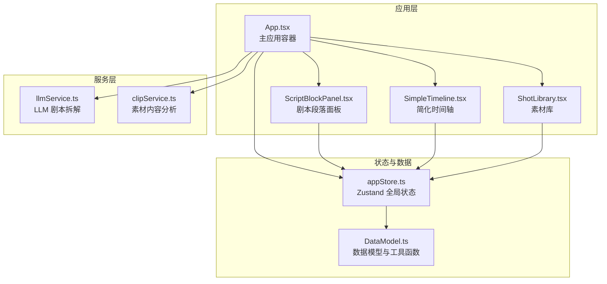
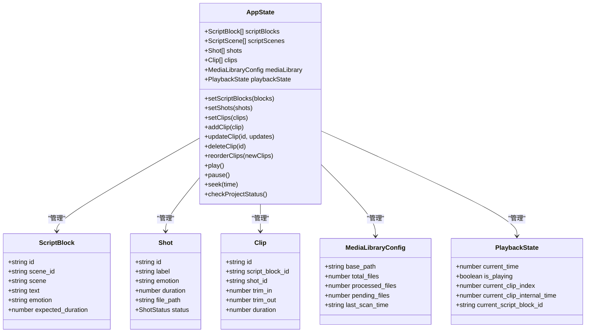
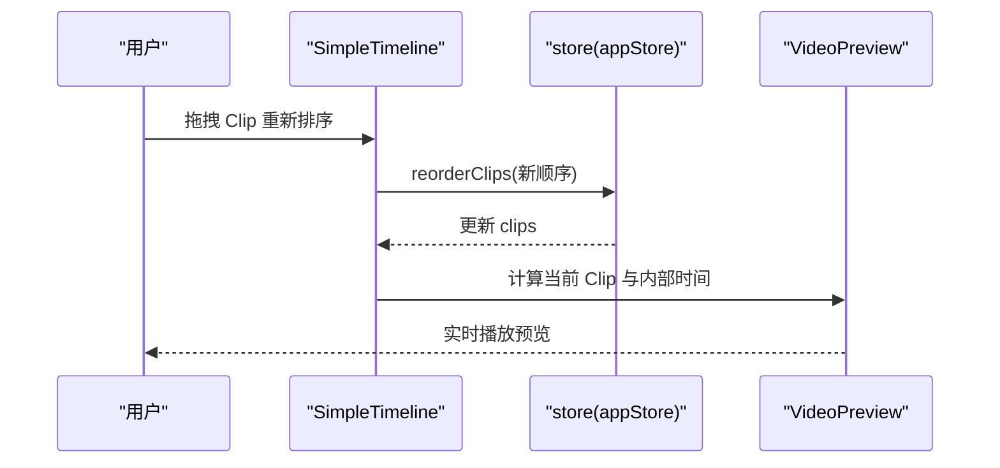
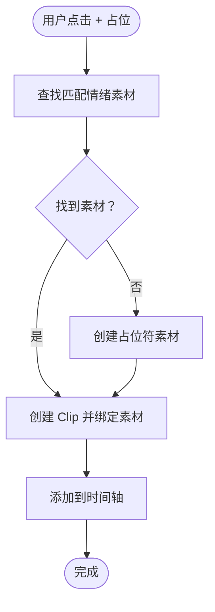
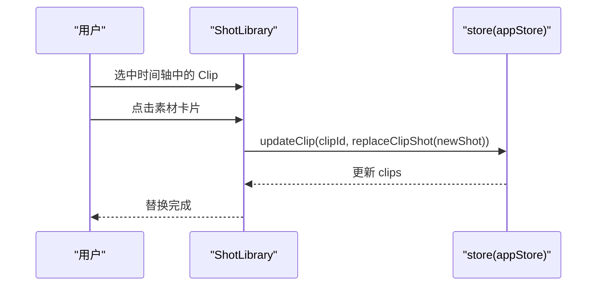
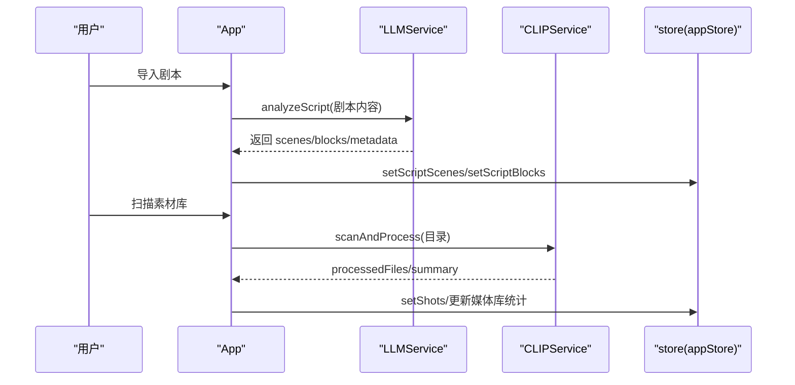
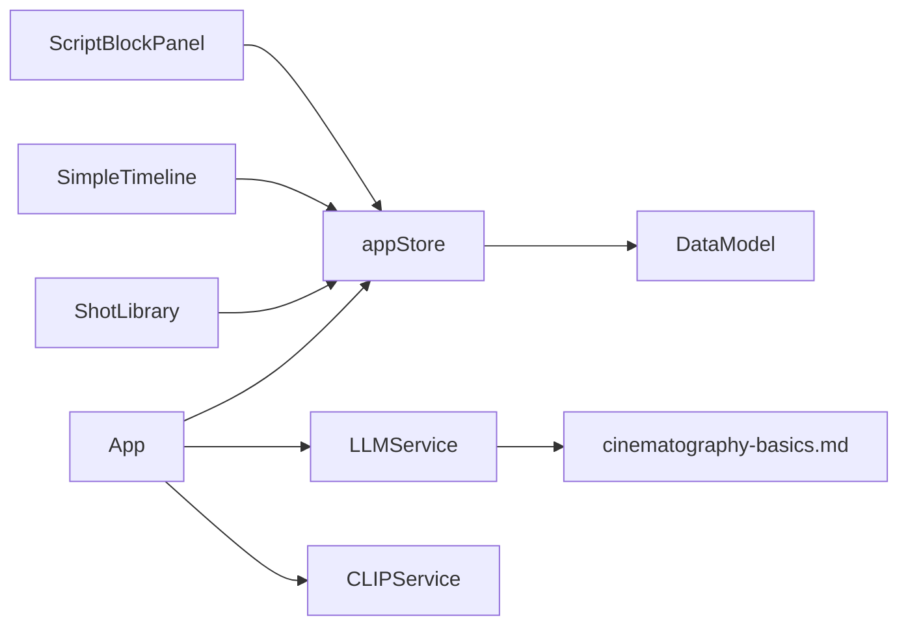

# 设计原则与验收标准

<cite>
**本文引用的文件**
- [README.md](file://README.md)
- [FEATURE_REPORT.md](file://FEATURE_REPORT.md)
- [USAGE_GUIDE.md](file://USAGE_GUIDE.md)
- [knowledge/cinematography-basics.md](file://knowledge/cinematography-basics.md)
- [src/App.tsx](file://src/App.tsx)
- [src/main.tsx](file://src/main.tsx)
- [src/types/DataModel.ts](file://src/types/DataModel.ts)
- [src/store/appStore.ts](file://src/store/appStore.ts)
- [src/components/SimpleTimeline.tsx](file://src/components/SimpleTimeline.tsx)
- [src/components/ScriptBlockPanel.tsx](file://src/components/ScriptBlockPanel.tsx)
- [src/components/ShotLibrary.tsx](file://src/components/ShotLibrary.tsx)
- [src/services/llmService.ts](file://src/services/llmService.ts)
- [src/services/clipService.ts](file://src/services/clipService.ts)
</cite>

## 目录
1. [简介](#简介)
2. [项目结构](#项目结构)
3. [核心设计原则](#核心设计原则)
4. [架构概览](#架构概览)
5. [详细组件分析](#详细组件分析)
6. [依赖关系分析](#依赖关系分析)
7. [性能考量](#性能考量)
8. [故障排查指南](#故障排查指南)
9. [结论](#结论)
10. [附录](#附录)

## 简介
本文件为 CGCUT 的“设计原则与验收标准”文档，目标是：
- 明确项目的核心设计原则与允许/禁止的功能边界
- 解释单轨时间轴、禁止多轨与特效等设计决策的动机
- 列出 MVP 验收标准与必须满足的功能清单
- 为开发者提供设计约束与质量标准参考，确保功能开发与项目定位一致

## 项目结构
CGCUT 采用前端单页应用架构，核心由三部分组成：
- 左侧：剧本段落面板（ScriptBlockPanel），负责展示与管理剧本段落、时长对比与高亮
- 中央：简化时间轴（SimpleTimeline），单轨布局，支持拖拽排序、删除、裁剪与播放预览
- 右侧：素材库（ShotLibrary），提供素材筛选、状态管理与替换操作
- 全局状态：Zustand store 统一管理数据与播放状态
- 服务层：LLMService（剧本分镜拆解）、CLIPService（素材内容分析）

图表来源
- [src/App.tsx](file://src/App.tsx#L1-L497)
- [src/components/ScriptBlockPanel.tsx](file://src/components/ScriptBlockPanel.tsx#L1-L285)
- [src/components/SimpleTimeline.tsx](file://src/components/SimpleTimeline.tsx#L1-L414)
- [src/components/ShotLibrary.tsx](file://src/components/ShotLibrary.tsx#L1-L359)
- [src/store/appStore.ts](file://src/store/appStore.ts#L1-L195)
- [src/types/DataModel.ts](file://src/types/DataModel.ts#L1-L291)
- [src/services/llmService.ts](file://src/services/llmService.ts#L1-L476)
- [src/services/clipService.ts](file://src/services/clipService.ts#L1-L394)

章节来源
- [README.md](file://README.md#L126-L150)
- [src/main.tsx](file://src/main.tsx#L1-L11)

## 核心设计原则
本项目定位为“导演分镜验证工具”，强调“快速验证节奏与镜头匹配”，因此设计原则如下：

- ✅ 允许的能力
  - 剧本段落管理与时长对比
  - 单轨时间轴编辑（拖拽排序、删除、裁剪）
  - 素材替换与占位符机制
  - 时长验证与播放预览
  - LLM 分镜拆解与素材内容分析（MVP 阶段为模拟）

- ❌ 严格禁止
  - 多轨编辑（音视频分离轨道）
  - 音频编辑（混音、音效、音量曲线）
  - 特效/转场（滤镜、遮罩、动画）
  - 复杂渲染参数（分辨率、编码器、帧率）
  - 精细逐帧编辑（逐帧定位、微秒级裁剪）

设计理由与权衡
- 单轨时间轴：聚焦“镜头顺序与节奏验证”，避免多轨导致的复杂性与认知负担；单轨也便于快速播放与直观验证
- 禁止多轨与特效：降低开发与学习成本，保证 MVP 快速交付；将“创意剪辑”留给专业 NLE 工具
- 时长验证与播放预览：在分镜阶段即时反馈节奏偏差，帮助导演快速迭代
- LLM/CLIP：在 MVP 阶段以模拟为主，保证功能闭环与可测试性，后续再接入真实服务

章节来源
- [README.md](file://README.md#L90-L106)
- [USAGE_GUIDE.md](file://USAGE_GUIDE.md#L1-L126)
- [src/services/llmService.ts](file://src/services/llmService.ts#L1-L476)
- [src/services/clipService.ts](file://src/services/clipService.ts#L1-L394)

## 架构概览
整体采用“组件 + 状态 + 服务”的分层架构：
- 组件层：ScriptBlockPanel、SimpleTimeline、ShotLibrary
- 状态层：Zustand store 统一管理 clips、shots、scriptBlocks、playbackState 等
- 服务层：LLMService（剧本拆解）、CLIPService（素材分析）
- 数据模型：DataModel.ts 定义核心实体与计算工具（时长、查找、替换等）

图表来源
- [src/types/DataModel.ts](file://src/types/DataModel.ts#L86-L169)
- [src/store/appStore.ts](file://src/store/appStore.ts#L4-L58)

章节来源
- [src/types/DataModel.ts](file://src/types/DataModel.ts#L1-L291)
- [src/store/appStore.ts](file://src/store/appStore.ts#L1-L195)

## 详细组件分析

### 组件 A：简化时间轴（Single Timeline）
- 单轨布局，支持拖拽排序、删除、裁剪（in/out 边缘手柄）
- 时间刻度标尺（秒级与半秒次刻度），播放指示器
- 播放预览：根据当前播放时间定位到对应 Clip，并同步视频播放
- 占位符视觉标识：虚线边框 + 黄色标签，提示“待素材”
- 禁止多轨与特效：时间轴仅承载镜头片段，不涉及音频轨道与转场

图表来源
- [src/components/SimpleTimeline.tsx](file://src/components/SimpleTimeline.tsx#L331-L414)
- [src/store/appStore.ts](file://src/store/appStore.ts#L91-L107)

章节来源
- [src/components/SimpleTimeline.tsx](file://src/components/SimpleTimeline.tsx#L1-L414)

### 组件 B：剧本段落面板（ScriptBlockPanel）
- 展示剧本段落、期望时长与实际时长对比，颜色提示（绿色/蓝色/橙色）
- 自动高亮当前播放的段落
- “添加占位”：为段落创建占位符 Clip（若无匹配素材）
- 支持原文与 LLM 拆解双 Tab 切换

图表来源
- [src/components/ScriptBlockPanel.tsx](file://src/components/ScriptBlockPanel.tsx#L71-L106)
- [src/types/DataModel.ts](file://src/types/DataModel.ts#L242-L254)

章节来源
- [src/components/ScriptBlockPanel.tsx](file://src/components/ScriptBlockPanel.tsx#L1-L285)

### 组件 C：素材库（ShotLibrary）
- 情绪与状态筛选、批量操作（标记已处理、编辑标签、修改情绪、删除）
- 点击素材替换时间轴中的选中 Clip
- 素材管理弹窗（资产管理）与素材库路径配置
- 占位符替换流程：选中 Clip → 点击素材 → 自动替换

图表来源
- [src/components/ShotLibrary.tsx](file://src/components/ShotLibrary.tsx#L42-L53)
- [src/types/DataModel.ts](file://src/types/DataModel.ts#L279-L290)

章节来源
- [src/components/ShotLibrary.tsx](file://src/components/ShotLibrary.tsx#L1-L359)

### 组件 D：主应用（App）
- 导入剧本（支持 .txt/.json/.doc/.docx），调用 LLMService 进行拆解
- 扫描素材库（CLIPService 模拟处理），更新素材状态
- 一键检查项目状态（剧本导入、分段、占位、素材匹配）
- 导出/保存项目

图表来源
- [src/App.tsx](file://src/App.tsx#L70-L252)
- [src/services/llmService.ts](file://src/services/llmService.ts#L72-L101)
- [src/services/clipService.ts](file://src/services/clipService.ts#L36-L60)

章节来源
- [src/App.tsx](file://src/App.tsx#L1-L497)

## 依赖关系分析
- 组件依赖 store：各组件通过 hooks 访问 store 的状态与动作，实现松耦合
- store 依赖数据模型：使用 DataModel.ts 的类型与工具函数（时长计算、查找、替换）
- 服务层依赖外部 API：LLMService/CLIPService 在 MVP 阶段使用模拟，生产环境可替换为真实接口
- 知识库驱动：llmService 内嵌 cinematoagraphy-basics.md 的知识库，指导 Prompt 设计

图表来源
- [src/components/ScriptBlockPanel.tsx](file://src/components/ScriptBlockPanel.tsx#L1-L285)
- [src/components/SimpleTimeline.tsx](file://src/components/SimpleTimeline.tsx#L1-L414)
- [src/components/ShotLibrary.tsx](file://src/components/ShotLibrary.tsx#L1-L359)
- [src/store/appStore.ts](file://src/store/appStore.ts#L1-L195)
- [src/types/DataModel.ts](file://src/types/DataModel.ts#L1-L291)
- [src/services/llmService.ts](file://src/services/llmService.ts#L1-L476)
- [knowledge/cinematography-basics.md](file://knowledge/cinematography-basics.md#L1-L366)

章节来源
- [src/services/llmService.ts](file://src/services/llmService.ts#L1-L476)
- [knowledge/cinematography-basics.md](file://knowledge/cinematography-basics.md#L1-L366)

## 性能考量
- 单轨时间轴：减少轨道与渲染复杂度，提升交互流畅性
- 播放循环：使用 requestAnimationFrame 与固定步进（约 16ms），避免高频重绘
- 拖拽排序：@dnd-kit 提供高性能的排序体验，配合 store 的不可变更新
- LLM/CLIP：MVP 阶段使用模拟，避免真实 API 延迟影响用户体验；生产环境可通过缓存与批处理优化
- 状态管理：Zustand 减少不必要的重渲染，结合 useMemo/useCallback 优化

## 故障排查指南
- 导入剧本失败
  - 检查文件格式（仅支持 .txt/.json；.doc/.docx 需转换）
  - 确认 LLM API 可用或等待模拟结果
- 素材库扫描失败
  - 确认素材库路径已设置
  - 检查文件格式与编码（MVP 阶段模拟处理）
- 播放器不工作
  - 确认时间轴至少有一个镜头
  - 检查素材 file_path 是否有效
- 占位符未替换
  - 确认已选中时间轴中的 Clip
  - 点击素材卡片触发替换

章节来源
- [USAGE_GUIDE.md](file://USAGE_GUIDE.md#L113-L126)
- [src/App.tsx](file://src/App.tsx#L83-L91)
- [src/components/ShotLibrary.tsx](file://src/components/ShotLibrary.tsx#L42-L53)

## 结论
CGCUT 的设计原则围绕“导演分镜验证”这一核心目标展开：以单轨时间轴与占位符机制为核心，辅以 LLM/CLIP 的智能能力，在 MVP 阶段实现快速节奏验证与镜头匹配。通过严格的“允许/禁止”清单与验收标准，确保功能开发聚焦于项目定位，避免功能蔓延与复杂度上升。后续可在保持核心定位的前提下，逐步引入更丰富的素材管理与播放能力。

## 附录

### 验收标准（MVP 必须满足）
- 能加载示例剧本，生成 ScriptBlock 列表
- 能为每个 ScriptBlock 放置占位 Clip
- 时间轴支持拖拽顺序、删除和裁剪
- 替换 Shot 后，时间轴和段落时长立即更新
- 时间轴显示时间刻度标尺
- 支持从服务器加载素材

章节来源
- [README.md](file://README.md#L107-L117)

### 设计约束与质量标准
- 交互一致性：单轨时间轴、占位符视觉标识、播放预览与高亮保持一致
- 数据一致性：store 状态与 UI 同步，替换与裁剪操作原子化
- 可测试性：MVP 阶段使用模拟服务，保证可重复测试
- 可扩展性：服务层与组件层解耦，知识库与 Prompt 可维护

章节来源
- [README.md](file://README.md#L90-L106)
- [src/services/llmService.ts](file://src/services/llmService.ts#L1-L476)
- [src/services/clipService.ts](file://src/services/clipService.ts#L1-L394)