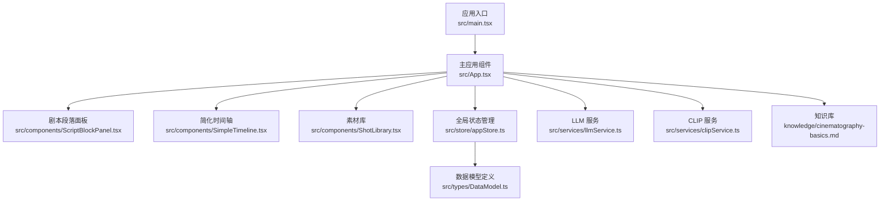
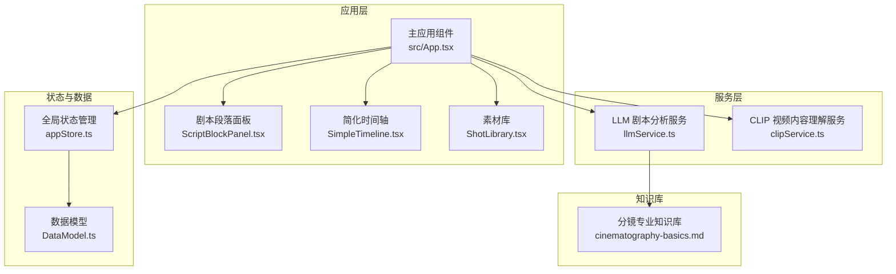
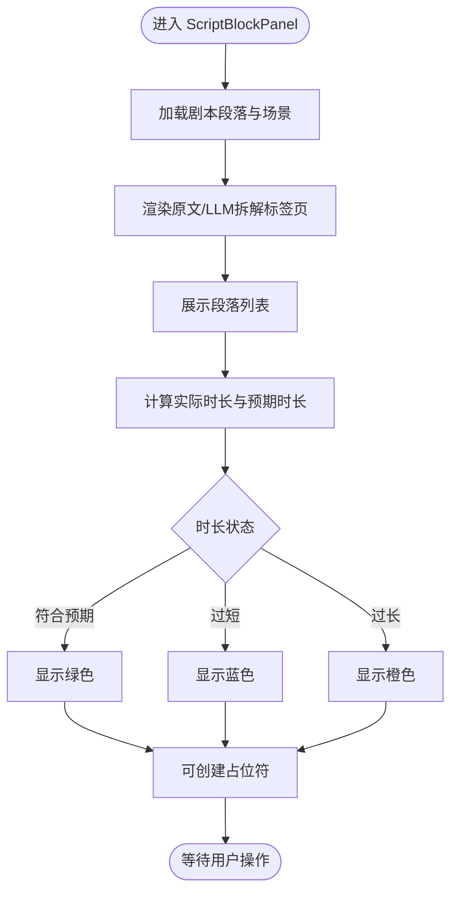
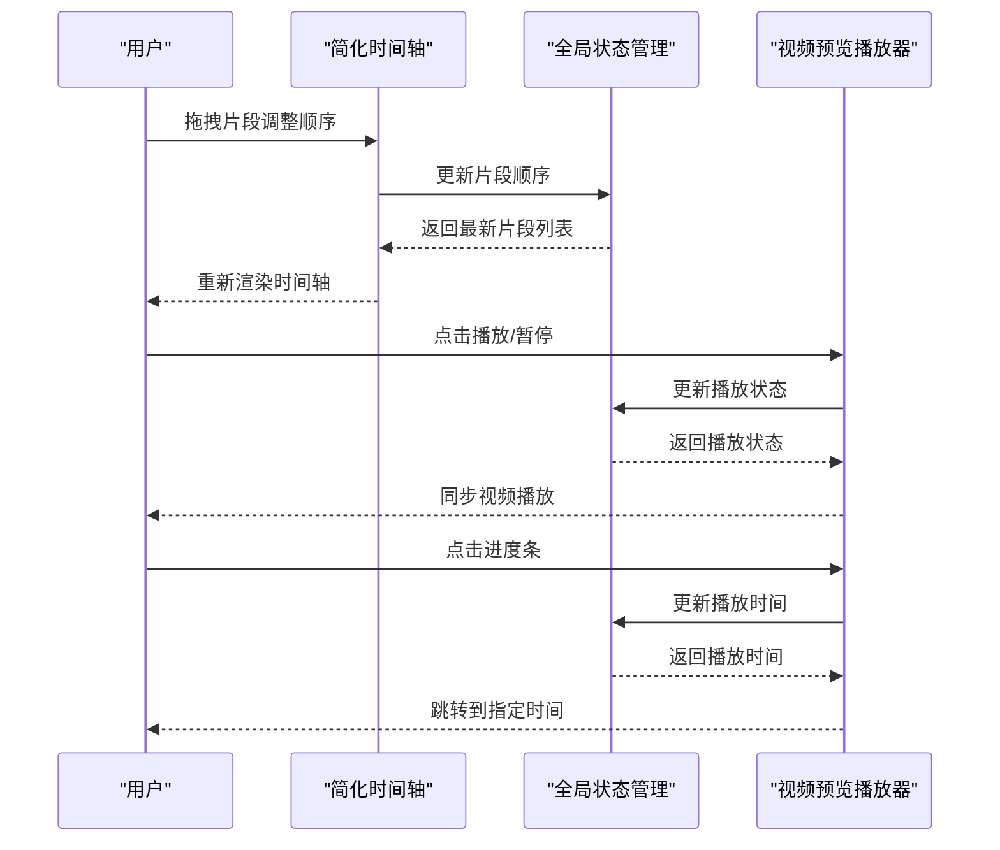
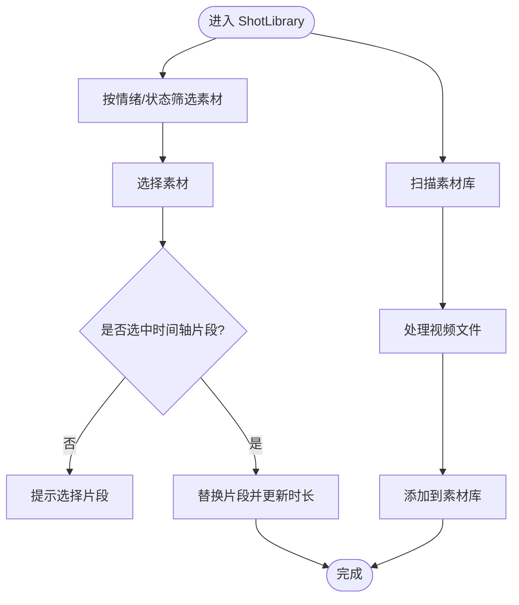
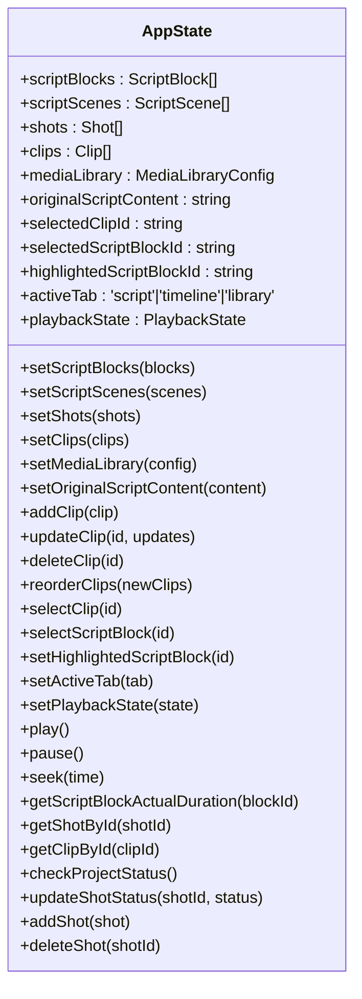
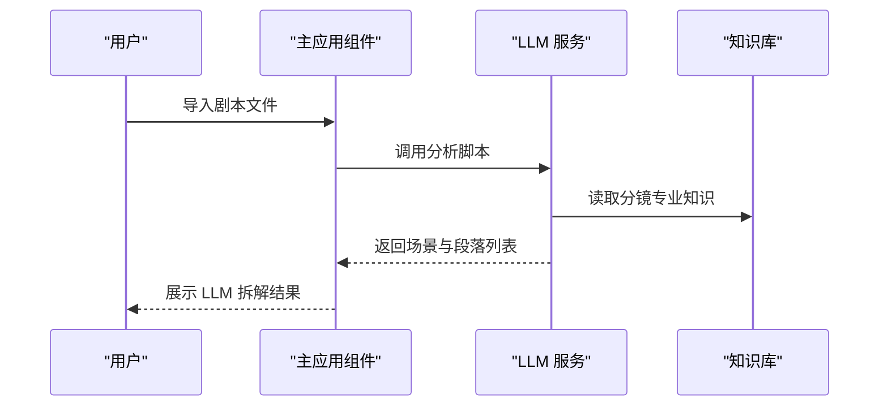
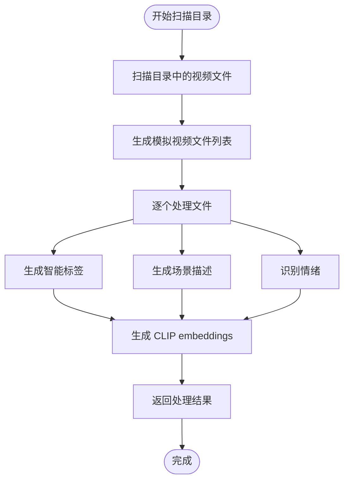
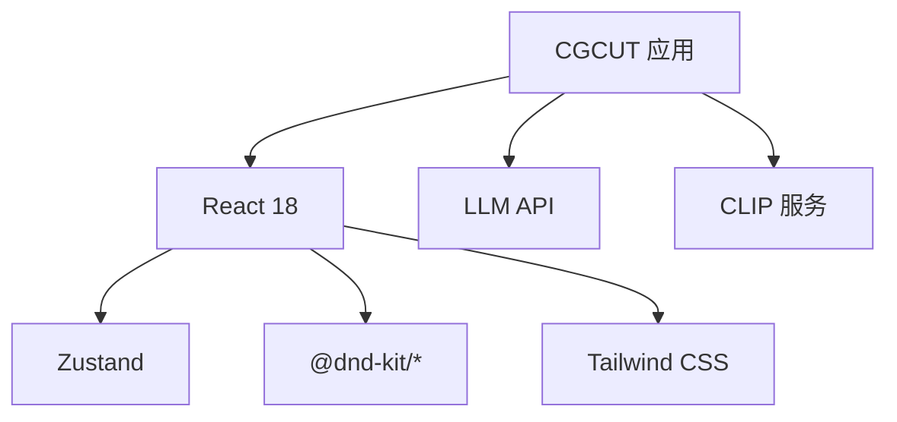

# 项目介绍

<cite>
**本文档引用的文件**
- [README.md](file://README.md)
- [package.json](file://package.json)
- [src/App.tsx](file://src/App.tsx)
- [src/main.tsx](file://src/main.tsx)
- [src/types/DataModel.ts](file://src/types/DataModel.ts)
- [src/store/appStore.ts](file://src/store/appStore.ts)
- [src/services/llmService.ts](file://src/services/llmService.ts)
- [src/services/clipService.ts](file://src/services/clipService.ts)
- [src/components/ScriptBlockPanel.tsx](file://src/components/ScriptBlockPanel.tsx)
- [src/components/SimpleTimeline.tsx](file://src/components/SimpleTimeline.tsx)
- [src/components/ShotLibrary.tsx](file://src/components/ShotLibrary.tsx)
- [knowledge/cinematography-basics.md](file://knowledge/cinematography-basics.md)
- [USAGE_GUIDE.md](file://USAGE_GUIDE.md)
</cite>

## 目录
1. [简介](#简介)
2. [项目结构](#项目结构)
3. [核心组件](#核心组件)
4. [架构概览](#架构概览)
5. [详细组件分析](#详细组件分析)
6. [依赖分析](#依赖分析)
7. [性能考量](#性能考量)
8. [故障排查指南](#故障排查指南)
9. [结论](#结论)
10. [附录](#附录)

## 简介
CGCUT 是一款专业的导演分镜验证工具，旨在帮助导演在极短时间内（约30分钟）从剧本过渡到可播放的时间轴，快速发现并解决节奏问题。它是一个“验证器”，而非完整的非线性编辑器（NLE），专注于验证“剧本段落 × 镜头组合 × 实际节奏”三者的匹配度，确保分镜方案在视觉呈现与时间节奏上成立。

### 核心价值定位
- 快速验证：将剧本智能拆解为镜头段落，结合镜头素材与时间轴，即时反馈实际时长与预期时长的差异。
- 节奏控制：通过时长对比与情绪标注，帮助导演在早期阶段发现节奏过快或过慢的问题。
- 简化编辑：提供单轨时间轴与基础操作（拖拽排序、删除、裁剪），避免复杂编辑带来的干扰。
- 智能辅助：集成 LLM 剧本分析与 CLIP 视频内容理解，提升素材检索与情绪匹配效率。

### 应用场景
- 验证剧本节奏：导入剧本后，为每个段落放置镜头，查看实际时长与预期时长，快速定位节奏问题。
- 镜头情绪匹配：通过情绪筛选与 CLIP 智能标注，快速找到与段落情绪一致的镜头。
- 快速迭代：当编剧修改对话后，导演可在几分钟内重新排列镜头并验证新节奏。

### 目标用户群体
- 导演与副导演：需要快速验证分镜节奏与情绪表达。
- 分镜师：负责将剧本拆解为镜头序列，验证镜头数量与时长。
- 剪辑师：在粗剪阶段验证镜头顺序与节奏。
- 制片团队：关注整体节奏与成本控制。

### 解决的核心痛点
- 剧本到分镜的衔接困难：传统流程中，导演往往需要大量时间才能将文字剧本转化为可播放的时间轴。
- 节奏把控不及时：在后期才发现节奏问题，导致返工成本高。
- 素材检索效率低：缺乏智能筛选与情绪标注，难以快速匹配合适镜头。
- 编辑器复杂度高：复杂的 NLE 功能分散注意力，影响验证效率。

### 初学者概念解释
- 分镜验证：在拍摄前，通过镜头组合与时间轴验证剧本的节奏与情绪是否成立，避免拍摄后才发现问题。
- 镜头景别：远景、全景、中景、近景、特写等不同景别具有不同的节奏与情绪表达能力。
- 情绪标注：为镜头分配“紧张、焦虑、恐惧、释然、平静、愤怒、悲伤、喜悦”等情绪标签，便于筛选与匹配。
- 时长估算：基于景别与时长标准，结合内容类型与情绪强度，估算镜头时长，确保整体节奏合理。

## 项目结构
CGCUT 采用前端单页应用架构，主要由以下模块组成：
- 应用入口与主界面：负责加载项目数据、提供工具栏与三大面板布局。
- 数据模型与状态管理：定义剧本段落、场景、镜头、时间轴片段、素材等数据结构，以及全局状态管理。
- 服务层：LLM 剧本分析服务与 CLIP 视频内容理解服务，支撑智能拆解与素材标注。
- 组件层：剧本段落面板、简化时间轴、素材库等 UI 组件，提供直观的操作体验。
- 知识库：提供分镜专业知识，指导 LLM 拆解与素材标注。

图表来源
- [src/main.tsx](file://src/main.tsx#L1-L11)
- [src/App.tsx](file://src/App.tsx#L1-L497)
- [src/components/ScriptBlockPanel.tsx](file://src/components/ScriptBlockPanel.tsx#L1-L285)
- [src/components/SimpleTimeline.tsx](file://src/components/SimpleTimeline.tsx#L1-L414)
- [src/components/ShotLibrary.tsx](file://src/components/ShotLibrary.tsx#L1-L359)
- [src/store/appStore.ts](file://src/store/appStore.ts#L1-L195)
- [src/types/DataModel.ts](file://src/types/DataModel.ts#L1-L291)
- [src/services/llmService.ts](file://src/services/llmService.ts#L1-L476)
- [src/services/clipService.ts](file://src/services/clipService.ts#L1-L394)
- [knowledge/cinematography-basics.md](file://knowledge/cinematography-basics.md#L1-L366)

章节来源
- [README.md](file://README.md#L126-L150)
- [package.json](file://package.json#L1-L36)

## 核心组件
- 剧本段落面板：展示剧本段落与场景，实时显示每段的实际时长与预期时长，支持占位符创建与高亮播放段落。
- 简化时间轴：单轨布局，支持拖拽排序、删除、裁剪；显示时间刻度标尺与播放指示器；集成视频预览播放器。
- 素材库：展示可用素材，按情绪筛选；支持替换时间轴中的镜头；提供素材管理与路径配置。
- 全局状态管理：集中管理剧本、场景、镜头、时间轴片段、素材、播放状态等数据与操作。
- 服务层：LLM 剧本分析服务与 CLIP 视频内容理解服务，支撑智能拆解与素材标注。

章节来源
- [README.md](file://README.md#L30-L57)
- [src/components/ScriptBlockPanel.tsx](file://src/components/ScriptBlockPanel.tsx#L1-L285)
- [src/components/SimpleTimeline.tsx](file://src/components/SimpleTimeline.tsx#L1-L414)
- [src/components/ShotLibrary.tsx](file://src/components/ShotLibrary.tsx#L1-L359)
- [src/store/appStore.ts](file://src/store/appStore.ts#L1-L195)
- [src/services/llmService.ts](file://src/services/llmService.ts#L1-L476)
- [src/services/clipService.ts](file://src/services/clipService.ts#L1-L394)

## 架构概览
CGCUT 的架构围绕“验证器”的设计理念构建，强调简单、高效与可验证性。应用通过 LLM 将剧本拆解为镜头段落，通过 CLIP 对素材进行内容理解与标注，再通过简化时间轴进行节奏验证与快速迭代。

图表来源
- [src/App.tsx](file://src/App.tsx#L1-L497)
- [src/components/ScriptBlockPanel.tsx](file://src/components/ScriptBlockPanel.tsx#L1-L285)
- [src/components/SimpleTimeline.tsx](file://src/components/SimpleTimeline.tsx#L1-L414)
- [src/components/ShotLibrary.tsx](file://src/components/ShotLibrary.tsx#L1-L359)
- [src/store/appStore.ts](file://src/store/appStore.ts#L1-L195)
- [src/types/DataModel.ts](file://src/types/DataModel.ts#L1-L291)
- [src/services/llmService.ts](file://src/services/llmService.ts#L1-L476)
- [src/services/clipService.ts](file://src/services/clipService.ts#L1-L394)
- [knowledge/cinematography-basics.md](file://knowledge/cinematography-basics.md#L1-L366)

## 详细组件分析

### 剧本段落面板（ScriptBlockPanel）
- 功能要点
  - 展示剧本段落与场景，支持折叠/展开场景。
  - 实时显示每段的实际时长与预期时长，通过颜色区分“符合预期/过短/过长”。
  - 支持为段落创建占位符镜头，便于快速填充时间轴。
  - 播放时自动高亮当前段落，便于节奏核对。
- 关键交互
  - 点击“+ 占位”为段落创建占位符镜头。
  - 切换“原文/LLM拆解”标签页查看原始剧本或拆解结果。
  - 场景标题支持折叠/展开，优化长剧本浏览体验。

图表来源
- [src/components/ScriptBlockPanel.tsx](file://src/components/ScriptBlockPanel.tsx#L1-L285)
- [src/store/appStore.ts](file://src/store/appStore.ts#L1-L195)
- [src/types/DataModel.ts](file://src/types/DataModel.ts#L195-L212)

章节来源
- [src/components/ScriptBlockPanel.tsx](file://src/components/ScriptBlockPanel.tsx#L1-L285)
- [src/store/appStore.ts](file://src/store/appStore.ts#L1-L195)
- [src/types/DataModel.ts](file://src/types/DataModel.ts#L195-L212)

### 简化时间轴（SimpleTimeline）
- 功能要点
  - 单轨布局，专注镜头顺序验证。
  - 时间刻度标尺，支持秒级刻度与时间标签。
  - 支持拖拽排序、删除、裁剪（in/out 点）。
  - 集成视频预览播放器，实时显示当前播放位置对应的视频内容。
- 关键交互
  - 拖拽片段调整顺序。
  - 点击时间轴刻度跳转到指定时间。
  - 点击进度条快速定位播放位置。
  - 播放时显示播放指示器与当前镜头信息。

图表来源
- [src/components/SimpleTimeline.tsx](file://src/components/SimpleTimeline.tsx#L1-L414)
- [src/store/appStore.ts](file://src/store/appStore.ts#L1-L195)

章节来源
- [src/components/SimpleTimeline.tsx](file://src/components/SimpleTimeline.tsx#L1-L414)
- [src/store/appStore.ts](file://src/store/appStore.ts#L1-L195)

### 素材库（ShotLibrary）
- 功能要点
  - 展示可用素材，按情绪筛选与状态筛选。
  - 支持替换时间轴中的镜头，自动更新时长。
  - 提供素材管理与路径配置，支持扫描素材库并处理视频文件。
- 关键交互
  - 点击素材库中的镜头替换时间轴中的片段。
  - 配置素材库路径，扫描并处理视频文件。
  - 编辑镜头标签、修改情绪、删除素材。

图表来源
- [src/components/ShotLibrary.tsx](file://src/components/ShotLibrary.tsx#L1-L359)
- [src/store/appStore.ts](file://src/store/appStore.ts#L1-L195)
- [src/services/clipService.ts](file://src/services/clipService.ts#L1-L394)

章节来源
- [src/components/ShotLibrary.tsx](file://src/components/ShotLibrary.tsx#L1-L359)
- [src/store/appStore.ts](file://src/store/appStore.ts#L1-L195)
- [src/services/clipService.ts](file://src/services/clipService.ts#L1-L394)

### 全局状态管理（appStore）
- 功能要点
  - 管理剧本段落、场景、镜头、时间轴片段、素材、播放状态等数据。
  - 提供片段操作（添加、更新、删除、重排）、选择操作、播放控制等。
  - 计算脚本段落实际时长、查找片段、检查项目状态等。
- 关键函数
  - 计算脚本段落实际时长：基于时间轴片段时长累加。
  - 查找片段：根据时间定位当前播放片段。
  - 检查项目状态：判断剧本导入、分段、占位与素材匹配情况。

图表来源
- [src/store/appStore.ts](file://src/store/appStore.ts#L1-L195)
- [src/types/DataModel.ts](file://src/types/DataModel.ts#L1-L291)

章节来源
- [src/store/appStore.ts](file://src/store/appStore.ts#L1-L195)
- [src/types/DataModel.ts](file://src/types/DataModel.ts#L1-L291)

### LLM 剧本分析服务（llmService）
- 功能要点
  - 使用 NVIDIA API 或模拟方式对剧本进行智能拆解，生成场景与镜头段落。
  - 严格遵循分镜拆解规则，确保每个场景至少3-10个镜头，且每个镜头包含景别、主体、动作/状态与情绪。
  - 输出包含场景、段落、情绪与预期时长等信息，供时间轴验证使用。
- 关键流程
  - 构造专业分镜拆解 Prompt，引用知识库。
  - 调用 LLM API 获取 JSON 结果，解析为内部数据结构。
  - 若 API 失败，回退到模拟分析，保证 MVP 可用性。

图表来源
- [src/App.tsx](file://src/App.tsx#L70-L169)
- [src/services/llmService.ts](file://src/services/llmService.ts#L1-L476)
- [knowledge/cinematography-basics.md](file://knowledge/cinematography-basics.md#L1-L366)

章节来源
- [src/services/llmService.ts](file://src/services/llmService.ts#L1-L476)
- [src/App.tsx](file://src/App.tsx#L70-L169)
- [knowledge/cinematography-basics.md](file://knowledge/cinematography-basics.md#L1-L366)

### CLIP 视频内容理解服务（clipService）
- 功能要点
  - MVP 阶段使用模拟处理，生成智能标签、场景描述与情绪识别。
  - 支持扫描目录中的视频文件，批量处理并生成素材元数据。
  - 提供单个文件处理与已有元数据提取接口，便于扩展真实 CLIP API。
- 关键流程
  - 扫描目录，生成模拟视频文件列表。
  - 对每个文件生成智能标签、描述与情绪，模拟 CLIP embeddings。
  - 返回处理结果与统计信息。

图表来源
- [src/services/clipService.ts](file://src/services/clipService.ts#L1-L394)

章节来源
- [src/services/clipService.ts](file://src/services/clipService.ts#L1-L394)

## 依赖分析
- 技术栈
  - 前端框架：React 18 + TypeScript + Vite
  - 状态管理：Zustand
  - 拖拽：@dnd-kit
  - 样式：Tailwind CSS
  - 数据持久化：JSON 文件（localStorage）
- 外部依赖
  - LLM API：NVIDIA API（默认配置）
  - CLIP API：本地服务端点（MVP 阶段模拟）

图表来源
- [package.json](file://package.json#L1-L36)
- [src/App.tsx](file://src/App.tsx#L1-L497)

章节来源
- [package.json](file://package.json#L1-L36)
- [src/App.tsx](file://src/App.tsx#L1-L497)

## 性能考量
- 时间轴渲染：采用像素/秒的比例（默认60px/s），确保时间刻度与片段宽度可读性良好。
- 播放性能：使用 requestAnimationFrame 控制播放循环，避免阻塞主线程。
- 素材处理：MVP 阶段使用模拟处理，减少真实 CLIP API 的调用开销；生产环境建议使用批处理与缓存策略。
- 数据持久化：使用 localStorage 存储项目数据，注意容量限制与清理策略。

## 故障排查指南
- LLM 分析失败
  - 现象：导入剧本后分析失败或返回错误。
  - 处理：检查网络连接与 API 密钥；查看控制台错误信息；确认脚本格式正确。
- CLIP 处理失败
  - 现象：扫描素材库时出现错误或部分文件处理失败。
  - 处理：确认视频格式与路径；检查磁盘权限；查看处理日志。
- 播放器不工作
  - 现象：点击播放无反应或视频不显示。
  - 处理：确保时间轴中有片段；检查素材路径是否有效；确认浏览器支持的视频格式。
- 素材库路径未设置
  - 现象：素材库显示“未设置 - 点击配置”。
  - 处理：在素材库中点击“配置素材库路径”，输入有效路径并保存。

章节来源
- [src/App.tsx](file://src/App.tsx#L70-L169)
- [src/services/clipService.ts](file://src/services/clipService.ts#L1-L394)
- [USAGE_GUIDE.md](file://USAGE_GUIDE.md#L113-L126)

## 结论
CGCUT 以“验证器”的定位为核心，通过 LLM 智能拆解与 CLIP 内容理解，帮助导演在30分钟内从剧本过渡到可播放时间轴，快速发现并解决节奏问题。其简化的时间轴与素材库设计，使得验证过程高效、直观且易于迭代。对于追求效率与准确性的影视制作团队而言，CGCUT 是一个值得信赖的分镜验证工具。

## 附录
- 快速开始
  - 安装依赖：npm install
  - 启动开发服务器：npm run dev
  - 访问 http://localhost:5173
  - 构建生产版本：npm run build
- 使用场景
  - 验证剧本节奏：加载剧本，为每段放置镜头，查看实际时长 vs 期望时长。
  - 镜头情绪匹配：通过情绪筛选找到合适的镜头，快速替换并验证效果。
  - 快速迭代：编剧修改对话后，导演可在几分钟内重新排列镜头并验证新节奏。

章节来源
- [README.md](file://README.md#L11-L28)
- [README.md](file://README.md#L152-L169)