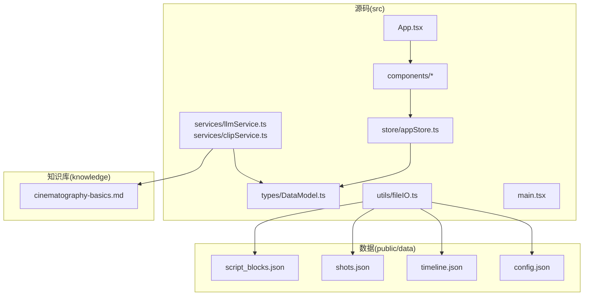
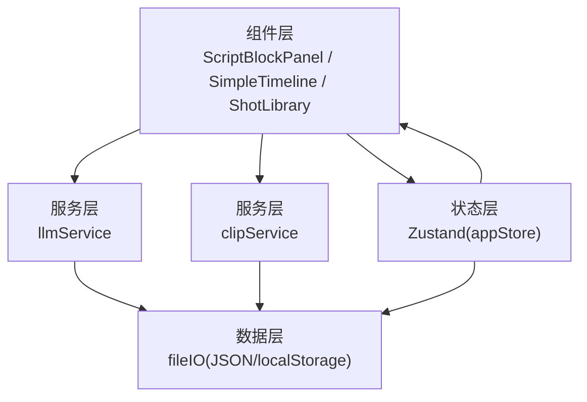
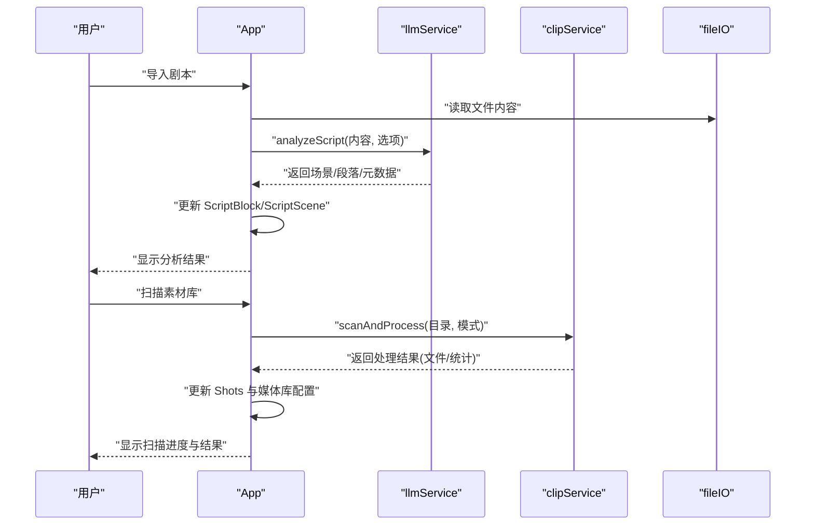
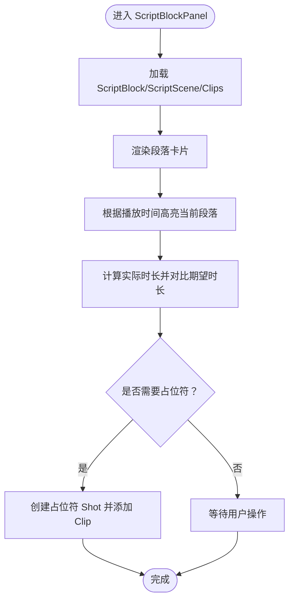
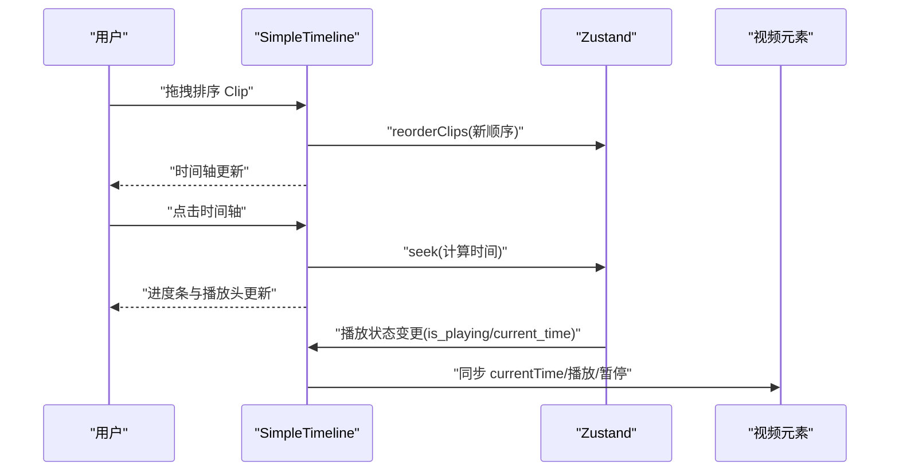
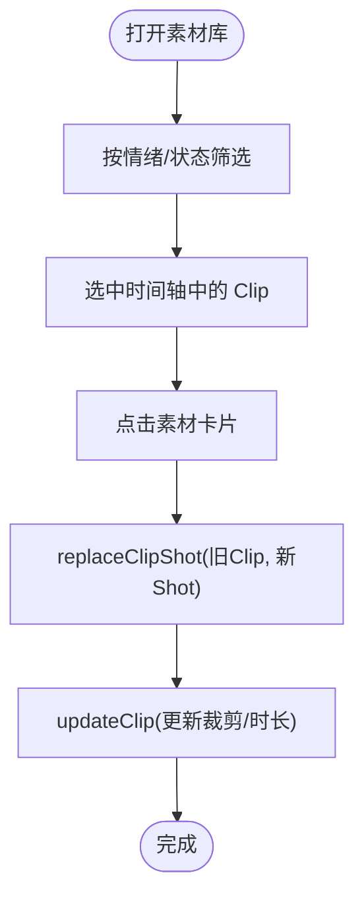
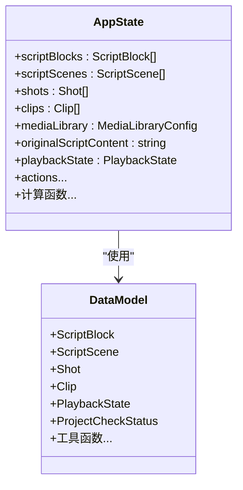
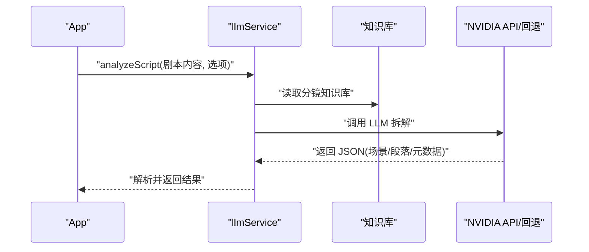
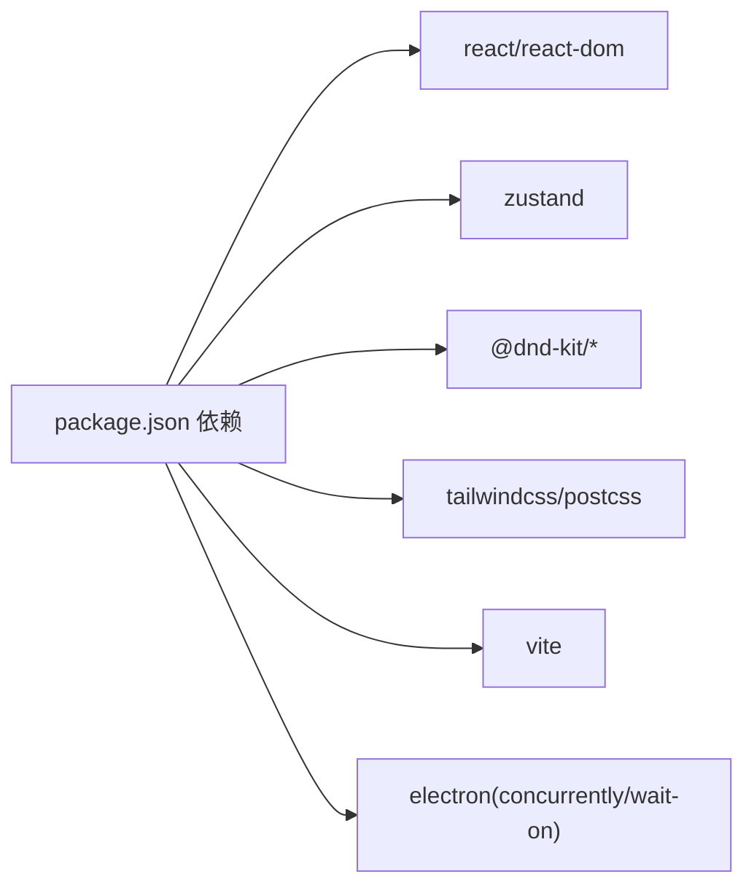

# 项目概述

<cite>
**本文引用的文件**
- [README.md](file://README.md)
- [package.json](file://package.json)
- [src/main.tsx](file://src/main.tsx)
- [src/App.tsx](file://src/App.tsx)
- [src/store/appStore.ts](file://src/store/appStore.ts)
- [src/types/DataModel.ts](file://src/types/DataModel.ts)
- [src/utils/fileIO.ts](file://src/utils/fileIO.ts)
- [src/services/llmService.ts](file://src/services/llmService.ts)
- [src/services/clipService.ts](file://src/services/clipService.ts)
- [src/components/ScriptBlockPanel.tsx](file://src/components/ScriptBlockPanel.tsx)
- [src/components/SimpleTimeline.tsx](file://src/components/SimpleTimeline.tsx)
- [src/components/ShotLibrary.tsx](file://src/components/ShotLibrary.tsx)
- [knowledge/cinematography-basics.md](file://knowledge/cinematography-basics.md)
- [USAGE_GUIDE.md](file://USAGE_GUIDE.md)
- [FEATURE_REPORT.md](file://FEATURE_REPORT.md)
</cite>

## 目录
1. [简介](#简介)
2. [项目结构](#项目结构)
3. [核心组件](#核心组件)
4. [架构总览](#架构总览)
5. [详细组件分析](#详细组件分析)
6. [依赖分析](#依赖分析)
7. [性能考量](#性能考量)
8. [故障排查指南](#故障排查指南)
9. [结论](#结论)
10. [附录](#附录)

## 简介
CGCUT 是一款“导演分镜验证”工具，目标是在 30 分钟内帮助导演从剧本过渡到可播放时间轴，并在分镜阶段快速验证“剧本段落 × 镜头组合 × 实际节奏”的一致性。它是一个“验证器”，并非完整的非线性编辑器（NLE），专注于节奏校验与素材匹配。

- 核心价值定位
  - 快速验证：通过“剧本段落面板 + 简化时间轴 + 素材库”的三层面板，即时发现节奏偏差与情绪不匹配。
  - 一键检查：内置项目状态检查，帮助快速定位“缺少段落占位”“缺少素材匹配”等问题。
  - AI 辅助：集成 LLM 进行剧本智能拆解，结合影视分镜专业知识库，确保镜头数量、景别与情绪标注的专业性；集成 CLIP 模型进行素材内容理解（MVP 阶段为模拟）。

- 主要功能特性
  - 剧本段落面板：显示段落、期望时长与实际时长对比，差异以颜色提示；播放时自动高亮当前段落。
  - 简化时间轴：单轨布局，支持拖拽排序、删除、基础裁剪；显示秒级刻度标尺；实时预览当前播放片段。
  - 素材库：按情绪筛选，支持替换占位符；支持扫描本地素材库并生成 CLIP 元数据（MVP 模拟）。
  - 项目检查：一键检查项目完整性，输出“是否可播放”的结论与缺失项清单。
  - 数据持久化：支持保存到浏览器 localStorage，导出项目为 JSON。

- 验收标准（MVP）
  - 能加载示例剧本并生成 ScriptBlock 列表
  - 能为每个 ScriptBlock 放置占位 Clip
  - 时间轴支持拖拽顺序、删除和裁剪
  - 替换 Shot 后，时间轴与段落时长立即更新
  - 时间轴显示时间刻度标尺
  - 支持从服务器加载素材

- 核心设计原则
  - 允许：剧本段落管理、单轨时间轴编辑、Clip 顺序调整、基础裁剪、素材替换、时长验证
  - 严禁：多轨编辑、音频编辑、特效/转场、复杂渲染参数、精细逐帧编辑

- 技术栈选择与优势
  - 前端：React 18 + TypeScript + Vite，开发体验佳、生态成熟、热更新快
  - 状态管理：Zustand，轻量、易用、无需 Provider 包装
  - 拖拽：@dnd-kit，专注单轨时间轴的排序与交互
  - 样式：Tailwind CSS，快速构建一致的 UI
  - 数据：JSON 文件 + localStorage，便于演示与迁移

- 项目结构概览
  - 源码位于 src/，按“类型定义 → 组件 → 服务 → 工具 → 入口”组织
  - 数据位于 public/data/，包含 script_blocks.json、shots.json、timeline.json、config.json
  - 知识库位于 knowledge/，包含影视分镜专业知识库
  - 使用指南、功能优化报告、性能指南等文档位于根目录

**章节来源**
- [README.md](file://README.md#L1-L181)
- [USAGE_GUIDE.md](file://USAGE_GUIDE.md#L1-L126)
- [FEATURE_REPORT.md](file://FEATURE_REPORT.md#L1-L512)

## 项目结构
- 源码组织
  - types：数据模型与工具函数（时长计算、播放状态、Clip 操作）
  - components：三层面板与弹窗组件
  - services：LLM 与 CLIP 服务封装
  - store：全局状态（Zustand）
  - utils：文件 IO（加载/保存 JSON，localStorage）
  - 入口：main.tsx、App.tsx
- 数据文件
  - public/data/script_blocks.json：剧本段落
  - public/data/shots.json：素材镜头
  - public/data/timeline.json：时间轴状态
  - public/data/config.json：媒体服务器配置
- 知识库
  - knowledge/cinematography-basics.md：分镜知识库（景别、情绪、时长、拆解策略）

**图表来源**
- [src/main.tsx](file://src/main.tsx#L1-L11)
- [src/App.tsx](file://src/App.tsx#L1-L497)
- [src/store/appStore.ts](file://src/store/appStore.ts#L1-L195)
- [src/types/DataModel.ts](file://src/types/DataModel.ts#L1-L291)
- [src/utils/fileIO.ts](file://src/utils/fileIO.ts#L1-L95)
- [src/services/llmService.ts](file://src/services/llmService.ts#L1-L476)
- [src/services/clipService.ts](file://src/services/clipService.ts#L1-L394)
- [knowledge/cinematography-basics.md](file://knowledge/cinematography-basics.md#L1-L366)

**章节来源**
- [README.md](file://README.md#L118-L150)
- [src/main.tsx](file://src/main.tsx#L1-L11)
- [src/App.tsx](file://src/App.tsx#L1-L497)
- [src/store/appStore.ts](file://src/store/appStore.ts#L1-L195)
- [src/types/DataModel.ts](file://src/types/DataModel.ts#L1-L291)
- [src/utils/fileIO.ts](file://src/utils/fileIO.ts#L1-L95)
- [src/services/llmService.ts](file://src/services/llmService.ts#L1-L476)
- [src/services/clipService.ts](file://src/services/clipService.ts#L1-L394)
- [knowledge/cinematography-basics.md](file://knowledge/cinematography-basics.md#L1-L366)

## 核心组件
- 剧本段落面板（左侧）
  - 展示 ScriptBlock 列表，对比期望时长与实际时长，差异以颜色提示
  - 支持 Tab 在“原文”和“LLM拆解”之间切换
  - 播放时自动高亮当前段落
  - 可为段落一键创建占位 Clip（若无匹配素材则自动创建占位符 Shot）

- 简化时间轴（中间）
  - 单轨布局，支持拖拽排序、删除、基础裁剪（in/out 边缘）
  - 时间刻度标尺（秒级与半秒次刻度）
  - 视频预览播放器：实时预览当前播放片段，支持播放/暂停/停止/进度跳转
  - 占位符视觉标识：虚线边框 + 黄色“📌 占位符”标签，与真实素材清晰区分

- 素材库（右侧）
  - 按情绪与状态筛选，支持替换时间轴中的 Clip
  - 支持扫描本地素材库并生成 CLIP 元数据（MVP 模拟）
  - 提供素材管理弹窗（统计仪表盘、批量处理、进度可视化）

- 全局状态与数据流
  - Zustand 全局状态：ScriptBlock、ScriptScene、Shot、Clip、播放状态、媒体库配置
  - 文件 IO：从 public/data 加载初始数据，保存到 localStorage
  - 项目检查：一键检查项目完整性，输出 readyToPlay 与缺失项清单

**章节来源**
- [src/components/ScriptBlockPanel.tsx](file://src/components/ScriptBlockPanel.tsx#L1-L285)
- [src/components/SimpleTimeline.tsx](file://src/components/SimpleTimeline.tsx#L1-L414)
- [src/components/ShotLibrary.tsx](file://src/components/ShotLibrary.tsx#L1-L359)
- [src/store/appStore.ts](file://src/store/appStore.ts#L1-L195)
- [src/utils/fileIO.ts](file://src/utils/fileIO.ts#L1-L95)
- [src/App.tsx](file://src/App.tsx#L1-L497)

## 架构总览
CGCUT 采用“组件驱动 + 全局状态 + 服务封装”的前端架构：
- 组件层：三层面板与弹窗，负责用户交互与展示
- 状态层：Zustand 管理全局数据与播放状态
- 服务层：LLM 与 CLIP 服务封装，提供剧本拆解与素材理解能力
- 数据层：JSON 文件与 localStorage，支撑演示与数据持久化

**图表来源**
- [src/components/ScriptBlockPanel.tsx](file://src/components/ScriptBlockPanel.tsx#L1-L285)
- [src/components/SimpleTimeline.tsx](file://src/components/SimpleTimeline.tsx#L1-L414)
- [src/components/ShotLibrary.tsx](file://src/components/ShotLibrary.tsx#L1-L359)
- [src/store/appStore.ts](file://src/store/appStore.ts#L1-L195)
- [src/services/llmService.ts](file://src/services/llmService.ts#L1-L476)
- [src/services/clipService.ts](file://src/services/clipService.ts#L1-L394)
- [src/utils/fileIO.ts](file://src/utils/fileIO.ts#L1-L95)

## 详细组件分析

### 组件 A：App 应用入口与主面板
- 职责
  - 初始化项目数据（加载 JSON，设置默认媒体库配置）
  - 导入剧本（调用 LLM 服务进行拆解）、扫描素材库（调用 CLIP 服务）
  - 保存项目到 localStorage、导出项目为 JSON
  - 一键检查项目状态并弹出检查结果
- 关键流程
  - 剧本导入：读取文件 → 调用 LLM 分析 → 更新 ScriptBlock 与 ScriptScene → 显示进度与结果
  - 素材扫描：设置扫描参数 → 调用 CLIP 处理 → 更新 Shots 与媒体库统计 → 显示进度与结果
  - 项目检查：遍历 ScriptBlock 与 Clip，统计缺失项，输出 readyToPlay

**图表来源**
- [src/App.tsx](file://src/App.tsx#L1-L497)
- [src/services/llmService.ts](file://src/services/llmService.ts#L1-L476)
- [src/services/clipService.ts](file://src/services/clipService.ts#L1-L394)
- [src/utils/fileIO.ts](file://src/utils/fileIO.ts#L1-L95)

**章节来源**
- [src/App.tsx](file://src/App.tsx#L1-L497)

### 组件 B：剧本段落面板（ScriptBlockPanel）
- 职责
  - 展示 ScriptBlock 列表，对比期望与实际时长，差异以颜色提示
  - 播放时根据播放时间高亮当前 ScriptBlock
  - 一键为段落创建占位 Clip（若无匹配素材则创建占位符 Shot）
  - 支持 Tab 在“原文”和“LLM拆解”之间切换
- 关键算法
  - 计算 ScriptBlock 实际时长：遍历 Clips，求和 duration
  - 查找当前播放的 ScriptBlock：累加时间，定位当前 Clip 对应的 ScriptBlock

**图表来源**
- [src/components/ScriptBlockPanel.tsx](file://src/components/ScriptBlockPanel.tsx#L1-L285)
- [src/types/DataModel.ts](file://src/types/DataModel.ts#L195-L214)

**章节来源**
- [src/components/ScriptBlockPanel.tsx](file://src/components/ScriptBlockPanel.tsx#L1-L285)
- [src/types/DataModel.ts](file://src/types/DataModel.ts#L195-L214)

### 组件 C：简化时间轴（SimpleTimeline）
- 职责
  - 单轨时间轴，支持拖拽排序、删除、基础裁剪（in/out 边界）
  - 时间刻度标尺（秒级与半秒次刻度）
  - 视频预览播放器：播放/暂停/停止/进度跳转；与播放状态同步
  - 占位符视觉标识：虚线边框 + 黄色“📌 占位符”标签
- 关键交互
  - 拖拽排序：使用 @dnd-kit 的 SortableContext 与 DndContext
  - 点击时间轴跳转：计算点击位置对应的时间并 seek
  - 播放循环：requestAnimationFrame 递增 current_time，到达末尾自动停止并回到开头

**图表来源**
- [src/components/SimpleTimeline.tsx](file://src/components/SimpleTimeline.tsx#L1-L414)
- [src/store/appStore.ts](file://src/store/appStore.ts#L1-L195)

**章节来源**
- [src/components/SimpleTimeline.tsx](file://src/components/SimpleTimeline.tsx#L1-L414)
- [src/store/appStore.ts](file://src/store/appStore.ts#L1-L195)

### 组件 D：素材库（ShotLibrary）
- 职责
  - 展示 Shot 列表，按情绪与状态筛选
  - 支持替换时间轴中的 Clip（选中 Clip 后点击素材卡片）
  - 设置媒体库路径、标记素材状态、编辑标签与情绪、删除素材
  - 打开素材管理弹窗（统计仪表盘、批量处理、进度可视化）
- 关键流程
  - 替换流程：选中 Clip → 点击素材 → 调用 replaceClipShot → 更新 Clip 的 shot_id 与裁剪范围

**图表来源**
- [src/components/ShotLibrary.tsx](file://src/components/ShotLibrary.tsx#L1-L359)
- [src/types/DataModel.ts](file://src/types/DataModel.ts#L276-L291)
- [src/store/appStore.ts](file://src/store/appStore.ts#L1-L195)

**章节来源**
- [src/components/ShotLibrary.tsx](file://src/components/ShotLibrary.tsx#L1-L359)
- [src/types/DataModel.ts](file://src/types/DataModel.ts#L276-L291)

### 组件 E：全局状态与数据模型（Zustand + DataModel）
- 状态模型
  - scriptBlocks/scriptScenes/shots/clips/mediaLibrary/originalScriptContent
  - playbackState（current_time/is_playing/current_clip_index/current_clip_internal_time/current_script_block_id）
  - actions：addClip/updateClip/deleteClip/reorderClips/selectClip/selectScriptBlock/setHighlightedScriptBlock/setActiveTab/setPlaybackState/play/pause/seek
  - 计算函数：getScriptBlockActualDuration/getShotById/getClipById/checkProjectStatus
- 数据模型
  - ScriptBlock/ScriptScene/Shot/Clip/PlaybackState/ProjectCheckStatus
  - 工具函数：calculateScriptBlockDuration/calculateTotalDuration/findClipAtTime/createClip/updateClipTrim/replaceClipShot

**图表来源**
- [src/store/appStore.ts](file://src/store/appStore.ts#L1-L195)
- [src/types/DataModel.ts](file://src/types/DataModel.ts#L1-L291)

**章节来源**
- [src/store/appStore.ts](file://src/store/appStore.ts#L1-L195)
- [src/types/DataModel.ts](file://src/types/DataModel.ts#L1-L291)

### 组件 F：服务层（LLM 与 CLIP）
- LLM 服务
  - 使用 NVIDIA API（或回退到模拟）进行剧本拆解
  - 内嵌影视分镜知识库，强化 Prompt，确保每个场景拆解为 3-10 个镜头，标注景别、情绪与时长
  - 输出 scenes/blocks/metadata
- CLIP 服务
  - MVP 阶段模拟扫描与处理，生成 CLIP 元数据（标签、情绪、描述、嵌入向量等）
  - 支持批量处理、跳过已处理文件、提取关键帧（模拟）

**图表来源**
- [src/services/llmService.ts](file://src/services/llmService.ts#L1-L476)
- [knowledge/cinematography-basics.md](file://knowledge/cinematography-basics.md#L1-L366)

**章节来源**
- [src/services/llmService.ts](file://src/services/llmService.ts#L1-L476)
- [src/services/clipService.ts](file://src/services/clipService.ts#L1-L394)
- [knowledge/cinematography-basics.md](file://knowledge/cinematography-basics.md#L1-L366)

## 依赖分析
- 前端依赖
  - React 18 + TypeScript：类型安全与现代语法
  - Vite：快速开发与构建
  - @dnd-kit：单轨时间轴拖拽排序
  - Tailwind CSS：原子化样式
  - zustand：轻量全局状态管理
- 开发依赖
  - concurrently/wait-on：开发时同时启动前端与 Electron
  - electron：桌面应用打包（可选）
- 运行时数据
  - public/data 下的 JSON 文件与 localStorage

**图表来源**
- [package.json](file://package.json#L1-L36)

**章节来源**
- [package.json](file://package.json#L1-L36)

## 性能考量
- 时间轴渲染
  - 单轨布局，减少层级与重绘
  - 拖拽排序使用 @dnd-kit，仅更新受影响节点
- 播放循环
  - 使用 requestAnimationFrame 控制播放，帧间隔约 16.7ms
  - 仅在 is_playing 时更新 current_time，避免不必要的计算
- 数据计算
  - 时长计算与播放位置查找为 O(n) 遍历，n 为 Clips 数量，通常较小
  - 使用 Zustand 状态管理，避免冗余 re-render
- I/O 与 API
  - LLM/CLIP 调用为异步，使用进度模态框提示用户
  - JSON 读取与 localStorage 写入为同步操作，建议在主线程之外进行批处理

[本节为通用性能讨论，不直接分析具体文件]

## 故障排查指南
- 剧本导入失败
  - 检查文件格式：仅支持 .txt 与 .json；DOC/DOCX 需后端转换
  - 查看 LLM 分析状态：若返回 error，查看控制台与提示信息
- 素材库扫描失败
  - 确认已设置媒体库路径
  - 检查文件格式与路径权限（MVP 阶段为模拟，无真实 CLIP 调用）
- 时间轴无视频预览
  - 确认时间轴中存在 Clip 且对应 Shot 的 file_path 非空
  - 检查浏览器对视频格式的支持（MP4/WebM/OGG）
- 项目保存/导出异常
  - 保存到 localStorage：确认浏览器未禁用 localStorage
  - 导出项目：下载 JSON 文件，注意不包含实际视频文件，仅保存路径引用

**章节来源**
- [src/App.tsx](file://src/App.tsx#L1-L497)
- [src/utils/fileIO.ts](file://src/utils/fileIO.ts#L1-L95)
- [USAGE_GUIDE.md](file://USAGE_GUIDE.md#L1-L126)

## 结论
CGCUT 通过“剧本段落面板 + 简化时间轴 + 素材库”的三层面板设计，结合 LLM 与 CLIP 的 AI 能力，帮助导演在 30 分钟内从剧本过渡到可播放时间轴，并在分镜阶段快速验证节奏与情绪匹配。其技术栈选择兼顾开发效率与运行性能，状态管理与组件职责清晰，适合快速迭代与持续优化。MVP 验收标准明确，核心设计原则严格限定功能边界，确保工具聚焦于“验证”而非“编辑”。未来可在真实 CLIP 集成、素材库 DAM 系统完善、占位符替换自动化等方面进一步提升。

[本节为总结性内容，不直接分析具体文件]

## 附录
- 使用指南与典型工作流程
  - 导入剧本 → 导入视频素材 → 编辑时间轴 → 预览与调整 → 保存/导出项目
- 功能优化报告要点
  - 引入影视分镜知识库，优化 LLM Prompt，确保每个场景 3-10 个镜头
  - 建立专业素材库管理系统（统计仪表盘、批量处理、进度可视化）
  - 时间轴占位符清晰标识，支持与剧本数据同步与一键替换

**章节来源**
- [USAGE_GUIDE.md](file://USAGE_GUIDE.md#L1-L126)
- [FEATURE_REPORT.md](file://FEATURE_REPORT.md#L1-L512)